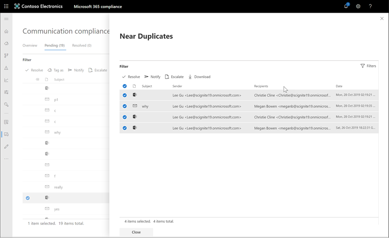

# Investigar y corregir las alertas de cumplimiento de las comunicaciones (vista previa)Investigate and remediate communication compliance alerts (preview)

Una vez que haya configurado las directivas de cumplimiento de comunicaciones, empezará a recibir alertas en el centro de cumplimiento de Microsoft 365 para los problemas de mensajes que coinciden con las condiciones de la Directiva.After you've configured your communication compliance policies, you'll start to receive alerts in the Microsoft 365 compliance center for message issues that match your policy conditions. Siga las instrucciones de flujo de trabajo aquí para investigar y corregir los problemas de alertas.Follow the workflow instructions here to investigate and remediate alert issues.

## Investigar alertasInvestigate alerts

El primer paso para investigar los problemas detectados por las directivas es revisar las alertas generadas en el centro de cumplimiento de Microsoft 365.The first step to investigate issues detected by your policies is to review generated alerts in the Microsoft 365 compliance center. Hay varias áreas en el centro de cumplimiento para ayudarle a investigar rápidamente las alertas, en función de cómo prefiera ver la agrupación de alertas:There are several areas in the compliance center to help you to quickly investigate alerts, depending on how you prefer to view alert grouping:

- **Página de inicio de cumplimiento de comunicaciones**: cuando inicie [https://compliance.microsoft.com](https://compliance.microsoft.com) sesión en uso de credenciales para una cuenta de administrador en la organización de Microsoft 365, seleccione**información general sobre** **cumplimiento** > de comunicaciones para mostrar la Página principal de cumplimiento de la comunicación.**Communication compliance home page**: When you sign in to [https://compliance.microsoft.com](https://compliance.microsoft.com) using credentials for an admin account in your Microsoft 365 organization, select **Communication compliance** > **Overview** to display the communication compliance home page. Aquí verá:Here you'll see:
    - Alertas que deben revisarse en la lista de gravedad alta a baja.Alerts needing review listed from high to low severity. Seleccione una alerta para iniciar la página Detalles de alerta y para iniciar acciones de corrección.Select an alert to launch the alert details page and to start remediation actions.
    - Coincidencias de directivas recientes ordenadas por nombre de directiva.Recent policy matches listed by policy name.
    - Elementos resueltos enumerados por nombre de directiva.Resolved items listed by policy name.
    - Escalaciones enumeradas por nombre de directiva.Escalations listed by policy name.
    - Los usuarios con más coincidencias de directivas, enumeradas de mayor a menor número de coincidencias.Users with the most policy matches, listed from the most to the least number of matches.
- **Ficha Alertas**: Navegue a \*\*\*\* > **alertas** de cumplimiento de comunicaciones para mostrar las alertas agrupadas por la Directiva de cumplimiento de comunicaciones coincidentes.**Alerts tab**: Navigate to **Communication compliance** > **Alerts** to display alerts grouped by matched communication compliance policy. Esta vista permite ver rápidamente qué directivas de cumplimiento de comunicación están generando la mayoría de las alertas ordenadas por gravedad.This view allows you to quickly see which communication compliance policies are generating the most alerts ordered by severity.  Para iniciar acciones de corrección, expanda una directiva para seleccionar una alerta específica y para iniciar la página Detalles de alerta.To start remediation actions, expand a policy to select a specific alert and to launch the alert details page.
- **Pestaña Directivas**: Navegue a \*\*\*\* > **directivas** de cumplimiento de comunicaciones para mostrar las directivas de cumplimiento de comunicación configuradas para la organización de Microsoft 365.**Policies tab**: Navigate to **Communication compliance** > **Policies** to display communication compliance policies configured for your Microsoft 365 organization. Cada directiva enumerada incluye el número de alertas que necesitan revisión.Each policy listed includes the count of alerts that need review. Al seleccionar una directiva, se muestran todas las alertas pendientes de las coincidencias con la Directiva, se selecciona una alerta específica para iniciar la página de detalles de la Directiva y se inician las acciones de corrección.Selecting a policy displays all the pending alerts for matches to the policy, select a specific alert to launch the policy details page and to start remediation actions.

### Uso de filtrosUsing filters

El siguiente paso es ordenar los mensajes para que sea más fácil investigar las alertas.The next step is to sort the messages so that it's easier for you to investigate alerts. El cumplimiento de la comunicación admite el filtrado de varios niveles para varios campos de mensaje para ayudarle a investigar y revisar rápidamente los mensajes con coincidencias de directivas.Communication compliance supports multi-level filtering for several message fields to help you quickly investigate and review messages with policy matches. El filtrado está disponible para los elementos pendientes y resueltos para cada directiva configurada.Filtering is available for pending and resolved items for each configured policy. Puede configurar consultas de filtro para una directiva o configurar y guardar consultas de filtro personalizadas y predeterminadas para usarlas en cada Directiva específica.You can configure filter queries for a policy or configure and save custom and default filter queries for use in each specific policy. Después de configurar los campos de un filtro, verá los campos de filtro que se muestran en la parte superior de la cola de mensajes de alerta que puede configurar para valores de filtro específicos.After configuring fields for a filter, you'll see the filter fields displayed on the top of the alert message queue that you can configure for specific filter values.

Para obtener una lista completa de los filtros y los detalles de los campos, consulte [filtros](communication-compliance-feature-reference.md#filters) en el tema de referencia de características.For a complete list of filters and field details, see [Filters](communication-compliance-feature-reference.md#filters) in the feature reference topic.

#### Para configurar un filtroTo configure a filter

1. Inicie sesión [https://compliance.microsoft.com](https://compliance.microsoft.com) con las credenciales de una cuenta de administrador en la organización de Microsoft 365.Sign into [https://compliance.microsoft.com](https://compliance.microsoft.com) using credentials for an admin account in your Microsoft 365 organization.

2. En el centro de cumplimiento de Microsoft 365, vaya a **cumplimiento de comunicaciones**.In the Microsoft 365 compliance center, go to **Communication compliance**.

3. Seleccione la pestaña **directivas** y, a continuación, seleccione una directiva de investigación, haga doble clic para abrir la página **Directiva** .Select the **Policies** tab and then select a policy for investigation, double-click to open the **Policy** page.

4. En la página **Directiva** , seleccione la pestaña **pendiente** o **resuelto** para mostrar los elementos que se van a filtrar.On the **Policy** page, select either the **Pending** or **Resolved** tab to display the items for filtering.

5. Seleccione el control **filtros** para abrir la página de detalles de **filtros** .Select the **Filters** control to open the **Filters** details page.

6. Active una o más casillas para habilitar los filtros para estas alertas.Select one or more checkboxes to enable filters for these alerts. Puede elegir entre varios filtros, incluidos *fecha*, *remitente*, *asunto/título*, *clasificadores*, etc.You can choose from numerous filters, including *Date*, *Sender*, *Subject/Title*, *Classifiers*, and more.

7. Si desea guardar el filtro seleccionado como filtro predeterminado, seleccione **Guardar como predeterminado**.If you'd like to save the filter selected as the default filter, select **Save as default**. Si desea usar este filtro como filtro guardado, seleccione **listo**.If you want to use this filter as a saved filter, select **Done**.

8. Si desea guardar los filtros seleccionados como una consulta de filtro, seleccione **guardar el control de consulta** después de haber configurado al menos un valor de filtro.If you'd like to save the selected filters as a filter query, select **Save the query** control after you've configured at least one filter value. Escriba un nombre para la consulta de filtro y seleccione **Guardar**.Enter a name for the filter query and select **Save**. Este filtro está disponible para usarse solo para esta directiva y aparece en la sección **consultas de filtro guardadas** de la página de detalles de **filtros** .This filter is available to use for only this policy and is listed in the **Saved filter queries** section of the **Filters** details page.

    

### Uso del análisis de duplicados Near y ExactUsing near and exact duplicate analysis

Las directivas de cumplimiento de comunicaciones analizan y agrupan automáticamente los duplicados de mensajes cercanos y exactos sin ningún paso de configuración adicional.Communication compliance policies automatically scan and pre-group near and exact message duplicates without any additional configuration steps. Esto le permite corregir rápidamente mensajes similares uno a uno o un grupo, lo que reduce la carga de la investigación de mensajes para revisores.This allows you to quickly remediate similar messages one-by-one or as a group, reducing the message investigation burden for reviewers. A medida que se detectan duplicados, los controles de duplicados **cercanos** o los controles de **duplicados exactos** se muestran en la barra de herramientas acción de corrección.As duplicates are detected, the **Near Duplicates** and/or the **Exact Duplicates** controls are displayed in the remediation action toolbar.

#### Para corregir duplicadosTo remediate duplicates

1. Inicie sesión [https://compliance.microsoft.com](https://compliance.microsoft.com) con las credenciales de una cuenta de administrador en la organización de Microsoft 365.Sign into [https://compliance.microsoft.com](https://compliance.microsoft.com) using credentials for an admin account in your Microsoft 365 organization.

2. En el centro de cumplimiento de Microsoft 365, vaya a **cumplimiento de comunicaciones**.In the Microsoft 365 compliance center, go to **Communication compliance**.

3. Seleccione la pestaña **directivas** y, a continuación, seleccione una directiva de investigación, haga doble clic para abrir la página **Directiva** .Select the **Policies** tab and then select a policy for investigation, double-click to open the **Policy** page.

4. En la página **Directiva** , seleccione la pestaña **pendiente** o **resuelto** para mostrar los mensajes duplicados.On the **Policy** page, select either the **Pending** or **Resolved** tab to display duplicate messages.

5. Seleccione los controles **Near Duplicates** o **exactamente duplicados** para abrir la página de detalles de duplicados.Select the **Near Duplicates** or **Exact Duplicates** controls to open the duplicates details page.

6. Seleccione uno o más mensajes para corregir los controles de acción de estos mensajes.Select one or more messages to remediation action controls for these messages.

7. Seleccione **resolver**, **notificar**, **remitir por escalar**o **Descargar** para aplicar la acción a los mensajes duplicados seleccionados. elegido como filtro predeterminado.Select **Resolve**, **Notify**, **Escalate**, or **Download** to apply the action to the selected duplicate messages.elected as the default filter.

8. Seleccione **cerrar** después de completar las acciones de corrección en los mensajes.Select **Close** after completing the remediation actions on the messages.

    

## Corregir alertasRemediate alerts

Independientemente de dónde empiece a revisar las alertas o el filtrado que configure, el siguiente paso consiste en tomar medidas para corregir la alerta.No matter where you start to review alerts or the filtering you configure, the next step is to take action to remediate the alert. Inicie la corrección de alertas mediante el siguiente flujo de trabajo en las páginas **Directiva** o **alertas** :Start your alert remediation using the following workflow on the **Policy** or **Alerts** pages:

1. **Examine los conceptos básicos de los mensajes**: a veces es obvio que el origen o el asunto es un mensaje que se puede corregir inmediatamente.**Examine the message basics**: Sometimes it's obvious from the source or subject that a message can be immediately remediated. Puede que el mensaje sea falso o incorrectamente coincidente con una directiva y debe resolverse como falso positivo.It may be that the message is spurious or incorrectly matched to a policy and it should be resolved as a false positive. Seleccione el control de **falso positivo** para resolver inmediatamente la alerta y quitarla de la cola de alertas pendientes.Select the **False Positive** control to immediately resolve the alert and remove from the pending alert queue. En la información de origen o de remitente, es posible que ya sepa cómo se debe enrutar o administrar el mensaje en estas circunstancias.From the source or sender information, you may already know how the message should be routed or handled in these circumstances. Considere la posibilidad de usar los controles **etiquetar como** o **escalar** para asignar una etiqueta a los mensajes correspondientes o para enviar mensajes a un revisor designado.Consider using the **Tag as** or **Escalate** controls to assign a tag to applicable messages or to send messages to a designated reviewer.

    

2. **Examine los detalles del mensaje**: después de revisar los conceptos básicos del mensaje, es el momento de abrir un mensaje para examinar los detalles y para determinar las acciones de corrección adicionales.**Examine the message details**: After reviewing the message basics, it's time to open a message to examine the details and to determine further remediation actions. Seleccione un mensaje para ver la información del cuerpo y el encabezado del mensaje completo.Select a message to view the complete message header and body information. Hay disponibles varias vistas diferentes para ayudarle a decidir el curso adecuado de acción:Several different views are available to help you decide the proper course of action:

    - **Vista de código fuente**: esta vista es la vista de mensajes estándar que normalmente se ve en la mayoría de las plataformas de mensajería basadas en Web.**Source view**: This view is the standard message view commonly seen in most web-based messaging platforms. La información de encabezado tiene el formato normal y el cuerpo del mensaje admite archivos gráficos incrustados y texto con ajuste de texto.The header information is formatted in the normal style and the message body supports imbedded graphic files and word-wrapped text.
    - **Vista**de texto: la vista de texto muestra una vista de texto con numeración de líneas del mensaje e incluye un resaltado de palabras clave para los términos que coinciden en la Directiva de cumplimiento de comunicación asociada.**Text view**: Text view displays a line-numbered text-only view of the message and includes keyword highlighting for terms matched in the associated communication compliance policy. El resaltado de palabras clave puede ayudarle a examinar rápidamente los mensajes largos del área de interés.Keyword highlighting can help you quickly scan long messages for the area of interest. Los archivos incrustados no se muestran y la numeración de las líneas esta vista resulta útil para hacer referencia a detalles relevantes entre varios revisores.Embedded files aren't displayed and the line numbering this view is helpful for referencing pertinent details among multiple reviewers.
    - **Vista de anotar**: esta vista permite a los revisores agregar anotaciones directamente en el mensaje que se guardan en la vista del mensaje.**Annotate view**: This view allows reviewers to add annotations directly on the message that are saved to the view of the message.
    - **Historial del usuario**: la vista historial del usuario muestra todas las demás alertas generadas por cualquier directiva de cumplimiento de la comunicación para el usuario que envía el mensaje.**User history**: User history view displays all other alerts generated by any communication compliance policy for the user sending the message.

    

3. **Decidir una acción de corrección**: ahora que ha revisado los detalles del mensaje para la alerta, puede elegir varias acciones de corrección:**Decide on a remediation action**: Now that you've reviewed the details of the message for the alert, you can choose several remediation actions:

    - **Resolve**: al seleccionar el control **resolver** , el mensaje se quita inmediatamente de la cola de **alertas pendientes** y no se pueden realizar más acciones en el mensaje.**Resolve**: Selecting the **Resolve** control immediately removes the message from the **Pending alerts** queue and no further action can be taken on the message. Al seleccionar **resolver**, básicamente ha cerrado la alerta sin más clasificación y no se puede volver a abrir para acciones adicionales.By selecting **Resolve**, you've essentially closed the alert without further classification and it can't be reopened for further actions. Todos los mensajes resueltos se muestran en la pestaña **resueltos** .All resolved messages are displayed in the **Resolved** tab.
    - **Falso positivo**: siempre puede resolver un mensaje como falso positivo en cualquier momento durante el flujo de trabajo de revisión de mensajes.**False Positive**: You can always resolve a message as a false positive at any point during the message review workflow. No se puede volver a abrir el mensaje y se muestran todos los mensajes falsos positivos en la ficha **resueltos** .The message cannot be reopened and all false positive messages are displayed in the **Resolved** tab.
    - **Etiqueta como**: etiquete el mensaje como *compatible*, *no compatible*o tan *dudoso* como relacionado con las directivas y los estándares de su organización.**Tag as**: Tag the message as *compliant*, *non-compliant*, or as *questionable* as it relates to the policies and standards for your organization. Agregar etiquetas y comentarios de etiquetado puede ayudarle a microfiltrar las alertas de las directivas para las escalaciones o como parte de otros procesos internos de revisión.Adding tags and tagging comments can help you micro-filter policy alerts for escalations or as part of other internal review processes. Una vez finalizado el etiquetado, también puede optar por resolver el mensaje para moverlo de la cola de revisión pendiente.After tagging is complete, you can also choose to resolve the message to move it out of the pending review queue.
    - **Notify**: puede usar el control **Notify** para asignar una plantilla de notificación personalizada a la alerta y para enviar un aviso de advertencia al usuario.**Notify**: You can use the **Notify** control to assign a custom notice template to the alert and to send a warning notice to the user. Elija la plantilla de aviso adecuada y seleccione **Enviar** a correo electrónico un recordatorio para el empleado que envió el mensaje y para resolver el problema.Choose the appropriate notice template, and select **Send** to email a reminder to the employee that sent the message and to resolve the issue.
    - **Escalar**: con el control **remitir** a, puede elegir quién más de la organización debe revisar el mensaje.**Escalate**: Using the **Escalate** control, you can choose who else in your organization should review the message. Elija de una lista de revisores configurados para enviar una notificación por correo electrónico solicitando una revisión adicional de la alerta de mensaje.Choose from a list of configured reviewers to send an email notification requesting additional review of the message alert. El revisor seleccionado puede usar un vínculo en la notificación de correo electrónico para ir directamente a los elementos que se han remitido a ellos para que los revisen.The selected reviewer can use a link in the email notification to go directly to items escalated to them for review.

4. **Determine si los detalles del mensaje deben archivarse fuera del cumplimiento de la comunicación**: los detalles del mensaje se pueden exportar o descargar si necesita archivar los mensajes en una solución de almacenamiento independiente.**Determine if message details should be archived outside of communication compliance**: Message details can be exported or downloaded if you need to archive the messages in a separate storage solution. Al seleccionar el control de **descarga** , se agregan automáticamente los mensajes seleccionados a un. Archivo ZIP que puede guardarse en el almacenamiento fuera de Microsoft 365.Selecting the **Download** control automatically adds selected messages to a .ZIP file that can be saved to storage outside of Microsoft 365.
