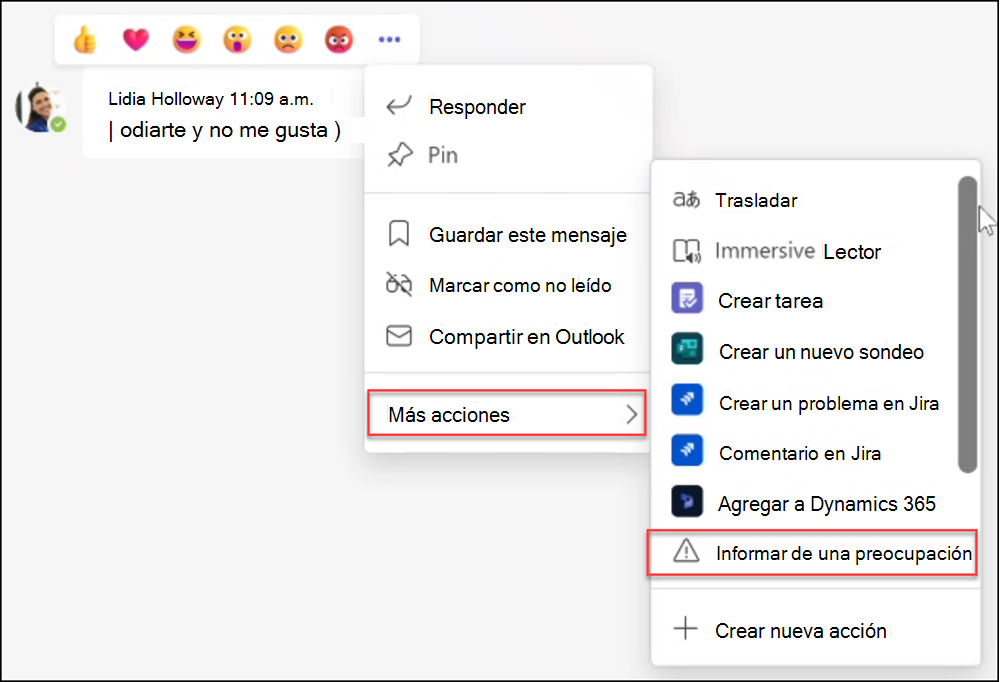

# Crear y administrar directivas de cumplimiento de comunicaciones

> [!IMPORTANT]
> Cumplimiento de comunicaciones de Microsoft Purview proporciona las herramientas para ayudar a las organizaciones a detectar infracciones de cumplimiento normativo (por ejemplo, SEC o FINRA), como información confidencial o confidencial, hostigamiento o amenazante del lenguaje y uso compartido de contenido para adultos. Creados con privacidad por diseño, los nombres de usuario se seudonimizan de forma predeterminada, los controles de acceso basados en roles se integran, los investigadores son admitidos por un administrador y los registros de auditoría están en vigor para garantizar la privacidad del nivel de usuario.

[!INCLUDE [purview-preview](../includes/purview-preview.md)]

## Directivas

> [!IMPORTANT]
> No se admite el uso de PowerShell para crear y administrar directivas de cumplimiento de comunicaciones. Para crear y administrar estas directivas, debe usar los controles de administración de directivas en la [solución de cumplimiento de comunicaciones](https://compliance.microsoft.com/supervisoryreview).

Puede crear directivas de cumplimiento de comunicaciones para organizaciones de Microsoft 365 en el portal de cumplimiento de Microsoft Purview. Las directivas de cumplimiento de comunicaciones definen qué comunicaciones y usuarios están sujetos a revisión en su organización, definen qué condiciones personalizadas deben cumplir las comunicaciones y especifican quién debe realizar revisiones. Los usuarios *asignados al rol Administradores de cumplimiento de comunicaciones pueden configurar directivas* y cualquier persona que tenga asignado este rol puede acceder a la página Cumplimiento de **comunicaciones** y a la configuración global de la portal de cumplimiento Microsoft Purview. Si es necesario, puede exportar el historial de modificaciones a una directiva a un archivo .csv (valores separados por comas) que también incluya el estado de las alertas pendientes de revisión, elementos escalados y elementos resueltos. No se puede cambiar el nombre de las directivas y se pueden eliminar cuando ya no se necesiten.

## Plantillas de directiva

Las plantillas de directiva son configuraciones de directiva predefinidas que puede usar para crear directivas rápidamente para abordar escenarios de cumplimiento comunes. Cada una de estas plantillas tiene diferencias en las condiciones y el ámbito, y todas las plantillas usan los mismos tipos de señales de examen. Puede elegir entre las siguientes plantillas de directiva:

|**Área**|**Plantilla de directiva**|**Detalles**|
|:-----|:-----|:-----|
| **Texto inadecuado** | Detección de texto inadecuado | - Ubicaciones: Exchange Online, Microsoft Teams, Yammer   - Dirección: entrante, saliente, interno   - Porcentaje de revisión: 100%   - Condiciones: clasificadores de amenazas, discriminación y acoso dirigido |
| **Imágenes inapropiadas** | Detección de imágenes inapropiadas | - Ubicaciones: Exchange Online, Microsoft Teams, Yammer   - Dirección: entrante, saliente, interno   - Porcentaje de revisión: 100%   - Condiciones: clasificadores de imágenes para adultos y racy |
| **Información confidencial** | Supervisión de información confidencial | - Ubicaciones: Exchange Online, Microsoft Teams, Yammer   - Dirección: entrante, saliente, interno   - Porcentaje de revisión: 10 %   - Condiciones: información confidencial, patrones de contenido integrados y tipos, opción de diccionario personalizado, datos adjuntos de más de 1 MB |
| **Cumplimiento normativo** | Supervisión del cumplimiento normativo | - Ubicaciones: Exchange Online, Microsoft Teams, Yammer   - Dirección: entrante, saliente   - Porcentaje de revisión: 10 %   - Condiciones: opción de diccionario personalizado, datos adjuntos mayores que 1 MB |
| **Conflicto de intereses** | Supervisión de conflictos de interés | - Ubicaciones: Exchange Online, Microsoft Teams, Yammer   - Dirección: Interno   - Porcentaje de revisión: 100%   - Condiciones: Ninguna |

Las comunicaciones se examinan cada 24 horas a partir del momento en que se crean las directivas. Por ejemplo, si crea una directiva de contenido inadecuado a las 11:00 a.m., la directiva recopilará señales de cumplimiento de comunicaciones cada 24 horas a las 11:00 a.m. todos los días. La edición de una directiva no cambia esta vez. Para ver la fecha y hora del último examen de una directiva, vaya a la columna *Último examen de directiva* de la página **Directiva** . Después de crear una nueva directiva, puede tardar hasta 24 horas en ver la primera fecha y hora del examen de directivas. La fecha y hora del último examen se convierten en la zona horaria del sistema local.

## Directiva de mensajes notificados por el usuario

>[!NOTE]
>La disponibilidad de los mensajes notificados por el usuario para las organizaciones con licencia y mediante [el cumplimiento de comunicaciones](/microsoft-365/compliance/communication-compliance-configure#subscriptions-and-licensing) y Microsoft Teams comenzó en mayo de 2022. Esta característica estará disponible antes del 31 de agosto de 2022 para todas las organizaciones con licencia y mediante cumplimiento de comunicaciones hasta julio de 2022. Para las organizaciones que empiezan a usar el cumplimiento de comunicaciones después de julio de 2022, la disponibilidad de la directiva de mensajes notificados por el usuario puede tardar hasta 30 días desde la fecha de licencia y el primer uso del cumplimiento de la comunicación.

Como parte de una defensa por capas para detectar y corregir mensajes inadecuados en su organización, puede complementar las directivas de cumplimiento de comunicaciones con los mensajes notificados por el usuario en Microsoft Teams. Esta característica permite a los usuarios de su organización informar a sí mismo de mensajes de chat internos y grupales inadecuados, como acoso o amenazante de lenguaje, uso compartido de contenido para adultos y uso compartido de información confidencial o confidencial, para ayudar a fomentar un entorno de trabajo seguro y compatible.

Habilitada de forma predeterminada en el [Centro de administración de Teams](/microsoftteams/manage-teams-in-modern-portal), la opción *Notificar una preocupación* en los mensajes de Teams permite a los usuarios de su organización enviar mensajes de chat internos y de grupo inadecuados para que los revisores de cumplimiento de comunicaciones revisen la directiva. Estos mensajes son compatibles con una directiva de sistema predeterminada que admite la generación de informes de mensajes en grupos de Teams y chats privados.

Cuando un usuario envía un mensaje de chat de Teams para su revisión, el mensaje se copia en la directiva de mensajes notificados por el usuario. Los mensajes notificados inicialmente permanecen visibles para todos los miembros del chat y no hay ninguna notificación a los miembros del chat o al remitente de que se ha notificado un mensaje en chats de canal, privados o grupales. Un usuario no puede notificar el mismo mensaje más de una vez y el mensaje permanece visible para todos los usuarios incluidos en la sesión de chat durante el proceso de revisión de directivas.

Durante el proceso de revisión, los revisores de cumplimiento de comunicaciones pueden realizar todas las [acciones de corrección](/microsoft-365/compliance/communication-compliance-investigate-remediate#step-3-decide-on-a-remediation-action) estándar en el mensaje, incluida la eliminación del mensaje del chat de Teams. En función de cómo se corrija el mensaje, el remitente y los destinatarios del mensaje verán diferentes [mensajes de notificación](/microsoftteams/communication-compliance#act-on-inappropriate-messages-in-microsoft-teams) en los chats de Teams después de la revisión.

Los mensajes notificados por el usuario de los chats de Teams son los únicos mensajes procesados por la directiva de mensajes notificados por el usuario y solo se pueden modificar los revisores asignados para la directiva. Todas las demás propiedades de directiva no son editables. Cuando se crea la directiva, los revisores iniciales asignados a la directiva son todos miembros del grupo de roles *Administradores de cumplimiento de comunicaciones* (si se rellenan con al menos un usuario) o todos los miembros del grupo de roles *global Administración* de la organización. El creador de directivas es un usuario seleccionado aleatoriamente del grupo de roles *Administradores de cumplimiento de comunicaciones* (si se rellena con al menos un usuario) o un usuario seleccionado aleatoriamente del grupo de roles *Global Administración* de la organización.

Los administradores deben asignar inmediatamente revisores personalizados a esta directiva según corresponda para su organización. Esto puede incluir revisores como el oficial de cumplimiento, el responsable de riesgos o los miembros del departamento de recursos humanos. Para personalizar los revisores de los mensajes de chat enviados como mensajes notificados por el usuario, complete los pasos siguientes:

1. Inicie sesión en [portal de cumplimiento Microsoft Purview](https://compliance.microsoft.com/) con las credenciales de una cuenta de administrador en la organización de Microsoft 365.
2. En el portal de cumplimiento, vaya a **Cumplimiento de comunicaciones**.
3. En la pestaña **Directiva** , seleccione la directiva *Mensajes notificados* por el usuario y seleccione **Editar**.
4. En el panel **Supervisión de mensajes notificados por el usuario** , asigne revisores para la directiva. Los revisores deben tener buzones hospedados en Exchange Online. Cuando los revisores se agregan a una directiva, reciben automáticamente un mensaje de correo electrónico que les notifica la asignación a la directiva y proporciona vínculos a información sobre el proceso de revisión.
5. Seleccione **Guardar**.

La opción *Notificar un problema* está habilitada de forma predeterminada y se puede controlar mediante directivas de mensajería de Teams en el [Centro de Administración de Teams](/microsoftteams/manage-teams-in-modern-portal). Los usuarios de su organización obtendrán automáticamente la directiva global, a menos que cree y asigne una directiva personalizada. Edite la configuración de la directiva global o cree y asigne una o varias directivas personalizadas para activar o desactivar la opción *Notificar una preocupación* . Para más información, consulte [Administración de directivas de mensajería en Teams](/microsoftteams/messaging-policies-in-teams).

>[!IMPORTANT]
>Si usa PowerShell para activar o desactivar la opción **Informes de usuario final** en el Centro de Administración de Teams, debe usar la [versión 4.2.0 o posterior del módulo cmdlets de Microsoft Teams](/MicrosoftTeams/teams-powershell-release-notes).

## Directiva para la integración de la administración de riesgos internos (versión preliminar)

Cuando los usuarios experimentan estrés laboral, pueden participar en actividades de riesgo. El estrés en el lugar de trabajo puede dar lugar a comportamientos poco prácticos o malintencionados por parte de algunos usuarios que podrían aparecer como un comportamiento potencialmente inadecuado en los sistemas de mensajería de la organización. El cumplimiento de comunicaciones puede proporcionar señales de riesgo detectadas en los mensajes aplicables a las directivas de usuario de riesgo de [administración de riesgos](/microsoft-365/compliance/insider-risk-management) internos mediante una directiva [de texto de detección inapropiada](#policy-templates) dedicada. Esta directiva se crea automáticamente (si se selecciona como opción) durante la configuración de una [pérdida de datos por parte de empleados de riesgo](/microsoft-365/compliance/insider-risk-management-policies#data-leaks-by-risky-users-preview) o [infracciones de directivas de seguridad por directivas de empleados de riesgo](/microsoft-365/compliance/insider-risk-management-policies#security-policy-violations-by-risky-users-preview) en la administración de riesgos internos.

Cuando se configura para una directiva de administración de riesgos internos, se crea una directiva dedicada denominada *Usuarios de riesgo en los mensajes( fecha de creación)* en cumplimiento de comunicaciones e incluye automáticamente a todos los usuarios de la organización en la directiva. Esta directiva comienza a detectar comportamientos de riesgo en los mensajes mediante los [clasificadores de amenazas, acoso y discriminación integrados](#classifiers) y envía automáticamente estas señales a la administración de riesgos internos. Si es necesario, esta directiva se puede editar para actualizar el ámbito de los usuarios incluidos y las condiciones y clasificadores de directivas.  

Los usuarios que envían 5 o más mensajes clasificados como potencialmente peligrosos en un plazo de 24 horas se incluyen automáticamente en el ámbito de las directivas de administración de riesgos internos que incluyen esta opción. Una vez dentro del ámbito, la directiva de administración de riesgos internos detecta actividades potencialmente de riesgo configuradas en la directiva y genera alertas según corresponda. Puede tardar hasta 48 horas desde el momento en que se envían mensajes de riesgo hasta el momento en que un usuario entra en el ámbito de una directiva de administración de riesgos internos. Si se genera una alerta para una actividad potencialmente de riesgo detectada por la directiva de administración de riesgos internos, el evento desencadenante de la alerta se identifica como origen de la actividad de riesgo de cumplimiento de comunicaciones.

Todos los usuarios asignados al grupo de roles [Insider Risk Management Investigators](/microsoft-365/compliance/insider-risk-management-plan#plan-for-the-review-and-investigation-workflow) se asignan automáticamente como revisores en la directiva de cumplimiento de comunicaciones dedicada. Si los investigadores de administración de riesgos deben revisar la alerta de usuario de riesgo asociada directamente en la página de alertas de cumplimiento de comunicaciones (vinculada desde los detalles de la alerta de administración de riesgos internos), deben agregarse manualmente al grupo de roles *Investigadores de cumplimiento de comunicaciones* .

Antes de integrar el cumplimiento de la comunicación con la administración de riesgos internos, también debe tener en cuenta las siguientes instrucciones al detectar mensajes que contienen texto potencialmente inadecuado:

- **Para organizaciones que no tienen una directiva *de texto Detección inapropiada* existente**. El asistente para directivas de administración de riesgos internos creará automáticamente el nuevo *usuario de riesgo en mensajes ( fecha de creación* ). En la mayoría de los casos, no se necesitan más acciones.
- **Para organizaciones con una directiva *de texto Detección inapropiada* existente**. El asistente para directivas de administración de riesgos internos creará automáticamente el nuevo *usuario de riesgo en mensajes ( fecha de creación* ). Aunque tendrá dos directivas de cumplimiento de comunicaciones para texto potencialmente inadecuado en los mensajes, los investigadores no verán alertas duplicadas para la misma actividad. Los investigadores de administración de riesgos internos solo verán alertas para la directiva de integración dedicada y los investigadores de cumplimiento de comunicaciones solo verán las alertas de la directiva existente. Si es necesario, puede editar la directiva dedicada para cambiar los usuarios en el ámbito o las condiciones de directiva individuales según corresponda.

## Pausar una directiva

Después de crear una directiva de cumplimiento de comunicaciones, la directiva puede pausarse temporalmente si es necesario. Pausar una directiva puede usarse para probar o solucionar problemas de coincidencias de directivas, o para optimizar las condiciones de la directiva. En lugar de eliminar una directiva en estas circunstancias, pausar una directiva también conserva las alertas y los mensajes de directiva existentes para las investigaciones y revisiones en curso. Pausar una directiva impide la inspección y la generación de alertas para todas las condiciones de mensaje de usuario definidas en la directiva durante el tiempo en que se pausa la directiva. Para pausar o reiniciar una directiva, los usuarios deben ser miembros del grupo de roles *Administradores de cumplimiento de comunicaciones* .

Para pausar una directiva, vaya a la página **Directiva** , seleccione una directiva y, a continuación, seleccione **Pausar directiva** en la barra de herramientas de acciones. En el panel **Pausar directiva** , confirme que desea pausar la directiva; para ello, seleccione **Pausar**. En algunos casos, una directiva puede tardar hasta 24 horas en pausa. Una vez que la directiva está en pausa, no se crean alertas de mensajes que coincidan con la directiva. Sin embargo, los mensajes asociados a las alertas que se crearon antes de pausar la directiva siguen estando disponibles para su investigación, revisión y corrección.

El estado de la directiva de las directivas en pausa puede indicar varios estados:

- **Activo**: la directiva está activa
- **En pausa**: la directiva está totalmente en pausa.
- **Pausa:** la directiva está en proceso de pausa.
- **Reanudación**: directiva en proceso de reanudación.
- **Error al reanudar**: se ha encontrado un error al reanudar la directiva. Para el seguimiento de la pila de errores, mantenga el mouse sobre el error *al reanudar* el estado en la columna Estado de la página Directiva.
- **Error al pausar**: se ha encontrado un error al pausar la directiva. Para el seguimiento de la pila de errores, mantenga el mouse sobre el error *al pausar* el estado en la columna Estado de la página Directiva.

Para reanudar una directiva, vaya a la página **Directiva** , seleccione una directiva y, a continuación, seleccione **Reanudar directiva** en la barra de herramientas de acciones. En el panel **Reanudar directiva** , confirme que desea reanudar la directiva; para ello, seleccione **Reanudar**. En algunos casos, una directiva puede tardar hasta 24 horas en reanudarse. Una vez reanudada la directiva, se crearán alertas para los mensajes que coincidan con la directiva y estarán disponibles para la investigación, revisión y corrección.

## Copiar una directiva

En el caso de las organizaciones con directivas de cumplimiento de comunicaciones existentes, puede ser útil crear una nueva directiva a partir de una directiva existente. La copia de una directiva crea un duplicado exacto de una directiva existente, incluidos todos los usuarios dentro del ámbito, todos los revisores asignados y todas las condiciones de directiva. Algunos escenarios pueden incluir:

- **Límite de almacenamiento de directivas alcanzado**: las directivas de cumplimiento de comunicaciones activas tienen límites de almacenamiento de mensajes. Cuando se alcanza el límite de almacenamiento de una directiva, la directiva se desactiva automáticamente. Las organizaciones que necesitan seguir detectando, capturando y actuando en mensajes inadecuados cubiertos por la directiva desactivada pueden crear rápidamente una nueva directiva con una configuración idéntica.
- **Detectar y revisar mensajes inadecuados para diferentes grupos de usuarios**: es posible que algunas organizaciones prefieran crear varias directivas con la misma configuración, pero que incluyan diferentes usuarios dentro del ámbito y revisores diferentes para cada directiva.
- **Directivas similares con pequeños cambios**: en el caso de las directivas con configuraciones o condiciones complejas, puede ahorrar tiempo crear una nueva directiva a partir de una directiva similar.

Para copiar una directiva, los usuarios deben ser miembros de los grupos de roles *Administradores de cumplimiento de comunicaciones* o cumplimiento de *comunicaciones* . Después de crear una nueva directiva a partir de una directiva existente, puede tardar hasta 24 horas en ver los mensajes que coinciden con la nueva configuración de directiva.

Para copiar una directiva y crear una nueva, siga estos pasos:

1. Seleccione la directiva que desea copiar.
2. Seleccione **el botón Copiar** barra de comandos de la directiva en la barra de comandos o seleccione **Copiar directiva** en el menú de acciones de la directiva.
3. En el panel **Copiar directiva** , puede aceptar el nombre predeterminado de la directiva en el campo **Nombre de** directiva o cambiar el nombre de la directiva. El nombre de la directiva de la nueva directiva no puede ser el mismo que una directiva activa o desactivada existente. Complete el campo **Descripción** según sea necesario.
4. Si no necesita más personalización de la directiva, seleccione **Copiar directiva** para completar el proceso. Si necesita actualizar la configuración de la nueva directiva, seleccione **Personalizar directiva**. Esto inicia el Asistente para directivas para ayudarle a actualizar y personalizar la nueva directiva.

## Detección de actividad de directiva

Las comunicaciones se examinan cada hora a partir del momento en que se crean las directivas. Por ejemplo, si crea una directiva de contenido inadecuado a las 11:00 a.m., la directiva recopilará señales de cumplimiento de comunicaciones cada hora a partir de cuando se creó la directiva. La edición de una directiva no cambia esta vez. Para ver la fecha y hora del último examen de una directiva, vaya a la columna *Último examen de directiva* de la página **Directiva** . Después de crear una nueva directiva, puede tardar hasta una hora en ver la primera fecha y hora de examen de directivas. La fecha y hora del último examen se convierten en la zona horaria del sistema local.

En la tabla siguiente se describe el tiempo de detección de los tipos de contenido admitidos:

|**Tipo de contenido**|**Tiempo de detección**|
|:---------------|:--------------------|
| Email contenido del cuerpo | 1 hora |
| Contenido del cuerpo de Teams | 1 hora |
| Contenido del cuerpo de Yammer | 13 horas |
| Email OCR | 13 horas |
| Teams OCR | 13 horas |
| datos adjuntos Email | 13 horas |
| Datos adjuntos del equipo | 13 horas |
| Datos adjuntos modernos de Teams | 13 horas |
| Metadatos de Teams | 1 hora |
| metadatos de Email | 1 hora |
| Canales compartidos de Teams | 13 horas |

En el caso de las directivas existentes creadas antes del 31 de julio de 2022, puede tardar hasta 24 horas en detectar mensajes y revisar alertas que coincidan con estas directivas. Para reducir la latencia de estas directivas, [copie la directiva existente](/microsoft-365/compliance/communication-compliance-policies#copy-a-policy) y cree una nueva a partir de la copia. Si no necesita conservar ningún dato de la directiva anterior, se puede pausar o eliminar.

Para identificar una directiva anterior, revise *la columna Último examen de directiva* en la página **Directiva** . Las directivas anteriores mostrarán una fecha completa para el examen, mientras que las directivas creadas después del 31 de julio de 2022 se mostrarán *hace una hora* para el examen. Otra opción para reducir la latencia es esperar hasta el 31 de diciembre de 2022 para que las directivas existentes se migren automáticamente a los nuevos criterios de detección.

## Notificación de límite de almacenamiento (versión preliminar)

Cada directiva de cumplimiento de comunicaciones tiene un tamaño de límite de almacenamiento de 100 GB o 1 millón de mensajes, lo que se alcance primero. A medida que la directiva se acerca a estos límites, los correos electrónicos de notificación se envían automáticamente a los usuarios *asignados* a los grupos de roles *Administradores de cumplimiento de comunicaciones* o cumplimiento de comunicaciones. Los mensajes de notificaciones se envían cuando el tamaño de almacenamiento o el recuento de mensajes alcanzan el 80, el 90 y el 95 por ciento del límite. Cuando se alcanza el límite de directivas, la directiva se desactiva automáticamente y la directiva deja de procesar mensajes para las alertas.

> [!IMPORTANT]
> Si se desactiva una directiva debido a que se alcanzan los límites de almacenamiento y mensajes, asegúrese de evaluar cómo administrar la directiva desactivada. Si elimina la directiva, todos los mensajes, los datos adjuntos asociados y las alertas de mensajes se eliminarán permanentemente. Si necesita mantener estos elementos para su uso futuro, no elimine la directiva desactivada.

Para administrar directivas que se acercan a los límites de almacenamiento y mensajes, considere la posibilidad de realizar una copia de la directiva para mantener la continuidad de la cobertura o realizar las siguientes acciones para ayudar a minimizar el tamaño de almacenamiento de directivas y los recuentos de mensajes actuales:

- Considere la posibilidad de reducir el número de usuarios asignados a la directiva. Quitar usuarios de la directiva o crear directivas diferentes para distintos grupos de usuarios puede ayudar a ralentizar el crecimiento del tamaño de la directiva y del total de mensajes.
- Examine la directiva en busca de alertas excesivas de falsos positivos. Considere la posibilidad de agregar excepciones o cambios a las condiciones de directiva para pasar por alto las alertas comunes de falsos positivos.
- Si una directiva ha alcanzado los límites de almacenamiento o mensaje y se ha desactivado, realice una copia de la directiva para seguir detectando y realizando acciones para las mismas condiciones y usuarios.

## Configuración de la directiva

### Usuarios

Puede elegir seleccionar **Todos los usuarios** o definir usuarios específicos en una directiva de cumplimiento de comunicaciones. Al seleccionar **Todos los usuarios**, se aplica la directiva a todos los usuarios y a todos los grupos en los que se incluya cualquier usuario como miembro. Al definir usuarios específicos, la directiva se aplica a los usuarios definidos y a todos los grupos en los que los usuarios definidos se incluyan como miembro.

### Dirección

De forma predeterminada, se muestra la condición **Direction is (Dirección)** y no se puede quitar. La configuración de la dirección de comunicación de una directiva se elige de forma individual o conjunta:

- **Entrante**: detecta las comunicaciones enviadas **a** los usuarios supervisados desde remitentes externos e internos, incluidos otros usuarios supervisados de la directiva.
- **Saliente**: detecta las comunicaciones enviadas **desde** usuarios supervisados a destinatarios externos e internos, incluidos otros usuarios supervisados de la directiva.
- **Interno**: detecta las comunicaciones **entre** los usuarios o grupos supervisados de la directiva.

### Tipos de información confidencial

Tiene la opción de incluir tipos de información confidencial como parte de la directiva de cumplimiento de comunicaciones. Los tipos de información confidencial son tipos de datos predefinidos o personalizados que pueden ayudar a identificar y proteger los números de tarjeta de crédito, los números de cuenta bancaria, los números de pasaporte y mucho más. Como parte de [Learn about Prevención de pérdida de datos de Microsoft Purview](/microsoft-365/compliance/dlp-learn-about-dlp), la configuración de información confidencial puede usar patrones, proximidad de caracteres, niveles de confianza e incluso tipos de datos personalizados para ayudar a identificar y marcar el contenido que puede ser confidencial. Los tipos de información confidencial predeterminados son:

- Financiera
- Medicina y salud
- Privacidad
- Tipo de información personalizada

> [!IMPORTANT]
> Los SIT tienen dos formas diferentes de definir los parámetros de recuento de instancias únicos máximos. Para obtener más información, consulte [Valores admitidos de recuento de instancias para SIT](/microsoft-365/compliance/create-a-custom-sensitive-information-type#instance-count-supported-values-for-sit).

Para obtener más información sobre los detalles de información confidencial y los patrones incluidos en los tipos [predeterminados, consulte Definiciones de entidades de tipo de información confidencial](/microsoft-365/compliance/sensitive-information-type-entity-definitions).

### Diccionarios de palabras clave personalizadas

Configure diccionarios de palabras clave personalizadas (o léxicos) para proporcionar una administración sencilla de palabras clave específicas de su organización o sector. Los diccionarios de palabras clave admiten hasta 100 KB de términos (después de la compresión) en el diccionario y admiten cualquier idioma. El límite de inquilino también es de 100 KB después de la compresión. Si es necesario, puede aplicar varios diccionarios de palabras clave personalizadas a una sola directiva o tener un único diccionario de palabras clave por directiva. Estos diccionarios se asignan en una directiva de cumplimiento de comunicaciones y se pueden obtener de un archivo (como un .csv o una lista de .txt) o de una lista que puede [importar en el portal de cumplimiento](/microsoft-365/compliance/create-a-keyword-dictionary). Use diccionarios personalizados cuando necesite admitir términos o idiomas específicos de su organización y directivas.

### Clasificadores

[Los clasificadores globales y entrenables integrados](/microsoft-365/compliance/classifier-learn-about) inspeccionan los mensajes enviados o recibidos en todos los canales de comunicación de la organización para detectar diferentes tipos de problemas de cumplimiento. Los clasificadores usan una combinación de inteligencia artificial y de palabras clave para identificar lenguaje en los mensajes que es probable que infrinja las directivas contra el acoso.

Las directivas que usan clasificadores inspeccionarán y evaluarán los mensajes con un recuento de palabras de seis o más. Los mensajes que contienen menos de seis palabras no se evalúan en las directivas mediante clasificadores. Para identificar y tomar medidas en los mensajes más cortos que contienen contenido inadecuado, se recomienda incluir un diccionario de palabras clave personalizado para las directivas de cumplimiento de comunicaciones que detecten este tipo de contenido.

El cumplimiento de comunicaciones puede usar clasificadores globales y entrenables integrados específicos para inspeccionar las comunicaciones de los siguientes tipos de lenguaje y contenido:

|**Clasificador**|**Descripción**|
|:-------------|:--------------|
| **Imágenes para adultos** | Detecta imágenes que son potencialmente explícitas sexualmente por naturaleza. |
| **Sabotaje corporativo (versión preliminar)** | Detecta mensajes que pueden mencionar actos que dañan o destruyen activos o propiedades corporativos. Este clasificador puede ayudar a los clientes a administrar las obligaciones de cumplimiento normativo, como los estándares de protección de infraestructura crítica de NERC o las regulaciones estatales como el Capítulo 9.05 RCW en el estado de Washington. |
| **Quejas de clientes (versión preliminar)** | Detecta mensajes que pueden sugerir quejas de clientes realizadas en los productos o servicios de su organización, según lo exija la ley para los sectores regulados. Este clasificador puede ayudar a los clientes a administrar las obligaciones de cumplimiento normativo, como la Regla FINRA 4530, FINRA 4513, FINRA 2111, Consumer Financial Protection Bureau, Code of Federal Regulations Title 21: Food and Drugs, and the Federal Trade Commission Act. |
| **Discriminación** | Detecta un lenguaje discriminatorio potencialmente explícito y es particularmente sensible al lenguaje discriminatorio contra las comunidades afroamericanas y negras en comparación con otras comunidades. |
| **Regalos & entretenimiento (versión preliminar)** | Detecta mensajes que pueden sugerir intercambiar regalos o entretenimiento a cambio de servicio, lo que infringe las regulaciones relacionadas con el cohecho. Este clasificador puede ayudar a los clientes a administrar las obligaciones de cumplimiento normativo, como la Ley de Prácticas Corruptas Extranjeras (FCPA), la Ley de Cohecho del Reino Unido y la Regla FINRA 2320. |
| **Imágenes de Gory** | Detecta imágenes que potencialmente representan violencia y sangre. |
| **Acoso** | Detecta conductas potencialmente ofensivas dirigidas a personas relacionadas con la raza, el color, la religión, el origen nacional. |
| **Lavado de dinero (versión preliminar)** | Detecta signos que pueden sugerir lavado de dinero o participación en actos para ocultar o ocultar el origen o destino de los ingresos. Este clasificador puede ayudar a los clientes a administrar las obligaciones de cumplimiento normativo, como la Ley de Secreto Bancario, la Ley Patriota de EE. UU., la Regla FINRA 3310 y la Ley contra el Lavado de Dinero de 2020. |
| **Lenguaje soez** | Detecta expresiones potencialmente soeces que avergüenzan a la mayoría de las personas. |
| **Imágenes de Racy** | Detecta imágenes que son potencialmente sugerentes sexualmente por naturaleza, pero contienen contenido menos explícito que las imágenes que se consideran adultos. |
| **Connivencia normativa (versión preliminar)** | Detecta mensajes que pueden infringir los requisitos normativos contra la colusión, como un intento de ocultación de información confidencial. Este clasificador puede ayudar a los clientes a administrar las obligaciones de cumplimiento normativo, como la Ley Antimonopolio Sherman, la Ley de Intercambio de Valores de 1933, la Ley de Intercambio de Valores de 1934, la Ley de Asesores de Inversión de 1940, la Ley de la Comisión Federal y la Ley de Robinson-Patman. |
| **Manipulación de stock (versión preliminar)** | Detecta signos de posible manipulación bursátil, como recomendaciones para comprar, vender o mantener acciones que puedan sugerir un intento de manipular el precio de las acciones. Este clasificador puede ayudar a los clientes a administrar las obligaciones de cumplimiento normativo, como la Ley de Intercambio de Valores de 1934, la Regla FINRA 2372 y la Regla FINRA 5270. |
| **Amenaza** | Detecta posibles amenazas para cometer violencia o daños físicos a una persona o propiedad. |
| **Divulgación no autorizada (versión preliminar)** | Detecta el uso compartido de información que contiene contenido que se designa explícitamente como confidencial o interno para personas no autorizadas. Este clasificador puede ayudar a los clientes a administrar las obligaciones de cumplimiento normativo, como la regla FINRA 2010 y la regla sec 10b-5. |

> [!IMPORTANT]
> Los clasificadores en versión preliminar pueden detectar un gran volumen de contenido masivo de remitentes o boletines de noticias debido a un problema conocido. Aunque estos clasificadores están en versión preliminar, puede mitigar la detección de grandes volúmenes de contenido de remitentes o boletines de noticias en masa agregando que el [*mensaje no se envía a ninguna de estas condiciones de dominios*](/microsoft-365/compliance/communication-compliance-policies#conditional-settings) a las directivas con una lista de dominios que se excluirán.

> [!NOTE]
> Las directivas que usan clasificadores de amenazas, acoso y blasfemia en inglés inspeccionarán y evaluarán los mensajes con un recuento de palabras de tres o más. Los mensajes que contienen menos de tres palabras no se evalúan en las directivas que usan estos tipos de clasificadores. Para identificar y tomar medidas en los mensajes más cortos que contienen contenido inadecuado, se recomienda incluir un diccionario de palabras clave personalizado para las directivas de cumplimiento de comunicaciones que detecten este tipo de contenido.

### Reconocimiento óptico de caracteres (OCR)

Configure directivas de cumplimiento de comunicaciones integradas o personalizadas para examinar e identificar texto impreso o manuscrito a partir de imágenes que pueden ser inapropiadas en su organización. La compatibilidad integrada con [Azure Cognitive Services y el examen óptico](/azure/cognitive-services/computer-vision/overview-ocr) para identificar texto en las imágenes ayudan a los analistas e investigadores a detectar y actuar en instancias en las que se puede perder una conducta inapropiada en las comunicaciones que principalmente no son textuales.

Puede habilitar el reconocimiento óptico de caracteres (OCR) en nuevas directivas a partir de plantillas, directivas personalizadas o actualizar directivas existentes para expandir la compatibilidad con el procesamiento de imágenes incrustadas y datos adjuntos. Cuando se habilita en una directiva creada a partir de una plantilla de directiva, el examen automático se admite para imágenes insertadas o adjuntas en el correo electrónico y mensajes de chat de Microsoft Teams. En el caso de las imágenes incrustadas en archivos de documento, no se admite el examen OCR. En el caso de las directivas personalizadas, se debe configurar una o varias opciones condicionales asociadas a palabras clave, clasificadores integrados o tipos de información confidencial en la directiva para habilitar la selección del examen OCR.

Las imágenes de 50 KB a 4 MB en los siguientes formatos de imagen se examinan y procesan:

- .jpg/.jpeg (grupo conjunto de expertos fotográficos)
- .png (gráficos de red portátiles)
- .bmp (mapa de bits)
- .tiff (formato de archivo de imagen de etiqueta)
- .pdf (formato de documento portátil)

> [!NOTE]
> Actualmente, el examen y la extracción de imágenes .pdf insertadas y adjuntas solo se admiten para mensajes de correo electrónico.

Al revisar las alertas pendientes de las directivas con OCR habilitado, las imágenes identificadas y coincidentes con las condiciones de directiva se muestran como elementos secundarios para las alertas asociadas. Puede ver la imagen original para evaluar el texto identificado en contexto con el mensaje original. Las imágenes detectadas pueden tardar hasta 48 horas en estar disponibles con alertas.

### Configuración condicional

Las condiciones que elija para la directiva se aplican a las comunicaciones desde el correo electrónico y los orígenes de terceros de su organización (por ejemplo, desde Instant Bloomberg).

En la tabla siguiente se explica más sobre cada condición.

|**Condition**|**Cómo usar esta condición**|
|:-----|:-----|
| **El contenido coincide con cualquiera de estos clasificadores** | Se aplica a la directiva cuando se incluyen o excluyen los clasificadores en un mensaje. Algunos clasificadores están predefinidos en su organización y los clasificadores personalizados deben configurarse por separado antes de que estén disponibles para esta condición. Solo se puede definir un clasificador como condición en una directiva. Para obtener más información sobre la configuración de clasificadores, consulte [Más información sobre los clasificadores entrenables (versión preliminar).](/microsoft-365/compliance/classifier-learn-about) |
| **El contenido contiene cualquiera de estos tipos de información confidencial** | Se aplica a la directiva cuando se incluyen o excluyen los tipos de información confidencial en un mensaje. Algunos clasificadores se definen previamente en el inquilino y los clasificadores personalizados se pueden configurar por separado o como parte del proceso de asignación de condición. Cada tipo de información confidencial que elija se aplica por separado y solo se debe aplicar uno de estos tipos de información confidencial para que la directiva se aplique al mensaje. Para obtener más información sobre los tipos de información confidencial personalizados, consulte [Información sobre los tipos de información confidencial](/microsoft-365/compliance/sensitive-information-type-learn-about). |
| **El mensaje se recibe de cualquiera de estos dominios**    **El mensaje no se recibe de ninguno de estos dominios** | Aplique la directiva para incluir o excluir dominios específicos en los mensajes recibidos. Escriba cada dominio y separe varios dominios con una coma. Cada dominio especificado se aplica por separado, solo se debe aplicar un dominio para que la directiva se aplique al mensaje. Si desea usar **El mensaje se recibe de cualquiera de estos dominios** para buscar mensajes de una dirección de correo electrónico específica, debe combinarlo con otra condición, como **Mensaje contiene cualquiera de estas palabras** o **Contenido coincide con cualquiera de estos clasificadores** o puede obtener resultados inesperados.    Si desea examinar todo el correo electrónico de un dominio específico, pero desea excluir los mensajes que no necesitan revisión (boletines, anuncios, etc.), debe configurar que **no se reciba un mensaje de ninguna de estas condición de dominios** que excluya la dirección de correo electrónico (por ejemplo, newsletter@contoso.com). |
| **El mensaje se envía a cualquiera de estos dominios**    **El mensaje no se envía a ninguno de estos dominios** | Aplique la directiva para incluir o excluir dominios específicos en los mensajes enviados. Escriba cada dominio y separe varios dominios con una coma. Cada dominio se aplica por separado, solo se debe aplicar un dominio para que la directiva se aplique al mensaje.    Si desea excluir todos los correos electrónicos enviados a dos dominios específicos, configurará que el **mensaje no se envíe a ninguna de estas condición de dominios** con los dos dominios (por ejemplo, "contoso.com,wingtiptoys.com"). |
| **El mensaje se clasifica con cualquiera de estas etiquetas**    **El mensaje no se clasifica con ninguna de estas etiquetas** | Para aplicar la directiva cuando se incluyen o excluyen determinadas etiquetas de retención en un mensaje. Las etiquetas de retención deben configurarse por separado y las etiquetas configuradas se eligen como parte de esta condición. Cada etiqueta que elija se aplica por separado (solo se debe aplicar una de estas etiquetas para que la directiva se aplique al mensaje). Para obtener más información sobre las etiquetas de retención, consulte [Información sobre las directivas de retención y las etiquetas de retención](/microsoft-365/compliance/retention).|
| **El mensaje contiene cualquiera de estas palabras**    **El mensaje no contiene ninguna de estas palabras** | Para aplicar la directiva cuando se incluyan o excluyan determinadas palabras o frases en un mensaje, escriba cada palabra separada por una coma. Para frases de dos palabras o más, use comillas alrededor de la frase. Cada palabra o frase que escriba se aplica por separado (solo se debe aplicar una palabra para que la directiva se aplique al mensaje). Para obtener más información sobre cómo escribir palabras o frases, consulte la sección siguiente [Matching words and phrases to emails or attachments](#matching-words-and-phrases-to-emails-or-attachments).|
| **Los datos adjuntos contienen cualquiera de estas palabras**    **Los datos adjuntos no contienen ninguna de estas palabras** | Para aplicar la directiva cuando se incluyan o excluyan determinadas palabras o frases en los datos adjuntos de un mensaje (por ejemplo, un documento de Word), escriba cada palabra separada por una coma. Para frases de dos palabras o más, use comillas alrededor de la frase. Cada palabra o frase que escriba se aplica por separado (solo se debe aplicar una palabra para que la directiva se aplique a los datos adjuntos). Para obtener más información sobre cómo escribir palabras o frases, consulte la sección siguiente [Matching words and phrases to emails or attachments](#matching-words-and-phrases-to-emails-or-attachments).|
| **Los datos adjuntos son cualquiera de estos tipos de archivo.**    **Los datos adjuntos no son ninguno de estos tipos de archivo.** | Para supervisar las comunicaciones que incluyen o excluyen tipos específicos de datos adjuntos, escriba las extensiones de archivo (como .exe o .pdf). Si desea incluir o excluir varias extensiones de archivo, escriba tipos de archivo separados por una coma (por ejemplo *,.exe,.pdf,.zip*). Solo debe coincidir una extensión de datos adjuntos para que se aplique la directiva.|
| **El tamaño del mensaje es mayor que**    **El tamaño del mensaje no es mayor que** | Para revisar los mensajes en función de un tamaño determinado, use estas condiciones para especificar el tamaño máximo o mínimo que puede tener un mensaje antes de que esté sujeto a revisión. Por ejemplo, si especifica que **el tamaño del mensaje es mayor que** \> **1,0 MB**, todos los mensajes de 1,01 MB y más grandes están sujetos a revisión. Puede elegir bytes, kilobytes, megabytes o gigabytes para esta condición.|
| **Los datos adjuntos son mayores que**    **Los datos adjuntos no son mayores que** | Para revisar los mensajes en función del tamaño de sus datos adjuntos, especifique el tamaño máximo o mínimo que pueden tener los datos adjuntos antes de que el mensaje y sus datos adjuntos estén sujetos a revisión. Por ejemplo, si especifica **Datos adjuntos de más de** \> **2,0 MB**, todos los mensajes con datos adjuntos de 2,01 MB o más están sujetos a revisión. Puede elegir bytes, kilobytes, megabytes o gigabytes para esta condición.|

#### Coincidencia de palabras y frases para mensajes de correo electrónico o datos adjuntos

Cada palabra que escriba y separe con una coma se aplica por separado (solo se debe aplicar una palabra para que la condición de directiva se aplique al correo electrónico o a los datos adjuntos). Por ejemplo, vamos a usar la condición, **Message contiene cualquiera de estas palabras**, con las palabras clave "banker", "confidential" y "insider trading" separadas por una coma (banker, confidential, "insider trading"). La política se aplica a cualquier mensaje que incluya la palabra "banker", "confidential" o la frase "insider trading". Solo una de estas palabras o frases debe aparecer para que esta condición de directiva se aplique. Las palabras del mensaje o los datos adjuntos deben coincidir exactamente con lo que escriba.

> [!IMPORTANT]
>
> Al importar un archivo de diccionario personalizado, cada palabra o frase debe separarse con un retorno de carro y en una línea independiente. Por ejemplo:
>
> *Banquero*  
> *Confidencial*  
> *trading de insider*

Para examinar los mensajes de correo electrónico y los datos adjuntos en busca de las mismas palabras clave, cree un [diccionario de palabras clave personalizado](/microsoft-365/compliance/create-a-keyword-dictionary) para los términos que desea examinar en los mensajes. Esta configuración de directiva identifica palabras clave definidas que aparecen en el mensaje de correo electrónico **O** en los datos adjuntos del correo electrónico. El uso de la configuración de directiva condicional estándar (*Message contiene cualquiera de estas palabras* y *Attachment contiene cualquiera de estas palabras*) para identificar términos en los mensajes y en los datos adjuntos requiere que los términos estén presentes tanto en el mensaje **como** en los datos adjuntos.

#### Especificar varias condiciones

Si especifica varias condiciones, Microsoft 365 usa todas las condiciones juntas para determinar cuándo aplicar la directiva de cumplimiento de comunicaciones a los elementos de comunicación. Al configurar varias condiciones, se deben cumplir todas las condiciones para que se aplique la directiva, a menos que escriba una excepción. Por ejemplo, necesita una directiva que se aplique si un mensaje contiene la palabra "trade" y es mayor que 2 MB. Sin embargo, si el mensaje también contiene las palabras "Aprobado por Contoso financial", la directiva no debe aplicarse. En este ejemplo, las tres condiciones se definirían de la siguiente manera:

- **El mensaje contiene cualquiera de estas palabras**, con la palabra clave "trade"
- **El tamaño del mensaje es mayor que**, con el valor 2 MB
- **El mensaje no contiene ninguna de estas palabras**, con las palabras clave "Aprobado por el equipo financiero de Contoso".

### Porcentaje de revisión

Si desea reducir la cantidad de contenido que se va a revisar, puede especificar un porcentaje de todas las comunicaciones que se rigen por una directiva de cumplimiento de comunicaciones. Se selecciona una muestra de contenido aleatoria en tiempo real del porcentaje total de contenido que coincida con las condiciones de directiva elegidas. Si quiere que los revisores revisen todos los elementos, puede configurar el **100 %** en una directiva de cumplimiento de comunicaciones.

## Directivas de alerta

Después de configurar una directiva, se crea automáticamente una directiva de alerta correspondiente y se generan alertas para los mensajes que coinciden con las condiciones definidas en la directiva. La creación de una directiva puede tardar hasta 24 horas en recibir alertas de indicadores de actividad. De forma predeterminada, a todas las directivas que coincidan con los desencadenadores de alerta se les asigna un nivel de gravedad medio en la directiva de alertas asociada. Las alertas se generan para una directiva de cumplimiento de comunicaciones una vez que se cumple el nivel de umbral del desencadenador de agregación en la directiva de alertas asociada. Una única notificación por correo electrónico se envía una vez cada 24 horas para las alertas, independientemente del número de mensajes individuales que coincidan con las condiciones de la directiva. Por ejemplo, Contoso tiene habilitada una directiva de contenido inadecuado y, para el 1 de enero, había 100 coincidencias de directivas que generaron seis alertas. A finales del 1 de enero se envía una única notificación por correo electrónico para las seis alertas.

En el caso de las directivas de cumplimiento de comunicaciones, los siguientes valores de directiva de alerta se configuran de forma predeterminada:

|**Desencadenador de directiva de alertas**|**Valor predeterminado**|
|:-----|:-----|
| Agregación | Agregación simple |
| Umbral | Valor predeterminado: 4 actividades   Mínimo: 3 actividades   Máximo: 2.147.483.647 actividades |
| Window | Valor predeterminado: 60 minutos   Mínimo: 60 minutos   Máximo: 10 000 minutos |

> [!NOTE]
> La configuración del desencadenador de umbral de directiva de alerta para las actividades admite un valor mínimo de 3 o superior para las directivas de cumplimiento de comunicaciones.

Puede cambiar la configuración predeterminada de los desencadenadores en el número de actividades, el período de las actividades y para usuarios específicos de las directivas de alertas en la página **Directivas de alerta** del portal de cumplimiento Microsoft Purview.

### Cambio del nivel de gravedad de una directiva de alerta

Si desea cambiar el nivel de gravedad asignado en una directiva de alertas para una directiva de cumplimiento de comunicaciones específica, siga estos pasos:

1. Inicie sesión en [portal de cumplimiento Microsoft Purview](https://compliance.microsoft.com) con las credenciales de una cuenta de administrador en la organización de Microsoft 365.

2. En el portal de cumplimiento Microsoft Purview, vaya a **Directivas**.

3. Seleccione **Office 365 alerta** en la página **Directivas** para abrir la página **Directivas de alertas**.

4. Active la casilla de la directiva de cumplimiento de comunicaciones que desea actualizar y, a continuación, seleccione **Editar directiva**.

5. En la pestaña **Descripción** , seleccione la lista desplegable **Gravedad** para configurar el nivel de alerta de directiva.

6. Seleccione **Guardar** para aplicar el nuevo nivel de gravedad a la directiva.

7. Seleccione **Cerrar** para salir de la página de detalles de la directiva de alertas.
