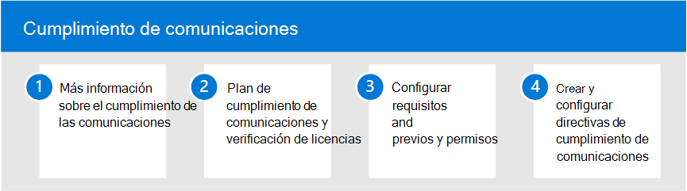

# Cumplimiento de comunicaciones en Microsoft 365Communication compliance in Microsoft 365

Proteger la información confidencial y detectar y actuar en incidentes de acoso en el lugar de trabajo es una parte importante del cumplimiento de las directivas y estándares internos.Protecting sensitive information and detecting and acting on workplace harassment incidents is an important part of compliance with internal policies and standards. El cumplimiento de las comunicaciones en Microsoft 365 ayuda a minimizar estos riesgos al ayudarle a detectar, capturar y realizar rápidamente acciones de corrección para el correo electrónico y las comunicaciones de Microsoft Teams.Communication compliance in Microsoft 365 helps minimize these risks by helping you quickly detect, capture, and take remediation actions for email and Microsoft Teams communications. Entre ellas se incluyen comunicaciones inapropiadas que contienen palabras profanas, amenazas y hostigamiento y comunicaciones que comparten información confidencial dentro y fuera de su organización.These include inappropriate communications containing profanity, threats, and harassment and communications that share sensitive information inside and outside of your organization.

## Configurar el cumplimiento de comunicaciones para Microsoft 365Configure communication compliance for Microsoft 365

Siga estos pasos para configurar el cumplimiento de las comunicaciones para su organización:Use the following steps to configure communication compliance for your organization:

1. Información sobre [el cumplimiento de la](communication-compliance.md) comunicación en Microsoft 365Learn about [communication compliance](communication-compliance.md) in Microsoft 365
2. Planear el cumplimiento [de las comunicaciones y](communication-compliance-plan.md) comprobar las [licencias](communication-compliance-configure.md#subscriptions-and-licensing)Plan for [communication compliance](communication-compliance-plan.md) and [verify licensing](communication-compliance-configure.md#subscriptions-and-licensing)
3. Revisar [las funcionalidades de solución y referencia de características](communication-compliance-feature-reference.md)Review [feature reference and solution capabilities](communication-compliance-feature-reference.md)
4. Configurar [requisitos previos](communication-compliance-configure.md#step-2-required-enable-the-audit-log) [y permisos](communication-compliance-configure.md#step-1-required-enable-permissions-for-communication-compliance)Configure [prerequisites](communication-compliance-configure.md#step-2-required-enable-the-audit-log) and [permissions](communication-compliance-configure.md#step-1-required-enable-permissions-for-communication-compliance)
5. Crear y configurar directivas [de cumplimiento de comunicaciones](communication-compliance-configure.md#step-5-required-create-a-communication-compliance-policy)Create and configure [communication compliance policies](communication-compliance-configure.md#step-5-required-create-a-communication-compliance-policy)

## Más información sobre el cumplimiento de la comunicaciónMore information about communication compliance

- [Investigar y corregir alertasInvestigate and remediate alerts](communication-compliance-investigate-remediate.md)
- [Caso práctico: Contoso configura rápidamente una directiva de idioma ofensivo para las comunicaciones de Microsoft Teams, Exchange y YammerCase study - Contoso quickly configures an offensive language policy for Microsoft Teams, Exchange, and Yammer communications](communication-compliance-case-study.md)