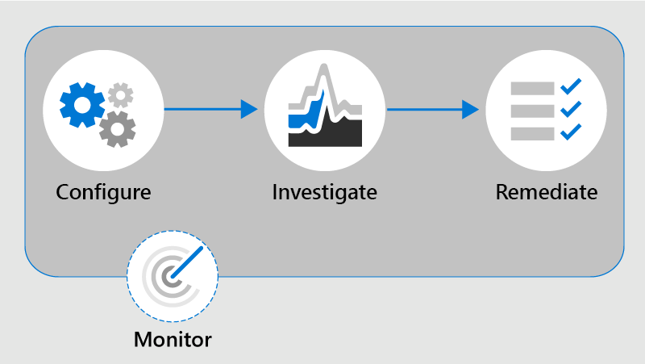

# Obtenga información sobre el cumplimiento de la comunicación en Microsoft 365Learn about communication compliance in Microsoft 365

El cumplimiento de la comunicación es una solución de riesgo de Insider en Microsoft 365 que contribuye a minimizar los riesgos de comunicación al ayudarle a detectar, capturar y actuar en mensajes inapropiados de la organización.Communication compliance is an insider risk solution in Microsoft 365 that helps minimize communication risks by helping you detect, capture, and act on inappropriate messages in your organization. Las directivas predefinidas y personalizadas le permiten analizar las comunicaciones internas y externas de las coincidencias de directivas para que puedan examinarlas los revisores designados.Pre-defined and custom policies allow you to scan internal and external communications for policy matches so they can be examined by designated reviewers. Los revisores pueden investigar el correo electrónico explorado, Microsoft Teams, Yammer o las comunicaciones de terceros de la organización y tomar las medidas adecuadas para asegurarse de que cumplen con los estándares de mensajes de la organización.Reviewers can investigate scanned email, Microsoft Teams, Yammer, or third-party communications in your organization and take appropriate actions to make sure they're compliant with your organization's message standards.

Las directivas de cumplimiento de comunicaciones de Microsoft 365 ayudan a superar muchos de los retos modernos asociados con el cumplimiento y las comunicaciones internas y externas, entre los que se incluyen:Communication compliance policies in Microsoft 365 help you overcome many modern challenges associated with compliance and internal and external communications, including:

- Análisis de tipos crecientes de canales de comunicaciónScanning increasing types of communication channels
- El volumen creciente de los datos de los mensajesThe increasing volume of message data
- Cumplimiento normativo y riesgo de multasRegulatory enforcement and the risk of fines

Además, puede haber una separación de tareas entre los administradores de ti y el equipo de administración del cumplimiento.Additionally, there may be a separation of duties between your IT admins and your compliance management team. El cumplimiento de la comunicación admite la separación entre la configuración de las directivas y la investigación y revisión de los mensajes.Communication compliance supports the separation between configuration of policies and the investigation and review of messages. Por ejemplo, el grupo de TI de su organización puede ser responsable de la configuración de los permisos de la función de cumplimiento de la comunicación, grupos y directivas, así como los investigadores y los revisores, pueden responsabilizarse de las acciones de clasificación, revisión y mitigación de mensajes.For example, the IT group for your organization may be responsible for setting up communication compliance role permissions, groups, and policies and investigators and reviewers may be responsible for message triage, review, and mitigation actions.

Para obtener una introducción rápida al cumplimiento de las normas de comunicación, consulte el vídeo " [detectar el acoso del lugar de trabajo y responder con el cumplimiento de la comunicación" en microsoft 365](https://youtu.be/z33ji7a7Zho) en el canal de [Microsoft](https://www.youtube.com/user/OfficeGarageSeries).For a quick overview of communication compliance, see the [Detect workplace harassment and respond with Communication Compliance in Microsoft 365](https://youtu.be/z33ji7a7Zho) video on the [Microsoft Mechanics channel](https://www.youtube.com/user/OfficeGarageSeries).

## Escenarios para el cumplimiento de la comunicaciónScenarios for communication compliance

Las directivas de cumplimiento de comunicaciones pueden ayudarle a revisar los mensajes de su organización en varias áreas de cumplimiento importantes:Communication compliance policies can assist with reviewing messages in your organization in several important compliance areas:

- **Directivas corporativas****Corporate policies**

    Los usuarios deben cumplir con el uso aceptable, los estándares éticos y otras directivas corporativas en todas sus comunicaciones relacionadas con la empresa.Users must comply with acceptable use, ethical standards, and other corporate policies in all their business-related communications. Las directivas de cumplimiento de comunicaciones pueden detectar coincidencias de directivas y ayudarle a tomar medidas correctivas para ayudar a mitigar estos tipos de incidentes.Communication compliance policies can detect policy matches and help you take corrective actions to help mitigate these types of incidents. Por ejemplo, puede analizar las comunicaciones de los usuarios de su organización para detectar posibles problemas de recursos humanos, como acoso o el uso de lenguaje inadecuado o ofensivo.For example, you could scan user communications in your organization for potential human resources concerns such as harassment or the use of inappropriate or offensive language.

- **Administración de riesgos****Risk management**

    Las organizaciones son responsables de todas las comunicaciones distribuidas en su infraestructura y en los sistemas de la red corporativa.Organizations are responsible to all communications distributed throughout their infrastructure and corporate network systems. El uso de directivas de cumplimiento de comunicaciones para ayudar a identificar y administrar posibles exposiciones y riesgos legales puede ayudar a minimizar los riesgos antes de que puedan dañar las operaciones corporativas.Using communication compliance policies to help identify and manage potential legal exposure and risk can help minimize risks before they can damage corporate operations. Por ejemplo, puede analizar los mensajes de su organización en busca de comunicaciones no autorizadas sobre proyectos confidenciales, como próximas adquisiciones, fusiones, divulgaciones de ingresos, reorganizaciones o cambios de equipo de liderazgo.For example, you could scan messages in your organization for unauthorized communications about confidential projects such as upcoming acquisitions, mergers, earnings disclosures, reorganizations, or leadership team changes.

- **Cumplimiento normativo****Regulatory compliance**

    La mayoría de las organizaciones deben cumplir con algún tipo de estándares de cumplimiento normativo como parte de los procedimientos de funcionamiento normales.Most organizations must comply with some type of regulatory compliance standards as part of their normal operating procedures. Estas normativas a menudo requieren que las organizaciones implementen algún tipo de supervisión o proceso de supervisión para la mensajería que sea adecuada para su sector.These regulations often require organizations to implement some type of supervisory or oversight process for messaging that is appropriate for their industry. La regla 3110 de la autoridad reguladora del sector financiero (FINRA) es un buen ejemplo de un requisito para que las organizaciones tengan procedimientos de supervisión para analizar las comunicaciones de los usuarios y los tipos de empresas en las que participa.The Financial Industry Regulatory Authority (FINRA) Rule 3110 is a good example of a requirement for organizations to have supervisory procedures in place to scan user communications and the types of businesses in which it engages. Otro ejemplo podría ser la necesidad de revisar las comunicaciones de agentes en su organización para protegerse contra el blanqueo de dinero, la colusión o las actividades de soborno.Another example may be a need to review broker-dealer communications in your organization to safeguard against potential money laundering, insider trading, collusion, or bribery activities. Las directivas de cumplimiento de comunicaciones pueden ayudar a su organización a cumplir estos requisitos proporcionando un proceso para analizar e informar sobre comunicaciones corporativas.Communication compliance policies can help your organization meet these requirements by providing a process to both scan and report on corporate communications. Para obtener más información sobre la compatibilidad con organizaciones financieras, consulte [key Compliance and Security Considerations for US bancaria and Capital Markets](../solutions/financial-services-secure-collaboration.md).For more information on support for financial organizations, see [Key compliance and security considerations for US banking and capital markets](../solutions/financial-services-secure-collaboration.md).

## Nuevas mejorasNew enhancements

El cumplimiento de la comunicación en Microsoft 365 ofrece varias características importantes para ayudar a solucionar los problemas de cumplimiento en sus plataformas de mensajería:Communication compliance in Microsoft 365 offers several important features to help address compliance concerns on your messaging platforms:

- Plantillas inteligentes y personalizablesIntelligent customizable templates
- Flujos de trabajo de corrección flexiblesFlexible remediation workflows
- Información que requiere acciónActionable insights

### Plantillas inteligentes y personalizablesIntelligent customizable templates

Las plantillas inteligentes y personalizables en el cumplimiento de la comunicación le permiten aplicar el aprendizaje automático para detectar de manera inteligente las violaciones de comunicación en su organización.Intelligent customizable templates in communication compliance allow you to apply machine learning to intelligently detect communication violations in your organization.

- **Plantillas preconfiguradas personalizables**: las nuevas plantillas de directiva ayudan a abordar los riesgos de comunicaciones más comunes.**Customizable pre-configured templates**: New policy templates help address the most common communications risks. La creación de directivas iniciales y la actualización de seguimiento ahora son más rápidas con un Antiacoso predefinido y un lenguaje ofensivo, información confidencial y plantillas de cumplimiento normativo.Initial policy creation and follow-on updating are now quicker with pre-defined anti-harassment and offensive language, sensitive information, and regulatory compliance templates.
- **Compatibilidad con nuevos equipos de aprendizaje**: la amenaza integrada, el acoso, los términos blasfemos y los [clasificadores](classifier-get-started-with.md) de imágenes ayudan a reducir los falsos positivos en los mensajes examinados, lo que ahorra tiempo a los revisores durante el proceso de investigación y corrección.**New machine learning support**: Built-in threat, harassment, profanity, and image [classifiers](classifier-get-started-with.md) help reduce false positives in scanned messages, saving reviewers time during the investigation and remediation process.
- **Generador de condiciones mejorado**: la configuración de las condiciones de la Directiva ahora se simplifica en una sola experiencia integrada en el Asistente para directivas, lo que reduce la confusión en el modo en que se aplican las directivas.**Improved condition builder**: Configuring policy conditions is now streamlined into a single, integrated experience in the policy wizard, reducing confusion in how conditions are applied for policies.

### Flujos de trabajo de corrección flexiblesFlexible remediation workflows

Los flujos de trabajo de corrección integrados permiten identificar rápidamente y realizar acciones en mensajes con coincidencias de directivas en la organización.Built-in remediation workflows allow you to quickly identify and take action on messages with policy matches in your organization. Las siguientes características nuevas aumentan la eficiencia para las actividades de investigación y corrección:The following new features increase efficiency for investigation and remediation activities:

- **Flujo de trabajo de corrección flexible**: el nuevo flujo de trabajo de corrección ayuda a tomar medidas rápidamente sobre las coincidencias de las directivas, incluidas las nuevas opciones para remitir mensajes a otros revisores y enviar notificaciones por correo electrónico a los usuarios con coincidencias de directivas.**Flexible remediation workflow**: New remediation workflow helps you quickly take action on policy matches, including new options to escalate messages to other reviewers and to send email notifications to users with policy matches.
- **Subprocesamiento de conversación**: los mensajes ahora están agrupados visualmente por mensaje original y todos los mensajes de respuesta asociados, lo que le da un mejor contexto durante la investigación y las acciones de corrección.**Conversation threading**: Messages are now visually grouped by original message and all associated reply messages, giving you better context during investigation and remediation actions.
- **Resaltado de palabras clave**: las condiciones de la Directiva de coincidencia de términos se resaltan en la vista texto del mensaje para ayudar a los revisores a localizar y corregir las alertas de directiva rápidamente.**Keyword highlighting**: Terms matching policy conditions are highlighted in the message text view to help reviewers quickly locate and remediate policy alerts.
- **Detección de duplicados exactos y Near**: además de analizar los términos exactos que coinciden con las directivas de cumplimiento de comunicación, Near duplicados los grupos de términos y mensajes que se asemejan de forma textual y que ayudan a acelerar el proceso de revisión.**Exact and near duplicate detection**: In addition to scanning for exact terms matching communication compliance policies, near duplicate detection groups textually similar terms and messages together to help speed up your review process.
- **Nuevos filtros**: Investigue y solucione las alertas de directiva más rápidamente con filtros de mensaje para varios campos, incluidos el remitente, el destinatario, la fecha, los dominios y muchos más.**New filters**: Investigate and remediate policy alerts faster with message filters for several fields, including sender, recipient, date, domains, and many more.
- **Vistas de mensajes mejoradas**: las acciones de investigación y corrección ahora son más rápidas con las vistas de nuevos orígenes de mensajes, texto y anotaciones.**Improved message views**: Investigation and remediation actions are now quicker with new message source, text, and annotation views. Los datos adjuntos de mensajes ahora se pueden ver para proporcionar contexto completo cuando se toman acciones de corrección.Message attachments are now viewable to provide complete context when taking remediation actions.
- **Vista historial de usuarios**: vista histórica de todas las actividades de corrección de mensajes de usuario, como las notificaciones pasadas y las escalaciones de las coincidencias de directivas, ahora proporciona revisores con más contexto durante el proceso de flujo de trabajo de corrección.**User history view**: Historical view of all user message remediation activities, such as past notifications and escalations for policy matches, now provides reviewers with more context during the remediation workflow process. Las instancias de la primera vez o de repetición de las coincidencias de directivas para los usuarios ahora se archivan y se pueden ver fácilmente.First-time or repeat instances of policy matches for users are now archived and easily viewable.
- **Notificación de patrón detectado (versión preliminar)**: muchas acciones de acoso y acosos se realizan a lo largo del tiempo e implican repeticiones de reaparición del mismo comportamiento por parte de un usuario.**Pattern detected notification (preview)**: Many harassing and bullying actions take place over time and involve reoccurring instances of the same behavior by a user. La notificación de nuevo patrón detectado que se muestra en detalles de alerta ayuda a destacar estas alertas y este tipo de comportamiento.The new Pattern detected notification displayed in alert details helps raise attention to these alerts and this type of behavior.

### Información que requiere acciónActionable insights

Los nuevos paneles interactivos para alertas, coincidencias de directivas, acciones y tendencias le ayudan a ver rápidamente el estado de las alertas pendientes y resueltas en su organización.New interactive dashboards for alerts, policy matches, actions, and trends help you quickly view the status of pending and resolved alerts in your organization.

- **Alertas inteligentes proactivas**: las alertas de las coincidencias de directivas que requieren atención inmediata incluyen nuevos paneles para los elementos pendientes ordenados por gravedad y nuevas notificaciones de correo electrónico automáticas enviadas a los revisores designados.**Proactive intelligent alerts**: Alerts for policy matches requiring immediate attention include new dashboards for pending items sorted by severity and new automatic email notifications sent to designated reviewers.
- **Paneles interactivos**: los nuevos paneles muestran coincidencias de directivas, acciones pendientes y resueltas, y tendencias de los usuarios y la Directiva.**Interactive dashboards**: New dashboards display policy matches, pending and resolved actions, and trends by users and policy.
- **Compatibilidad con la auditoría**: un registro completo de las actividades de la Directiva y la revisión se exporta fácilmente desde el centro de cumplimiento de Microsoft 365 para ayudar a admitir solicitudes de revisión de auditoría.**Auditing support**: A full log of policy and review activities is easily exported from the Microsoft 365 compliance center to help support audit review requests.

## Integración con los servicios de Microsoft 365Integration with Microsoft 365 services

Las directivas de cumplimiento de comunicaciones examinan y capturan mensajes en varios canales de comunicación para ayudarle a revisar y corregir rápidamente los problemas de cumplimiento:Communication compliance policies scan and capture messages across several communication channels to help you quickly review and remediate compliance issues:

- **Microsoft Teams**: las comunicaciones de chat para canales públicos y privados de [Microsoft Teams](https://docs.microsoft.com/MicrosoftTeams/Teams-overview) y chats individuales se admiten en el cumplimiento de la comunicación como origen de canal independiente o con otros servicios de Microsoft 365.**Microsoft Teams**: Chat communications for public and private [Microsoft Teams](https://docs.microsoft.com/MicrosoftTeams/Teams-overview) channels and individual chats are supported in communication compliance as a standalone channel source or with other Microsoft 365 services. Deberá agregar manualmente los usuarios individuales, grupos de distribución o canales específicos de Microsoft Teams cuando seleccione usuarios y grupos para supervisar en una directiva de cumplimiento de la comunicación.You'll need to manually add individual users, distribution groups, or specific Microsoft Teams channels when you select users and groups to supervise in a communication compliance policy.
- **Exchange Online**: todos los buzones hospedados en [Exchange Online](https://docs.microsoft.com/Exchange/exchange-online) en su organización de 365 de Microsoft tienen derecho a análisis.**Exchange Online**: All mailboxes hosted on [Exchange Online](https://docs.microsoft.com/Exchange/exchange-online) in your Microsoft 365 organization are eligible for scanning. Los correos electrónicos y datos adjuntos que cumplen las condiciones de la Directiva de cumplimiento de comunicaciones están disponibles instantáneamente para supervisión y en informes de cumplimiento.Emails and attachments matching communication compliance policy conditions are instantly available for monitoring and in compliance reports. Exchange Online es ahora un canal de origen opcional y ya no es necesario en las directivas de cumplimiento de comunicaciones.Exchange Online is now an optional source channel and is no longer required in communication compliance policies.
- **Yammer**: los mensajes privados y las conversaciones de la comunidad pública en [Yammer](https://docs.microsoft.com/yammer/yammer-landing-page) se admiten en las directivas de cumplimiento de comunicaciones.**Yammer**: Private messages and public community conversations in [Yammer](https://docs.microsoft.com/yammer/yammer-landing-page) are supported in communication compliance policies. Yammer es un canal opcional y debe estar en [modo nativo](https://docs.microsoft.com/yammer/configure-your-yammer-network/overview-native-mode) para admitir el examen de mensajes y datos adjuntos.Yammer is an optional channel and must be in [native mode](https://docs.microsoft.com/yammer/configure-your-yammer-network/overview-native-mode) to support scanning of messages and attachments.
- **Skype empresarial online**: las directivas de cumplimiento de comunicaciones admiten el análisis de comunicaciones de chat y los datos adjuntos asociados en [Skype empresarial online](https://docs.microsoft.com/SkypeForBusiness/skype-for-business-online).**Skype for Business Online**: Communication compliance policies support scanning chat communications and associated attachments in [Skype for Business Online](https://docs.microsoft.com/SkypeForBusiness/skype-for-business-online).
- **Orígenes de terceros**: puede examinar mensajes de orígenes de [terceros](archiving-third-party-data.md) para los datos importados en buzones de la organización de Microsoft 365.**Third-party sources**: You can scan messages from [third-party sources](archiving-third-party-data.md) for data imported into mailboxes in your Microsoft 365 organization. El cumplimiento de la comunicación admite conexiones a varias plataformas populares, entre las que se incluyen los Bloomberg instantáneos y otras.Communication compliance supports connections to several popular platforms, including Instant Bloomberg and others.

Para obtener más información acerca de la compatibilidad del canal de mensajería en las directivas de cumplimiento de comunicaciones, consulte [tipos de comunicación admitidos](communication-compliance-feature-reference.md#supported-communication-types).To learn more about messaging channel support in communication compliance policies, see [supported communication types](communication-compliance-feature-reference.md#supported-communication-types).

## Flujo de trabajoWorkflow

El cumplimiento de la comunicación le ayuda a enfrentar Pain Points comunes asociados con el cumplimiento de las directivas internas y los requisitos de cumplimiento normativo.Communication compliance helps you address common pain points associated with complying with internal policies and regulatory compliance requirements. Con las plantillas de directivas centradas y un flujo de trabajo flexible, puede usar la información que requiere acción para resolver rápidamente problemas de cumplimiento detectados.With focused policy templates and a flexible workflow, you can use actionable insights to quickly resolve detected compliance issues.

La identificación y resolución de problemas de cumplimiento con el cumplimiento de la comunicación en Microsoft 365 usa el siguiente flujo de trabajo:Identifying and resolving compliance issues with communication compliance in Microsoft 365 uses the following workflow:

### ConfigurarConfigure

En este paso del flujo de trabajo, se identifican los requisitos de cumplimiento y se configuran las directivas de cumplimiento de comunicaciones aplicables.In this workflow step, you identify your compliance requirements and configure applicable communication compliance policies. Las plantillas de Directiva son una forma excelente de configurar rápidamente una nueva Directiva de cumplimiento, pero también modificar y actualizar rápidamente las directivas a medida que cambian sus requisitos.Policy templates are a great way to not only quickly configure a new compliance policy, but to also quickly modify and update policies as your requirements change. Por ejemplo, es posible que desee probar rápidamente una directiva en busca de lenguaje ofensivo y Antiacoso en las comunicaciones de un pequeño grupo de usuarios antes de configurar una directiva para todos los usuarios de la organización.For example, you may want to quickly test a policy for offensive language and anti-harassment on communications for a small group of users before configuring a policy for all users in your organization.

>[!Important]
>De forma predeterminada, los administradores globales no tienen acceso a las características de cumplimiento de comunicaciones.By default, Global Administrators do not have access to communication compliance features. Para habilitar los permisos para las características de cumplimiento de comunicaciones, consulte [hacer que el cumplimiento de la comunicación esté disponible en su organización](communication-compliance-configure.md#step-1-required-enable-permissions-for-communication-compliance).To enable permissions for communication compliance features, see [Make communication compliance available in your organization](communication-compliance-configure.md#step-1-required-enable-permissions-for-communication-compliance).

Puede elegir entre las siguientes plantillas de directiva en el centro de cumplimiento de Microsoft 365:You can choose from the following policy templates in the Microsoft 365 compliance center:

- **Idioma ofensivo o amenazador**: Use esta plantilla para crear rápidamente una directiva que use clasificadores integrados para detectar automáticamente el contenido que se puede considerar abusivo u ofensivo.**Offensive or threatening language**: Use this template to quickly create a policy that uses built-in classifiers to automatically detect content that may be considered abusive or offensive.
- **Información confidencial**: Use esta plantilla para crear una directiva para examinar las comunicaciones que contienen tipos de información confidencial o palabras clave definidas para ayudar a garantizar que no se compartan datos importantes con personas que no tienen acceso.**Sensitive information**: Use this template to create a policy to scan communications containing defined sensitive information types or keywords to help make sure that important data isn't shared with people that shouldn't have access.
- **Cumplimiento de normativas**: Use esta plantilla para crear una directiva para analizar las comunicaciones en busca de referencias a términos financieros estándar asociados con los estándares normativos.**Regulatory compliance**: Use this template to create a policy to scan communications for references to standard financial terms associated with regulatory standards.
- **Directiva personalizada**: Use esta plantilla para configurar canales de comunicación específicos, condiciones de detección individuales y la cantidad de contenido que se debe supervisar y revisar en la organización.**Custom policy**: Use this template to configure specific communication channels, individual detection conditions, and the amount of content to monitor and review in your organization.

### InvestigarInvestigate

En este paso, se analizan más detalladamente los problemas detectados como coincidencia con las directivas de cumplimiento de comunicaciones.In this step, you look deeper into the issues detected as matching your communication compliance policies. Este paso incluye las siguientes acciones disponibles en el centro de cumplimiento de Microsoft 365:This step includes the following actions available in the Microsoft 365 compliance center:

- **Alertas**: cuando un mensaje coincide con una condición de Directiva, se genera automáticamente una alerta.**Alerts**: When a message matches a policy condition, an alert is automatically generated. Para cada alerta, puede ver el estado, la gravedad, el tiempo detectado y, si se ha asignado un caso de eDiscovery avanzado y su estado.For each alert, you can see the status, the severity, the time detected, and if an Advanced eDiscovery case is assigned and its status. Las nuevas alertas se muestran en la Página principal de cumplimiento de comunicaciones y en la página **alertas** y aparecen en orden de gravedad.New alerts are displayed on the communication compliance home page and the **Alerts** page and are listed in order of severity.
- **Administración de problemas**: para cada alerta, puede emprender acciones de investigación para ayudar a corregir el problema detectado en el mensaje.**Issue management**: For each alert, you can take investigative actions to help remediate the issue detected in the message.
- **Revisión del documento**: durante la investigación de un problema, puede usar varias vistas del mensaje para evaluar correctamente el problema detectado.**Document review**: During the investigation of an issue, you can use several views of the message to help properly evaluate the detected issue. Las vistas incluyen una vista de Resumen de conversación, de sólo texto, anotada y detallada de la conversación de comunicación.The views include a conversation summary, text-only, annotated, and detail views of the communication conversation.
- **Revisión del historial de actividad** de los usuarios: ver el historial de las actividades de los mensajes de usuario y las acciones de corrección, como las notificaciones y las escalaciones pasadas, para las coincidencias de directivas.**Reviewing user activity history**: View the history of user message activities and remediation actions, such as past notifications and escalations, for policy matches.
- **Filters**: Use filtros como Sender, recipient, Date y sujeto para restringir rápidamente las alertas de mensaje que desea revisar.**Filters**: Use filters such as sender, recipient, date, and subject to quickly narrow down the message alerts that you want to review.

### CorrecciónRemediate

El siguiente paso consiste en corregir los problemas de cumplimiento de comunicaciones que ha investigado con las siguientes opciones:The next step is to remediate communication compliance issues you've investigated using the following options:

- **Resolver**: después de revisar un problema, puede solucionarlo si resuelve la alerta.**Resolve**: After reviewing an issue, you can remediate by resolving the alert. La resolución de una alerta la elimina de la cola de alertas pendientes y la acción se conserva como una entrada en la cola resuelta para la Directiva de coincidencia.Resolving an alert removes it from the pending alert queue, and the action is preserved as an entry in the Resolved queue for the matching policy. Las alertas se resuelven automáticamente después de marcar la alerta como falso positivo, enviar un aviso a un usuario sobre la alerta o abrir un nuevo caso para la alerta.Alerts are automatically resolved after marking the alert as a false positive, sending a notice to a user about the alert, or opening a new case for the alert.
- **Etiquete un mensaje**: como parte de la resolución de un problema, puede etiquetar el mensaje detectado como conforme, no compatible o tan dudoso como se relacione con las directivas y los estándares de su organización.**Tag a message**: As part of the resolution of an issue, you can tag the detected message as compliant, non-compliant, or as questionable as it relates to the policies and standards for your organization. El etiquetado puede ayudarle a microfiltrar las alertas de las directivas para las escalaciones o como parte de otros procesos internos de revisión.Tagging can help you micro-filter policy alerts for escalations or as part of other internal review processes.
- **Notificar al usuario**: a menudo, los usuarios infringen accidental o involuntariamente una directiva de cumplimiento de la comunicación.**Notify the user**: Often, users accidentally or inadvertently violate a communication compliance policy. Puede usar la función Notify para proporcionar un aviso de advertencia al usuario y para resolver el problema.You can use the notify feature to provide a warning notice to the user and to resolve the issue.
- **Remitir a otro revisor**: a veces, el revisor inicial de un problema necesita información de otros revisores para ayudar a resolver el incidente.**Escalate to another reviewer**: Sometimes, the initial reviewer of an issue needs input from other reviewers to help resolve the incident. Puede remitir fácilmente los problemas de los mensajes a los revisores de otras áreas de la organización como parte del proceso de resolución.You can easily escalate message issues to reviewers in other areas of your organization as part of the resolution process.
- **Marcar como falso positivo**: los mensajes que se detectan incorrectamente como coincidencias de las directivas de cumplimiento se aplicarán en ocasiones al proceso de revisión.**Mark as a false positive**: Messages incorrectly detected as matches of compliance policies will occasionally slip through to the review process. Puede marcar estos tipos de alertas como falsos positivos y resolver el problema automáticamente.You can mark these types of alerts as false positives and automatically resolve the issue.
- **Quitar mensaje de Teams (versión preliminar)**: los mensajes inapropiados pueden quitarse de los canales de Microsoft Teams o de los mensajes de chat de grupo y personales.**Remove message in Teams (preview)**: Inappropriate messages may be removed from displaying in Microsoft Teams channels or personal and group chat messages. Los mensajes inapropiados que se quitan se sustituyen por una notificación de que se ha quitado el mensaje para una infracción de la Directiva.Inappropriate messages that are removed are replaced with a notification that the message has been removed for a policy violation.
- **Escalar para la investigación**: en las situaciones más graves, es posible que necesite compartir la información de cumplimiento de comunicaciones con otros revisores de la organización.**Escalate for investigation**: In the most serious situations, you may need to share communication compliance information with other reviewers in your organization. El cumplimiento de la comunicación se integra estrechamente con otras características de cumplimiento de Microsoft 365 para ayudarle con la resolución de riesgos de un extremo a otro.Communication compliance is tightly integrated with other Microsoft 365 compliance features to help you with end-to-end risk resolution. Escalar un caso para la investigación le permite transferir datos y administrar el caso a la exhibición avanzada de documentos electrónicos en Microsoft 365.Escalating a case for investigation allows you to transfer data and management of the case to Advanced eDiscovery in Microsoft 365. EDiscovery avanzado proporciona un flujo de trabajo de un extremo a otro para preservar, recopilar, revisar, analizar y exportar contenido que responde a las investigaciones internas y externas de la organización.Advanced eDiscovery provides an end-to-end workflow to preserve, collect, review, analyze, and export content that's responsive to your organization's internal and external investigations. Permite a los equipos legales administrar todo el flujo de trabajo de notificación de retención legal.It allows legal teams to manage the entire legal hold notification workflow. Para obtener más información sobre los casos avanzados de eDiscovery, vea [información general sobre EDiscovery avanzado en Microsoft 365](overview-ediscovery-20.md).To learn more about Advanced eDiscovery cases, see [Overview of Advanced eDiscovery in Microsoft 365](overview-ediscovery-20.md).

### MonitorearMonitor

Mantener el seguimiento y administrar los problemas de cumplimiento identificados por las directivas de cumplimiento de la comunicación abarca todo el proceso de flujo de trabajo.Keeping track and managing compliance issues identified by communication compliance policies spans the entire workflow process. A medida que se generan las alertas y se implementan las acciones de investigación y corrección, es posible que las directivas existentes necesiten revisión y actualizaciones, y que sea necesario crear nuevas directivas.As alerts are generated and investigation and remediation actions are implemented, existing policies may need review and updates, and new policies may need to be created.

- **Monitoreo y Report**: Use widgets de panel de cumplimiento de comunicaciones, registros de exportación y eventos registrados en los registros de auditoría unificados para evaluar y mejorar continuamente su postura de cumplimiento.**Monitor and report**: Use communication compliance dashboard widgets, export logs, and events recorded in the unified audit logs to continually evaluate and improve your compliance posture.

## ¿Está listo para empezar?Ready to get started?

- Para obtener información de planeación, vea [Plan for Communication Compliance](communication-compliance-plan.md).For planning information, see [Plan for communication compliance](communication-compliance-plan.md).
- Consulte el [caso práctico de Contoso](communication-compliance-case-study.md) y la manera en que configuró rápidamente una directiva de cumplimiento de la comunicación para supervisar el idioma ofensivo en Microsoft Teams, Exchange Online y Yammer Communications.Check out the [case study for Contoso](communication-compliance-case-study.md) and see how they quickly configured a communication compliance policy to monitor for offensive language in Microsoft Teams, Exchange Online, and Yammer communications.
- Para configurar el cumplimiento de comunicaciones para la organización de Microsoft 365, vea [Configure Communication Compliance for Microsoft 365](communication-compliance-configure.md).To configure communication compliance for your Microsoft 365 organization, see [Configure communication compliance for Microsoft 365](communication-compliance-configure.md).
