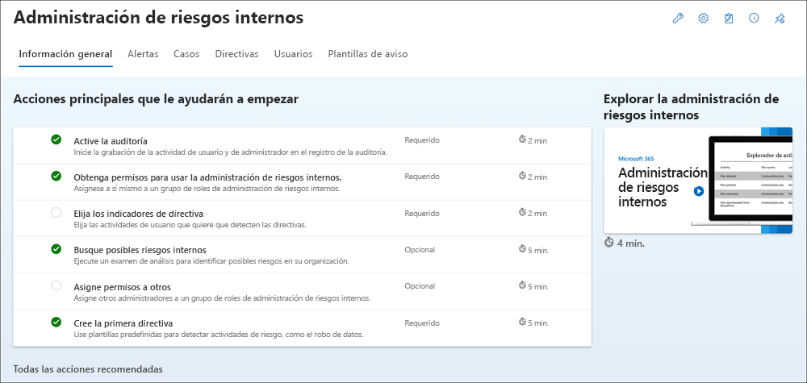

# Cuaderno de estrategias de prueba: soluciones de Microsoft Purview

[!include[Purview banner](../includes/purview-rebrand-banner.md)]

Le damos la bienvenida al cuaderno de estrategias de la prueba de soluciones de Microsoft Purview. Este cuaderno le ayudará a sacar el máximo partido de su evaluación gratuita de 90 días, ya que le permitirá descubrir funcionalidades sólidas y completas de Microsoft Purview y los productos de seguridad.

Probar cada solución le ayudará a tomar decisiones informadas para satisfacer las necesidades de cumplimiento de su organización.

Características:

- [Auditoría (Premium)](#audit-premium)
- [Cumplimiento de comunicaciones](#communication-compliance)
- [Administrador de cumplimiento](#compliance-manager)
- [Administración del ciclo de vida de los datos](#data-lifecycle-management)
- [Prevención de pérdida de datos de Microsoft Purview](#data-loss-prevention)
- [eDiscovery](#ediscovery)
- [Protección de información](#information-protection)
- [Administración de riesgos internos](#insider-risk-management)
- [Administración de registros](#records-management)

Complementos opcionales:

- [Evaluaciones premium del Administrador de cumplimiento](#compliance-manager-premium-assessments)
- [Administración de riesgo de privacidad Priva y Solicitudes de los interesados Priva](#microsoft-priva-privacy-risk-management-and-microsoft-priva-subject-rights-requests)

## Acciones de cumplimiento con Microsoft Purview

Comience a probar fácil y rápidamente las soluciones de cumplimiento de Microsoft sin cambiar los metadatos de su organización. En función de sus prioridades, puede empezar con cualquiera de estas áreas de solución para ver el valor inmediato. A continuación se muestran las cinco principales preocupaciones de la organización que comunican nuestros clientes y las soluciones recomendadas para empezar.

:::image type="content" source="../media/compliance-trial/workflow.png" alt-text="Acciones de cumplimiento con Microsoft 365":::

## Auditoría (Premium)

**Realizar investigaciones**:

La auditoría de Microsoft Purview (Premium) permite a las organizaciones dirigir investigaciones forenses y de cumplimiento incrementando la retención necesaria de registros de auditoría para dirigir una investigación, ofreciendo acceso a eventos fundamentales que ayuden a determinar el alcance del compromiso y proporcionar un acceso más rápido a la API de Actividad de administración de Office 365.

### Paso 1: [aplicar la licencia E5 a cada usuario para el que desee generar eventos E5](set-up-advanced-audit.md#step-1-set-up-audit-premium-for-users)

> [!TIP]
> Procedimiento recomendado de prueba: día 1

Las características de auditoría (Premium) como la capacidad para registrar eventos fundamentales, como MailItemsAccessed y Send, requieren una licencia adecuada de E5 asignada a los usuarios. Además, se debe habilitar la aplicación o el plan de servicio de Auditoría avanzada para estos usuarios.

Configurar la auditoría (Premium) para los usuarios: para comprobar que la aplicación Auditoría avanzada está asignada a los usuarios, [realice los pasos siguientes para cada usuario](set-up-advanced-audit.md#step-1-set-up-audit-premium-for-users).

1. Habilitar eventos de auditoría (Premium): [habilitar searchQueryInitiatedExchange y SearchQueryInitiatedSharePoint](set-up-advanced-audit.md#step-2-enable-audit-premium-events) para que se auditen para cada usuario en [PowerShell de Exchange Online](/powershell/exchange/connect-to-exchange-online-powershell).
1. Configurar directivas de retención de auditoría: [crear directivas de retención de registros de auditoría adicionales](set-up-advanced-audit.md#step-3-set-up-audit-retention-policies) para satisfacer los requisitos de los equipos de cumplimiento, TI y operaciones de seguridad de la organización.
1. Buscar eventos de auditoría (Premium): [buscar eventos cruciales de auditoría (Premium)](set-up-advanced-audit.md#step-4-search-for-audit-premium-events) y otras actividades al realizar investigaciones forenses.

### Paso 2: [Crear nuevas directivas de registro de auditoría para especificar cuánto tiempo se conservarán los registros de Auditoría en la organización para las actividades realizadas por los usuarios y definir los niveles de prioridad de las directivas](audit-log-retention-policies.md#before-you-create-an-audit-log-retention-policy)

> [!TIP]
> Procedimiento recomendado de prueba: crear en los primeros 30 días

Las directivas de retención de registros de auditoría forman parte de las nuevas funcionalidades de auditoría (Premium) de Microsoft Purview. Una directiva de retención de registro de auditoría le permite especificar durante cuánto tiempo se conservan los registros de auditoría en su organización.

1. Antes de crear una directiva de retención de registros de auditoría: [aspectos clave que debe conocer](audit-log-retention-policies.md#before-you-create-an-audit-log-retention-policy) antes de crear la directiva.
1. [Crear una directiva de retención de registros de auditoría](audit-log-retention-policies.md#create-an-audit-log-retention-policy)
1. [Administrar directivas de retención de registros de auditoría en el portal de cumplimiento de Microsoft Purview](audit-log-retention-policies.md#manage-audit-log-retention-policies-in-the-compliance-portal): las directivas de retención de registros de Auditoría se muestran en la pestaña Directivas de retención de Auditoría (también denominada panel). Puede usar el panel para ver, editar y eliminar directivas de retención de auditoría.
1. Crear y administrar directivas de retención de registros de auditoría en PowerShell. También es posible usar Security & Compliance de PowerShell para [crear y administrar directivas de retención de registros de auditoría](audit-log-retention-policies.md#create-and-manage-audit-log-retention-policies-in-powershell). Uno de los motivos para usar PowerShell es crear una directiva para un tipo de registro o actividad que no esté disponible en la interfaz de usuario.

## Cumplimiento de la comunicación

**Identificar y actuar sobre las violaciones de la directiva del código de conducta**:

El cumplimiento de comunicaciones de Microsoft Purview le ayuda a identificar de forma inteligente las infracciones de comunicación para promover un entorno de trabajo compatible y correcto, ya que le ayuda a detectar mensajes inadecuados, investigar posibles infracciones de directivas y tomar medidas para corregirlas.

### Paso 1: [Habilitación de permisos para el cumplimiento de comunicaciones](communication-compliance-configure.md#step-1-required-enable-permissions-for-communication-compliance)

> [!TIP]
> Procedimiento recomendado de prueba: día 1

[Asignar todos los usuarios de cumplimiento al grupo de roles de Cumplimiento de comunicaciones](communication-compliance-configure.md#step-1-required-enable-permissions-for-communication-compliance).

### Paso 2: [Habilitar el registro de auditoría](communication-compliance-configure.md#step-2-required-enable-the-audit-log)

> [!TIP]
> Procedimiento recomendado de prueba: configuración en los primeros 30 días

Para utilizar esta característica, active la auditoría para que su organización pueda empezar a registrar las actividades tanto de administrador como de usuario. Al activarse, las actividades se anotarán en el registro de auditoría y estarán disponibles para su visualización en un informe. Para obtener más información, consulte [Activar o desactivar la búsqueda de registros de auditoría](turn-audit-log-search-on-or-off.md).

### Paso 3: [Crear una directiva de cumplimiento de comunicaciones](communication-compliance-policies.md)

[Crear directiva de cumplimiento de comunicaciones con las plantillas existentes](communication-compliance-policies.md): 1- Contenido inapropiado; 2- Información confidencial; 3- Cumplimiento normativo; 4- Conflicto de intereses.

### Paso 4: [Investigar y corregir alertas](communication-compliance-investigate-remediate.md)

[Investigar y corregir](communication-compliance-investigate-remediate.md) las alertas de cumplimiento de comunicaciones.

## Administrador de cumplimiento

**Administrar fácilmente el cumplimiento de su organización**:

El Administrador de cumplimiento de Microsoft Purview puede ayudarle a lo largo del proceso de cumplimiento, desde realizar un inventario de los riesgos de protección de datos hasta administrar las complejidades de la implementación de controles, estar al corriente de las normativas y certificaciones e informar a los auditores.

### Paso 1: [Conocer el Administrador de cumplimiento](compliance-manager-quickstart.md#first-visit-get-to-know-compliance-manager)

> [!TIP]
> Procedimiento recomendado de prueba: día 1

Nuestra página de información general del Administrador de cumplimiento es la mejor primera parada para una revisión completa de qué es el Administrador de cumplimiento y cómo funciona. También puede ir directamente a las secciones clave de nuestra documentación mediante los vínculos siguientes:

- [Conociendo su puntuación de cumplimiento](compliance-manager.md#understanding-your-compliance-score)
- [Información general sobre los elementos clave: controles, evaluaciones, plantillas y acciones de mejora](compliance-manager.md#key-elements-controls-assessments-templates-improvement-actions)
- [Comprender el panel del Administrador de cumplimiento](compliance-manager-setup.md#understand-the-compliance-manager-dashboard)
- [Filtrar la vista del panel](compliance-manager-setup.md#filtering-your-dashboard-view)
- [Información sobre las acciones de mejora](compliance-manager-setup.md#improvement-actions-page)
- [Comprender las evaluaciones](compliance-manager.md#assessments)
- [Haga un examen rápido de su entorno con el Configuration Manager del Cumplimiento de Microsoft](compliance-manager-mcca.md)

### Paso 2: [Configurar el Administrador de cumplimiento para administrar las actividades de cumplimiento](compliance-manager-assessments.md)

> [!TIP]
> Procedimiento recomendado de prueba: inspeccionar en los primeros 30 días

Empiece a trabajar con las evaluaciones y a tomar medidas de mejora para implementar controles y mejorar la puntuación de cumplimiento.

1. [Elija una plantilla predefinida para crear y administrar su primera evaluación](compliance-manager-assessments.md).
1. [Comprender cómo usar plantillas para crear evaluaciones](compliance-manager-templates.md).
1. [Realizar el trabajo de implementación y pruebas en acciones de mejora para completar los controles de las evaluaciones](compliance-manager-improvement-actions.md).
1. [Comprender mejor cómo afectan las distintas acciones a la puntuación de cumplimiento](compliance-score-calculation.md).

> [!NOTE]
> La suscripción a Microsoft 365 u Office 365 E1/E3 incluye la plantilla de línea de base de protección de datos de Microsoft. El Cumplimiento de E5 de Microsoft 365 u Office 365 E5 incluye plantillas para:
>
> - Línea base de protección de datos de Microsoft
> - RGPD de la Unión Europea  
> - ISO/IEC 27001,
> - NIST 800-53
>
> El Administrador de cumplimiento incluye más de 300 plantillas normativas o premium que se pueden comprar como complemento. Vea la lista aquí. Con cualquier plantilla premium (incluida con su suscripción o comprada como complemento), recibirá la versión universal de esas plantillas, lo que le permitirá administrar el cumplimiento con cualquier producto o servicio.

### Paso 3: [Escalado vertical: use la funcionalidad avanzada para satisfacer sus necesidades personalizadas](compliance-manager-templates-create.md)

Las evaluaciones personalizadas son útiles para:

- Administrar el cumplimiento de productos que no son de Microsoft 365 como aplicaciones y servicios de terceros, aplicaciones locales y otros recursos
- Administrar sus propios controles de cumplimiento personalizados o específicos de la empresa

1. [Ampliar una plantilla del Administrador de cumplimiento agregando sus propios controles y acciones de mejora](compliance-manager-templates-extend.md)
1. [Crear su propia plantilla personalizada](compliance-manager-templates-create.md)
1. [Modificar una plantilla existente para agregar o quitar controles y acciones](compliance-manager-templates-modify.md)
1. [Configurar pruebas automatizadas de acciones de mejora](compliance-manager-setup.md#set-up-automated-testing)
1. [Asignar acciones de mejora a otro usuario](compliance-manager-setup.md#reassign-improvement-actions-to-another-user)

## Administración del ciclo de vida de los datos

**Gobernar a escala con la automatización**:

Mejore su capacidad para adaptarse a los cambios de su organización con ámbitos de directiva que se actualizan automáticamente. Automatice el etiquetado de contenido para reducir los esfuerzos manuales y mejorar la posición de cumplimiento.

### Paso 1: Dirigir dinámicamente las directivas de retención con ámbitos de directiva adaptables

> [!TIP]
> Procedimiento recomendado de prueba: día 1

Los ámbitos de directiva adaptables permiten dirigir dinámicamente una directiva a determinados usuarios, grupos o sitios en función de sus atributos de AD.  Los atributos de los ámbitos se pueden seleccionar en una lista o personalizarse mediante un generador de consultas avanzado.

Las directivas que usan ámbitos de directiva adaptables permanecen actualizadas a medida que la organización cambia con nuevos empleados que se unen o la abandonan. Además, no están sujetas a los límites anteriores de 100/1000 ubicaciones incluidas en una directiva.

- Crear un  Ámbito de directiva adaptable y usarlo con una directiva de retención

### Paso 2: Automatizar el etiquetado para aplicar una etiqueta a todos los elementos de forma predeterminada

> [!TIP]
> Procedimiento recomendado de prueba: configuración en los primeros 30 días

Las etiquetas predeterminadas le permiten aplicar automáticamente una etiqueta de retención a todos los elementos de una biblioteca, carpeta o conjunto de documentos especificados en SharePoint.

- Publicar una etiqueta y aplicarla como predeterminada en SharePoint

## Prevención de pérdida de datos

**Proteger los datos confidenciales**:

Para cumplir con los estándares de la empresa y las normativas del sector, las organizaciones han de proteger la información confidencial e impedir su divulgación involuntaria. Configure directivas de prevención de pérdida de datos de Microsoft Purview para identificar, supervisar y proteger automáticamente la información confidencial en Microsoft 365.

### Paso 1: [Proteger la pérdida de datos en ubicaciones de Teams](dlp-microsoft-teams.md#dlp-licensing-for-microsoft-teams)

> [!TIP]
> Procedimiento recomendado de prueba: día 1

Si su organización tiene prevención de pérdida de datos (DLP), puede definir directivas que eviten que los usuarios compartan información confidencial en un canal o sesión de chat de Microsoft Teams.

1. Obtenga información sobre [Licencias DLP para Microsoft Teams y el ámbito de la protección DLP](dlp-microsoft-teams.md#dlp-licensing-for-microsoft-teams)
1. [Agregar Microsoft Teams como una ubicación a las directivas DLP existentes](dlp-microsoft-teams.md#add-microsoft-teams-as-a-location-to-existing-dlp-policies)
1. [Configurar nuestra directiva DLP predeterminada para Teams](mip-easy-trials.md) o [Definir una nueva directiva DLP para Microsoft Teams](dlp-microsoft-teams.md#define-a-new-dlp-policy-for-microsoft-teams)

### Paso 2: [Proteger la pérdida de datos en ubicaciones de dispositivos](endpoint-dlp-getting-started.md)

> [!TIP]
> Procedimiento recomendado de prueba: configuración en los primeros 30 días

Microsoft Endpoint DLP le permite supervisar dispositivos con Windows 10 y detectar cuándo se usan y comparten elementos confidenciales.

1. Prepare los puntos de conexión: asegúrese de que los dispositivos Windows 10 y macOS en los que planea implementar DLP de punto de conexión [cumplan estos requisitos](endpoint-dlp-getting-started.md)
1. [Incorporar dispositivos a la administración de dispositivos](endpoint-dlp-getting-started.md)  - Para poder supervisar y proteger los elementos confidenciales de un dispositivo, es necesario que habilite la supervisión del dispositivo y que incorpore los puntos de conexión. Ambas acciones se realizan en el portal de cumplimiento de Microsoft Purview.
   - Escenario 1 – [Incorporación de dispositivos](endpoint-dlp-getting-started.md) que aún no se han incorporado.
   - Escenario 2 - [En este escenario, Microsoft Defender para punto de conexión ya está implementado y existen puntos de conexión que informan.](endpoint-dlp-getting-started.md) Todos estos puntos de conexión aparecerán en la lista de dispositivos administrados.
1. [Configurar nuestra directiva DLP predeterminada para dispositivos](mip-easy-trials.md#dlp-for-devices) o [Definir una nueva directiva DLP para dispositivos](endpoint-dlp-learn-about.md).
1. [Visualizar alertas de DLP del punto de conexión](dlp-configure-view-alerts-policies.md) en el panel de administración de alertas de DLP.
1. [Visualizar datos de DLP del punto de conexión](data-classification-activity-explorer.md) en el explorador de actividad.

### Paso 3: [Ampliar el ámbito o la protección de las directivas](dlp-learn-about-dlp.md#dlp-policy-configuration-overview)

Tiene flexibilidad en la configuración de las directivas DLP. Puede empezar con nuestra directiva DLP predeterminada para Teams y dispositivos y ampliar esas directivas para proteger ubicaciones adicionales, tipos de información confidencial o etiquetas. Además, puede expandir las acciones de directiva y personalizar las alertas.

1. Agregar ubicaciones
1. Agregar etiquetas o tipos de información confidencial para proteger
1. Agregar acciones
   - Teams:
      - [Evitar el acceso externo a documentos confidenciales](dlp-microsoft-teams.md#prevent-external-access-to-sensitive-documents)
      - [Obtener sugerencias de directiva para ayudar a educar a los usuarios e instrucciones para personalizar las sugerencias de directiva](dlp-microsoft-teams.md#policy-tips-help-educate-users)
   - Dispositivos: cambiar de solo auditoría a bloquear
1. [Configurar y ver alertas de directivas de prevención de pérdida de datos: Microsoft Purview | Microsoft Docs](dlp-configure-view-alerts-policies.md)

## eDiscovery

**Descubrir más con un flujo de trabajo de un extremo a otro**:

Aproveche un flujo de trabajo completo para conservar, recopilar, analizar y exportar contenido que responda a las investigaciones internas y externas de su organización. Los equipos jurídicos también pueden administrar todo el proceso de notificaciones de suspensión legal mediante la comunicación con los custodios implicados en un caso.

### Paso 1 (obligatorio): [Permisos](https://aka.ms/ediscoveryninja)

> [!TIP]
> Procedimiento recomendado de prueba: día 1

Para acceder a eDiscovery (Premium) o ser agregado como miembro de un caso de eDiscovery (Premium), un usuario deben tener asignados los permisos adecuados.

1. [Configurar eDiscovery (Premium): Asignar permisos de eDiscovery](get-started-with-advanced-ediscovery.md#step-2-assign-ediscovery-permissions)
1. [Agregar o quitar miembros de un caso](add-or-remove-members-from-a-case-in-advanced-ediscovery.md)

### Paso 2 (obligatorio): crear un caso

> [!TIP]
> Procedimiento recomendado de prueba: crear en los primeros 30 días

Más organizaciones usan la solución eDiscovery (Premium) en Microsoft Purview para los procesos críticos de eDiscovery. Esto incluye responder a solicitudes normativas, investigaciones y litigios.

1. Administrar eDiscovery (Premium): [aprenda a configurar eDiscovery (Premium), administrar casos, administrar un flujo de trabajo en eDiscovery (Premium) y analizar los resultados de búsqueda de eDiscovery (Premium](/learn/modules/manage-advanced-ediscovery)).
1. [Crear un caso de eDiscovery con el nuevo formato de caso de eDiscovery avanzado](advanced-ediscovery-new-case-format.md)
1. [Cerrar o eliminar un caso](close-or-delete-case.md): cuando el caso o la investigación hayan terminado, puede cerrarlos o eliminarlos. También puede volver a abrir un caso cerrado.

### Paso 3 (opcional): configuración

Para permitir que los usuarios de su organización empiecen a crear y usar casos, debe configurar opciones globales que se apliquen a todos los casos de su organización. En este momento, la única configuración global es **detección de privilegios entre abogado y cliente** (habrá más configuraciones globales disponibles en el futuro).

1. [Configurar eDiscovery (Premium): Configuración global](get-started-with-advanced-ediscovery.md#step-3-configure-global-settings-for-ediscovery-premium)
1. [Establecer la configuración de búsqueda y análisis](configure-search-and-analytics-settings-in-advanced-ediscovery.md)
1. [Administrar trabajos en eDiscovery (Premium)](managing-jobs-ediscovery20.md)

### Paso 4 (opcional): [límites de cumplimiento](set-up-compliance-boundaries.md)

Los límites de cumplimiento crean límites lógicos dentro de una organización que controlan las ubicaciones de contenido de usuario (como buzones, cuentas de OneDrive y sitios de SharePoint) en las que los administradores de eDiscovery pueden buscar. También controlan quién puede acceder a los casos de eDiscovery que se usan para administrar las investigaciones legales, de recursos humanos u otras investigaciones dentro de la organización.

Configurar los límites de cumplimiento para investigaciones de eDiscovery:

1. [Identifique un atributo de usuario para definir sus agencias](set-up-compliance-boundaries.md#step-1-identify-a-user-attribute-to-define-your-agencies)
1. [Crear un grupo de roles para cada organismo](set-up-compliance-boundaries.md#step-2-create-a-role-group-for-each-agency)
1. [Crear un filtro de permisos de búsqueda para exigir el límite de cumplimiento](set-up-compliance-boundaries.md#step-3-create-a-search-permissions-filter-to-enforce-the-compliance-boundary)
1. [Crear un caso de eDiscovery para investigaciones dentro de los organismos](set-up-compliance-boundaries.md#step-4-create-an-ediscovery-case-for-intra-agency-investigations)

### Paso 5 (opcional): [obtener información sobre la herramienta de Búsqueda de contenido](search-for-content.md)

Use la herramienta Búsqueda de contenido del portal de cumplimiento de Microsoft Purview para encontrar rápidamente correos electrónicos en buzones de Exchange, documentos en sitios de SharePoint y ubicaciones de OneDrive, y conversaciones de mensajería instantánea en Skype Empresarial. Puede usar la herramienta Búsqueda de contenido para buscar correos electrónicos, documentos y conversaciones de mensajería instantánea en herramientas de colaboración como Microsoft Teams y Grupos de Microsoft 365.

- [Más información sobre la búsqueda de eDiscovery (Premium)](search-for-content.md#search-for-content)

## Protección de la información

**Detectar, clasificar y proteger su información confidencial**:

Implemente Microsoft Purview Information Protection y etiquetas de confidencialidad para ayudarle a descubrir, clasificar y proteger su contenido confidencial dondequiera que este se encuentre o viaje.

### Paso 1: [Iniciar la prueba de Information Protection](mip-easy-trials.md)

> [!TIP]
> Procedimiento recomendado de prueba: día 1

Los clientes aptos pueden activar etiquetas y directivas predeterminadas para Microsoft Purview Information Protection. Al habilitar la configuración predeterminada en la versión de prueba, tardará unos 2 minutos en configurar todas las directivas del espacio empresarial y hasta 24 horas en ver los resultados de estas directivas predeterminadas.

Al elegir la configuración predeterminada, con 1 clic, se configura automáticamente lo siguiente:

- Etiquetas de confidencialidad y una directiva de etiquetas de confidencialidad
- Etiquetado automático del lado cliente
- Etiquetado automático del lado servicio
- Directivas de prevención de pérdida de datos (DLP) para Teams y dispositivos

[Activar las directivas y etiquetas predeterminadas](mip-easy-trials.md#activate-the-default-labels-and-policies) Si es necesario, puede editar manualmente una vez completada la configuración.

### Paso 2: [aplicar automáticamente etiquetas de confidencialidad a documentos](apply-sensitivity-label-automatically.md)

> [!TIP]
> Procedimiento recomendado de prueba: configuración en los primeros 30 días

Cuando crea una etiqueta de confidencialidad, puede asignar automáticamente dicha etiqueta a archivos o correos electrónicos cuando se cumplan las condiciones especificadas.

1. [Crear y configurar etiquetas de confidencialidad](create-sensitivity-labels.md#create-and-configure-sensitivity-labels)
1. [Publicar directiva de etiqueta de confidencialidad para todos los usuarios](create-sensitivity-labels.md#publish-sensitivity-labels-by-creating-a-label-policy)
1. [Crear una directiva de etiquetado automático](create-sensitivity-labels.md#publish-sensitivity-labels-by-creating-a-label-policy)
   - Elegir la información a la que desea aplicar la etiqueta
   - Definir ubicaciones para aplicar la etiqueta
   - Seleccionar etiqueta para aplicar
   - [Ejecutar la directiva en modo de simulación](create-sensitivity-labels.md#publish-sensitivity-labels-by-creating-a-label-policy)

### Paso 3: [revisar y activar la directiva de etiquetado automático](apply-sensitivity-label-automatically.md#how-to-configure-auto-labeling-policies-for-sharepoint-onedrive-and-exchange)

Ahora, en la página **Information Protection** > **Etiquetado automático**, verá la directiva de etiquetado automático en la sección **Simulación**.

Seleccione la directiva para ver los detalles de la configuración y el estado. Una vez completada la simulación, seleccione la pestaña Elementos a revisar para ver qué correos electrónicos o documentos coinciden con las reglas especificadas.

Cuando esté listo para ejecutar la directiva sin simulación, seleccione la opción **Activar directiva**.

## Administración de riesgos de Insider

**Detectar y corregir los riesgos internos**:

Aproveche la inteligencia artificial para identificar, evaluar y corregir rápidamente los riesgos internos. Con los registros de Microsoft 365 y los servicios de Azure, puede definir directivas que supervisen las señales de riesgo interno y luego realizar acciones de corrección, como promover la formación de los usuarios o iniciar una investigación.

### Paso 1 (obligatorio): [Habilitar permisos para la administración de riesgos internos](insider-risk-management-configure.md#step-1-required-enable-permissions-for-insider-risk-management)

> [!TIP]
> Procedimiento recomendado de prueba: día 1

Hay cuatro grupos de roles que se usan para configurar permisos para administrar las características de administración de riesgos internos.

[Agregue usuarios a un grupo de roles de administración de riesgos internos.](insider-risk-management-configure.md#add-users-to-an-insider-risk-management-role-group)

Si no puede ver los permisos, póngase en contacto con el administrador de inquilinos para asignar los roles correctos.

### Paso 2: [Iniciar con la guía de inicio rápido del usuario](insider-risk-management-configure.md#recommended-actions-preview)

Comience rápidamente y saque el máximo partido a las funcionalidades de administración de riesgos internos con acciones recomendadas. Incluidas en la página Información general, las acciones recomendadas le guiarán por los pasos necesarios para configurar e implementar directivas, así como para realizar acciones de investigación para las acciones de usuario que generan alertas a partir de coincidencias de directivas.

[Seleccione una recomendación de la lista](insider-risk-management-configure.md#recommended-actions-preview) para empezar a configurar la administración de riesgos internos.

Cada acción recomendada le guía por las actividades necesarias para la recomendación, incluidos los requisitos, qué esperar y el impacto de configurar la característica en su organización.

### Paso 3 (obligatorio): [habilitar el registro de auditoría de Microsoft 365](insider-risk-management-configure.md#step-2-required-enable-the-microsoft-365-audit-log)

La auditoría está habilitada para organizaciones de Microsoft 365 de forma predeterminada. Algunas organizaciones pueden haber deshabilitado la auditoría por motivos específicos. Si la auditoría está deshabilitada para su organización, puede deberse a que otro administrador la ha desactivado. Se recomienda confirmar que es correcto volver a activar la auditoría al completar este paso.

Para obtener instrucciones paso a paso para activar la auditoría, consulte [Activar o desactivar la búsqueda de registros de auditoría](turn-audit-log-search-on-or-off.md). Después de activar la auditoría, se muestra un mensaje que dice que el registro de auditoría se está preparando y que puede ejecutar una búsqueda en un par de horas después de que se complete la preparación. Solo tiene que realizar esta acción una vez. Para obtener más información sobre el uso del registro de auditoría de Microsoft 365, consulte [Buscar en el registro de auditoría](search-the-audit-log-in-security-and-compliance.md).

### Paso 4 (obligatorio): [habilitar y ver la información de análisis de riesgos internos](insider-risk-management-configure.md#step-3-optional-enable-and-view-insider-risk-analytics-insights)

El análisis de administración de riesgos internos le permiten realizar una evaluación de los posibles riesgos internos en su organización sin necesidad de configurar ninguna directiva de riesgos internos. Los resultados del análisis pueden tardar hasta 48 horas antes de que la información esté disponible como informes para su revisión. Para obtener más información sobre la información de análisis, consulte [Configuración de administración de riesgos internos: análisis (versión preliminar)](insider-risk-management-settings.md) y consulte el vídeo [Análisis de administración de riesgos internos](https://www.youtube.com/watch?v=5c0P5MCXNXk) para ayudarle a comprender su posición de riesgo interno y así tomar medidas mediante la configuración de directivas adecuadas para identificar usuarios de riesgo.

Para habilitar el Análisis de riesgos internos, debe ser miembro o administrador de la Administración de riesgos internos. [Completar estos pasos para habilitar el análisis de riesgos internos](insider-risk-management-configure.md).

## Records Management

**Administrar elementos de gran valor para los requisitos de mantenimiento de registros empresariales, legales o reglamentarios**:

Use características de administración de registros de Microsoft Purview para automatizar la programación de retención para los registros normativos, legales y empresariales de la organización. Aproveche las funcionalidades de automatización, desde la creación hasta la colaboración, para declarar los registros, conservar los contenidos y eliminarlos al final.

### Paso 1: Marcar los contenidos como registros  

> [!TIP]
> Procedimiento recomendado de prueba: día 1

Cuando el contenido se declara como un registro, se aplican restricciones en el elemento en cuanto a las acciones permitidas o bloqueadas, se registran actividades adicionales sobre los elementos y se obtiene una prueba de disposición si los elementos se eliminan al final de su período de retención.

- Crear una etiqueta de retención que declara el contenido como un registro o un registro normativo

### Paso 2: revisar el contenido para aprobarlo antes de que se elimine definitivamente

> [!TIP]
> Procedimiento recomendado de prueba: día 1

Al final del período de retención, los usuarios que usted especifique ("revisores") pueden ser notificados para revisar el contenido y aprobar la acción de eliminación permanente. Esto apoya si una acción diferente a la eliminación es más apropiada, como asignar un período de retención diferente al contenido o suspender la eliminación para una auditoría.

- Crear una etiqueta de retención que use la revisión para eliminación

### Paso 3: Aplicar etiquetas automáticamente al contenido que coincida con condiciones específicas

> [!TIP]
> Procedimiento recomendado de prueba: configuración en los primeros 30 días

La aplicación automática de etiquetas elimina la necesidad de que los usuarios realicen manualmente las actividades de etiquetado. Puede aplicar etiquetas de retención al contenido automáticamente cuando ese contenido aún no tiene aplicada una etiqueta de retención y contiene información confidencial, palabras clave o propiedades que permiten búsquedas, o una coincidencia para clasificadores entrenables.

- Aplicar automáticamente etiquetas de retención a contenido con tipos específicos de información confidencial
- Aplicar automáticamente etiquetas al contenido con clasificadores que se pueden entrenar
- Aplicar automáticamente etiquetas de retención con palabras clave o propiedades que se pueden buscar

## Pruebas y complementos adicionales

### Evaluaciones premium del Administrador de cumplimiento

**Evaluar los riesgos y responder de forma eficaz**:

Ayude a su organización a evaluar los riesgos y a responder eficazmente a los requisitos nacionales, regionales e industriales que rigen la recopilación y el uso de datos.

[Más información sobre la evaluación premium del Administrador de cumplimiento](compliance-easy-trials-compliance-manager-assessments.md).

[Cuaderno de estrategias: evaluaciones premium del Administrador de cumplimiento de Microsoft Purview](compliance-easy-trials-compliance-manager-assessment-playbook.md)

### Administración de riesgo de privacidad Priva y Solicitudes de los interesados Priva

**Identificar y evitar riesgos de privacidad**:

Identifique y proteja de forma proactiva los riesgos para la privacidad, como el acaparamiento de datos, las transferencias de datos y el uso compartido excesivo de datos, y ayude a su organización a automatizar y administrar las solicitudes de los sujetos a gran escala.

[Obtenga más información sobre Microsoft Priva](/privacy/solutions/privacymanagement/privacy-management).

[Cuaderno de estrategias de prueba: Microsoft Priva](/privacy/solutions/privacymanagement/privacy-management-trial-playbook)

## Recursos adicionales

**¿Qué se incluye?**: para obtener una lista completa de las características y soluciones de Microsoft Purview enumeradas por nivel de producto, vea la [Matriz de característica](https://go.microsoft.com/fwlink/?linkid=2139145).

**Biblioteca de contenido técnico de Seguridad de Microsoft**: explore esta biblioteca para buscar guías interactivas y otro contenido de aprendizaje que se adecue a sus necesidades. [Visitar la biblioteca](/security).

**Recursos de Seguridad de Microsoft**: desde antimalware hasta Confianza cero, obtenga todos los recursos importantes para cubrir las necesidades de seguridad de la organización.
