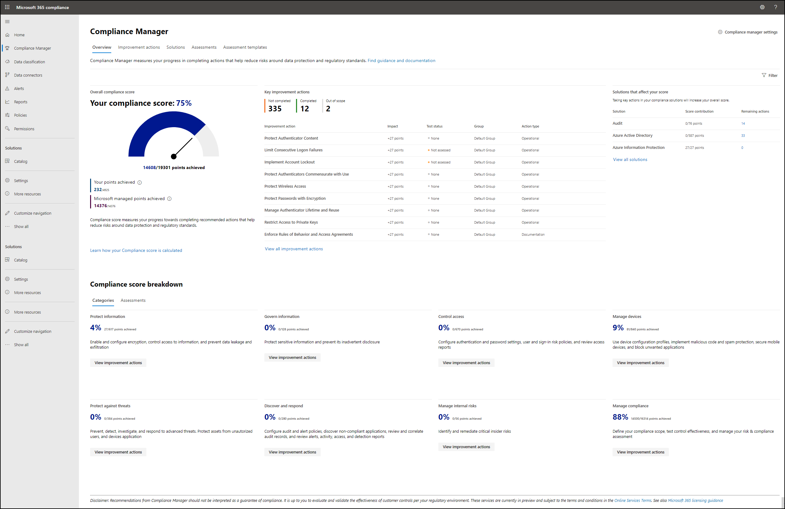

# Introducción al Administrador de cumplimientoGet started with Compliance Manager

**En este artículo:** Este artículo le ayuda a configurar el Administrador de cumplimiento.**In this article:** This article helps you set up Compliance Manager. Obtenga información sobre cómo **obtener acceso al** Administrador de cumplimiento, establecer roles y permisos y configurar **pruebas automáticas** **de acciones de mejora.**Learn how to **access** Compliance Manager, **set roles and permissions**, and configure **automatic testing of improvement actions**. Pase por **el panel del Administrador de cumplimiento** y comprenda las páginas principales: la página de acciones de mejora, la página de soluciones, la página de evaluaciones y la página de plantillas de evaluación.Walk through **your Compliance Manager dashboard** and understand the main pages: the improvement actions page, the solutions page, the assessments page, and the assessment templates page.

## Quién puede tener acceso al Administrador de cumplimientoWho can access Compliance Manager

El Administrador de cumplimiento está disponible para las organizaciones con licencias de Office 365 y Microsoft 365 y para los clientes moderados y GCC High de us Government Community Cloud (GCC).Compliance Manager is available to organizations with Office 365 and Microsoft 365 licenses, and to US Government Community Cloud (GCC) Moderate and GCC High customers. La disponibilidad de evaluación y las capacidades de administración dependen del contrato de licencia.Assessment availability and management capabilities depend on your licensing agreement.  [Ver detalles de descripción del servicio](/office365/servicedescriptions/microsoft-365-service-descriptions/microsoft-365-tenantlevel-services-licensing-guidance/microsoft-365-security-compliance-licensing-guidance).[View service description details](/office365/servicedescriptions/microsoft-365-service-descriptions/microsoft-365-tenantlevel-services-licensing-guidance/microsoft-365-security-compliance-licensing-guidance).

## Antes de empezarBefore you begin

Es probable que el administrador global de Microsoft 365 de su organización sea el primer usuario que tenga acceso al Administrador de cumplimiento.The Microsoft 365 global administrator for your organization will likely be the first user to access Compliance Manager. Se recomienda que el administrador global inicie sesión y establezca los permisos de usuario como se describe a continuación al visitar el Administrador de cumplimiento por primera vez.We recommend the global admin sign in and set user permissions as outlined below when visiting Compliance Manager for the first time.

## Iniciar sesiónSign in

1. Vaya al Centro [de cumplimiento de Microsoft 365](https://compliance.microsoft.com/) e inicie **sesión** con su cuenta de administrador global de Microsoft 365.Go to the [Microsoft 365 compliance center](https://compliance.microsoft.com/) and **sign in** with your Microsoft 365 global administrator account.
2. Seleccione **Administrador de cumplimiento** en el panel de navegación izquierdo.Select **Compliance Manager** on the left navigation pane. Llegarás al panel del Administrador [de cumplimiento](#understand-the-compliance-manager-dashboard).You'll arrive at your [Compliance Manager dashboard](#understand-the-compliance-manager-dashboard).

El vínculo directo para acceder al Administrador de cumplimiento es [https://compliance.microsoft.com/compliancemanager](https://compliance.microsoft.com/compliancemanager) .The direct link to access Compliance Manager is [https://compliance.microsoft.com/compliancemanager](https://compliance.microsoft.com/compliancemanager).

## Establecer permisos de usuario y asignar rolesSet user permissions and assign roles

El Administrador de cumplimiento usa un modelo de permisos de control de acceso basado en roles (RBAC).Compliance Manager uses a role-based access control (RBAC) permission model. Solo los usuarios a los que se asigna un rol pueden tener acceso al Administrador de cumplimiento y las acciones permitidas por cada usuario están restringidas por tipo [de función](#role-types).Only users who are assigned a role may access Compliance Manager, and the actions allowed by each user are restricted by [role type](#role-types).

### Dónde establecer permisosWhere to set permissions

La persona que tiene el rol de administrador global de su organización puede establecer permisos de usuario para el Administrador de cumplimiento.The person holding the global admin role for your organization can set user permissions for Compliance Manager. Los permisos se pueden establecer en el Centro de seguridad de Office 365 & cumplimiento, así como en Azure Active Directory (Azure AD).Permissions can be set in the Office 365 Security & Compliance center as well as in Azure Active Directory (Azure AD).

> [!NOTE]
> Los clientes de entornos altos de la Comunidad gubernamental de Estados Unidos (GCC) solo pueden establecer permisos de usuario y roles para el Administrador de cumplimiento en Azure AD.Customers in US Government Community (GCC) High environments can only set user permissions and roles for Compliance Manager in Azure AD. Consulte a continuación las instrucciones de Azure AD y las definiciones de tipo de función.See below for Azure AD instructions and role type definitions.

Para establecer permisos y asignar roles en el Centro de seguridad y & cumplimiento de Office 365, siga estos pasos:To set permissions and assign roles in the Office 365 Security & Compliance center, follow the steps below:

1. Vaya al Centro de seguridad y cumplimiento de [Office 365 & y](https://protection.office.com/) seleccione **Permisos** en la navegación izquierda.Go to the [Office 365 Security & Compliance Center](https://protection.office.com/) and select **Permissions** on the left navigation.

2. Busque el grupo de roles al que desea agregar uno o varios usuarios y active la casilla a la izquierda del nombre del grupo.Find the role group to which you want to add one or more users, and check the box to the left of the group name. (Vea la [lista de roles y funciones relacionadas a continuación.](#role-types)(See the [list of roles and related functions below](#role-types). Los nombres de los grupos de roles imitan el nombre del rol).The role group names mimic the role name.)

3. En el panel desplegable de ese grupo, seleccione **Editar en** el **encabezado** Miembros.On the flyout pane for that group, select **Edit** under the **Members** header.

4. Seleccione **Elegir miembros**.Select **Choose members**. Aparecerá otra ventana desplegable.Another flyout window will appear.

5. Seleccione **+ Agregar** para elegir uno o varios usuarios para agregar al grupo.Select **+ Add** to choose one or more users to add to the group.

6. Seleccione la casilla situada junto a los nombres que desea agregar y, a continuación, seleccione el **botón** Agregar en la parte inferior.Select the checkbox next to the names you want to add, then select the **Add** button at the bottom.

7. Cuando haya terminado de asignar usuarios, seleccione **Listo** y, a continuación, **seleccione Guardar** y, a continuación, **Cerrar**.When you’re done assigning users, select **Done**, then select **Save**, then **Close**.

##### Más información sobre el Centro de seguridad de Office 365 & cumplimientoMore about the Office 365 Security & Compliance Center

Obtenga más información sobre los permisos en el Centro de seguridad y [& de Office 365.](../security/office-365-security/permissions-in-the-security-and-compliance-center.md)Learn more about [permissions in the Office 365 Security & Compliance Center](../security/office-365-security/permissions-in-the-security-and-compliance-center.md).

Si no tiene acceso al Centro de seguridad y cumplimiento de Office 365 o si necesita tener acceso a la versión clásica del Administrador de cumplimiento en el Portal de confianza de servicio de Microsoft, la configuración de administración en el Portal de confianza de servicio proporciona otra forma de asignar roles[(](meet-data-protection-and-regulatory-reqs-using-microsoft-cloud.md#assigning-compliance-manager-roles-to-users)ver instrucciones ).If you don't have access to the Office 365 Security and Compliance Center, or if you need to access the classic version of Compliance Manager in the Microsoft Service Trust Portal,  the Admin settings in the Service Trust Portal provides another way to assign roles ([view instructions](meet-data-protection-and-regulatory-reqs-using-microsoft-cloud.md#assigning-compliance-manager-roles-to-users)). Tenga en cuenta que estos roles son más limitados en su funcionalidad.Be aware that such roles are more limited in their functionality.

##### Más información sobre Azure ADMore about Azure AD

Para asignar roles y establecer permisos en Azure AD, consulte [Assign administrator and non-administrator roles to users with Azure Active Directory](/azure/active-directory/fundamentals/active-directory-users-assign-role-azure-portal).To assign roles and set permissions in Azure AD, see [Assign administrator and non-administrator roles to users with Azure Active Directory](/azure/active-directory/fundamentals/active-directory-users-assign-role-azure-portal).

Los usuarios con identidades de Azure AD que no tienen suscripciones a Office 365 o Microsoft 365 no podrán acceder al Administrador de cumplimiento en el Centro de cumplimiento de Microsoft 365.Users with Azure AD identities who don't have Office 365 or Microsoft 365 subscriptions won't be able to access Compliance Manager in the Microsoft 365 compliance center. Para obtener ayuda para obtener acceso al Administrador de cumplimiento, póngase en [contacto cmresearch@microsoft.com](mailto:cmresearch@microsoft.com).To seek assistance in accessing Compliance Manager, contact [cmresearch@microsoft.com](mailto:cmresearch@microsoft.com).

### Tipos de funciónRole types

En la tabla siguiente se muestran las funciones permitidas por cada rol en el Administrador de cumplimiento.The table below shows the functions allowed by each role in Compliance Manager. En la tabla también se muestra cómo cada rol [de Azure AD](/azure/active-directory/users-groups-roles/directory-assign-admin-roles#available-roles) se asigna a los roles del Administrador de cumplimiento.The table also shows how each [Azure AD role](/azure/active-directory/users-groups-roles/directory-assign-admin-roles#available-roles) maps to Compliance Manager roles. Los usuarios necesitarán al menos el rol de lector administrador de cumplimiento o el rol de lector global de Azure AD para tener acceso al Administrador de cumplimiento.Users will need at least the Compliance Manager reader role, or Azure AD global reader role, to access Compliance Manager.

| El usuario puede:User can: | Rol Administrador de cumplimientoCompliance Manager role | Rol de Azure ADAzure AD role | 
| :------------- | :-------------: | :------------: |
| **Leer pero no editar datos****Read but not edit data**| Lector de Administrador de cumplimientoCompliance Manager Reader  | Lector global de Azure AD, lector de seguridadAzure AD Global reader, Security reader | 
| **Editar datos****Edit data**| Contribución del administrador de cumplimientoCompliance Manager Contribution | Administrador de cumplimientoCompliance Administrator | 
| **Editar resultados de pruebas****Edit test results**| Evaluación del administrador de cumplimientoCompliance Manager Assessment | Administrador de cumplimientoCompliance Administrator | 
| **Administrar evaluaciones y datos de plantilla e inquilino****Manage assessments, and template and tenant data**| Administración del administrador de cumplimientoCompliance Manager Administration | Administrador de cumplimiento, administrador de datos de cumplimiento, administrador de seguridadCompliance Administrator, Compliance Data Administrator, Security Administrator  | 
| **Asignar usuarios****Assign users**| Administrador globalGlobal Administrator | Administrador globalGlobal Administrator | 

## Configuración de pruebas automatizadas e historial de usuariosSettings for automated testing and user history

La configuración del Administrador de cumplimiento en el Centro de cumplimiento de Microsoft 365 le permite habilitar y deshabilitar las pruebas automáticas de las acciones de mejora.The Compliance Manager settings in the Microsoft 365 compliance center allow you to enable and disable automatic testing of improvement actions. La configuración también le permite administrar los datos de los usuarios asociados a acciones de mejora, incluida la capacidad de reasignar acciones de mejora a un usuario diferente.The settings also allow you to manage the data of users associated to improvement actions, including the ability to reassign improvement actions to a different user.  Solo las personas con un rol de administrador global o administrador de cumplimiento pueden acceder a la configuración del Administrador de cumplimiento.Only people with a global administrator or Compliance Manager Administrator role can access the Compliance Manager settings.

> [!NOTE]
> La característica de prueba automatizada no está disponible para los clientes en entornos GCC High porque la puntuación segura no está disponible en estos entornos.The automated testing feature is not available to customers in GCC High environments because Secure Score isn't available in these environments. Los clientes de GCC High tendrán que implementar manualmente y probar sus acciones de mejora.GCC High customers will need to manually implement and test their improvement actions.

### Configurar pruebas automatizadasSet up automated testing

Algunas acciones de mejora en el Administrador de cumplimiento también son supervisadas por [Microsoft Secure Score](../security/defender/microsoft-secure-score.md).Some improvement actions in Compliance Manager are also monitored by [Microsoft Secure Score](../security/defender/microsoft-secure-score.md). Puede configurar pruebas automatizadas de acciones que se supervisan conjuntamente, lo que significa que cuando una acción se prueba y actualiza en Puntuación segura, esos resultados se sincronizan con las mismas acciones en el Administrador de cumplimiento y cuentan para su puntuación de cumplimiento.You can set up automated testing of actions that are jointly monitored, which means that when an action is tested and updated in Secure Score, those results synch with the same actions in Compliance Manager and count toward your compliance score.

Las pruebas automáticas están activadas de forma predeterminada para organizaciones nuevas en el Administrador de cumplimiento.Automatic testing is turned on by default for organizations new to Compliance Manager. Cuando implemente Microsoft 365 u Office 365 por primera vez, la puntuación segura tarda aproximadamente siete días en recopilar completamente los datos y tener en cuenta la puntuación de cumplimiento.When you first deploy Microsoft 365 or Office 365, it takes approximately seven days for Secure Score to fully collect data and factor it into your compliance score.  Cuando las pruebas automatizadas están activadas, la fecha de prueba de la acción no se actualizará, pero su estado de prueba se actualizará.When automated testing is turned on, the action’s test date won’t be updated, but its test status will update. Cuando se crean nuevas evaluaciones, las puntuaciones incluyen automáticamente las puntuaciones de control de Microsoft y la integración de puntuación segura.When new assessments are created, scores automatically include Microsoft control scores and Secure Score integration.

El administrador global de su organización puede cambiar la configuración de las pruebas automatizadas en cualquier momento.The global administrator for your organization can change the settings for automated testing at any time. Puedes desactivar las pruebas automatizadas para acciones de mejora comunes o activarla para acciones individuales.You can turn off automated testing for common improvement actions, or turn it on for individual actions. Siga las instrucciones siguientes para cambiar la configuración de las pruebas automatizadas.Follow the instructions below to change your automated testing settings.

#### Para administrar la configuración de pruebas automatizadas:To manage your automated testing settings:

1. Seleccione **Configuración** en la navegación izquierda desde cualquier lugar del Centro de cumplimiento de [Microsoft 365](https://compliance.microsoft.com/).Select **Settings** on the left navigation from anywhere in the [Microsoft 365 compliance center](https://compliance.microsoft.com/).

2. En la página configuración, seleccione **Administrador de cumplimiento**.On the settings page, select **Compliance Manager**.

3. Seleccione **Pruebas automatizadas** en la navegación izquierda.Select **Automated testing** from the left navigation.

4. Selecciona el botón aplicable para activar las pruebas automáticas de todas las acciones de mejora, desactivarla para todas las acciones o activarla por acción individual.Select the applicable button to turn on automatic testing for all improvement actions, turn it off for all actions, or turn on by individual action.

5. Si selecciona Activar **por acción de mejora,** una lista mostrará todas las acciones de mejora disponibles para elegir.If you select **Turn on per improvement action**, a list will show all the available improvement actions to choose from.  Active la casilla situada junto a cualquier acción que desee probar automáticamente.Check the box next to any action you want automatically tested.

6. Seleccione **Guardar** para guardar la configuración.Select **Save** to save your settings. Recibirás un mensaje de confirmación en la parte superior de la pantalla que indica que la selección se guardó.You’ll receive a confirmation message at the top of your screen that your selection was saved. Si recibe un aviso de error, inténtelo de nuevo.If you receive a failure notice, try again.

**Nota:** Solo el administrador global puede activar o desactivar las actualizaciones automáticas de todas las acciones.**Note:** Only the global administrator can turn on or off automatic updates for all actions. El administrador del administrador de cumplimiento puede activar actualizaciones automáticas para acciones individuales, pero no para todas las acciones globalmente.The Compliance Manager Administrator can turn on automatic updates for individual actions, but not for all actions globally.

### Administrar el historial de usuariosManage user history

La **configuración Administrar historial de** usuarios le ayuda a identificar rápidamente qué usuarios han trabajado con acciones de mejora en el Administrador de cumplimiento.The **Manage user history** settings help you quickly identify which users have worked with improvement actions in Compliance Manager. Los datos de usuario identificables asociados con acciones de mejora incluyen cualquier trabajo de implementación y prueba realizado, documentos que cargaron y cualquier nota que introdujeron.The identifiable user data associated with improvement actions includes any implementation and testing work done, documents they uploaded, and any notes they entered. Comprender y recuperar este tipo de datos puede ser necesario para las propias necesidades de cumplimiento de su organización.Understanding and retrieving this type of data may be necessary for your organization’s own compliance needs.

La configuración del historial de usuarios también le permite reasignar todas las acciones de mejora de un usuario a otro.The user history settings also allow you to reassign all improvement actions from one user to another.

**Para buscar la configuración del historial de usuarios:****To find the user history settings:**

1. Seleccione Configuración en la navegación izquierda desde cualquier lugar del Centro de cumplimiento de [Microsoft 365](https://compliance.microsoft.com/).Select Settings on the left navigation from anywhere in the [Microsoft 365 compliance center](https://compliance.microsoft.com/).

2. En la página configuración, seleccione **Administrador de cumplimiento**.On the settings page, select **Compliance Manager**.

3. Seleccione **Administrar el historial de usuarios** en la navegación izquierda.Select **Manage user history** from the left navigation.

La **página Administrar historial de** usuarios muestra una lista de todos los usuarios por dirección de correo electrónico que están asignados a una acción de mejora.The **manage user history** page shows a list of all users by email address who are assigned to an improvement action. Use el **botón Buscar** para buscar rápidamente un usuario específico escribiendo su dirección de correo electrónico.Use the **Search** button to quickly find a specific user by typing in their email address.

A la derecha de la dirección  de correo electrónico de cada usuario, el menú desplegable Seleccionar proporciona opciones para exportar un informe, reasignar acciones de mejora o eliminar el historial.To the right of each user’s email address, the **Select** drop-down menu provides options to  export a report, reassign improvement actions, or delete history. Consulta cada sección a continuación para obtener más información sobre cada opción.See each section below for details about each option.

#### Exportar un informe de datos de historial de usuariosExport a report of user history data

Puede exportar un archivo de Excel que contenga una lista de acciones de mejora asignadas actualmente a un usuario.You can export an Excel file containing a list of improvement actions currently assigned to a user.  El informe también enumera los archivos de evidencia cargados por ese usuario.The report also lists any evidence files uploaded by that user. Esta información puede ayudarle a reasignar acciones de mejora abiertas.This information can help you reassign open improvement actions.

El informe refleja el estado de la acción de mejora a partir de su fecha de creación.The report reflects the improvement action’s status as of its creation date. No es un informe histórico de todos los cambios anteriores en su estado o asignación (obtenga información sobre cómo exportar un [informe desde la](compliance-manager-improvement-actions.md#export-a-report)página de acciones de mejora ).It’s not a historical report of all previous changes to its status or assignment (learn how to [export a report from your improvement actions page](compliance-manager-improvement-actions.md#export-a-report)).

**Siga los pasos siguientes para exportar un informe por usuario:****Follow the steps below to export a report by user:**

1. Seleccione **Configuración** en la navegación izquierda desde cualquier lugar del Centro de cumplimiento de [Microsoft 365](https://compliance.microsoft.com/).Select **Settings** on the left navigation from anywhere in the [Microsoft 365 compliance center](https://compliance.microsoft.com/).

2. En la página configuración, seleccione **Administrador de cumplimiento**.On the settings page, select **Compliance Manager**.

3. Seleccione **Administrar el historial de usuarios** en la navegación a la izquierda.Select **Manage user history** from the navigation at left.

4. Busque al usuario deseado buscando en las direcciones de correo electrónico de lista o **seleccionando Buscar** y especificando la dirección de correo electrónico del usuario.Find your intended user by searching the list email addresses, or by selecting **Search** and entering the user’s email address.

5. En el **menú** desplegable Seleccionar, elija **Exportar informe**.From the **Select** drop-down menu, choose **Export report**.

6. Una vez generado el archivo de Excel del informe, puede abrirlo y guardarlo en el equipo local.Once the Excel file of your report is generated, you can open it and save it to your local machine.

#### Reasignar acciones de mejora a otro usuarioReassign improvement actions to another user

Puede reasignar acciones de mejora de un usuario a otro.You can reassign improvement actions from one user to another. Al reasignar una acción, el historial de carga del documento no cambia, pero el nombre del usuario que carió originalmente la documentación ya no aparece en la acción de mejora.When you reassign an action, the document upload history doesn't change, but the name of the user who originally uploaded the documentation no longer appears within the improvement action.

**Siga los pasos siguientes para reasignar acciones de mejora a otro usuario:****Follow the steps below to reassign improvement actions to another user:**

1. Seleccione **Configuración** en la navegación izquierda desde cualquier lugar del Centro de cumplimiento de [Microsoft 365](https://compliance.microsoft.com/).Select **Settings** on the left navigation from anywhere in the [Microsoft 365 compliance center](https://compliance.microsoft.com/).

2. En la página configuración, seleccione **Administrador de cumplimiento**.On the settings page, select **Compliance Manager**.

3. Seleccione **Administrar el historial de usuarios** en la navegación a la izquierda.Select **Manage user history** from the navigation at left.

4. Busque un usuario buscando en las direcciones de correo electrónico de lista o **seleccionando Buscar** y especificando la dirección de correo electrónico de ese usuario.Find a user by searching the list email addresses, or by selecting **Search** and entering that user’s email address.

5. En el **menú** desplegable Seleccionar, elija **Reasignar acciones de mejora.**From the **Select** drop-down menu, choose **Reassign improvement actions**. Aparecerá el panel desplegable **Reasignar** acciones de mejora.The **Reassign improvement actions** flyout pane will appear.

6. En el **campo Buscar usuarios,** escriba el nombre o la dirección de correo electrónico del usuario al que desea asignar las acciones de *mejora a*.In the **Search users** field, enter the name or email address of the user you want assign the improvement actions *to*.

7. Cuando vea el nombre del usuario previsto en **Acciones** de mejora se asignará a , seleccione el usuario y, a continuación, **seleccione Asignar acciones**.When you see the name of your intended user under **Improvement actions will be assigned to**, select the user, then select **Assign actions**.

8. Una vez completada la reasignación, verá un mensaje de confirmación en el panel desplegable que confirma que todas las acciones de mejora del usuario anterior se han reasignado al nuevo usuario.When the reassignment is complete, you’ll see a confirmation message in the flyout pane confirming that all improvement actions from the previous user have been reassigned to the new user. Si recibe un aviso de error de reasignación, cierre la ventana e inténtelo de nuevo.If you receive a reassignment failure notice, close the window and try again. Para cerrar el panel desplegable, seleccione **Listo**.To close the flyout pane, select **Done**.

El nuevo destinatario recibe un correo electrónico que se ha asignado a una acción de mejora.The new assignee receives an email that they've been assigned to an improvement action. El correo electrónico contiene un vínculo directo a la página de detalles de la acción de mejora.The email contains a direct link into the improvement action's details page.
 
 > [!NOTE]
> Si reasigna una acción que tiene una actualización pendiente, el vínculo directo a la acción en el correo electrónico de reasignación se interrumpirá si la actualización se acepta después de la reasignación.If you reassign an action that has a pending update, the direct link to the action in the reassignment email will break if the update is accepted after reassignment. Para solucionar esto, vuelva a asignar la acción al usuario después de aceptar la actualización.You can fix this by re-assigning the action to the user after the update is accepted. Obtenga más información sobre [las actualizaciones de las acciones de mejora](compliance-manager-improvement-actions.md#accepting-updates-to-improvement-actions).Learn more about [updates to improvement actions](compliance-manager-improvement-actions.md#accepting-updates-to-improvement-actions).

#### Eliminar historial de usuariosDelete user history

Al eliminar el historial de un usuario, se eliminarán como propietarios de las acciones de mejora y se quitará su nombre de todos los demás campos del Administrador de cumplimiento.Deleting a user’s history will remove them as an owner of improvement actions, and will remove their name from all other fields in Compliance Manager. Al eliminar el historial de un usuario, las acciones de mejora que poseen no mostrarán un valor **Asignado** a hasta que se asigne un nuevo usuario.When you delete a user’s history, the improvement actions they owned will not display an **Assigned to** value until a new user is assigned. Los documentos cargados en la acción de mejora mostrarán **Usuario eliminado** en lugar del nombre del usuario eliminado.Any documents uploaded to the improvement action will show **User removed** in place of the deleted user’s name. Eliminar el historial de usuarios es permanente.Deleting user history is permanent.

Para eliminar el historial de un usuario, siga estos pasos:To delete a user’s history, follow the steps below:

1. Seleccione **Configuración** en la navegación izquierda desde cualquier lugar del Centro de cumplimiento de [Microsoft 365](https://compliance.microsoft.com/).Select **Settings** on the left navigation from anywhere in the [Microsoft 365 compliance center](https://compliance.microsoft.com/).

2. En la página configuración, seleccione **Administrador de cumplimiento**.On the settings page, select **Compliance Manager**.

3. Seleccione **Administrar el historial de usuarios** en la navegación a la izquierda.Select **Manage user history** from the navigation at left.

4. Busque un usuario buscando en las direcciones de correo electrónico de lista o **seleccionando Buscar** y especificando la dirección de correo electrónico de ese usuario.Find a user by searching the list email addresses, or by selecting **Search** and entering that user’s email address.

5. En el **menú** desplegable Seleccionar, elija **Eliminar historial**.From the **Select** drop-down menu, choose **Delete history**.

6. Aparece una ventana que le pide que confirme la eliminación permanente del historial del usuario.A window appears asking you to confirm the permanent deletion of the user’s history. Para continuar con la eliminación, seleccione **Eliminar historial**.To continue with deletion, select **Delete history**. Para salir sin eliminar el historial, seleccione **Cancelar**.To leave without deleting the history, select **Cancel**.

7. Volverás a la  página Administrar historial de usuarios con un mensaje de confirmación en la parte superior que indica que se eliminó el historial del usuario.You’ll arrive back at the **Manage user history** page with a confirmation message at the top that the history for the user was deleted.

## Comprender el panel del Administrador de cumplimientoUnderstand the Compliance Manager dashboard

El panel del Administrador de cumplimiento está diseñado para proporcionarle una vista de un vistazo de su posición de cumplimiento actual.The Compliance Manager dashboard is designed to provide you an at-a-glance view of your current compliance posture.

### Puntuación general de cumplimientoOverall compliance score

La puntuación de cumplimiento aparece destacadamente en la parte superior.Your compliance score is featured prominently at the top. Muestra un porcentaje basado en puntos alcanzables para completar acciones de mejora que abordan estándares y normativas clave de protección de datos.It shows a percentage based on points achievable for completing improvement actions that address key data protection standards and regulations. Los puntos [de las acciones de Microsoft](compliance-manager-assessments.md#microsoft-actions-tab), que se administran en Microsoft, también cuentan para la puntuación de cumplimiento.Points from [Microsoft actions](compliance-manager-assessments.md#microsoft-actions-tab), which are managed my Microsoft, also count toward your compliance score.

Cuando llega al Administrador de cumplimiento por primera vez, la puntuación inicial se basa en la línea base de protección de datos de [Microsoft 365](compliance-manager-assessments.md#data-protection-baseline-default-assessment).When you come to Compliance Manager for the first time, your initial score is based on the [Microsoft 365 data protection baseline](compliance-manager-assessments.md#data-protection-baseline-default-assessment). Esta evaluación de línea base, que está disponible para todas las organizaciones, es un conjunto de controles que incluye normativas y estándares comunes del sector.This baseline assessment, which is available to all organizations, is a set of controls that includes common industry regulations and standards. El Administrador de cumplimiento examina las soluciones de Microsoft 365 existentes y le ofrece una evaluación inicial basada en la configuración actual de privacidad y seguridad.Compliance Manager scans your existing Microsoft 365 solutions and gives you an initial assessment based on your current privacy and security settings. A medida que agrega evaluaciones que son relevantes para su organización, la puntuación se vuelve más significativa para usted.As you add assessments that are relevant to your organization, your score becomes more meaningful for you.

**Más información: Comprender** [cómo se calcula la puntuación de cumplimiento](compliance-score-calculation.md).**Learn more:** [Understand how your compliance score is calculated](compliance-score-calculation.md).

### Acciones clave de mejoraKey improvement actions

En esta sección se enumeran las principales acciones de mejora que puede realizar en este momento para lograr el mayor impacto positivo en la puntuación general de cumplimiento.This section lists the top improvement actions you can take right now to make the largest positive impact on your overall compliance score. Selecciona **Ver todas las acciones de mejora** para ir a la página de acciones de mejora.Select **View all improvement actions** to go to your improvement actions page.

### Soluciones que afectan a la puntuaciónSolutions that affect your score

En esta sección se destacan las soluciones que contienen acciones de mejora que pueden afectar positivamente a la puntuación y el número de acciones de mejora pendientes en esas soluciones.This section highlights solutions containing improvement actions that can positively impact your score, and the number of outstanding improvement actions in those solutions. Seleccione **Ver todas las soluciones** para visitar la página de soluciones.Select **View all solutions** to visit your solutions page.

### Desglose de puntuaciones de cumplimientoCompliance score breakdown

Esta sección le ofrece una vista más detallada de la puntuación de dos maneras diferentes:This section gives you a more detailed view of your score in two different ways:

- **Categorías:** muestra el porcentaje de la puntuación general dentro de las categorías de protección de datos, como "proteger la información" o "administrar dispositivos".**Categories**: shows the percentage of your overall score within data protection categories, such as "protect information" or "manage devices."
- **Evaluaciones:** muestra el porcentaje de su progreso en la administración de evaluaciones para estándares, reglamentos o leyes específicos de cumplimiento y protección de datos, como RGPD o NIST 800-53.**Assessments**: shows the percentage of your progress in managing assessments for particular compliance and data protection standards, regulations, or laws, such as GDPR or NIST 800-53.

### Filtrar la vista de panelFiltering your dashboard view

Puede filtrar la vista del panel para ver solo los elementos relacionados con determinadas normativas y estándares, soluciones, tipo de acción, grupos de evaluación o categorías de protección de datos.You can filter your dashboard view to see only the items related to particular regulations and standards, solutions, type of action, assessment groups, or data protection categories. El filtrado de la vista de esta manera también filtrará la puntuación en el panel, mostrando cuántos puntos has logrado del total de puntos posibles en función de los criterios de filtro.Filtering your view in this way will also filter the score on your dashboard, showing how many points you've achieved out of total possible points based on your filter criteria.

Para aplicar filtros:To apply filters:

1. Seleccione **Filtrar** en la parte superior derecha del panel.Select **Filter** on the upper-right side of the dashboard.
2. Seleccione los criterios de filtro en **el** panel desplegable Filtros y, a continuación, **seleccione Aplicar**.Select your filter criteria from the **Filters** flyout pane, then select **Apply**.

Después de aplicar un filtro, verás la puntuación ajustada en tiempo real.After you apply a filter, you’ll see your score adjusted in real time. El porcentaje de puntuación de cumplimiento y la información de desglose, y las acciones y soluciones de mejora, ahora solo pertenecen a los datos cubiertos por los criterios de filtro.The compliance score percentage and breakdown information, and the improvement actions and solutions, now only pertain to data covered by your filter criteria. Si inicia sesión en el Administrador de cumplimiento, la vista filtrada permanece al iniciar sesión de nuevo.If you sign out of Compliance Manager, your filtered view remains when you sign back in.

Para quitar filtros:To remove filters:

- En el **encabezado Filtros aplicados** encima de la puntuación de cumplimiento, seleccione **la X** junto al filtro individual que desea quitar; oAt the **Applied filters** heading above your compliance score, select the **X** next to the individual filter you want to remove; or
- Seleccione **Filtrar** en la parte superior derecha del  panel y, a continuación, en el panel desplegable Filtros, seleccione **Borrar filtros**.Select **Filter** on the upper-right side of your dashboard, then on the **Filters** flyout pane, select **Clear filters**.

## Página Acciones de mejoraImprovement actions page

[Las acciones de](compliance-manager-improvement-actions.md) mejora son acciones administradas por la organización.[Improvement actions](compliance-manager-improvement-actions.md) are actions managed by your organization. Trabajar con acciones de mejora ayuda a centralizar las actividades de cumplimiento y alinearse con las normativas y estándares de protección de datos.Working with improvement actions helps to centralize your compliance activities and align with data protection regulations and standards. Cada acción de mejora proporciona instrucciones de implementación detalladas y un vínculo para iniciarlo en la solución adecuada.Each improvement action gives detailed implementation guidance and a link to launch you into the appropriate solution. Las acciones de mejora se pueden asignar a los usuarios de la organización para realizar el trabajo de implementación y pruebas.Improvement actions can be assigned to users in your organization to perform implementation and testing work. También puede almacenar documentación, notas y registrar actualizaciones de estado dentro de la acción de mejora.You can also store documentation, notes, and record status updates within the improvement action.

### Ver las acciones de mejoraView your improvement actions

El panel del Administrador de cumplimiento muestra las **principales acciones de mejora.**The Compliance Manager dashboard shows your **key improvement actions.** Para ver todas las acciones de mejora, selecciona la pestaña Acciones de mejora del panel, que te lleva a la página acciones de mejora.To view all of your improvement actions, select the Improvement actions tab on your dashboard, which brings you to your improvement actions page. También puedes seleccionar Ver todas las acciones de mejora debajo de la lista de acciones de mejora clave del panel para llegar a la página de acciones de mejora.You can also select View all improvement actions underneath the list of key improvement actions on your dashboard to get to your improvement actions page.

La página acciones de mejora muestra todas las acciones de mejora administradas por la organización.The improvement actions page shows all of the improvement actions that are managed by your organization. Las acciones administradas por Microsoft se pueden ver en cada evaluación (obtenga más información sobre [las acciones de Microsoft](compliance-manager-assessments.md#microsoft-actions-tab)).Actions that are managed by Microsoft can be viewed within each assessment (learn more about [Microsoft actions](compliance-manager-assessments.md#microsoft-actions-tab)).

Si tiene una larga lista de acciones en la página de acciones de mejora, puede resultar útil filtrar la vista.If you have a long list of actions on your improvement actions page, it may be helpful to filter your view. Seleccione **Filtrar** en la esquina superior derecha de la lista de acciones.Select **Filter** at the upper-right corner of the actions list. Cuando aparezca **el** panel desplegable Filtros, seleccione los criterios según las normativas y los estándares, la solución y el grupo.When the **Filters** flyout pane appears, select your criteria based on regulations and standards, solution, and group. También puede personalizar la vista **seleccionando** Grupo en la esquina superior derecha.You can also customize your view by selecting **Group** in the upper-right corner. En el menú desplegable, seleccione para ver por grupo, solución, categoría, tipo de acción o estado.From the drop-down menu, select to view by group, solution, category, action type, or status.

La vista predeterminada de esta página no muestra acciones de mejora con un estado de prueba de **Passed**.The default view for this page does not show improvement actions with a test status of **Passed**. Para ver las acciones que han pasado las pruebas, active la casilla **Pasado** en el panel desplegable Filtros.To view actions that have passed testing, check the **Passed** box in the Filters flyout pane. Solo las acciones con un estado de prueba de **Pasado** cuentan para la puntuación.Only actions with a test status of **Passed** count toward your score. Algunas acciones pueden mostrar una **etiqueta de actualización pendiente.**Some actions may show a **pending update label.** Obtenga más información sobre [las actualizaciones de las acciones de mejora](compliance-manager-improvement-actions.md#accepting-updates-to-improvement-actions).Learn more about [updates to improvement actions](compliance-manager-improvement-actions.md#accepting-updates-to-improvement-actions).

La página de acciones de mejora muestra los siguientes puntos de datos para cada acción de mejora:The improvement actions page shows the following data points for each improvement action:

- **Puntos logrados:** el número de puntos obtenidos fuera del total disponible al completar la acción**Points achieved**: the number of points achieved out of the total available by completing the action
- **Reglamentos:** los reglamentos o estándares relacionados con la acción**Regulations**: the regulations or standards pertaining to the action
- **Group**: el grupo al que asignó la acción**Group**: the group to which you assigned the action
- **Soluciones:** la solución a la que puede ir para realizar la acción**Solutions**: the solution where you can go to perform the action
- **Evaluaciones:** las evaluaciones que contienen la acción**Assessments**: the assessments that contain the action
- **Categorías:** la categoría de protección de datos relacionada (por ejemplo, proteger la información, administrar dispositivos, etc.)**Categories**: the related data protection category (such as, protect information, manage devices, etc.)
- **Estado de la prueba:****Test status**:
    - **Ninguno:** no se registró ninguna actualización de estado**None** – no status update recorded
    - **No evaluado:** las pruebas no se han iniciado**Not assessed** - testing hasn't started
    - **Pasado:** implementación probada correctamente**Passed** - implementation successfully tested
    - **Riesgo bajo con error:** error en las pruebas, bajo riesgo**Failed low risk** - testing failed, low risk
    - **Riesgo medio fallido:** error en las pruebas, riesgo medio**Failed medium risk** - testing failed, medium risk
    - **Alto riesgo de error:** error en las pruebas, alto riesgo**Failed high risk** - testing failed, high risk
    - **Fuera del ámbito:** la acción no está en el ámbito de la evaluación y no afecta a la puntuación**Out of scope** – the action is not in scope for the assessment and doesn't impact your score
    - **Para ser detectado:** para la prueba manual, indica que se ha implementado una acción pero no se ha probado; para la prueba automatizada, indica que una acción está esperando el resultado de automatización**To be detected** - for manual test, indicates an action has been implemented but not tested; for automated test, indicates an action is waiting for automation result
    - **No se pudo detectar:** no se puede determinar el estado automatizado**Could not be detected** - automated status can't be determined
    - **Prueba parcial:** puntuación automatizada que otorga puntos parciales**Partially tested** – automated scoring that awards partial points

**Más información: Vea** [cómo asignar y realizar trabajos en acciones de mejora.](compliance-manager-improvement-actions.md)**Learn more:** [See how to assign and perform work on improvement actions](compliance-manager-improvement-actions.md).

## Página SolucionesSolutions page

La página de soluciones muestra el porcentaje de puntos ganados y potenciales organizados por solución.The solutions page shows the share of earned and potential points as organized by solution. Ver los puntos restantes y las acciones de mejora desde esta vista le ayuda a comprender qué soluciones necesitan una atención más inmediata.Viewing your remaining points and improvement actions from this view helps you understand which solutions need more immediate attention.

Para buscar la página de soluciones, seleccione la **pestaña Soluciones** en el panel del Administrador de cumplimiento.Find the solutions page by selecting the **Solutions** tab on your Compliance Manager dashboard. También puede seleccionar Ver todas **las soluciones debajo** de Soluciones que afectan a su **puntuación** en la sección superior derecha del panel.You can also select **View all solutions** underneath **Solutions that affect your score** in the upper-right section of your dashboard.

### Filtrar la vista solucionesFiltering your solutions view

Para filtrar la vista de soluciones:To filter your view of solutions:

1. Seleccione **Filtrar** en la esquina superior izquierda de la lista de evaluaciones.Select **Filter** at the top-left corner of your assessments list.
2. En el **panel** desplegable Filtros, coloque una comprobación junto a los criterios deseados (estándares y reglamentos, solución, tipo de acción, grupo administrador de cumplimiento, categoría).On the **Filters** flyout pane, place a check next to the desired criteria (standards and regulations, solution, action type, Compliance Manager group, category).
3. Seleccione el **botón** Aplicar.Select the **Apply** button. El panel de filtro se cerrará y verá la vista filtrada.The filter pane will close and you’ll see your filtered view.

También puede modificar la vista para ver las evaluaciones por grupo, producto o  regulación seleccionando el tipo de agrupación en el menú desplegable Grupo encima de la lista de evaluaciones.You can also modify your view to see assessments by group, product, or regulation by selecting the type of grouping from the **Group** drop-down menu above your assessments list.

### Realizar acciones desde la página de soluciónTaking action from the solution page

La página soluciones muestra las soluciones de su organización que están conectadas a acciones de mejora.The solutions page displays your organization’s solutions that are connected to improvement actions. La tabla enumera la contribución de cada solución a la puntuación general, los puntos alcanzados y posibles dentro de esa solución y el número restante de acciones de mejora agrupadas en esa solución que pueden aumentar la puntuación.The table lists each solution’s contribution to your overall score, the points achieved and possible within that solution, and the remaining number of improvement actions grouped in that solution that can increase your score.

Hay dos maneras de tomar medidas desde esta pantalla:There are two ways you can take action from this screen:

1. En la fila de la solución prevista, en la columna **Acciones restantes,** seleccione el número de hipervínculo.On the row of your intended solution, under the **Remaining actions** column, select the hyperlinked number. Verás una vista filtrada de la pantalla de acciones de mejora que muestra acciones de mejora sin probar para esa solución.You’ll see a filtered view of the improvement actions screen showing untested improvement actions for that solution.

2. En la fila de la solución prevista, en la **columna Abrir solución,** seleccione **Abrir**.On the row of your intended solution, under the **Open solution** column, select **Open**. Verá la solución o la ubicación en los centros de seguridad y cumplimiento de Microsoft 365 y Office 365, donde puede realizar la acción recomendada.You’ll see the solution or location in the Microsoft 365 and Office 365 security and compliance centers where you can take the recommended action.

## Página EvaluacionesAssessments page

La página evaluaciones enumera todas las [evaluaciones](compliance-manager-assessments.md) que ha configurado para su organización.The assessments page lists all the [assessments](compliance-manager-assessments.md) you set up for your organization. El denominador de puntuación de cumplimiento viene determinado por todas las evaluaciones de seguimiento.Your compliance score denominator is determined by all your tracked assessments. A medida que agregues más evaluaciones, verás más acciones de mejora enumeradas en la página acciones de mejora y aumenta el denominador de puntuación de cumplimiento.As you add more assessments, you'll see more improvement actions listed on your improvement actions page, and your compliance score denominator increases.

El **contador de plantillas** activadas cerca de la parte superior de la página muestra el número de plantillas de evaluación activas que se usan actualmente del número total de plantillas disponibles para su organización.The **activated templates** counter near the top of the page shows the number of active assessment templates currently in use out of the total number of templates available for your organization to use. Vea [Tipo de plantilla](compliance-manager-templates.md#template-types-included-and-premium-active-and-inactive) para obtener más información.See [Template type](compliance-manager-templates.md#template-types-included-and-premium-active-and-inactive) for more information.

La página de evaluaciones resume la información clave sobre cada evaluación:The assessments page summarizes key information about each assessment:

- **Evaluación:** nombre de la evaluación**Assessment**: name of the assessment
- **Estado**:**Status**:
    - **Completado:** todos los controles tienen el estado "pasado", o al menos se pasa uno y el resto está "fuera del ámbito"**Complete** -  all controls have a status of “passed,” or at least one is passed and the rest are “out of scope”
    - **Incompleto:** al menos un control tiene el estado de "error"**Incomplete** – at least one control has a status of “failed"
    - **Ninguno:** no se han probado todos los controles**None** - all controls have have not been tested
    - **En curso:** las acciones de mejora tienen cualquier otro estado, incluidos "en curso", "crédito parcial" o "sin detectar"**In progress** - improvement actions have any other status, including “in progress,” “partial credit,” or “undetected
- **Progreso de la** evaluación: el porcentaje del trabajo realizado hasta la finalización, medido por el número de controles probados correctamente**Assessment progress**: the percentage of the work done toward completion, as measured by the number of controls successfully tested
- **Acciones de mejora:** el número de acciones completadas para satisfacer la implementación de los controles**Your improvement actions**: the number of completed actions to satisfy implementation of your controls
- **Acciones de Microsoft:** el número de acciones completadas para satisfacer la implementación de los controles de Microsoft**Microsoft actions**: the number of completed actions to satisfy implementation of Microsoft controls
- **Grupo:** nombre del grupo al que pertenece la evaluación**Group**: name of the group the assessment belongs to
- **Producto:** servicio asociado de Microsoft 365**Product**: associated Microsoft 365 service
- **Reglamento:** el estándar normativo, la directiva o la ley que se aplica a la evaluación**Regulation**: the regulatory standard, policy, or law that applies to the assessment

### Filtrar la vista de evaluacionesFiltering your assessments view

Para filtrar la vista de evaluaciones:To filter you view of assessments:

1. Seleccione **Filtrar** en la esquina superior izquierda de la lista de evaluaciones.Select **Filter** at the top-left corner of your assessments list.
2. En el **panel** desplegable Filtros, compruebe los criterios que desee.On the **Filters** flyout pane, check your desired criteria.
3. Seleccione el **botón** Aplicar.Select the **Apply** button. El panel de filtro se cerrará y verá la vista filtrada.The filter pane will close and you will see your filtered view.

También puede modificar la vista para ver las evaluaciones por grupo, producto o  regulación seleccionando el tipo de agrupación en el menú desplegable Grupo encima de la lista de evaluaciones.You can also modify your view to see assessments by group, product, or regulation by selecting the type of grouping from the **Group** drop-down menu above your assessments list.

### Evaluación predeterminadaDefault assessment

De forma predeterminada, verá la evaluación de línea base de [protección](compliance-manager-assessments.md#data-protection-baseline-default-assessment) de datos en la página evaluaciones.By default, you'll see the [Data Protection Baseline](compliance-manager-assessments.md#data-protection-baseline-default-assessment) assessment on the assessments page. El Administrador de cumplimiento también proporciona varias plantillas predefinidas [para](compliance-manager-templates-list.md) las evaluaciones de creación.Compliance Manager also provides several pre-built [templates](compliance-manager-templates-list.md) for building assessments.

## Página Plantillas de evaluaciónAssessment templates page

Una plantilla es un marco para crear una evaluación en el Administrador de cumplimiento.A template is a framework for creating an assessment in Compliance Manager. La página plantillas de evaluación muestra una lista de plantillas y detalles clave.The assessment templates page displays a list of templates and key details. La lista incluye plantillas proporcionadas por el Administrador de cumplimiento, así como cualquier plantilla que la organización haya modificado o creado.The list includes templates provided by Compliance Manager as well as any templates your organization has modified or created. Puede aplicar filtros para buscar una plantilla basada en la certificación, el ámbito del producto, el país, la industria y quién la creó.You can apply filters to find a template based on certification, product scope, country, industry, and who created it.

El **contador de plantillas** activadas cerca de la parte superior de la página muestra el número de plantillas de evaluación activas que se usan actualmente del número total de plantillas disponibles para su organización.The **activated templates** counter near the top of the page shows the number of active assessment templates currently in use out of the total number of templates available for your organization to use. Vea [Tipo de plantilla](compliance-manager-templates.md#template-types-included-and-premium-active-and-inactive) para obtener más información.See [Template type](compliance-manager-templates.md#template-types-included-and-premium-active-and-inactive) for more information.

Seleccione una plantilla de su fila para mostrar su página de detalles, que contiene una descripción de la plantilla y más información sobre los detalles de certificación, ámbito y controles.Select a template from its row to bring up its details page, which contains a description of the template and further information about certification, scope, and controls details. En esta página puede seleccionar los botones adecuados para crear una evaluación, exportar los datos de plantilla a Excel o modificar la plantilla.From this page you can select the appropriate buttons to create an assessment, export the template data to Excel, or modify the template.

**Obtenga más información:** [Lea cómo trabajar con plantillas de evaluación.](compliance-manager-templates.md)**Learn more:** [Read how to work with assessment templates](compliance-manager-templates.md).

## Paso siguienteNext step
Personalice el Administrador de cumplimiento [configurando evaluaciones](compliance-manager-assessments.md).Customize Compliance Manager by [setting up assessments](compliance-manager-assessments.md).