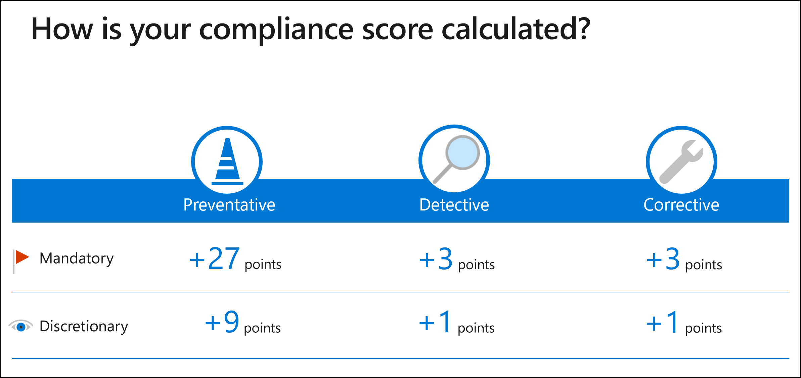

# Trabajar con plantillas de evaluación en el Administrador de cumplimiento

**En este artículo:** Comprenda **cómo funcionan las plantillas** y cómo **administrarlas desde** la página de plantillas de evaluación. Obtenga instrucciones para **crear nuevas**  plantillas, **ampliar** y modificar plantillas existentes, dar formato a los datos de la plantilla **con** Excel y exportar informes de **plantilla**.

> [!IMPORTANT]
> Las plantillas de evaluación que están disponibles para su organización dependen del contrato de licencia. [Revise los detalles](/office365/servicedescriptions/microsoft-365-service-descriptions/microsoft-365-tenantlevel-services-licensing-guidance/microsoft-365-security-compliance-licensing-guidance).

## Introducción a plantillas

Una plantilla es un marco de controles para crear una evaluación en el Administrador de cumplimiento. Nuestro conjunto completo de plantillas puede ayudar a su organización a cumplir con los requisitos nacionales, regionales y específicos del sector que rigen la recopilación y el uso de datos. Nos referimos a plantillas con el mismo nombre que su certificación o reglamento subyacentes, como la plantilla RGPD de la UE y la plantilla ISO/IEC 27701:2019.

## Disponibilidad y licencias de plantillas

Las plantillas disponibles para su uso se basan en el contrato de licencia de su organización ([ver detalles de licencias](/office365/servicedescriptions/microsoft-365-service-descriptions/microsoft-365-tenantlevel-services-licensing-guidance/microsoft-365-security-compliance-licensing-guidance#compliance-manager)). Hay dos categorías de plantillas: incluidas y premium.

#### Plantillas incluidas y premium

1. **Las plantillas incluidas** se conceden mediante su licencia y cubren las normativas y requisitos clave.
2. **Premium pueden adquirirse** plantillas para expandir la biblioteca y cubrir necesidades específicas. Una vez comprado, puede crear tantas evaluaciones de una plantilla como sea necesario. [Obtén información sobre cómo puedes comprar plantillas premium.](/office365/servicedescriptions/microsoft-365-service-descriptions/microsoft-365-tenantlevel-services-licensing-guidance/microsoft-365-security-compliance-licensing-guidance#compliance-manager)

Ver la [lista completa de plantillas](compliance-manager-templates-list.md).

#### Plantillas activas e inactivas

Las plantillas mostrarán un estado de activación como activo o inactivo:

- Una plantilla se considera **activa** una vez que se crea una evaluación a partir de esa plantilla.
- Una plantilla se considera **inactiva** si su organización no la usa para una evaluación.

Al comprar una plantilla premium y crear una evaluación a partir de ella, esa plantilla está activa durante un año. La compra se renovará automáticamente a menos que canceles.

También puede probar plantillas premium en una versión de prueba. Las licencias de prueba son válidas para un máximo de 25 plantillas durante 30 días. Una vez que comience la prueba, las plantillas deben estar disponibles en el espacio empresarial en un plazo de 48 horas. Las pruebas se pueden activar a través del Centro de administración de Microsoft 365.

#### Contador de plantillas activadas

La página de evaluación y la página de plantillas de evaluación tienen **un contador de plantillas activadas** cerca de la parte superior. El contador muestra el número de plantillas en uso fuera del número que puede usar de acuerdo con el contrato de licencia. El uso de plantillas se cuenta en el nivel de certificación.

Por ejemplo, si el contador muestra 2/5, esto significa que su organización ha activado 2 plantillas de las 5 que están disponibles para usar.

Si el contador muestra 5/2, esto indica que su organización supera sus límites y necesita comprar 3 de las plantillas premium en uso.

Para obtener más información, consulte [Compliance Manager licensing guidance](/office365/servicedescriptions/microsoft-365-service-descriptions/microsoft-365-tenantlevel-services-licensing-guidance/microsoft-365-security-compliance-licensing-guidance#compliance-manager).

## Ver y administrar plantillas

La página plantillas de evaluación del Administrador de cumplimiento muestra una lista de plantillas y detalles clave sobre ellas. La lista incluye plantillas proporcionadas por el Administrador de cumplimiento, así como cualquier plantilla que la organización haya modificado o creado. Puede aplicar filtros para buscar una plantilla basada en la certificación, el ámbito del producto, el país, la industria, quién la creó y si la plantilla está habilitada para la creación de evaluaciones.

Seleccione una plantilla de su fila para mostrar su página de detalles. Esta página contiene una descripción de la plantilla y más información sobre los detalles de certificación, ámbito y controles. En esta página puede seleccionar los botones adecuados para crear una evaluación, exportar los datos de plantilla a Excel o modificar la plantilla.

## Dar formato a los datos de plantilla Excel

La Excel hoja de cálculo ( descargar un ejemplo[)](https://go.microsoft.com/fwlink/?linkid=2124865)usada para crear o modificar plantillas tiene un formato y un esquema específicos que deben usarse para importarse correctamente en el Administrador de cumplimiento. Contiene cuatro pestañas, tres de las cuales son necesarias:

1. [Plantilla](#template-tab) (obligatorio)
2. [ControlFamily](#controlfamily-tab) (obligatorio)
3. [Acciones](#actions-tab) (obligatorio)
4. [Dimensiones](#dimensions-tab) (opcional)

Al rellenar la hoja de cálculo con datos de plantilla, la hoja de cálculo debe incluir las **pestañas** en el orden indicado anteriormente, de lo contrario, los datos no se importarán correctamente a una plantilla.

##### Ficha Plantilla

Se **requiere la pestaña** Plantilla. La información de esta pestaña proporciona metadatos sobre la plantilla. Hay cuatro columnas necesarias. Las columnas deben conservar el orden en la Excel como se muestra a continuación. Puede agregar su propia columna después **de** las cuatro columnas para proporcionar sus propias dimensiones. Si lo hace, asegúrese de agregarlos a la **pestaña Dimensiones.**

- **title:** este es el título de la plantilla, que debe ser único. No puede compartir un nombre con otra plantilla que tenga en el Administrador de cumplimiento, incluidas sus propias plantillas o una plantilla de Administrador de cumplimiento.

- **product:** se trata de una dimensión necesaria. Enumerar el producto asociado a la plantilla.

- **certificación:** este es el reglamento que está usando para la plantilla.

- **inScopeServices:** estos son los servicios del producto que aborda esta evaluación (por ejemplo, si aparece Office 365 como el producto, Microsoft Teams podría ser un servicio en el ámbito). Puede enumerar varios servicios separados por dos puntos y comas.

> [!NOTE]
> Los datos que inserte  en las celdas **de** producto y certificación no se pueden editar después de importar la hoja de cálculo para crear o personalizar una plantilla. Además, un grupo no puede contener dos evaluaciones que tengan la misma **combinación de producto y** certificación. Puede tener varias plantillas con la misma combinación de producto y certificación.

##### Ficha ControlFamily

Se **requiere la pestaña ControlFamily.**  Las columnas necesarias en esta pestaña, que deben seguir el orden proporcionado en la hoja de cálculo de ejemplo, son:

- **controlName:** este es el nombre del control de la certificación, estándar o regulación, que suele ser algún tipo de identificador. Los nombres de control deben ser únicos dentro de una plantilla. No puede tener varios controles con el mismo nombre en la hoja de cálculo.

- **controlFamily:** proporcione una palabra o frase para el controlFamily, que identifica una amplia agrupación de controles. Un controlFamily no tiene que ser único; puede aparecer más de una vez en una hoja de cálculo. El mismo controlFamily también se puede enumerar en varias plantillas, aunque no tienen relación entre sí. Cada controlFamily debe asignarse a al menos un control.

- **controlTitle:** proporcione un título para el control. Mientras que controlName es un código de referencia, el título es un formato de texto enriquecido que se suele ver en las regulaciones.

- **controlDescription:** proporcione una descripción del control.

- **controlActionTitle:** este es el título de una acción que desea relacionar con este control. Puede agregar varias acciones separando dos puntos y comas sin espacio entre ellos. Cada control que enumeras debe incluir al menos una acción y la acción debe  existir (lo que significa que puedes enumerar una acción que enumeras en la pestaña Acciones de la misma hoja de cálculo, una acción que existe en una plantilla diferente o una acción creada por Microsoft). Diferentes controles pueden hacer referencia a la misma acción.

##### Pestaña Acciones

Se **requiere la pestaña** Acciones.  Designa acciones de mejora administradas por su organización y no las de Microsoft, que ya existen en el Administrador de cumplimiento. Las columnas necesarias para esta pestaña, que deben seguir el orden proporcionado en la hoja de cálculo de ejemplo, son:

- **actionTitle:** este es el título de la acción y es un campo obligatorio. El título que proporciones debe ser único. **Importante:** si hace referencia a una acción de su propiedad que ya existe (como en otra plantilla) y modifica cualquiera de sus elementos en las columnas posteriores, esos cambios se propagarán a la misma acción en otras plantillas.

- **implementationType:** en este campo obligatorio, enumera uno de los tres tipos de implementación siguientes:
    - **Operativo:** acciones implementadas por personas y procesos para proteger la confidencialidad, integridad y disponibilidad de los sistemas organizativos, activos, datos y personal (por ejemplo: sensibilización y formación en materia de seguridad)
    - **Técnicas:** acciones completadas con tecnología y mecanismos contenidos en los componentes de hardware, software o firmware del sistema de información para proteger la confidencialidad, integridad y disponibilidad de los sistemas y datos de la organización (por ejemplo: autenticación multifactor)
    - **Documentación:** acciones implementadas a través de directivas y procedimientos documentados que establecen y definen los controles necesarios para proteger la confidencialidad, integridad y disponibilidad de los sistemas organizativos, activos, datos y personal (por ejemplo, una directiva de seguridad de la información)

- **actionScore:** en este campo obligatorio, proporcione un valor de puntuación numérico para la acción. El valor debe ser un número entero que va de 1 a 99; no puede ser 0, nulo o en blanco. Cuanto mayor sea el número, mayor será su valor para mejorar la posición de cumplimiento. En la imagen siguiente se muestra cómo puntua el Administrador de cumplimiento los controles:

- **actionDescriptionTitle:** este es el título de la descripción y es obligatorio. Este título de descripción te permite tener la misma acción en varias plantillas y mostrar una descripción diferente en cada plantilla.  Este campo le ayuda a aclarar la plantilla a la que hace referencia la descripción. En la mayoría de los casos, puede colocar el nombre de la plantilla que está creando en este campo.

- **actionDescription:** proporcione una descripción de la acción. Puede aplicar formato, como texto en negrita e hipervínculos. Este campo es obligatorio.

- **dimension-Action Purpose:** se trata de un campo opcional. Si lo incluye, el encabezado debe incluir el prefijo "dimension-". Las dimensiones que incluyas aquí se usarán como filtros en el Administrador de cumplimiento y aparecerán en la página de detalles de las acciones de mejora en el Administrador de cumplimiento.

##### Ficha Dimensiones

La **pestaña Dimensiones** es opcional. Sin embargo, si hace referencia a una dimensión en otro lugar, debe especificarla aquí si no existe en una plantilla que ya haya creado o en una plantilla de Microsoft. Las columnas de esta pestaña se enumeran a continuación:

- **dimensionKey:** list as "product", "certifications", "action purpose"
- **dimensionValue:** ejemplos: Office 365, HIPPA, Preventative, Detective

Al exportar una plantilla existente, la hoja de cálculo exportada tendrá la pestaña **Dimensiones,** que enumera todas las dimensiones usadas en la plantilla.

## Crear una plantilla de evaluación

Para crear su propia plantilla nueva para evaluaciones personalizadas, usará su hoja de cálculo con formato especial Excel para ensamblar los datos de control necesarios. Después de completar la hoja de cálculo, la importará al Administrador de cumplimiento.

#### Roles obligatorios

Solo los usuarios que tienen un rol de administrador global o administrador de cumplimiento pueden crear y modificar plantillas. Obtenga más información [sobre roles y permisos](compliance-manager-setup.md#set-user-permissions-and-assign-roles).

### Crear nueva plantilla en el Administrador de cumplimiento

1. Vaya a la página **plantillas de evaluación** en el Administrador de cumplimiento.
2. Seleccione **Crear nueva plantilla**. Se abrirá un asistente para la creación de plantillas.
3. Elija el tipo de plantilla que desea crear. En este caso, seleccione **Crear una plantilla personalizada** y, a continuación, seleccione **Siguiente**.
4. En la **Upload de** archivos,  seleccione Examinar para buscar y cargar el archivo Excel formato que contiene todos los datos de plantilla necesarios.
5. Si no hay ningún problema con el archivo, se mostrará el nombre del archivo cargado. Seleccione **Siguiente** para continuar. (Si necesita cambiar el archivo, **seleccione Upload un archivo diferente**).
    - Si hay un error en el archivo, un mensaje de error en la parte superior explica lo que está mal. Tendrás que corregir el archivo y cargarlo de nuevo. Los errores se producen si la hoja de cálculo tiene un formato incorrecto o si hay información no válida en determinados campos.
6. La **pantalla Revisar y finalizar** muestra el número de acciones y controles de mejora y la puntuación máxima de la plantilla. Cuando esté listo para aprobar, seleccione **Crear plantilla.** (Si necesita realizar cambios, seleccione **Atrás**.)
7. La última pantalla confirma que se ha creado una plantilla nueva. Seleccione **Listo** para salir del asistente.
8. Llegará a la página de detalles de la nueva plantilla, donde puede [crear la evaluación](compliance-manager-assessments.md#create-assessments).

## Ampliar una plantilla de evaluación

El Administrador de cumplimiento ofrece la opción de agregar sus propios controles y acciones de mejora a una plantilla proporcionada por Microsoft existente. Este proceso se denomina extensión de una plantilla de Microsoft. Al ampliar una plantilla, todavía puede recibir actualizaciones publicadas por Microsoft, lo que puede ocurrir cuando hay cambios en la regulación o el producto relacionado (vea Aceptar actualizaciones de [evaluaciones](compliance-manager-assessments.md#accept-updates-to-assessments)).

Para prepararlo, deberá ensamblar una hoja de cálculo Excel formato especial para importar los datos de plantilla necesarios. Los Excel siguen el mismo formato general descrito anteriormente, pero existen requisitos especiales para las extensiones. Vea estos puntos adicionales para ayudar a evitar errores:

- La hoja de cálculo solo debe contener las acciones y controles que desee agregar a la evaluación.
- La hoja de cálculo no puede contener ninguno de los controles o acciones que ya existen en la evaluación que desea modificar.
- Considere la posibilidad de incluir "extensión" en el título de la plantilla, por ejemplo, "RGPD – extensión [nombre de la empresa]". Esto facilita la identificación en la  lista de la página plantillas de evaluación como distinta de la plantilla estándar proporcionada por Microsoft o una plantilla personalizada con un nombre similar.

Después de dar formato a la hoja de cálculo, siga los pasos siguientes.

1. Vaya a la **página Plantillas de evaluación** y seleccione Crear nueva **plantilla.** Se abrirá un asistente para la creación de plantillas.

2. Elija el tipo de plantilla que desea crear. En este caso, seleccione **Extender una plantilla de Microsoft** y, a continuación, Seleccionar plantilla de **Microsoft**.

3. Aparece un panel desplegable de selección de plantilla en el lado derecho de la pantalla, que muestra una lista de todas las plantillas y su estado de activo o inactivo. El **contador de plantillas** activadas muestra cuántas plantillas están actualmente en uso del número total disponible para usar. Si supera el límite, una barra de mensajes le proporcionará aviso.

4. Aparece un panel desplegable de selección de plantilla en el lado derecho de la pantalla. Usar **la** búsqueda para aplicar filtros para localizar la plantilla que desee

5. Una vez que encuentre la plantilla, seleccione el botón de radio situado a la izquierda de su nombre y, a continuación, **seleccione Guardar**.

6. En la siguiente pantalla se muestra la plantilla seleccionada. Si es correcto, seleccione **Siguiente**. (Si es incorrecto, **elija Seleccionar una plantilla diferente** para volver a elegir).

7. En la **Upload de** archivos,  seleccione Examinar para buscar y cargar el archivo Excel formato que contiene todos los datos de plantilla necesarios.

8. Si no hay ningún problema con el archivo, en la siguiente pantalla se muestra el nombre del archivo cargado. Seleccione **Siguiente** para continuar (si necesita cambiar el archivo, **seleccione Upload otro archivo**).

    - Si hay un problema con el archivo, un mensaje de error en la parte superior explica lo que está mal. Tendrás que corregir y volver a cargar el archivo. Los errores se producen si la hoja de cálculo tiene un formato incorrecto o si hay información no válida en determinados campos.

9. La **pantalla Revisar y finalizar** muestra el número de acciones y controles de mejora y la puntuación máxima de la plantilla. Cuando esté listo para aprobar, seleccione **Siguiente**. (Si necesita realizar cambios, seleccione **Upload otro archivo**.)

10. La última pantalla confirma que se ha creado una plantilla nueva. Seleccione **Listo** para salir del asistente.

11. Llegarás a la página de detalles de la nueva plantilla. Desde aquí puede crear su evaluación seleccionando **Crear evaluación**. Para obtener instrucciones, vea [Build and manage assessments](compliance-manager-assessments.md#create-assessments).

## Modificar una plantilla

Es posible que desee modificar una plantilla que ya ha creado, como agregar controles o agregar o quitar acciones de mejora. El proceso es similar al proceso de creación de plantillas en el que cargarás un archivo Excel con los datos de la plantilla.

Sin embargo, hay detalles que debe tener en cuenta a medida que se da formato al archivo con cambios en los datos de plantilla existentes. **Te recomendamos que revises estas instrucciones cuidadosamente para asegurarte de que no sobrescriba los datos existentes que quieras conservar.**

### Dar formato Excel archivo para modificar una plantilla existente

En la **página plantillas de** evaluación, seleccione la plantilla que desea   modificar, que mostrará su página de detalles. A **continuación, seleccione Exportar a Excel**. Se descargará Excel archivo con todos los datos de la plantilla. Guarde el archivo en el equipo local.

Para trabajar con este archivo, vaya a una sección siguiente para encontrar rápidamente las instrucciones que necesita:

- [Editar los atributos de plantilla principales](#edit-the-main-template-attributes)
- [Agregar una acción de mejora](#add-an-improvement-action)
- [Editar la información de una acción de mejora](#edit-an-improvement-actions-information)
- [Cambiar el nombre de una acción de mejora](#change-an-improvement-actions-name)
- [Quitar una acción de mejora](#remove-an-improvement-action)
- [Quitar un control](#remove-a-control)

#### Editar los atributos de plantilla principales

En la **pestaña** Plantillas, puede editar cualquier elemento de la columna **de** título, la columna **inScopeServices** y cualquier otra columna que haya agregado. Sin embargo, no puede editar nada en las columnas **de producto** **o** certificación.

#### Agregar una acción de mejora

1. Vaya a la **pestaña** Acciones. Agregue la información en los campos necesarios en la primera fila vacía debajo de las acciones existentes.
2. Vaya a la **pestaña ControlFamily.** Busque la fila que contiene el control al que se asigna la acción de mejora. Agregue la nueva acción a la **columna controlActionTitle** de esa fila (recuerde separar varias acciones en este campo con dos puntos y comas, sin espacio entre).
3. Guarde la hoja de cálculo.

#### Editar la información de una acción de mejora

Puede cambiar la información de cualquier acción de mejora *excepto por su título*. Puede editar cualquier celda de las columnas B en adelante y, al volver a importar el archivo a la plantilla, las acciones de mejora de esa plantilla ahora contendrán los datos actualizados.

No puede editar **actionTitle** (columna A) porque, si lo hace, el Administrador de cumplimiento considera que se trata de una nueva acción de mejora. Si quieres cambiar el nombre de una acción de mejora, consulta las instrucciones que aparecen a continuación.

#### Cambiar el nombre de una acción de mejora

Si desea cambiar el nombre de una acción de mejora, debe designar explícitamente en la hoja de cálculo que va a reemplazar un nombre existente por un nuevo nombre. Siga estos pasos:

1. En la **pestaña Acciones** de la hoja de cálculo, agregue una nueva columna a la hoja de cálculo después de la columna A.
2. En esta nueva columna, que ahora es la columna B, se coloca como su encabezado en la fila 1: **oldActionTitle**.
3. Copie el contenido de la columna A y péguelo en la columna B. Esto coloca los títulos de acción de mejora existentes, que es lo que desea cambiar, en la columna B.
4. En la columna A, **actionTitle**, elimine el nombre antiguo y reemplácelo por el nuevo nombre de la acción de mejora.

Tenga en cuenta que los títulos de acción, tanto para las acciones de mejora como para las acciones de Microsoft, deben escribirse en inglés para que se reconozcan cuando se hace referencia en controles.

#### Quitar una acción de mejora

Para quitar una acción de mejora de una plantilla, tendrás que quitarla de cada control que haga referencia a ella. Siga los pasos siguientes para modificar la hoja de cálculo:

1. En la **pestaña ControlFamily,** busque el título de la acción de mejora que desea quitar.
2. Elimine el título de la acción de mejora en las celdas donde aparece. Si la acción de mejora es la única acción de esa fila, elimine toda la fila (que quita el control).
3. En la **pestaña** Acciones, elimine la fila que contiene la acción de mejora que está eliminando.
4. Guarde la hoja de cálculo.

Al volver a importar la hoja de cálculo a la plantilla, la acción de mejora se quitará de la plantilla.

Quitar una acción de mejora de una plantilla no quita completamente la acción de mejora del Administrador de cumplimiento. Otra plantilla puede hacer referencia a esa acción.

#### Quitar un control

Para quitar un control, modifique la hoja de cálculo siguiendo los pasos siguientes y vuelva a importar la hoja de cálculo:

1. En la **pestaña ControlFamily,** busque el control que desea quitar en la **columna controlName.**
2. Elimine la fila de ese control.
    - Si este control eliminado contiene acciones de mejora a las que ningún otro control hace referencia, deberá quitar esas acciones de mejora de la **pestaña** Acciones. De lo contrario, recibirá un error de validación.

3. Guarde la hoja de cálculo.

Al volver a importar la hoja de cálculo a la plantilla, el control se quitará de la plantilla.

### Modificar información de plantilla en el Administrador de cumplimiento

Después de Excel y guardado el archivo, siga estos pasos.

1. Vuelva a abrir la página de la plantilla de evaluación y seleccione la plantilla. En la página de detalles de la plantilla, seleccione **Modificar plantilla** para iniciar el asistente de modificación.
2. En la **Upload de archivos,** seleccione **Examinar** para buscar y cargar el Excel archivo.
3. Si no hay ningún problema con el archivo, en la siguiente pantalla se muestra el nombre del archivo cargado. Seleccione **Siguiente** para continuar (si necesita cambiar el archivo, **seleccione Upload otro archivo**).
    - Si hay un problema con el archivo, un mensaje de error en la parte superior explica lo que está mal. Tendrás que corregir el archivo y cargarlo de nuevo. Los errores se producen si la hoja de cálculo tiene un formato incorrecto o si hay información no válida en determinados campos.

4. La **pantalla Revisar y finalizar** muestra el número de acciones y controles de mejora y la puntuación máxima de la plantilla. Cuando esté listo para aprobar, seleccione **Siguiente**.
5. La última pantalla confirma que la plantilla se ha modificado. Seleccione **Listo** para salir del asistente.

La plantilla ahora incluirá los cambios realizados. Las evaluaciones que usen esta plantilla modificada ahora mostrarán actualizaciones pendientes y deberá aceptar las actualizaciones de las evaluaciones para reflejar los cambios realizados en la plantilla. Obtenga más información sobre [las actualizaciones de las evaluaciones](compliance-manager-assessments.md#accept-updates-to-assessments).

> [!NOTE]
> Si usa el Administrador de cumplimiento en un idioma distinto del inglés, observará que algún texto aparece en inglés al exportar una plantilla a Excel. Los títulos de las acciones (tanto las acciones de mejora como las acciones de Microsoft) deben estar en inglés para ser reconocidos por los controles. Si realiza cambios en un título de acción, asegúrese de escribirlo en inglés para que el archivo se importe correctamente.

## Exportar una plantilla

Puede exportar un archivo Excel que contenga todos los datos de una plantilla. Tendrás que exportar una plantilla para modificarla, ya que este será el archivo Excel editar y cargar en el proceso [de modificación.](#modify-a-template)

Para exportar la plantilla, vaya a la página de detalles de la plantilla y seleccione el botón Exportar **a Excel** plantilla.

Tenga en cuenta que al exportar una plantilla que extendió desde una plantilla del Administrador de cumplimiento, el archivo exportado solo contendrá los atributos que agregó a la plantilla. El archivo exportado no incluirá los datos de plantilla originales proporcionados por Microsoft. Para obtener dicho informe, vea las instrucciones para [exportar un informe de evaluación](compliance-manager-assessments.md#export-an-assessment-report).
