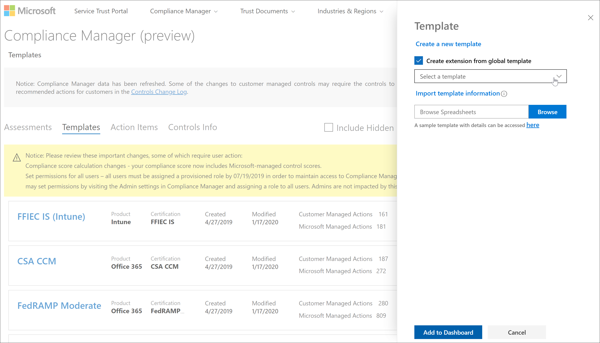

# Actualizaciones de la puntuación de cumplimiento de Microsoft (versión preliminar)Microsoft Compliance Score (Preview) updates

 En este artículo se proporcionan detalles sobre futuras actualizaciones de la [puntuación de cumplimiento de Microsoft](compliance-score.md) y el administrador de cumplimiento de [Microsoft](compliance-manager-overview.md).This article provides details about future updates to [Microsoft Compliance Score](compliance-score.md) and [Microsoft Compliance Manager](compliance-manager-overview.md). Obtenga más información sobre su [relación](compliance-score-release-notes.md#compliance-score-relationship-to-compliance-manager).Learn more about their [relationship](compliance-score-release-notes.md#compliance-score-relationship-to-compliance-manager).

## Procesos de actualización y creación de plantillas mejoradosImproved template creation and update processes

Estamos simplificando el proceso de importación, exportación y modificación de plantillas para evaluaciones.We're simplifying the process for importing, exporting, and modifying templates for assessments. La nueva experiencia le permitirá llevar a cabo sus propias evaluaciones en la puntuación de cumplimiento y mantenerla actualizada.The new experience will make it easier for you to bring your own assessments into Compliance Score and keep them updated.

### El proceso actualThe current process

Hay dos formas de crear una plantilla en el administrador de cumplimiento.There are two ways to create a template in Compliance Manager. Puede copiar una plantilla existente o importar datos de plantilla de una hoja de cálculo de Excel a una plantilla nueva.You can copy an existing template, or you can import template data from an Excel spreadsheet into a new template. Desde la página de **plantillas** , seleccione **+ Agregar plantilla** para crear una plantilla completamente nueva escribiendo un nombre, seleccionando dimensiones y cargando un archivo de Excel con un formato y un esquema específicos.From your **Templates** page, you select **+ Add template** to create a brand new template by entering a name, selecting dimensions, and uploading an Excel file with a specific format and schema. O bien, puede activar la casilla **Copiar desde una plantilla existente** , seleccionar una plantilla para copiar y comprobar las dimensiones, tal como se muestra en la imagen siguiente.Or you can check the **Copy from an existing template** box, select a template to copy, and verify dimensions, as shown in the image below. La personalización de la plantilla requiere un [proceso de varios pasos](working-with-compliance-manager.md#templates) que comienza seleccionando **Agregar control personalizado** después de crear la plantilla.Customizing your template requires a [multi-step process](working-with-compliance-manager.md#templates) that begins by selecting **Add custom control** after creating your template.

### CambiosWhat's changing

Estamos haciendo que sea más fácil crear plantillas nuevas.We're making it easier for you to create new templates. En un proceso de **extensión** de un solo paso, puede Agregar una hoja de cálculo con sus acciones y controles a una plantilla de Microsoft existente para crear su propia versión personalizada.In a one-step **extension** process, you can add a spreadsheet with your actions and controls to an existing Microsoft template to make your own customized version. En el panel flotante de **plantilla** , active la casilla **crear extensión a partir de plantilla global** , como se muestra en la imagen siguiente.On the **Template** flyout pane, select the **Create extension from global template** checkbox, as shown in the image below. A continuación, agregará las personalizaciones con un nuevo formato de Excel que es menos complejo que el actual.You'll then add customizations using a new Excel format that is less complex than the current one. Este nuevo proceso reemplaza la **copia actual de una plantilla existente** y **agrega funciones de control personalizadas** .This new process replaces the current **Copy from an existing template** and **Add custom control** functions.

Cada vez que se actualiza la evaluación original mediante el proceso de control de versiones que se describe a continuación, la evaluación personalizada heredará esas actualizaciones y conservará los controles personalizados.Each time the original assessment is updated through the versioning process outlined below, your customized assessment will inherit those updates and keep your custom controls.

También estamos haciendo que sea más fácil modificar sus propias plantillas existentes.We're also making it easier to modify your own existing templates. Puede exportar la plantilla, realizar cambios en el mismo libro y, a continuación, importarla con las modificaciones guardadas.You can export your template, make changes in the same workbook, then import it with your edits saved.

## Aviso y control de versionesVersioning notice and control

Su organización recibirá evaluaciones actualizadas en la próxima versión de la puntuación de cumplimiento y el administrador de cumplimiento para ayudarle a alinearse con las actualizaciones de la regla y la certificación.Your organization will receive updated assessments in the next release of Compliance Score and Compliance Manager to help you align with certification and regulation updates.

En el futuro, siempre que haya una actualización disponible para una plantilla de evaluación o una acción de mejora, un icono de alerta le indicará que hay una actualización lista.Going forward, whenever an update is available for an assessment's template or an improvement action, an alert icon notifies you that an update is ready. Al hacer clic en este icono, una ventana emergente explica la actualización y se le pide que acepte.When you click on that icon, a pop-up window explains the update and prompts you to accept. A continuación se muestra un ejemplo de la alerta de control de versiones para una evaluación:Below is an example of the versioning alert for an assessment:

Al seleccionar el icono de alerta, se revela un panel de control flotante en el que se explica la actualización y se le pide que acepte:Selecting the alert icon reveals a flyout pane explaining the update and prompting you to accept:

## Las acciones comunes sincronizarán el estado entre gruposCommon actions will synch status across groups

Si su organización tiene varios grupos de evaluaciones, el comportamiento de las acciones **técnicas** (es decir, las acciones que afectan a toda la organización) cambiará.If your organization has multiple groups of assessments, the behavior of **Technical** actions (that is, actions affecting your entire organization) will change. Todas las acciones duplicadas entre grupos se combinarán en una sola acción.Any duplicate actions across groups will be combined into one single action. Esa única acción contendrá todas las notas cargadas y la evidencia de las versiones duplicadas.That single action will contain all uploaded notes and evidence from the duplicate versions. Con este cambio, las acciones técnicas se comportarán tal como lo hacen actualmente cuando pertenezcan al mismo grupo.With this change, technical actions will behave as they currently do when they belong to the same group. Cualquier cambio realizado en la acción en un grupo o evaluación se reflejará ahora en todas las instancias.Any change made to the action in one group or assessment will now be reflected in all instances. El **Estado de implementación**, los **DAT de implementación**, el estado de **prueba**y la **fecha** de prueba reflejarán las actualizaciones más recientes.The **Implementation Status**, **Implementation Dat**, **Test Status**, and **Test Date** will reflect the most recent updates.

## Compatibilidad con idiomasLanguage support

La puntuación de cumplimiento ahora estará disponible en los siguientes idiomas, además de en Inglés: Chino (simplificado), Chino (tradicional), Francés, alemán, Italiano, Japonés, Coreano, Portugués (Brasil), Ruso y español.Compliance Score will now be available in the following languages in addition to English: Chinese (Simplified), Chinese (Traditional), French, German, Italian, Japanese, Korean, Portuguese (Brazil), Russian, and Spanish.
