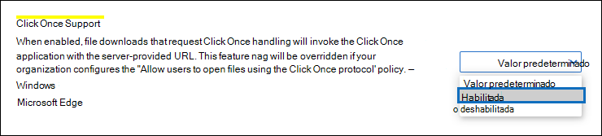
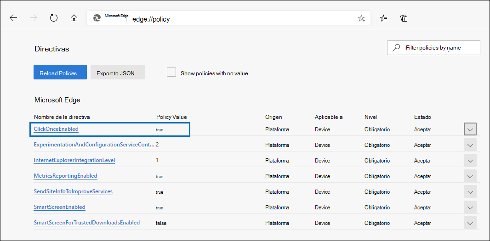
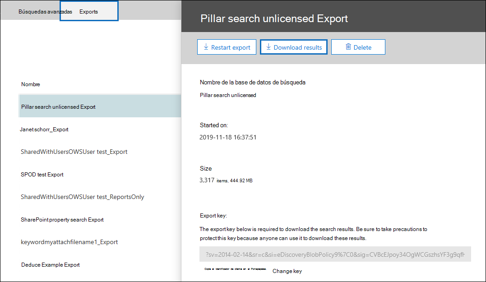
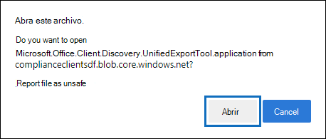
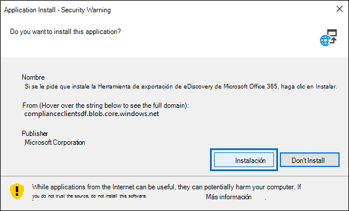

# Usar la herramienta de exportación de exhibición de documentos electrónicos de Office 365 en Microsoft EdgeUse the Office 365 eDiscovery Export Tool in Microsoft Edge

Como resultado de los últimos cambios en la versión más reciente de Microsoft Edge, la compatibilidad con ClickOnce ya no está habilitada de forma predeterminada.As a result of recent changes to the newest version of Microsoft Edge, ClickOnce support is no longer enabled by default. Para seguir usando la herramienta de exportación de exhibición de documentos electrónicos 365 de Microsoft Office para descargar los resultados de búsqueda de contenido o de exhibición de documentos electrónicos, debe usar [Microsoft Internet Explorer](https://support.microsoft.com/help/17621/internet-explorer-downloads) o habilitar la compatibilidad con ClickOnce en la versión más reciente de Microsoft Edge.To continue using the Microsoft Office 365 eDiscovery Export Tool to download Content Search or eDiscovery search results, you either need to use [Microsoft Internet Explorer](https://support.microsoft.com/help/17621/internet-explorer-downloads) or enable ClickOnce support in the newest version of Microsoft Edge.

## Habilitar la compatibilidad con ClickOnce en Microsoft EdgeEnable ClickOnce support in Microsoft Edge

1. En Microsoft Edge, ve a **edge://flags/#edge clic una vez**.In Microsoft Edge, go to **edge://flags/#edge-click-once**.

2. Si el valor existente se establece en **predeterminado** o está **deshabilitado** en la lista desplegable, cámbielo a **habilitado**.If the existing value is set to **Default** or **Disabled** in the dropdown list, change it to **Enabled**.

   

3. Desplácese hacia abajo hasta la parte inferior de la ventana del explorador y haga clic en **reiniciar** para reiniciar el perímetro.Scroll down to the bottom of the browser window and click **Restart** to restart Edge.

   

**Nota:** Las organizaciones pueden usar la Directiva de grupo para deshabilitar la compatibilidad con ClickOnce.**Note:** Organizations can use Group Policy to disable ClickOnce support. Para comprobar si hay una directiva de la organización para la compatibilidad con ClickOnce, vaya a **Edge://Policy**.To check if there is an organizational policy for ClickOnce support, go to **edge://policy**. En la siguiente captura de pantalla se muestra que ClickOnce está habilitado en toda la organización.The following screenshot shows that ClickOnce is enabled across the entire organization. Si el valor de esta Directiva se establece en **false**, deberá ponerse en contacto con un administrador de la organización.If this policy value is set to **false**, you will need to contact an admin in your organization.

## Instalar y ejecutar la herramienta de exportación de exhibición de documentos electrónicosInstall and run the eDiscovery Export Tool

1. Haga clic en **Descargar resultados** en la página de flotante de una exportación en una búsqueda de contenido o un caso de exhibición de documentos electrónicos.Click **Download results** on the flyout page of an export in Content Search or an eDiscovery case.

   

2. Se le pedirá que confirme que desea iniciar la herramienta; para ello, haga clic en **abrir**.You will be prompted with a confirmation to launch the tool, Click **Open**.

   

   Si la herramienta de exportación de exhibición de documentos electrónicos 365 de Microsoft Office no está instalada, se le mostrará una advertencia de seguridad.If the Microsoft Office 365 eDiscovery Export Tool isn't installed, you will be prompted with a Security Warning, 

   

3. Haga clic en **Instalar**.Click **Install**. Una vez instalada, la herramienta de exportación se iniciará automáticamente.After it's installed, the export tool will launch automatically.

Para obtener más información, vea los siguientes temas:For more information, see the following topics:

- [Exportar resultados de la búsqueda de contenidoExport Content Search results](export-search-results.md)

- [Cómo habilitar las marcas de experimento en Microsoft EdgeHow to enable experiment flags in Microsoft Edge](https://microsoftedgesupport.microsoft.com/hc/articles/360034075294-How-to-enable-experiment-flags-in-Microsoft-Edge-Insider-channels)
