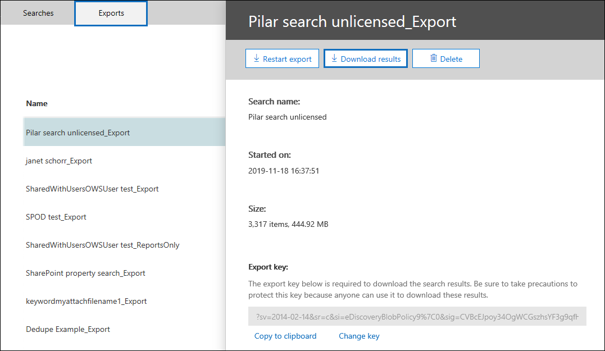
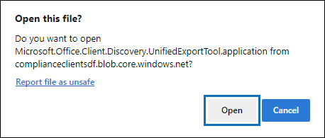

# Usar la herramienta de exportación de exhibición de documentos electrónicos de Office 365 en Microsoft Edge

Como resultado de los últimos cambios realizados en Microsoft Edge, la compatibilidad con ClickOnce ya no está habilitada de forma predeterminada. Para seguir usando la herramienta de exportación de exhibición de documentos electrónicos 365 de Microsoft Office para descargar los resultados de búsqueda de contenido o de exhibición de documentos electrónicos, debe usar [Microsoft Internet Explorer](https://support.microsoft.com/help/17621/internet-explorer-downloads) o habilitar la compatibilidad con ClickOnce en Microsoft Edge.

## Cómo habilitar la compatibilidad con ClickOnce en Microsoft Edge

1. En Microsoft Edge, navegue a **edge://flags/#edge clic una vez**.

2. Si el valor existente se establece en **predeterminado** o está **deshabilitado** en la lista desplegable, cámbielo a **habilitado**.
    
   

3. Desplácese hacia abajo hasta la parte inferior de la ventana del explorador y haga clic en **reiniciar** para reiniciar el perímetro.

   

**Nota:** Las organizaciones pueden usar la Directiva de grupo para deshabilitar la compatibilidad con ClickOnce. Para comprobar si existe una directiva de la organización para la compatibilidad con ClickOnce, vaya a **Edge://Policy**. En la siguiente captura de pantalla se muestra que ClickOnce está habilitado en toda la organización. Si el valor de esta Directiva se establece en **false**, deberá ponerse en contacto con un administrador de la organización.

## Instalar y ejecutar la herramienta de exportación de Office 365 eDiscovery

1. Haga clic en **Descargar resultados** en la página de flotante de una exportación en una búsqueda de contenido o un caso de exhibición de documentos electrónicos.

   

2. Se le pedirá que confirme que desea iniciar la herramienta; para ello, haga clic en **abrir**.

   

   Si la herramienta de exportación de exhibición de documentos electrónicos 365 de Microsoft Office no está instalada, se le mostrará una advertencia de seguridad. 

   

3. Haga clic en **Instalar**. Una vez instalada, la herramienta de exportación se iniciará automáticamente.

Para obtener más información, vea los siguientes temas:

- [Exportar resultados de la búsqueda de contenido](export-search-results.md)

- [Cómo habilitar las marcas de experimento en Microsoft Edge](https://microsoftedgesupport.microsoft.com/hc/articles/360034075294-How-to-enable-experiment-flags-in-Microsoft-Edge-Insider-channels)
