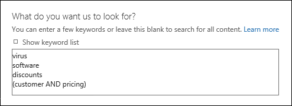
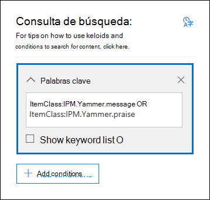

# <a name="feature-reference-for-content-search"></a><span data-ttu-id="b7453-103">Referencia de características para la búsqueda de contenido</span><span class="sxs-lookup"><span data-stu-id="b7453-103">Feature reference for Content search</span></span>

<span data-ttu-id="b7453-104">En este artículo se describen las características y funciones de la búsqueda de contenido.</span><span class="sxs-lookup"><span data-stu-id="b7453-104">This article describes features and functionality of Content search.</span></span>

## <a name="content-search-limits"></a><span data-ttu-id="b7453-105">Límites de búsqueda de contenido</span><span class="sxs-lookup"><span data-stu-id="b7453-105">Content search limits</span></span>

- <span data-ttu-id="b7453-106">Para obtener una descripción de los límites que se aplican a la búsqueda de contenido, consulte [Límites de Búsqueda de contenido](limits-for-content-search.md).</span><span class="sxs-lookup"><span data-stu-id="b7453-106">For a description of the limits that are applied to content searches, see [Limits for Content search](limits-for-content-search.md).</span></span>
  
- <span data-ttu-id="b7453-107">Microsoft recopila información del rendimiento de las búsquedas de contenido ejecutadas por todas las organizaciones en el servicio.</span><span class="sxs-lookup"><span data-stu-id="b7453-107">Microsoft collects performance information for Content searches run by all organizations in the service.</span></span> <span data-ttu-id="b7453-108">Aunque la complejidad de una consulta de búsqueda puede afectar al tiempo que lleva ejecutarla, en realidad, el factor más determinante es el número de buzones incluidos en la búsqueda.</span><span class="sxs-lookup"><span data-stu-id="b7453-108">While the complexity of the search query can impact search times, the biggest factor that affects how long searches take is the number of mailboxes searched.</span></span> <span data-ttu-id="b7453-109">Microsoft no proporciona un acuerdo de nivel de servicio para los tiempos de búsqueda. Sin embargo, en la siguiente tabla le mostramos los tiempos de búsqueda promedio en base al número de buzones.</span><span class="sxs-lookup"><span data-stu-id="b7453-109">Although Microsoft doesn't provide a Service Level Agreement for search times, the following table lists average search times for a Content Search based on the number of mailboxes included in the search.</span></span>
  
  |<span data-ttu-id="b7453-110">**Número de buzones**</span><span class="sxs-lookup"><span data-stu-id="b7453-110">**Number of mailboxes**</span></span>|<span data-ttu-id="b7453-111">**Promedio de tiempo de búsqueda**</span><span class="sxs-lookup"><span data-stu-id="b7453-111">**Average search time**</span></span>|
  |:-----|:-----|
  |<span data-ttu-id="b7453-112">100</span><span class="sxs-lookup"><span data-stu-id="b7453-112">100</span></span>  <br/> |<span data-ttu-id="b7453-113">30 segundos</span><span class="sxs-lookup"><span data-stu-id="b7453-113">30 seconds</span></span>  <br/> |
  |<span data-ttu-id="b7453-114">1000</span><span class="sxs-lookup"><span data-stu-id="b7453-114">1,000</span></span>  <br/> |<span data-ttu-id="b7453-115">45 segundos</span><span class="sxs-lookup"><span data-stu-id="b7453-115">45 seconds</span></span>  <br/> |
  |<span data-ttu-id="b7453-116">10 000</span><span class="sxs-lookup"><span data-stu-id="b7453-116">10,000</span></span>  <br/> |<span data-ttu-id="b7453-117">4 minutos</span><span class="sxs-lookup"><span data-stu-id="b7453-117">4 minutes</span></span>  <br/> |
  |<span data-ttu-id="b7453-118">25 000</span><span class="sxs-lookup"><span data-stu-id="b7453-118">25,000</span></span>  <br/> |<span data-ttu-id="b7453-119">10 minutos</span><span class="sxs-lookup"><span data-stu-id="b7453-119">10 minutes</span></span>  <br/> |
  |<span data-ttu-id="b7453-120">50 000</span><span class="sxs-lookup"><span data-stu-id="b7453-120">50,000</span></span>  <br/> |<span data-ttu-id="b7453-121">20 minutos</span><span class="sxs-lookup"><span data-stu-id="b7453-121">20 minutes</span></span>  <br/> |
  |<span data-ttu-id="b7453-122">100 000</span><span class="sxs-lookup"><span data-stu-id="b7453-122">100,000</span></span>  <br/> |<span data-ttu-id="b7453-123">25 minutos</span><span class="sxs-lookup"><span data-stu-id="b7453-123">25 minutes</span></span>  <br/> |
  |||
  
## <a name="building-a-search-query"></a><span data-ttu-id="b7453-124">Crear una consulta de búsqueda</span><span class="sxs-lookup"><span data-stu-id="b7453-124">Building a search query</span></span>

<span data-ttu-id="b7453-125">Para obtener información detallada sobre cómo crear una consulta de búsqueda, usar operadores booleanos y condiciones de búsqueda, y buscar información confidencial y contenido compartido con usuarios fuera de la organización, vea [Consultas de palabras clave y condiciones de búsqueda para la Búsqueda de contenido](keyword-queries-and-search-conditions.md).</span><span class="sxs-lookup"><span data-stu-id="b7453-125">For detailed information about creating a search query, using Boolean search operators and search conditions, and searching for sensitive information types and content shared with users outside your organization, see [Keyword queries and search conditions for Content Search ](keyword-queries-and-search-conditions.md).</span></span>
  
<span data-ttu-id="b7453-126">Tenga en cuenta lo siguiente cuando use la lista de palabras clave para crear una consulta de búsqueda.</span><span class="sxs-lookup"><span data-stu-id="b7453-126">Keep the following things in mind when using the keyword list to create a search query.</span></span>
  
- <span data-ttu-id="b7453-127">Debe seleccionar la casilla **Mostrar la lista de palabras clave** y, a continuación, escribir cada palabra clave en una fila. Si escribe varias palabras clave en una misma fila, quedarán relacionadas por el operador **O**.</span><span class="sxs-lookup"><span data-stu-id="b7453-127">You have to select the **Show keyword list** checkbox and then type each keyword in a separate row to create a search query where the keywords (or keyword phrases) in each row are connected by the **OR** operator.</span></span> <span data-ttu-id="b7453-128">Si pega una lista de palabras clave en el cuadro de palabras clave o presiona **Entrar** después de escribir cada palabra clave, estas no quedarán conectadas por el operador **O**.</span><span class="sxs-lookup"><span data-stu-id="b7453-128">If you paste a list of keywords in the keyword box or press the **Enter** key after typing a keyword, they won't be connected by the **OR** operator.</span></span> <span data-ttu-id="b7453-129">Estos son algunos ejemplos incorrectos y correctos de cómo agregar una lista de palabras clave.</span><span class="sxs-lookup"><span data-stu-id="b7453-129">Here are incorrect and correct examples of how to add a list of keywords.</span></span>
    
    <span data-ttu-id="b7453-130">**Incorrecto:**</span><span class="sxs-lookup"><span data-stu-id="b7453-130">**Incorrect**</span></span>
    
    
  
    <span data-ttu-id="b7453-132">**Correcto:**</span><span class="sxs-lookup"><span data-stu-id="b7453-132">**Correct**</span></span>
    
    
  
- <span data-ttu-id="b7453-134">También puede crear una lista de palabras clave o frases clave en un archivo de Excel o en un archivo de texto sin formato y, después, pegarla en la lista de palabras clave.</span><span class="sxs-lookup"><span data-stu-id="b7453-134">You can also prepare a list of keywords or keyword phrases in an Excel file or a plain text file, and then copy and paste your list into the keyword list.</span></span> <span data-ttu-id="b7453-135">Para hacerlo, seleccione la casilla **Mostrar lista de palabras clave**.</span><span class="sxs-lookup"><span data-stu-id="b7453-135">To do this, you have to select the **Show keyword list** check box.</span></span> <span data-ttu-id="b7453-136">Después, haga clic en la primera fila de la lista de palabras clave y pegue la lista.</span><span class="sxs-lookup"><span data-stu-id="b7453-136">Then, click the first row in the keyword list and paste your list.</span></span> <span data-ttu-id="b7453-137">Cada línea del archivo de texto o Excel se pegará en la línea correspondiente de la lista de palabras clave.</span><span class="sxs-lookup"><span data-stu-id="b7453-137">Each line from the Excel or text file is pasted into separate row in the keyword list.</span></span> 
    
- <span data-ttu-id="b7453-138">Después de crear la consulta con la lista de palabras clave, es recomendable comprobar la sintaxis de la consulta para asegurarse de que es lo que desea buscar.</span><span class="sxs-lookup"><span data-stu-id="b7453-138">After you create a query using the keyword list, it's a good idea to verify the search query syntax to make the search query is what you intended.</span></span> <span data-ttu-id="b7453-139">En la consulta de búsqueda, que puede ver debajo de **Consulta** en el panel de detalles, las palabras clave quedan separadas por **(c:s)**.</span><span class="sxs-lookup"><span data-stu-id="b7453-139">In the search query that's displayed under **Query** in the details pane, the keywords are separated by the text **(c:s)**.</span></span> <span data-ttu-id="b7453-140">Esto significa que están conectadas por un operador lógico similar al operador **O**.</span><span class="sxs-lookup"><span data-stu-id="b7453-140">This indicates that the keywords are connected by a logical operator similar in functionality to the **OR** operator.</span></span> <span data-ttu-id="b7453-141">Del mismo modo, si la consulta de búsqueda incluye condiciones, las palabras clave aparecen separadas de las condiciones por **(c:c)**.</span><span class="sxs-lookup"><span data-stu-id="b7453-141">Similarly, if your search query includes conditions, the keywords and the conditions are separated by the text **(c:c)**.</span></span> <span data-ttu-id="b7453-142">Esto significa que están conectadas a las condiciones por un operador lógico similar a **Y**.</span><span class="sxs-lookup"><span data-stu-id="b7453-142">This indicates that the keywords are connected to the conditions with a logical operator similar in functionality to the **AND** operator.</span></span> <span data-ttu-id="b7453-143">Este ejemplo muestra una consulta de búsqueda (situada en el panel de detalles) obtenida al usar la lista de palabras clave con una condición.</span><span class="sxs-lookup"><span data-stu-id="b7453-143">Here's an example of the search query (displayed in the Details pane) that results when using the keyword list and a condition.</span></span> 
    
    
  
- <span data-ttu-id="b7453-145">Cuando ejecuta una búsqueda de contenido, Microsoft 365 comprueba automáticamente la búsqueda para verificar que no haya caracteres no admitidos ni operadores booleanos en minúsculas.</span><span class="sxs-lookup"><span data-stu-id="b7453-145">When you run a content search, Microsoft 365 automatically checks your search query for unsupported characters and for Boolean operators that may not be capitalized.</span></span> <span data-ttu-id="b7453-146">Los caracteres no admitidos suelen estar ocultos y pueden provocar un error de búsqueda o devolver resultados no deseados.</span><span class="sxs-lookup"><span data-stu-id="b7453-146">Unsupported characters are often hidden and typically cause a search error or return unintended results.</span></span> <span data-ttu-id="b7453-147">Para obtener más información acerca de la verificación de caracteres no compatibles, vea [Comprobar si hay errores en la consulta de búsqueda de contenido](check-your-content-search-query-for-errors.md).</span><span class="sxs-lookup"><span data-stu-id="b7453-147">For more information about the unsupported characters that are checked, see [Check your Content Search query for errors](check-your-content-search-query-for-errors.md).</span></span>
    
- <span data-ttu-id="b7453-148">Si su consulta de búsqueda contiene palabras clave con caracteres especiales (que no pertenecen al alfabeto inglés), puede hacer clic en **Consulta idioma-país/región** y seleccionar el código cultural del idioma y país relevantes para la búsqueda.</span><span class="sxs-lookup"><span data-stu-id="b7453-148">If you have a search query that contains keywords for non-English characters (such as Chinese characters), you can click **Query language-country/region** and select a language-country culture code value for the search.</span></span> <span data-ttu-id="b7453-149">Por defecto, la versión del idioma/región es la neutra.</span><span class="sxs-lookup"><span data-stu-id="b7453-149">The default language/region is neutral.</span></span> <span data-ttu-id="b7453-150">¿Cómo saber si es necesario cambiar la configuración de idioma para una búsqueda de contenido?</span><span class="sxs-lookup"><span data-stu-id="b7453-150">How can you tell if you need to change the language setting for a content search?</span></span> <span data-ttu-id="b7453-151">Si sabe que las ubicaciones de contenido contienen los caracteres especiales que busca, pero la búsqueda no devuelve ningún resultado, la configuración de idioma puede ser la causa.</span><span class="sxs-lookup"><span data-stu-id="b7453-151">If you're certain content locations contain the non-English characters you're searching for, but the search returns no results, the language setting may be the cause.</span></span> 
  
## <a name="partially-indexed-items"></a><span data-ttu-id="b7453-152">Elementos indexados parcialmente</span><span class="sxs-lookup"><span data-stu-id="b7453-152">Partially indexed items</span></span>

- <span data-ttu-id="b7453-153">Los elementos indexados parcialmente en los buzones se incluyen en los resultados de búsqueda estimados.</span><span class="sxs-lookup"><span data-stu-id="b7453-153">Partially indexed items in mailboxes are included in the estimated search results.</span></span> <span data-ttu-id="b7453-154">Los elementos indexados parcialmente en SharePoint y OneDrive no se incluyen en los resultados de búsqueda estimados.</span><span class="sxs-lookup"><span data-stu-id="b7453-154">Partially indexed items from SharePoint and OneDrive aren't included in the estimated search results.</span></span> <span data-ttu-id="b7453-155">Para más información, vea [Elementos indexados parcialmente en eDiscovery](partially-indexed-items-in-content-search.md).</span><span class="sxs-lookup"><span data-stu-id="b7453-155">For more information, see [Partially indexed items in eDiscovery](partially-indexed-items-in-content-search.md).</span></span>

## <a name="searching-onedrive-accounts"></a><span data-ttu-id="b7453-156">Buscar en cuentas de OneDrive</span><span class="sxs-lookup"><span data-stu-id="b7453-156">Searching OneDrive accounts</span></span>

- <span data-ttu-id="b7453-157">Para obtener una lista de las direcciones URL de los sitios de OneDrive de su organización, vea [Crear una lista de todas las ubicaciones de OneDrive en la organización](/onedrive/list-onedrive-urls).</span><span class="sxs-lookup"><span data-stu-id="b7453-157">To collect a list of the URLs for the OneDrive sites in your organization, see [Create a list of all OneDrive locations in your organization](/onedrive/list-onedrive-urls).</span></span> <span data-ttu-id="b7453-158">El script en este artículo crea un archivo de texto que contiene una lista de todos los sitios de OneDrive.</span><span class="sxs-lookup"><span data-stu-id="b7453-158">This script in this article creates a text file that contains a list of all OneDrive sites.</span></span> <span data-ttu-id="b7453-159">Para ejecutar este script, tiene que instalar y usar el Shell de SharePoint Online Management.</span><span class="sxs-lookup"><span data-stu-id="b7453-159">To run this script, you have to install and use the SharePoint Online Management Shell.</span></span> <span data-ttu-id="b7453-160">Asegúrese de anexar la dirección URL para el dominio MiSitio de su organización a cada sitio de OneDrive que quiera buscar.</span><span class="sxs-lookup"><span data-stu-id="b7453-160">Be sure to append the URL for your organization's MySite domain to each OneDrive site that you want to search.</span></span> <span data-ttu-id="b7453-161">Este es el dominio que contiene todos los sitios OneDrive; por ejemplo, `https://contoso-my.sharepoint.com`.</span><span class="sxs-lookup"><span data-stu-id="b7453-161">This is the domain that contains all your OneDrive; for example,  `https://contoso-my.sharepoint.com`.</span></span> <span data-ttu-id="b7453-162">Este es un ejemplo de una dirección URL para un sitio de usuario de OneDrive: `https://contoso-my.sharepoint.com/personal/sarad_contoso_onmicrosoft.com`.</span><span class="sxs-lookup"><span data-stu-id="b7453-162">Here's an example of a URL for a user's OneDrive site:  `https://contoso-my.sharepoint.com/personal/sarad_contoso_onmicrosoft.com`.</span></span>
    
    <span data-ttu-id="b7453-163">En el caso poco habitual de que cambie el nombre principal de usuario (UPN) de una persona, la dirección URL de su ubicación de OneDrive cambiará para incorporar el nuevo UPN.</span><span class="sxs-lookup"><span data-stu-id="b7453-163">In the rare case of a person's user principal name (UPN) being changed, the URL for their OneDrive location is changed to incorporate the new UPN.</span></span> <span data-ttu-id="b7453-164">Si esto ocurre, tendrá que modificar la búsqueda de contenido agregando la nueva dirección URL de OneDrive del usuario y eliminando la anterior.</span><span class="sxs-lookup"><span data-stu-id="b7453-164">If this happens, you have to modify a content search by adding the user's new OneDrive URL and removing the old one.</span></span> <span data-ttu-id="b7453-165">Para más información, consulte [Cómo afectan los cambios de UPN a la dirección URL de OneDrive](/onedrive/upn-changes).</span><span class="sxs-lookup"><span data-stu-id="b7453-165">For more information, see [How UPN changes affect the OneDrive URL](/onedrive/upn-changes).</span></span>
  
## <a name="searching-microsoft-teams-and-microsoft-365-groups"></a><span data-ttu-id="b7453-166">Buscar en Microsoft Teams y grupos de Microsoft 365</span><span class="sxs-lookup"><span data-stu-id="b7453-166">Searching Microsoft Teams and Microsoft 365 Groups</span></span>

<span data-ttu-id="b7453-167">Puede buscar en el buzón asociado a un grupo de Microsoft 365 o Microsoft Teams.</span><span class="sxs-lookup"><span data-stu-id="b7453-167">You can search the mailbox that's associated with a Microsoft Team or Microsoft 365 Group.</span></span> <span data-ttu-id="b7453-168">Como Microsoft Teams se basa en los grupos de Microsoft 365, la búsqueda en ambos es similar.</span><span class="sxs-lookup"><span data-stu-id="b7453-168">Because Microsoft Teams is built on Microsoft 365 Groups, searching them is similar.</span></span> <span data-ttu-id="b7453-169">En ambos casos, solo se busca en el buzón de grupo o de equipo.</span><span class="sxs-lookup"><span data-stu-id="b7453-169">In both cases, only the group or team mailbox is searched.</span></span> <span data-ttu-id="b7453-170">No se busca en los buzones del grupo o de los miembros del equipo.</span><span class="sxs-lookup"><span data-stu-id="b7453-170">The mailboxes of the group or team members aren't searched.</span></span> <span data-ttu-id="b7453-171">Si quiere buscar en estos, debe agregarlos específicamente a la búsqueda.</span><span class="sxs-lookup"><span data-stu-id="b7453-171">To search them, you have to specifically add them to the search.</span></span>
  
<span data-ttu-id="b7453-172">Tenga en cuenta lo siguiente al buscar contenido en Microsoft Teams y grupos de Microsoft 365:</span><span class="sxs-lookup"><span data-stu-id="b7453-172">Keep the following things in mind when searching for content in Microsoft Teams and Microsoft 365 Groups.</span></span>
  
- <span data-ttu-id="b7453-173">Para buscar contenido ubicado en Teams y grupos de Microsoft 365, debe especificar el buzón y el sitio de SharePoint asociados a un equipo o grupo.</span><span class="sxs-lookup"><span data-stu-id="b7453-173">To search for content located in Teams and Microsoft 365 Groups, you have to specify the mailbox and SharePoint site that are associated with a team or group.</span></span>

- <span data-ttu-id="b7453-174">El contenido de canales privados se almacena en el buzón de cada usuario y no en el buzón de equipo.</span><span class="sxs-lookup"><span data-stu-id="b7453-174">Content from private channels is stored in each user's mailbox, not the team mailbox.</span></span> <span data-ttu-id="b7453-175">Para buscar contenido en canales privados, consulte [eDiscovery de canales privados](/microsoftteams/ediscovery-investigation#ediscovery-of-private-channels).</span><span class="sxs-lookup"><span data-stu-id="b7453-175">To search for content in private channels, see [eDiscovery of private channels](/microsoftteams/ediscovery-investigation#ediscovery-of-private-channels).</span></span>
    
- <span data-ttu-id="b7453-176">Ejecute el cmdlet **Get-UnifiedGroup** de Exchange Online para ver las propiedades de un equipo o grupo de Microsoft 365.</span><span class="sxs-lookup"><span data-stu-id="b7453-176">Run the **Get-UnifiedGroup** cmdlet in Exchange Online to view properties for a team or a Microsoft 365 Group.</span></span> <span data-ttu-id="b7453-177">Este es un buen método para obtener la dirección URL del sitio asociado a un equipo o un grupo.</span><span class="sxs-lookup"><span data-stu-id="b7453-177">This is a good way to get the URL for the site that's associated with a team or a group.</span></span> <span data-ttu-id="b7453-178">Por ejemplo, el comando siguiente muestra las propiedades seleccionadas de un grupo de Microsoft 365 denominado Senior Leadership Team:</span><span class="sxs-lookup"><span data-stu-id="b7453-178">For example, the following command displays selected properties for a Microsoft 365 Group named Senior Leadership Team:</span></span> 
    
  ```text
  Get-UnifiedGroup "Senior Leadership Team" | FL DisplayName,Alias,PrimarySmtpAddress,SharePointSiteUrl
  DisplayName            : Senior Leadership Team
  Alias                  : seniorleadershipteam
  PrimarySmtpAddress     : seniorleadershipteam@contoso.onmicrosoft.com
  SharePointSiteUrl      : https://contoso.sharepoint.com/sites/seniorleadershipteam
  ```

    > [!NOTE]
    > <span data-ttu-id="b7453-179">Para ejecutar el cmdlet **Get-UnifiedGroup** debe tener asignado el rol de destinatarios con permiso de vista en Exchange Online o ser un miembro de un grupo de roles que tenga asignado el rol de destinatarios con permiso de vista.</span><span class="sxs-lookup"><span data-stu-id="b7453-179">To run the **Get-UnifiedGroup** cmdlet, you have to be assigned the View-Only Recipients role in Exchange Online or be a member of a role group that's assigned the View-Only Recipients role.</span></span> 
  
- <span data-ttu-id="b7453-180">Cuando se busca en el buzón de un usuario, no se buscará en los equipos o grupos de Microsoft 365 a los que pertenece dicho usuario.</span><span class="sxs-lookup"><span data-stu-id="b7453-180">When a user's mailbox is searched, any team or Microsoft 365 Group that the user is a member of won't be searched.</span></span> <span data-ttu-id="b7453-181">De forma similar, al buscar en un equipo o en un grupo de Microsoft 365, solo se busca en el buzón de grupo y en el sitio de grupo que especifique.</span><span class="sxs-lookup"><span data-stu-id="b7453-181">Similarly, when you search a team or a Microsoft 365 Group, only the group mailbox and group site that you specify is searched.</span></span> <span data-ttu-id="b7453-182">Tampoco se busca en los buzones y las cuentas de OneDrive para la Empresa de los miembros del grupo a menos que los agregue explícitamente a la búsqueda.</span><span class="sxs-lookup"><span data-stu-id="b7453-182">The mailboxes and OneDrive for Business accounts of group members aren't searched unless you explicitly add them to the search.</span></span>

- <span data-ttu-id="b7453-183">Si quiere obtener una lista de los miembros de un equipo o grupo de Microsoft 365, puede ver las propiedades en la página **Inicio \> Grupos** del Centro de administración de Microsoft 365.</span><span class="sxs-lookup"><span data-stu-id="b7453-183">To get a list of the members of a team or a Microsoft 365 Group, you can view the properties on the **Home \> Groups** page in the Microsoft 365 admin center.</span></span> <span data-ttu-id="b7453-184">Además, puede ejecutar el comando siguiente en PowerShell de Exchange Online:</span><span class="sxs-lookup"><span data-stu-id="b7453-184">Alternatively, you can run the following command in Exchange Online PowerShell:</span></span> 

  ```powershell
  Get-UnifiedGroupLinks <group or team name> -LinkType Members | FL DisplayName,PrimarySmtpAddress
  ```

    > [!NOTE]
    > <span data-ttu-id="b7453-185">Para ejecutar el cmdlet **Get-UnifiedGroupLinks** debe tener asignado el rol de destinatarios con permiso de vista en Exchange Online o ser un miembro de un grupo de roles que tenga asignado el rol de destinatarios con permiso de vista.</span><span class="sxs-lookup"><span data-stu-id="b7453-185">To run the **Get-UnifiedGroupLinks** cmdlet, you have to be assigned the View-Only Recipients role in Exchange Online or be a member of a role group that's assigned the View-Only Recipients role.</span></span> 
  
- <span data-ttu-id="b7453-186">Las conversaciones de un canal de Teams se almacenan en el buzón de correo asociado al equipo.</span><span class="sxs-lookup"><span data-stu-id="b7453-186">Conversations that are part of a Teams channel are stored in the mailbox that's associated with the team.</span></span> <span data-ttu-id="b7453-187">Asimismo, los archivos que los miembros del equipo comparten en un canal se almacenan en el sitio de SharePoint del equipo.</span><span class="sxs-lookup"><span data-stu-id="b7453-187">Similarly, files that team members share in a channel are stored on the team's SharePoint site.</span></span> <span data-ttu-id="b7453-188">Por lo tanto, tiene que agregar el buzón de equipo y el sitio de SharePoint como una ubicación de contenido para buscar conversaciones y archivos en un canal.</span><span class="sxs-lookup"><span data-stu-id="b7453-188">Therefore, you have to add the team mailbox and SharePoint site as a content location to search conversations and files in a channel.</span></span>
    
- <span data-ttu-id="b7453-189">Por otro lado, las conversaciones que forman parte de la lista de chat en Teams se almacenan en el buzón de Exchange Online de los usuarios que participan en el chat.</span><span class="sxs-lookup"><span data-stu-id="b7453-189">Alternatively, conversations that are part of the Chat list in Teams are stored in the Exchange Online mailbox of the users who participate in the chat.</span></span> <span data-ttu-id="b7453-190">Y los archivos que un usuario comparte en las conversaciones de chat se almacenan en la cuenta de OneDrive para la Empresa del usuario que comparte el archivo.</span><span class="sxs-lookup"><span data-stu-id="b7453-190">And files that a user shares in Chat conversations are stored in the OneDrive for Business account of the user who shares the file.</span></span> <span data-ttu-id="b7453-191">Por lo tanto, tiene que agregar el buzón de usuario individual y las cuentas de OneDrive para la Empresa como ubicaciones de contenido para buscar conversaciones y archivos en la lista de chats.</span><span class="sxs-lookup"><span data-stu-id="b7453-191">Therefore, you have to add the individual user mailboxes and OneDrive for Business accounts as content locations to search conversations and files in the Chat list.</span></span>
    
    > [!NOTE]
    > <span data-ttu-id="b7453-192">En una implementación híbrida de Exchange, los usuarios con buzones locales podrían participar en conversaciones que forman parte de la lista de chats de Teams.</span><span class="sxs-lookup"><span data-stu-id="b7453-192">In an Exchange hybrid deployment, users with an on-premises mailbox might participate in conversations that are part of the Chat list in Teams.</span></span> <span data-ttu-id="b7453-193">En este caso, el contenido de estas conversaciones también se puede buscar ya que se guarda en un área de almacenamiento en la nube (*el buzón basado en la nube para usuarios locales*) para aquellos usuarios que tienen un buzón local.</span><span class="sxs-lookup"><span data-stu-id="b7453-193">In this case, content from these conversations is also searchable because it's saved to a cloud-based storage area (called a *cloud-based mailbox for on-premises users*) for users who have an on-premises mailbox.</span></span> <span data-ttu-id="b7453-194">Para obtener más información, consulte [Buscar los datos de chat de Teams de usuarios locales](search-cloud-based-mailboxes-for-on-premises-users.md).</span><span class="sxs-lookup"><span data-stu-id="b7453-194">For more information, see [Search for Teams chat data for on-premises users](search-cloud-based-mailboxes-for-on-premises-users.md).</span></span>
  
- <span data-ttu-id="b7453-195">Cada equipo o canal de equipo contiene una wiki para tomar notas y colaborar.</span><span class="sxs-lookup"><span data-stu-id="b7453-195">Every team or team channel contains a Wiki for note-taking and collaboration.</span></span> <span data-ttu-id="b7453-196">El contenido de esta se guarda automáticamente en un archivo con un formato .mht.</span><span class="sxs-lookup"><span data-stu-id="b7453-196">The Wiki content is automatically saved to a file with a .mht format.</span></span> <span data-ttu-id="b7453-197">Este archivo se almacena en la biblioteca de documentos de Datos Wiki de Teams en el sitio de SharePoint del equipo.</span><span class="sxs-lookup"><span data-stu-id="b7453-197">This file is stored in the Teams Wiki Data document library on the team's SharePoint site.</span></span> <span data-ttu-id="b7453-198">Puede usar la herramienta de Búsqueda de contenido para buscar en la wiki. Para ello establezca el sitio de SharePoint del equipo como la ubicación de contenido en la que buscar.</span><span class="sxs-lookup"><span data-stu-id="b7453-198">You can use the Content Search tool to search the Wiki by specifying the team's SharePoint site as the content location to search.</span></span>

    > [!NOTE]
    > <span data-ttu-id="b7453-199">La función de búsqueda en el wiki de un equipo o un canal (cuando se busca en el sitio de SharePoint del grupo) se publicó el 22 de junio de 2017.</span><span class="sxs-lookup"><span data-stu-id="b7453-199">The capability to search the Wiki for a team or channel (when you search the team's SharePoint site) was released on June 22, 2017.</span></span> <span data-ttu-id="b7453-200">Solo puede buscar en las páginas wiki guardadas o actualizadas en esa fecha o posteriores.</span><span class="sxs-lookup"><span data-stu-id="b7453-200">Wiki pages that were saved or updated on that date or after are available to be searched.</span></span> <span data-ttu-id="b7453-201">Las páginas wiki guardadas o actualizadas por última vez antes de esa fecha no están disponibles para la búsqueda.</span><span class="sxs-lookup"><span data-stu-id="b7453-201">Wiki pages last saved or updated before that date aren't available for search.</span></span>

- <span data-ttu-id="b7453-202">La información de resumen de reuniones y llamadas de un canal de equipo se almacena también en los buzones de los usuarios que entraran en la reunión o llamada.</span><span class="sxs-lookup"><span data-stu-id="b7453-202">Summary information for meetings and calls in a Teams channel are also stored in the mailboxes of users who dialed into the meeting or call.</span></span> <span data-ttu-id="b7453-203">Esto significa que puede usar la Búsqueda de contenido para buscar en estos registros de resumen.</span><span class="sxs-lookup"><span data-stu-id="b7453-203">This means you can use Content Search to search these summary records.</span></span> <span data-ttu-id="b7453-204">Esta información de resumen incluye:</span><span class="sxs-lookup"><span data-stu-id="b7453-204">Summary information includes:</span></span>
  
  - <span data-ttu-id="b7453-205">Fecha, hora de inicio, hora de finalización y duración de una reunión o llamada</span><span class="sxs-lookup"><span data-stu-id="b7453-205">Date, start time, end time, and duration of a meeting or call</span></span>

  - <span data-ttu-id="b7453-206">La fecha y hora en la que cada participante se incorporó o abandonó la reunión o llamada</span><span class="sxs-lookup"><span data-stu-id="b7453-206">The date and time when each participant joined or left the meeting or call</span></span>

  - <span data-ttu-id="b7453-207">Llamadas enviadas al correo de voz</span><span class="sxs-lookup"><span data-stu-id="b7453-207">Calls sent to voice mail</span></span>

  - <span data-ttu-id="b7453-208">Llamadas perdidas o sin responder</span><span class="sxs-lookup"><span data-stu-id="b7453-208">Missed or unanswered calls</span></span>

  - <span data-ttu-id="b7453-209">Transferencias de llamadas, que se representan como dos llamadas independientes</span><span class="sxs-lookup"><span data-stu-id="b7453-209">Call transfers, which are represented as two separate calls</span></span>

  <span data-ttu-id="b7453-210">La opción de buscar en resúmenes de reuniones y llamadas puede tardar hasta 8 horas en estar disponible.</span><span class="sxs-lookup"><span data-stu-id="b7453-210">It can take up to 8 hours for meeting and call summary records to be available to be searched.</span></span>

  <span data-ttu-id="b7453-211">En los resultados de búsqueda, los resúmenes de reunión se identifican como **Reunión** en el **campo Tipo** y los resúmenes de llamadas se identifican como **Llamada**.</span><span class="sxs-lookup"><span data-stu-id="b7453-211">In the search results, meeting summaries are identified as **Meeting** in the **Type field**, and call summaries are identified as **Call**.</span></span> <span data-ttu-id="b7453-212">Asimismo, las conversaciones que forman parte de un canal de Teams y los chats de Teams (conocidos como 1xN) se identifican como **Mensajería instantánea** en el campo **Tipo**.</span><span class="sxs-lookup"><span data-stu-id="b7453-212">Also, conversations that are part of a Teams channel and 1xN chats are identified as **IM** in the **Type** field.</span></span>
  
  

   <span data-ttu-id="b7453-214">Para más información, consulte [Microsoft Teams lanza eDiscovery para llamadas y reuniones](https://techcommunity.microsoft.com/t5/microsoft-teams-blog/microsoft-teams-launches-ediscovery-for-calling-and-meetings/ba-p/210947).</span><span class="sxs-lookup"><span data-stu-id="b7453-214">For more information, see [Microsoft Teams launches eDiscovery for calls and meetings](https://techcommunity.microsoft.com/t5/microsoft-teams-blog/microsoft-teams-launches-ediscovery-for-calling-and-meetings/ba-p/210947).</span></span>

- <span data-ttu-id="b7453-215">El contenido de tarjetas generado por las aplicaciones de los canales de Teams y los chats 1x1 y 1xN se almacenan en buzones y pueden buscarse.</span><span class="sxs-lookup"><span data-stu-id="b7453-215">Card content generated by apps in Teams channels, 1:1 chats, and 1xN chats is stored in mailboxes and can be searched.</span></span> <span data-ttu-id="b7453-216">Una *tarjeta* es un contenedor de IU para pequeños fragmentos de contenido.</span><span class="sxs-lookup"><span data-stu-id="b7453-216">A *card* is a UI container for short pieces of content.</span></span> <span data-ttu-id="b7453-217">Las tarjetas pueden tener diversas propiedades y datos adjuntos, y es posible que incluyan botones para activar las acciones de las tarjetas.</span><span class="sxs-lookup"><span data-stu-id="b7453-217">Cards can have multiple properties and attachments, and can include buttons that can trigger card actions.</span></span> <span data-ttu-id="b7453-218">Para obtener más información, consulte [Tarjetas](/microsoftteams/platform/task-modules-and-cards/what-are-cards).</span><span class="sxs-lookup"><span data-stu-id="b7453-218">For more information, see [Cards](/microsoftteams/platform/task-modules-and-cards/what-are-cards)</span></span>

  <span data-ttu-id="b7453-219">Igual que el resto de contenido de Teams, el lugar donde se almacena el contenido de las tarjetas depende de dónde se haya usado.</span><span class="sxs-lookup"><span data-stu-id="b7453-219">Like other Teams content, where card content is stored is based on where the card was used.</span></span> <span data-ttu-id="b7453-220">El contenido de tarjetas usado en un canal de Teams se almacena en el buzón del grupo de Teams.</span><span class="sxs-lookup"><span data-stu-id="b7453-220">Content for cards used in a Teams channel is stored in the Teams group mailbox.</span></span> <span data-ttu-id="b7453-221">El contenido de tarjetas de los chats 1x1 y 1xN se almacena en los buzones de los participantes de los chats.</span><span class="sxs-lookup"><span data-stu-id="b7453-221">Card content for 1:1 and 1xN chats are stored in the mailboxes of the chat participants.</span></span>

  <span data-ttu-id="b7453-222">Para buscar el contenido de tarjetas, puede usar las condiciones de búsqueda `kind:microsoftteams` y `itemclass:IPM.SkypeTeams.Message`.</span><span class="sxs-lookup"><span data-stu-id="b7453-222">To search for card content, you can use the `kind:microsoftteams` or `itemclass:IPM.SkypeTeams.Message` search conditions.</span></span> <span data-ttu-id="b7453-223">Al revisar los resultados de la búsqueda, el contenido de tarjetas generado por bots en un canal de Teams mostrará `<appname>@teams.microsoft.com` en la propiedad del correo electrónico del **Remitente/autor**, donde `appname` es el nombre de la aplicación que generó el contenido de la tarjeta.</span><span class="sxs-lookup"><span data-stu-id="b7453-223">When reviewing search results, card content generated by bots in a Teams channel have the **Sender/Author** email property as `<appname>@teams.microsoft.com`, where `appname` is the name of the app that generated the card content.</span></span> <span data-ttu-id="b7453-224">Si el contenido de la tarjeta lo generó un usuario, el valor mostrado en **Remitente/autor** identificará al usuario.</span><span class="sxs-lookup"><span data-stu-id="b7453-224">If card content was generated by a user, the value of **Sender/Author** identifies the user.</span></span>

  <span data-ttu-id="b7453-225">Para ver el contenido de tarjetas en los resultados de búsquedas de contenido, el contenido aparece como dato adjunto al mensaje.</span><span class="sxs-lookup"><span data-stu-id="b7453-225">When viewing card content in Content search results, the content appears as an attachment to the message.</span></span> <span data-ttu-id="b7453-226">El dato adjunto se denomina `appname.html`, donde `appname` es el nombre de la aplicación que generó el contenido de la tarjeta.</span><span class="sxs-lookup"><span data-stu-id="b7453-226">The attachment is named `appname.html`, where `appname` is the name of the app that generated the card content.</span></span> <span data-ttu-id="b7453-227">La siguiente captura de pantalla muestra cómo aparece el contenido de tarjetas (para una aplicación denominada Asana) en Teams y en los resultados de una búsqueda.</span><span class="sxs-lookup"><span data-stu-id="b7453-227">The following screenshots show how card content (for an app named Asana) appears in Teams and in the results of a search.</span></span>

  <span data-ttu-id="b7453-228">**Contenido de tarjetas en Teams**</span><span class="sxs-lookup"><span data-stu-id="b7453-228">**Card content in Teams**</span></span>

  

  <span data-ttu-id="b7453-230">**Contenido de tarjetas en resultados de búsquedas**</span><span class="sxs-lookup"><span data-stu-id="b7453-230">**Card content in search results**</span></span>
  
  

  > [!NOTE]
  > <span data-ttu-id="b7453-232">Para ver las imágenes del contenido de tarjetas en los resultados de la búsqueda en este momento (como las marcas de verificación del recorte de pantalla anterior), debe iniciar sesión en Teams (enhttps://teams.microsoft.com) en una pestaña diferente en la misma sesión del navegador que utiliza para ver los resultados de la búsqueda.</span><span class="sxs-lookup"><span data-stu-id="b7453-232">To display images from card content in search results at this time (such as the checkmarks in the previous screenshot), you have to be signed into Teams (at https://teams.microsoft.com) in a different tab in the same browser session that you use to view the search results.</span></span> <span data-ttu-id="b7453-233">De lo contrario, se mostrarán marcadores de posición de las imágenes.</span><span class="sxs-lookup"><span data-stu-id="b7453-233">Otherwise, image placeholders are displayed.</span></span>

- <span data-ttu-id="b7453-234">Puede usar la propiedad de correo **Tipo** o la condición de búsqueda **Tipo de mensaje** para buscar contenido en Teams de forma más específica.</span><span class="sxs-lookup"><span data-stu-id="b7453-234">You can use the **Kind** email property or the **Message kind** search condition to search specifically for content in Teams.</span></span>
  
  - <span data-ttu-id="b7453-235">Para usar la propiedad **Tipo** como parte de la consulta de búsqueda de palabras clave, escriba `kind:microsoftteams` en el cuadro de **palabras clave** de una consulta de búsqueda.</span><span class="sxs-lookup"><span data-stu-id="b7453-235">To use the **Kind** property as part of the keyword search query, in the **Keywords** box of a search query, type `kind:microsoftteams`.</span></span>

    
  
  - <span data-ttu-id="b7453-237">Para usar una condición de búsqueda, agregue la condición de **Tipo de mensaje** y use el valor `microsoftteams`.</span><span class="sxs-lookup"><span data-stu-id="b7453-237">To use a search condition, add the **Message kind** condition and use the value `microsoftteams`.</span></span>

    

   <span data-ttu-id="b7453-239">Tenga en cuenta que las condiciones están conectadas de forma lógica a la consulta de palabra clave por el operador **Y**.</span><span class="sxs-lookup"><span data-stu-id="b7453-239">Conditions are logically connected to the keyword query by the **AND** operator.</span></span> <span data-ttu-id="b7453-240">Esto significa que un elemento tiene que coincidir con la consulta de la palabra clave y con la condición de búsqueda para que aparezca en los resultados de la búsqueda.</span><span class="sxs-lookup"><span data-stu-id="b7453-240">That means an item must match both the keyword query and the search condition to be returned in the search results.</span></span> <span data-ttu-id="b7453-241">Para obtener más información, vea la sección de «Guías para utilizar condiciones» en [Consultas de palabras clave y condiciones de búsqueda para la búsqueda de contenido](keyword-queries-and-search-conditions.md#guidelines-for-using-conditions).</span><span class="sxs-lookup"><span data-stu-id="b7453-241">For more information, see the "Guidelines for using conditions" section in [Keyword queries and search conditions for Content Search.](keyword-queries-and-search-conditions.md#guidelines-for-using-conditions)</span></span>
  
## <a name="searching-yammer-groups"></a><span data-ttu-id="b7453-242">Buscando en los grupos Yammer</span><span class="sxs-lookup"><span data-stu-id="b7453-242">Searching Yammer Groups</span></span>

<span data-ttu-id="b7453-243">Para buscar elementos de conversación específicos en los Grupos Yammer puede utilizar la propiedad de correo electrónico **ItemClass** o **escribir** las condiciones de búsqueda</span><span class="sxs-lookup"><span data-stu-id="b7453-243">You can use the **ItemClass** email property or the **Type** search condition to search specifically for conversation items in Yammer Groups.</span></span>

  - <span data-ttu-id="b7453-244">Con el fin de utilizar la propiedad **ItemClass** como parte de la consulta de búsqueda de palabras clave, en el cuadro de **Palabras** clave de una consulta de búsqueda, puede escribir uno (o todos) de los siguientes pares de propiedades de valor:</span><span class="sxs-lookup"><span data-stu-id="b7453-244">To use the **ItemClass** property as part of the keyword search query, in the **Keywords** box of a search query, you can type one (or all) of the following property:value pairs:</span></span>

     - <span data-ttu-id="b7453-245">ItemClass:IPM.Yammer.message</span><span class="sxs-lookup"><span data-stu-id="b7453-245">ItemClass:IPM.Yammer.message</span></span>
     - <span data-ttu-id="b7453-246">ItemClass:IPM.Yammer.poll</span><span class="sxs-lookup"><span data-stu-id="b7453-246">ItemClass:IPM.Yammer.poll</span></span>
     - <span data-ttu-id="b7453-247">ItemClass:IPM.Yammer.praise</span><span class="sxs-lookup"><span data-stu-id="b7453-247">ItemClass:IPM.Yammer.praise</span></span>
     - <span data-ttu-id="b7453-248">ItemClass:IPM.Yammer.question</span><span class="sxs-lookup"><span data-stu-id="b7453-248">ItemClass:IPM.Yammer.question</span></span>
  
    <span data-ttu-id="b7453-249">Por ejemplo, puede usar la siguiente consulta de búsqueda para devolver mensajes de Yammer y elementos de elogio de Yammer:</span><span class="sxs-lookup"><span data-stu-id="b7453-249">For example, you can use the following search query to return Yammer messages and Yammer praise items:</span></span>

    
  
  - <span data-ttu-id="b7453-251">Como alternativa, puede utilizar la condición de **Escribir** el correo electrónico y seleccionar los **mensajes Yammer** para devolver los elementos Yammer.</span><span class="sxs-lookup"><span data-stu-id="b7453-251">Alternatively, you can use the **Type** email condition and select **Yammer messages** to return Yammer items.</span></span> <span data-ttu-id="b7453-252">Por ejemplo, la siguiente consulta de búsqueda devolverá todos los elementos de conversación de Yammer que contengan la palabra clave "confidencial".</span><span class="sxs-lookup"><span data-stu-id="b7453-252">For example, the following search query will return all Yammer conversation items that contain the keyword "confidential".</span></span> 

    

## <a name="searching-inactive-mailboxes"></a><span data-ttu-id="b7453-254">Buscar en buzones inactivos</span><span class="sxs-lookup"><span data-stu-id="b7453-254">Searching inactive mailboxes</span></span>

<span data-ttu-id="b7453-255">Puede buscar en buzones inactivos en una búsqueda de contenido.</span><span class="sxs-lookup"><span data-stu-id="b7453-255">You can search inactive mailboxes in a content search.</span></span> <span data-ttu-id="b7453-256">Para obtener una lista de los buzones inactivos de la organización, ejecute el comando `Get-Mailbox -InactiveMailboxOnly` en Exchange Online PowerShell.</span><span class="sxs-lookup"><span data-stu-id="b7453-256">To get a list of the inactive mailboxes in your organization, run the command  `Get-Mailbox -InactiveMailboxOnly` in Exchange Online PowerShell.</span></span> <span data-ttu-id="b7453-257">Como alternativa, puede ir a **gobernanza de la información** \> **Retención** en el centro de cumplimiento de seguridad y, a continuación, haga clic en **Más**\>**de la barra de navegación los buzones inactivos**.</span><span class="sxs-lookup"><span data-stu-id="b7453-257">Alternatively, you can go to **Information governance** \> **Retention** in the Security & Compliance Center, and then click **More** \> **Inactive mailboxes**.</span></span>
  
<span data-ttu-id="b7453-258">A continuación, se detallan algunos aspectos que se deben tener en cuenta al buscar buzones inactivos:</span><span class="sxs-lookup"><span data-stu-id="b7453-258">Here are a few things to keep in mind when searching inactive mailboxes.</span></span>

- <span data-ttu-id="b7453-259">Si una búsqueda de contenido incluye un buzón de usuario que deja de estar activo, la búsqueda de contenido seguirá buscando en el buzón inactivo al volver a ejecutarla después del cambio de estado.</span><span class="sxs-lookup"><span data-stu-id="b7453-259">If an existing content search includes a user mailbox and that mailbox is made inactive, the content search will continue to search the inactive mailbox when you rerun the search after it becomes inactive.</span></span>

- <span data-ttu-id="b7453-260">En algunas ocasiones, un usuario puede tener un buzón activo y uno inactivo con la misma dirección SMTP.</span><span class="sxs-lookup"><span data-stu-id="b7453-260">Sometimes a user may have an active mailbox and an inactive mailbox that have the same SMTP address.</span></span> <span data-ttu-id="b7453-261">En ese caso, solo se buscarán los buzones específicos que seleccione como ubicaciones en una búsqueda de contenido.</span><span class="sxs-lookup"><span data-stu-id="b7453-261">In this case, only the specific mailbox that you select as a location for a content search is searched.</span></span> <span data-ttu-id="b7453-262">Es decir, si agrega el buzón de un usuario a una búsqueda, no dé por sentado que se buscará tanto en el buzón activo como el inactivo.</span><span class="sxs-lookup"><span data-stu-id="b7453-262">In other words, if you add a user's mailbox to a search, you can't assume that both their active and inactive mailboxes are searched.</span></span> <span data-ttu-id="b7453-263">Solo se buscará en el buzón que agregue explícitamente a la búsqueda.</span><span class="sxs-lookup"><span data-stu-id="b7453-263">Only the mailbox that you explicitly add to the search is searched.</span></span>

- <span data-ttu-id="b7453-264">Puede usar Security & PowerShell del centro de cumplimiento para crear una búsqueda de contenido para buscar en un buzón inactivo.</span><span class="sxs-lookup"><span data-stu-id="b7453-264">You can use Security & Compliance Center PowerShell to create a content search to search an inactive mailbox.</span></span> <span data-ttu-id="b7453-265">Para ello, tiene que agregar previamente un punto (.</span><span class="sxs-lookup"><span data-stu-id="b7453-265">To do this, you have to pre-append a period ( .</span></span> <span data-ttu-id="b7453-266">Dirección de correo electrónico del propietario del buzón de correo.</span><span class="sxs-lookup"><span data-stu-id="b7453-266">) to the email address of the inactive mailbox.</span></span> <span data-ttu-id="b7453-267">Por ejemplo, el comando siguiente crea una búsqueda de contenido que busca en un buzón inactivo con la dirección de correo electrónico pavelb@contoso.onmicrosoft.com:</span><span class="sxs-lookup"><span data-stu-id="b7453-267">For example, the following command creates a content search that searches an inactive mailbox with the email address pavelb@contoso.onmicrosoft.com:</span></span>

   ```powershell
   New-ComplianceSearch -Name InactiveMailboxSearch -ExchangeLocation .pavelb@contoso.onmicrosoft.com -AllowNotFoundExchangeLocationsEnabled $true
   ```

- <span data-ttu-id="b7453-268">Le recomendamos que no tenga un buzón activo y un buzón inactivo con la misma dirección SMTP.</span><span class="sxs-lookup"><span data-stu-id="b7453-268">We strongly recommend that you avoid having an active mailbox and inactive mailbox with the same SMTP address.</span></span> <span data-ttu-id="b7453-269">Si necesita volver a usar la dirección SMTP que está asignada a un buzón inactivo, le recomendamos que recupere el buzón inactivo o restaure el contenido de un buzón inactivo a uno activo (o el archivo de un buzón activo) y, después, elimine el buzón inactivo.</span><span class="sxs-lookup"><span data-stu-id="b7453-269">If you need to reuse the SMTP address that is assigned to an inactive mailbox, we recommend that you recover the inactive mailbox or restore the contents of an inactive mailbox to an active mailbox (or the archive of an active mailbox), and then delete the inactive mailbox.</span></span> <span data-ttu-id="b7453-270">Para obtener más información, vea uno de los siguientes temas:</span><span class="sxs-lookup"><span data-stu-id="b7453-270">For more information, see one of the following topics:</span></span>

  - [<span data-ttu-id="b7453-271">Recuperar un buzón inactivo en Office 365</span><span class="sxs-lookup"><span data-stu-id="b7453-271">Recover an inactive mailbox in Office 365</span></span>](recover-an-inactive-mailbox.md)

  - [<span data-ttu-id="b7453-272">Restaurar un buzón inactivo en Office 365</span><span class="sxs-lookup"><span data-stu-id="b7453-272">Restore an inactive mailbox in Office 365</span></span>](restore-an-inactive-mailbox.md)

  - [<span data-ttu-id="b7453-273">Eliminar un buzón inactivo en Office 365</span><span class="sxs-lookup"><span data-stu-id="b7453-273">Delete an inactive mailbox in Office 365</span></span>](delete-an-inactive-mailbox.md)

## <a name="searching-disconnected-or-de-licensed-mailboxes"></a><span data-ttu-id="b7453-274">Buscar en buzones que se desconectaron o se ha deshabilitado la licencia</span><span class="sxs-lookup"><span data-stu-id="b7453-274">Searching disconnected or de-licensed mailboxes</span></span>

<span data-ttu-id="b7453-275">Si se quita la licencia de Exchange Online (o la licencia de Microsoft 365) de una cuenta de usuario o de Azure Active Directory, el buzón del usuario se convierte en un buzón *desconectado*.</span><span class="sxs-lookup"><span data-stu-id="b7453-275">If the Exchange Online license (or the entire Microsoft 365 license) is removed from a user account or in Azure Active Directory, the user's mailbox becomes a *disconnected* mailbox.</span></span> <span data-ttu-id="b7453-276">Esto significa que el buzón ya no está asociado a la cuenta de usuario.</span><span class="sxs-lookup"><span data-stu-id="b7453-276">This means that the mailbox is no longer associated with the user account.</span></span> <span data-ttu-id="b7453-277">Esto es lo que ocurre al buscar en buzones desconectados:</span><span class="sxs-lookup"><span data-stu-id="b7453-277">Here's what happens when searching disconnected mailboxes:</span></span>

- <span data-ttu-id="b7453-278">Cuando se quita la licencia de un buzón, ya no se puede buscar en él.</span><span class="sxs-lookup"><span data-stu-id="b7453-278">If the license is removed from a mailbox, the mailbox is no longer searchable.</span></span> 

- <span data-ttu-id="b7453-279">Si una búsqueda de contenido existente incluye un buzón de usuario en el que se ha quitado la licencia, los resultados de búsqueda del buzón desconectado no se incluirán cuando vuelva a ejecutar la búsqueda.</span><span class="sxs-lookup"><span data-stu-id="b7453-279">If an existing content search includes a mailbox in which the license is removed, no search results from the disconnected mailbox will be returned if you rerun the content search.</span></span>

- <span data-ttu-id="b7453-280">Si usa el cmdlet **New-ComplianceSearch** para crear una búsqueda de contenido y especifica un buzón desconectado como la ubicación de contenido de Exchange en la que buscar, la búsqueda de contenido no devolverá resultados de búsqueda del buzón desconectado.</span><span class="sxs-lookup"><span data-stu-id="b7453-280">If you use the **New-ComplianceSearch** cmdlet to create a content search and specify a disconnected mailbox as the Exchange content location to search, the content search won't return any search results from the disconnected mailbox.</span></span>

<span data-ttu-id="b7453-281">Si necesita conservar los datos de un buzón desconectado para poder buscarlos, debe poner el buzón en suspensión antes de quitar la licencia.</span><span class="sxs-lookup"><span data-stu-id="b7453-281">If you need to preserve the data in a disconnected mailbox so that it's searchable, you must place a hold on the mailbox before removing the license.</span></span> <span data-ttu-id="b7453-282">De este forma, se conservan los datos y se permite la búsqueda en el buzón desconectado hasta que se quite la suspensión.</span><span class="sxs-lookup"><span data-stu-id="b7453-282">This preserves the data and keeps the disconnected mailbox searchable until the hold is removed.</span></span> <span data-ttu-id="b7453-283">Para más información sobre las suspensiones, vea [Cómo identificar el tipo de suspensión en un buzón de Exchange Online](identify-a-hold-on-an-exchange-online-mailbox.md)</span><span class="sxs-lookup"><span data-stu-id="b7453-283">For more information about holds, see [How to identify the type of hold placed on an Exchange Online mailbox](identify-a-hold-on-an-exchange-online-mailbox.md).</span></span>

## <a name="searching-for-content-in-a-sharepoint-multi-geo-environment"></a><span data-ttu-id="b7453-284">Búsqueda de contenido en un entorno de SharePoint Multi-Geo</span><span class="sxs-lookup"><span data-stu-id="b7453-284">Searching for content in a SharePoint Multi-Geo environment</span></span>

<span data-ttu-id="b7453-285">Si es necesario que un administrador de eDiscovery busque contenido en SharePoint y OneDrive en distintas regiones en un [entorno de SharePoint Multi-Geo](../enterprise/multi-geo-capabilities-in-onedrive-and-sharepoint-online-in-microsoft-365.md), tiene que hacer lo siguiente:</span><span class="sxs-lookup"><span data-stu-id="b7453-285">If it's necessary for an eDiscovery manager to search for content in SharePoint and OneDrive in different regions in a [SharePoint multi-geo environment](../enterprise/multi-geo-capabilities-in-onedrive-and-sharepoint-online-in-microsoft-365.md), then you need to do the following things to make that happen:</span></span>

1. <span data-ttu-id="b7453-286">Cree una cuenta de usuario independiente para cada ubicación geográfica por satélite que necesite buscar el administrador de eDiscovery.</span><span class="sxs-lookup"><span data-stu-id="b7453-286">Create a separate user account for each satellite geo location that the eDiscovery manager needs to search.</span></span> <span data-ttu-id="b7453-287">Para buscar contenido en los sitios de esa ubicación geográfica, el administrador de eDiscovery debe iniciar sesión en la cuenta que usted creó para dicha ubicación y, después, ejecutar una búsqueda de contenido.</span><span class="sxs-lookup"><span data-stu-id="b7453-287">To search for content in sites in that geo location, the eDiscovery manager must sign in to the account you created for that location and then run a content search.</span></span>

2. <span data-ttu-id="b7453-288">Cree un filtro de permisos de búsqueda para cada ubicación geográfica por satélite (y la cuenta de usuario correspondiente) en la que necesita realizar búsquedas el administrador de eDiscovery.</span><span class="sxs-lookup"><span data-stu-id="b7453-288">Create a search permissions filter for each satellite geo location (and corresponding user account) the eDiscovery manager needs to search.</span></span> <span data-ttu-id="b7453-289">Cada uno de estos filtros de permisos de búsqueda limita el ámbito de la búsqueda de contenido a una ubicación geográfica específica cuando el administrador de eDiscovery inicia sesión en la cuenta de usuario asociada a esa ubicación.</span><span class="sxs-lookup"><span data-stu-id="b7453-289">Each of these search permissions filters limits the scope of the content search to a specific geo location when the eDiscovery manager is signed in to the user account associated with that location.</span></span>

> [!TIP]
> <span data-ttu-id="b7453-290">No es necesario usar esta estrategia al usar la herramienta de búsqueda de [eDiscovery avanzado](overview-ediscovery-20.md).</span><span class="sxs-lookup"><span data-stu-id="b7453-290">You don't have to use this strategy when using the search tool in [Advanced eDiscovery](overview-ediscovery-20.md).</span></span> <span data-ttu-id="b7453-291">Esto se debe a que se buscan todos los centros de datos al realizar una búsqueda de los sitios de SharePoint y cuentas de OneDrive en eDiscovery avanzado.</span><span class="sxs-lookup"><span data-stu-id="b7453-291">That's because all datacenters are searched when you search SharePoint sites and OneDrive accounts in Advanced eDiscovery.</span></span> <span data-ttu-id="b7453-292">Solo tiene que usar esta estrategia de filtros de permiso de búsqueda y cuentas de usuario específicos de la región al usar la herramienta de búsqueda de contenido y al ejecutar búsquedas relacionadas con [casos de eDiscovery](./get-started-core-ediscovery.md).</span><span class="sxs-lookup"><span data-stu-id="b7453-292">You have to use this strategy of region-specific user accounts and search permissions filters only when using the Content Search tool and running searches associated with [eDiscovery cases](./get-started-core-ediscovery.md).</span></span>

<span data-ttu-id="b7453-293">Por ejemplo, supongamos que un administrador de eDiscovery tiene que buscar contenido de SharePoint y OneDrive en ubicaciones por satélite en América del Norte, Europa y Asia Pacífico.</span><span class="sxs-lookup"><span data-stu-id="b7453-293">For example, let's say that an eDiscovery manager needs to search for SharePoint and OneDrive content in satellite locations in North American, Europe, and Asia Pacific.</span></span> <span data-ttu-id="b7453-294">El primer paso es crear tres cuentas de usuario, una para cada ubicación.</span><span class="sxs-lookup"><span data-stu-id="b7453-294">The first step is to create three users accounts, one for each location.</span></span> <span data-ttu-id="b7453-295">El siguiente paso es crear tres filtros de permisos de búsqueda, uno para cada ubicación *y* cuenta de usuario correspondiente.</span><span class="sxs-lookup"><span data-stu-id="b7453-295">The next step is to create three search permissions filters, one for each location *and* corresponding user account.</span></span> <span data-ttu-id="b7453-296">Estos son algunos ejemplos de los tres filtros de permisos de búsqueda para este escenario.</span><span class="sxs-lookup"><span data-stu-id="b7453-296">Here are examples of the three search permissions filters for this scenario.</span></span> <span data-ttu-id="b7453-297">En cada uno de estos ejemplos, **Region** especifica la ubicación del centro de datos de SharePoint para dicha geoárea y el parámetro **Users** especifica la cuenta de usuario correspondiente.</span><span class="sxs-lookup"><span data-stu-id="b7453-297">In each of these examples, the **Region** specifies the SharePoint datacenter location for that geo and the **Users** parameter specifies the corresponding user account.</span></span>

<span data-ttu-id="b7453-298">**Norteamérica**</span><span class="sxs-lookup"><span data-stu-id="b7453-298">**North America**</span></span>

```powershell
New-ComplianceSecurityFilter -FilterName "SPMultiGeo-NAM" -Users ediscovery-nam@contoso.com -Region NAM -Action ALL
```

<span data-ttu-id="b7453-299">**Europa**</span><span class="sxs-lookup"><span data-stu-id="b7453-299">**Europe**</span></span>

```powershell
New-ComplianceSecurityFilter -FilterName "SPMultiGeo-EUR" -Users ediscovery-eur@contoso.com -Region EUR -Action ALL
```

<span data-ttu-id="b7453-300">**Asia Pacífico**</span><span class="sxs-lookup"><span data-stu-id="b7453-300">**Asia Pacific**</span></span>

```powershell
New-ComplianceSecurityFilter -FilterName "SPMultiGeo-APC" -Users ediscovery-apc@contoso.com -Region APC -Action ALL
```

<span data-ttu-id="b7453-301">Tenga en cuenta lo siguiente al usar filtros de permisos de búsqueda para buscar contenido en entornos multigeográficos:</span><span class="sxs-lookup"><span data-stu-id="b7453-301">Keep the following things in mind when using search permissions filters to search for content in multi-geo environments:</span></span>

- <span data-ttu-id="b7453-302">El parámetro **Region** dirige las búsquedas a la ubicación por satélite especificada.</span><span class="sxs-lookup"><span data-stu-id="b7453-302">The **Region** parameter directs searches to the specified satellite location.</span></span> <span data-ttu-id="b7453-303">Si el administrador de eDiscovery solo busca en los sitios de SharePoint y OneDrive fuera de la región especificada en el filtro de permisos de búsqueda, no se devuelve ningún resultado de búsqueda.</span><span class="sxs-lookup"><span data-stu-id="b7453-303">If an eDiscovery manager only searches SharePoint and OneDrive sites outside of the region specified in the search permissions filter, no search results are returned.</span></span> 

- <span data-ttu-id="b7453-304">El parámetro **Region** no controla las búsquedas de los buzones de Exchange.</span><span class="sxs-lookup"><span data-stu-id="b7453-304">The **Region** parameter doesn't control searches of Exchange mailboxes.</span></span> <span data-ttu-id="b7453-305">Al realizar una búsqueda en los buzones se buscan todos los centros de datos.</span><span class="sxs-lookup"><span data-stu-id="b7453-305">All datacenters are searched when you search mailboxes.</span></span>

<span data-ttu-id="b7453-306">Para obtener más información sobre el uso de los filtros de permisos de búsqueda en un entorno multigeográfico, vea la sección "Búsqueda y exportación de contenido en entornos multigeográficos" en [Configurar límites de cumplimiento para investigaciones de eDiscovery](set-up-compliance-boundaries.md#searching-and-exporting-content-in-multi-geo-environments).</span><span class="sxs-lookup"><span data-stu-id="b7453-306">For more information about using search permissions filters in a multi-geo environment, see the "Searching and exporting content in Multi-Geo environments" section in [Set up compliance boundaries for eDiscovery investigations](set-up-compliance-boundaries.md#searching-and-exporting-content-in-multi-geo-environments).</span></span>
