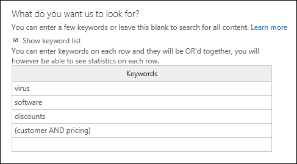

# <a name="feature-reference-for-content-search"></a>Referencia de características para la búsqueda de contenido

En este artículo se describen las características y funciones de la búsqueda de contenido.

## <a name="content-search-limits"></a>Límites de búsqueda de contenido

- Para obtener una descripción de los límites que se aplican a la búsqueda de contenido, consulte [Límites de Búsqueda de contenido](limits-for-content-search.md).
  
- Microsoft recopila información del rendimiento de las búsquedas de contenido ejecutadas por todas las organizaciones en el servicio. Aunque la complejidad de una consulta de búsqueda puede afectar al tiempo que lleva ejecutarla, en realidad, el factor más determinante es el número de buzones incluidos en la búsqueda. Microsoft no proporciona un acuerdo de nivel de servicio para los tiempos de búsqueda. Sin embargo, en la siguiente tabla le mostramos los tiempos de búsqueda promedio en base al número de buzones.
  
  |**Número de buzones**|**Promedio de tiempo de búsqueda**|
  |:-----|:-----|
  |100  <br/> |30 segundos  <br/> |
  |1000  <br/> |45 segundos  <br/> |
  |10 000  <br/> |4 minutos  <br/> |
  |25 000  <br/> |10 minutos  <br/> |
  |50 000  <br/> |20 minutos  <br/> |
  |100 000  <br/> |25 minutos  <br/> |
  |||
  
## <a name="building-a-search-query"></a>Crear una consulta de búsqueda

Para obtener información detallada sobre cómo crear una consulta de búsqueda, usar operadores booleanos y condiciones de búsqueda, y buscar información confidencial y contenido compartido con usuarios fuera de la organización, vea [Consultas de palabras clave y condiciones de búsqueda para la Búsqueda de contenido](keyword-queries-and-search-conditions.md).
  
Tenga en cuenta lo siguiente cuando use la lista de palabras clave para crear una consulta de búsqueda.
  
- Debe seleccionar la casilla **Mostrar la lista de palabras clave** y, a continuación, escribir cada palabra clave en una fila. Si escribe varias palabras clave en una misma fila, quedarán relacionadas por el operador **O**. Si pega una lista de palabras clave en el cuadro de palabras clave o presiona **Entrar** después de escribir cada palabra clave, estas no quedarán conectadas por el operador **O**. Estos son algunos ejemplos incorrectos y correctos de cómo agregar una lista de palabras clave.
    
    **Incorrecto:**
    
    
  
    **Correcto:**
    
    
  
- También puede crear una lista de palabras clave o frases clave en un archivo de Excel o en un archivo de texto sin formato y, después, pegarla en la lista de palabras clave. Para hacerlo, seleccione la casilla **Mostrar lista de palabras clave**. Después, haga clic en la primera fila de la lista de palabras clave y pegue la lista. Cada línea del archivo de texto o Excel se pegará en la línea correspondiente de la lista de palabras clave. 
    
- Después de crear la consulta con la lista de palabras clave, es recomendable comprobar la sintaxis de la consulta para asegurarse de que es lo que desea buscar. En la consulta de búsqueda, que puede ver debajo de **Consulta** en el panel de detalles, las palabras clave quedan separadas por **(c:s)**. Esto significa que están conectadas por un operador lógico similar al operador **O**. Del mismo modo, si la consulta de búsqueda incluye condiciones, las palabras clave aparecen separadas de las condiciones por **(c:c)**. Esto significa que están conectadas a las condiciones por un operador lógico similar a **Y**. Este ejemplo muestra una consulta de búsqueda (situada en el panel de detalles) obtenida al usar la lista de palabras clave con una condición. 
    
    
  
- Cuando ejecuta una búsqueda de contenido, Microsoft 365 comprueba automáticamente la búsqueda para verificar que no haya caracteres no admitidos ni operadores booleanos en minúsculas. Los caracteres no admitidos suelen estar ocultos y pueden provocar un error de búsqueda o devolver resultados no deseados. Para obtener más información acerca de la verificación de caracteres no compatibles, vea [Comprobar si hay errores en la consulta de búsqueda de contenido](check-your-content-search-query-for-errors.md).
    
- Si su consulta de búsqueda contiene palabras clave con caracteres especiales (que no pertenecen al alfabeto inglés), puede hacer clic en **Consulta idioma-país/región** y seleccionar el código cultural del idioma y país relevantes para la búsqueda. Por defecto, la versión del idioma/región es la neutra. ¿Cómo saber si es necesario cambiar la configuración de idioma para una búsqueda de contenido? Si sabe que las ubicaciones de contenido contienen los caracteres especiales que busca, pero la búsqueda no devuelve ningún resultado, la configuración de idioma puede ser la causa. 
  
## <a name="partially-indexed-items"></a>Elementos indexados parcialmente

- Los elementos indexados parcialmente en los buzones se incluyen en los resultados de búsqueda estimados. Los elementos indexados parcialmente en SharePoint y OneDrive no se incluyen en los resultados de búsqueda estimados. Para más información, vea [Elementos indexados parcialmente en eDiscovery](partially-indexed-items-in-content-search.md).

## <a name="searching-onedrive-accounts"></a>Buscar en cuentas de OneDrive

- Para obtener una lista de las direcciones URL de los sitios de OneDrive de su organización, vea [Crear una lista de todas las ubicaciones de OneDrive en la organización](/onedrive/list-onedrive-urls). El script en este artículo crea un archivo de texto que contiene una lista de todos los sitios de OneDrive. Para ejecutar este script, tiene que instalar y usar el Shell de SharePoint Online Management. Asegúrese de anexar la dirección URL para el dominio MiSitio de su organización a cada sitio de OneDrive que quiera buscar. Este es el dominio que contiene todos los sitios OneDrive; por ejemplo, `https://contoso-my.sharepoint.com`. Este es un ejemplo de una dirección URL para un sitio de usuario de OneDrive: `https://contoso-my.sharepoint.com/personal/sarad_contoso_onmicrosoft.com`.
    
    En el caso poco habitual de que cambie el nombre principal de usuario (UPN) de una persona, la dirección URL de su ubicación de OneDrive cambiará para incorporar el nuevo UPN. Si esto ocurre, tendrá que modificar la búsqueda de contenido agregando la nueva dirección URL de OneDrive del usuario y eliminando la anterior. Para más información, consulte [Cómo afectan los cambios de UPN a la dirección URL de OneDrive](/onedrive/upn-changes).
  
## <a name="searching-microsoft-teams-and-microsoft-365-groups"></a>Buscar en Microsoft Teams y grupos de Microsoft 365

Puede buscar en el buzón asociado a un grupo de Microsoft 365 o Microsoft Teams. Como Microsoft Teams se basa en los grupos de Microsoft 365, la búsqueda en ambos es similar. En ambos casos, solo se busca en el buzón de grupo o de equipo. No se busca en los buzones del grupo o de los miembros del equipo. Si quiere buscar en estos, debe agregarlos específicamente a la búsqueda.
  
Tenga en cuenta lo siguiente al buscar contenido en Microsoft Teams y grupos de Microsoft 365:
  
- Para buscar contenido ubicado en Teams y grupos de Microsoft 365, debe especificar el buzón y el sitio de SharePoint asociados a un equipo o grupo.

- El contenido de canales privados se almacena en el buzón de cada usuario y no en el buzón de equipo. Para buscar contenido en canales privados, consulte [eDiscovery de canales privados](/microsoftteams/ediscovery-investigation#ediscovery-of-private-channels).
    
- Ejecute el cmdlet **Get-UnifiedGroup** de Exchange Online para ver las propiedades de un equipo o grupo de Microsoft 365. Este es un buen método para obtener la dirección URL del sitio asociado a un equipo o un grupo. Por ejemplo, el comando siguiente muestra las propiedades seleccionadas de un grupo de Microsoft 365 denominado Senior Leadership Team: 
    
  ```text
  Get-UnifiedGroup "Senior Leadership Team" | FL DisplayName,Alias,PrimarySmtpAddress,SharePointSiteUrl
  DisplayName            : Senior Leadership Team
  Alias                  : seniorleadershipteam
  PrimarySmtpAddress     : seniorleadershipteam@contoso.onmicrosoft.com
  SharePointSiteUrl      : https://contoso.sharepoint.com/sites/seniorleadershipteam
  ```

    > [!NOTE]
    > Para ejecutar el cmdlet **Get-UnifiedGroup** debe tener asignado el rol de destinatarios con permiso de vista en Exchange Online o ser un miembro de un grupo de roles que tenga asignado el rol de destinatarios con permiso de vista. 
  
- Cuando se busca en el buzón de un usuario, no se buscará en los equipos o grupos de Microsoft 365 a los que pertenece dicho usuario. De forma similar, al buscar en un equipo o en un grupo de Microsoft 365, solo se busca en el buzón de grupo y en el sitio de grupo que especifique. Tampoco se busca en los buzones y las cuentas de OneDrive para la Empresa de los miembros del grupo a menos que los agregue explícitamente a la búsqueda.

- Si quiere obtener una lista de los miembros de un equipo o grupo de Microsoft 365, puede ver las propiedades en la página **Inicio \> Grupos** del Centro de administración de Microsoft 365. Además, puede ejecutar el comando siguiente en PowerShell de Exchange Online: 

  ```powershell
  Get-UnifiedGroupLinks <group or team name> -LinkType Members | FL DisplayName,PrimarySmtpAddress
  ```

    > [!NOTE]
    > Para ejecutar el cmdlet **Get-UnifiedGroupLinks** debe tener asignado el rol de destinatarios con permiso de vista en Exchange Online o ser un miembro de un grupo de roles que tenga asignado el rol de destinatarios con permiso de vista. 
  
- Las conversaciones de un canal de Teams se almacenan en el buzón de correo asociado al equipo. Asimismo, los archivos que los miembros del equipo comparten en un canal se almacenan en el sitio de SharePoint del equipo. Por lo tanto, tiene que agregar el buzón de equipo y el sitio de SharePoint como una ubicación de contenido para buscar conversaciones y archivos en un canal.
    
- Por otro lado, las conversaciones que forman parte de la lista de chat en Teams se almacenan en el buzón de Exchange Online de los usuarios que participan en el chat. Y los archivos que un usuario comparte en las conversaciones de chat se almacenan en la cuenta de OneDrive para la Empresa del usuario que comparte el archivo. Por lo tanto, tiene que agregar el buzón de usuario individual y las cuentas de OneDrive para la Empresa como ubicaciones de contenido para buscar conversaciones y archivos en la lista de chats.
    
    > [!NOTE]
    > En una implementación híbrida de Exchange, los usuarios con buzones locales podrían participar en conversaciones que forman parte de la lista de chats de Teams. En este caso, el contenido de estas conversaciones también se puede buscar ya que se guarda en un área de almacenamiento en la nube (*el buzón basado en la nube para usuarios locales*) para aquellos usuarios que tienen un buzón local. Para obtener más información, consulte [Buscar los datos de chat de Teams de usuarios locales](search-cloud-based-mailboxes-for-on-premises-users.md).
  
- Cada equipo o canal de equipo contiene una wiki para tomar notas y colaborar. El contenido de esta se guarda automáticamente en un archivo con un formato .mht. Este archivo se almacena en la biblioteca de documentos de Datos Wiki de Teams en el sitio de SharePoint del equipo. Puede usar la herramienta de Búsqueda de contenido para buscar en la wiki. Para ello establezca el sitio de SharePoint del equipo como la ubicación de contenido en la que buscar.

    > [!NOTE]
    > La función de búsqueda en el wiki de un equipo o un canal (cuando se busca en el sitio de SharePoint del grupo) se publicó el 22 de junio de 2017. Solo puede buscar en las páginas wiki guardadas o actualizadas en esa fecha o posteriores. Las páginas wiki guardadas o actualizadas por última vez antes de esa fecha no están disponibles para la búsqueda.

- La información de resumen de reuniones y llamadas de un canal de equipo se almacena también en los buzones de los usuarios que entraran en la reunión o llamada. Esto significa que puede usar la Búsqueda de contenido para buscar en estos registros de resumen. Esta información de resumen incluye:
  
  - Fecha, hora de inicio, hora de finalización y duración de una reunión o llamada

  - La fecha y hora en la que cada participante se incorporó o abandonó la reunión o llamada

  - Llamadas enviadas al correo de voz

  - Llamadas perdidas o sin responder

  - Transferencias de llamadas, que se representan como dos llamadas independientes

  La opción de buscar en resúmenes de reuniones y llamadas puede tardar hasta 8 horas en estar disponible.

  En los resultados de búsqueda, los resúmenes de reunión se identifican como **Reunión** en el **campo Tipo** y los resúmenes de llamadas se identifican como **Llamada**. Asimismo, las conversaciones que forman parte de un canal de Teams y los chats de Teams (conocidos como 1xN) se identifican como **Mensajería instantánea** en el campo **Tipo**.
  
  

   Para más información, consulte [Microsoft Teams lanza eDiscovery para llamadas y reuniones](https://techcommunity.microsoft.com/t5/microsoft-teams-blog/microsoft-teams-launches-ediscovery-for-calling-and-meetings/ba-p/210947).

- El contenido de tarjetas generado por las aplicaciones de los canales de Teams y los chats 1x1 y 1xN se almacenan en buzones y pueden buscarse. Una *tarjeta* es un contenedor de IU para pequeños fragmentos de contenido. Las tarjetas pueden tener diversas propiedades y datos adjuntos, y es posible que incluyan botones para activar las acciones de las tarjetas. Para obtener más información, consulte [Tarjetas](/microsoftteams/platform/task-modules-and-cards/what-are-cards).

  Igual que el resto de contenido de Teams, el lugar donde se almacena el contenido de las tarjetas depende de dónde se haya usado. El contenido de tarjetas usado en un canal de Teams se almacena en el buzón del grupo de Teams. El contenido de tarjetas de los chats 1x1 y 1xN se almacena en los buzones de los participantes de los chats.

  Para buscar el contenido de tarjetas, puede usar las condiciones de búsqueda `kind:microsoftteams` y `itemclass:IPM.SkypeTeams.Message`. Al revisar los resultados de la búsqueda, el contenido de tarjetas generado por bots en un canal de Teams mostrará `<appname>@teams.microsoft.com` en la propiedad del correo electrónico del **Remitente/autor**, donde `appname` es el nombre de la aplicación que generó el contenido de la tarjeta. Si el contenido de la tarjeta lo generó un usuario, el valor mostrado en **Remitente/autor** identificará al usuario.

  Para ver el contenido de tarjetas en los resultados de búsquedas de contenido, el contenido aparece como dato adjunto al mensaje. El dato adjunto se denomina `appname.html`, donde `appname` es el nombre de la aplicación que generó el contenido de la tarjeta. La siguiente captura de pantalla muestra cómo aparece el contenido de tarjetas (para una aplicación denominada Asana) en Teams y en los resultados de una búsqueda.

  **Contenido de tarjetas en Teams**

  

  **Contenido de tarjetas en resultados de búsquedas**
  
  

  > [!NOTE]
  > Para ver las imágenes del contenido de tarjetas en los resultados de la búsqueda en este momento (como las marcas de verificación del recorte de pantalla anterior), debe iniciar sesión en Teams (enhttps://teams.microsoft.com) en una pestaña diferente en la misma sesión del navegador que utiliza para ver los resultados de la búsqueda. De lo contrario, se mostrarán marcadores de posición de las imágenes.

- Puede usar la propiedad de correo **Tipo** o la condición de búsqueda **Tipo de mensaje** para buscar contenido en Teams de forma más específica.
  
  - Para usar la propiedad **Tipo** como parte de la consulta de búsqueda de palabras clave, escriba `kind:microsoftteams` en el cuadro de **palabras clave** de una consulta de búsqueda.

    
  
  - Para usar una condición de búsqueda, agregue la condición de **Tipo de mensaje** y use el valor `microsoftteams`.

    

   Tenga en cuenta que las condiciones están conectadas de forma lógica a la consulta de palabra clave por el operador **Y**. Esto significa que un elemento tiene que coincidir con la consulta de la palabra clave y con la condición de búsqueda para que aparezca en los resultados de la búsqueda. Para obtener más información, vea la sección de «Guías para utilizar condiciones» en [Consultas de palabras clave y condiciones de búsqueda para la búsqueda de contenido](keyword-queries-and-search-conditions.md#guidelines-for-using-conditions).
  
## <a name="searching-yammer-groups"></a>Buscando en los grupos Yammer

Para buscar elementos de conversación específicos en los Grupos Yammer puede utilizar la propiedad de correo electrónico **ItemClass** o **escribir** las condiciones de búsqueda

  - Con el fin de utilizar la propiedad **ItemClass** como parte de la consulta de búsqueda de palabras clave, en el cuadro de **Palabras** clave de una consulta de búsqueda, puede escribir uno (o todos) de los siguientes pares de propiedades de valor:

     - ItemClass:IPM.Yammer.message
     - ItemClass:IPM.Yammer.poll
     - ItemClass:IPM.Yammer.praise
     - ItemClass:IPM.Yammer.question
  
    Por ejemplo, puede usar la siguiente consulta de búsqueda para devolver mensajes de Yammer y elementos de elogio de Yammer:

    
  
  - Como alternativa, puede utilizar la condición de **Escribir** el correo electrónico y seleccionar los **mensajes Yammer** para devolver los elementos Yammer. Por ejemplo, la siguiente consulta de búsqueda devolverá todos los elementos de conversación de Yammer que contengan la palabra clave "confidencial". 

    

## <a name="searching-inactive-mailboxes"></a>Buscar en buzones inactivos

Puede buscar en buzones inactivos en una búsqueda de contenido. Para obtener una lista de los buzones inactivos de la organización, ejecute el comando `Get-Mailbox -InactiveMailboxOnly` en Exchange Online PowerShell. Como alternativa, puede ir a **gobernanza de la información** \> **Retención** en el centro de cumplimiento de seguridad y, a continuación, haga clic en **Más**\>**de la barra de navegación los buzones inactivos**.
  
A continuación, se detallan algunos aspectos que se deben tener en cuenta al buscar buzones inactivos:

- Si una búsqueda de contenido incluye un buzón de usuario que deja de estar activo, la búsqueda de contenido seguirá buscando en el buzón inactivo al volver a ejecutarla después del cambio de estado.

- En algunas ocasiones, un usuario puede tener un buzón activo y uno inactivo con la misma dirección SMTP. En ese caso, solo se buscarán los buzones específicos que seleccione como ubicaciones en una búsqueda de contenido. Es decir, si agrega el buzón de un usuario a una búsqueda, no dé por sentado que se buscará tanto en el buzón activo como el inactivo. Solo se buscará en el buzón que agregue explícitamente a la búsqueda.

- Puede usar Security & PowerShell del centro de cumplimiento para crear una búsqueda de contenido para buscar en un buzón inactivo. Para ello, tiene que agregar previamente un punto (. Dirección de correo electrónico del propietario del buzón de correo. Por ejemplo, el comando siguiente crea una búsqueda de contenido que busca en un buzón inactivo con la dirección de correo electrónico pavelb@contoso.onmicrosoft.com:

   ```powershell
   New-ComplianceSearch -Name InactiveMailboxSearch -ExchangeLocation .pavelb@contoso.onmicrosoft.com -AllowNotFoundExchangeLocationsEnabled $true
   ```

- Le recomendamos que no tenga un buzón activo y un buzón inactivo con la misma dirección SMTP. Si necesita volver a usar la dirección SMTP que está asignada a un buzón inactivo, le recomendamos que recupere el buzón inactivo o restaure el contenido de un buzón inactivo a uno activo (o el archivo de un buzón activo) y, después, elimine el buzón inactivo. Para obtener más información, vea uno de los siguientes temas:

  - [Recuperar un buzón inactivo en Office 365](recover-an-inactive-mailbox.md)

  - [Restaurar un buzón inactivo en Office 365](restore-an-inactive-mailbox.md)

  - [Eliminar un buzón inactivo en Office 365](delete-an-inactive-mailbox.md)

## <a name="searching-disconnected-or-de-licensed-mailboxes"></a>Buscar en buzones que se desconectaron o se ha deshabilitado la licencia

Si se quita la licencia de Exchange Online (o la licencia de Microsoft 365) de una cuenta de usuario o de Azure Active Directory, el buzón del usuario se convierte en un buzón *desconectado*. Esto significa que el buzón ya no está asociado a la cuenta de usuario. Esto es lo que ocurre al buscar en buzones desconectados:

- Cuando se quita la licencia de un buzón, ya no se puede buscar en él. 

- Si una búsqueda de contenido existente incluye un buzón de usuario en el que se ha quitado la licencia, los resultados de búsqueda del buzón desconectado no se incluirán cuando vuelva a ejecutar la búsqueda.

- Si usa el cmdlet **New-ComplianceSearch** para crear una búsqueda de contenido y especifica un buzón desconectado como la ubicación de contenido de Exchange en la que buscar, la búsqueda de contenido no devolverá resultados de búsqueda del buzón desconectado.

Si necesita conservar los datos de un buzón desconectado para poder buscarlos, debe poner el buzón en suspensión antes de quitar la licencia. De este forma, se conservan los datos y se permite la búsqueda en el buzón desconectado hasta que se quite la suspensión. Para más información sobre las suspensiones, vea [Cómo identificar el tipo de suspensión en un buzón de Exchange Online](identify-a-hold-on-an-exchange-online-mailbox.md)

## <a name="searching-for-content-in-a-sharepoint-multi-geo-environment"></a>Búsqueda de contenido en un entorno de SharePoint Multi-Geo

Si es necesario que un administrador de eDiscovery busque contenido en SharePoint y OneDrive en distintas regiones en un [entorno de SharePoint Multi-Geo](../enterprise/multi-geo-capabilities-in-onedrive-and-sharepoint-online-in-microsoft-365.md), tiene que hacer lo siguiente:

1. Cree una cuenta de usuario independiente para cada ubicación geográfica por satélite que necesite buscar el administrador de eDiscovery. Para buscar contenido en los sitios de esa ubicación geográfica, el administrador de eDiscovery debe iniciar sesión en la cuenta que usted creó para dicha ubicación y, después, ejecutar una búsqueda de contenido.

2. Cree un filtro de permisos de búsqueda para cada ubicación geográfica por satélite (y la cuenta de usuario correspondiente) en la que necesita realizar búsquedas el administrador de eDiscovery. Cada uno de estos filtros de permisos de búsqueda limita el ámbito de la búsqueda de contenido a una ubicación geográfica específica cuando el administrador de eDiscovery inicia sesión en la cuenta de usuario asociada a esa ubicación.

> [!TIP]
> No es necesario usar esta estrategia al usar la herramienta de búsqueda de [eDiscovery avanzado](overview-ediscovery-20.md). Esto se debe a que se buscan todos los centros de datos al realizar una búsqueda de los sitios de SharePoint y cuentas de OneDrive en eDiscovery avanzado. Solo tiene que usar esta estrategia de filtros de permiso de búsqueda y cuentas de usuario específicos de la región al usar la herramienta de búsqueda de contenido y al ejecutar búsquedas relacionadas con [casos de eDiscovery](./get-started-core-ediscovery.md).

Por ejemplo, supongamos que un administrador de eDiscovery tiene que buscar contenido de SharePoint y OneDrive en ubicaciones por satélite en América del Norte, Europa y Asia Pacífico. El primer paso es crear tres cuentas de usuario, una para cada ubicación. El siguiente paso es crear tres filtros de permisos de búsqueda, uno para cada ubicación *y* cuenta de usuario correspondiente. Estos son algunos ejemplos de los tres filtros de permisos de búsqueda para este escenario. En cada uno de estos ejemplos, **Region** especifica la ubicación del centro de datos de SharePoint para dicha geoárea y el parámetro **Users** especifica la cuenta de usuario correspondiente.

**Norteamérica**

```powershell
New-ComplianceSecurityFilter -FilterName "SPMultiGeo-NAM" -Users ediscovery-nam@contoso.com -Region NAM -Action ALL
```

**Europa**

```powershell
New-ComplianceSecurityFilter -FilterName "SPMultiGeo-EUR" -Users ediscovery-eur@contoso.com -Region EUR -Action ALL
```

**Asia Pacífico**

```powershell
New-ComplianceSecurityFilter -FilterName "SPMultiGeo-APC" -Users ediscovery-apc@contoso.com -Region APC -Action ALL
```

Tenga en cuenta lo siguiente al usar filtros de permisos de búsqueda para buscar contenido en entornos multigeográficos:

- El parámetro **Region** dirige las búsquedas a la ubicación por satélite especificada. Si el administrador de eDiscovery solo busca en los sitios de SharePoint y OneDrive fuera de la región especificada en el filtro de permisos de búsqueda, no se devuelve ningún resultado de búsqueda. 

- El parámetro **Region** no controla las búsquedas de los buzones de Exchange. Al realizar una búsqueda en los buzones se buscan todos los centros de datos.

Para obtener más información sobre el uso de los filtros de permisos de búsqueda en un entorno multigeográfico, vea la sección "Búsqueda y exportación de contenido en entornos multigeográficos" en [Configurar límites de cumplimiento para investigaciones de eDiscovery](set-up-compliance-boundaries.md#searching-and-exporting-content-in-multi-geo-environments).
