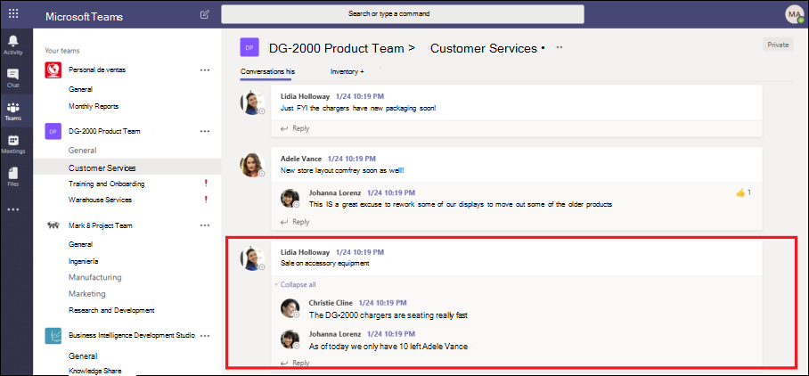

# Revisar las conversaciones en eDiscovery avanzadoReview conversations in Advanced eDiscovery 

La mensajería instantánea es una forma cómoda de plantear preguntas, compartir ideas o comunicarse rápidamente a través de grandes audiencias.Instant messaging is a convenient way to ask questions, share ideas, or quickly communicate across large audiences. A medida que las plataformas de mensajería instantánea, como Microsoft Teams, se convierten en las principales de colaboración empresarial, las organizaciones deben evaluar cómo el flujo de trabajo de eDiscovery aborda estas nuevas formas de comunicación y colaboración.As instant messaging platforms, like Microsoft Teams, become core to enterprise collaboration, organizations must evaluate how their eDiscovery workflow addresses these new forms of communication and collaboration. 

La característica de reconstrucción de conversaciones en eDiscovery avanzado está diseñada para ayudarle a identificar el contenido contextual y producir vistas de conversación distintas.The Conversation Reconstruction feature in Advanced eDiscovery is designed to help you identify contextual content and produce distinct conversation views. Esta función le permite revisar de forma rápida y eficaz las conversaciones de mensajes instantáneos completa (también denominadas *conversaciones encadenadas*) que se generan en plataformas como Microsoft Teams.This capability allows you to efficiently and rapidly review complete instant message conversations (also called *threaded conversations*) that are generated in platforms like Microsoft Teams.

Con la reconstrucción de conversaciones, puede usar capacidades integradas para reconstruir, revisar y exportar conversaciones encadenadas.With Conversation Reconstruction, you can use built-in capabilities to reconstruct, review, and export threaded conversations. Use la reconstrucción avanzada de conversaciones de exhibición de documentos electrónicos para:Use Advanced eDiscovery Conversation Reconstruction to:

- Conserve los metadatos exclusivos en el nivel de mensaje en todos los mensajes de una conversación.Preserve unique message-level metadata across all messages within a conversation.

- Recopilar mensajes contextuales alrededor de los resultados de búsqueda.Collect contextual messages around your search results.

- Revisar, anotar y censurar conversaciones encadenadas.Review, annotate, and redact threaded conversations.

- Exportar mensajes individuales o conversaciones encadenadasExport individual messages or threaded conversations

## TerminologíaTerminology

Estas son algunas definiciones para ayudarle a empezar a usar la reconstrucción de conversaciones.Here are few definitions to help you get start using Conversation Reconstruction.

- **Mensajes:** Representan la unidad más pequeña de una conversación.**Messages:** Represent the smallest unit of a conversation. Los mensajes pueden variar en tamaño, estructura y metadatos.Messages may vary in size, structure, and metadata. 

- **Conversación:** Representa una agrupación de uno o más mensajes.**Conversation:** Represents a grouping of one or more messages. En las distintas aplicaciones, las conversaciones pueden representarse de formas diferentes.Across different applications, conversations may be represented in different ways. En algunas aplicaciones, hay una acción explícita que se produce al responder a un mensaje existente.In some applications, there is an explicit action that results from replying to an existing message. Las conversaciones se crean de forma explícita como resultado de esta acción del usuario.Conversations are formed explicitly as a result of this user action. Por ejemplo, aquí se muestra una captura de pantalla de una conversación de canal en Microsoft Teams.For example, here is a screenshot of a channel conversation in Microsoft Teams.

   

   En otras aplicaciones (como los mensajes de chat de 1xN en Microsoft Teams), no hay una cadena de respuestas formales y en su lugar los mensajes aparecen como una "río plano de mensajes" en un único subproceso.In other apps (such as 1xN chat messages in Teams), there is not a formal reply chain and instead messages appear as a "flat river of messages" within a single thread. En estas aplicaciones de tipos, las conversaciones se deducen de un grupo de mensajes que se producen en un momento determinado.In these types apps, conversations are inferred from a group of messages that occur within a certain time. Esta "agrupación flexible" de mensajes (a diferencia de una cadena de respuesta) representa la conversación "hacia delante y hacia atrás" sobre un tema específico de interés.This "soft-grouping" of messages (as opposed to a reply chain) represent the "back and forth" conversation about a specific topic of interest. 

## Paso 1: ejecutar una búsquedaStep 1: Run a search

Una vez que haya identificado los custodios y las ubicaciones de contenido relevantes, puede crear una búsqueda para encontrar contenido potencialmente relevante.After you have identified relevant custodians and content locations, you can create a search to find potentially relevant content. En la ficha **búsquedas** en el caso de exhibición avanzada de documentos electrónicos, puede crear una búsqueda haciendo clic en **nueva búsqueda** y siguiendo el asistente.On the **Searches** tab in the Advanced eDiscovery case, you can create a search by clicking **New search** and following the wizard. Para obtener información sobre cómo se puede crear una búsqueda, crear una consulta de búsqueda y ver los resultados de la búsqueda, vea [recopilar datos para un caso](create-search-to-collect-data.md).For information about how you can create a search, build a search query, and view the search results, see [Collect data for a case](create-search-to-collect-data.md).

## Paso 2: crear un conjunto de revisión de conversaciónStep 2: Create a conversation review set

En un conjunto de revisiones, puede buscar, etiquetar, anotar y censurar documentos, mensajes de correo electrónico y conversaciones de chat.In a review set, you can search, tag, annotate, and redact documents, email messages, and chat conversations. En la exhibición avanzada de documentos electrónicos, puede personalizar la revisión de las conversaciones, en función de mensajes individuales o conversaciones encadenadas.In Advanced eDiscovery, you can customize your review of conversations, based in individual messages or threaded conversations. Esto lo determina el tipo de conjunto de revisión que agrega los resultados de la búsqueda creada en el paso 1 a.This is determined by the type of review set that you add the results of the search created in Step 1 to. Hay dos tipos diferentes de conjuntos de revisión:There are two different types of review sets: 
  
  - **Conjuntos de revisión estándar:** Los mensajes en conversaciones se procesan y se muestran como elementos individuales.**Standard review sets:** Messages in conversations are processed and displayed as individual items. 
  
  -  **Conjuntos de revisión de conversación:** Los mensajes en conversaciones se procesan de forma individual, pero se muestran en una vista de conversación.**Conversation review sets:** Messages in conversations are processed individually but displayed in a conversation view. En un conjunto de revisión de conversación, puede anotar, etiquetar y censurar mensajes en una vista de conversación encadenada.In a conversation review set, you can annotate, tag, and redact messages in a threaded conversation view. 

Para obtener más información acerca de cómo revisar y administrar el contenido de un conjunto de revisión, consulte [Manage Review sets](managing-review-sets.md).For more information about how to review and manage content in a review set, see [Manage review sets](managing-review-sets.md). 

## Paso 3: habilitar las opciones de recuperación de conversacionesStep 3: Enable conversation retrieval options

Una vez que haya revisado y finalizado la consulta de búsqueda, puede Agregar los resultados de la búsqueda a un conjunto de revisión.After you have reviewed and finalized your search query, you can add the search results to a review set. Cuando se agregan los resultados de la búsqueda a un conjunto de revisión, los datos originales se copian en un área de almacenamiento de Azure para facilitar el proceso de revisión y análisis.When you add your search results into a review set, the original data is copied to an Azure Storage area to facilitate the review and analysis process. Para obtener más información acerca de cómo agregar resultados de búsqueda a un conjunto de revisiones, consulte [Agregar resultados de búsqueda a un conjunto de revisiones](add-data-to-review-set.md).For more information about adding search results to a review set, see [Add search results to a review set](add-data-to-review-set.md). 

Al agregar datos de conversaciones a un conjunto de revisión, puede usar las opciones de recuperación de conversaciones para expandir la búsqueda e incluir mensajes contextuales.When you add data from conversations to a review set, you can use the conversation retrieval options to expand your search and include contextual messages. Después de establecer las opciones de recuperación de conversaciones, pueden ocurrir las siguientes cosas:After you set the conversation retrieval options, the following things can happen:

  
  
1. Mediante una consulta de palabra clave y un intervalo de fechas, la búsqueda devolvió un error en el *mensaje 3*.Using a keyword and date range query, the search returned a hit on *Message 3*. Este mensaje formaba parte de una conversación más amplia, ilustrada por *CRC1*.This message was part of a larger conversation, illustrated by *CRC1*. 
  
2. Al agregar los datos a un conjunto de revisión y habilitar las opciones de recuperación de conversaciones, la exhibición avanzada de documentos electrónicos se revertirá y recopilará otros elementos en *CRC1*.When you add the data into a review set and enable the conversation retrieval options, Advanced eDiscovery will go back and collect other items in *CRC1*. 
  
3. Una vez agregados los elementos al conjunto de revisión, puede revisar todos los mensajes individuales de *CRC1*.After the items have been added to the review set, you can review all the individual messages from *CRC1*. 

Para habilitar la recuperación de conversaciones:To enable conversation retrieval:
  
1. En la pestaña **búsquedas** en el caso de eDiscovery avanzado, seleccione una búsqueda y, a continuación, haga clic en **Agregar a conjunto de revisiones** en la página de flotante.On the **Searches** tab in the Advanced eDiscovery case, select a search, and then click **Add to review set** on the flyout page.
  
2. Seleccione un conjunto de revisiones existente o cree un conjunto de revisión.Select an existing review set or create a review set. Puede configurar las opciones de recuperación al agregar resultados de búsqueda a un conjunto de revisión estándar o de conversación.You can configure retrieval options when adding search results to a standard or a conversation review set.
  
3. En **Opciones de colección**, configure las opciones de recuperación de conversaciones para los orígenes de contenido que desee expandir en la búsqueda y, a continuación, haga clic en **Agregar** para iniciar el proceso.Under **Collection options**, configure the conversation retrieval options for the content sources that you want to expand in your search, and then click **Add** to start the process.  
  
4. Una vez finalizado el trabajo **Agregar a la definición de revisión** en la ficha **trabajos** , puede iniciar la revisión de las conversaciones.After the **Add to review set** job on the **Jobs** tab has finished, you can start reviewing the conversations.

## Paso 4: revisar y exportar conversaciones en un conjunto de revisiónStep 4: Review and export conversations in a review set

Una vez que el contenido se ha procesado y agregado al conjunto de revisiones, puede iniciar la revisión de los datos en el conjunto de revisión.After the content has been processed and added to the review set, you can start reviewing the data in the review set. Las capacidades de revisión son diferentes en función de si el contenido se agregó a un conjunto de revisión estándar o un conjunto de revisión de conversación.The review capabilities are different depending on whether the content was added to a standard review set or a conversation review set. 

### Revisión de conversaciones en un conjunto de revisión estándarReviewing conversations in a standard review set

En un conjunto de revisiones estándar, los mensajes se procesan y se muestran como elementos individuales, de manera similar a como se almacenan en una carpeta de buzón de correo.In a standard review set, messages are processed and displayed as individual items, similar to how they're stored in a mailbox folder. En este flujo de trabajo, cada mensaje se procesa como un elemento independiente.In this workflow, each message is processed as a separate item. Como resultado, las opciones de exportación y Resumen encadenados no están disponibles en un conjunto de revisión estándar.As a result, the threaded summary and export options aren't available in a standard review set. 

  

### Revisar conversaciones en un conjunto de revisión de conversaciónReviewing conversations in a conversation review set

En un conjunto de revisión de conversación, los mensajes individuales se enlazan juntos y se presentan como conversaciones.In a conversation review set, individual messages are threaded together and presented as conversations. Esto le permite revisar y exportar conversaciones contextuales.This lets you review and export contextual conversations. 

  

En las siguientes secciones se describe cómo revisar y exportar conversaciones en un conjunto de revisión de conversación.The following sections describe reviewing and exporting conversations in a conversation review set.

#### Revisión de conversacionesReviewing conversations

En un conjunto de revisión de conversación, puede usar las siguientes opciones para facilitar el proceso de revisión.In a conversation review set, you can use the following options to facilitate the review process.

- **Agrupar por conversación:** Agrupa mensajes dentro de la misma conversación para ayudar a los usuarios a simplificar y acelerar su proceso de revisión.**Group by conversation:** Groups messages within the same conversation together to help users simplify and expedite their review process. 

- **Vista de Resumen:** Muestra la conversación encadenada.**Summary view:** Displays the threaded conversation. En esta vista, puede ver la conversación completa y también tener acceso a los metadatos de cada mensaje individual.In this view, you can see the entire conversation and also access the metadata for each individual message.  
  
   - Ver metadatos de mensajes individualesView metadata for individual messages
   
   - Descargar mensajes individualesDownload individual messages

- **Vista de texto:** Proporciona el texto extraído de toda la conversación.**Text view:** Provides the extracted text for the entire conversation. 

- **Vista de anotar:** Permite marcar una vista encadenada de la conversación.**Annotate view:** Lets you markup a threaded view of the conversation. Todos los mensajes de la conversación comparten el mismo documento con comentarios.All messages in the conversation share the same annotated document.

- **Etiquetado:** Al ver conversaciones en un conjunto de revisiones, puede ver y aplicar etiquetas haciendo clic en **Panel de etiquetado** en el panel de codificación.**Tagging:** When viewing conversations in a review set, you can view and apply tags by clicking **Tagging panel** in the Coding panel.

- **Volver a ejecutar la conversión de conversación:** Cuando se agregan mensajes a un conjunto de revisión de conversación, se ejecuta automáticamente un trabajo de conversión para crear las vistas de Resumen y anotaciones de conversaciones.**Rerun conversation conversion:** When messages are added to a conversation review set, a conversion job is automatically run to create the threaded summary and annotate views. Si se produce un error en el trabajo de reconstrucción de conversaciones, puede volver a ejecutar este trabajo haciendo clic en **acción > crear una conversación en PDF** en el conjunto de revisión.If the Conversation Reconstruction job fails, you can rerun this job by clicking **Action > Create conversation PDFs** in the review set.

#### Exportar conversacionesExporting conversations

En un conjunto de revisión de conversación, puede establecer las siguientes opciones para exportar conversaciones:In a conversation review set, you can set the following options to export conversations:

a.a. Opciones de metadatosMetadata options

   - **Cargar archivo:** Los metadatos se incluyen para cada mensaje, correo electrónico y documento individual.**Load file:** Metadata is included for each individual message, email, and document. Hay una fila por cada mensaje en una conversación.There is one row for each message in a conversation. 

   - **Etiquetas:** Las etiquetas del proceso de revisión se incluyen en el archivo de metadatos.**Tags:** Tags from your review process are included in the metadata file. Los mensajes de una conversación comparten las mismas etiquetas.Messages in a conversation share the same tags. 

b.b. Opciones de conversaciónConversation options
  
   - **Archivos de conversación:** Cuando se exportan archivos de conversación, la vista anotada se convierte en un archivo PDF y se descarga en la carpeta de exportación.**Conversation files:** When you export conversation files, the annotated view is converted to a PDF file and downloaded to the export folder. Los mensajes de un archivo de conversación apuntan a la versión PDF del mismo archivo de conversación.Messages in one conversation file point to the PDF version of the same conversation file.  
  
   - **Mensajes de chat individuales:** Cuando se exportan mensajes individuales, cada mensaje único de la conversación se exporta como un elemento independiente.**Individual chat messages:** When you export individual messages, each unique message in the conversation is exported as a standalone item. El archivo se exporta en el mismo formato en el que se guardó como en el buzón.The file is exported in the same format that it was saved as in the mailbox. Para una conversación específica, recibe varios archivos. msg.For a specific conversation, you receive multiple .msg files. 

     >[!NOTE]
     > Si ha aplicado anotaciones en el archivo de conversación, estas anotaciones no se transferirán a los mensajes individuales.If you applied annotations to the conversation file, these annotations won't be transferred to the individual messages. 

c.c. Otras opcionesOther options

   - **Generar archivos de texto para todo el contenido exportado:** Genera un archivo de texto para cada conversación exportada desde el conjunto de revisión.**Generate text files for all exported content:** Generates a text file for each conversation exported from the review set. 

   - **Reemplazar el contenido exportado con documentos PDF censurados:** Si se generan archivos de conversación censurados durante el proceso de revisión, estos archivos estarán disponibles durante la exportación.**Replace exported content with redacted PDFs:** If redacted conversation files are generated during the review process, then these files are available during export. Puede decidir si desea exportar sólo los archivos nativos (no selecciona esta opción) o reemplazar los archivos nativos con las versiones censuradas de los archivos nativos (seleccionando esta opción), que se exportan como archivos PDF.You can decided whether to export only the native files (by not selecting this option) or to replace the native files with the redacted versions of the native files (by selecting this option), which are exported as PDF files.

## Más informaciónMore information

Para obtener más información sobre cómo revisar los datos de casos en la exhibición avanzada de documentos electrónicos, vea los siguientes artículos:To learn more about how to review case data in Advanced eDiscovery, see the following articles:

- [Ver datos de casosView case data](view-documents-in-review-set.md)

- [Analizar datos de casosAnalyze case data](analyzing-data-in-review-set.md)

- [Exportar datos de casosExport case data](exporting-data-ediscover20.md)
