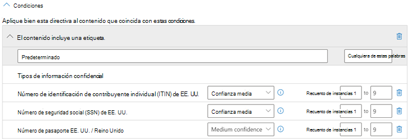
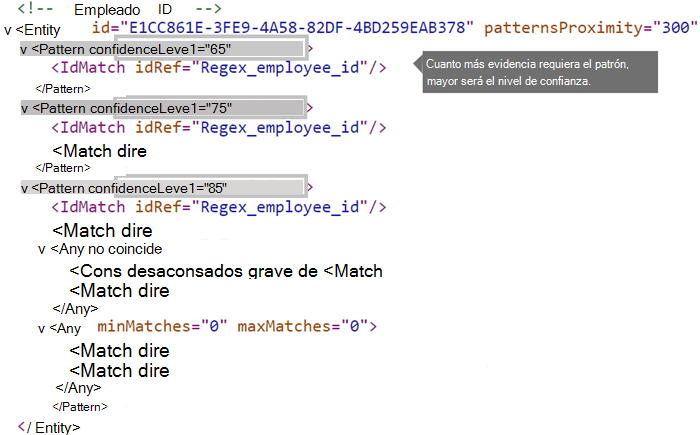

# <a name="create-a-custom-sensitive-information-type-using-powershell"></a><span data-ttu-id="9a652-103">Crear un tipo de información confidencial personalizada con PowerShell</span><span class="sxs-lookup"><span data-stu-id="9a652-103">Create a custom sensitive information type using PowerShell</span></span>

<span data-ttu-id="9a652-104">En este tema, se muestra cómo usar PowerShell para crear un archivo de *paquete de reglas* XML que defina su propio conjunto personalizado de [ información confidencial](sensitive-information-type-entity-definitions.md).</span><span class="sxs-lookup"><span data-stu-id="9a652-104">This topic shows you how to use PowerShell to create an XML *rule package* file that defines your own custom [sensitive information types](sensitive-information-type-entity-definitions.md).</span></span> <span data-ttu-id="9a652-105">Para ello, necesita saber cómo crear una expresión regular.</span><span class="sxs-lookup"><span data-stu-id="9a652-105">You need to know how to create a regular expression.</span></span> <span data-ttu-id="9a652-106">Por ejemplo, en este caso se crea un tipo de información confidencial personalizado que identifica un Id. de empleado.</span><span class="sxs-lookup"><span data-stu-id="9a652-106">As an example, this topic creates a custom sensitive information type that identifies an employee ID.</span></span> <span data-ttu-id="9a652-107">Puede usar el XML de este ejemplo como punto de partida para su propio archivo XML.</span><span class="sxs-lookup"><span data-stu-id="9a652-107">You can use this example XML as a starting point for your own XML file.</span></span> <span data-ttu-id="9a652-108">Para obtener más información acerca de los tipos de información confidencial, consulte [Información sobre los tipos de información confidencial](sensitive-information-type-learn-about.md).</span><span class="sxs-lookup"><span data-stu-id="9a652-108">If you are new to sensitive information types, see [Learn about sensitive information types](sensitive-information-type-learn-about.md).</span></span>

<span data-ttu-id="9a652-p102">Después de crear un archivo XML con formato correcto, puede cargarlo en Microsoft 365 mediante PowerShell de Microsoft 365. Después, ya estará listo para usar su propio tipo de información confidencial personalizado en sus directivas y probar si detecta la información confidencial del modo previsto.</span><span class="sxs-lookup"><span data-stu-id="9a652-p102">After you've created a well-formed XML file, you can upload it to Microsoft 365 by using Microsoft 365 PowerShell. Then you're ready to use your custom sensitive information type in your policies and test that it's detecting the sensitive information as you intended.</span></span>

> [!NOTE]
> <span data-ttu-id="9a652-111">Si no necesita el control específico que proporciona PowerShell, puede crear tipos de información confidencial personalizados en el Centro de cumplimiento.</span><span class="sxs-lookup"><span data-stu-id="9a652-111">If you don't need the fine grained control that PowerShell provides, you can create custom sensitive information types in the Compliance center.</span></span> <span data-ttu-id="9a652-112">Para obtener más información, consulte [Crear un tipo de información confidencial](create-a-custom-sensitive-information-type.md).</span><span class="sxs-lookup"><span data-stu-id="9a652-112">For more information, see [Create a custom sensitive information type](create-a-custom-sensitive-information-type.md).</span></span>

## <a name="important-disclaimer"></a><span data-ttu-id="9a652-113">Declinación de responsabilidades importante</span><span class="sxs-lookup"><span data-stu-id="9a652-113">Important disclaimer</span></span>

<span data-ttu-id="9a652-p104"> Debido a las varianzas de los entornos de cliente y los requisitos de coincidencia de contenido, el Soporte técnico de Microsoft no puede ayudar a proporcionar definiciones de contenido coincidente personalizadas: por ejemplo, definir clasificaciones personalizadas o patrones de expresiones regulares (conocidas como “RegEx”). Para el desarrollo, las pruebas y la depuración de contenido coincidente personalizado, los clientes de Microsoft 365 tendrán que basarse en recursos de TI internos o usar un recurso externo de consultoría como los Servicios de Consultoría de Microsoft (MCS). Los ingenieros de soporte técnico pueden proporcionar soporte técnico limitado para la característica, pero no pueden garantizar que cualquier desarrollo personalizado de contenido coincidente cumplirá los requisitos y obligaciones del cliente. Pueden proporcionarse modelos de expresiones regulares de muestra con fines de prueba como ejemplo del tipo de asistencia que se puede proporcionar, o el servicio de soporte técnico puede ayudarle a solucionar problemas de un diseño RegEx existente que no se desencadena como se esperaba con un único ejemplo de contenido específico.</span><span class="sxs-lookup"><span data-stu-id="9a652-p104">Due to the variances in customer environments and content match requirements, Microsoft Support cannot assist in providing custom content-matching definitions; e.g., defining custom classifications or regular expression (also known as RegEx) patterns. For custom content-matching development, testing, and debugging, Microsoft 365 customers will need to rely upon internal IT resources, or use an external consulting resource such as Microsoft Consulting Services (MCS). Support engineers can provide limited support for the feature, but cannot provide assurances that any custom content-matching development will fulfill the customer's requirements or obligations.  As an example of the type of support that can be provided, sample regular expression patterns may be provided for testing purposes. Or, support can assist with troubleshooting an existing RegEx pattern which is not triggering as expected with a single specific content example.</span></span>

<span data-ttu-id="9a652-119">Consulte [Posibles problemas de validación a tener en cuenta](#potential-validation-issues-to-be-aware-of) en este tema.</span><span class="sxs-lookup"><span data-stu-id="9a652-119">See [Potential validation issues to be aware of](#potential-validation-issues-to-be-aware-of) in this topic.</span></span>

<span data-ttu-id="9a652-120">Para obtener más información sobre el motor Boost.RegEx (anteriormente conocido como RegEx++) que se usa para el procesamiento de texto, vea [Boost.Regex 5.1.3](https://www.boost.org/doc/libs/1_68_0/libs/regex/doc/html/).</span><span class="sxs-lookup"><span data-stu-id="9a652-120">For more information about the Boost.RegEx (formerly known as RegEx++) engine that's used for processing the text, see [Boost.Regex 5.1.3](https://www.boost.org/doc/libs/1_68_0/libs/regex/doc/html/).</span></span>

> [!NOTE]
> <span data-ttu-id="9a652-121">Si usa un carácter de yerba (&) como parte de una palabra clave en el tipo de información confidencial personalizada, tenga en cuenta que hay un problema conocido.</span><span class="sxs-lookup"><span data-stu-id="9a652-121">If you use an ampersand character (&) as part of a keyword in your custom sensitive information type, please note that there is a known issue.</span></span> <span data-ttu-id="9a652-122">Debe agregar un término adicional con espacios alrededor del carácter para asegurarse de que el carácter está correctamente identificado, por ejemplo, L & P _no_ L&P.</span><span class="sxs-lookup"><span data-stu-id="9a652-122">You should add an additional term with spaces around the character to make sure that the character is properly identified, for example, L & P _not_ L&P.</span></span>

## <a name="sample-xml-of-a-rule-package"></a><span data-ttu-id="9a652-123">XML de ejemplo de un paquete de reglas</span><span class="sxs-lookup"><span data-stu-id="9a652-123">Sample XML of a rule package</span></span>

<span data-ttu-id="9a652-p106">Este es el XML de ejemplo del paquete de reglas que crearemos en este tema. Los elementos y los atributos se explican en las secciones posteriores.</span><span class="sxs-lookup"><span data-stu-id="9a652-p106">Here's the sample XML of the rule package that we'll create in this topic. Elements and attributes are explained in the sections below.</span></span>
  
```xml
<?xml version="1.0" encoding="UTF-16"?>
<RulePackage xmlns="http://schemas.microsoft.com/office/2011/mce">
<RulePack id="DAD86A92-AB18-43BB-AB35-96F7C594ADAA">
  <Version build="0" major="1" minor="0" revision="0"/>
  <Publisher id="619DD8C3-7B80-4998-A312-4DF0402BAC04"/>
  <Details defaultLangCode="en-us">
    <LocalizedDetails langcode="en-us">
      <PublisherName>Contoso</PublisherName>
      <Name>Employee ID Custom Rule Pack</Name>
      <Description>
      This rule package contains the custom Employee ID entity.
      </Description>
    </LocalizedDetails>
  </Details>
</RulePack>
<Rules>
<!-- Employee ID -->
  <Entity id="E1CC861E-3FE9-4A58-82DF-4BD259EAB378" patternsProximity="300" recommendedConfidence="75">
    <Pattern confidenceLevel="65">
      <IdMatch idRef="Regex_employee_id"/>
    </Pattern>
    <Pattern confidenceLevel="75">
      <IdMatch idRef="Regex_employee_id"/>
      <Match idRef="Func_us_date"/>
    </Pattern>
    <Pattern confidenceLevel="85">
      <IdMatch idRef="Regex_employee_id"/>
      <Match idRef="Func_us_date"/>
      <Any minMatches="1">
        <Match idRef="Keyword_badge" minCount="2"/>
        <Match idRef="Keyword_employee"/>
      </Any>
      <Any minMatches="0" maxMatches="0">
        <Match idRef="Keyword_false_positives_local"/>
        <Match idRef="Keyword_false_positives_intl"/>
      </Any>
    </Pattern>
  </Entity>
  <Regex id="Regex_employee_id">(\s)(\d{9})(\s)</Regex>
  <Keyword id="Keyword_employee">
    <Group matchStyle="word">
      <Term>Identification</Term>
      <Term>Contoso Employee</Term>
    </Group>
  </Keyword>
  <Keyword id="Keyword_badge">
    <Group matchStyle="string">
      <Term>card</Term>
      <Term>badge</Term>
      <Term caseSensitive="true">ID</Term>
    </Group>
  </Keyword>
  <Keyword id="Keyword_false_positives_local">
    <Group matchStyle="word">
      <Term>credit card</Term>
      <Term>national ID</Term>
    </Group>
  </Keyword>
  <Keyword id="Keyword_false_positives_intl">
    <Group matchStyle="word">
      <Term>identity card</Term>
      <Term>national ID</Term>
      <Term>EU debit card</Term>
    </Group>
  </Keyword>
  <LocalizedStrings>
    <Resource idRef="E1CC861E-3FE9-4A58-82DF-4BD259EAB378">
      <Name default="true" langcode="en-us">Employee ID</Name>
      <Description default="true" langcode="en-us">
      A custom classification for detecting Employee IDs.
      </Description>
      <Description default="false" langcode="de-de">
      Description for German locale.
      </Description>
    </Resource>
  </LocalizedStrings>
</Rules>
</RulePackage>
```

## <a name="what-are-your-key-requirements-rule-entity-pattern-elements"></a><span data-ttu-id="9a652-p107">¿Cuáles son sus requisitos clave? [Elementos Rule, Entity y Pattern]</span><span class="sxs-lookup"><span data-stu-id="9a652-p107">What are your key requirements? [Rule, Entity, Pattern elements]</span></span>

<span data-ttu-id="9a652-128">Antes de empezar, resulta útil comprender la estructura básica del esquema XML de una regla y cómo puede usar esta estructura para definir su tipo personalizado de información confidencial de forma que identifique el contenido adecuado.</span><span class="sxs-lookup"><span data-stu-id="9a652-128">Before you get started, it's helpful to understand the basic structure of the XML schema for a rule, and how you can use this structure to define your custom sensitive information type so that it will identify the right content.</span></span>
  
<span data-ttu-id="9a652-p108">Una regla define una o más entidades (tipos de información confidencial) y, a su vez, cada entidad define uno o más patrones. Un patrón es lo que busca una directiva al evaluar contenido, como correos electrónicos y documentos.</span><span class="sxs-lookup"><span data-stu-id="9a652-p108">A rule defines one or more entities (sensitive information types), and each entity defines one or more patterns. A pattern is what a policy looks for when it evaluates content such as email and documents.</span></span>

<span data-ttu-id="9a652-p109">En este tema, el formato XML usa una regla para significar los patrones que definen una entidad, también conocida como tipo de información confidencial. Por lo tanto, en este tema, cuando vea una regla, piense en entidad o tipo de información confidencial, no en condiciones y acciones.</span><span class="sxs-lookup"><span data-stu-id="9a652-p109">In this topic, the XML markup uses rule to mean the patterns that define an entity, also known as a sensitive information type. So in this topic, when you see rule, think entity or sensitive information type, not conditions and actions.</span></span>
  
### <a name="simplest-scenario-entity-with-one-pattern"></a><span data-ttu-id="9a652-133">Escenario más sencillo: entidad con un patrón</span><span class="sxs-lookup"><span data-stu-id="9a652-133">Simplest scenario: entity with one pattern</span></span>

<span data-ttu-id="9a652-p110">Este es el escenario más sencillo. Quiere que su directiva identifique contenido donde haya presente un id. de empleado de su organización, que tiene un formato de número de nueve dígitos. Por lo tanto, el patrón hace referencia a una expresión regular contenida en la regla que identifica números de nueve dígitos. Cualquier contenido donde haya presente un número de nueve dígitos cumplirá con el patrón.</span><span class="sxs-lookup"><span data-stu-id="9a652-p110">Here's the simplest scenario. You want your policy to identify content that contains your organization's employee ID, which is formatted as a nine-digit number. So the pattern refers to a regular expression contained in the rule that identifies nine-digit numbers. Any content containing a nine-digit number satisfies the pattern.</span></span>
  

  
<span data-ttu-id="9a652-139">Pero, aunque es sencillo, este patrón puede identificar un gran número de falsos positivos si coincide con contenido donde aparezcan números de nueve dígitos que no sean necesariamente id. de empleado.</span><span class="sxs-lookup"><span data-stu-id="9a652-139">However, while simple, this pattern may identify many false positives by matching content that contains any nine-digit number that is not necessarily an employee ID.</span></span>
  
### <a name="more-common-scenario-entity-with-multiple-patterns"></a><span data-ttu-id="9a652-140">Escenario más común: entidad con varios patrones</span><span class="sxs-lookup"><span data-stu-id="9a652-140">More common scenario: entity with multiple patterns</span></span>

<span data-ttu-id="9a652-141">Por este motivo, es más común definir una entidad con más de un patrón, donde los patrones identifican pruebas complementarias (como una palabra clave o una fecha), además de la entidad (como un número de nueve dígitos).</span><span class="sxs-lookup"><span data-stu-id="9a652-141">For this reason, it's more common to define an entity by using more than one pattern, where the patterns identify supporting evidence (such as a keyword or date) in addition to the entity (such as a nine-digit number).</span></span>
  
<span data-ttu-id="9a652-142">Por ejemplo, para incrementar la probabilidad de identificar contenido donde haya un id. de empleado, puede definir un patrón que también identifique una fecha de contratación y, además, definir otro patrón que identifique una fecha de contratación y una palabra clave (como "Id. de empleado"), además del número de nueve dígitos.</span><span class="sxs-lookup"><span data-stu-id="9a652-142">For example, to increase the likelihood of identifying content that contains an employee ID, you can define another pattern that also identifies a hire date, and define yet another pattern that identifies both a hire date and a keyword (such as "employee ID"), in addition to the nine-digit number.</span></span>
  

  
<span data-ttu-id="9a652-144">Debe tener en cuenta un par de aspectos importantes de esta estructura:</span><span class="sxs-lookup"><span data-stu-id="9a652-144">Note a couple of important aspects of this structure:</span></span>
  
- <span data-ttu-id="9a652-p111">Los patrones que necesitan más pruebas tienen un mayor nivel de confianza. Esto es útil porque, cuando más tarde use este tipo de información confidencial en una directiva, podrá usar acciones más restrictivas (como bloquear contenido) solo con las coincidencias de mayor confianza y, además, podrá usar acciones menos restrictivas (como el envío de notificaciones) con las coincidencias de menor confianza.</span><span class="sxs-lookup"><span data-stu-id="9a652-p111">Patterns that require more evidence have a higher confidence level. This is useful because when you later use this sensitive information type in a policy, you can use more restrictive actions (such as block content) with only the higher-confidence matches, and you can use less restrictive actions (such as send notification) with the lower-confidence matches.</span></span>

- <span data-ttu-id="9a652-p112">Los elementos IdMatch y Match complementarios hacen referencia a expresiones regulares y palabras clave que, en realidad, son elementos secundarios del elemento Rule, no del elemento Pattern. El elemento Pattern hace referencia a estos elementos complementarios, pero se incluye en el elemento Rule. Esto quiere decir que varias entidades y patrones pueden hacer referencia a una única definición de un elemento complementario, como una expresión regular o una lista de palabras clave.</span><span class="sxs-lookup"><span data-stu-id="9a652-p112">The supporting IdMatch and Match elements reference regexes and keywords that are actually children of the Rule element, not the Pattern. These supporting elements are referenced by the Pattern but included in the Rule. This means that a single definition of a supporting element, like a regular expression or a keyword list, can be referenced by multiple entities and patterns.</span></span>

## <a name="what-entity-do-you-need-to-identify-entity-element-id-attribute"></a><span data-ttu-id="9a652-p113">¿Qué entidad necesita identificar? [elemento Entity, atributo id.]</span><span class="sxs-lookup"><span data-stu-id="9a652-p113">What entity do you need to identify? [Entity element, id attribute]</span></span>

<span data-ttu-id="9a652-p114">Una entidad es un tipo de información confidencial (como un número de tarjeta de crédito) que tiene un patrón bien definido. Cada entidad tiene un GUID único como su id.</span><span class="sxs-lookup"><span data-stu-id="9a652-p114">An entity is a sensitive information type, such as a credit card number, that has a well-defined pattern. Each entity has a unique GUID as its ID.</span></span>
  
### <a name="name-the-entity-and-generate-its-guid"></a><span data-ttu-id="9a652-154">Asignar un nombre a la entidad y generar su GUID</span><span class="sxs-lookup"><span data-stu-id="9a652-154">Name the entity and generate its GUID</span></span>

1. <span data-ttu-id="9a652-155">En el editor XML que desee, agregue los elementos Rules y Entity.</span><span class="sxs-lookup"><span data-stu-id="9a652-155">In your XML editor of choice, add the Rules and Entity elements.</span></span>
2. <span data-ttu-id="9a652-p115">Agregue un comentario que contenga el nombre de la entidad personalizada (en este ejemplo, "Id. de empleado"). Más tarde, agregará el nombre de la entidad a la sección de cadenas localizadas, y ese nombre es lo que se mostrará en la interfaz de usuario al crear una directiva.</span><span class="sxs-lookup"><span data-stu-id="9a652-p115">Add a comment that contains the name of your custom entity — in this example, Employee ID. Later, you'll add the entity name to the localized strings section, and that name is what appears in the UI when you create a policy.</span></span>
3. <span data-ttu-id="9a652-158">Después, genere un GUID para la entidad.</span><span class="sxs-lookup"><span data-stu-id="9a652-158">Generate a GUID for your entity.</span></span> <span data-ttu-id="9a652-159">Hay varias maneras de generar los GUID, pero puede hacerlo fácilmente en PowerShell escribiendo **[guid]:: NewGuid()**.</span><span class="sxs-lookup"><span data-stu-id="9a652-159">There are several ways to generate GUIDs, but you can do it easily in PowerShell by typing **[guid]::NewGuid()**.</span></span> <span data-ttu-id="9a652-160">Posteriormente, agregará también el GUID de la entidad a la sección de cadenas localizadas.</span><span class="sxs-lookup"><span data-stu-id="9a652-160">Later, you'll also add the entity GUID to the localized strings section.</span></span>
  

  
## <a name="what-pattern-do-you-want-to-match-pattern-element-idmatch-element-regex-element"></a><span data-ttu-id="9a652-p117">¿Qué patrón quiere hacer coincidir? [Elemento Pattern, elemento IdMatch, elemento Regex]</span><span class="sxs-lookup"><span data-stu-id="9a652-p117">What pattern do you want to match? [Pattern element, IdMatch element, Regex element]</span></span>

<span data-ttu-id="9a652-p118">El patrón contiene la lista de lo que busca el tipo de información confidencial. Esta lista puede contener expresiones regulares, palabras clave y funciones integradas (que realizan tareas como ejecutar expresiones regulares para encontrar fechas o direcciones). Los tipos de información confidencial pueden tener varios patrones con confianzas únicas.</span><span class="sxs-lookup"><span data-stu-id="9a652-p118">The pattern contains the list of what the sensitive information type is looking for. This can include regexes, keywords, and built-in functions (which perform tasks like running regexes to find dates or addresses). Sensitive information types can have multiple patterns with unique confidences.</span></span>
  
<span data-ttu-id="9a652-p119">Lo que tienen en común todos los patrones siguientes es que hacen referencia a la misma expresión regular, que busca un número de nueve dígitos (\d{9}) rodeado de espacios en blanco (\s) … (\s). El elemento IdMatch hace referencia a esta expresión regular y es el requisito común para todos los patrones que buscan la entidad Id. de empleado. IdMatch es el identificador que el patrón intenta hacer coincidir, como un id. de empleado, un número de tarjeta de crédito o un número del seguro social. Un elemento Pattern necesita tener exactamente un elemento IdMatch.</span><span class="sxs-lookup"><span data-stu-id="9a652-p119">What all of the below patterns have in common is that they all reference the same regular expression, which looks for a nine-digit number (\d{9}) surrounded by white space (\s) … (\s). This regular expression is referenced by the IdMatch element and is the common requirement for all patterns that look for the Employee ID entity. IdMatch is the identifier that the pattern is to trying to match, such as Employee ID or credit card number or social security number. A Pattern element must have exactly one IdMatch element.</span></span>
  

  
<span data-ttu-id="9a652-p120&quot;>Cuando se cumpla un patrón, este devolverá un recuento y un nivel de confianza que puede usar en las condiciones de la directiva. Al agregar a una directiva una condición para detectar un tipo de información confidencial, puede editar el recuento y el nivel de confianza, como se muestra aquí. El nivel de confianza (que también se denomina &quot;precisión de coincidencia") se explica más adelante en este tema.</span><span class="sxs-lookup"><span data-stu-id="9a652-p120">When satisfied, a pattern returns a count and confidence level, which you can use in the conditions in your policy. When you add a condition for detecting a sensitive information type to a policy, you can edit the count and confidence level as shown here. Confidence level (also called match accuracy) is explained later in this topic.</span></span>
  

  
<span data-ttu-id="9a652-p121">Al crear una expresión regular, tenga en cuenta que pueden producirse algunos problemas. Por ejemplo, si escribe y carga una expresión regular que identifica demasiado contenido, esto podría afectar al rendimiento. Para obtener más información sobre estos posibles problemas, vea la sección posterior [Posibles problemas de validación](#potential-validation-issues-to-be-aware-of).</span><span class="sxs-lookup"><span data-stu-id="9a652-p121">When you create your regular expression, keep in mind that there are potential issues to be aware of. For example, if you write and upload a regex that identifies too much content, this can impact performance. To learn more about these potential issues, see the later section [Potential validation issues to be aware of](#potential-validation-issues-to-be-aware-of).</span></span>
  
## <a name="do-you-want-to-require-additional-evidence-match-element-mincount-attribute"></a><span data-ttu-id="9a652-p122">¿Quiere exigir más pruebas? [Elemento Match, atributo minCount]</span><span class="sxs-lookup"><span data-stu-id="9a652-p122">Do you want to require additional evidence? [Match element, minCount attribute]</span></span>

<span data-ttu-id="9a652-182">Además del elemento IdMatch, un patrón puede usar el elemento Match para exigir pruebas complementarias adicionales, como una palabra clave, una expresión regular, una fecha o una dirección.</span><span class="sxs-lookup"><span data-stu-id="9a652-182">In addition to the IdMatch, a pattern can use the Match element to require additional supporting evidence, such as a keyword, regex, date, or address.</span></span>
  
<span data-ttu-id="9a652-p123">En un elemento Pattern, se pueden incluir varios elementos Match, ya sea directamente en el elemento Pattern, o bien en combinación con el elemento Any. Los elementos Match se combinan mediante un operador AND implícito; todos los elementos Match tienen que cumplirse para que el patrón encuentre una coincidencia. Puede usar el elemento Any para introducir los operadores AND u OR (encontrará más información en una sección posterior).</span><span class="sxs-lookup"><span data-stu-id="9a652-p123">A Pattern can include multiple Match elements; they can be included directly in the Pattern element or combined by using the Any element. Match elements are joined by an implicit AND operator; all Match elements must be satisfied for the pattern to be matched. You can use the Any element to introduce AND or OR operators (more on that in a later section).</span></span>
  
<span data-ttu-id="9a652-p124">Puede usar el atributo minCount opcional para especificar el número de instancias que necesita encontrar una coincidencia por cada uno de los elementos Match. Por ejemplo, puede especificar que un patrón se cumpla únicamente cuando se encuentren, como mínimo, dos palabras clave de una lista de palabras clave.</span><span class="sxs-lookup"><span data-stu-id="9a652-p124">You can use the optional minCount attribute to specify how many instances of a match need to be found for each of the Match elements. For example, you can specify that a pattern is satisfied only when at least two keywords from a keyword list are found.</span></span>
  

  
### <a name="keywords-keyword-group-and-term-elements-matchstyle-and-casesensitive-attributes"></a><span data-ttu-id="9a652-189">Palabras clave [elementos Keyword, Group y Term, atributos matchStyle y caseSensitive]</span><span class="sxs-lookup"><span data-stu-id="9a652-189">Keywords [Keyword, Group, and Term elements, matchStyle and caseSensitive attributes]</span></span>

<span data-ttu-id="9a652-p125">Al identificar información confidencial (como un Id. de empleado), es habitual exigir palabras clave como pruebas corroboradoras. Por ejemplo, además de hacer coincidir un número de nueve dígitos, puede que quiera buscar palabras como "tarjeta", "identificación" o "id.". Para hacerlo, use el elemento Keyword. El elemento Keyword tiene un atributo "id." al que puede hacerse referencia mediante varios elementos Match en varios patrones o entidades.</span><span class="sxs-lookup"><span data-stu-id="9a652-p125">When you identify sensitive information, like an employee ID, you often want to require keywords as corroborative evidence. For example, in addition to matching a nine-digit number, you may want to look for words like "card", "badge", or "ID". To do this, you use the Keyword element. The Keyword element has an ID attribute that can be referenced by multiple Match elements in multiple patterns or entities.</span></span>
  
<span data-ttu-id="9a652-p126">Las palabras clave se incluyen como una lista de elementos Term en un elemento Group. El elemento Group tiene un atributo matchStyle con dos valores posibles:</span><span class="sxs-lookup"><span data-stu-id="9a652-p126">Keywords are included as a list of Term elements in a Group element. The Group element has a matchStyle attribute with two possible values:</span></span>
  
- <span data-ttu-id="9a652-p127">**matchStyle="word"** El tipo de coincidencia "word" identifica palabras completas rodeadas por espacios en blanco u otros delimitadores. Siempre tiene que usar "word", excepto si necesita hacer coincidir partes de palabras o hacer coincidir palabras en idiomas asiáticos.</span><span class="sxs-lookup"><span data-stu-id="9a652-p127">**matchStyle="word"** Word match identifies whole words surrounded by white space or other delimiters. You should always use word unless you need to match parts of words or match words in Asian languages.</span></span> 
    
- <span data-ttu-id="9a652-p128">**matchStyle="string"** El tipo de coincidencia "string" identifica cadenas, sin importar el contenido que aparezca alrededor. Por ejemplo, "as" coincidirá con "asa" y con "alias". Use "string" solo cuando necesite hacer coincidir palabras asiáticas, o bien si la palabra clave puede incluirse como parte de otras cadenas.</span><span class="sxs-lookup"><span data-stu-id="9a652-p128">**matchStyle="string"** String match identifies strings no matter what they're surrounded by. For example, "id" will match "bid" and "idea". Use string only when you need to match Asian words or if your keyword may be included as part of other strings.</span></span> 
    
<span data-ttu-id="9a652-201">Por último, puede usar el atributo caseSensitive del elemento Term para especificar que el contenido tiene que coincidir exactamente con la palabra clave, incluidas las letras en minúscula y mayúscula.</span><span class="sxs-lookup"><span data-stu-id="9a652-201">Finally, you can use the caseSensitive attribute of the Term element to specify that the content must match the keyword exactly, including lower- and upper-case letters.</span></span>
  

  
### <a name="regular-expressions-regex-element"></a><span data-ttu-id="9a652-203">Expresiones regulares [elemento Regex]</span><span class="sxs-lookup"><span data-stu-id="9a652-203">Regular expressions [Regex element]</span></span>

<span data-ttu-id="9a652-p129">En este ejemplo, la entidad Id. de empleado ya usa el elemento IdMatch para hacer referencia a una expresión regular para el patrón (un número de nueve dígitos rodeado de espacios en blanco). Además, un patrón puede usar un elemento Match para hacer referencia a un elemento Regex adicional con el fin de identificar pruebas corroboradoras, como un número de cinco o nueve dígitos con el formato de un código postal de Estados Unidos.</span><span class="sxs-lookup"><span data-stu-id="9a652-p129">In this example, the employee ID entity already uses the IdMatch element to reference a regex for the pattern — a nine-digit number surrounded by whitespace. In addition, a pattern can use a Match element to reference an additional Regex element to identify corroborative evidence, such as a five- or nine-digit number in the format of a US zip code.</span></span>
  
### <a name="additional-patterns-such-as-dates-or-addresses-built-in-functions"></a><span data-ttu-id="9a652-206">Patrones adicionales, como fechas o direcciones [funciones integradas]</span><span class="sxs-lookup"><span data-stu-id="9a652-206">Additional patterns such as dates or addresses [built-in functions]</span></span>

<span data-ttu-id="9a652-p130">Además de los tipos de información confidencial integrados, los tipos de información confidencial también pueden usar funciones integradas que pueden identificar pruebas corroboradoras, como una fecha con formato de Estados Unidos, una fecha con formato de la UE, una fecha de expiración o una dirección de Estados Unidos. Microsoft 365 no es compatible con la carga de sus propias funciones personalizadas; pero, al crear un tipo de información confidencial personalizado, la entidad puede hacer referencia a las funciones integradas.</span><span class="sxs-lookup"><span data-stu-id="9a652-p130">In addition to the built-in sensitive information types, sensitive information types can also use built-in functions that can identify corroborative evidence such as a US date, EU date, expiration date, or US address. Microsoft 365 does not support uploading your own custom functions, but when you create a custom sensitive information type, your entity can reference the built-in functions.</span></span>
  
<span data-ttu-id="9a652-209">Por ejemplo, una tarjeta de identificación de empleado contiene una fecha de contratación, por lo que esta entidad personalizada puede usar la función integrada `Func_us_date` para identificar una fecha en el formato usado normalmente en Estados Unidos.</span><span class="sxs-lookup"><span data-stu-id="9a652-209">For example, an employee ID badge has a hire date on it, so this custom entity can use the built-in function  `Func_us_date` to identify a date in the format commonly used in the US.</span></span> 
  
<span data-ttu-id="9a652-210">Para obtener más información, vea [Qué buscan las funciones de DLP](what-the-dlp-functions-look-for.md).</span><span class="sxs-lookup"><span data-stu-id="9a652-210">For more information, see [What the DLP functions look for](what-the-dlp-functions-look-for.md).</span></span>
  

  
## <a name="different-combinations-of-evidence-any-element-minmatches-and-maxmatches-attributes"></a><span data-ttu-id="9a652-212">Diferentes combinaciones de pruebas [elemento Any, atributos minMatches y maxMatches]</span><span class="sxs-lookup"><span data-stu-id="9a652-212">Different combinations of evidence [Any element, minMatches and maxMatches attributes]</span></span>

<span data-ttu-id="9a652-p131">En un elemento Pattern, todos los elementos IdMatch y Match se combinan mediante un operador AND implícito (todas las coincidencias tienen que cumplirse para que el patrón se cumpla). Pero puede crear una lógica de coincidencia más flexible mediante el elemento Any para agrupar elementos Match. Por ejemplo, puede usar el elemento Any para que coincida con todos los elementos Match secundarios, con ninguno o con un subconjunto exacto.</span><span class="sxs-lookup"><span data-stu-id="9a652-p131">In a Pattern element, all IdMatch and Match elements are joined by an implicit AND operator — all of the matches must be satisfied before the pattern can be satisfied. However, you can create more flexible matching logic by using the Any element to group Match elements. For example, you can use the Any element to match all, none, or an exact subset of its children Match elements.</span></span>
  
<span data-ttu-id="9a652-p132">El elemento Any tiene los atributos opcionales minMatches y maxMatches, que puede usar para definir cuántos de los elementos Match secundarios han de cumplirse para que el patrón coincida. Tenga en cuenta que estos atributos definen el número de elementos Match que han de cumplirse, no el número de instancias de pruebas encontradas para las coincidencias. Para definir un número mínimo de instancias para una coincidencia específica (como dos palabras clave de una lista), use el atributo minCount para un elemento Match (ver arriba).</span><span class="sxs-lookup"><span data-stu-id="9a652-p132">The Any element has optional minMatches and maxMatches attributes that you can use to define how many of the children Match elements must be satisfied before the pattern is matched. Note that these attributes define the number of Match elements that must be satisfied, not the number of instances of evidence found for the matches. To define a minimum number of instances for a specific match, such as two keywords from a list, use the minCount attribute for a Match element (see above).</span></span>
  
### <a name="match-at-least-one-child-match-element"></a><span data-ttu-id="9a652-219">Coincidir como mínimo con un elemento Match secundario</span><span class="sxs-lookup"><span data-stu-id="9a652-219">Match at least one child Match element</span></span>

<span data-ttu-id="9a652-p133">Si quiere exigir que solo tenga que cumplirse un número mínimo de elementos Match, puede usar el atributo minMatches. En realidad, estos elementos Match se combinan mediante un operador OR implícito. Este elemento Any se cumple si se encuentra una fecha con formato de Estados Unidos o una palabra clave de alguna de las listas.</span><span class="sxs-lookup"><span data-stu-id="9a652-p133">If you want to require that only a minimum number of Match elements must be met, you can use the minMatches attribute. In effect, these Match elements are joined by an implicit OR operator. This Any element is satisfied if a US-formatted date or a keyword from either list is found.</span></span>

```xml
<Any minMatches="1" >
     <Match idRef="Func_us_date" />
     <Match idRef="Keyword_employee" />
     <Match idRef="Keyword_badge" />
</Any>
```
    
### <a name="match-an-exact-subset-of-any-children-match-elements"></a><span data-ttu-id="9a652-223">Coincidir un subconjunto exacto de elementos Match secundarios</span><span class="sxs-lookup"><span data-stu-id="9a652-223">Match an exact subset of any children Match elements</span></span>

<span data-ttu-id="9a652-p134">Si quiere exigir que se cumpla un número exacto de elementos Match, puede establecer los atributos minMatches y maxMatches en el mismo valor. Este elemento Any solo se cumple si se encuentra exactamente una fecha o palabra clave (si se encuentra más de una, el patrón no coincidirá).</span><span class="sxs-lookup"><span data-stu-id="9a652-p134">If you want to require that an exact number of Match elements must be met, you can set minMatches and maxMatches to the same value. This Any element is satisfied only if exactly one date or keyword is found — any more than that, and the pattern won't be matched.</span></span>

```xml
<Any minMatches="1" maxMatches="1" >
     <Match idRef="Func_us_date" />
     <Match idRef="Keyword_employee" />
     <Match idRef="Keyword_badge" />
</Any>
```
  
### <a name="match-none-of-children-match-elements"></a><span data-ttu-id="9a652-226">Ninguna coincidencia de elementos Match secundarios</span><span class="sxs-lookup"><span data-stu-id="9a652-226">Match none of children Match elements</span></span>

<span data-ttu-id="9a652-p135">Si quiere exigir la ausencia de pruebas específicas para que se cumpla un patrón, puede establecer los atributos minMatches y maxMatches en 0. Esto puede resultar útil si tiene una lista de palabras clave u otras pruebas que es probable que indiquen un falso positivo.</span><span class="sxs-lookup"><span data-stu-id="9a652-p135">If you want to require the absence of specific evidence for a pattern to be satisfied, you can set both minMatches and maxMatches to 0. This can be useful if you have a keyword list or other evidence that are likely to indicate a false positive.</span></span>
  
<span data-ttu-id="9a652-p136">Por ejemplo, la entidad Id. de empleado busca la palabra clave "tarjeta", ya que puede hacer referencia a una "tarjeta de identificación". Pero, si la palabra "tarjeta" solo aparece en la frase "tarjeta de crédito", es poco probable que "tarjeta" en este contenido signifique "tarjeta de identificación". Por lo tanto, puede agregar "tarjeta de crédito" con una palabra clave a una lista de términos que quiera excluir para impedir que se cumpla el patrón.</span><span class="sxs-lookup"><span data-stu-id="9a652-p136">For example, the employee ID entity looks for the keyword "card" because it might refer to an "ID card". However, if card appears only in the phrase "credit card", "card" in this content is unlikely to mean "ID card". So you can add "credit card" as a keyword to a list of terms that you want to exclude from satisfying the pattern.</span></span>
  
```xml
<Any minMatches="0" maxMatches="0" >
    <Match idRef="Keyword_false_positives_local" />
    <Match idRef="Keyword_false_positives_intl" />
</Any>
```

### <a name="match-a-number-of-unique-terms"></a><span data-ttu-id="9a652-232">Coincidencia de varios términos únicos</span><span class="sxs-lookup"><span data-stu-id="9a652-232">Match a number of unique terms</span></span>

<span data-ttu-id="9a652-233">Si quiere hacer coincidir una serie de condiciones únicas, utilice el parámetro *uniqueResults*, establecido en *true*, como se muestra en el siguiente ejemplo:</span><span class="sxs-lookup"><span data-stu-id="9a652-233">If you want to match a number of unique terms, use the *uniqueResults* parameter, set to *true*, as shown in the following example:</span></span>

```xml
<Pattern confidenceLevel="75">
    <IdMatch idRef="Salary_Revision_terms" />
    <Match idRef=" Salary_Revision_ID " minCount="3" uniqueResults="true" />
</Pattern>
```

<span data-ttu-id="9a652-234">En este ejemplo, se define un patrón para la revisión del salario con al menos tres coincidencias únicas.</span><span class="sxs-lookup"><span data-stu-id="9a652-234">In this example, a pattern is defined for salary revision using at least three unique matches.</span></span> 
  
## <a name="how-close-to-the-entity-must-the-other-evidence-be-patternsproximity-attribute"></a><span data-ttu-id="9a652-p137">¿Cuál es la proximidad con que la entidad tiene que aparecer junto a otra prueba? [Atributo patternsProximity]</span><span class="sxs-lookup"><span data-stu-id="9a652-p137">How close to the entity must the other evidence be? [patternsProximity attribute]</span></span>

<span data-ttu-id="9a652-p138">El tipo de información confidencial busca un patrón que represente un id. de empleado y, como parte de ese patrón, también busca pruebas corroboradoras, como una palabra clave (por ejemplo, "id."). Cuanto más cerca se encuentre esta prueba, más probable es que el patrón sea el id. de empleado adecuado. Puede determinar la proximidad de otras pruebas en el patrón con la entidad mediante el atributo patternsProximity obligatorio del elemento Entity.</span><span class="sxs-lookup"><span data-stu-id="9a652-p138">Your sensitive information type is looking for a pattern that represents an employee ID, and as part of that pattern it's also looking for corroborative evidence like a keyword such as "ID". It makes sense that the closer together this evidence is, the more likely the pattern is to be an actual employee ID. You can determine how close other evidence in the pattern must be to the entity by using the required patternsProximity attribute of the Entity element.</span></span>
  

  
<span data-ttu-id="9a652-p139">Por cada patrón en la entidad, el valor del atributo patternsProximity define la distancia (en caracteres Unicode) desde la ubicación de IdMatch para el resto de las coincidencias especificadas para ese patrón. La ventana de proximidad se ancla mediante la ubicación IdMatch, con la ventana extendiéndose hacia la izquierda y la derecha de la ubicación IdMatch.</span><span class="sxs-lookup"><span data-stu-id="9a652-p139">For each pattern in the entity, the patternsProximity attribute value defines the distance (in Unicode characters) from the IdMatch location for all other Matches specified for that Pattern. The proximity window is anchored by the IdMatch location, with the window extending to the left and right of the IdMatch.</span></span>
  

  
<span data-ttu-id="9a652-p140">En el ejemplo siguiente, se muestra cómo la ventana de proximidad afecta a la coincidencia de patrones donde el elemento IdMatch de la entidad personalizada "Id. de empleado" exige como mínimo una coincidencia corroboradora de una palabra clave o fecha. Solo ID1 coincide porque, en el caso de ID2 e ID3, en la ventana de proximidad no se encuentra ninguna prueba corroboradora, o bien se encuentra una parcial.</span><span class="sxs-lookup"><span data-stu-id="9a652-p140">The example below illustrates how the proximity window affects the pattern matching where IdMatch element for the employee ID custom entity requires at least one corroborating match of keyword or date. Only ID1 matches because for ID2 and ID3, either no or only partial corroborating evidence is found within the proximity window.</span></span>
  

  
<span data-ttu-id="9a652-p141">Tenga en cuenta que, en el caso del correo electrónico, el cuerpo del mensaje y los datos adjuntos se consideran elementos independientes. Esto significa que la ventana de proximidad no se extiende más allá del final de cada uno de estos elementos. Por cada elemento (datos adjuntos o cuerpo), tanto idMatch como la prueba corroboradora necesitan residir en ese elemento.</span><span class="sxs-lookup"><span data-stu-id="9a652-p141">Note that for email, the message body and each attachment are treated as separate items. This means that the proximity window does not extend beyond the end of each of these items. For each item (attachment or body), both the idMatch and corroborative evidence needs to reside in that item.</span></span>
  
## <a name="what-are-the-right-confidence-levels-for-different-patterns-confidencelevel-attribute-recommendedconfidence-attribute"></a><span data-ttu-id="9a652-p142">¿Cuáles son los niveles de confianza adecuados para diferentes patrones? [Atributo confidenceLevel, atributo recommendedConfidence]</span><span class="sxs-lookup"><span data-stu-id="9a652-p142">What are the right confidence levels for different patterns? [confidenceLevel attribute, recommendedConfidence attribute]</span></span>

<span data-ttu-id="9a652-p143">Cuantas más pruebas necesite un patrón, más seguro estará de que se haya identificado una entidad real (como un id. de empleado) cuando coincida el patrón. Por ejemplo, tendrá más confianza en un patrón que necesite un número de identificación de nueve dígitos, una fecha de contratación y una palabra clave a muy poca distancia, que en un patrón que solo necesite un número de identificación de nueve dígitos.</span><span class="sxs-lookup"><span data-stu-id="9a652-p143">The more evidence that a pattern requires, the more confidence you have that an actual entity (such as employee ID) has been identified when the pattern is matched. For example, you have more confidence in a pattern that requires a nine-digit ID number, hire date, and keyword in close proximity, than you do in a pattern that requires only a nine-digit ID number.</span></span>
  
<span data-ttu-id="9a652-p144">El elemento Pattern tiene un atributo confidenceLevel obligatorio. Piense en el valor de confidenceLevel (un número entero entre 1 y 100) como un id. único para cada patrón de una entidad (los patrones de una entidad deben tener asignados distintos niveles de confianza). El valor preciso del número entero no importa: solo tiene que elegir números que tengan sentido para el equipo de cumplimiento. Después de cargar el tipo de información confidencial personalizado y crear una directiva, puede hacer referencia a esos niveles de confianza en las condiciones de las reglas que cree.</span><span class="sxs-lookup"><span data-stu-id="9a652-p144">The Pattern element has a required confidenceLevel attribute. You can think of the value of confidenceLevel (an integer between 1 and 100) as a unique ID for each pattern in an entity — the patterns in an entity must have different confidence levels that you assign. The precise value of the integer doesn't matter — simply pick numbers that make sense to your compliance team. After you upload your custom sensitive information type and then create a policy, you can reference these confidence levels in the conditions of the rules that you create.</span></span>
  

  
<span data-ttu-id="9a652-259">Además del atributo confidenceLevel de cada elemento Pattern, el elemento Entity tiene un atributo recommendedConfidence.</span><span class="sxs-lookup"><span data-stu-id="9a652-259">In addition to confidenceLevel for each Pattern, the Entity has a recommendedConfidence attribute.</span></span> <span data-ttu-id="9a652-260">El atributo de confianza recomendada puede considerarse como el nivel de confianza predeterminado de la regla.</span><span class="sxs-lookup"><span data-stu-id="9a652-260">The recommended confidence attribute can be thought of as the default confidence level for the rule.</span></span> <span data-ttu-id="9a652-261">Cuando se crea una regla en una directiva, si no se especifica el uso de un nivel de confianza para la regla, buscará coincidencias en función del nivel de confianza recomendado para la entidad.</span><span class="sxs-lookup"><span data-stu-id="9a652-261">When you create a rule in a policy, if you don't specify a confidence level for the rule to use, that rule will match based on the recommended confidence level for the entity.</span></span> <span data-ttu-id="9a652-262">Tenga en cuenta que el atributo recommendedConfidence es obligatorio para cada identificador de entidad en el paquete de reglas, si no está, no podrá guardar directivas que usen el tipo de Información confidencial.</span><span class="sxs-lookup"><span data-stu-id="9a652-262">Please note that the recommendedConfidence attribute is mandatory for each Entity ID in the Rule Package, if missing you won't be able to save policies that use the Sensitive Information Type.</span></span> 
  
## <a name="do-you-want-to-support-other-languages-in-the-ui-of-the-compliance-center-localizedstrings-element"></a><span data-ttu-id="9a652-p146">¿Quiere admitir otros idiomas en la interfaz de usuario del Centro de cumplimiento? [Elemento LocalizedStrings]</span><span class="sxs-lookup"><span data-stu-id="9a652-p146">Do you want to support other languages in the UI of the Compliance center? [LocalizedStrings element]</span></span>

<span data-ttu-id="9a652-p147">Si el equipo de cumplimiento usa el Centro de cumplimiento de Microsoft 365 para crear directivas en distintas configuraciones regionales y diferentes idiomas, puede proporcionar versiones localizadas del nombre y la descripción del tipo de información confidencial personalizado. Cuando el equipo de cumplimiento use Microsoft 365 en un idioma admitido, verán el nombre localizado en la interfaz de usuario.</span><span class="sxs-lookup"><span data-stu-id="9a652-p147">If your compliance team uses the Microsoft 365 Compliance center to create polices policies in different locales and in different languages, you can provide localized versions of the name and description of your custom sensitive information type. When your compliance team uses Microsoft 365 in a language that you support, they'll see the localized name in the UI.</span></span>
  

  
<span data-ttu-id="9a652-p148">El elemento Rules necesita contener un elemento LocalizedStrings, que contiene un elemento Resource que hace referencia al GUID de la entidad personalizada. A su vez, cada elemento Resource contiene uno o más elementos Name y Description, y cada uno usa el atributo langcode para especificar una cadena localizada para un idioma específico.</span><span class="sxs-lookup"><span data-stu-id="9a652-p148">The Rules element must contain a LocalizedStrings element, which contains a Resource element that references the GUID of your custom entity. In turn, each Resource element contains one or more Name and Description elements that each use the langcode attribute to provide a localized string for a specific language.</span></span>
  

  
<span data-ttu-id="9a652-p149">Tenga en cuenta que las cadenas localizadas solo se usan para mostrar el tipo de información confidencial personalizado en la interfaz de usuario del Centro de cumplimiento. No se pueden usar cadenas localizadas para proporcionar otras versiones localizadas de una lista de palabras clave o una expresión regular.</span><span class="sxs-lookup"><span data-stu-id="9a652-p149">Note that you use localized strings only for how your custom sensitive information type appears in the UI of the Compliance center. You can't use localized strings to provide different localized versions of a keyword list or regular expression.</span></span>
  
## <a name="other-rule-package-markup-rulepack-guid"></a><span data-ttu-id="9a652-273">Otro marcado de paquete de reglas [GUID de RulePack]</span><span class="sxs-lookup"><span data-stu-id="9a652-273">Other rule package markup [RulePack GUID]</span></span>

<span data-ttu-id="9a652-p150">Por último, el principio de cada elemento RulePackage contiene información general que necesita rellenar. Puede usar el siguiente marcado como una plantilla y reemplazar los marcadores de posición "…" con su propia información.</span><span class="sxs-lookup"><span data-stu-id="9a652-p150">Finally, the beginning of each RulePackage contains some general information that you need to fill in. You can use the following markup as a template and replace the ". . ." placeholders with your own info.</span></span>
  
<span data-ttu-id="9a652-p151">Aún más importante, necesita generar un GUID para el elemento RulePack. Anteriormente, ha generado un GUID para la entidad (se trata de un GUID secundario para el elemento RulePack). Hay varias formas de generar GUID, pero puede hacerlo fácilmente en PowerShell si escribe lo siguiente: [guid]::NewGuid().</span><span class="sxs-lookup"><span data-stu-id="9a652-p151">Most importantly, you'll need to generate a GUID for the RulePack. Above, you generated a GUID for the entity; this is a second GUID for the RulePack. There are several ways to generate GUIDs, but you can do it easily in PowerShell by typing [guid]::NewGuid().</span></span>
  
<span data-ttu-id="9a652-p152">El elemento Versión también es importante. Al cargar por primera vez un paquete de reglas, Microsoft 365 anota el número de versión. Si posteriormente actualiza el paquete de reglas y carga una nueva versión, asegúrese de actualizar el número de versión (de lo contrario, Microsoft 365 no implementará el paquete de reglas).</span><span class="sxs-lookup"><span data-stu-id="9a652-p152">The Version element is also important. When you upload your rule package for the first time, Microsoft 365 notes the version number. Later, if you update the rule package and upload a new version, make sure to update the version number or Microsoft 365 won't deploy the rule package.</span></span>
  
```xml
<?xml version="1.0" encoding="utf-16"?>
<RulePackage xmlns="http://schemas.microsoft.com/office/2011/mce">
  <RulePack id=". . .">
    <Version major="1" minor="0" build="0" revision="0" />
    <Publisher id=". . ." /> 
    <Details defaultLangCode=". . .">
      <LocalizedDetails langcode=" . . . ">
         <PublisherName>. . .</PublisherName>
         <Name>. . .</Name>
         <Description>. . .</Description>
      </LocalizedDetails>
    </Details>
  </RulePack>
  
 <Rules>
  . . .
 </Rules>
</RulePackage>

```

<span data-ttu-id="9a652-285">Una vez completado, el elemento RulePack será parecido a este.</span><span class="sxs-lookup"><span data-stu-id="9a652-285">When complete, your RulePack element should look like this.</span></span>
  


## <a name="validators"></a><span data-ttu-id="9a652-287">Validadores</span><span class="sxs-lookup"><span data-stu-id="9a652-287">Validators</span></span>

<span data-ttu-id="9a652-288">Microsoft 365 expone procesadores de funciones para los SIT usados habitualmente como validadores.</span><span class="sxs-lookup"><span data-stu-id="9a652-288">Microsoft 365 exposes function processors for commonly used SITs as validators.</span></span> <span data-ttu-id="9a652-289">Esta es una lista de ellos.</span><span class="sxs-lookup"><span data-stu-id="9a652-289">Here's a list of them.</span></span> 

### <a name="list-of-validators-currently-available"></a><span data-ttu-id="9a652-290">Lista de validadores disponibles actualmente</span><span class="sxs-lookup"><span data-stu-id="9a652-290">List of validators currently available</span></span>

- <span data-ttu-id="9a652-291">Func_credit_card</span><span class="sxs-lookup"><span data-stu-id="9a652-291">Func_credit_card</span></span>
- <span data-ttu-id="9a652-292">Func_ssn</span><span class="sxs-lookup"><span data-stu-id="9a652-292">Func_ssn</span></span>
- <span data-ttu-id="9a652-293">Func_unformatted_ssn</span><span class="sxs-lookup"><span data-stu-id="9a652-293">Func_unformatted_ssn</span></span>
- <span data-ttu-id="9a652-294">Func_randomized_formatted_ssn</span><span class="sxs-lookup"><span data-stu-id="9a652-294">Func_randomized_formatted_ssn</span></span>
- <span data-ttu-id="9a652-295">Func_randomized_unformatted_ssn</span><span class="sxs-lookup"><span data-stu-id="9a652-295">Func_randomized_unformatted_ssn</span></span>
- <span data-ttu-id="9a652-296">Func_aba_routing</span><span class="sxs-lookup"><span data-stu-id="9a652-296">Func_aba_routing</span></span>
- <span data-ttu-id="9a652-297">Func_south_africa_identification_number</span><span class="sxs-lookup"><span data-stu-id="9a652-297">Func_south_africa_identification_number</span></span>
- <span data-ttu-id="9a652-298">Func_brazil_cpf</span><span class="sxs-lookup"><span data-stu-id="9a652-298">Func_brazil_cpf</span></span>
- <span data-ttu-id="9a652-299">Func_iban</span><span class="sxs-lookup"><span data-stu-id="9a652-299">Func_iban</span></span>
- <span data-ttu-id="9a652-300">Func_brazil_cnpj</span><span class="sxs-lookup"><span data-stu-id="9a652-300">Func_brazil_cnpj</span></span>
- <span data-ttu-id="9a652-301">Func_swedish_national_identifier</span><span class="sxs-lookup"><span data-stu-id="9a652-301">Func_swedish_national_identifier</span></span>
- <span data-ttu-id="9a652-302">Func_india_aadhaar</span><span class="sxs-lookup"><span data-stu-id="9a652-302">Func_india_aadhaar</span></span>
- <span data-ttu-id="9a652-303">Func_uk_nhs_number</span><span class="sxs-lookup"><span data-stu-id="9a652-303">Func_uk_nhs_number</span></span>
- <span data-ttu-id="9a652-304">Func_Turkish_National_Id</span><span class="sxs-lookup"><span data-stu-id="9a652-304">Func_Turkish_National_Id</span></span>
- <span data-ttu-id="9a652-305">Func_australian_tax_file_number</span><span class="sxs-lookup"><span data-stu-id="9a652-305">Func_australian_tax_file_number</span></span>
- <span data-ttu-id="9a652-306">Func_usa_uk_passport</span><span class="sxs-lookup"><span data-stu-id="9a652-306">Func_usa_uk_passport</span></span>
- <span data-ttu-id="9a652-307">Func_canadian_sin</span><span class="sxs-lookup"><span data-stu-id="9a652-307">Func_canadian_sin</span></span>
- <span data-ttu-id="9a652-308">Func_formatted_itin</span><span class="sxs-lookup"><span data-stu-id="9a652-308">Func_formatted_itin</span></span>
- <span data-ttu-id="9a652-309">Func_unformatted_itin</span><span class="sxs-lookup"><span data-stu-id="9a652-309">Func_unformatted_itin</span></span>
- <span data-ttu-id="9a652-310">Func_dea_number_v2</span><span class="sxs-lookup"><span data-stu-id="9a652-310">Func_dea_number_v2</span></span>
- <span data-ttu-id="9a652-311">Func_dea_number</span><span class="sxs-lookup"><span data-stu-id="9a652-311">Func_dea_number</span></span>
- <span data-ttu-id="9a652-312">Func_japanese_my_number_personal</span><span class="sxs-lookup"><span data-stu-id="9a652-312">Func_japanese_my_number_personal</span></span>
- <span data-ttu-id="9a652-313">Func_japanese_my_number_corporate</span><span class="sxs-lookup"><span data-stu-id="9a652-313">Func_japanese_my_number_corporate</span></span>

<span data-ttu-id="9a652-314">Esto le permite definir sus propias regex y validarlas.</span><span class="sxs-lookup"><span data-stu-id="9a652-314">This gives you the ability to define your own regex and validate them.</span></span> <span data-ttu-id="9a652-315">Para usar validadores, defina su propia regex y, al definir la regex, use la propiedad validator para agregar el procesador de funciones que prefiera.</span><span class="sxs-lookup"><span data-stu-id="9a652-315">To use validators, define your own regex and while defining the regex use the validator property to add the function processor of your choice.</span></span> <span data-ttu-id="9a652-316">Una vez definido, puede usar este regex en un SIT.</span><span class="sxs-lookup"><span data-stu-id="9a652-316">Once defined, you can use this regex in an SIT.</span></span> 

<span data-ttu-id="9a652-317">En el ejemplo siguiente, se define una expresión regular : Regex_credit_card_AdditionalDelimiters para tarjeta de crédito que, a continuación, se valida mediante la función de suma de comprobación para tarjeta de crédito mediante Func_credit_card como validador.</span><span class="sxs-lookup"><span data-stu-id="9a652-317">In the example below, a regular expression - Regex_credit_card_AdditionalDelimiters is defined for Credit card which is then validated using the checksum function for credit card by using Func_credit_card as a validator.</span></span>

```xml
<Regex id="Regex_credit_card_AdditionalDelimiters" validators="Func_credit_card"> (?:^|[\s,;\:\(\)\[\]"'])([0-9]{4}[ -_][0-9]{4}[ -_][0-9]{4}[ -_][0-9]{4})(?:$|[\s,;\:\(\)\[\]"'])</Regex>
<Entity id="675634eb7-edc8-4019-85dd-5a5c1f2bb085" patternsProximity="300" recommendedConfidence="85">
<Pattern confidenceLevel="85">
<IdMatch idRef="Regex_credit_card_AdditionalDelimiters" />
<Any minMatches="1">
<Match idRef="Keyword_cc_verification" />
<Match idRef="Keyword_cc_name" />
<Match idRef="Func_expiration_date" />
</Any>
</Pattern>
</Entity>
```

<span data-ttu-id="9a652-318">Microsoft 365 proporciona dos validadores genéricos</span><span class="sxs-lookup"><span data-stu-id="9a652-318">Microsoft 365 provides two generic validators</span></span>

### <a name="checksum-validator"></a><span data-ttu-id="9a652-319">Validador de suma de comprobación</span><span class="sxs-lookup"><span data-stu-id="9a652-319">Checksum validator</span></span>

<span data-ttu-id="9a652-320">En este ejemplo, se define un validador de suma de comprobación para el identificador de empleado para validar el regex para EmployeeID.</span><span class="sxs-lookup"><span data-stu-id="9a652-320">In this example, a checksum validator for employee ID is defined to validate the regex for EmployeeID.</span></span>

```xml
<Validators id="EmployeeIDChecksumValidator">
<Validator type="Checksum">
<Param name="Weights">2, 2, 2, 2, 2, 1</Param>
<Param name="Mod">28</Param>
<Param name="CheckDigit">2</Param> <!-- Check 2nd digit -->
<Param name="AllowAlphabets">1</Param> <!— 0 if no Alphabets -->
</Validator>
</Validators>
<Regex id="Regex_EmployeeID" validators="ChecksumValidator">(\d{5}[A-Z])</Regex>
<Entity id="675634eb7-edc8-4019-85dd-5a5c1f2bb085" patternsProximity="300" recommendedConfidence="85">
<Pattern confidenceLevel="85">
<IdMatch idRef="Regex_EmployeeID"/>
</Pattern>
</Entity>
```

### <a name="date-validator"></a><span data-ttu-id="9a652-321">Validador de fecha</span><span class="sxs-lookup"><span data-stu-id="9a652-321">Date Validator</span></span>

<span data-ttu-id="9a652-322">En este ejemplo, se define un validador de fecha para una parte regex de la que es date.</span><span class="sxs-lookup"><span data-stu-id="9a652-322">In this example, a date validator is defined for a regex part of which is date.</span></span>

```xml
<Validators id="date_validator_1"> <Validator type="DateSimple"> <Param name="Pattern">DDMMYYYY</Param> <!—supported patterns DDMMYYYY, MMDDYYYY, YYYYDDMM, YYYYMMDD, DDMMYYYY, DDMMYY, MMDDYY, YYDDMM, YYMMDD --> </Validator> </Validators>
<Regex id="date_regex_1" validators="date_validator_1">\d{8}</Regex>
```
  
## <a name="changes-for-exchange-online"></a><span data-ttu-id="9a652-323">Cambios para Exchange Online</span><span class="sxs-lookup"><span data-stu-id="9a652-323">Changes for Exchange Online</span></span>

<span data-ttu-id="9a652-p155">Anteriormente, puede que haya usado PowerShell de Exchange Online para importar los tipos de información confidencial personalizados para DLP. Ahora, los tipos de información confidencial personalizados se pueden usar tanto en el Centro de administración de Exchange como en el Centro de cumplimiento. Como parte de esta mejora, debe usar PowerShell del Centro de cumplimiento para importar los tipos de información confidencial personalizados (ya no se pueden importar desde PowerShell de Exchange). Los tipos de información confidencial personalizados seguirán funcionando como hasta ahora; sin embargo, puede que los cambios realizados en los tipos de información confidencial personalizados del Centro de cumplimiento tarden hasta una hora en aparecer en el Centro de administración de Exchange.</span><span class="sxs-lookup"><span data-stu-id="9a652-p155">Previously, you might have used Exchange Online PowerShell to import your custom sensitive information types for DLP. Now your custom sensitive information types can be used in both the Exchange admin center and the Compliance center. As part of this improvement, you should use Compliance center PowerShell to import your custom sensitive information types — you can't import them from the Exchange PowerShell anymore. Your custom sensitive information types will continue to work just like before; however, it may take up to one hour for changes made to custom sensitive information types in the Compliance center to appear in the Exchange admin center.</span></span>
  
<span data-ttu-id="9a652-328">Tenga en cuenta que, en el Centro de seguridad y cumplimiento, se usa el cmdlet **[New-DlpSensitiveInformationTypeRulePackage](/powershell/module/exchange/new-dlpsensitiveinformationtyperulepackage)** para cargar un paquete de reglas (anteriormente, en el Centro de administración de Exchange, se usaba el cmdlet ClassificationRuleCollection).</span><span class="sxs-lookup"><span data-stu-id="9a652-328">Note that in the Compliance center, you use the **[New-DlpSensitiveInformationTypeRulePackage](/powershell/module/exchange/new-dlpsensitiveinformationtyperulepackage)** cmdlet to upload a rule package.</span></span> <span data-ttu-id="9a652-329">(Antes, en el Centro de administración de Exchange, usó el cmdlet **ClassificationRuleCollection**).</span><span class="sxs-lookup"><span data-stu-id="9a652-329">(Previously, in the Exchange admin center, you used the  **ClassificationRuleCollection**\` cmdlet.)</span></span> 
  
## <a name="upload-your-rule-package"></a><span data-ttu-id="9a652-330">Cargar un paquete de reglas</span><span class="sxs-lookup"><span data-stu-id="9a652-330">Upload your rule package</span></span>

<span data-ttu-id="9a652-331">Para cargar un paquete de reglas, siga este procedimiento:</span><span class="sxs-lookup"><span data-stu-id="9a652-331">To upload your rule package, do the following steps:</span></span>
  
1. <span data-ttu-id="9a652-332">Guárdelo como un archivo .xml con codificación Unicode.</span><span class="sxs-lookup"><span data-stu-id="9a652-332">Save it as an .xml file with Unicode encoding.</span></span>
    
2. [<span data-ttu-id="9a652-333">Conectar con el Centro de seguridad y cumplimiento de PowerShell</span><span class="sxs-lookup"><span data-stu-id="9a652-333">Connect to Compliance center PowerShell</span></span>](/powershell/exchange/exchange-online-powershell)
    
3. <span data-ttu-id="9a652-334">Utilice la sintaxis siguiente:</span><span class="sxs-lookup"><span data-stu-id="9a652-334">Use the following syntax:</span></span>

   ```powershell
   New-DlpSensitiveInformationTypeRulePackage -FileData (Get-Content -Path "PathToUnicodeXMLFile" -Encoding Byte -ReadCount 0)
   ```

   <span data-ttu-id="9a652-335">En este ejemplo se carga el archivo XML de Unicode denominado MyNewRulePack.xml desde C:\Mis documentos.</span><span class="sxs-lookup"><span data-stu-id="9a652-335">This example uploads the Unicode XML file named MyNewRulePack.xml from C:\My Documents.</span></span>

   ```powershell
   New-DlpSensitiveInformationTypeRulePackage -FileData (Get-Content -Path "C:\My Documents\MyNewRulePack.xml" -Encoding Byte -ReadCount 0)
   ```

   <span data-ttu-id="9a652-336">Para obtener información detallada sobre la sintaxis y los parámetros, vea [New-DlpSensitiveInformationTypeRulePackage](/powershell/module/exchange/new-dlpsensitiveinformationtyperulepackage).</span><span class="sxs-lookup"><span data-stu-id="9a652-336">For detailed syntax and parameter information, see [New-DlpSensitiveInformationTypeRulePackage](/powershell/module/exchange/new-dlpsensitiveinformationtyperulepackage).</span></span>

   > [!NOTE]
   > <span data-ttu-id="9a652-337">El número máximo de paquetes de reglas admitidos es 10, pero cada paquete puede contener la definición de varios tipos de información confidencial.</span><span class="sxs-lookup"><span data-stu-id="9a652-337">The maximum number of rule packages supported is 10, but each package can contain the definition of multiple sensitive information types.</span></span>

4. <span data-ttu-id="9a652-338">Para comprobar si un tipo de información confidencial se creó correctamente, siga uno de estos procedimientos:</span><span class="sxs-lookup"><span data-stu-id="9a652-338">To verify that you've successfully created a new sensitive information type, do any of the following steps:</span></span>

   - <span data-ttu-id="9a652-339">Ejecute el cmdlet [Get-DlpSensitiveInformationTypeRulePackage](/powershell/module/exchange/get-dlpsensitiveinformationtyperulepackage) para comprobar que se muestra el nuevo paquete de reglas en la lista:</span><span class="sxs-lookup"><span data-stu-id="9a652-339">Run the [Get-DlpSensitiveInformationTypeRulePackage](/powershell/module/exchange/get-dlpsensitiveinformationtyperulepackage) cmdlet to verify the new rule package is listed:</span></span>

     ```powershell
     Get-DlpSensitiveInformationTypeRulePackage
     ``` 

   - <span data-ttu-id="9a652-340">Ejecute el cmdlet [Get-DlpSensitiveInformationType](/powershell/module/exchange/get-dlpsensitiveinformationtype) para comprobar que se muestra el tipo de información confidencial:</span><span class="sxs-lookup"><span data-stu-id="9a652-340">Run the [Get-DlpSensitiveInformationType](/powershell/module/exchange/get-dlpsensitiveinformationtype) cmdlet to verify the sensitive information type is listed:</span></span>

     ```powershell
     Get-DlpSensitiveInformationType
     ``` 

     <span data-ttu-id="9a652-341">Para los tipos personalizados de información confidencial, el valor de propiedad de Publisher no será Microsoft Corporation, sino otro.</span><span class="sxs-lookup"><span data-stu-id="9a652-341">For custom sensitive information types, the Publisher property value will be something other than Microsoft Corporation.</span></span>

   - <span data-ttu-id="9a652-342">Reemplace \<Name\> con el valor de Nombre del tipo de información confidencial (por ejemplo, Id. de empleado) y ejecute el cmdlet [Get-DlpSensitiveInformationType](/powershell/module/exchange/get-dlpsensitiveinformationtype):</span><span class="sxs-lookup"><span data-stu-id="9a652-342">Replace \<Name\> with the Name value of the sensitive information type (example: Employee ID) and run the [Get-DlpSensitiveInformationType](/powershell/module/exchange/get-dlpsensitiveinformationtype) cmdlet:</span></span>

     ```powershell
     Get-DlpSensitiveInformationType -Identity "<Name>"
     ```
    
## <a name="potential-validation-issues-to-be-aware-of"></a><span data-ttu-id="9a652-343">Posibles problemas de validación</span><span class="sxs-lookup"><span data-stu-id="9a652-343">Potential validation issues to be aware of</span></span>

<span data-ttu-id="9a652-p157">Al cargar un archivo XML de paquete de reglas, el sistema valida el código XML y comprueba si hay patrones incorrectos conocidos y problemas de rendimiento obvios. Estos son algunos de los problemas conocidos (la validación comprueba las expresiones regulares):</span><span class="sxs-lookup"><span data-stu-id="9a652-p157">When you upload your rule package XML file, the system validates the XML and checks for known bad patterns and obvious performance issues. Here are some known issues that the validation checks for — a regular expression:</span></span>
  
- <span data-ttu-id="9a652-346">No puede empezar ni terminar con el alternador "|", que coincide con todo, ya que se considera una coincidencia vacía.</span><span class="sxs-lookup"><span data-stu-id="9a652-346">Cannot begin or end with alternator "|", which matches everything because it's considered an empty match.</span></span>
    
  <span data-ttu-id="9a652-347">Por ejemplo, "|a" o "b|" no superarán la validación.</span><span class="sxs-lookup"><span data-stu-id="9a652-347">For example, "|a" or "b|" will not pass validation.</span></span>
    
- <span data-ttu-id="9a652-348">No puede empezar ni terminar con un patrón ".{0,m}", ya que no tiene ninguna finalidad funcional y solo perjudica al rendimiento.</span><span class="sxs-lookup"><span data-stu-id="9a652-348">Cannot begin or end with a ".{0,m}" pattern, which has no functional purpose and only impairs performance.</span></span>
    
  <span data-ttu-id="9a652-349">Por ejemplo, ".{0,50}ASDF" o "ASDF.{0,50}" no superarán la validación.</span><span class="sxs-lookup"><span data-stu-id="9a652-349">For example, ".{0,50}ASDF" or "ASDF.{0,50}" will not pass validation.</span></span>
    
- <span data-ttu-id="9a652-350">No puede tener ".{0,m}" o "{1,m}" en grupos, ni tampoco ".\*" o ".+" en grupos.</span><span class="sxs-lookup"><span data-stu-id="9a652-350">Cannot have ".{0,m}" or ".{1,m}" in groups, and cannot have ".\*" or ".+" in groups.</span></span>
    
  <span data-ttu-id="9a652-351">Por ejemplo, "(.{0,50000})" no superará la validación.</span><span class="sxs-lookup"><span data-stu-id="9a652-351">For example, "(.{0,50000})" will not pass validation.</span></span>
    
- <span data-ttu-id="9a652-352">No puede tener ningún carácter con los repetidores "{0,m}" o "{1,m}" en grupos.</span><span class="sxs-lookup"><span data-stu-id="9a652-352">Cannot have any character with "{0,m}" or "{1,m}" repeaters in groups.</span></span>
    
  <span data-ttu-id="9a652-353">Por ejemplo, "(a\*)" no superará la validación.</span><span class="sxs-lookup"><span data-stu-id="9a652-353">For example, "(a\*)" will not pass validation.</span></span>
    
- <span data-ttu-id="9a652-354">No puede empezar ni terminar con ".{1,m}" (en su lugar, use simplemente ".").</span><span class="sxs-lookup"><span data-stu-id="9a652-354">Cannot begin or end with ".{1,m}"; instead, use just "."</span></span>
    
  <span data-ttu-id="9a652-355">Por ejemplo, ".{1,m}asdf" no superará la validación; en su lugar, use ".asdf".</span><span class="sxs-lookup"><span data-stu-id="9a652-355">For example, ".{1,m}asdf" will not pass validation; instead, use just ".asdf".</span></span>
    
- <span data-ttu-id="9a652-356">No puede tener un repetidor no enlazado (como "\*" o "+") en un grupo.</span><span class="sxs-lookup"><span data-stu-id="9a652-356">Cannot have an unbounded repeater (such as "\*" or "+") on a group.</span></span>
    
  <span data-ttu-id="9a652-357">Por ejemplo, "(xx)\*" y "(xx)+" no superarán la validación.</span><span class="sxs-lookup"><span data-stu-id="9a652-357">For example, "(xx)\*" and "(xx)+" will not pass validation.</span></span>
  
- <span data-ttu-id="9a652-358">Las contraseñas pueden tener 50 caracteres de longitud como máximo.</span><span class="sxs-lookup"><span data-stu-id="9a652-358">Keywords have a maximum of 50 characters in Length.</span></span>  <span data-ttu-id="9a652-359">Si tiene una palabra clave dentro de un grupo que supere esto, una solución sugerida es crear el grupo de términos como un [diccionario de palabras clave](./create-a-keyword-dictionary.md) y hacer referencia al GUID del diccionario de palabras clave en la estructura XML como parte de la entidad para Match o idMatch en el archivo.</span><span class="sxs-lookup"><span data-stu-id="9a652-359">If you have a keyword within a Group exceeding this, a suggested solution is to create the Group of terms as a [Keyword Dictionary](./create-a-keyword-dictionary.md) and reference the GUID of the Keyword Dictionary within the XML structure as part of the Entity for Match or idMatch in the file.</span></span>

- <span data-ttu-id="9a652-360">Cada tipo de información confidencial personalizado puede tener un máximo de 2048 palabras clave total.</span><span class="sxs-lookup"><span data-stu-id="9a652-360">Each Custom Sensitive Information Type can have a maximum of 2048 keywords total.</span></span>

- <span data-ttu-id="9a652-361">El tamaño máximo de diccionarios de palabras clave en un único espacio empresarial es de 1 MB comprimidos.</span><span class="sxs-lookup"><span data-stu-id="9a652-361">The maximum size of Keyword Dictionaries in a single tenant is 1 MB compressed.</span></span> <span data-ttu-id="9a652-362">Haga referencia al mismo diccionario tantas veces como sea necesario al crear tipos de información confidencial personalizados.</span><span class="sxs-lookup"><span data-stu-id="9a652-362">Reference the same dictionary as many times as necessary when creating custom sensitive information types.</span></span> <span data-ttu-id="9a652-363">Comience con la creación de listas de palabras clave personalizadas en el tipo de información confidencial y use diccionarios de palabras clave si tiene más de 2048 palabras clave en una lista de palabras clave o una palabra clave tiene más de 50 caracteres de longitud.</span><span class="sxs-lookup"><span data-stu-id="9a652-363">Start with creating custom keyword lists in the sensitive information type and use keyword dictionaries if you have more than 2048 keywords in a keyword list or a keyword is larger than 50 characters in length.</span></span>

- <span data-ttu-id="9a652-364">En un espacio empresarial se permite un máximo de 50 tipos de información confidencial basada en diccionario de palabras clave.</span><span class="sxs-lookup"><span data-stu-id="9a652-364">A maximum of 50 keyword dictionary based sensitive information types are allowed in a tenant.</span></span>

- <span data-ttu-id="9a652-365">Asegúrese de que cada elemento de entidad contiene un atributo recommendedConfidence.</span><span class="sxs-lookup"><span data-stu-id="9a652-365">Ensure each Entity element contains a recommendedConfidence attribute.</span></span>

- <span data-ttu-id="9a652-366">Al usar el cmdlet de PowerShell hay un tamaño máximo de retorno de los datos deserializados de aproximadamente 1 megabyte.</span><span class="sxs-lookup"><span data-stu-id="9a652-366">When using the PowerShell Cmdlet there is a maximum return size of the Deserialized Data of approximately 1 megabyte.</span></span>   <span data-ttu-id="9a652-367">Esto afectará al tamaño del archivo XML del paquete de reglas.</span><span class="sxs-lookup"><span data-stu-id="9a652-367">This will affect the size of your rule pack XML file.</span></span> <span data-ttu-id="9a652-368">Mantenga el archivo cargado limitado a un máximo de 770 megabytes como límite sugerido para obtener resultados coherentes sin errores al procesarlo.</span><span class="sxs-lookup"><span data-stu-id="9a652-368">Keep the uploaded file limited to a 770 kilobyte maximum as a suggested limit for consistent results without error when processing.</span></span>

- <span data-ttu-id="9a652-369">La estructura XML no requiere caracteres de formato como espacios, tabulaciones o entradas de retorno de carro o de avance de línea.</span><span class="sxs-lookup"><span data-stu-id="9a652-369">The XML structure does not require formatting characters such as spaces, tabs, or carriage return/linefeed entries.</span></span>  <span data-ttu-id="9a652-370">Anote esto al optimizar espacio en las cargas.</span><span class="sxs-lookup"><span data-stu-id="9a652-370">Take note of this when optimizing for space on uploads.</span></span> <span data-ttu-id="9a652-371">Las herramientas como el código del elemento visual de Microsoft ofrecen características de línea de combinación para compactar el archivo XML.</span><span class="sxs-lookup"><span data-stu-id="9a652-371">Tools such as Microsoft Visual Code provide join line features to compact the XML file.</span></span>
    
<span data-ttu-id="9a652-372">Si un tipo personalizado de información confidencial contiene un problema que puede afectar al rendimiento, no se cargará y es posible que se muestre uno de estos mensajes de error:</span><span class="sxs-lookup"><span data-stu-id="9a652-372">If a custom sensitive information type contains an issue that may affect performance, it won't be uploaded and you may see one of these error messages:</span></span>
  
- <span data-ttu-id="9a652-373">**Cuantificadores genéricos que coinciden con más de un contenido de lo esperado (por ejemplo, "+", "\*")**</span><span class="sxs-lookup"><span data-stu-id="9a652-373">**Generic quantifiers which match more content than expected (e.g., '+', '\*')**</span></span>
    
- <span data-ttu-id="9a652-374">**Aserciones de búsqueda anticipada y posterior**</span><span class="sxs-lookup"><span data-stu-id="9a652-374">**Lookaround assertions**</span></span>
    
- <span data-ttu-id="9a652-375">**Agrupación compleja en conjunto con cuantificadores generales**</span><span class="sxs-lookup"><span data-stu-id="9a652-375">**Complex grouping in conjunction with general quantifiers**</span></span>
    
## <a name="recrawl-your-content-to-identify-the-sensitive-information"></a><span data-ttu-id="9a652-376">Volver a rastrear el contenido para identificar la información confidencial</span><span class="sxs-lookup"><span data-stu-id="9a652-376">Recrawl your content to identify the sensitive information</span></span>

<span data-ttu-id="9a652-p162">Microsoft 365 usa el rastreador de búsqueda para identificar y clasificar información confidencial en el contenido del sitio. El contenido en los sitios de OneDrive para la Empresa y SharePoint Online se vuelve a rastrear automáticamente cada vez que se actualiza. Pero, para identificar el nuevo tipo de información confidencial personalizado en todo el contenido existente, es necesario volver a rastrear ese contenido.</span><span class="sxs-lookup"><span data-stu-id="9a652-p162">Microsoft 365 uses the search crawler to identify and classify sensitive information in site content. Content in SharePoint Online and OneDrive for Business sites is recrawled automatically whenever it's updated. But to identify your new custom type of sensitive information in all existing content, that content must be recrawled.</span></span>
  
<span data-ttu-id="9a652-380">En Microsoft 365, no se puede solicitar de forma manual un nuevo rastreo de todo un espacio empresarial, pero puede hacerlo para una colección de sitios, una lista o una biblioteca (vea [Solicitar de forma manual un rastreo y volver a indexar un sitio, una biblioteca o una lista](/sharepoint/crawl-site-content)).</span><span class="sxs-lookup"><span data-stu-id="9a652-380">In Microsoft 365, you can't manually request a recrawl of an entire tenant, but you can do this for a site collection, list, or library — see [Manually request crawling and re-indexing of a site, a library or a list](/sharepoint/crawl-site-content).</span></span>
  
## <a name="reference-rule-package-xml-schema-definition"></a><span data-ttu-id="9a652-381">Referencia: Definición de esquema XML de paquete de reglas</span><span class="sxs-lookup"><span data-stu-id="9a652-381">Reference: Rule package XML schema definition</span></span>

<span data-ttu-id="9a652-382">Puede copiar este marcado, guardarlo como un archivo XSD y usarlo para validar el archivo XML del paquete de reglas.</span><span class="sxs-lookup"><span data-stu-id="9a652-382">You can copy this markup, save it as an XSD file, and use it to validate your rule package XML file.</span></span>
  
```xml
<?xml version="1.0" encoding="utf-8"?>
<xs:schema xmlns:mce="http://schemas.microsoft.com/office/2011/mce"
           targetNamespace="http://schemas.microsoft.com/office/2011/mce"
           xmlns:xs="https://www.w3.org/2001/XMLSchema"
           elementFormDefault="qualified"
           attributeFormDefault="unqualified"
           id="RulePackageSchema">
  <!-- Use include if this schema has the same target namespace as the schema being referenced, otherwise use import -->
  <xs:element name="RulePackage" type="mce:RulePackageType"/>
  <xs:simpleType name="LangType">
    <xs:union memberTypes="xs:language">
      <xs:simpleType>
        <xs:restriction base="xs:string">
          <xs:enumeration value=""/>
        </xs:restriction>
      </xs:simpleType>
    </xs:union>
  </xs:simpleType>
  <xs:simpleType name="GuidType" final="#all">
    <xs:restriction base="xs:token">
      <xs:pattern value="[0-9a-fA-F]{8}\-([0-9a-fA-F]{4}\-){3}[0-9a-fA-F]{12}"/>
    </xs:restriction>
  </xs:simpleType>
  <xs:complexType name="RulePackageType">
    <xs:sequence>
      <xs:element name="RulePack" type="mce:RulePackType"/>
      <xs:element name="Rules" type="mce:RulesType">
        <xs:key name="UniqueRuleId">
          <xs:selector xpath="mce:Entity|mce:Affinity|mce:Version/mce:Entity|mce:Version/mce:Affinity"/>
          <xs:field xpath="@id"/>
        </xs:key>
        <xs:key name="UniqueProcessorId">
          <xs:selector xpath="mce:Regex|mce:Keyword|mce:Fingerprint"></xs:selector>
          <xs:field xpath="@id"/>
        </xs:key>
        <xs:key name="UniqueResourceIdRef">
          <xs:selector xpath="mce:LocalizedStrings/mce:Resource"/>
          <xs:field xpath="@idRef"/>
        </xs:key>
        <xs:keyref name="ReferencedRuleMustExist" refer="mce:UniqueRuleId">
          <xs:selector xpath="mce:LocalizedStrings/mce:Resource"/>
          <xs:field xpath="@idRef"/>
        </xs:keyref>
        <xs:keyref name="RuleMustHaveResource" refer="mce:UniqueResourceIdRef">
          <xs:selector xpath="mce:Entity|mce:Affinity|mce:Version/mce:Entity|mce:Version/mce:Affinity"/>
          <xs:field xpath="@id"/>
        </xs:keyref>
      </xs:element>
    </xs:sequence>
  </xs:complexType>
  <xs:complexType name="RulePackType">
    <xs:sequence>
      <xs:element name="Version" type="mce:VersionType"/>
      <xs:element name="Publisher" type="mce:PublisherType"/>
      <xs:element name="Details" type="mce:DetailsType">
        <xs:key name="UniqueLangCodeInLocalizedDetails">
          <xs:selector xpath="mce:LocalizedDetails"/>
          <xs:field xpath="@langcode"/>
        </xs:key>
        <xs:keyref name="DefaultLangCodeMustExist" refer="mce:UniqueLangCodeInLocalizedDetails">
          <xs:selector xpath="."/>
          <xs:field xpath="@defaultLangCode"/>
        </xs:keyref>
      </xs:element>
      <xs:element name="Encryption" type="mce:EncryptionType" minOccurs="0" maxOccurs="1"/>
    </xs:sequence>
    <xs:attribute name="id" type="mce:GuidType" use="required"/>
  </xs:complexType>
  <xs:complexType name="VersionType">
    <xs:attribute name="major" type="xs:unsignedShort" use="required"/>
    <xs:attribute name="minor" type="xs:unsignedShort" use="required"/>
    <xs:attribute name="build" type="xs:unsignedShort" use="required"/>
    <xs:attribute name="revision" type="xs:unsignedShort" use="required"/>
  </xs:complexType>
  <xs:complexType name="PublisherType">
    <xs:attribute name="id" type="mce:GuidType" use="required"/>
  </xs:complexType>
  <xs:complexType name="LocalizedDetailsType">
    <xs:sequence>
      <xs:element name="PublisherName" type="mce:NameType"/>
      <xs:element name="Name" type="mce:RulePackNameType"/>
      <xs:element name="Description" type="mce:OptionalNameType"/>
    </xs:sequence>
    <xs:attribute name="langcode" type="mce:LangType" use="required"/>
  </xs:complexType>
  <xs:complexType name="DetailsType">
    <xs:sequence>
      <xs:element name="LocalizedDetails" type="mce:LocalizedDetailsType" maxOccurs="unbounded"/>
    </xs:sequence>
    <xs:attribute name="defaultLangCode" type="mce:LangType" use="required"/>
  </xs:complexType>
  <xs:complexType name="EncryptionType">
    <xs:sequence>
      <xs:element name="Key" type="xs:normalizedString"/>
      <xs:element name="IV" type="xs:normalizedString"/>
    </xs:sequence>
  </xs:complexType>
  <xs:simpleType name="RulePackNameType">
    <xs:restriction base="xs:token">
      <xs:minLength value="1"/>
      <xs:maxLength value="64"/>
    </xs:restriction>
  </xs:simpleType>
  <xs:simpleType name="NameType">
    <xs:restriction base="xs:normalizedString">
      <xs:minLength value="1"/>
      <xs:maxLength value="256"/>
    </xs:restriction>
  </xs:simpleType>
  <xs:simpleType name="OptionalNameType">
    <xs:restriction base="xs:normalizedString">
      <xs:minLength value="0"/>
      <xs:maxLength value="256"/>
    </xs:restriction>
  </xs:simpleType>
  <xs:simpleType name="RestrictedTermType">
    <xs:restriction base="xs:string">
      <xs:minLength value="1"/>
      <xs:maxLength value="100"/>
    </xs:restriction>
  </xs:simpleType>
  <xs:complexType name="RulesType">
    <xs:sequence>
      <xs:choice maxOccurs="unbounded">
        <xs:element name="Entity" type="mce:EntityType"/>
        <xs:element name="Affinity" type="mce:AffinityType"/>
        <xs:element name="Version" type="mce:VersionedRuleType"/>
      </xs:choice>
      <xs:choice minOccurs="0" maxOccurs="unbounded">
        <xs:element name="Regex" type="mce:RegexType"/>
        <xs:element name="Keyword" type="mce:KeywordType"/>
        <xs:element name="Fingerprint" type="mce:FingerprintType"/>
        <xs:element name="ExtendedKeyword" type="mce:ExtendedKeywordType"/>
      </xs:choice>
      <xs:element name="LocalizedStrings" type="mce:LocalizedStringsType"/>
    </xs:sequence>
  </xs:complexType>
  <xs:complexType name="EntityType">
    <xs:sequence>
      <xs:element name="Pattern" type="mce:PatternType" maxOccurs="unbounded"/>
      <xs:element name="Version" type="mce:VersionedPatternType" minOccurs="0" maxOccurs="unbounded" />
    </xs:sequence>
    <xs:attribute name="id" type="mce:GuidType" use="required"/>
    <xs:attribute name="patternsProximity" type="mce:ProximityType" use="required"/>
    <xs:attribute name="recommendedConfidence" type="mce:ProbabilityType"/>
    <xs:attribute name="workload" type="mce:WorkloadType"/>
  </xs:complexType>
  <xs:complexType name="PatternType">
    <xs:sequence>
      <xs:element name="IdMatch" type="mce:IdMatchType"/>
      <xs:choice minOccurs="0" maxOccurs="unbounded">
        <xs:element name="Match" type="mce:MatchType"/>
        <xs:element name="Any" type="mce:AnyType"/>
      </xs:choice>
    </xs:sequence>
    <xs:attribute name="confidenceLevel" type="mce:ProbabilityType" use="required"/>
  </xs:complexType>
  <xs:complexType name="AffinityType">
    <xs:sequence>
      <xs:element name="Evidence" type="mce:EvidenceType" maxOccurs="unbounded"/>
      <xs:element name="Version" type="mce:VersionedEvidenceType" minOccurs="0" maxOccurs="unbounded" />
    </xs:sequence>
    <xs:attribute name="id" type="mce:GuidType" use="required"/>
    <xs:attribute name="evidencesProximity" type="mce:ProximityType" use="required"/>
    <xs:attribute name="thresholdConfidenceLevel" type="mce:ProbabilityType" use="required"/>
    <xs:attribute name="workload" type="mce:WorkloadType"/>
  </xs:complexType>
  <xs:complexType name="EvidenceType">
    <xs:sequence>
      <xs:choice maxOccurs="unbounded">
        <xs:element name="Match" type="mce:MatchType"/>
        <xs:element name="Any" type="mce:AnyType"/>
      </xs:choice>
    </xs:sequence>
    <xs:attribute name="confidenceLevel" type="mce:ProbabilityType" use="required"/>
  </xs:complexType>
  <xs:complexType name="IdMatchType">
    <xs:attribute name="idRef" type="xs:string" use="required"/>
  </xs:complexType>
  <xs:complexType name="MatchType">
    <xs:attribute name="idRef" type="xs:string" use="required"/>
    <xs:attribute name="minCount" type="xs:positiveInteger" use="optional"/>
    <xs:attribute name="uniqueResults" type="xs:boolean" use="optional"/>
  </xs:complexType>
  <xs:complexType name="AnyType">
    <xs:sequence>
      <xs:choice maxOccurs="unbounded">
        <xs:element name="Match" type="mce:MatchType"/>
        <xs:element name="Any" type="mce:AnyType"/>
      </xs:choice>
    </xs:sequence>
    <xs:attribute name="minMatches" type="xs:nonNegativeInteger" default="1"/>
    <xs:attribute name="maxMatches" type="xs:nonNegativeInteger" use="optional"/>
  </xs:complexType>
  <xs:simpleType name="ProximityType">
    <xs:union>
      <xs:simpleType>
        <xs:restriction base='xs:string'>
          <xs:enumeration value="unlimited"/>
        </xs:restriction>
      </xs:simpleType>
      <xs:simpleType>
        <xs:restriction base="xs:positiveInteger">
          <xs:minInclusive value="1"/>
        </xs:restriction>
      </xs:simpleType>
    </xs:union>
  </xs:simpleType>
  <xs:simpleType name="ProbabilityType">
    <xs:restriction base="xs:integer">
      <xs:minInclusive value="1"/>
      <xs:maxInclusive value="100"/>
    </xs:restriction>
  </xs:simpleType>
  <xs:simpleType name="WorkloadType">
    <xs:restriction base="xs:string">
      <xs:enumeration value="Exchange"/>
      <xs:enumeration value="Outlook"/>
    </xs:restriction>
  </xs:simpleType>
  <xs:simpleType name="EngineVersionType">
    <xs:restriction base="xs:token">
      <xs:pattern value="^\d{2}\.01?\.\d{3,4}\.\d{1,3}$"/>
    </xs:restriction>
  </xs:simpleType>
  <xs:complexType name="VersionedRuleType">
    <xs:choice maxOccurs="unbounded">
      <xs:element name="Entity" type="mce:EntityType"/>
      <xs:element name="Affinity" type="mce:AffinityType"/>
    </xs:choice>
    <xs:attribute name="minEngineVersion" type="mce:EngineVersionType" use="required" />
  </xs:complexType>
  <xs:complexType name="VersionedPatternType">
    <xs:sequence>
      <xs:element name="Pattern" type="mce:PatternType" maxOccurs="unbounded"/>
    </xs:sequence>
    <xs:attribute name="minEngineVersion" type="mce:EngineVersionType" use="required" />
  </xs:complexType>
  <xs:complexType name="VersionedEvidenceType">
    <xs:sequence>
      <xs:element name="Evidence" type="mce:EvidenceType" maxOccurs="unbounded"/>
    </xs:sequence>
    <xs:attribute name="minEngineVersion" type="mce:EngineVersionType" use="required" />
  </xs:complexType>
  <xs:simpleType name="FingerprintValueType">
    <xs:restriction base="xs:string">
      <xs:minLength value="2732"/>
      <xs:maxLength value="2732"/>
    </xs:restriction>
  </xs:simpleType>
  <xs:complexType name="FingerprintType">
    <xs:simpleContent>
      <xs:extension base="mce:FingerprintValueType">
        <xs:attribute name="id" type="xs:token" use="required"/>
        <xs:attribute name="threshold" type="mce:ProbabilityType" use="required"/>
        <xs:attribute name="shingleCount" type="xs:positiveInteger" use="required"/>
        <xs:attribute name="description" type="xs:string" use="optional"/>
      </xs:extension>
    </xs:simpleContent>
  </xs:complexType>
  <xs:complexType name="RegexType">
    <xs:simpleContent>
      <xs:extension base="xs:string">
        <xs:attribute name="id" type="xs:token" use="required"/>
      </xs:extension>
    </xs:simpleContent>
  </xs:complexType>
  <xs:complexType name="KeywordType">
    <xs:sequence>
      <xs:element name="Group" type="mce:GroupType" maxOccurs="unbounded"/>
    </xs:sequence>
    <xs:attribute name="id" type="xs:token" use="required"/>
  </xs:complexType>
  <xs:complexType name="GroupType">
    <xs:sequence>
      <xs:choice>
        <xs:element name="Term" type="mce:TermType" maxOccurs="unbounded"/>
      </xs:choice>
    </xs:sequence>
    <xs:attribute name="matchStyle" default="word">
      <xs:simpleType>
        <xs:restriction base="xs:NMTOKEN">
          <xs:enumeration value="word"/>
          <xs:enumeration value="string"/>
        </xs:restriction>
      </xs:simpleType>
    </xs:attribute>
  </xs:complexType>
  <xs:complexType name="TermType">
    <xs:simpleContent>
      <xs:extension base="mce:RestrictedTermType">
        <xs:attribute name="caseSensitive" type="xs:boolean" default="false"/>
      </xs:extension>
    </xs:simpleContent>
  </xs:complexType>
  <xs:complexType name="ExtendedKeywordType">
    <xs:simpleContent>
      <xs:extension base="xs:string">
        <xs:attribute name="id" type="xs:token" use="required"/>
      </xs:extension>
    </xs:simpleContent>
  </xs:complexType>
  <xs:complexType name="LocalizedStringsType">
    <xs:sequence>
      <xs:element name="Resource" type="mce:ResourceType" maxOccurs="unbounded">
      <xs:key name="UniqueLangCodeUsedInNamePerResource">
        <xs:selector xpath="mce:Name"/>
        <xs:field xpath="@langcode"/>
      </xs:key>
      <xs:key name="UniqueLangCodeUsedInDescriptionPerResource">
        <xs:selector xpath="mce:Description"/>
        <xs:field xpath="@langcode"/>
      </xs:key>
    </xs:element>
    </xs:sequence>
  </xs:complexType>
  <xs:complexType name="ResourceType">
    <xs:sequence>
      <xs:element name="Name" type="mce:ResourceNameType" maxOccurs="unbounded"/>
      <xs:element name="Description" type="mce:DescriptionType" minOccurs="0" maxOccurs="unbounded"/>
    </xs:sequence>
    <xs:attribute name="idRef" type="mce:GuidType" use="required"/>
  </xs:complexType>
  <xs:complexType name="ResourceNameType">
    <xs:simpleContent>
      <xs:extension base="xs:string">
        <xs:attribute name="default" type="xs:boolean" default="false"/>
        <xs:attribute name="langcode" type="mce:LangType" use="required"/>
      </xs:extension>
    </xs:simpleContent>
  </xs:complexType>
  <xs:complexType name="DescriptionType">
    <xs:simpleContent>
      <xs:extension base="xs:string">
        <xs:attribute name="default" type="xs:boolean" default="false"/>
        <xs:attribute name="langcode" type="mce:LangType" use="required"/>
      </xs:extension>
    </xs:simpleContent>
  </xs:complexType>
</xs:schema>
```

## <a name="more-information"></a><span data-ttu-id="9a652-383">Más información</span><span class="sxs-lookup"><span data-stu-id="9a652-383">More information</span></span>

- [<span data-ttu-id="9a652-384">Obtenga más información acerca de la prevención de pérdida de datos</span><span class="sxs-lookup"><span data-stu-id="9a652-384">Learn about data loss prevention</span></span>](dlp-learn-about-dlp.md)

- [<span data-ttu-id="9a652-385">Definiciones de entidad de tipos de información confidencial</span><span class="sxs-lookup"><span data-stu-id="9a652-385">Sensitive information type entity definitions</span></span>](sensitive-information-type-entity-definitions.md)

- [<span data-ttu-id="9a652-386">Qué buscan las funciones de DLP</span><span class="sxs-lookup"><span data-stu-id="9a652-386">What the DLP functions look for</span></span>](what-the-dlp-functions-look-for.md)
