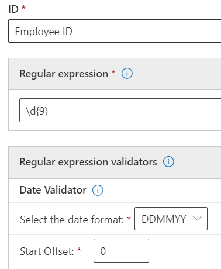

# Introducción a los tipos de información confidencial personalizadosGet started with custom sensitive information types

Si los tipos de información confidencial predefinidos no satisfacen sus necesidades, puede crear sus propios tipos de información confidencial personalizados. Al hacerlo, puede copiar uno de los tipos predefinidos y modificarlo o definirlo completamente usted mismo.If the pre-configured sensitive information types don't meet your needs, you can create your own custom sensitive information types that you fully define or you can copy one of the pre-configured ones and modify it.

Los tipos de información confidencial personalizados se agregan al paquete de reglas denominado Microsoft.SCCManaged.CustomRulePack `Microsoft.SCCManaged.CustomRulePack`.The custom sensitive information types that you create by using this method are added to the rule package named `Microsoft.SCCManaged.CustomRulePack`.

Hay dos formas de crear un tipo de información confidencial:There are two ways to create a new sensitive information type:

- [Desde cero (usted define completamente todos los elementos)from scratch where you fully define all elements](#create-a-custom-sensitive-information-type)
- [Copiando un tipo de información confidencial existente y modificándolocopy and modify an existing sensitive information type](#copy-and-modify-a-sensitive-information-type)

## Antes de empezarBefore you begin

- Debe estar familiarizado con los tipos de información confidencial y saber de qué se componen.You should be familiar with sensitive information types and what they are composed of. Consulte [Obtener más información acerca de los tipos de información confidencial](sensitive-information-type-learn-about.md).See, [Learn about sensitive information types](sensitive-information-type-learn-about.md). Es fundamental comprender los roles de:It is critical to understand the roles of:
    - [Las expresiones regulares](https://www.boost.org/doc/libs/1_68_0/libs/regex/doc/html/): los tipos de información confidencial de Microsoft 365 usan el motor Boost.RegEx 5.1.3[regular expressions](https://www.boost.org/doc/libs/1_68_0/libs/regex/doc/html/) - Microsoft 365 sensitive information types uses the Boost.RegEx 5.1.3 engine
    - Listas de palabras clave: puede crear las suyas a medida que defina el tipo de información confidencial o elegir entre listas de palabras clave existentes.keyword lists - you can create your own as you define your sensitive information type or choose from existing keyword lists
    - [Diccionario de palabras clavekeyword dictionary](create-a-keyword-dictionary.md)
    - [Funcionesfunctions](what-the-dlp-functions-look-for.md)
    - [Niveles de confianzaconfidence levels](sensitive-information-type-learn-about.md#more-on-confidence-levels)
 
- Debe contar con los permisos de administrador global o de administrador de cumplimiento para crear, probar e implementar un tipo de información confidencial personalizada por medio de la interfaz de usuario.You must have Global admin or Compliance admin permissions to create, test, and deploy a custom sensitive information type through the UI. Vea [Acerca de las funciones de administración](/office365/admin/add-users/about-admin-roles)en Office 365.
See [About admin roles](/office365/admin/add-users/about-admin-roles) in Office 365.

- Su organización debe tener una suscripción, como Office 365 Enterprise, que incluye la prevención de pérdida de datos (DLP).Your organization must have a subscription, such as Office 365 Enterprise, that includes Data Loss Prevention (DLP). [Ver Política de Mensajería y Servicio de ServiceDescription](/office365/servicedescriptions/exchange-online-protection-service-description/messaging-policy-and-compliance-servicedesc)See [Messaging Policy and Compliance ServiceDescription](/office365/servicedescriptions/exchange-online-protection-service-description/messaging-policy-and-compliance-servicedesc). 

> [!IMPORTANT]
> El soporte técnico y el servicio al cliente de Microsoft no puede ayudar a crear clasificaciones personalizadas o patrones de expresiones regulares.Microsoft Customer Service & Support can't assist with creating custom classifications or regular expression patterns. Los ingenieros de soporte técnico pueden ofrecer soporte limitado para la característica como, por ejemplo, proporcionar patrones de expresiones regulares de ejemplo para propósitos de prueba o ayudar con la solución de problemas de un patrón de expresión regular existente que no se activa de la forma esperada. Pero no pueden garantizar que el desarrollo personalizado que coincida con el contenido cumplirá sus requisitos u obligaciones.Support engineers can provide limited support for the feature, such as, providing sample regular expression patterns for testing purposes, or assisting with troubleshooting an existing regular expression pattern that's not triggering as expected, but can't provide assurances that any custom content-matching development will fulfill your requirements or obligations.

## Crear un tipo de información confidencial personalizadoCreate a custom sensitive information type

Use este procedimiento para crear un nuevo tipo de información confidencial y definirlo usted mismo por completo.Use this procedure to create a new sensitive information type that you fully define. 

1. En el Centro de cumplimiento, vaya a **Clasificación de datos** \> **Tipos de información confidencial** y elija **Crear tipo de información**.In the Compliance Center, go to **Data classification** \> **Sensitive info types** and choose **Create info type**.
2. Rellene los valores de **Nombre** y **Descripción** y elija **Siguiente**.Fill in values for **Name** and **Description** and choose **Next**.
3. Elija **Crear patrón**.Choose **Create pattern**. Puede crear varios patrones, cada uno con diferentes elementos y niveles de confianza, a medida que defina el nuevo tipo de información confidencial.You can create multiple patterns, each with different elements and confidence levels, as you define your new sensitive information type.
4. Elija el valor predeterminado del Nivel de confianza para el patrón.Choose the default confidence level for the pattern. Los valores son **Confianza baja**, **Confianza media** y **Confianza alta**.The values are **Low confidence**, **Medium confidence**, and **High confidence**.
5. Elegir y definir el **Elemento principal**.Choose and define **Primary element**. El elemento principal puede ser una **Expresión regular** con un validador opcional, una **lista de palabras clave**, un **diccionario de palabras clave** o una de las **funciones preconfiguradas**.The primary element can be a **Regular expression** with an optional validator, a **Keyword list**, a **Keyword dictionary**, or one of the pre-configured **Functions**. Para obtener más información sobre las funciones DLP, vea [Qué buscan las funciones de DLP](what-the-dlp-functions-look-for.md).For more information on DLP functions, see [What the DLP functions look for](what-the-dlp-functions-look-for.md). Para obtener más información sobre la fecha y los validadores de suma de comprobación, vea [More information on regular expression validators](#more-information-on-regular-expression-validators).For more information on the date and the checksum validators, see [More information on regular expression validators](#more-information-on-regular-expression-validators).
6. Rellene un valor para **Proximidad de caracteres**.Fill in a value for **Character proximity**.
7. (Opcional) Si los tiene, agregue elementos de soporte.(Optional) Add supporting elements if you have any. Los elementos de soporte pueden ser una expresión regular con un validador opcional, una lista de palabras clave, un diccionario de palabras clave o una de las funciones predefinidas.Supporting elements can be a regular expression with an optional validator, a keyword list, a keyword dictionary or one of the pre-defined functions. Los elementos de soporte pueden tener su propia **configuración de proximidad de** caracteres.Supporting elements can have their own **Character proximity** configuration. 
8. (Opcional) Agregar [**comprobaciones adicionales**](#more-information-on-additional-checks) de la lista de comprobaciones disponibles.(Optional) Add any [**additional checks**](#more-information-on-additional-checks) from the list of available checks.
9. Seleccione **Crear**.Choose **Create**.
10. Elija **Siguiente**.Choose **Next**.
11. Elija el **nivel de confianza recomendado** de este tipo de información confidencial.Choose the **recommended confidence level** for this sensitive information type.
12. Revise la configuración y elija **Enviar**.Check your setting and choose **Submit**.

> [!IMPORTANT]
> Microsoft 365 usa el rastreador de búsqueda para identificar y clasificar información confidencial en los sitios de SharePoint Online y OneDrive para la Empresa.Microsoft 365 uses the search crawler to identify and classify sensitive information in SharePoint Online and OneDrive for Business sites. Para identificar el nuevo tipo de información confidencial personalizado en el contenido existente, se necesita volver a rastrear el contenido.To identify your new custom sensitive information type in existing content, the content must be re-crawled. El contenido se rastrea en función de una programación, pero puede volver a rastrear de forma manual el contenido de una colección de sitios, lista o biblioteca.Content is crawled based on a schedule, but you can manually re-crawl content for a site collection, list, or library. Para obtener más información, vea [Solicitar manualmente el rastreo y una nueva indexación de un sitio, una biblioteca o una lista](/sharepoint/crawl-site-content).For more information, see [Manually request crawling and re-indexing of a site, a library or a list](/sharepoint/crawl-site-content).

13. En la **clasificación de datos**, verá todos los tipos de información confidencial.On the **Data classification** page, you'll see all the sensitive information types listed. Elija **Actualizar** y luego encuentre el tipo de información confidencial que ha creado con la herramienta de búsqueda o explorando.Choose **Refresh** and then browse for or use the search tool to find the sensitive information type you created.

## Cómo probar un tipo de información confidencial personalizadoTest a sensitive information type

Puede probar cualquier tipo de información confidencial en la lista.You can test any sensitive information type in the list. Le recomendamos que pruebe todos los tipos de información confidencial que cree antes de usarlos en una directiva.We suggest that you test every sensitive information type that you create before using it in a policy.

1. Prepare dos archivos, por ejemplo documentos de Word.Prepare two files, like a Word document. Uno debe tener contenido que coincida con los elementos especificados en el tipo de información confidencial y el otro elementos que no coincidan.One with content that matches the elements you specified in your sensitive information type and one that doesn't match.
2. En el Centro de cumplimiento, vaya a **Clasificación de datos** \> **Tipos de información confidencial**. Elija el tipo de información confidencial de la lista para abrir el panel de detalles y elija **Probar**.In the Compliance Center, go to **Data classification** \> **Sensitive info types** and choose the sensitive information type from the list to open the details pane and choose **Test**.
3. Cargue un archivo y elija **Probar**.Upload a file and choose **Test**.
4. En la página **Resultados de coincidencia**, revise los resultados y, después, seleccione **Finalizar**.On the **Matches results** page, review the results and choose **Finish**.

## Modificar tipos personalizados de información confidencial en el Centro de cumplimientoModify custom sensitive information types in the Compliance Center

1. En el Centro de cumplimiento, vaya a **Clasificación de datos** \> **Tipos de información confidencial**. Elija el tipo de información confidencial de la lista que desee modificar y seleccione **Editar**.In the Compliance Center, go to **Data classification** \> **Sensitive info types** and choose the sensitive information type from the list that you want to modify choose **Edit**.
2. Puede agregar otros patrones, con elementos únicos principales y compatibles, niveles de confianza, proximidad de caracteres y [**comprobaciones adicionales**](#more-information-on-additional-checks), o editar o quitar los existentes.You can add other patterns, with unique primary and supporting elements, confidence levels, character proximity, and [**additional checks**](#more-information-on-additional-checks) or edit/remove the existing ones.

## Quitar tipos personalizados de información confidencial en el Centro de cumplimientoRemove custom sensitive information types in the Compliance Center 

> [!NOTE]
> Solo se pueden quitar los tipos personalizados de información confidencial; no se pueden quitar los tipos de información confidencial integrados.You can only remove custom sensitive information types; you can't remove built-in sensitive information types.

> [!IMPORTANT]
> Antes de quitar un tipo personalizado de información confidencial, asegúrese de que ninguna de las directivas DLP o reglas de flujo del correo de Exchange (también conocidas como reglas de transporte) hagan referencia al tipo de información confidencial.Before your remove a custom sensitive information type, verify that no DLP policies or Exchange mail flow rules (also known as transport rules) still reference the sensitive information type.

1. En el Centro de cumplimiento, vaya a **Clasificación de datos** \> **Tipos de información confidencial**. Elija el tipo de información confidencial de la lista que desee quitar.In the Compliance Center, go to **Data classification** \> **Sensitive info types** and choose the sensitive information type from the list that you want to remove.
2. En el menú desplegable que se abre, elija **Eliminar**.In the fly-out that opens, choose **Delete**.

## Copiar y modificar un tipo de información confidencial existenteCopy and modify a sensitive information type

Use este procedimiento para crear un nuevo tipo de información confidencial que se base en un tipo de información confidencial existente.Use this procedure to create a new sensitive information type that is based on an existing sensitive information type. 

1. En el Centro de cumplimiento, vaya a **Clasificación de datos** \> **Tipos de información confidencial**. Elija el tipo de información confidencial que desee copiar.In the Compliance Center, go to **Data classification** \> **Sensitive info types** and choose the sensitive information type that you want to copy.
2. En el menú flotante, elija **Copiar**.In the flyout, choose **Copy**.
3. En la lista de tipos de información confidencial, seleccione **Actualizar** y examine o busque la copia que acaba de hacer.Choose **Refresh** in the list of sensitive information types and either browse or search for the copy you just made. Se admite la búsqueda de cadenas parciales, por lo que puede buscar `copy` y la búsqueda le devolverá todos los tipos de información confidencial con la cadena `copy` en el nombre.Partial sting searches work, so you could just search for `copy` and search would return all the sensitive information types with the word `copy` in the name. 
4. Rellene los valores de **Nombre** y **Descripción** y elija **Siguiente**.Fill in values for **Name** and **Description** and choose **Next**.
5. Elija su copia del tipo de información confidencial y seleccione **Editar**.Choose your sensitive information type copy and choose **Edit**. 
6. Asigne al tipo de información confidencial un **Nombre** y **Descripción** nuevos.Give your new sensitive information type a new **Name** and **Description**.
7. Puede elegir editar o quitar los patrones existentes y agregar otros nuevos.You can choose to edit or remove the existing patterns and add new ones. Elija el valor predeterminado del Nivel de confianza para el nuevo patrón.Choose the default confidence level for the new pattern. Los valores son **Confianza baja**, **Confianza media** y **Confianza alta**.The values are **Low confidence**, **Medium confidence**, and **High confidence**.
8. Elegir y definir el **Elemento principal**.Choose and define **Primary element**. El elemento principal puede ser una **Expresión regular**, una **lista de palabras clave**, un **diccionario de palabras clave** o una de las **funciones preconfiguradas**.The primary element can be a **Regular expression**, a **Keyword list**, a **Keyword dictionary**, or one of the pre-configured **Functions**. Consulte [Qué buscan las funciones de DLP](what-the-dlp-functions-look-for.md).See, [What the DLP functions look for](what-the-dlp-functions-look-for.md).
9. Rellene un valor para **Proximidad de caracteres**.Fill in a value for **Character proximity**.
10. (Opcional) Si tiene **Elementos de apoyo** o [**Controles adicionales**](#more-information-on-additional-checks), agruégelos.(Optional) If you have **Supporting elements** or any [**Additional checks**](#more-information-on-additional-checks) add them. Si es necesario, puede agrupar los **Elementos de apoyo**.If needed you can group your **Supporting elements**.
11. Seleccione **Crear**.Choose **Create**.
12. Elija **Siguiente**.Choose **Next**.
13. Elija el **nivel de confianza recomendado** de este tipo de información confidencial.Choose the **recommended confidence level** for this sensitive information type.
14. Revise la configuración y elija **Enviar**.Check your setting and choose **Submit**.

También puede crear tipos de información confidencial con PowerShell y usar las funciones de coincidencia de datos exacta.You can also create custom sensitive information types by using PowerShell and Exact Data Match capabilities. Para obtener más información sobre estos métodos, vea:To learn more about those methods, see:
- [Crear un tipo personalizado de información confidencial en PowerShell del Centro de seguridad y cumplimientolCreate a custom sensitive information type in Security & Compliance Center PowerShell](create-a-custom-sensitive-information-type-in-scc-powershell.md)
- [Cree un tipo de información confidencial personalizada para DLP con Exact Data Match (EDM) Create a custom sensitive information type for DLP with Exact Data Match (EDM)](create-custom-sensitive-information-types-with-exact-data-match-based-classification.md)

## Más información sobre validadores de expresiones regularesMore information on regular expression validators

### Validador de suma de comprobaciónChecksum validator

Si necesita ejecutar una suma de comprobación en un dígito de una expresión regular, puede usar el *validador de suma de comprobación*.If you need to run a checksum on a digit in a regular expression, you can use the *checksum validator*. Por ejemplo, diga que necesita crear un SIT para un número de licencia de ocho dígitos donde el último dígito es un dígito de suma de comprobación que se valida con un cálculo mod 9.For example, say you need to create a SIT for an eight digit license number where the last digit is a checksum digit that is validated using a mod 9 calculation. Ha configurado el algoritmo de suma de comprobación de este tipo:You've set up the checksum algorithm like this:
 
Sum = digit 1 \* Weight 1 + digit 2 \* weight 2 + digit 3 \* weight 3 + digit 4 \* weight 4 + digit 5 \* weight 5 + digit 6 \* weight 6 + digit 7 \* weight 7 + digit 8 \* weight 8 Mod value = Sum % 9 If Mod value == digit 8 Account number is valid If Mod value != digit 8 Account number is invalidSum = digit 1 \* Weight 1 + digit 2 \* weight 2 + digit 3 \* weight 3 + digit 4 \* weight 4 + digit 5 \* weight 5 + digit 6 \* weight 6 + digit 7 \* weight 7 + digit 8 \* weight 8 Mod value = Sum % 9 If Mod value == digit 8 Account number is valid If Mod value != digit 8 Account number is invalid

1. Defina el elemento principal con esta expresión regular:Define the primary element with this regular expression:

`\d{8}`

2. A continuación, agregue el validador de suma de comprobación.Then add the checksum validator.
3. Agregue los valores de peso separados por comas, la posición del dígito de comprobación y el valor mod.Add the weight values separated by commas, the position of the check digit and the Mod value. Para obtener más información sobre la operación Modulo, vea [Modulo operation](https://en.wikipedia.org/wiki/Modulo_operation).For more information on the Modulo operation, see [Modulo operation](https://en.wikipedia.org/wiki/Modulo_operation).

> [!NOTE]
> Si el dígito de comprobación no forma parte del cálculo de suma de comprobación, use 0 como el peso del dígito de comprobación.If the check digit is not part of the checksum calculation then use 0 as the weight for the check digit. Por ejemplo, en el caso anterior, el peso 8 será igual a 0 si el dígito de comprobación no se va a usar para calcular el dígito de comprobación.For example, in the above case weight 8 will be equal to 0 if the check digit is not to be used for calculating the check digit.  Modulo_operation).Modulo_operation).

### Validador de fechasDate validator

Si un valor de fecha incrustado en la expresión regular forma parte  de un nuevo patrón que está creando, puede usar el validador de fechas para probar que cumple los criterios.If a date value that is embedded in regular expression is part of a new pattern you are creating, you can use the *date validator* to test that it meets your criteria. Por ejemplo, diga que desea crear un SIT para un número de identificación de empleado de nueve dígitos.For example, say you want to create a SIT for a nine digit employee identification number. Los seis primeros dígitos son la fecha de contratación en formato DDMMYY y los tres últimos son números generados aleatoriamente.The first six digits are the date of hire in DDMMYY format and the last three are randomly generated numbers. Para validar que los seis primeros dígitos tienen el formato correcto.To validate that the first six digits are in the correct format. 

1. Defina el elemento principal con esta expresión regular:Define the primary element with this regular expression:

`\d{9}`

2. A continuación, agregue el validador de fecha.Then add the date validator.
3. Seleccione el formato de fecha y el desplazamiento de inicio.Select the date format and the start offset. Dado que la cadena de fecha es los seis primeros dígitos, el desplazamiento es `0` .Since the date string is the first six digits, the offset is `0`.

### Procesadores funcionales como validadoresFunctional processors as validators

Puede usar procesadores de funciones para algunos de los SIT más usados como validadores.You can use function processors for some of the most commonly used SITs as validators. Esto le permite definir su propia expresión regular al mismo tiempo que garantiza que pasan las comprobaciones adicionales necesarias por el SIT.This allows you to define your own regular expression while ensuring they pass the additional checks required by the SIT. Por ejemplo, Func_India_Aadhar garantizará que la expresión regular personalizada definida por usted pase la lógica de validación necesaria para la tarjeta Aadhar india.For example, Func_India_Aadhar will ensure that the custom regular expression defined by you passes the validation logic required for Indian Aadhar card. Para obtener más información sobre las funciones DLP que se pueden usar como validadores, vea [What the DLP functions look for](what-the-dlp-functions-look-for.md#what-the-dlp-functions-look-for).For more information on DLP functions that can be used as validators, see [What the DLP functions look for](what-the-dlp-functions-look-for.md#what-the-dlp-functions-look-for). 

### Validador de comprobación de LuhnLuhn check validator

Puede usar el validador de comprobación de Luhn si tiene un tipo de información confidencial personalizado que incluye una expresión regular que debe pasar el algoritmo [Luhn](https://en.wikipedia.org/wiki/Luhn_algorithm).You can use the Luhn check validator if you have a custom Sensitive information type that includes a regular expression which should pass the [Luhn algorithm](https://en.wikipedia.org/wiki/Luhn_algorithm).

## Más información sobre comprobaciones adicionalesMore information on additional checks

Aquí tiene las definiciones y algunos ejemplos de las comprobaciones adicionales disponibles.Here are the definitions and some examples for the available additional checks.

**Excluir coincidencias específicas**: Esta comprobación le permite definir palabras clave para excluir al detectar coincidencias del patrón que esté editando.**Exclude specific matches**: This check lets you define keywords to exclude when detecting matches for the pattern you are editing. Por ejemplo, puede excluir números de prueba de tarjeta de crédito como "4111111111111111", para que no aparezcan como número válido.For example, you might exclude test credit card numbers like '4111111111111111' so that they're not matched as a valid number.

**Empezar o no empezar con caracteres**: Esta comprobación le permite definir los caracteres con que los elementos coincidentes pueden o no pueden empezar.**Starts or doesn't start with characters**: This check lets you define the characters that the matched items must or must not start with. Por ejemplo, si quiere que el patrón detecte solo números de tarjeta de crédito que empiece con 41, 42 o 43, seleccione **Empieza con** y agregue 41, 42 y 43 a la lista, separados por comas.For example, if you want the pattern to detect only credit card numbers that start with 41, 42, or 43, select **Starts with** and add 41, 42, and 43 to the list, separated by commas. 

**Terminar o no terminar con caracteres**: Esta comprobación le permite definir los caracteres con que los elementos coincidentes pueden o no pueden terminar.**Ends or doesn't end with characters**: This check lets you define the characters that the matched items must or must not end with. Por ejemplo, si su número de Id. de empleado no puede terminar con 0 o 1, seleccione **No termina con** y agregue 0 y 1 a la lista, separados por comas.For example, if your Employee ID number cannot end with 0 or 1, select **Doesn't end with** and add 0 and 1 to the list, separated by commas.

**Excluir caracteres duplicados**: esta comprobación le permite ignorar coincidencias en las que todos los dígitos son los mismos.**Exclude duplicate characters**: This check lets you ignore matches in which all the digits are the same. Por ejemplo, si el número de Id. de empleado tiene seis dígitos y no son iguales, puede seleccionar **Excluir caracteres duplicados** para excluir 111111, 222222, 333333, 444444, 555555, 666666, 777777, 888888, 999999, y 000000 de la lista de coincidencias válidas para la Id. del empleado.For example, if the six digit employee ID number cannot have all the digits be the same, you can select **Exclude duplicate characters** to exclude 111111, 222222, 333333, 444444, 555555, 666666, 777777, 888888, 999999, and 000000 from the list of valid matches for the employee ID.

**Incluir o excluir prefijos**: Esta comprobación le permite definir las palabras clave que deben o no deben aparecer inmediatamente antes de la entidad coincidente.**Include or exclude prefixes**: This check lets you define the keywords that must or must not be found immediately before the matching entity. En función de su selección, las entidades aparecerán o no como coincidencias si son precedidas por los prefijos que incluya aquí.Depending on your selection, entities will be matched or not matched if they're preceded by the prefixes you include here. Por ejemplo, si **Excluye** el prefijo **GUID:**, toda entidad precedida por **GUID:** no se considerará una coincidencia.For example, if you **Exclude** the prefix **GUID:**, any entity that's preceded by **GUID:** won't be considered a match.

**Incluir o excluir sufijos**: Esta comprobación le permite definir las palabras clave que deben o no deben aparecer inmediatamente después de la entidad coincidente.**Include or exclude suffixes** This check lets you define the keywords that must or must not be found immediately after the matching entity. En función de su selección, las entidades aparecerán o no como coincidencias si aparecen seguidas de los sufijos que incluya aquí.Depending on your selection, entities will be matched or not matched if they're followed by the suffixes you include here. Por ejemplo, si **Excluye** el sufijo **GUID:**, cualquier texto seguido de **GUID:** no se considerará una coincidencia.For example, if you **Exclude** the suffix **:GUID**, any text that's followed by **:GUID** won't be matched.

> [!NOTE]
> Microsoft 365 Information Protection admite idiomas de juego de caracteres de doble byte para:Microsoft 365 Information Protection supports double byte character set languages for:
> - Chino (simplificado)Chinese (simplified)
> - Chino (tradicional)Chinese (traditional)
> - CoreanoKorean
> - JaponésJapanese
>
>Este soporte está disponible para tipos de información confidencial.This support is available for sensitive information types. Para más información, consulte [Notas de la versión sobre la compatibilidad de Information Protection con juegos de caracteres de doble byte (vista previa)](mip-dbcs-relnotes.md).See, [Information protection support for double byte character sets release notes (preview)](mip-dbcs-relnotes.md) for more information.

> [!TIP]
> Para detectar patrones que contengan caracteres chino/japonés y caracteres de byte único o para detectar patrones que contengan chino,japonés e inglés, defina dos variantes de la palabra clave o regex.To detect patterns containing Chinese/Japanese characters and single byte characters or to detect patterns containing Chinese/Japanese and English, define two variants of the keyword or regex. Por ejemplo, para detectar una palabra clave como "机密的document", use dos variantes de la palabra clave; uno con un espacio entre el texto japonés e inglés y otro sin un espacio entre el texto japonés e inglés.For example, to detect a keyword like "机密的document", use two variants of the keyword; one with a space between the Japanese and English text and another without a space between the Japanese and English text. Por lo tanto, las palabras clave que se agregarán en sit deben ser "机密的 documento" y "机密的document".So, the keywords to be added in the SIT should be "机密的 document" and "机密的document". Del mismo modo, para detectar una frase "2020", se deben usar dos variantes; "2020" y "2020".Similarly, to detect a phrase "東京オリンピック2020", two variants should be used; "東京オリンピック 2020" and "東京オリンピック2020".
> Al crear un regex con un guión de doble byte o un período de doble byte, asegúrese de escapar de los caracteres como uno para escapar de un guión o punto en un regex.While creating a regex using a double byte hyphen or a double byte period, make sure to escape both the characters like one would escape a hyphen or period in a regex. A continuación se muestra un regex de ejemplo para referencia:Here is a sample regex for reference:
    - (?<!\d) ([4][0-9] {3} [ \- ?\-\t]\*[0-9]{4}(?<!\d)([４][０-９]{3}[\-?\－\t]\*[０-９]{4}
> Se recomienda usar una coincidencia de cadena en lugar de una coincidencia de palabras en una lista de palabras clave.We recommend using a string match instead of a word match in a keyword list.
