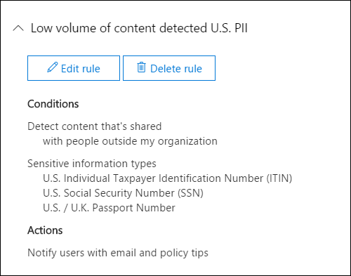
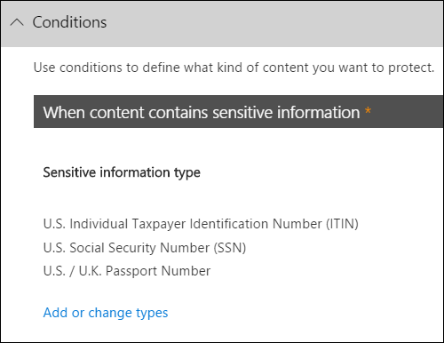

# Crear una directiva DLP a partir de una plantilla

La forma más sencilla y común de empezar a usar directivas DLP es usar una de las plantillas incluidas en Office 365. Puede usar una de estas plantillas tal como está o personalizar las reglas para cumplir los requisitos de cumplimiento específicos de su organización.
  
Microsoft 365 incluye más de 40 plantillas listas para usar que pueden ayudarle a satisfacer una amplia variedad de necesidades comunes de directivas normativas y empresariales. Por ejemplo, hay plantillas de directiva DLP para:
  
- Ley Gramm-Leach-Bliley (GLBA)
    
- Estándar de seguridad de datos de la industria de las tarjetas de pago (PCI DSS)
    
- Información de identificación personal de Estados Unidos (PII de EE.UU.)
    
- Ley de seguros de salud de Estados Unidos (HIPAA)
    
Puede ajustar una plantilla modificando cualquiera de las reglas existentes o agregando otras nuevas. Por ejemplo, puede agregar nuevos tipos de información confidencial a una regla, modificar los recuentos de una regla para que sea más difícil o más fácil desencadenar, permitir que los usuarios invaliden las acciones de una regla proporcionando una justificación empresarial o cambiar a quién se envían notificaciones e informes de incidentes. Una plantilla de directiva DLP es un punto de partida flexible para muchos escenarios de cumplimiento comunes.
  
También puede elegir la plantilla Personalizada, que no tiene reglas predeterminadas, y configurar la directiva DLP desde cero para cumplir los requisitos de cumplimiento específicos de su organización.
  
## Ejemplo: identificar información confidencial en todos los OneDrive para la Empresa y restringir el acceso de personas fuera de la organización

OneDrive para la Empresa cuentas hacen que sea fácil para los usuarios de toda la organización colaborar y compartir documentos. Pero una preocupación común para los responsables de cumplimiento es que la información confidencial almacenada en OneDrive para la Empresa cuentas puede compartirse involuntariamente con personas ajenas a su organización. Una directiva DLP puede ayudar a mitigar este riesgo.
  
En este ejemplo, creará una directiva DLP que identifique los datos de PII de Estados Unidos, que incluye números de identificación individuales de contribuyentes (ITIN), números de seguridad social y números de pasaporte de Estados Unidos. You'll get started by using a template, and then you'll modify the template to meet your organization's compliance requirements, specifically, you'll:
  
- Agregue un par de tipos de información confidencial (números de cuentas bancarias de Estados Unidos y números de licencia de conducir de Estados Unidos) para que la directiva DLP proteja aún más de los datos confidenciales.
    
- Haga que la directiva sea más confidencial, de modo que una sola aparición de información confidencial sea suficiente para restringir el acceso a usuarios externos.
    
- Permitir a los usuarios invalidar las acciones proporcionando una justificación empresarial o reportando un falso positivo. De esta forma, la directiva DLP no impedirá que los usuarios de la organización terminen su trabajo, siempre que tengan un motivo de negocio válido para compartir la información confidencial.
    
### Crear una directiva DLP a partir de una plantilla

1. Vaya a [https://protection.office.com](https://protection.office.com).
    
2. Inicie sesión con su cuenta profesional o educativa. Ahora está en el Centro de seguridad &amp; y cumplimiento.
    
3. En el Centro de seguridad y cumplimiento de la izquierda navegación Directiva de prevención &amp; \> de pérdida de \> **datos** \>  \> **+ Crear una directiva**.
    
    
  
4. Elija la plantilla de directiva DLP que protege los tipos de información confidencial que necesita \> **Next**.
    
    En este ejemplo, seleccionará Datos de información de identificación  \> **personal (PII)** de Estados Unidos de privacidad porque ya incluye la mayoría de los tipos de información confidencial que desea proteger; agregará un par más adelante. 
    
    Al seleccionar una plantilla, puede leer la descripción a la derecha para obtener información sobre los tipos de información confidencial que protege la plantilla.
    
    
  
5. Asigne a la directiva el nombre \> **Siguiente**.
    
6. Para elegir las ubicaciones que desea proteger la directiva DLP, realice una de las siguientes acciones:
    
  - Elija **Todas las ubicaciones en Office 365** \> **Siguiente**.
    
  - Elija **Let me choose specific locations** \> **Next**. Para este ejemplo, elija esto.
    
    Para incluir o excluir una ubicación completa, como todas las Exchange correo  electrónico o todas las OneDrive, active o apague el estado de esa ubicación. 
    
    Para incluir solo sitios SharePoint específicos o cuentas OneDrive para la Empresa, cambie estado a y,  a continuación, haga clic en los vínculos en Incluir para elegir sitios o cuentas específicos.  Cuando se aplica una directiva a un sitio, las reglas configuradas en dicha directiva se aplican automáticamente a todos los subsitios de ese sitio. 
    
    
  
    En este ejemplo, para proteger la información confidencial almacenada  en todas las cuentas de OneDrive para la Empresa, desactive el  estado de los sitios de **correo** electrónico Exchange y **SharePoint** y deje el estado en para las **cuentas OneDrive**.
    
7. Elija **Usar configuración avanzada** \> **Siguiente**.
    
8. Una plantilla de directiva DLP contiene reglas predefinidas con condiciones y acciones que detectan y actúan sobre tipos específicos de información confidencial. Puede editar, eliminar o desactivar cualquiera de las reglas existentes o agregar otras nuevas. Cuando haya terminado, haga clic **en Siguiente**.
    
    
  
    En este ejemplo, la plantilla Datos de PII de EE. UU. incluye dos reglas predefinidas:
    
  - **Bajo volumen de contenido detectado EN EE. UU. PII** Esta regla busca archivos que contengan entre 1 y 10 repeticiones de cada uno de los tres tipos de información confidencial (números de ITIN, SSN y pasaporte de Estados Unidos), donde los archivos se comparten con personas ajenas a la organización. Si se encuentra, la regla envía una notificación por correo electrónico al administrador de la colección de sitios principal, al propietario del documento y a la persona que modificó por última vez el documento. 
    
  - **Alto volumen de contenido detectado EN EE. UU. PII** Esta regla busca archivos que contengan 10 o más repeticiones de cada uno de los mismos tres tipos de información confidencial, donde los archivos se comparten con personas ajenas a la organización. Si se encuentra, esta acción también envía una notificación por correo electrónico, además de restringir el acceso al archivo. Para el contenido de una cuenta OneDrive para la Empresa, esto significa que los permisos para el documento están restringidos para todos, excepto para el administrador de la colección de sitios principal, el propietario del documento y la persona que modificó por última vez el documento. 
    
    Para cumplir los requisitos específicos de su organización, es posible que desee que las reglas sean más fáciles de desencadenar, de modo que una sola aparición de información confidencial sea suficiente para bloquear el acceso de usuarios externos. Después de ver estas reglas, comprende que no necesita reglas de recuento bajo y alto: solo necesita una sola regla que bloquee el acceso si se encuentra alguna aparición de información confidencial.
    
    Por lo tanto, expande la regla denominada **Bajo volumen de contenido detectado en ee. UU. Regla de eliminación de PII** \> .
    
    
  
9. Ahora, en este ejemplo, debe agregar dos tipos de información confidencial (números de cuenta bancaria de Estados Unidos y números de licencia de conducir de ESTADOS UNIDOS), permitir que las personas invalide una regla y cambiar el recuento a cualquier repetición. Puede hacer todo esto editando una regla, por lo que seleccione Alto volumen de contenido detectado en **EE. UU. Regla de edición de PII** \> .
    
    
  
10. Para agregar un tipo de información confidencial, en la **sección** \> **Condiciones, agregue o cambie los tipos**. A continuación, en Agregar o **cambiar tipos,** elija Agregar seleccione Número de cuenta bancaria de EE. UU. y Número de licencia de conductor de \>  \> **EE. UU.**  \> **Agregar** \> **listo**.
    
    
  
    
  
11. Para cambiar el recuento (el número de instancias de información confidencial necesarias para desencadenar la regla), en **Recuento** de instancias, elija el valor mínimo para cada tipo \> escriba  \> 1. El recuento mínimo no puede estar vacío. El recuento máximo puede estar vacío; un valor **máximo** vacío convertir a **cualquier**.
    
    Cuando termine, el recuento mínimo de todos los tipos de información confidencial debe ser **1** y el recuento máximo debe ser **cualquier**. En otras palabras, cualquier aparición de este tipo de información confidencial cumplirá esta condición.
    
    
  
12. Para la personalización final, no desea que las directivas DLP bloqueen a los usuarios para que no trabajen cuando tienen una justificación empresarial válida o cuando encuentran un falso positivo, por lo que desea que la notificación del usuario incluya opciones para invalidar la acción de bloqueo.
    
    En la **sección Notificaciones de usuario,** puede ver que las notificaciones de correo electrónico y las sugerencias de directiva están activadas de forma predeterminada para esta regla en la plantilla. 
    
    En la **sección Invalidaciones de** usuario, puede ver que las invalidaciones de una justificación empresarial están activadas, pero las invalidaciones para informar de falsos positivos no lo están. Elija **Invalidar la regla automáticamente si la informan como un falso positivo**.
    
    
  
13. En la parte superior del editor de reglas, cambie el nombre de esta regla del valor predeterminado De alto volumen de contenido detectado **DE EE. UU. PII** a Cualquier contenido detectado con **PII** de ESTADOS UNIDOS porque ahora se desencadena por cualquier aparición de sus tipos de información confidencial. 
    
14. En la parte inferior del editor de reglas \> **Guardar**.
    
15. Revise las condiciones y acciones de esta regla \> **Siguiente**.
    
    A la derecha, observe el modificador **Status** de la regla. Si desactiva una directiva completa, todas las reglas contenidas en la directiva también se desactivarán. Sin embargo, aquí puede desactivar una regla específica sin desactivar toda la directiva. Esto puede ser útil cuando necesita investigar una regla que está generando un gran número de falsos positivos. 
    
16. En la página siguiente, lea y comprenda lo siguiente y, a continuación, elija si desea activar la regla o probarla primero \> **Siguiente**.
    
     Antes de crear las directivas DLP, debe considerar implementarlas gradualmente para evaluar su impacto y probar su eficacia antes de aplicarlas por completo. Por ejemplo, no desea que una nueva directiva DLP bloquee de forma involuntara el acceso a miles de documentos que los usuarios necesitan para realizar su trabajo. 
    
    Si está creando directivas DLP con un gran impacto potencial, se recomienda seguir esta secuencia:
    
17. Inicie en modo de prueba sin sugerencias de directiva y, a continuación, use los informes DLP para evaluar el impacto. Los informes DLP le sirven para ver el número, la ubicación, el tipo y la gravedad de las coincidencias de directivas. En función de los resultados, puede ajustar las reglas según sea necesario. En el modo de prueba, las directivas DLP no afectarán a la productividad de las personas que trabajan en su organización. 
    
18. Cambie a modo de prueba con notificaciones y sugerencias de directivas para que pueda comenzar a enseñar a los usuarios las directivas de cumplimiento y prepararlos para las reglas que se van a aplicar. En esta fase, también puede solicitar a los usuarios que informen de falsos positivos para que pueda perfeccionar las reglas de los usuarios.
    
19. Active las directivas para que se cumplan las reglas y se protege el contenido. Continúe supervisando los informes DLP y los informes de incidentes o las notificaciones para asegurarse de que los resultados sean los deseados. 
    
    
  
20. Revise la configuración de esta directiva \> elija **Crear**.
    
Después de crear y activar una directiva DLP, se implementa en los orígenes de contenido que incluye, como sitios de SharePoint Online o cuentas de OneDrive para la Empresa, donde la directiva comienza a aplicar automáticamente sus reglas en ese contenido.
  
## Ver el estado de una directiva DLP

En cualquier momento, puede ver el estado  de las directivas DLP en la página Directiva de la sección **Prevención de pérdida de** datos del Centro de cumplimiento &amp; de seguridad. Aquí encontrará información importante, como si una directiva se ha habilitado o deshabilitado correctamente, o si la directiva está en modo de prueba. 
  
Estos son los distintos estados y lo que significan.
  
|**Estado**|**Explicación**|
|:-----|:-----|
|**Activando...**   |La directiva se está implementando en los orígenes de contenido que incluye. Aún no se exige la directiva en todos los orígenes.    |
|**Pruebas, con notificaciones**   |La directiva está en modo de prueba. Las acciones de una regla no se aplican, pero las coincidencias de directiva se recopilan y se pueden ver mediante los informes DLP. Las notificaciones sobre las coincidencias de directiva se envían a los destinatarios especificados.    |
|**Pruebas, sin notificaciones**   |La directiva está en modo de prueba. Las acciones de una regla no se aplican, pero las coincidencias de directiva se recopilan y se pueden ver mediante los informes DLP. Las notificaciones sobre coincidencias de directiva no se envían a los destinatarios especificados.    |
|**On**   |La directiva está activa y se exige. La directiva se implementó correctamente en todos sus orígenes de contenido.    |
|**Desactivando...**   |La directiva se está quitando de los orígenes de contenido que incluye. La directiva todavía puede estar activa y exigirse en algunos orígenes. Desactivar una directiva puede tardar hasta 45 minutos.    |
|**Desactivado**   |La directiva no está activa y no se exige. Se guarda la configuración de la directiva (orígenes, palabras clave, duración, etc.).    |
|**Eliminar...**   |La directiva está en proceso de eliminación. La directiva no está activa y no se exige. Normalmente, una directiva tarda una hora en deseletar   |
   
## Desactivar una directiva DLP

Puede editar o desactivar una directiva DLP en cualquier momento. Desactivar una directiva deshabilita todas las reglas de la directiva.
  
Para editar o desactivar una directiva DLP, en la **página** Directiva \> seleccione la directiva Editar \> **directiva**.
  

  
Además, puede desactivar cada regla individualmente editando la directiva  y, a continuación, regateando el estado de esa regla, como se describió anteriormente. 
  
## Más información

- [Obtenga más información acerca de la prevención contra la pérdida de datos](dlp-learn-about-dlp.md)
- [Enviar notificaciones y mostrar sugerencias de directivas para directivas DLP](use-notifications-and-policy-tips.md)
- [Crear una directiva DLP para proteger documentos con FCI u otras propiedades](protect-documents-that-have-fci-or-other-properties.md)
- [Qué incluyen las plantillas de directiva DLP](what-the-dlp-policy-templates-include.md)
- [Definiciones de entidad de tipos de información confidencial](sensitive-information-type-entity-definitions.md)
