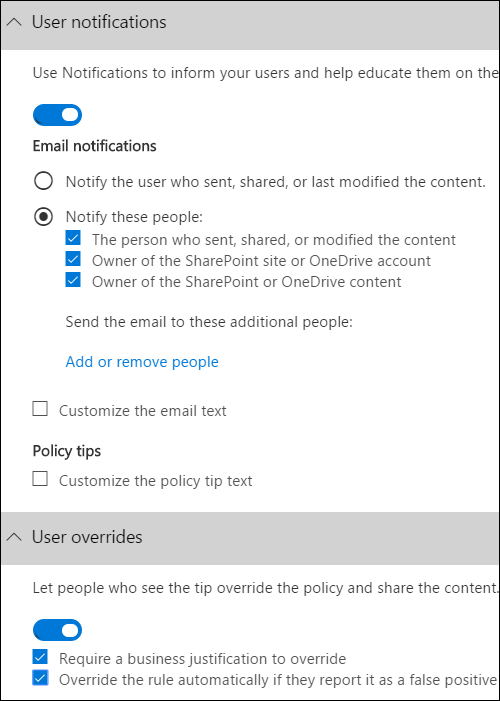

# Crear una directiva DLP a partir de una plantillaCreate a DLP policy from a template

La forma más sencilla y común de empezar a usar directivas DLP es usar una de las plantillas incluidas en Office 365.The easiest, most common way to get started with DLP policies is to use one of the templates included in Office 365. Puede usar una de estas plantillas tal como está o personalizar las reglas para cumplir los requisitos de cumplimiento específicos de su organización.You can use one of these templates as is, or customize the rules to meet your organization's specific compliance requirements.
  
Microsoft 365 incluye más de 40 plantillas listas para usar que pueden ayudarle a satisfacer una amplia variedad de necesidades comunes de directivas normativas y empresariales.Microsoft 365 includes over 40 ready-to-use templates that can help you meet a wide range of common regulatory and business policy needs. Por ejemplo, hay plantillas de directiva DLP para:For example, there are DLP policy templates for:
  
- Ley Gramm-Leach-Bliley (GLBA)Gramm-Leach-Bliley Act (GLBA)
    
- Estándar de seguridad de datos de la industria de las tarjetas de pago (PCI DSS)Payment Card Industry Data Security Standard (PCI-DSS)
    
- Información de identificación personal de Estados Unidos (PII de EE.UU.)United States Personally Identifiable Information (U.S. PII)
    
- Ley de seguros de salud de Estados Unidos (HIPAA)United States Health Insurance Act (HIPAA)
    
Puede ajustar una plantilla modificando cualquiera de las reglas existentes o agregando otras nuevas.You can fine tune a template by modifying any of the existing rules or adding new ones. Por ejemplo, puede agregar nuevos tipos de información confidencial a una regla, modificar los recuentos de una regla para que sea más difícil o más fácil desencadenar, permitir que los usuarios invaliden las acciones de una regla proporcionando una justificación empresarial o cambiar a quién se envían notificaciones e informes de incidentes.For example, you can add new types of sensitive information to a rule, modify the counts in a rule to make it harder or easier to trigger, allow people to override the actions in a rule by providing a business justification, or change who notifications and incident reports are sent to. Una plantilla de directiva DLP es un punto de partida flexible para muchos escenarios de cumplimiento comunes.A DLP policy template is a flexible starting point for many common compliance scenarios.
  
También puede elegir la plantilla Personalizada, que no tiene reglas predeterminadas, y configurar la directiva DLP desde cero para cumplir los requisitos de cumplimiento específicos de su organización.You can also choose the Custom template, which has no default rules, and configure your DLP policy from scratch, to meet the specific compliance requirements for your organization.
  
## Ejemplo: identificar información confidencial en todos los OneDrive para la Empresa y restringir el acceso de personas fuera de la organizaciónExample: Identify sensitive information across all OneDrive for Business sites and restrict access for people outside your organization

OneDrive para la Empresa cuentas hacen que sea fácil para los usuarios de toda la organización colaborar y compartir documentos.OneDrive for Business accounts make it easy for people across your organization to collaborate and share documents. Pero una preocupación común para los responsables de cumplimiento es que la información confidencial almacenada en OneDrive para la Empresa cuentas puede compartirse involuntariamente con personas ajenas a su organización.But a common concern for compliance officers is that sensitive information stored in OneDrive for Business accounts may be inadvertently shared with people outside your organization. Una directiva DLP puede ayudar a mitigar este riesgo.A DLP policy can help mitigate this risk.
  
En este ejemplo, creará una directiva DLP que identifique los datos de PII de Estados Unidos, que incluye números de identificación individuales de contribuyentes (ITIN), números de seguridad social y números de pasaporte de Estados Unidos.In this example, you'll create a DLP policy that identifies U.S. PII data, which includes Individual Taxpayer Identification Numbers (ITIN), Social Security Numbers, and U.S. passport numbers. You'll get started by using a template, and then you'll modify the template to meet your organization's compliance requirements, specifically, you'll:You'll get started by using a template, and then you'll modify the template to meet your organization's compliance requirements—specifically, you'll:
  
- Agregue un par de tipos de información confidencial (números de cuentas bancarias de Estados Unidos y números de licencia de conducir de Estados Unidos) para que la directiva DLP proteja aún más de los datos confidenciales.Add a couple of types of sensitive information—U.S. bank account numbers and U.S. driver's license numbers—so that the DLP policy protects even more of your sensitive data.
    
- Haga que la directiva sea más confidencial, de modo que una sola aparición de información confidencial sea suficiente para restringir el acceso a usuarios externos.Make the policy more sensitive, so that a single occurrence of sensitive information is enough to restrict access for external users.
    
- Permitir a los usuarios invalidar las acciones proporcionando una justificación empresarial o reportando un falso positivo.Allow users to override the actions by providing a business justification or reporting a false positive. De esta forma, la directiva DLP no impedirá que los usuarios de la organización terminen su trabajo, siempre que tengan un motivo de negocio válido para compartir la información confidencial.This way, your DLP policy won't prevent people in your organization from getting their work done, provided they have a valid business reason for sharing the sensitive information.
    
### Crear una directiva DLP a partir de una plantillaCreate a DLP policy from a template

1. Vaya a [https://protection.office.com](https://protection.office.com).Go to [https://protection.office.com](https://protection.office.com).
    
2. Inicie sesión con su cuenta profesional o educativa.Sign in using your work or school account. Ahora está en el Centro de seguridad &amp; y cumplimiento.You're now in the Security &amp; Compliance Center.
    
3. En el Centro de seguridad y cumplimiento de la izquierda navegación Directiva de prevención &amp; \> de pérdida de \> **datos** \>  \> **+ Crear una directiva**.In the Security &amp; Compliance Center \> left navigation \> **Data loss prevention** \> **Policy** \> **+ Create a policy**.
    
    
  
4. Elija la plantilla de directiva DLP que protege los tipos de información confidencial que necesita \> **Next**.Choose the DLP policy template that protects the types of sensitive information that you need \> **Next**.
    
    En este ejemplo, seleccionará Datos de información de identificación  \> **personal (PII)** de Estados Unidos de privacidad porque ya incluye la mayoría de los tipos de información confidencial que desea proteger; agregará un par más adelante.In this example, you'll select **Privacy** \> **U.S. Personally Identifiable Information ‎(PII)‎ Data** because it already includes most of the types of sensitive information that you want to protect—you'll add a couple later. 
    
    Al seleccionar una plantilla, puede leer la descripción a la derecha para obtener información sobre los tipos de información confidencial que protege la plantilla.When you select a template, you can read the description on the right to learn what types of sensitive information the template protects.
    
    
  
5. Asigne a la directiva el nombre \> **Siguiente**.Name the policy \> **Next**.
    
6. Para elegir las ubicaciones que desea proteger la directiva DLP, realice una de las siguientes acciones:To choose the locations that you want the DLP policy to protect, do one of the following:
    
  - Elija **Todas las ubicaciones en Office 365** \> **Siguiente**.Choose **All locations in Office 365** \> **Next**.
    
  - Elija **Let me choose specific locations** \> **Next**.Choose **Let me choose specific locations** \> **Next**. Para este ejemplo, elija esto.For this example, choose this.
    
    Para incluir o excluir una ubicación completa, como todas las Exchange correo  electrónico o todas las OneDrive, active o apague el estado de esa ubicación.To include or exclude an entire location such as all Exchange email or all OneDrive accounts, switch the **Status** of that location on or off. 
    
    Para incluir solo sitios SharePoint específicos o cuentas OneDrive para la Empresa, cambie estado a y,  a continuación, haga clic en los vínculos en Incluir para elegir sitios o cuentas específicos. To include only specific SharePoint sites or OneDrive for Business accounts, switch the **Status** to on, and then click the links under **Include** to choose specific sites or accounts. Cuando se aplica una directiva a un sitio, las reglas configuradas en dicha directiva se aplican automáticamente a todos los subsitios de ese sitio.When you apply a policy to a site, the rules configured in that policy are automatically applied to all subsites of that site. 
    
    
  
    En este ejemplo, para proteger la información confidencial almacenada  en todas las cuentas de OneDrive para la Empresa, desactive el  estado de los sitios de **correo** electrónico Exchange y **SharePoint** y deje el estado en para las **cuentas OneDrive**.In this example, to protect sensitive information stored in all OneDrive for Business accounts, turn off the **Status** for both **Exchange email** and **SharePoint sites**, and leave the **Status** on for **OneDrive accounts**.
    
7. Elija **Usar configuración avanzada** \> **Siguiente**.Choose **Use advanced settings** \> **Next**.
    
8. Una plantilla de directiva DLP contiene reglas predefinidas con condiciones y acciones que detectan y actúan sobre tipos específicos de información confidencial.A DLP policy template contains predefined rules with conditions and actions that detect and act upon specific types of sensitive information. Puede editar, eliminar o desactivar cualquiera de las reglas existentes o agregar otras nuevas.You can edit, delete, or turn off any of the existing rules, or add new ones. Cuando haya terminado, haga clic **en Siguiente**.When done, click **Next**.
    
    
  
    En este ejemplo, la plantilla Datos de PII de EE. UU. incluye dos reglas predefinidas:In this example, the U.S. PII Data template includes two predefined rules:
    
  - **Bajo volumen de contenido detectado EN EE. UU. PII** Esta regla busca archivos que contengan entre 1 y 10 repeticiones de cada uno de los tres tipos de información confidencial (números de ITIN, SSN y pasaporte de Estados Unidos), donde los archivos se comparten con personas ajenas a la organización.**Low volume of content detected U.S. PII** This rule looks for files containing between 1 and 10 occurrences of each of three types of sensitive information (ITIN, SSN, and U.S. passport numbers), where the files are shared with people outside the organization. Si se encuentra, la regla envía una notificación por correo electrónico al administrador de la colección de sitios principal, al propietario del documento y a la persona que modificó por última vez el documento.If found, the rule sends an email notification to the primary site collection administrator, document owner, and person who last modified the document. 
    
  - **Alto volumen de contenido detectado EN EE. UU. PII** Esta regla busca archivos que contengan 10 o más repeticiones de cada uno de los mismos tres tipos de información confidencial, donde los archivos se comparten con personas ajenas a la organización.**High volume of content detected U.S. PII** This rule looks for files containing 10 or more occurrences of each of the same three sensitive information types, where the files are shared with people outside the organization. Si se encuentra, esta acción también envía una notificación por correo electrónico, además de restringir el acceso al archivo.If found, this action also sends an email notification, plus it restricts access to the file. Para el contenido de una cuenta OneDrive para la Empresa, esto significa que los permisos para el documento están restringidos para todos, excepto para el administrador de la colección de sitios principal, el propietario del documento y la persona que modificó por última vez el documento.For content in a OneDrive for Business account, this means that permissions for the document are restricted for everyone except the primary site collection administrator, document owner, and person who last modified the document. 
    
    Para cumplir los requisitos específicos de su organización, es posible que desee que las reglas sean más fáciles de desencadenar, de modo que una sola aparición de información confidencial sea suficiente para bloquear el acceso de usuarios externos.To meet your organization's specific requirements, you may want to make the rules easier to trigger, so that a single occurrence of sensitive information is enough to block access for external users. Después de ver estas reglas, comprende que no necesita reglas de recuento bajo y alto: solo necesita una sola regla que bloquee el acceso si se encuentra alguna aparición de información confidencial.After looking at these rules, you understand that you don't need low and high count rules—you need only a single rule that blocks access if any occurrence of sensitive information is found.
    
    Por lo tanto, expande la regla denominada **Bajo volumen de contenido detectado en ee. UU. Regla de eliminación de PII** \> .So you expand the rule named **Low volume of content detected U.S. PII** \> **Delete rule**.
    
    
  
9. Ahora, en este ejemplo, debe agregar dos tipos de información confidencial (números de cuenta bancaria de Estados Unidos y números de licencia de conducir de ESTADOS UNIDOS), permitir que las personas invalide una regla y cambiar el recuento a cualquier repetición.Now, in this example, you need to add two sensitive information types (U.S. bank account numbers and U.S. driver's license numbers), allow people to override a rule, and change the count to any occurrence. Puede hacer todo esto editando una regla, por lo que seleccione Alto volumen de contenido detectado en **EE. UU. Regla de edición de PII** \> .You can do all of this by editing one rule, so select **High volume of content detected U.S. PII** \> **Edit rule**.
    
    
  
10. Para agregar un tipo de información confidencial, en la **sección** \> **Condiciones, agregue o cambie los tipos**.To add a sensitive information type, in the **Conditions** section \> **Add or change types**. A continuación, en Agregar o **cambiar tipos,** elija Agregar seleccione Número de cuenta bancaria de EE. UU. y Número de licencia de conductor de \>  \> **EE. UU.**  \> **Agregar** \> **listo**.Then, under **Add or change types** \> choose **Add** \> select **U.S. Bank Account Number** and **U.S. Driver's License Number** \> **Add** \> **Done**.
    
    
  
    
  
11. Para cambiar el recuento (el número de instancias de información confidencial necesarias para desencadenar la regla), en **Recuento** de instancias, elija el valor mínimo para cada tipo \> escriba  \> 1.To change the count (the number of instances of sensitive information required to trigger the rule), under **Instance count** \> choose the **min** value for each type \> enter 1. El recuento mínimo no puede estar vacío.The minimum count cannot be empty. El recuento máximo puede estar vacío; un valor **máximo** vacío convertir a **cualquier**.The maximum count can be empty; an empty **max** value convert to **any**.
    
    Cuando termine, el recuento mínimo de todos los tipos de información confidencial debe ser **1** y el recuento máximo debe ser **cualquier**.When finished, the min count for all of the sensitive information types should be **1** and the max count should be **any**. En otras palabras, cualquier aparición de este tipo de información confidencial cumplirá esta condición.In other words, any occurrence of this type of sensitive information will satisfy this condition.
    
    
  
12. Para la personalización final, no desea que las directivas DLP bloqueen a los usuarios para que no trabajen cuando tienen una justificación empresarial válida o cuando encuentran un falso positivo, por lo que desea que la notificación del usuario incluya opciones para invalidar la acción de bloqueo.For the final customization, you don't want your DLP policies to block people from doing their work when they have a valid business justification or encounter a false positive, so you want the user notification to include options to override the blocking action.
    
    En la **sección Notificaciones de usuario,** puede ver que las notificaciones de correo electrónico y las sugerencias de directiva están activadas de forma predeterminada para esta regla en la plantilla.In the **User notifications** section, you can see that email notifications and policy tips are turned on by default for this rule in the template. 
    
    En la **sección Invalidaciones de** usuario, puede ver que las invalidaciones de una justificación empresarial están activadas, pero las invalidaciones para informar de falsos positivos no lo están.In the **User overrides** section, you can see that overrides for a business justification are turned on, but overrides to report false positives are not. Elija **Invalidar la regla automáticamente si la informan como un falso positivo**.Choose **Override the rule automatically if they report it as a false positive**.
    
    
  
13. En la parte superior del editor de reglas, cambie el nombre de esta regla del valor predeterminado De alto volumen de contenido detectado **DE EE. UU. PII** a Cualquier contenido detectado con **PII** de ESTADOS UNIDOS porque ahora se desencadena por cualquier aparición de sus tipos de información confidencial.At the top of the rule editor, change the name of this rule from the default **High volume of content detected U.S. PII** to **Any content detected with U.S. PII** because it's now triggered by any occurrence of its sensitive information types. 
    
14. En la parte inferior del editor de reglas \> **Guardar**.At the bottom of the rule editor \> **Save**.
    
15. Revise las condiciones y acciones de esta regla \> **Siguiente**.Review the conditions and actions for this rule \> **Next**.
    
    A la derecha, observe el modificador **Status** de la regla.On the right, notice the **Status** switch for the rule. Si desactiva una directiva completa, todas las reglas contenidas en la directiva también se desactivarán.If you turn off an entire policy, all rules contained in the policy are also turned off. Sin embargo, aquí puede desactivar una regla específica sin desactivar toda la directiva.However, here you can turn off a specific rule without turning off the entire policy. Esto puede ser útil cuando necesita investigar una regla que está generando un gran número de falsos positivos.This can be useful when you need to investigate a rule that is generating a large number of false positives. 
    
16. En la página siguiente, lea y comprenda lo siguiente y, a continuación, elija si desea activar la regla o probarla primero \> **Siguiente**.On the next page, read and understand the following, and then choose whether to turn on the rule or test it out first \> **Next**.
    
     Antes de crear las directivas DLP, debe considerar implementarlas gradualmente para evaluar su impacto y probar su eficacia antes de aplicarlas por completo.Before you create your DLP policies, you should consider rolling them out gradually to assess their impact and test their effectiveness before you fully enforce them. Por ejemplo, no desea que una nueva directiva DLP bloquee de forma involuntara el acceso a miles de documentos que los usuarios necesitan para realizar su trabajo.For example, you don't want a new DLP policy to unintentionally block access to thousands of documents that people require to get their work done. 
    
    Si está creando directivas DLP con un gran impacto potencial, se recomienda seguir esta secuencia:If you're creating DLP policies with a large potential impact, we recommend following this sequence:
    
17. Inicie en modo de prueba sin sugerencias de directiva y, a continuación, use los informes DLP para evaluar el impacto. Los informes DLP le sirven para ver el número, la ubicación, el tipo y la gravedad de las coincidencias de directivas. En función de los resultados, puede ajustar las reglas según sea necesario. En el modo de prueba, las directivas DLP no afectarán a la productividad de las personas que trabajan en su organización.Start in test mode without Policy Tips and then use the DLP reports to assess the impact. You can use DLP reports to view the number, location, type, and severity of policy matches. Based on the results, you can fine tune the rules as needed. In test mode, DLP policies will not impact the productivity of people working in your organization. 
    
18. Cambie a modo de prueba con notificaciones y sugerencias de directivas para que pueda comenzar a enseñar a los usuarios las directivas de cumplimiento y prepararlos para las reglas que se van a aplicar. En esta fase, también puede solicitar a los usuarios que informen de falsos positivos para que pueda perfeccionar las reglas de los usuarios.Move to Test mode with notifications and Policy Tips so that you can begin to teach users about your compliance policies and prepare them for the rules that are going to be applied. At this stage, you can also ask users to report false positives so that you can further refine the rules.
    
19. Active las directivas para que se cumplan las reglas y se protege el contenido.Turn on the policies so that the rules are enforced and the content's protected. Continúe supervisando los informes DLP y los informes de incidentes o las notificaciones para asegurarse de que los resultados sean los deseados.Continue to monitor the DLP reports and any incident reports or notifications to make sure that the results are what you intend. 
    
    
  
20. Revise la configuración de esta directiva \> elija **Crear**.Review your settings for this policy \> choose **Create**.
    
Después de crear y activar una directiva DLP, se implementa en los orígenes de contenido que incluye, como sitios de SharePoint Online o cuentas de OneDrive para la Empresa, donde la directiva comienza a aplicar automáticamente sus reglas en ese contenido.After you create and turn on a DLP policy, it's deployed to any content sources that it includes, such as SharePoint Online sites or OneDrive for Business accounts, where the policy begins automatically enforcing its rules on that content.
  
## Ver el estado de una directiva DLPView the status of a DLP policy

En cualquier momento, puede ver el estado  de las directivas DLP en la página Directiva de la sección **Prevención de pérdida de** datos del Centro de cumplimiento &amp; de seguridad.At any time, you can view the status of your DLP policies on the **Policy** page in the **Data loss prevention** section of the Security &amp; Compliance Center. Aquí encontrará información importante, como si una directiva se ha habilitado o deshabilitado correctamente, o si la directiva está en modo de prueba.Here you can find important information, such as whether a policy was successfully enabled or disabled, or whether the policy is in test mode. 
  
Estos son los distintos estados y lo que significan.Here are the different statuses and what they mean.
  
|**Estado****Status**|**Explicación****Explanation**|
|:-----|:-----|
|**Activando...****Turning on…**   |La directiva se está implementando en los orígenes de contenido que incluye.The policy is being deployed to the content sources that it includes. Aún no se exige la directiva en todos los orígenes.The policy is not yet enforced on all sources.    |
|**Pruebas, con notificaciones****Testing, with notifications**   |La directiva está en modo de prueba.The policy is in test mode. Las acciones de una regla no se aplican, pero las coincidencias de directiva se recopilan y se pueden ver mediante los informes DLP.The actions in a rule are not applied, but policy matches are collected and can be viewed by using the DLP reports. Las notificaciones sobre las coincidencias de directiva se envían a los destinatarios especificados.Notifications about policy matches are sent to the specified recipients.    |
|**Pruebas, sin notificaciones****Testing, without notifications**   |La directiva está en modo de prueba.The policy is in test mode. Las acciones de una regla no se aplican, pero las coincidencias de directiva se recopilan y se pueden ver mediante los informes DLP.The actions in a rule are not applied, but policy matches are collected and can be viewed by using the DLP reports. Las notificaciones sobre coincidencias de directiva no se envían a los destinatarios especificados.Notifications about policy matches are not sent to the specified recipients.    |
|**On****On**   |La directiva está activa y se exige. La directiva se implementó correctamente en todos sus orígenes de contenido.The policy is active and enforced. The policy was successfully deployed to all its content sources.    |
|**Desactivando...****Turning off…**   |La directiva se está quitando de los orígenes de contenido que incluye.The policy is being removed from the content sources that it includes. La directiva todavía puede estar activa y exigirse en algunos orígenes.The policy may still be active and enforced on some sources. Desactivar una directiva puede tardar hasta 45 minutos.Turning off a policy may take up to 45 minutes.    |
|**Desactivado****Off**   |La directiva no está activa y no se exige. Se guarda la configuración de la directiva (orígenes, palabras clave, duración, etc.).The policy is not active and not enforced. The settings for the policy (sources, keywords, duration, etc) are saved.    |
|**Eliminar...****Deleting…**   |La directiva está en proceso de eliminación.The policy is in the process of being deleted. La directiva no está activa y no se exige.The policy is not active and not enforced. Normalmente, una directiva tarda una hora en deseletarIt normally takes an hour for a policy to delet   |
   
## Desactivar una directiva DLPTurn off a DLP policy

Puede editar o desactivar una directiva DLP en cualquier momento.You can edit or turn off a DLP policy at any time. Desactivar una directiva deshabilita todas las reglas de la directiva.Turning off a policy disables all of the rules in the policy.
  
Para editar o desactivar una directiva DLP, en la **página** Directiva \> seleccione la directiva Editar \> **directiva**.To edit or turn off a DLP policy, on the **Policy** page \> select the policy \> **Edit policy**.
  

  
Además, puede desactivar cada regla individualmente editando la directiva  y, a continuación, regateando el estado de esa regla, como se describió anteriormente.In addition, you can turn off each rule individually by editing the policy and then toggling off the **Status** of that rule, as described above. 
  
## Más informaciónMore information

- [Obtenga más información acerca de la prevención contra la pérdida de datosLearn about data loss prevention](dlp-learn-about-dlp.md)
- [Enviar notificaciones y mostrar sugerencias de directivas para directivas DLPSend notifications and show policy tips for DLP policies](use-notifications-and-policy-tips.md)
- [Crear una directiva DLP para proteger documentos con FCI u otras propiedadesCreate a DLP policy to protect documents with FCI or other properties](protect-documents-that-have-fci-or-other-properties.md)
- [Qué incluyen las plantillas de directiva DLPWhat the DLP policy templates include](what-the-dlp-policy-templates-include.md)
- [Definiciones de entidad de tipos de información confidencialSensitive information type entity definitions](sensitive-information-type-entity-definitions.md)
