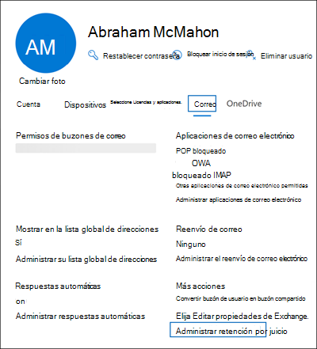

# <a name="create-a-litigation-hold"></a>Crear una retención por juicio

Puede colocar un buzón en retención por juicio para conservar todo el contenido del buzón, incluidos los elementos eliminados y las versiones originales de los elementos modificados. Al colocar un buzón de usuario en retención por juicio, también se conserva el contenido del buzón de archivo del usuario (si está habilitado). Al crear una retención, puede especificar una duración de retención (también denominada retención basada en *tiempo)* para que los elementos eliminados y modificados se conserven durante un período especificado y, a continuación, se eliminen permanentemente del buzón. O puede conservar el contenido indefinidamente (denominado retención *infinita)* o hasta que se quite la retención por juicio. Si especifica un período de duración de retención, se calcula a partir de la fecha en que se recibe un mensaje o se crea un elemento de buzón. 
  
Esto es lo que sucede al crear una retención por juicio.
  
- Los elementos eliminados permanentemente por el usuario se conservan en la carpeta Elementos recuperables del buzón del usuario durante la conservación.

- Los elementos que el usuario purga de la carpeta Elementos recuperables se conservan durante la conservación.

- La cuota de almacenamiento de la carpeta Elementos recuperables aumenta de 30 GB a 110 GB.

- Los elementos de los buzones de correo principal y de archivo del usuario se conservan

## <a name="assign-an-exchange-online-plan-2-license"></a>Asignar una licencia Exchange Online plan 2

Para colocar un buzón Exchange Online en retención por juicio, se debe asignar una licencia Exchange Online plan 2. Si a un buzón se le asigna una Exchange Online de plan 1, tendría que asignarle una licencia de Archivado de Exchange Online para ponerla en espera.

> [!NOTE]
> Para Office 365 Educación, la retención por juicio se admite en Office 365 A1 suscripciones, que incluyen una Exchange Online del Plan 1 con características adicionales. Para obtener más información, vea la sección "Exchange Online características" en la [Office 365 Educación descripción del servicio](/office365/servicedescriptions/office-365-platform-service-description/office-365-education#exchange-online-features).

## <a name="place-a-mailbox-on-litigation-hold"></a>Colocar un buzón en retención por juicio

Estos son los pasos para colocar un buzón en retención por juicio mediante el Centro de administración de Microsoft 365.

1. Vaya a <https://admin.microsoft.com> e inicie sesión.

2. En el panel de navegación del Centro de administración, haga clic **en Usuarios**  >  <a href="https://go.microsoft.com/fwlink/p/?linkid=834822" target="_blank">**usuarios activos.**</a>

3. Seleccione el usuario que desea colocar en retención por juicio.

4. En la página desplegable propiedades, haga clic en la pestaña **Correo** y, a continuación, en **Más** acciones, haga clic **en Administrar retención por juicio.**

   

5. En la **página Administrar** suspensión  por juicio, active la casilla Activar retención por juicio y, a continuación, escriba la siguiente información opcional:

    1. **Duración de retención (días):** use este cuadro para crear una retención basada en tiempo y especificar cuánto tiempo se mantienen los elementos del buzón cuando el buzón se coloca en retención por juicio. La duración se calcula desde la fecha en que un elemento de buzón se recibe o se crea. Cuando la duración de retención expire para un elemento específico, ese elemento ya no se conservará. Si deja este cuadro en blanco, los elementos se conservan indefinidamente o hasta que se quita la retención. Use días para especificar la duración.

    2. **Nota visible para el usuario:** use este cuadro para informar al usuario de que su buzón está en retención por juicio. La nota aparecerá en la página Información de la cuenta en el buzón del usuario si está usando Outlook 2010 o posterior. Para obtener acceso a esta página, los usuarios pueden hacer clic **en Archivo** en Outlook.

    3. **Página web con más información para el** usuario: Use este cuadro para dirigir al usuario a un sitio web para obtener más información acerca de la retención por juicio. Esta dirección URL aparece en la página Información de la cuenta en el buzón del usuario si usa Outlook 2010 o posterior. Para obtener acceso a esta página, los usuarios pueden hacer clic **en Archivo** en Outlook.

6. Haga **clic en Guardar cambios** en la **página** desplegable Retención por juicio para crear la suspensión.

   El sistema muestra un banner que indica que el cambio puede tardar hasta 240 minutos en tener efecto.

### <a name="create-a-litigation-hold-using-powershell"></a>Crear una retención por juicio con PowerShell

También puede crear una retención por juicio ejecutando el siguiente comando en [Exchange Online PowerShell](/powershell/exchange/connect-to-exchange-online-powershell):

```powershell
Set-Mailbox <username> -LitigationHoldEnabled $true
```

El comando anterior conserva los elementos indefinidamente porque no se especifica la duración de la retención. Para crear una retención basada en tiempo, use el siguiente comando:

```powershell
Set-Mailbox <username> -LitigationHoldEnabled $true -LitigationHoldDuration <number of days>
```

También puede ejecutar el siguiente comando para comprobar si el buzón está en retención por juicio:

```powershell
Get-Mailbox <username> | FL LitigationHoldEnabled
```

Un valor de *True* indica que el buzón está en retención por juicio/

Para obtener más información, vea [Set-Mailbox](/powershell/module/exchange/set-mailbox).

## <a name="how-does-litigation-hold-work"></a>¿Cómo funciona la retención por juicio?

En el flujo de trabajo normal de eliminación de elementos, se mueve un elemento de buzón a la subcarpeta Eliminaciones en la carpeta Elementos recuperables cuando un usuario lo elimina de forma permanente (Mayús + Suprimir) o lo elimina de la carpeta Elementos eliminados. Una directiva de retención (que es una etiqueta de retención configurada con una acción de Eliminar retención) también mueve elementos de la subcarpeta Eliminaciones cuando expira el período de retención. Cuando un usuario purga un elemento en la carpeta Elementos recuperables, o bien si expira el período de retención de elementos eliminados de un elemento, este se mueve a la subcarpeta Depuraciones de la carpeta Elementos recuperables y se marca para su eliminación permanente. Se eliminará de Exchange la próxima vez que el Asistente para carpeta administrada (MFA) procese el buzón de correo.

Cuando un buzón se coloca en retención por juicio, los elementos de la subcarpeta Purgas se conservan durante la duración de retención especificada por la retención por juicio. La duración de la retención se calcula a partir de la fecha original en que se ha recibido o creado un elemento, y define el tiempo que se retienen los elementos en la subcarpeta Depuraciones. Cuando expira la duración de retención de un elemento en la subcarpeta Depuraciones, el elemento se marca para su eliminación permanente y se eliminará de Exchange la próxima vez que el MFA procese el buzón de correo. Si se retiene de forma indefinida un buzón de correo, los elementos nunca se eliminarán de la subcarpeta Depuraciones.

En la ilustración siguiente se muestran las subcarpetas en las carpetas Elementos recuperables y el proceso de flujo de trabajo de retención.


> [!NOTE]
> Si se coloca una retención asociada a un caso de exhibición de documentos electrónicos en un buzón, los elementos purgados se mueven de la subcarpeta Eliminaciones a la subcarpeta DiscoveryHolds y se conservan hasta que el buzón se libera de la retención de exhibición de documentos electrónicos.
