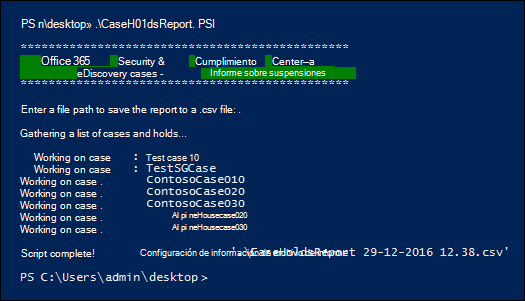

# <a name="create-a-report-on-holds-in-ediscovery-cases"></a>Crear un informe de suspensiones en casos de eDiscovery

El script de este artículo permite a los administradores de exhibición de documentos electrónicos y a los administradores de exhibición de documentos electrónicos generar un informe que contenga información sobre todas las retenciones asociadas con casos de exhibición de documentos electrónicos en el centro de cumplimiento en Office 365 o Microsoft 365. El informe contiene información como el nombre del caso al que está asociada una retención, las ubicaciones de contenido que se colocan en espera y si la retención está basada en consultas. Si hay casos que no tienen ninguna retención, el script creará un informe adicional con una lista de casos sin retenciones.

Vea la [sección Más información](#more-information) para obtener una descripción detallada de la información incluida en el informe.

## <a name="admin-requirements-and-script-information"></a>Requisitos de administración e información de script

- Para generar un informe sobre todos los casos de exhibición de documentos electrónicos de la organización, debe ser administrador de exhibición de documentos electrónicos en la organización. Si es administrador de exhibición de documentos electrónicos, el informe solo incluirá información sobre los casos a los que puede tener acceso. Para obtener más información acerca de los permisos de exhibición de documentos electrónicos, vea [Asignar permisos de exhibición de documentos electrónicos.](assign-ediscovery-permissions.md)

- El script de este artículo tiene un control de errores mínimo. El objetivo principal es crear rápidamente un informe sobre las retenciones asociadas a los casos de exhibición de documentos electrónicos de la organización.

- Los scripts de ejemplo que se proporcionan en este tema no son compatibles con ningún servicio o programa de soporte técnico estándar de Microsoft. Los scripts de ejemplo se proporcionan tal cual, sin garantía de ningún tipo. Además, Microsoft se exime de todas las garantías implícitas, incluidas (sin limitación) las garantías implícitas de comerciabilidad o idoneidad para un propósito específico. El usuario asume todos los riesgos derivados del uso o del rendimiento de los scripts de ejemplo y la documentación. Microsoft, sus autores o cualquier persona relacionada con la creación, producción o entrega de los scripts no serán en ningún caso responsables de cualesquiera daños (incluidos, sin limitación, los daños producidos por la pérdida de beneficios comerciales, interrupción de la actividad comercial, pérdida de información empresarial u otras pérdidas económicas) derivados del uso o de la imposibilidad de uso de los scripts de ejemplo o la documentación, incluso aunque Microsoft tenga constancia de la posibilidad de que dichos daños se produzcan.

## <a name="step-1-connect-to-the-security--compliance-center-powershell"></a>Paso 1: Conectar PowerShell del Centro de & seguridad

El siguiente paso es conectarse al PowerShell del Centro de seguridad y cumplimiento de la organización. Para obtener instrucciones paso a paso, vea [Conectarse al PowerShell del Centro de seguridad y cumplimiento](/powershell/exchange/connect-to-scc-powershell).

## <a name="step-2-run-the-script-to-report-on-holds-associated-with-ediscovery-cases"></a>Paso 2: Ejecutar el script para informar sobre las retenciones asociadas con casos de exhibición de documentos electrónicos

Después de conectarse a PowerShell del Centro de seguridad & cumplimiento, el siguiente paso es crear y ejecutar el script que recopila información sobre los casos de exhibición de documentos electrónicos en su organización.

1. Guarde el texto siguiente en un archivo Windows PowerShell script mediante un sufijo de nombre de archivo de .ps1; por ejemplo, CaseHoldsReport.ps1.

   ```powershell
   #script begin
   " "
   write-host "***********************************************"
   write-host "   Security & Compliance Center   " -foregroundColor yellow -backgroundcolor darkgreen
   write-host "        eDiscovery cases - Holds report         " -foregroundColor yellow -backgroundcolor darkgreen
   write-host "***********************************************"
   " "
   #prompt users to specify a path to store the output files
   $time=get-date
   $Path = Read-Host 'Enter a file path to save the report to a .csv file'
   $outputpath=$Path+'\'+'CaseHoldsReport'+' '+$time.day+'-'+$time.month+'-'+$time.year+' '+$time.hour+'.'+$time.minute+'.csv'
   $noholdsfilepath=$Path+'\'+'CaseswithNoHolds'+' '+$time.day+'-'+$time.month+'-'+$time.year+' '+$time.hour+'.'+$time.minute+'.csv'
   #add case details to the csv file
   function add-tocasereport{
   Param([string]$casename,
   [String]$casestatus,
   [datetime]$casecreatedtime,
   [string]$casemembers,
   [datetime]$caseClosedDateTime,
   [string]$caseclosedby,
   [string]$holdname,
   [String]$Holdenabled,
   [string]$holdcreatedby,
   [string]$holdlastmodifiedby,
   [string]$ExchangeLocation,
   [string]$sharePointlocation,
   [string]$ContentMatchQuery,
   [datetime]$holdcreatedtime,
   [datetime]$holdchangedtime
   )
   $addRow = New-Object PSObject
   Add-Member -InputObject $addRow -MemberType NoteProperty -Name "Case name" -Value $casename
   Add-Member -InputObject $addRow -MemberType NoteProperty -Name "Case status" -Value $casestatus
   Add-Member -InputObject $addRow -MemberType NoteProperty -Name "Case members" -Value $casemembers
   Add-Member -InputObject $addRow -MemberType NoteProperty -Name "Case created time" -Value $casecreatedtime
   Add-Member -InputObject $addRow -MemberType NoteProperty -Name "Case closed time" -Value $caseClosedDateTime
   Add-Member -InputObject $addRow -MemberType NoteProperty -Name "Case closed by" -Value $caseclosedby
   Add-Member -InputObject $addRow -MemberType NoteProperty -Name "Hold name" -Value $holdname
   Add-Member -InputObject $addRow -MemberType NoteProperty -Name "Hold enabled" -Value $Holdenabled
   Add-Member -InputObject $addRow -MemberType NoteProperty -Name "Hold created by" -Value $holdcreatedby
   Add-Member -InputObject $addRow -MemberType NoteProperty -Name "Hold last changed by" -Value $holdlastmodifiedby
   Add-Member -InputObject $addRow -MemberType NoteProperty -Name "Exchange locations" -Value  $ExchangeLocation
   Add-Member -InputObject $addRow -MemberType NoteProperty -Name "SharePoint locations" -Value $sharePointlocation
   Add-Member -InputObject $addRow -MemberType NoteProperty -Name "Hold query" -Value $ContentMatchQuery
   Add-Member -InputObject $addRow -MemberType NoteProperty -Name "Hold created time (UTC)" -Value $holdcreatedtime
   Add-Member -InputObject $addRow -MemberType NoteProperty -Name "Hold changed time (UTC)" -Value $holdchangedtime
   $allholdreport = $addRow | Select-Object "Case name","Case status","Hold name","Hold enabled","Case members", "Case created time","Case closed time","Case closed by","Exchange locations","SharePoint locations","Hold query","Hold created by","Hold created time (UTC)","Hold last changed by","Hold changed time (UTC)"
   $allholdreport | export-csv -path $outputPath -notypeinfo -append -Encoding ascii
   }
   #get information on the cases and pass values to the case report function
   " "
   write-host "Gathering a list of cases and holds..."
   " "
   $edc =Get-ComplianceCase -ErrorAction SilentlyContinue
   foreach($cc in $edc)
   {
   write-host "Working on case :" $cc.name
   if($cc.status -eq 'Closed')
   {
   $cmembers = ((Get-ComplianceCaseMember -Case $cc.name).windowsLiveID)-join ';'
   add-tocasereport -casename $cc.name -casestatus $cc.Status -caseclosedby $cc.closedby -caseClosedDateTime $cc.ClosedDateTime -casemembers $cmembers
   }
   else{
   $cmembers = ((Get-ComplianceCaseMember -Case $cc.name).windowsLiveID)-join ';'
   $policies = Get-CaseHoldPolicy -Case $cc.Name | %{ Get-CaseHoldPolicy $_.Name -Case $_.CaseId -DistributionDetail}
   if ($policies -ne $NULL)
   {
   foreach ($policy in $policies)
   {
   $rule=Get-CaseHoldRule -Policy $policy.name
   add-tocasereport -casename $cc.name -casemembers $cmembers -casestatus $cc.Status -casecreatedtime $cc.CreatedDateTime -holdname $policy.name -holdenabled $policy.enabled -holdcreatedby $policy.CreatedBy -holdlastmodifiedby $policy.LastModifiedBy -ExchangeLocation (($policy.exchangelocation.name)-join ';') -SharePointLocation (($policy.sharePointlocation.name)-join ';') -ContentMatchQuery $rule.ContentMatchQuery -holdcreatedtime $policy.WhenCreatedUTC -holdchangedtime $policy.WhenChangedUTC
   }
   }
   else{
   write-host "No hold policies found in case:" $cc.name -foregroundColor 'Yellow'
   " "
   [string]$cc.name | out-file -filepath $noholdsfilepath -append
   }
   }
   }

   " "
   Write-host "Script complete! Report files saved to this folder: '$Path'"
   " "
   #script end
   ```

2. En la Windows PowerShell que se abrió en el paso 1, vaya a la carpeta donde guardó el script.

3. Ejecute el script; por ejemplo:

   ```powershell
   .\CaseHoldsReport.ps1
   ```

   El script pedirá una carpeta de destino en la que guardar el informe.

4. Escriba el nombre de ruta de acceso completa de la carpeta en la que se guardará el informe y, a continuación, presione **Entrar**.

   > [!TIP]
   > Para guardar el informe en la misma carpeta en la que se encuentra el script, escriba un punto (".") cuando se le pida una carpeta de destino. Para guardar el informe en una subcarpeta de la carpeta donde se encuentra el script, simplemente escriba el nombre de la subcarpeta.

   El script comienza a recopilar información sobre todos los casos de exhibición de documentos electrónicos de la organización. No obtenga acceso al archivo de informe mientras se ejecuta el script. Una vez completado el script, se muestra un mensaje de confirmación en la Windows PowerShell sesión. Después de mostrar este mensaje, puede obtener acceso al informe en la carpeta especificada en el paso 4. El nombre de archivo del informe es `CaseHoldsReport<DateTimeStamp>.csv` .

   Además, el script también crea un informe con una lista de casos que no tienen ninguna retención. El nombre de archivo de este informe es `CaseswithNoHolds<DateTimeStamp>.csv` .

   Este es un ejemplo de ejecución del CaseHoldsReport.ps1 script.

   

## <a name="more-information"></a>Más información

El informe de casos que se crea al ejecutar el script de este artículo contiene la siguiente información sobre cada retención. Como se ha explicado anteriormente, debe ser un administrador de exhibición de documentos electrónicos para devolver información de todas las retenciones de la organización. Para obtener más información acerca de las retenciones de casos, vea [casos de exhibición de documentos electrónicos](./get-started-core-ediscovery.md).

- El nombre de la retención y el nombre del caso de exhibición de documentos electrónicos al que está asociada la retención.

- Si el caso de exhibición de documentos electrónicos está activo o cerrado.

- Si la retención está habilitada o deshabilitada.

- Los miembros del caso de exhibición de documentos electrónicos con los que está asociada la retención. Los miembros del caso pueden ver o administrar un caso, en función de los permisos de exhibición de documentos electrónicos que se hayan asignado.

- La hora y la fecha en que se creó el caso.

- Si se cierra un caso, la persona que lo cerró y la hora y la fecha en que se cerró.

- Los Exchange buzones de correo y SharePoint de sitios que están en espera.

- Si la retención está basada en consultas, la sintaxis de consulta.

- La hora y la fecha en que se creó la retención y la persona que la creó.

- La hora y la fecha en que se cambió por última vez la retención y la persona que la cambió.