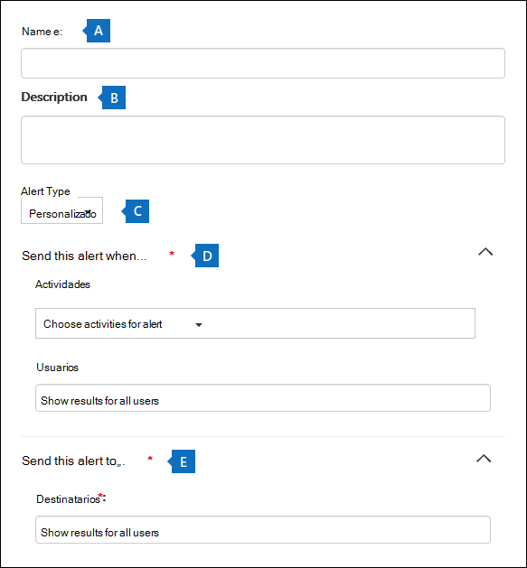
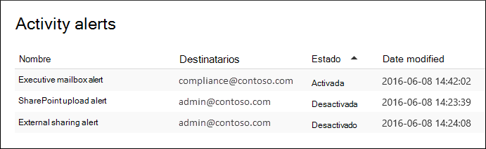

# Crear alertas de actividadCreate activity alerts

Puede crear una alerta de actividad que le enviará una notificación por correo electrónico cuando los usuarios realicen actividades específicas en Office 365.You can create an activity alert that will send you an email notification when users perform specific activities in Office 365. Las alertas de actividad son similares a la búsqueda de eventos en el registro de auditoría, excepto que se te enviará un mensaje de correo electrónico cuando se produce un evento para una actividad para la que has creado una alerta.Activity alerts are similar to searching for events in the audit log, except that you'll be sent an email message when an event for an activity that you've created an alert for happens. 
  
 **¿Por qué usar alertas de actividad en lugar de buscar en el registro de auditoría?****Why use activity alerts instead of searching the audit log?** Puede haber ciertos tipos de actividad o actividad realizadas por usuarios específicos que realmente quieras conocer.There might be certain kinds of activity or activity performed by specific users that you really want to know about. En lugar de tener que recordar buscar en el registro de auditoría esas actividades, puede usar alertas de actividad para Microsoft 365 enviar un mensaje de correo electrónico cuando los usuarios realizan esas actividades.Instead of having to remember to search the audit log for those activities, you can use activity alerts to have Microsoft 365 send you an email message when users perform those activities. Por ejemplo, puede crear una alerta de actividad para notificarle cuándo un usuario elimina archivos en SharePoint o puede crear una alerta para notificarle cuando un usuario elimina permanentemente mensajes de su buzón.For example, you can create an activity alert to notify you when a user deletes files in SharePoint or you can create an alert to notify you when a user permanently deletes messages from their mailbox. La notificación de correo electrónico que se le envió incluye información sobre qué actividad se realizó y el usuario que la realizó.The email notification sent to you includes information about which activity was performed and the user who performed it.

> [!NOTE]
> Las alertas de actividad están en desuso.Activity alerts are being deprecated. Se recomienda empezar a usar directivas de alerta en el centro de seguridad y cumplimiento en lugar de crear nuevas alertas de actividad.We recommend that you start using alert policies in the security and compliance center instead of creating new activity alerts. Las directivas de alertas proporcionan funciones adicionales, como la capacidad de crear una directiva de  alerta que desencadena una alerta cuando un usuario realiza una actividad especificada y muestra alertas en la página Ver alertas en el Centro de seguridad y cumplimiento.Alert policies provide addition functionality such as the ability to create an alert policy that triggers an alert when any user performs a specified activity, and displaying alerts on the **View alerts** page in the security and compliance center. Para obtener más información, vea [Directivas de alerta](alert-policies.md).For more information, see [Alert policies](alert-policies.md).
  
## Confirmar roles y configurar el registro de auditoríaConfirm roles and configure audit logging

- Debe tener asignado el rol Configuración de la organización en el Centro de seguridad & cumplimiento para administrar alertas de actividad.You must be assigned the Organization Configuration role in the Security & Compliance Center to manage activity alerts. De forma predeterminada, este rol se asigna a los grupos de roles Administrador de cumplimiento y Administración de la organización.By default, this role is assigned to the Compliance Administrator and Organization Management role groups. Para obtener más información acerca de cómo agregar miembros a grupos de roles, vea Dar acceso a los usuarios al Centro de [seguridad & cumplimiento](../security/defender-365-security/grant-access-to-the-security-and-compliance-center.md).For more information about adding members to role groups, see [Give users access to the Security & Compliance Center](../security/defender-365-security/grant-access-to-the-security-and-compliance-center.md).
    
- Usted (u otro administrador) primero debe activar el registro de auditoría para su organización antes de poder empezar a usar alertas de actividad.You (or another admin) must first turn on audit logging for your organization before you can start using activity alerts. Para ello, solo tienes que hacer clic **en Iniciar la grabación de** la actividad de usuario y administrador en la página **Alertas de** actividad.To do this, just click **Start recording user and admin activity** on the **Activity alerts** page. (Si no ve este vínculo, la auditoría ya se ha activado para su organización). También puede activar la auditoría  en la página Búsqueda del registro de auditoría en el Centro de seguridad y & cumplimiento (vaya a **Búsqueda** de registro \> **de auditoría de búsqueda).**(If you don't see this link, auditing has already been turned on for your organization.) You can also turn on auditing on the **Audit log search** page in the Security & Compliance Center (go to **Search** \> **Audit log search**). Solo tiene que hacerlo una vez para su organización.You only have to do this once for your organization.
  
- Puede crear alertas para las mismas actividades que puede buscar en el registro de auditoría.You can create alerts for the same activities that you can search for in the audit log. Consulta la [sección Más información](#more-information) para obtener una lista de escenarios comunes (y la actividad específica que se va a supervisar) para la que puedes crear alertas.See the [More information](#more-information) section for a list of common scenarios (and the specific activity to monitor) that you can create alerts for. 
    
- Puede usar la página **Alertas de** actividad del Centro de seguridad y cumplimiento de & para crear alertas solo para la actividad realizada por los usuarios que aparecen en la libreta de direcciones de su organización.You can use the **Activity alerts** page in the Security & Compliance Center to create alerts only for activity performed by users who are listed in your organization's address book. No puede usar esta página para crear alertas de actividad realizadas por usuarios externos que no aparecen en la libreta de direcciones.You can't use this page to create alerts for activity performed by external users who aren't listed in the address book. 
    
## Crear una alerta de actividadCreate an activity alert

1. Vaya a [https://protection.office.com/managealerts](https://protection.office.com/managealerts).Go to [https://protection.office.com/managealerts](https://protection.office.com/managealerts).
    
2. Inicie sesión con su cuenta profesional o educativa.Sign in using your work or school account.
    
3. En la **página Alertas de** actividad, haga clic  **Nuevo**.On the **Activity alerts** page, click  **New**.

   Se muestra la página desplegable para crear una alerta de actividad.The flyout page to create an activity alert is displayed.

    
    
  
4. Complete los siguientes campos para crear una alerta de actividad:Complete the following fields to create an activity alert:
    
    a.a. **Nombre:** escriba un nombre para la alerta.**Name** - Type a name for the alert. Los nombres de alerta deben ser únicos en la organización.Alert names must be unique within your organization.
    
    b.b. **Descripción** (opcional): describa la alerta, como las actividades y los usuarios a los que se realiza un seguimiento, y los usuarios a los que se envían las notificaciones por correo electrónico.**Description** (Optional) - Describe the alert, such as the activities and users being tracked, and the users that email notifications are sent to. Las descripciones proporcionan una forma rápida y sencilla de describir el propósito de la alerta a otros administradores.Descriptions provide a quick and easy way to describe the purpose of the alert to other admins.
    
    c.c. **Tipo de alerta:** asegúrese de que **la opción** Personalizado está seleccionada.**Alert type** - Make sure the **Custom** option is selected. 

    d.d. **Enviar esta alerta cuando:** haga clic **en Enviar esta alerta cuando** y, a continuación, configure estos dos campos:**Send this alert when** - Click **Send this alert when** and then configure these two fields:
    
    - **Actividades:** haga clic en la lista desplegable para mostrar las actividades para las que puede crear una alerta.**Activities** - Click the drop-down list to display the activities that you can create an alert for. Esta es la misma lista de actividades que se muestra al buscar en el registro de auditoría.This is the same activities list that's displayed when you search the audit log. Puede seleccionar una o más actividades específicas o hacer clic en el nombre del grupo de actividades para seleccionar todas las actividades del grupo.You can select one or more specific activities or you can click the activity group name to select all activities in the group. Para obtener una descripción de estas actividades, vea la sección "Actividades auditadas" [en Buscar en el registro de auditoría.](search-the-audit-log-in-security-and-compliance.md#audited-activities)For a description of these activities, see the "Audited activities" section in [Search the audit log](search-the-audit-log-in-security-and-compliance.md#audited-activities). Cuando un usuario realiza cualquiera de las actividades que ha agregado a la alerta, se envía una notificación por correo electrónico.When a user performs any of the activities that you've added to the alert, an email notification is sent. 
    
     - **Usuarios:** haga clic en este cuadro y, a continuación, seleccione uno o varios usuarios.**Users** - Click this box and then select one or more users. Si los usuarios de este cuadro realizan las  actividades que agregó al cuadro Actividades, se enviará una alerta.If the users in this box perform the activities that you added to the **Activities** box, an alert will be sent. Deje el **cuadro Usuarios** en blanco para enviar una alerta cuando cualquier usuario de la organización realice las actividades especificadas por la alerta.Leave the **Users** box blank to send an alert when any user in your organization performs the activities specified by the alert. 

    e.e. Enviar esta alerta  **a:** haga clic en  Enviar esta alerta y, a continuación, haga clic en el cuadro Destinatarios y escriba un nombre para  agregar un usuario que recibirá una notificación por correo electrónico cuando un usuario (especificado en el cuadro Usuarios) realice una actividad (especificada en el cuadro Actividades). **Send this alert to** - Click **Send this alert**, and then click in the **Recipients** box and type a name to add a users who will receive an email notification when a user (specified in the **Users** box) performs an activity (specified in the **Activities** box). Tenga en cuenta que se le agrega a la lista de destinatarios de forma predeterminada.Note that you are added to the list of recipients by default. Puede quitar el nombre de esta lista.You can remove your name from this list.
    
5. Haga **clic en Guardar** para crear la alerta.Click **Save** to create the alert. 
    
    La nueva alerta se muestra en la lista de la página **Alertas de** actividad.The new alert is displayed in the list on the **Activity alerts** page. 
    
    
  
    El estado de la alerta se establece en **On**.The status of the alert is set to **On**. Tenga en cuenta que también aparecen los destinatarios que recibirán una notificación por correo electrónico cuando se envíe una alerta.Note that the recipients who will received an email notification when an alert is sent are also listed. 
  
## Desactivar una alerta de actividadTurn off an activity alert

Puedes desactivar una alerta de actividad para que no se envíe una notificación por correo electrónico.You can turn off an activity alert so that an email notification isn't sent. Después de desactivar la alerta de actividad, aún se muestra en la lista de alertas de actividad de la organización y aún puede ver sus propiedades.After you turn off the activity alert, it's still displayed in the list of activity alerts for your organization, and you can still view its properties.
  
1. Vaya a Ir a [https://protection.office.com/managealerts](https://protection.office.com/managealerts) .Go to Go to [https://protection.office.com/managealerts](https://protection.office.com/managealerts).
    
2. Inicie sesión con su cuenta profesional o educativa.Sign in using your work or school account.
    
3. En la lista de alertas de actividad de su organización, haga clic en la alerta que desea desactivar.In the list of activity alerts for your organization, click the alert that you want to turn off.
    
4. En la **página Editar alerta,** haga clic en el modificador **de** alternancia Activar para cambiar el estado a **Desactivado** y, a continuación, haga clic en **Guardar**.On the **Edit alert** page, click the **On** toggle switch to change the status to **Off**, and then click **Save**.
    
    El estado de la alerta en las páginas **Alertas de** actividad está establecido en **Desactivado**.The status of the alert on the **Activity alerts** pages is set to **Off**. 
    
Para volver a activar una alerta de actividad, repita estos pasos y haga clic en el modificador de **alternancia** Desactivar para cambiar el estado a **On**.To turn an activity alert back on, just repeat these steps and click the **Off** toggle switch to change the status to **On**.
  
## Más informaciónMore information

- Este es un ejemplo de la notificación de correo electrónico que se envía a los usuarios que  se especifican en el campo Enviar esta alerta a (y que aparece en Destinatarios en la página **Alertas** de actividad) en el Centro de seguridad & cumplimiento.Here's an example of the email notification that is sent to the users that are specified in the Sent this alert to field (and listed under **Recipients** on the **Activity alerts** page ) in the Security & Compliance Center. 
    
    
  
- Estas son algunas actividades comunes de documentos y correo electrónico para las que puede crear alertas de actividad.Here's are some common document and email activities that you can create an activity alerts for. Las tablas describen la actividad, el nombre de la actividad para la que se va a  crear una alerta y el nombre del grupo de actividades en el que se muestra la actividad en la lista desplegable Actividades.The tables describes the activity, the name of the activity to create an alert for, and the name of the activity group that the activity is listed under in the **Activities** drop-down list. Para ver una lista completa de las actividades para las que puede crear alertas de actividad, consulte la sección "Actividades auditadas" en [Buscar en el registro de auditoría.](search-the-audit-log-in-security-and-compliance.md#audited-activities)To see a complete list of the activities that you can create activity alerts for, see the "Audited activities" section in [Search the audit log](search-the-audit-log-in-security-and-compliance.md#audited-activities).
    
    > [!TIP]
    > Es posible que desee crear una alerta de actividad para una sola actividad que realice cualquier usuario.You might want to create an activity alert for just one activity that's performed by any user. O puede que desee crear una alerta de actividad que realice un seguimiento de varias actividades realizadas por uno o varios usuarios.Or you might want to create an activity alert that track multiple activities performed by one or mores users. 
  
    En la tabla siguiente se enumeran algunas actividades comunes relacionadas con documentos SharePoint o OneDrive para la Empresa.The following table lists some common document-related activities in SharePoint or OneDrive for Business.
    
    |**Cuando un usuario hace esto...****When a user does this...**|**Crear una alerta para esta actividad****Create an alert for this activity**|**Grupo de actividades****Activity group**|
    |:-----|:-----|:-----|
    |Ve un documento en un sitio.Views a document on a site.    |Archivo al que se tiene accesoAccessed file    |Actividades de archivos y carpetasFile and folder activities    |
    |Edita o cambia un documento.Edits or changes a document.    |Archivo modificadoModified file    |Actividades de archivos y carpetasFile and folder activities    |
    |Comparte un documento con un usuario fuera de la organización.Shares a document with a user outside of your organization.    |Compartir archivo, carpeta o sitioShare file, folder, or site    AndAnd    Invitación de uso compartido creadaCreated sharing invitation    Para obtener más información, consulte [Usar la auditoría de uso compartido en el registro de auditoría](use-sharing-auditing.md).For more information, see [Use sharing auditing in the audit log](use-sharing-auditing.md).    |Actividades de solicitud de acceso y uso compartidoSharing and access request activities    |
    |Carga o descarga un documento.Uploads or downloads a document.    |Archivo cargadoUploaded file    And/orAnd/or    Archivo descargadoDownloaded file    |Actividades de archivos y carpetasFile and folder activities    |
    |Cambia los permisos de acceso a un sitio.Changes the access permissions to a site.    |Permisos de sitio modificadosModified site permissions    |Actividades de administración del sitioSite administration activities    |

    En la tabla siguiente se enumeran algunas actividades comunes relacionadas con el correo electrónico Exchange Online.The following table lists some common email-related activities in Exchange Online.

    |**Cuando un usuario hace esto...****When a user does this...**|**Crear una alerta para esta actividad****Create an alert for this activity**|**Grupo de actividades****Activity group**|
    |:-----|:-----|:-----|
    |Elimina permanentemente (purga) un mensaje de correo electrónico de su buzón.Permanently deletes (purges) an email message from their mailbox.    |Mensajes purgados del buzónPurged messages from mailbox    | Actividades de buzón de ExchangeExchange mailbox activities    |
    |Envía un mensaje de correo electrónico desde un buzón compartido.Sends an email message from a shared mailbox.    |Mensaje enviado mediante los permisos de Enviar comoSent message using Send As permissions    AndAnd    Mensaje enviado mediante los permisos en nombre deSent message using Send On Behalf permissions    | Actividades de buzón de ExchangeExchange mailbox activities    |
   
- También puede usar los cmdlets **New-ActivityAlert** y **Set-ActivityAlert** en PowerShell del Centro de seguridad & cumplimiento para crear y editar alertas de actividad.You can also use the **New-ActivityAlert** and **Set-ActivityAlert** cmdlets in Security & Compliance Center PowerShell to create and edit activity alerts. Tenga en cuenta lo siguiente si usa estos cmdlets para crear o editar alertas de actividad:Keep the following things in mind if you use these cmdlets to create or edit activity alerts: 
    
  - Si usa un cmdlet para agregar una actividad a la  alerta que no aparece en la lista desplegable Actividades, se muestra un mensaje en la página de propiedades de la alerta que dice: "Esta alerta tiene operaciones personalizadas que no aparecen en el selector".If you use a cmdlet to add an activity to the alert that isn't listed in the **Activities** drop-down list, a message is displayed in on the property page for the alert that says, "This alert has custom operations not listed in the picker." 
    
  - Un buen motivo para usar los cmdlets para crear o editar una alerta de actividad es enviar notificaciones por correo electrónico a alguien fuera de su organización.A good reason to use the cmdlets to create or edit an activity alert is to send email notifications to someone outside of your organization. Este usuario externo aparecerá en la lista de destinatarios de la alerta.This external user will be listed in the list of recipients for the alert. Pero si quita este usuario externo de la alerta, no se puede volver a agregar a la alerta mediante la página **Editar alerta.**But if you remove this external user from the alert, that user can't be re-added to the alert by using the **Edit alert** page. Tendrá que volver a agregar el usuario externo mediante el cmdlet **Set-ActivityAlert** o usar el cmdlet **New-ActivityAlert** para agregar el mismo usuario externo (o diferente) a una nueva alerta.You'll have to re-add the external user using the **Set-ActivityAlert** cmdlet, or use the **New-ActivityAlert** cmdlet to add the same (or different) external user to a new alert. 
