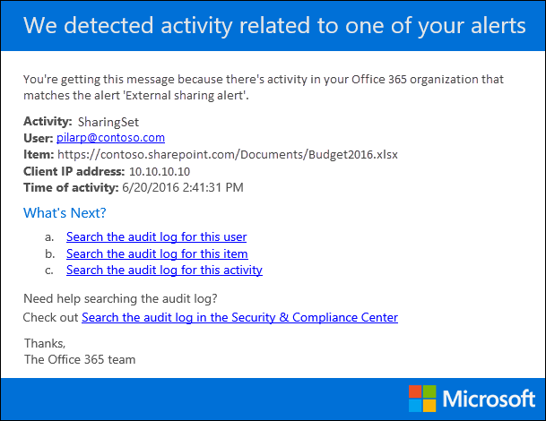

# Creación de alertas de actividad

[!include[Purview banner](../includes/purview-rebrand-banner.md)]

Puede crear una alerta de actividad que le enviará una notificación por correo electrónico cuando los usuarios realicen actividades específicas en Office 365. Las alertas de actividad son similares a la búsqueda de eventos en el registro de auditoría, salvo que se le enviará un mensaje de correo electrónico cuando se produzca un evento para una actividad para la que ha creado una alerta.

 **¿Por qué usar alertas de actividad en lugar de buscar en el registro de auditoría?** Es posible que haya ciertos tipos de actividad o actividad realizadas por usuarios específicos que realmente quiera conocer. En lugar de tener que recordar buscar esas actividades en el registro de auditoría, puede usar alertas de actividad para que Microsoft 365 le envíe un mensaje de correo electrónico cuando los usuarios realicen esas actividades. Por ejemplo, puede crear una alerta de actividad para notificarle cuando un usuario elimina archivos en SharePoint, o bien puede crear una alerta para notificarle cuando un usuario elimina permanentemente los mensajes de su buzón. La notificación por correo electrónico que se le envía incluye información sobre qué actividad se realizó y el usuario que la realizó.

> [!NOTE]
> Las alertas de actividad están en desuso. Se recomienda empezar a usar directivas de alerta en el centro de seguridad y cumplimiento en lugar de crear nuevas alertas de actividad. Las directivas de alerta proporcionan funcionalidad adicional, como la capacidad de crear una directiva de alertas que desencadena una alerta cuando cualquier usuario realiza una actividad especificada, y mostrar alertas en la página **Ver alertas** del Centro de seguridad y cumplimiento. Para obtener más información, consulte [Directivas de alerta](alert-policies.md).

## Confirmación de roles y configuración del registro de auditoría

- Debe tener asignado el rol Configuración de la organización en el portal de cumplimiento de Microsoft Purview para administrar las alertas de actividad. De forma predeterminada, este rol se asigna a los grupos de roles Administrador de cumplimiento y Administración de la organización. Para obtener más información sobre cómo agregar miembros a grupos de roles, consulte [Proporcionar a los usuarios acceso al portal de cumplimiento de Microsoft Purview](../security/office-365-security/grant-access-to-the-security-and-compliance-center.md).

- Usted (u otro administrador) debe activar primero el registro de auditoría de su organización para poder empezar a usar alertas de actividad. Para ello, solo tiene que hacer clic en **Iniciar la grabación de la actividad de usuario y administrador** en la página **Alertas de actividad** . (Si no ve este vínculo, la auditoría ya se ha activado para su organización). También puede activar la auditoría en la página **Búsqueda de registros** de auditoría en el portal de cumplimiento (vaya a **Auditoría**). Solo tiene que hacerlo una vez para su organización.

- Puede crear alertas para las mismas actividades que puede buscar en el registro de auditoría. Consulte la sección [Más información](#more-information) para obtener una lista de escenarios comunes (y la actividad específica para supervisar) para los que puede crear alertas.

- Puede usar la página **Alertas de actividad** en el <a href="https://go.microsoft.com/fwlink/p/?linkid=2077149" target="_blank">portal de cumplimiento</a> para crear alertas solo para la actividad realizada por los usuarios que aparecen en la libreta de direcciones de la organización. No puede usar esta página para crear alertas para las actividades realizadas por usuarios externos que no aparecen en la libreta de direcciones.

## Creación de una alerta de actividad

1. Vaya al <a href="https://go.microsoft.com/fwlink/p/?linkid=2077149" target="_blank">portal de cumplimiento</a>.

2. Inicie sesión con su cuenta profesional o educativa.

3. En la página **Alertas de actividad** , haga clic en  **Nuevo**.

   Se muestra la página de control flotante para crear una alerta de actividad.

    

4. Complete los campos siguientes para crear una alerta de actividad:

    1. **Nombre** : escriba un nombre para la alerta. Los nombres de alerta deben ser únicos dentro de la organización.

    1. **Descripción** (opcional): describa la alerta, como las actividades y los usuarios a los que se realiza el seguimiento y los usuarios a los que se envían las notificaciones por correo electrónico. Las descripciones proporcionan una manera rápida y sencilla de describir el propósito de la alerta a otros administradores.

    1. **Tipo de alerta** : asegúrese de que la opción **Personalizado** está seleccionada.

    1. **Enviar esta alerta cuando** : haga clic en **Enviar esta alerta cuando** y, a continuación, configure estos dos campos:

       - **Actividades** : haga clic en la lista desplegable para mostrar las actividades para las que puede crear una alerta. Esta es la misma lista de actividades que se muestra al buscar en el registro de auditoría. Puede seleccionar una o más actividades específicas, o bien puede hacer clic en el nombre del grupo de actividades para seleccionar todas las actividades del grupo. Para obtener una descripción de estas actividades, consulte la sección "Actividades auditadas" en [Buscar en el registro de auditoría](search-the-audit-log-in-security-and-compliance.md#audited-activities). Cuando un usuario realiza cualquiera de las actividades que ha agregado a la alerta, se envía una notificación por correo electrónico.

       - **Usuarios** : haga clic en este cuadro y, a continuación, seleccione uno o varios usuarios. Si los usuarios de este cuadro realizan las actividades que agregó al cuadro **Actividades** , se enviará una alerta. Deje el cuadro **Usuarios** en blanco para enviar una alerta cuando cualquier usuario de su organización realice las actividades especificadas por la alerta.

    1. **Enviar esta alerta a** : haga clic en **Enviar esta alerta** y, a continuación, haga clic en el cuadro **Destinatarios** y escriba un nombre para agregar usuarios que recibirán una notificación por correo electrónico cuando un usuario (especificado en el cuadro **Usuarios** ) realice una actividad (especificada en el cuadro **Actividades** ). Tenga en cuenta que se agrega a la lista de destinatarios de forma predeterminada. Puede quitar el nombre de esta lista.

5. Haga clic en **Guardar** para crear la alerta.

    La nueva alerta se muestra en la lista de la página **Alertas de actividad** .

    

    El estado de la alerta se establece en **Activado**. Tenga en cuenta que también se muestran los destinatarios que recibirán una notificación por correo electrónico cuando se envíe una alerta.

## Desactivar una alerta de actividad

Puede desactivar una alerta de actividad para que no se envíe una notificación por correo electrónico. Después de desactivar la alerta de actividad, se sigue mostrando en la lista de alertas de actividad de su organización y todavía puede ver sus propiedades.

1. Vaya al <a href="https://go.microsoft.com/fwlink/p/?linkid=2077149" target="_blank">portal de cumplimiento</a>.

2. Inicie sesión con su cuenta profesional o educativa.

3. En la lista de alertas de actividad de su organización, haga clic en la alerta que desea desactivar.

4. En la página **Editar alerta** , haga clic **en el modificador** De alternancia para cambiar el estado a **Desactivado** y, a continuación, haga clic en **Guardar**.

    El estado de la alerta en las páginas **Alertas de actividad** se establece en **Desactivado**.

Para volver a activar una alerta de actividad, repita estos pasos y haga clic en el modificador **desactivar** para cambiar el estado a **Activado**.

## Más información

- Este es un ejemplo de la notificación por correo electrónico que se envía a los usuarios que se especifican en el campo Enviar esta alerta a (y que aparece en **Destinatarios** en la página **Alertas de actividad** ) en el portal de cumplimiento.

    

- Estas son algunas actividades comunes de documentos y correo electrónico para las que puede crear alertas de actividad. En las tablas se describe la actividad, el nombre de la actividad para la que se va a crear una alerta y el nombre del grupo de actividad en el que se muestra la actividad en la lista desplegable **Actividades** . Para ver una lista completa de las actividades para las que puede crear alertas de actividad, consulte la sección "Actividades auditadas" en [Buscar en el registro de auditoría](search-the-audit-log-in-security-and-compliance.md#audited-activities).

    > [!TIP]
    > Es posible que quiera crear una alerta de actividad para una sola actividad que realice cualquier usuario. O bien, es posible que quiera crear una alerta de actividad que realice un seguimiento de varias actividades realizadas por uno o más usuarios.

    En la tabla siguiente se enumeran algunas actividades comunes relacionadas con documentos en SharePoint o OneDrive para la Empresa.

    | Cuando un usuario hace esto... | Creación de una alerta para esta actividad | Grupo de actividades |
    |:-----|:-----|:-----|
    |Visualiza un documento en un sitio.  |Archivo al que se tiene acceso  |Actividades de archivos y carpetas  |
    |Modifica o cambia un documento.  |Archivo modificado  |Actividades de archivos y carpetas  |
    |Comparte un documento con un usuario fuera de la organización.  |Compartir archivo, carpeta o sitio    And    Invitación de uso compartido creada    Para obtener más información, consulte [Usar la auditoría de uso compartido en el registro de auditoría](use-sharing-auditing.md).  |Actividades de solicitud de acceso y uso compartido  |
    |Carga o descarga un documento.  |Archivo cargado    Y/o    Archivo descargado  |Actividades de archivos y carpetas  |
    |Cambia los permisos de acceso a un sitio.  |Permisos de sitio modificados  |Actividades de administración del sitio  |

    En la tabla siguiente se enumeran algunas actividades comunes relacionadas con el correo electrónico en Exchange Online.

    | Cuando un usuario hace esto... | Creación de una alerta para esta actividad | Grupo de actividades |
    |:-----|:-----|:-----|
    |Elimina de forma permanente (purga) un mensaje de correo electrónico de su buzón.  |Mensajes purgados del buzón  | Actividades de buzón de Exchange  |
    |Envía un mensaje de correo electrónico desde un buzón compartido.  |Mensaje enviado mediante los permisos de Enviar como    And    Mensaje enviado mediante los permisos en nombre de  | Actividades de buzón de Exchange  |

- También puede usar los cmdlets **New-ActivityAlert** y **Set-ActivityAlert** en PowerShell security & Compliance Center para crear y editar alertas de actividad. Tenga en cuenta lo siguiente si usa estos cmdlets para crear o editar alertas de actividad:

  - Si usa un cmdlet para agregar una actividad a la alerta que no aparece en la lista desplegable **Actividades** , se muestra un mensaje en la página de propiedades de la alerta que indica: "Esta alerta tiene operaciones personalizadas que no se muestran en el selector".

  - Una buena razón para usar los cmdlets para crear o editar una alerta de actividad es enviar notificaciones por correo electrónico a alguien fuera de la organización. Este usuario externo aparecerá en la lista de destinatarios de la alerta. Pero si quita este usuario externo de la alerta, ese usuario no se puede volver a agregar a la alerta mediante la página **Editar alerta** . Tendrá que volver a agregar el usuario externo mediante el cmdlet **Set-ActivityAlert** o usar el cmdlet **New-ActivityAlert** para agregar el mismo usuario externo (o diferente) a una nueva alerta.
