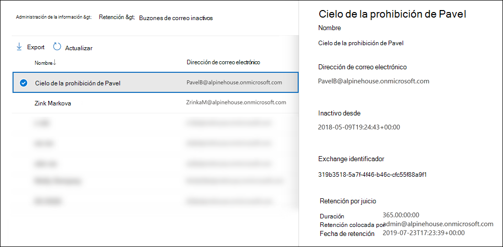

# <a name="create-and-manage-inactive-mailboxes"></a><span data-ttu-id="63761-103">Crear y administrar buzones inactivos</span><span class="sxs-lookup"><span data-stu-id="63761-103">Create and manage inactive mailboxes</span></span>

<span data-ttu-id="63761-104">Microsoft 365 permite conservar el contenido de los buzones eliminados.</span><span class="sxs-lookup"><span data-stu-id="63761-104">Microsoft 365 makes it possible for you to retain the contents of deleted mailboxes.</span></span> <span data-ttu-id="63761-105">Esta característica se denomina [buzones inactivos](inactive-mailboxes-in-office-365.md).</span><span class="sxs-lookup"><span data-stu-id="63761-105">This feature is called [inactive mailboxes](inactive-mailboxes-in-office-365.md).</span></span> <span data-ttu-id="63761-106">Inactive mailboxes allow you to retain former employees' email after they leave your organization.</span><span class="sxs-lookup"><span data-stu-id="63761-106">Inactive mailboxes allow you to retain former employees' email after they leave your organization.</span></span> <span data-ttu-id="63761-107">Un buzón se vuelve inactivo cuando se aplica una retención por juicio o una directiva de retención (creada en el centro de seguridad y cumplimiento en Office 365 o Microsoft 365) al buzón antes de eliminar la cuenta de usuario correspondiente.</span><span class="sxs-lookup"><span data-stu-id="63761-107">A mailbox becomes inactive when a Litigation Hold or a retention policy (created in the security and compliance center in Office 365 or Microsoft 365) is applied to the mailbox before the corresponding user account is deleted.</span></span> <span data-ttu-id="63761-108">The contents of an inactive mailbox are retained for the duration of the hold that was placed on the mailbox before it was made inactive.</span><span class="sxs-lookup"><span data-stu-id="63761-108">The contents of an inactive mailbox are retained for the duration of the hold that was placed on the mailbox before it was made inactive.</span></span> <span data-ttu-id="63761-109">Esto permite a los administradores, responsables de cumplimiento y administradores de registros usar la búsqueda de contenido para buscar y exportar el contenido de un buzón inactivo.</span><span class="sxs-lookup"><span data-stu-id="63761-109">This allows administrators, compliance officers, and records managers to use Content Search to search and export the contents of an inactive mailbox.</span></span> <span data-ttu-id="63761-110">Los buzones inactivos no pueden recibir correo electrónico y no se muestran en la libreta de direcciones compartida de su organización ni en otras listas.</span><span class="sxs-lookup"><span data-stu-id="63761-110">Inactive mailboxes can't receive email and aren't displayed in your organization's shared address book or other lists.</span></span>
  
> [!IMPORTANT]
> <span data-ttu-id="63761-111">A medida que seguimos invirtiendo de diferentes maneras para conservar el contenido del buzón, estamos anunciando la retirada de las In-Place en el centro Exchange administración.</span><span class="sxs-lookup"><span data-stu-id="63761-111">As we continue to invest in different ways to preserve mailbox content, we're announcing the retirement of In-Place Holds in the Exchange admin center.</span></span> <span data-ttu-id="63761-112">Esto significa que debe usar las directivas de retención y retención por juicio para crear un buzón inactivo.</span><span class="sxs-lookup"><span data-stu-id="63761-112">That means you should use Litigation Holds and retention policies to create an inactive mailbox.</span></span> <span data-ttu-id="63761-113">A partir del 1 de julio de 2020 no podrá crear nuevas retenciones In-Place en Exchange Online.</span><span class="sxs-lookup"><span data-stu-id="63761-113">Starting July 1, 2020 you won't be able to create new In-Place Holds in Exchange Online.</span></span> <span data-ttu-id="63761-114">Pero aún podrá cambiar la duración de retención de una retención In-Place en un buzón inactivo.</span><span class="sxs-lookup"><span data-stu-id="63761-114">But you'll still be able to change the hold duration of an In-Place Hold placed on an inactive mailbox.</span></span> <span data-ttu-id="63761-115">Sin embargo, a partir del 1 de octubre de 2020, no podrá cambiar la duración de la retención.</span><span class="sxs-lookup"><span data-stu-id="63761-115">However, starting October 1, 2020, you won't be able to change the hold duration.</span></span> <span data-ttu-id="63761-116">Solo podrá eliminar un buzón inactivo quitando la In-Place espera.</span><span class="sxs-lookup"><span data-stu-id="63761-116">You'll only be able to delete an inactive mailbox by removing the In-Place Hold.</span></span> <span data-ttu-id="63761-117">Los buzones inactivos existentes que están en In-Place conservación se conservarán hasta que se quite la retención.</span><span class="sxs-lookup"><span data-stu-id="63761-117">Existing inactive mailboxes that are on In-Place Hold will still be preserved until the hold is removed.</span></span> <span data-ttu-id="63761-118">Para obtener más información acerca de la retirada de In-Place, vea [Retirement of legacy eDiscovery tools](legacy-ediscovery-retirement.md).</span><span class="sxs-lookup"><span data-stu-id="63761-118">For more information about the retirement of In-Place Holds, see [Retirement of legacy eDiscovery tools](legacy-ediscovery-retirement.md).</span></span>
  
## <a name="preparations-before-creating-an-inactive-mailbox"></a><span data-ttu-id="63761-119">Preparativos antes de crear un buzón inactivo</span><span class="sxs-lookup"><span data-stu-id="63761-119">Preparations before creating an inactive mailbox</span></span>

- <span data-ttu-id="63761-120">Para que un buzón esté inactivo, debe tener asignada una licencia del Plan 2 de Exchange Online para que se pueda aplicar una retención por juicio o una directiva de retención al buzón antes de eliminarla.</span><span class="sxs-lookup"><span data-stu-id="63761-120">To make a mailbox inactive, it must be assigned an Exchange Online Plan 2 license so that a Litigation Hold or a retention policy can be applied to the mailbox before it's deleted.</span></span> <span data-ttu-id="63761-121">Exchange Online Las licencias del plan 2 forman parte de una Office 365 Enterprise de E3 y E5.</span><span class="sxs-lookup"><span data-stu-id="63761-121">Exchange Online Plan 2 licenses are part of an Office 365 Enterprise E3 and E5 subscription.</span></span> <span data-ttu-id="63761-122">Si a un buzón se le asigna una licencia de plan 1 o Quiosco de Exchange Online de Exchange Online (que forman parte de una suscripción Office 365 E1 y F1 respectivamente), tendría que asignarle una licencia de Archivado de Exchange Online independiente para que se pueda aplicar una retención al buzón antes de eliminarla.</span><span class="sxs-lookup"><span data-stu-id="63761-122">If a mailbox is assigned an Exchange Online Plan 1 or Exchange Online Kiosk license (which are part of an Office 365 E1 and F1 subscription respectively), you would have to assign it a separate Exchange Online Archiving license so that a hold can be applied to the mailbox before it's deleted.</span></span> <span data-ttu-id="63761-123">Para obtener más información, vea [Archivado de Exchange Online](https://go.microsoft.com/fwlink/p/?LinkId=286153).</span><span class="sxs-lookup"><span data-stu-id="63761-123">For more information, see [Exchange Online Archiving](https://go.microsoft.com/fwlink/p/?LinkId=286153).</span></span>

- <span data-ttu-id="63761-124">Las licencias asociadas con el buzón de Exchange Online eliminado estarán disponibles después de eliminar la cuenta de usuario correspondiente.</span><span class="sxs-lookup"><span data-stu-id="63761-124">The licenses associated with the deleted Exchange Online mailbox will be available after you delete the corresponding user account.</span></span> <span data-ttu-id="63761-125">A [continuación, puede asignar esas licencias a otro usuario](../admin/manage/assign-licenses-to-users.md).</span><span class="sxs-lookup"><span data-stu-id="63761-125">You can then [assign those licenses to another user](../admin/manage/assign-licenses-to-users.md).</span></span>

- <span data-ttu-id="63761-126">Si una retención por juicio o una directiva de retención (configurada para retener o eliminar contenido) no se aplica a un buzón antes de eliminarla, el contenido del buzón no se conservará ni se podrá detectar.</span><span class="sxs-lookup"><span data-stu-id="63761-126">If a Litigation Hold or a retention policy (that's configured to retain or retain and then delete content) isn't applied to a mailbox before it's deleted, the contents of the mailbox won't be retained or discoverable.</span></span> <span data-ttu-id="63761-127">Aun así, el buzón eliminado se puede recuperar en un plazo de 30 días a partir de su eliminación, pero el buzón junto con su contenido se eliminará permanentemente transcurrido dicho plazo, si no se recupera.</span><span class="sxs-lookup"><span data-stu-id="63761-127">However, the deleted mailbox can be recovered within 30 days of deletion, but the mailbox and its contents will be permanently deleted after 30 days if it isn't recovered.</span></span>

- <span data-ttu-id="63761-128">Para obtener más información acerca de la retención por juicio, vea [Retención por juicio](/exchange/security-and-compliance/in-place-and-litigation-holds).</span><span class="sxs-lookup"><span data-stu-id="63761-128">For more information about Litigation Hold, see [Litigation Hold](/exchange/security-and-compliance/in-place-and-litigation-holds).</span></span> <span data-ttu-id="63761-129">Para obtener más información acerca de las directivas de retención, vea [Learn about retention policies and retention labels](retention.md).</span><span class="sxs-lookup"><span data-stu-id="63761-129">For more information about retention policies, see [Learn about retention policies and retention labels](retention.md).</span></span>
  
## <a name="create-an-inactive-mailbox"></a><span data-ttu-id="63761-130">Crear un buzón inactivo</span><span class="sxs-lookup"><span data-stu-id="63761-130">Create an inactive mailbox</span></span>

<span data-ttu-id="63761-131">Hacer inactivo un buzón implica dos pasos: 1) colocar el buzón en retención por juicio o aplicar una directiva de retención y 2) eliminar el buzón o la cuenta de usuario correspondiente.</span><span class="sxs-lookup"><span data-stu-id="63761-131">Making a mailbox inactive involves two steps: 1) placing the mailbox on Litigation Hold or applying a  retention policy to it, and 2) deleting the mailbox or corresponding user account.</span></span> <span data-ttu-id="63761-132">Tras pasar el buzón a inactivo, su contenido se conservará hasta que se quite la retención o la directiva de retención.</span><span class="sxs-lookup"><span data-stu-id="63761-132">After the mailbox is inactive, its contents are retained until the hold or retention policy is removed.</span></span>
  
### <a name="step-1-place-a-mailbox-on-litigation-hold-or-apply-a-retention-policy"></a><span data-ttu-id="63761-133">Paso 1: Colocar un buzón en retención por juicio o aplicar una directiva de retención</span><span class="sxs-lookup"><span data-stu-id="63761-133">Step 1: Place a mailbox on Litigation Hold or apply a retention policy</span></span>

<span data-ttu-id="63761-134">Al colocar un buzón en retención por juicio o aplicar una directiva de retención (que está configurada para retener o conservar y, a continuación, eliminar contenido), se conserva el contenido del buzón antes de eliminarlo.</span><span class="sxs-lookup"><span data-stu-id="63761-134">Placing a mailbox on Litigation Hold or applying a retention policy (that's configured to retain or retain and then delete content) retains the contents in the mailbox before it's deleted.</span></span> <span data-ttu-id="63761-135">Ambos tipos de retenciones conservarán todo el contenido del buzón, incluidos los elementos eliminados y las versiones originales de elementos modificados.</span><span class="sxs-lookup"><span data-stu-id="63761-135">Both types of holds will retain all mailbox content, including deleted items and original versions of modified items.</span></span> <span data-ttu-id="63761-136">Los elementos eliminados y modificados se conservan en el buzón inactivo durante un período de tiempo especificado o hasta que se elimine permanentemente el buzón inactivo mediante la eliminación de la retención o la directiva de retención aplicada a los buzones inactivos.</span><span class="sxs-lookup"><span data-stu-id="63761-136">Deleted and modified items are retained in the inactive mailbox for a specified period, or until you permanently delete the inactive mailbox by removing the hold or retention policy that's applied to the inactive mailbox.</span></span>
  
<span data-ttu-id="63761-137">Si ya se ha colocado una retención en un buzón de correo o si ya se ha aplicado una directiva de retención a un buzón, lo único que tiene que hacer es eliminar la cuenta de usuario correspondiente, como se explica en el paso 2.</span><span class="sxs-lookup"><span data-stu-id="63761-137">If a hold is already placed on a mailbox, or if a retention policy is already applied to a mailbox, then all you have to do is delete the corresponding user account as explained in Step 2.</span></span>
  
<span data-ttu-id="63761-138">Para obtener procedimientos paso a paso para colocar un buzón en retención por juicio o aplicar una directiva de retención, vea:</span><span class="sxs-lookup"><span data-stu-id="63761-138">For step-by-step procedures for placing a mailbox on Litigation Hold or applying a retention policy, see:</span></span>
  
- [<span data-ttu-id="63761-139">Poner un buzón en retención por juicio</span><span class="sxs-lookup"><span data-stu-id="63761-139">Place a mailbox on Litigation Hold</span></span>](create-a-litigation-hold.md)

- [<span data-ttu-id="63761-140">Más información sobre las directivas y las etiquetas de retención</span><span class="sxs-lookup"><span data-stu-id="63761-140">Learn about retention policies and retention labels</span></span>](retention.md)

> [!NOTE]
> <span data-ttu-id="63761-141">Para las directivas de retención y retención por juicio, puede crear una retención indefinida o en una retención basada en tiempo.</span><span class="sxs-lookup"><span data-stu-id="63761-141">For Litigation Holds and retention policies, you can create an indefinite hold or on a time-based hold.</span></span> <span data-ttu-id="63761-142">En una retención indefinida, el contenido del buzón inactivo se conservará siempre, hasta que se elimine la retención o hasta que se cambie la duración de la retención.</span><span class="sxs-lookup"><span data-stu-id="63761-142">In an indefinite hold, the contents of the inactive mailbox will be retained forever, or until the hold is removed or until the hold duration is changed.</span></span> <span data-ttu-id="63761-143">Después de quitar la directiva de retención o retención (suponiendo que el buzón se eliminó hace más de 183 días), el buzón inactivo se marcará para su eliminación permanente y el contenido del buzón ya no se conservará ni se podrá detectar.</span><span class="sxs-lookup"><span data-stu-id="63761-143">After the hold or retention policy is removed (assuming that the mailbox was deleted more than 183 days ago), the inactive mailbox will be marked for permanent deletion and the contents of the mailbox will no longer be retained or discoverable.</span></span> <span data-ttu-id="63761-144">En una directiva de retención o retención basada en tiempo, especifique la duración de la retención.</span><span class="sxs-lookup"><span data-stu-id="63761-144">In a time-based hold or retention policy, you specify the duration of the hold.</span></span> <span data-ttu-id="63761-145">Esta duración se establece para cada elemento, y se calcula a partir de la fecha en que un elemento de buzón se ha recibido o creado.</span><span class="sxs-lookup"><span data-stu-id="63761-145">This duration is on a per-item basis and is calculated from the date a mailbox item was received or created.</span></span> <span data-ttu-id="63761-146">Una vez que ha expirado la retención para un elemento de buzón, y ese elemento se ha movido a la carpeta Elementos recuperables del buzón inactivo o se encuentra en ella, el elemento se elimina permanentemente (purga) del buzón inactivo.</span><span class="sxs-lookup"><span data-stu-id="63761-146">After the hold expires for a mailbox item, and that item moved to or is located in the Recoverable Items folder in the inactive mailbox, the item is permanently deleted (purged) from the inactive mailbox after the deleted item retention period expires.</span></span> 
  
### <a name="step-2-delete-the-mailbox"></a><span data-ttu-id="63761-147">Paso 2: Eliminar el buzón.</span><span class="sxs-lookup"><span data-stu-id="63761-147">Step 2: Delete the mailbox</span></span>

<span data-ttu-id="63761-148">Después de colocar el buzón en espera o de aplicar una directiva de retención, el siguiente paso es eliminar el buzón.</span><span class="sxs-lookup"><span data-stu-id="63761-148">After the mailbox is placed on hold or a retention policy is applied to it, the next step is to delete the mailbox.</span></span> <span data-ttu-id="63761-149">La mejor manera de eliminar un buzón es eliminar la cuenta de usuario correspondiente en el centro de administración Microsoft 365 usuario.</span><span class="sxs-lookup"><span data-stu-id="63761-149">The best way to delete a mailbox is to delete the corresponding user account in the Microsoft 365 admin center.</span></span> <span data-ttu-id="63761-150">Para obtener información sobre cómo eliminar cuentas de usuario, vea [Eliminar un usuario de la organización.](../admin/add-users/delete-a-user.md)</span><span class="sxs-lookup"><span data-stu-id="63761-150">For information about deleting user accounts, see [Delete a user from your organization](../admin/add-users/delete-a-user.md).</span></span>
  
> [!NOTE]
> <span data-ttu-id="63761-151">También puede eliminar el buzón mediante el cmdlet **Remove-Mailbox** en Exchange Online PowerShell.</span><span class="sxs-lookup"><span data-stu-id="63761-151">You can also delete the mailbox by using the **Remove-Mailbox** cmdlet in Exchange Online PowerShell.</span></span> <span data-ttu-id="63761-152">Para obtener más información, vea [Eliminar o restaurar buzones](/exchange/recipients-in-exchange-online/delete-or-restore-mailboxes)de usuario en Exchange Online .</span><span class="sxs-lookup"><span data-stu-id="63761-152">For more information, see [Delete or restore user mailboxes in Exchange Online](/exchange/recipients-in-exchange-online/delete-or-restore-mailboxes).</span></span> 
  
## <a name="view-a-list-of-inactive-mailboxes"></a><span data-ttu-id="63761-153">Ver una lista de buzones inactivos</span><span class="sxs-lookup"><span data-stu-id="63761-153">View a list of inactive mailboxes</span></span>

<span data-ttu-id="63761-154">Para ver una lista de los buzones inactivos de la organización:</span><span class="sxs-lookup"><span data-stu-id="63761-154">To view a list of the inactive mailboxes in your organization:</span></span>

1. <span data-ttu-id="63761-155">Vaya a <https://compliance.microsoft.com> e inicie sesión con las credenciales de una cuenta de administrador de su organización.</span><span class="sxs-lookup"><span data-stu-id="63761-155">Go to <https://compliance.microsoft.com> and sign in using the credentials for an administrator account in your organization.</span></span>

2. <span data-ttu-id="63761-156">En el panel de navegación izquierdo del centro de Microsoft 365 cumplimiento, haga clic en Mostrar todo y, a continuación, haga clic en Gobierno de **> retención.**</span><span class="sxs-lookup"><span data-stu-id="63761-156">In the left navigation pane of the Microsoft 365 compliance center, click **Show all**, and then click **Information governance > Retention**.</span></span>

   

3. <span data-ttu-id="63761-158">En la **página Retención,** haga clic **en Buzón inactivo** para mostrar una lista de buzones inactivos.</span><span class="sxs-lookup"><span data-stu-id="63761-158">On the **Retention** page, click **Inactive mailbox** to display a list of inactive mailboxes.</span></span>

4. <span data-ttu-id="63761-159">Seleccione un buzón inactivo para mostrar una página desplegable con información sobre el buzón inactivo.</span><span class="sxs-lookup"><span data-stu-id="63761-159">Select an inactive mailbox to display a flyout page with information about the inactive mailbox.</span></span>

     

<span data-ttu-id="63761-161">Puede hacer clic en Exportar icono de resultados de búsqueda Exportar para ver o descargar un archivo CSV que contenga información adicional sobre los buzones inactivos   de la organización.</span><span class="sxs-lookup"><span data-stu-id="63761-161">You can click  **Export** to view or download a CSV file that contains additional information about the inactive mailboxes in your organization.</span></span>

<span data-ttu-id="63761-162">Como alternativa, puede ejecutar el siguiente comando en Exchange Online PowerShell para mostrar la lista de buzones inactivos.</span><span class="sxs-lookup"><span data-stu-id="63761-162">Alternatively, you can run the following command in Exchange Online PowerShell to display the list of inactive mailboxes.</span></span>

```powershell
 Get-Mailbox -InactiveMailboxOnly | FT DisplayName,PrimarySMTPAddress,WhenSoftDeleted
```

<span data-ttu-id="63761-163">También puede ejecutar el siguiente comando para exportar la lista de buzones inactivos y otra información a un archivo CSV.</span><span class="sxs-lookup"><span data-stu-id="63761-163">You can also run the following command to export the list of inactive mailboxes and other information to a CSV file.</span></span> <span data-ttu-id="63761-164">En este ejemplo, el archivo CSV se crea en el directorio actual.</span><span class="sxs-lookup"><span data-stu-id="63761-164">In this example, the CSV file is created in the current directory.</span></span>

```powershell
Get-Mailbox -InactiveMailboxOnly | Select Displayname,PrimarySMTPAddress,DistinguishedName,ExchangeGuid,WhenSoftDeleted | Export-Csv InactiveMailboxes.csv -NoType
```

> [!NOTE]
> <span data-ttu-id="63761-165">Es posible que un buzón inactivo tenga la misma dirección SMTP que un buzón de usuario activo.</span><span class="sxs-lookup"><span data-stu-id="63761-165">It's possible that an inactive mailbox may have the same SMTP address as an active user mailbox.</span></span> <span data-ttu-id="63761-166">En este caso, el valor de la **propiedad DistinguishedName** o **ExchangeGuid** se puede usar para identificar de forma única un buzón inactivo.</span><span class="sxs-lookup"><span data-stu-id="63761-166">In this case, the value of the **DistinguishedName** or **ExchangeGuid** property can be used to uniquely identify an inactive mailbox.</span></span>
  
## <a name="search-and-export-the-contents-of-an-inactive-mailbox"></a><span data-ttu-id="63761-167">Buscar y exportar el contenido de un buzón inactivo</span><span class="sxs-lookup"><span data-stu-id="63761-167">Search and export the contents of an inactive mailbox</span></span>

<span data-ttu-id="63761-168">Puede tener acceso al contenido del buzón inactivo mediante la herramienta búsqueda de contenido en el Centro de seguridad & cumplimiento.</span><span class="sxs-lookup"><span data-stu-id="63761-168">You can access the contents of the inactive mailbox by using the Content Search tool in the Security & Compliance Center.</span></span> <span data-ttu-id="63761-169">When you search an inactive mailbox, you can create a keyword search query to search for specific items or you can return the entire contents of the inactive mailbox.</span><span class="sxs-lookup"><span data-stu-id="63761-169">When you search an inactive mailbox, you can create a keyword search query to search for specific items or you can return the entire contents of the inactive mailbox.</span></span> <span data-ttu-id="63761-170">You can preview the search results or export the search results to an Outlook Data (PST) file or as individual email messages.</span><span class="sxs-lookup"><span data-stu-id="63761-170">You can preview the search results or export the search results to an Outlook Data (PST) file or as individual email messages.</span></span> <span data-ttu-id="63761-171">For step-by-step procedures for searching mailboxes and exporting search results, see the following topics:</span><span class="sxs-lookup"><span data-stu-id="63761-171">For step-by-step procedures for searching mailboxes and exporting search results, see the following topics:</span></span>
  
- [<span data-ttu-id="63761-172">Búsqueda de contenido</span><span class="sxs-lookup"><span data-stu-id="63761-172">Content search</span></span>](content-search.md)

- [<span data-ttu-id="63761-173">Exportar resultados de la búsqueda</span><span class="sxs-lookup"><span data-stu-id="63761-173">Export search results</span></span>](export-search-results.md)

<span data-ttu-id="63761-174">A continuación, se detallan algunos aspectos que se deben tener en cuenta al buscar buzones inactivos:</span><span class="sxs-lookup"><span data-stu-id="63761-174">Here are a few things to keep in mind when searching inactive mailboxes.</span></span>
  
- <span data-ttu-id="63761-175">Si una búsqueda de contenido incluye un buzón de usuario y ese buzón está inactivo, la búsqueda de contenido seguirá buscando en el buzón inactivo cuando vuelva a ejecutar la búsqueda después de que esté inactivo.</span><span class="sxs-lookup"><span data-stu-id="63761-175">If a content search includes a user mailbox and that mailbox is made inactive, the content search will continue to search the inactive mailbox when you rerun the search after it becomes inactive.</span></span>

- <span data-ttu-id="63761-176">En algunos casos, un usuario puede tener un buzón activo y un buzón inactivo que tenga la misma dirección SMTP.</span><span class="sxs-lookup"><span data-stu-id="63761-176">In some cases, a user may have an active mailbox and an inactive mailbox that have the same SMTP address.</span></span> <span data-ttu-id="63761-177">En este caso, solo se buscará el buzón específico que seleccione como ubicación para una búsqueda de contenido.</span><span class="sxs-lookup"><span data-stu-id="63761-177">In this case, only the specific mailbox that you select as a location for a content search will be searched.</span></span> <span data-ttu-id="63761-178">En otras palabras, si agrega el buzón de un usuario a una búsqueda, no puede suponer que se buscarán sus buzones activos e inactivos; solo se buscará el buzón que agregue explícitamente a la búsqueda.</span><span class="sxs-lookup"><span data-stu-id="63761-178">In other words, if you add a user's mailbox to a search, you can't assume that both their active and inactive mailboxes will be searched; only the mailbox that you explicitly add to the search will be searched.</span></span>

- <span data-ttu-id="63761-179">Le recomendamos que no tenga un buzón activo y un buzón inactivo con la misma dirección SMTP.</span><span class="sxs-lookup"><span data-stu-id="63761-179">We strongly recommend that you avoid having an active mailbox and inactive mailbox with the same SMTP address.</span></span> <span data-ttu-id="63761-180">Si necesita volver a usar la dirección SMTP que está asignada actualmente a un buzón inactivo, se recomienda recuperar el buzón inactivo o restaurar el contenido de un buzón inactivo en un buzón activo (o el archivo de un buzón activo) y, a continuación, eliminar el buzón inactivo.</span><span class="sxs-lookup"><span data-stu-id="63761-180">If you need to reuse the SMTP address that is currently assigned to an inactive mailbox, we recommend that you recover the inactive mailbox or restore the contents of an inactive mailbox to an active mailbox (or the archive of an active mailbox), and then delete the inactive mailbox.</span></span>

## <a name="change-the-hold-duration-for-an-inactive-mailbox"></a><span data-ttu-id="63761-181">Cambiar la duración de retención para un buzón inactivo</span><span class="sxs-lookup"><span data-stu-id="63761-181">Change the hold duration for an inactive mailbox</span></span>

<span data-ttu-id="63761-182">Después de que un buzón esté inactivo, puede cambiar la duración de la retención o la directiva de retención aplicada al buzón inactivo.</span><span class="sxs-lookup"><span data-stu-id="63761-182">After a mailbox is made inactive, you can change the duration of the hold or the retention policy applied to the inactive mailbox.</span></span> <span data-ttu-id="63761-183">Para ver los procedimientos paso a paso, vea [Change the hold duration for an inactive mailbox in Office 365](change-the-hold-duration-for-an-inactive-mailbox.md).</span><span class="sxs-lookup"><span data-stu-id="63761-183">For step-by-step procedures, see [Change the hold duration for an inactive mailbox in Office 365](change-the-hold-duration-for-an-inactive-mailbox.md).</span></span>
  
## <a name="recover-an-inactive-mailbox"></a><span data-ttu-id="63761-184">Recuperar un buzón inactivo</span><span class="sxs-lookup"><span data-stu-id="63761-184">Recover an inactive mailbox</span></span>

<span data-ttu-id="63761-185">Si un antiguo empleado vuelve a la organización o si se contrata a un nuevo empleado para que asuma las responsabilidades del empleado anterior, puede recuperar el contenido del buzón inactivo.</span><span class="sxs-lookup"><span data-stu-id="63761-185">If a former employee returns to your organization, or if a new employee is hired to take on the job responsibilities of the departed employee, you can recover the contents of the inactive mailbox.</span></span> <span data-ttu-id="63761-186">Al recuperar un buzón inactivo, el buzón se convierte en un nuevo buzón, el contenido y la estructura de carpetas del buzón inactivo se conservan y el buzón se vincula a una nueva cuenta de usuario.</span><span class="sxs-lookup"><span data-stu-id="63761-186">When you recover an inactive mailbox, the mailbox is converted to a new mailbox, the contents and folder structure of the inactive mailbox are retained, and the mailbox is linked to a new user account.</span></span> <span data-ttu-id="63761-187">Una vez recuperado, el buzón inactivo deja de existir.</span><span class="sxs-lookup"><span data-stu-id="63761-187">After it's recovered, the inactive mailbox no longer exists.</span></span> <span data-ttu-id="63761-188">Para obtener procedimientos paso a paso y obtener más información acerca de cómo recuperar un buzón inactivo, vea Recuperar un buzón inactivo [en Office 365](recover-an-inactive-mailbox.md).</span><span class="sxs-lookup"><span data-stu-id="63761-188">For step-by-step procedures and more information about happens when you recover an inactive mailbox, see [Recover an inactive mailbox in Office 365](recover-an-inactive-mailbox.md).</span></span>
  
## <a name="restore-the-contents-of-an-inactive-mailbox-to-another-mailbox"></a><span data-ttu-id="63761-189">Restaurar el contenido de un buzón inactivo en otro buzón de correo</span><span class="sxs-lookup"><span data-stu-id="63761-189">Restore the contents of an inactive mailbox to another mailbox</span></span>

<span data-ttu-id="63761-190">Si otro empleado asume las responsabilidades de un antiguo empleado o si otra persona necesita acceso al contenido del buzón inactivo, puede restaurar (o combinar) el contenido del buzón inactivo en un buzón existente.</span><span class="sxs-lookup"><span data-stu-id="63761-190">If another employee takes on the job responsibilities of a former employee, or if another person needs access to the contents of the inactive mailbox, you can restore (or merge) the contents of the inactive mailbox to an existing mailbox.</span></span> <span data-ttu-id="63761-191">Cuando se restaura un buzón inactivo, el contenido se copia a otro buzón.</span><span class="sxs-lookup"><span data-stu-id="63761-191">When you restore an inactive mailbox, the contents are copied to another mailbox.</span></span> <span data-ttu-id="63761-192">El buzón inactivo se conserva y sigue siendo un buzón inactivo.</span><span class="sxs-lookup"><span data-stu-id="63761-192">The inactive mailbox is retained and remains an inactive mailbox.</span></span> <span data-ttu-id="63761-193">Todavía se pueden realizar búsquedas en el buzón inactivo mediante la exhibición de documentos electrónicos, su contenido se puede restaurar en otro buzón, o se puede recuperar o eliminar en una fecha posterior.</span><span class="sxs-lookup"><span data-stu-id="63761-193">The inactive mailbox can still be searched using eDiscovery, its contents can be restored to another mailbox, or it can be recovered or deleted at a later date.</span></span> <span data-ttu-id="63761-194">Para ver los procedimientos paso a paso, vea [Restore an inactive mailbox in Office 365](restore-an-inactive-mailbox.md).</span><span class="sxs-lookup"><span data-stu-id="63761-194">For step-by-step procedures, see [Restore an inactive mailbox in Office 365](restore-an-inactive-mailbox.md).</span></span>
  
## <a name="delete-an-inactive-mailbox"></a><span data-ttu-id="63761-195">Eliminar un buzón inactivo</span><span class="sxs-lookup"><span data-stu-id="63761-195">Delete an inactive mailbox</span></span>

<span data-ttu-id="63761-196">Si ya no necesita conservar el contenido de un buzón inactivo, puede eliminar permanentemente el buzón inactivo quitando la retención o quitando la directiva de retención aplicada al buzón inactivo.</span><span class="sxs-lookup"><span data-stu-id="63761-196">If you no longer need to retain the contents of an inactive mailbox, you can permanently delete the inactive mailbox by removing the hold or removing the retention policy applied to the inactive mailbox.</span></span> <span data-ttu-id="63761-197">El buzón se conservará durante 183 días después de quitar la directiva de retención o retención.</span><span class="sxs-lookup"><span data-stu-id="63761-197">The mailbox will be retained for 183 days after you remove the hold or retention policy.</span></span> <span data-ttu-id="63761-198">Después de 183 días, el buzón se marcará para su eliminación permanente y el buzón no se podrá recuperar.</span><span class="sxs-lookup"><span data-stu-id="63761-198">After 183 days, the mailbox will be marked for permanent deletion, and the mailbox will become non-recoverable.</span></span> <span data-ttu-id="63761-199">Si el buzón inactivo se eliminó en los últimos 183 días, aún puede recuperarlo.</span><span class="sxs-lookup"><span data-stu-id="63761-199">If the inactive mailbox was deleted within the last 183 days, you can still recover it.</span></span> <span data-ttu-id="63761-200">Para obtener procedimientos paso a paso para quitar una suspensión o una directiva de retención para eliminar permanentemente un buzón inactivo, vea [Delete an inactive mailbox](delete-an-inactive-mailbox.md).</span><span class="sxs-lookup"><span data-stu-id="63761-200">For step-by-step procedures for removing a hold or a retention policy to permanently delete an inactive mailbox, see [Delete an inactive mailbox](delete-an-inactive-mailbox.md).</span></span>
