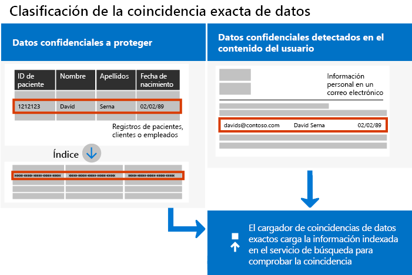
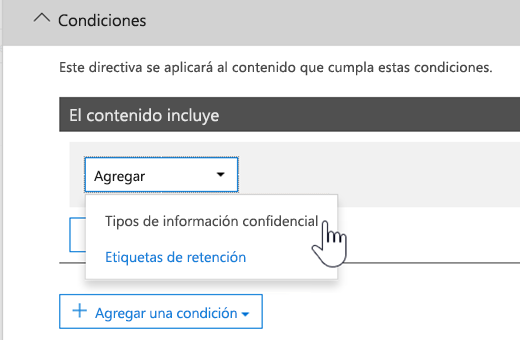

# <a name="create-custom-sensitive-information-types-with-exact-data-match-based-classification"></a>Crear un tipo de información confidencial personalizado con clasificación basada en coincidencia exacta de datos


[Los tipos de información confidencial personalizada](sensitive-information-type-learn-about.md) se usan para ayudar a identificar los elementos confidenciales y así evitar que se compartan de forma inadvertida o inapropiada. Defina un tipo de información confidencial personalizada a partir de lo siguiente:

- patrones
- evidencia de palabras clave como *empleado*, *distintivo* o *id.*
- proximidad de caracteres a la evidencia en un patrón determinado
- niveles de confianza

 Estos tipos de información confidencial personalizada satisfacen las necesidades de negocio para muchas organizaciones.

Pero ¿qué sucede si quiere un tipo de información confidencial personalizado (SIT) que use valores de datos exactos, en lugar de uno que encontrara coincidencias basándose en patrones genéricos? Con la clasificación basada en la coincidencia exacta de datos (EDM), puede crear un tipo de información confidencial personalizada que está diseñado para:

- ser dinámico y actualizarse fácilmente
- ser más escalable
- generar menos falsos positivos
- funcionar con datos confidenciales estructurados
- trabajar con información confidencial de forma más segura
- usarse con varios servicios en la nube de Microsoft.



La clasificación basada en EDM le permite crear tipos de información confidencial personalizados que hacen referencia a valores exactos en una base de datos de información confidencial. La base de datos se puede actualizar diariamente y puede contener hasta 100 millones de filas de datos. Así que mientras los empleados, clientes o pacientes van y vienen y cambian los registros, los tipos de información confidencial se mantienen al día y aplicables. Y puede usar la clasificación basada en EDM con directivas, como [directivas de prevención de pérdida de datos](data-loss-prevention-policies.md) (DLP) o [directivas de archivo de Microsoft Cloud App Security](/cloud-app-security/data-protection-policies).

> [!NOTE]
> Microsoft 365 Information Protection es compatible con los idiomas del conjunto de caracteres de doble byte de vista previa para:
> - Chino (simplificado)
> - Chino (tradicional)
> - Coreano
> - Japonés
> 
> Este soporte está disponible para tipos de información confidencial. Para más información, consulte [Notas de la versión sobre la compatibilidad de Information Protection con juegos de caracteres de doble byte (vista previa)](mip-dbcs-relnotes.md).
 

## <a name="required-licenses-and-permissions"></a>Permisos y licencias necesarios

Debe ser un administrador global, administrador de cumplimiento o administrador de Exchange Online para realizar las tareas descritas en este artículo. Para obtener más información acerca de los permisos de DLP, consulte [Permisos](data-loss-prevention-policies.md#permissions).

La clasificación basada en EDM se incluye en estas suscripciones

- Office 365 E5
- Microsoft 365 E5
- Cumplimiento de Microsoft 365 E5
- Gobierno y protección de información de Microsoft E5/A5

## <a name="portal-links-for-your-subscription"></a>Vínculos del portal para la suscripción


|Portal  |World Wide/GCC  |GCC-High  |DOD  |
|---------|---------|---------|---------|
|Office SCC     |  protection.office.com       |scc.office365.us         |scc.protection.apps.mil |
|Centro de seguridad de Microsoft 365     |security.microsoft.com         |security.microsoft.us         |security.apps.mil|
|Centro de cumplimiento de Microsoft 365     |compliance.microsoft.com         |compliance.microsoft.us         |compliance.apps.mil|


## <a name="the-work-flow-at-a-glance"></a>El flujo de trabajo de un vistazo

|Fase  |Requisitos  |
|---------|---------|
|[Parte 1: Configurar la clasificación basada en EDM](#part-1-set-up-edm-based-classification)<br/><br/>(Según sea necesario)<br/>- [Editar el esquema de la base de datos](#editing-the-schema-for-edm-based-classification) <br/>- [Quitar el esquema](#removing-the-schema-for-edm-based-classification) |- Acceso de lectura a los datos confidenciales<br/>- Esquema de la base de datos en formato XML (ejemplo proporcionado)<br/>- Paquete de reglas en formato XML (ejemplo proporcionado)<br/>- Permisos de administrador para el Centro de seguridad y cumplimiento (con PowerShell) |
|[Parte 2: Crear un hash y cargar los datos confidenciales](#part-2-hash-and-upload-the-sensitive-data)<br/><br/>(Según sea necesario)<br/>[Actualizar los datos](#refreshing-your-sensitive-information-database) |- Cuenta de usuario y de grupo de seguridad personalizado<br/>- Acceso de administrador local en el equipo con el agente de carga EDM<br/>- Acceso de lectura a los datos confidenciales<br/>- Procesar y programar la actualización de los datos|
|[Parte 3: Usar clasificación basada en EDM con los servicios de nube de Microsoft](#part-3-use-edm-based-classification-with-your-microsoft-cloud-services) |- Suscripción a Microsoft 365 con DLP<br/>- Característica de clasificación basada en EDM habilitada |

### <a name="part-1-set-up-edm-based-classification"></a>Parte 1: Configurar la clasificación basada en EDM

La configuración y la configuración de la clasificación basada en EDM incluye lo siguiente:

1. [Guardar datos confidenciales en formato .csv](#save-sensitive-data-in-csv-format)
2. [Definir el esquema de la base de datos de su información confidencial](#define-the-schema-for-your-database-of-sensitive-information)
3. [Crear un paquete de reglas](#set-up-a-rule-package)


#### <a name="save-sensitive-data-in-csv-format"></a>Guardar datos confidenciales en formato .csv

1. Identifique la información confidencial que quiera usar. Exporte los datos a una aplicación, como Microsoft Excel, y guarde el archivo en formato .csv. El archivo de datos puede incluir un máximo de:
      - Hasta 100 millones de filas de datos confidenciales
      - Hasta 32 columnas (campos) por origen de datos
      - Hasta 5 columnas (campos) marcadas como utilizables en búsquedas

2. Estructure los datos confidenciales en el archivo .csv de forma que la primera fila incluya los nombres de los campos que se usan para la clasificación basada en EDM. En el archivo .csv, puede tener nombres de campo como "NSS", "FechaNacimiento", "Nombre", "Apellido", etc. Los nombres de encabezado de las columnas no pueden contener espacios ni guiones bajos. Por ejemplo, el archivo .csv de ejemplo que usamos en este artículo se denomina *RegistrosPacientes.csv* y sus columnas *IdPaciente*, *NEM*, *Apellido*, *Nombre*, *NSS*, etc.

3. Preste atención al formato de los campos de datos confidenciales. En particular, los campos que pueden contener comas en su contenido (por ejemplo, una dirección postal que contenga el valor "Seattle, WA") se analizarán como dos campos separados cuando los analice la herramienta EDM. Para evitar este problema, debe asegurarse de que los campos estén entre comillas simples o dobles en la tabla de datos confidenciales. Si los campos con comas también pueden contener espacios, tendrá que crear un tipo de información confidencial personalizado que coincida con el formato correspondiente (por ejemplo, una cadena de varias palabras que contenga comas y espacios) para asegurarse de que la cadena se haya emparejado correctamente al digitalizar el documento.

#### <a name="define-the-schema-for-your-database-of-sensitive-information"></a>Definir el esquema de la base de datos de información confidencial

Si por razones técnicas o de negocios prefiere no usar PowerShell o la línea de comandos para crear el esquema y el tipo de información confidencial de EDM patter (paquete de reglas), puede usar el [Asistente de tipo de información confidencial y esquema de coincidencia de datos](sit-edm-wizard.md) para crearlos. Cuando termine de crear el esquema y el patrón de tipo de información confidencial de EDM, vuelva a completar todos los pasos necesarios para que su tipo de información confidencial basado en EDM esté disponible para su uso.

> [!NOTE]
> El esquema de coincidencia exacta de datos y el Asistente para tipos de información confidencial solo están disponibles para las nubes en todo el mundo y GCC.

1. Defina el esquema de la base de datos de información confidencial en formato XML (similar al siguiente ejemplo). Dé un nombre a este archivo de esquema **edm.xml** y configúrelo para que por cada columna de la base de datos haya una línea que use la sintaxis: 

      `\<Field name="" searchable=""/\>`.

      - Use nombres de columna para los valores *Nombre de campo*.
      - Use *searchable="true"* para los campos que quiere que se puedan buscar, hasta un máximo de 5 campos. Al menos un campo se debe poder utilizar en búsquedas.

      Por ejemplo, el siguiente archivo XML define el esquema para una base de datos de registros de pacientes, con cinco campos especificados para la búsqueda: *IdPaciente*, *NEM*, *NSS*, *Teléfono* y *FechaNacimiento*.

      (Puede copiar, modificar y usar nuestro ejemplo).

      ```xml
      <EdmSchema xmlns="http://schemas.microsoft.com/office/2018/edm">
            <DataStore name="PatientRecords" description="Schema for patient records" version="1">
                  <Field name="PatientID" searchable="true" caseInsensitive="true" ignoredDelimiters="-,/,*,#,^" />
                  <Field name="MRN" searchable="true" />
                  <Field name="FirstName" />
                  <Field name="LastName" />
                  <Field name="SSN" searchable="true" />
                  <Field name="Phone" searchable="true" />
                  <Field name="DOB" searchable="true" />
                  <Field name="Gender" />
                  <Field name="Address" />
            </DataStore>
      </EdmSchema>
      ```

##### <a name="configurable-match-using-the-caseinsensitive-and-ignoreddelimiters-fields"></a>Coincidencia configurable con los campos caseInsensitive y ignoredDelimiters

En el ejemplo de XML anterior se usan los campos `caseInsensitive` y `ignoredDelimiters`. 

Al incluir el campo ***caseInsensitive** _ establecido en el valor de `true` en la definición del esquema, EDM no excluirá un elemento basado en diferencias entre mayúsculas y minúsculas para el campo `PatientID`. Por lo tanto, EDM verá `PatientID` _ *FOO-1234** y **fOo-1234** como iguales.

Al incluir el campo ***ignoredDelimiters** _ con caracteres compatibles, EDM pasará por alto estos caracteres en `PatientID`. Por lo tanto, EDM verá `PatientID` _ *FOO-1234** y `PatientID` **FOO-1234** como iguales. El indicador `ignoredDelimiters` admite cualquier carácter no alfanumérico. Aquí se muestran algunos ejemplos:
- \.
- \-
- \/
- \_
- \*
- \^
- \#
- \!
- \?
- \[
- \]
- \{
- \}
- \\
- \~
- \; 

- El indicador `ignoredDelimiters` no es compatible con:
- caracteres 0-9
- A-Z
- a-z
- \"
- \,

En este ejemplo, donde se usan tanto `caseInsensitive` como `ignoredDelimiters`, EDM vería **FOO-1234** y **fOo#1234** como iguales y clasificaría al elemento como el tipo de información confidencial para el registro del paciente. 

4. Conéctese al Centro de seguridad y cumplimiento por medio de los procedimientos que se describen en [Conectar al PowerShell del Centro de seguridad y cumplimiento](/powershell/exchange/connect-to-scc-powershell).

5. Para cargar el esquema de la base de datos, ejecute, uno a la vez, los siguientes cmdlets:

      ```powershell
      $edmSchemaXml=Get-Content .\\edm.xml -Encoding Byte -ReadCount 0
      New-DlpEdmSchema -FileData $edmSchemaXml -Confirm:$true
      ```

      Se le pedirá que confirme lo siguiente:

      > Confirmar
      >
      > ¿Está seguro de que desea realizar esta acción?
      >
      > Se importará el nuevo esquema EDM para el almacén de datos "registrospacientes".
      >
      > ¿\[S\] Sí \[T\] Sí a todo \[N\] No \[A\] No a todo \[?\] Ayuda (el valor predeterminado es "S"):

> [!TIP]
> Si quiere que los cambios se realicen sin confirmación, en el paso 5, use este cmdlet: New-DlpEdmSchema -FileData $edmSchemaXml

> [!NOTE]
> La actualización de EDMSchema con adiciones puede tardar de 10 a 60 minutos. La actualización debe completarse antes de ejecutar los pasos que usan las adiciones.

#### <a name="set-up-a-rule-package"></a>Configuración de un paquete de reglas

1. Cree un paquete de reglas en formato XML (con codificación Unicode), similar al siguiente ejemplo: (Puede copiar, modificar y usar nuestro ejemplo).

      Cuando configure el paquete de reglas, asegúrese de hacer referencia correctamente al archivo .csv y al archivo **edm.xml**. Puede copiar, modificar y usar nuestro ejemplo. En este XML de ejemplo, debe personalizar los siguientes campos para crear el tipo confidencial de EDM:

      - **RulePack id y ExactMatch id**: use [New-GUID](/powershell/module/microsoft.powershell.utility/new-guid?view=powershell-6) para generar un GUID.

      - **Datastore**: este campo especifica el almacén de datos de búsqueda de EDM que se va a usar. Debe proporcionar un nombre de origen de datos de un esquema EDM configurado.

      - **idMatch**: este campo señala al elemento principal para EDM.
        - Matches: especifica el campo que se usará en la búsqueda exacta. Se proporciona un nombre de campo que se puede buscar en el esquema EDM para DataStore.
        - Classification: este campo especifica la coincidencia de tipo confidencial que desencadena la búsqueda de EDM. Puede especificar el nombre o el GUID de una clasificación personalizada o integrada existente. Tenga en cuenta que a cualquier cadena que coincida con el tipo de información confidencial proporcionada se le aplicará un hash y se comparará con cada entrada de la tabla de información confidencial. Para evitar problemas de rendimiento, si usa un tipo de información confidencial personalizado como elemento clasificación en EDM, evite usar uno que coincida con un gran porcentaje de contenido (como "cualquier número" o "cualquier palabra de cinco letras") agregando palabras clave o incluyendo formato en la definición del tipo de información confidencial de clasificación personalizada. 

      - **Match:** este campo señala a la evidencia adicional que se encuentra cerca de idMatch.
        - Matches: se proporciona un nombre de campo en el esquema EDM para DataStore.
      - **Resource:** esta sección especifica el nombre y la descripción del tipo confidencial en varias configuraciones regionales.
        - idRef: se proporciona un GUID para Id. de ExactMatch.
        - Nombres y descripciones: personalice según sea necesario.

      ```xml
      <RulePackage xmlns="http://schemas.microsoft.com/office/2018/edm">
        <RulePack id="fd098e03-1796-41a5-8ab6-198c93c62b11">
          <Version build="0" major="2" minor="0" revision="0" />
          <Publisher id="eb553734-8306-44b4-9ad5-c388ad970528" />
          <Details defaultLangCode="en-us">
            <LocalizedDetails langcode="en-us">
              <PublisherName>IP DLP</PublisherName>
              <Name>Health Care EDM Rulepack</Name>
              <Description>This rule package contains the EDM sensitive type for health care sensitive types.</Description>
            </LocalizedDetails>
          </Details>
        </RulePack>
        <Rules>
          <ExactMatch id = "E1CC861E-3FE9-4A58-82DF-4BD259EAB371" patternsProximity = "300" dataStore ="PatientRecords" recommendedConfidence = "65" >
            <Pattern confidenceLevel="65">
              <idMatch matches = "SSN" classification = "U.S. Social Security Number (SSN)" />
            </Pattern>
            <Pattern confidenceLevel="75">
              <idMatch matches = "SSN" classification = "U.S. Social Security Number (SSN)" />
              <Any minMatches ="3" maxMatches ="6">
                <match matches="PatientID" />
                <match matches="MRN"/>
                <match matches="FirstName"/>
                <match matches="LastName"/>
                <match matches="Phone"/>
                <match matches="DOB"/>
              </Any>
            </Pattern>
          </ExactMatch>
          <LocalizedStrings>
            <Resource idRef="E1CC861E-3FE9-4A58-82DF-4BD259EAB371">
              <Name default="true" langcode="en-us">Patient SSN Exact Match.</Name>
              <Description default="true" langcode="en-us">EDM Sensitive type for detecting Patient SSN.</Description>
            </Resource>
          </LocalizedStrings>
        </Rules>
      </RulePackage>
      ```

2. Cargue el paquete de reglas ejecutando, uno a la vez, los siguientes cmdlets de PowerShell:

      ```powershell
      $rulepack=Get-Content .\\rulepack.xml -Encoding Byte -ReadCount 0
      New-DlpSensitiveInformationTypeRulePackage -FileData $rulepack
      ```

Ya tiene configurada la clasificación basada en EDM. El siguiente paso es crear un hash para los datos confidenciales y luego cargarlo para indexarlo.

Recuerde del procedimiento anterior que nuestro esquema RegistrosPacientes define cinco campos para la búsqueda: *IdPaciente*, *NEM*, *NSS*, *Teléfono* y *FechaNacimiento*. Nuestro paquete de reglas de ejemplo incluye esos campos y hace referencia al archivo de esquema de la base de datos (**edm.xml**), con un elemento *ExactMatch* por campo de búsqueda. Considere el siguiente elemento ExactMatch:

```xml
<ExactMatch id = "E1CC861E-3FE9-4A58-82DF-4BD259EAB371" patternsProximity = "300" dataStore ="PatientRecords" recommendedConfidence = "65" >
      <Pattern confidenceLevel="65">
        <idMatch matches = "SSN" classification = "U.S. Social Security Number (SSN)" />
      </Pattern>
      <Pattern confidenceLevel="75">
        <idMatch matches = "SSN" classification = "U.S. Social Security Number (SSN)" />
        <Any minMatches ="3" maxMatches ="100">
          <match matches="PatientID" />
          <match matches="MRN"/>
          <match matches="FirstName"/>
          <match matches="LastName"/>
          <match matches="Phone"/>
          <match matches="DOB"/>
        </Any>
      </Pattern>
    </ExactMatch>
```

En este ejemplo, tenga en cuenta lo siguiente:

- El nombre de dataStore hace referencia al archivo .csv que hemos creado anteriormente: **dataStore = "RegistrosPacientes"**.

- El valor de idMatch hace referencia a un campo para la búsqueda que aparece en el archivo de esquema de la base de datos: **idMatch matches = "NSS"**.

- El valor classification hace referencia a un tipo de información confidencial existente o personalizada: **classification = "Número de seguridad social de Estados Unidos (NSS)"**. (En este caso, usamos el tipo de información confidencial existente del número de la seguridad social de Estados Unidos).

> [!NOTE]
> La actualización de EDMSchema con adiciones puede tardar de 10 a 60 minutos. La actualización debe completarse antes de ejecutar los pasos que usan las adiciones.

#### <a name="editing-the-schema-for-edm-based-classification"></a>Editar el esquema de la clasificación basada en EDM

Si quiere realizar cambios en el archivo **edm.xml**, como cambiar los campos que se usan para la clasificación basada en EDM, siga estos pasos:

> [!TIP]
> Puede cambiar el esquema EDM y el archivo de datos para aprovechar la **coincidencia configurable**. Cuando se configura, EDM omite las diferencias entre mayúsculas y minúsculas y otros delimitadores cuando evalúa un elemento. Esto facilita la definición del esquema XML y los archivos de datos confidenciales. Para obtener más información, consulte [Modificar el esquema de coincidencia de datos exacta para usar la coincidencia configurable](sit-modify-edm-schema-configurable-match.md).

1. Edite el archivo **edm.xml** (este es el archivo tratado en la sección [Definir el esquema](#define-the-schema-for-your-database-of-sensitive-information) de este artículo).

2. Conéctese al Centro de seguridad y cumplimiento por medio de los procedimientos que se describen en [Conectar al PowerShell del Centro de seguridad y cumplimiento](/powershell/exchange/connect-to-scc-powershell).

3. Para actualizar el esquema de la base de datos, ejecute, uno a la vez, los siguientes cmdlets:

      ```powershell
      $edmSchemaXml=Get-Content .\\edm.xml -Encoding Byte -ReadCount 0
      Set-DlpEdmSchema -FileData $edmSchemaXml -Confirm:$true
      ```

      Se le pedirá que confirme lo siguiente:

      > Confirmar
      >
      > ¿Está seguro de que desea realizar esta acción?
      >
      > Se actualizará el esquema EDM para el almacén de datos "registrospacientes".
      >
      > ¿\[S\] Sí \[T\] Sí a todo \[N\] No \[A\] No a todo \[?\] Ayuda (el valor predeterminado es "S"):

      > [!TIP]
      > Si quiere que los cambios se realicen sin confirmación, en el paso 3, use este cmdlet: Set-DlpEdmSchema -FileData $edmSchemaXml

      > [!NOTE]
      > La actualización de EDMSchema con adiciones puede tardar de 10 a 60 minutos. La actualización debe completarse antes de ejecutar los pasos que usan las adiciones.

#### <a name="removing-the-schema-for-edm-based-classification"></a>Eliminación del esquema de la clasificación basada en EDM

(Según sea necesario) Si quiere quitar el esquema que está usando de la clasificación basada en EDM, siga estos pasos:

1. Conéctese al Centro de seguridad y cumplimiento por medio de los procedimientos que se describen en [Conectar al PowerShell del Centro de seguridad y cumplimiento](/powershell/exchange/connect-to-scc-powershell).

2. Ejecute los siguientes cmdlets de PowerShell y sustituya el nombre del almacén de datos "registros de pacientes" por el que quiera quitar:

      ```powershell
      Remove-DlpEdmSchema -Identity patientrecords
      ```

      Se le pedirá una confirmación:

      > Confirmar
      >
      > ¿Está seguro de que desea realizar esta acción?
      >
      > Se quitará el esquema EDM para el almacén de datos "registrospacientes".
      >
      > ¿\[S\] Sí \[T\] Sí a todo \[N\] No \[A\] No a todo \[?\] Ayuda (el valor predeterminado es "S"):

      > [!TIP]
      >  Si quiere que los cambios se realicen sin confirmación, en el paso 2, use este cmdlet: Remove-DlpEdmSchema -Identity registrospacientes -Confirm:$false

### <a name="part-2-hash-and-upload-the-sensitive-data"></a>Parte 2: Crear un hash y cargar los datos confidenciales

En esta fase, configurará una cuenta de usuario y un grupo de seguridad personalizado y configurará la herramienta de agente de carga de EDM. Luego, usará la herramienta para aplicar el algoritmo hash con valor de sal a los datos confidenciales y, después, los cargará.

El algoritmo hash y la carga se pueden realizar con un equipo o puede separar el paso de hash del paso de carga para mayor seguridad.

Si desea aplicar un algoritmo hash y cargar desde un equipo, tendrá que hacerlo desde un equipo que pueda conectarse directamente a su espacio empresarial de Microsoft 365. Esto requiere que los archivos de datos confidenciales de texto no cifrado se encuentren en el equipo para la aplicación del algoritmo hash.

Si no desea que se muestre el archivo de datos confidenciales de texto no cifrado, puede aplicar un algoritmo hash en un equipo en una ubicación segura y, a continuación, copiar el archivo hash y el archivo de sal en un equipo que pueda conectarse directamente a su espacio empresarial de Microsoft 365 para cargarlo. En este escenario, necesitará el EDMUploadAgent en ambos equipos.

> [!IMPORTANT]
> Si ha usado el esquema Coincidencia de datos exacto y el Asistente para tipos de información confidencial para crear los archivos de patrón y esquema, ***debe*** descargar el esquema para este procedimiento.

> [!NOTE]
> Si su organización ha configurado una [Clave de cliente de para Microsoft 365 en el nivel de inquilino (versión preliminar pública)](customer-key-tenant-level.md#overview-of-customer-key-for-microsoft-365-at-the-tenant-level-public-preview), la coincidencia de datos exacta hará que se use automáticamente su funcionalidad de cifrado. Esto solo está disponible para los inquilinos con licencia E5 en la nube comercial.

#### <a name="prerequisites"></a>Requisitos previos

- una cuenta profesional o educativa de Microsoft 365 que se agregará al grupo de seguridad de **EDM\_DataUploaders**
- un equipo con Windows 10 o Windows Server 2016 con .NET versión 4.6.2 para ejecutar el EDMUploadAgent
- un directorio en el equipo de carga para lo siguiente:
    -  EDMUploadAgent
    - el archivo de elementos confidenciales en formato CSV **RegistrosPacientes.csv** en nuestros ejemplos
    -  los archivos hash y de sal de salida
    - el nombre del almacén de datos del archivo **edm.xml** que para este ejemplo es `PatientRecords`
- Si ha usado el [esquema de coincidencia exacta de datos y el Asistente para el tipo de información confidencial](sit-edm-wizard.md) entonces ***debe*** descargarlo

#### <a name="set-up-the-security-group-and-user-account"></a>Configuración de la cuenta de usuario y del grupo de seguridad personalizado

1. Como administrador global, vaya al Centro de administración mediante el [vínculo apropiado para su suscripción](#portal-links-for-your-subscription) y [cree un grupo de seguridad](/office365/admin/email/create-edit-or-delete-a-security-group?view=o365-worldwide)llamado **EDM\_DataUploaders**.

2. Agregue uno o más usuarios al grupo de seguridad **EDM\_DataUploaders**. (Estos usuarios administrarán la base de datos de información confidencial).

#### <a name="hash-and-upload-from-one-computer"></a>Crear un hash y cargar desde un equipo

Este equipo debe tener acceso directo a su espacio empresarial de Microsoft 365.

>[!NOTE]
> Antes de comenzar este procedimiento, asegúrese de que es miembro del grupo de seguridad **EDM\_DataUploaders**.

> [!TIP]
> De forma opcional, puede ejecutar una validación en el archivo CSV antes de cargarlo ejecutando lo siguiente:
>
>`EdmUploadAgent.exe /ValidateData /DataFile [data file] /Schema [schema file]`
>
>Para más información sobre todos los parámetros admitidos de EdmUploadAgent.exe >, ejecute
>
> `EdmUploadAgent.exe /?`


#### <a name="links-to-edm-upload-agent-by-subscription-type"></a>Vínculos al agente de carga de EDM por tipo de suscripción

- [Comercial + GCC](https://go.microsoft.com/fwlink/?linkid=2088639): la mayoría de los clientes comerciales deben usarlo
- [GCC alto](https://go.microsoft.com/fwlink/?linkid=2137521): está específicamente diseñado para los suscriptores de nube de administración pública de alta seguridad
- [DoD](https://go.microsoft.com/fwlink/?linkid=2137807) : está específicamente diseñado para los clientes de la nube del Departamento de defensa de Estados Unidos

1. Cree un directorio de trabajo para EDMUploadAgent. Por ejemplo: **C:\EDM\Data**. Coloque el archivo **RegistrosPacientes.csv** dentro.

2. Descargue e instale el [Agente de carga de EDM](#links-to-edm-upload-agent-by-subscription-type) adecuado para su suscripción en el directorio que creó en el paso 1.

   > [!NOTE]
   > El EDMUploadAgent de los vínculos anteriores se ha actualizado para agregar automáticamente un valor de sal a los datos hash. De forma alternativa, puede brindar su propio valor de sal. Una vez que haya usado esta versión, no podrá usar la versión anterior de EDMUploadAgent.
   >
   > Puede cargar datos con EDMUploadAgent en cualquier almacén de datos determinado solo dos veces al día.

   > [!TIP]
   > Para obtener una lista de los parámetros de comando compatibles, ejecute el agente sin argumentos. Por ejemplo, 'EdmUploadAgent.exe'.

2. Autorice el agente de carga de EDM, abra la ventana del Símbolo del sistema (como administrador), cambie al directorio **C:\EDM\Data** y, después, ejecute el siguiente comando:

   `EdmUploadAgent.exe /Authorize`

3. Inicie sesión con su cuenta profesional o educativa de Microsoft 365 que se ha agregado al grupo de seguridad de EDM_DataUploaders. La información de inquilino se extrae de la cuenta de usuario para establecer una conexión.

   OPCIONAL: Si usó el esquema de coincidencia exacta de datos y el Asistente para el tipo de información confidencial con el fin de crear los archivos de esquema y de patrón, ejecute el siguiente comando en una ventana de símbolo del sistema:

   `EdmUploadAgent.exe /SaveSchema /DataStoreName <schema name> /OutputDir <path to output folder>`

4. Para crear un hash y cargar los datos confidenciales, ejecute el siguiente comando en la ventana del Símbolo del sistema:

   `EdmUploadAgent.exe /UploadData /DataStoreName [DS Name] /DataFile [data file] /HashLocation [hash file location] /Schema [Schema file]`

   Por ejemplo: **EdmUploadAgent.exe /UploadData /DataStoreName PatientRecords /DataFile C:\Edm\Hash\PatientRecords.csv /HashLocation C:\Edm\Hash /Schema edm.xml**

   Esto agregará automáticamente un valor de sal generado de manera aleatoria al hash para una mayor seguridad. De forma opcional, si quiere usar su propio valor de sal, agregue **/Salt <saltvalue>** al comando. Este valor debe tener 64 caracteres de longitud y solo puede contener los caracteres a-z y 0-9.

5. Compruebe el estado de la carga al ejecutar este comando:

   `EdmUploadAgent.exe /GetSession /DataStoreName \<DataStoreName\>`

   Ejemplo: **EdmUploadAgent.exe /GetSession /DataStoreName PatientRecords**

   Verifique que el estado se encuentre en **ProcesamientoEnCurso**. Verifique nuevamente cada pocos minutos hasta que el estado cambie a **Completado**. Una vez que el estado se muestre como completado, los datos de EDM ya están listos para su uso.

#### <a name="separate-hash-and-upload"></a>Separe el hash y cargue

Aplique el algoritmo hash en un equipo en un entorno seguro.

OPCIONAL: Si usó el esquema de coincidencia exacta de datos y el Asistente para el tipo de información confidencial con el fin de crear los archivos de esquema y de patrón, ejecute el siguiente comando en una ventana de símbolo del sistema:

`EdmUploadAgent.exe /SaveSchema /DataStoreName <schema name> /OutputDir <path to output folder>`

1. Ejecute el siguiente comando en la ventana del Símbolo del sistema:

   `EdmUploadAgent.exe /CreateHash /DataFile [data file] /HashLocation [hash file location] /Schema [Schema file] >`

   Por ejemplo:

   > **EdmUploadAgent.exe /CreateHash /DataFile C:\Edm\Data\PatientRecords.csv /HashLocation C:\Edm\Hash /Schema edm.xml**

   De este forma, se obtendrá un archivo con hash y un archivo de sal con estas extensiones si no ha especificado la opción **/Salt <saltvalue>**:
   - .EdmHash
   - .EdmSalt

2. Copie estos archivos de forma segura al equipo que usará para cargar el archivo CSV de elementos confidenciales (RegistrosPacientes) en su espacio empresarial.

   Para cargar los datos con hash, ejecute el siguiente comando en el Símbolo del sistema de Windows:

   `EdmUploadAgent.exe /UploadHash /DataStoreName \<DataStoreName\> /HashFile \<HashedSourceFilePath\>`

   Por ejemplo:

   > **EdmUploadAgent.exe /UploadHash /DataStoreName PatientRecords /HashFile C:\\Edm\\Hash\\PatientRecords.EdmHash**


   Para comprobar que se hayan cargado los datos confidenciales, ejecute el siguiente comando en el Símbolo del sistema de Windows:

   `EdmUploadAgent.exe /GetDataStore`

   Verá una lista de almacenes de datos y la última vez que se actualizaron.

   Si desea ver todos los datos cargados en una determinada tienda, ejecute el comando siguiente en un símbolo del sistema de Windows:

   `EdmUploadAgent.exe /GetSession /DataStoreName <DataStoreName>`

   Continúe con el proceso de configuración y programación para [actualizar la base de datos de información confidencial](#refreshing-your-sensitive-information-database).

En este momento, está listo para usar la clasificación basada en EDM con los servicios de nube de Microsoft. Por ejemplo, puede [configurar una directiva DLP con clasificación basada en EDM](#to-create-a-dlp-policy-with-edm).

#### <a name="refreshing-your-sensitive-information-database"></a>Actualizar la base de datos de información confidencial

Puede actualizar la base de datos de información confidencial diariamente y la herramienta de carga de EDM puede volver a indexar los datos confidenciales y cargar de nuevo los datos indexados.

1. Determine el proceso y la frecuencia (diaria o semanal) para actualizar la base de datos de información confidencial.

2. Vuelva a exportar los datos confidenciales a una aplicación, como Microsoft Excel, y guarde el archivo en formato .csv. Mantenga el mismo nombre de archivo y ubicación que usó cuando siguió los pasos descritos en [Crear un hash y cargar los datos confidenciales](#part-2-hash-and-upload-the-sensitive-data).

      > [!NOTE]
      > Si no hay ningún cambio en la estructura (nombres de campo) del archivo .csv, no necesita realizar cambios en el archivo de esquema de la base de datos al actualizar los datos. Pero si necesita realizar cambios, asegúrese de editar el esquema de la base de datos y su paquete de reglas consecuentemente.

3. Use el [Programador de tareas](/windows/desktop/TaskSchd/task-scheduler-start-page) para automatizar los pasos 2 y 3 en el procedimiento [Hash y carga de los datos confidenciales](#part-2-hash-and-upload-the-sensitive-data). Puede programar tareas con varios métodos:

      | Método             | Qué hacer |
      | ---------------------- | ---------------- |
      | Windows PowerShell     | Consulte la documentación [TareasProgramadas](/powershell/module/scheduledtasks/?view=win10-ps) y [script de PowerShell de ejemplo](#example-powershell-script-for-task-scheduler) de este artículo |
      | API del Programador de tareas     | Consulte la documentación del [Programador de tareas](/windows/desktop/TaskSchd/using-the-task-scheduler)                                                                                                                                                                                                                                                                                |
      | Interfaz de usuario de Windows | En Windows, haga clic en **Inicio** y escriba Programador de tareas. A continuación, en la lista de resultados, haga clic en **Programador de tareas** y **Ejecutar como administrador**.                                                                                                                                                                                                                                                                           |

#### <a name="example-powershell-script-for-task-scheduler"></a>Script de PowerShell de ejemplo para el Programador de tareas

Esta sección incluye un script de PowerShell de ejemplo que puede usar para programar las tareas de creación de hash para los datos y cargar los datos con hash:

##### <a name="to-schedule-hashing-and-upload-in-a-combined-step"></a>Para programar la creación del hash y cargar en un paso combinado

```powershell
param(\[string\]$dataStoreName,\[string\]$fileLocation)
\# Assuming current user is also the user context to run the task
$user = "$env:USERDOMAIN\\$env:USERNAME"
$edminstallpath = 'C:\\Program Files\\Microsoft\\EdmUploadAgent\\'
$edmuploader = $edminstallpath + 'EdmUploadAgent.exe'
$csvext = '.csv'
$schemaext = '.xml'
\# Assuming CSV file name is same as data store name
$dataFile = "$fileLocation\\$dataStoreName$csvext"
\# Assuming location to store hash file is same as the location of csv file
$hashLocation = $fileLocation
\# Assuming Schema file name is same as data store name
$schemaFile = "$fileLocation\\$dataStoreName$schemaext"
$uploadDataArgs = '/UploadData /DataStoreName ' + $dataStoreName + ' /DataFile ' + $dataFile + ' /HashLocation' + $hashLocation + ' /Schema ' + $schemaFile
\# Set up actions associated with the task
$actions = @()
$actions += New-ScheduledTaskAction -Execute $edmuploader -Argument $uploadDataArgs -WorkingDirectory $edminstallpath
\# Set up trigger for the task
$trigger = New-ScheduledTaskTrigger -Weekly -DaysOfWeek Sunday -At 2am
\# Set up task settings
$principal = New-ScheduledTaskPrincipal -UserId $user -LogonType S4U -RunLevel Highest
$settings = New-ScheduledTaskSettingsSet -RunOnlyIfNetworkAvailable -StartWhenAvailable -WakeToRun
\# Create the scheduled task
$scheduledTask = New-ScheduledTask -Action $actions -Principal $principal -Trigger $trigger -Settings $settings
\# Get credentials to run the task
$creds = Get-Credential -UserName $user -Message "Enter credentials to run the task"
$password=\[Runtime.InteropServices.Marshal\]::PtrToStringAuto(\[Runtime.InteropServices.Marshal\]::SecureStringToBSTR($creds.Password))
\# Register the scheduled task
$taskName = 'EDMUpload\_' + $dataStoreName
Register-ScheduledTask -TaskName $taskName -InputObject $scheduledTask -User $user -Password $password
```

#### <a name="to-schedule-hashing-and-upload-as-separate-steps"></a>Para programar la creación del hash y cargar en pasos separados

```powershell
param(\[string\]$dataStoreName,\[string\]$fileLocation)
\# Assuming current user is also the user context to run the task
$user = "$env:USERDOMAIN\\$env:USERNAME"
$edminstallpath = 'C:\\Program Files\\Microsoft\\EdmUploadAgent\\'
$edmuploader = $edminstallpath + 'EdmUploadAgent.exe'
$csvext = '.csv'
$edmext = '.EdmHash'
$schemaext = '.xml'
\# Assuming CSV file name is same as data store name
$dataFile = "$fileLocation\\$dataStoreName$csvext"
$hashFile = "$fileLocation\\$dataStoreName$edmext"
\# Assuming Schema file name is same as data store name
$schemaFile = "$fileLocation\\$dataStoreName$schemaext "

\# Assuming location to store hash file is same as the location of csv file
$hashLocation = $fileLocation
$createHashArgs = '/CreateHash' + ' /DataFile ' + $dataFile + ' /HashLocation ' + $hashLocation + ' /Schema ' + $schemaFile
$uploadHashArgs = '/UploadHash /DataStoreName ' + $dataStoreName + ' /HashFile ' + $hashFile
\# Set up actions associated with the task
$actions = @()
$actions += New-ScheduledTaskAction -Execute $edmuploader -Argument $createHashArgs -WorkingDirectory $edminstallpath
$actions += New-ScheduledTaskAction -Execute $edmuploader -Argument $uploadHashArgs -WorkingDirectory $edminstallpath
\# Set up trigger for the task
$trigger = New-ScheduledTaskTrigger -Weekly -DaysOfWeek Sunday -At 2am
\# Set up task settings
$principal = New-ScheduledTaskPrincipal -UserId $user -LogonType S4U -RunLevel Highest
$settings = New-ScheduledTaskSettingsSet -RunOnlyIfNetworkAvailable -StartWhenAvailable -WakeToRun
\# Create the scheduled task
$scheduledTask = New-ScheduledTask -Action $actions -Principal $principal -Trigger $trigger -Settings $settings
\# Get credentials to run the task
$creds = Get-Credential -UserName $user -Message "Enter credentials to run the task"
$password=\[Runtime.InteropServices.Marshal\]::PtrToStringAuto(\[Runtime.InteropServices.Marshal\]::SecureStringToBSTR($creds.Password))
\# Register the scheduled task
$taskName = 'EDMUpload\_' + $dataStoreName
Register-ScheduledTask -TaskName $taskName -InputObject $scheduledTask -User $user -Password $password

```

### <a name="part-3-use-edm-based-classification-with-your-microsoft-cloud-services"></a>Parte 3: Usar clasificación basada en EDM con los servicios de nube de Microsoft

Estas ubicaciones son compatibles con los tipos de información confidencial de EDM:

- DLP para Exchange Online (correo electrónico)
- OneDrive para la Empresa (archivos)
- Microsoft Teams (conversaciones)
- DLP para SharePoint (archivos)
- Directivas DLP para la seguridad de las aplicaciones en la nube de Microsoft

Los tipos de información confidencial de EDM para las siguientes situaciones están actualmente en desarrollo, pero todavía no están disponibles:

- Clasificación automática de las etiquetas de sensibilidad y las etiquetas de retención

#### <a name="to-create-a-dlp-policy-with-edm"></a>Para crear una directiva DLP con EDM

1. Vaya al Centro de seguridad y cumplimiento con el [vínculo adecuado para su suscripción](#portal-links-for-your-subscription).

2. Seleccione **Directiva de prevención de pérdida de datos** \> **Directiva**.

3. Elija **Crear una directiva** \> **Personalizado** \> **Siguiente**.

4. En la pestaña **Nombre de la directiva**, especifique un nombre y una descripción y elija **Siguiente**.

5. En la pestaña **Elegir ubicaciones**, haga clic en **Permitir elegir ubicaciones concretas** y luego en **Siguiente**.

6. En la columna **Estado**, seleccione **correo electrónico de Exchange, cuentas de OneDrive, conversación de Teams y mensaje de canal**, y después elija **Siguiente**.

7. En la pestaña **Configuración de directiva**, elija **Usar la configuración avanzada** y luego elija **Siguiente**.

8. Elija **+ Nueva regla**.

9. En la sección **Nombre**, especifique un nombre y una descripción para la regla.

10. En la sección **Condiciones** en la lista **+ Agregar una condición**, elija **El contenido incluye tipo confidencial**.

      

11. Busque el tipo de información confidencial que creó al configurar el paquete de reglas y elija **+ Agregar**.  
    Elija **Hecho**.

12. Termine de seleccionar las opciones para la regla, como **Notificaciones de usuario**, **Invalidaciones de usuario**, **Informes de incidentes**, etc. y luego elija **Guardar**.

13. En la pestaña **Configuración de directiva**, revise las reglas y elija **Siguiente**.

14. Especifique si quiere activar la directiva inmediatamente, probarla o dejarla desactivada. A continuación, elija **Siguiente**.

15. En la pestaña **Revisar la configuración**, revise la directiva. Realice los cambios necesarios. Cuando haya terminado, seleccione **Crear**.

> [!NOTE]
> Espere aproximadamente una hora para que la nueva directiva DLP pase por el centro de datos.

## <a name="related-articles"></a>Artículos relacionados

- [Definiciones de entidad de tipos de información confidencial](sensitive-information-type-entity-definitions.md)
- [Obtener más información acerca de los tipos de información confidencial](sensitive-information-type-learn-about.md).
- [Información general de directivas DLP](data-loss-prevention-policies.md)
- [Microsoft Cloud App Security](/cloud-app-security)
- [New-DlpEdmSchema](/powershell/module/exchange/new-dlpedmschema)
- [Modificar esquema de coincidencia de datos exacto para usar la coincidencia configurable](sit-modify-edm-schema-configurable-match.md)