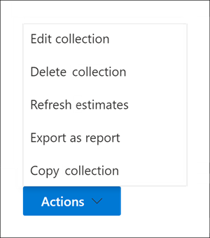

# Crear una colección borrador en Advanced eDiscoveryCreate a draft collection in Advanced eDiscovery

Después de identificar a los custodios y a los orígenes de datos que no son custodios para el caso, estará listo para identificar y localizar un conjunto de documentos relevantes.After you've identified custodians and any non-custodian data sources for the case, you're ready to identify and locate a set of documents that are relevant. Para ello, use la herramienta Colecciones para buscar en los orígenes de datos contenido relevante.You do this by using the Collections tool to search data sources for relevant content. Para ello, cree una colección que busque en orígenes de datos especificados contenido que coincida con los criterios de búsqueda.You do this by creating a collection that searches specified data sources for content that matches your search criteria. Tiene la opción de crear una *colección* borrador , que es una estimación de los elementos que se encuentran o puede crear una colección que agrega automáticamente los elementos a un conjunto de revisión.You have the option to create a *draft collection*, which is an estimate of the items are found or you can create a collection that automatically adds the items to a review set. Al crear una colección borrador, puede ver información sobre los resultados estimados que coinciden con la consulta de búsqueda, como el número total y el tamaño de los elementos encontrados, los distintos orígenes de datos donde se encontraron y las estadísticas sobre la consulta de búsqueda.When you create a draft collection, you can views information about the estimated results that matched the search query, such as the total number and size of items found, the different data sources where they were found, and statistics about the search query. También puede obtener una vista previa de un ejemplo de los elementos devueltos por la colección.You can also preview a sample of items that were returned by the collection. Con estas estadísticas, puede cambiar la consulta de búsqueda y volver a ejecutar la colección de borradores para restringir los resultados.Using these statistics, you can change the search query and rerun the draft collection to narrow your results. Una vez que esté satisfecho con los resultados de la colección, puede confirmar la colección en un conjunto de revisión.Once you're satisfied with the collection results, you can commit the collection to a review set. Al confirmar un borrador de colección, los elementos devueltos por la colección se agregan a un conjunto de revisión para su revisión, análisis y exportación.When you commit a draft collection, the items returned by the collection are added to a review set for review, analysis, and export.

## Antes de crear una colección borradorBefore you create a draft collection

- Agregue custodios y orígenes de datos no custodiados al caso antes de crear una colección borrador.Add custodians and non-custodial data sources to the case before you create a draft collection. Esto es necesario para que pueda seleccionar los orígenes de datos al crear una colección de borradores.This is required so that you can select the data sources when you create a draft collection. Para obtener más información, vea:For more information, see:

  - [Agregar administradores a un casoAdd custodians to a case](add-custodians-to-case.md)

  - [Agregar orígenes de datos que no son de Private a un casoAdd non-custodial data sources to a case](non-custodial-data-sources.md)

- Puede buscar orígenes de datos adicionales (los que no se han agregado al caso como ubicaciones de custodia o no custodia) en un borrador de colección para obtener contenido que pueda ser relevante para el caso.You can search additional data sources (ones that haven't been added to the case as custodial or non-custodial locations) in a draft collection for content that may be relevant to the case. Estos orígenes de datos pueden incluir buzones, SharePoint sitios y Teams.These data sources might include mailboxes, SharePoint sites, and Teams. Si esta situación es aplicable a su caso, compile una lista de estos orígenes de datos para que pueda agregarlos a la colección.If this situation is applicable to your case, compile a list of these data sources so you can add them to the collection.

## Crear una colección de borradorCreate a draft collection

1. En el Microsoft 365 de cumplimiento, abra el Advanced eDiscovery y, a continuación, seleccione la **pestaña Colecciones.**In the Microsoft 365 compliance center, open the Advanced eDiscovery case, and then select the **Collections** tab.

2. En la **página Colecciones,** seleccione **Nueva colección** Colección  >  **estándar**.On the **Collections** page, select **New collection** > **Standard collection**.

3. Escriba un nombre (obligatorio) y una descripción (opcional) para la colección.Type a name (required) and description (optional) for the collection. Después de crear la colección, no puede cambiar el nombre, pero puede modificar la descripción.After the collection is created, you can't change the name, but you can modify the description.

4. En la **página Orígenes de** datos custodiales, realice una de las siguientes acciones para identificar los orígenes de datos de custodia de los que se recopilará contenido:On the **Custodial data sources** page, do one of the following things to identify the custodial data sources to collect content from:

   - Haga **clic en Seleccionar custodios** para buscar custodios específicos que se agregaron al caso.Click **Select custodians** to search specific custodians that were added to the case. Si usa esta opción, se muestra una lista de los custodios de casos.If you use this option, a list of the case custodians is displayed. Seleccione uno o más custodios.Select one or more custodians. Después de seleccionar y agregar los custodios, también puede seleccionar los orígenes de datos específicos para buscar cada custodio.After you select and add the custodians, you can also select the specific data sources to search for each custodian. Estos orígenes de datos que se muestran se especificaron cuando se agregó el custodio al caso.These data sources that are displayed were specified when the custodian was added to the case.

   - Haga clic en **el botón** de alternancia Seleccionar todo para buscar en todos los custodios que se agregaron al caso.Click the **Select all** toggle to search all custodians that were added to the case. Al seleccionar esta opción, se buscan todos los orígenes de datos de todos los custodios.When you select this option, all data sources for all custodians are searched.

5. En la **página Orígenes** de datos sin custodia, realice una de las siguientes acciones para identificar los orígenes de datos que no son custodia para recopilar contenido de:On the **Non-custodial data sources** page, do one of the following things to identify the non-custodial data sources to collect content from:

   - Haga **clic en Seleccionar orígenes** de datos no custodiales para seleccionar orígenes de datos no custodiales específicos que se agregaron al caso.Click **Select non-custodial data sources** to select specific non-custodial data sources that were added to the case. Si usa esta opción, se mostrará una lista de orígenes de datos.If you use this option, a list of data sources displayed. Seleccione uno o varios de estos orígenes de datos.Select one or more of these data sources.

   - Haga clic en **el botón** de alternancia Seleccionar todo para seleccionar todos los orígenes de datos que no son custodia que se agregaron al caso.Click the **Select all** toggle to select all non-custodial data sources that were added to the case.

6. En la **página Orígenes de datos adicionales,** puede seleccionar otros buzones y sitios para buscar como parte de la colección.On the **Additional data sources** page, you can select other mailboxes and sites to search as part of the collection. Estos tipos de orígenes de datos no se agregaron como ubicaciones de datos custodiales o no custodiales en el caso.These types of data sources weren't added as custodial or non-custodial data locations in the case. También tiene dos opciones al buscar orígenes de datos adicionales:You also have two options when searching additional data sources:

   - Para buscar en todas las ubicaciones de contenido un servicio específico (buzones de Exchange, sitios SharePoint  y OneDrive o  carpetas públicas de Exchange), haga clic en la alternancia Seleccionar todo correspondiente en la columna Estado.To search all content locations for a specific service (Exchange mailboxes, SharePoint and OneDrive sites, or Exchange public folders), click the corresponding **Select all** toggle in the **Status** column. Esta opción buscará en todas las ubicaciones de contenido del servicio seleccionado.This option will search all content locations in the selected service.

   - Para buscar una ubicación de contenido  específica para un  servicio, haga clic en la alternancia Seleccionar todo correspondiente  en la columna Estado y, a continuación, haga clic en **Usuarios,** grupos o equipos (para buzones de Exchange) o Elegir sitios para (sitios de SharePoint y OneDrive) para buscar ubicaciones de contenido específicas.To search specific content location for a service, click the corresponding **Select all** toggle in the **Status** column, and then click **Users, groups or teams** (for Exchange mailboxes) or **Choose sites** for (SharePoint and OneDrive sites) to search specific content locations.

7. En la **página Condiciones,** puede crear la consulta de búsqueda que se usa para recopilar elementos de los orígenes de datos que ha identificado en las páginas del asistente anteriores.On the **Conditions** page, you can create the search query that is used to collect items from the data sources that you've identified in the previous wizard pages. Puede buscar palabras clave, pares property:value o usar una lista de palabras clave.You can search for keywords, property:value pairs, or use a keyword list. También puede agregar varias condiciones de búsqueda para restringir el ámbito de la colección.You can also add various search conditions to narrow the scope of the collection. Para obtener más información, vea [Crear consultas de búsqueda para colecciones](building-search-queries.md).For more information, see [Build search queries for collections](building-search-queries.md).

8. En la **página Guardar como borrador o agregar** a conjunto de revisión, seleccione **Guardar colección como borrador**.On the **Save as draft or add to review set** page, select **Save collection as draft**.

   > [!NOTE]
   > La otra opción de esta página permite recopilar elementos y agregarlos directamente a un conjunto de revisión.The other option on this page lets you collect items and add them direct to a review set. En lugar de crear una colección borrador para la que pueda revisar estadísticas y obtener una vista previa de un ejemplo de los resultados de la colección, esta opción omite ese proceso y agrega automáticamente la colección a un conjunto de revisión.Instead of creating a draft collection that you can review statistics for and preview a sample of the collection results, this option skips that process and automatically adds the collection to a review set. Si selecciona la segunda opción para agregar la colección a un conjunto de revisión, tendrá opciones adicionales para configurar, como recopilar subprocesos de conversación de chat completos en Microsoft Teams y Yammer y recopilar datos adjuntos en la nube (también denominados datos adjuntos modernos).If you select the second option to add the collection to a review set, you have additional settings to configure, such as collecting entire chat conversation threads in Microsoft Teams and Yammer and collecting cloud attachments (also called *modern attachments*). Para obtener más información acerca de esta configuración, vea [Commit a draft collection to a review set](commit-draft-collection.md).For more information about these settings, see [Commit a draft collection to a review set](commit-draft-collection.md).

9. En la **página Revisar la colección,** puede revisar y actualizar la configuración de la colección que configuró en las páginas anteriores.On the **Review your collection** page, you can review and update the collection settings that you configured on the previous pages.

   - **Ficha Resumen:** revise y modifique el nombre y la descripción de la colección, los criterios de búsqueda de colección, las ubicaciones de datos adicionales y el tipo de colección.**Summary** tab:  Review and modify the name and description of the collection, the collection search criteria, additional data locations, and the collection type.

   - **Ficha Orígenes:** revisar y modificar los orígenes de datos de custodia y no custodia de la colección.**Sources** tab: Review and modify the custodial and non-custodial data sources for the collection.

10. Haga **clic en Enviar** para crear la colección borrador.Click **Submit** to create the draft collection. Se muestra una página que confirma que se creó la colección.A page is displayed confirming that the collection was created.

## Qué sucede después de crear una colección de borradoresWhat happens after you create a draft collection

Después de crear una colección borrador, aparece en la página **Colecciones** en el caso y el estado muestra que está en curso.After you create a draft collection, it listed on the **Collections** page in the case and the status shows that it's in progress. Un trabajo denominado **Preparación de la vista previa de** búsqueda y estimaciones también se crea y se muestra en la página **Trabajos** en el caso.A job named **Preparing search preview and estimates** is also created and displayed on the **Jobs** page in the case.

Durante el proceso de borrador de colección, Advanced eDiscovery realiza una estimación de búsqueda con los criterios de búsqueda y los orígenes de datos especificados en la colección.During the draft collection process, Advanced eDiscovery performs a search estimate using the search criteria and data sources that you specified in the collection. Advanced eDiscovery también prepara un muestreo de elementos que puede obtener una vista previa.Advanced eDiscovery also prepares a sampling of items that you can preview. Una vez completada la colección, se actualizan las siguientes columnas y valores correspondientes en la **página** Colección:When the collection is complete, the following columns and corresponding values on the **Collection** page are updated:

- **Status:** indica el estado y el tipo de colección.**Status**: Indicates the status and type of collection. Un valor de **Estimated** indica que se ha completado una colección borrador.A value of **Estimated** indicates that a draft collection is complete. Este mismo valor también indica que la colección es un borrador de colección y que no se ha agregado a un conjunto de revisión.This same value also indicates that the collection is a draft collection, and that it hasn't been added to a review set. Un valor **de Committed** en la columna **Estado** indica que la colección se ha agregado a un conjunto de revisión.A value of **Committed** in the **Status** column indicates that the collection has been added to a review set.

- **Estado de** la estimación: indica el estado de los resultados de búsqueda estimados y si las estimaciones y estadísticas de búsqueda están listas para su revisión.**Estimate status**: Indicates the status of the estimated search results and whether or not the search estimates and statistics are ready for review. Un valor de **Successful** indica que los resultados de la colección borrador están listos para su revisión.A value of **Successful** indicates the results of the draft collection are ready for review. Después de enviar por primera vez un borrador de colección, se muestra un valor de **In progress** para indicar que la colección todavía se está ejecutando.After you first submit a draft collection, a value of **In progress** is displayed to indicate the collection is still running

- **Estado de vista** previa: indica el estado de los elementos de ejemplo que puede obtener una vista previa.**Preview status**: Indicates the status of the sample items that you can preview. Un valor de **Successful** indica que los elementos están listos para la vista previa.A value of **Successful** indicates the items are ready for preview. Después de enviar por primera vez un borrador de colección, se muestra un valor de **In progress** para indicar que la colección todavía se está ejecutando.After you first submit a draft collection, a value of **In progress** is displayed to indicate that the collection is still running.

## Pasos siguientes después de completar un borrador de colecciónNext steps after a draft collection is complete

Una vez completada correctamente el borrador de la colección, puede realizar varias tareas.After the draft collection is successfully completed, you can perform various tasks. Para realizar la mayoría de estas tareas, simplemente vaya a la pestaña **Colecciones** y haga clic en el nombre de la colección borrador para mostrar la página desplegable.To perform most of these tasks, just go the **Collections** tab and click the name of the draft collection to display the flyout page.

Esta es una lista de las cosas que puede hacer desde la página desplegable de la colección:Here's a list of things you can do from the collection flyout page:

- Seleccione la **pestaña** Resumen para ver información de resumen sobre la colección y los resultados de búsqueda estimados devueltos por la colección.Select the **Summary** tab to view summary information about the collection and the estimated search results returned by the collection. Esto incluye el número total de elementos y el tamaño de los resultados de búsqueda estimados, el número de buzones y sitios que contienen los resultados de búsqueda y las condiciones de búsqueda (si se usan) usadas para el ámbito de la colección.This includes that total number of items and size of the estimated search results, the number of mailboxes and sites contained search results, and the search conditions (if used) used to scope the collection.

- Seleccione la **pestaña Orígenes de** datos para ver una lista de custodios y orígenes de datos no custodiados) que se buscaron en la colección.Select the **Data sources** tab to view a list of custodians and non-custodial data sources) that were searched in the collection. Las ubicaciones de contenido adicionales que se buscaron se enumeran **en Ubicaciones** en la **pestaña** Resumen.Any additional content locations that were search are listed under **Locations** on the **Summary** tab.

- Seleccione la **pestaña Estadísticas de búsqueda** para ver estadísticas sobre la colección.Select the **Search statistics** tab to view statistics about the collection. Esto incluye el número total y el tamaño de los elementos encontrados en cada servicio (por ejemplo, buzones de Exchange o sitios de SharePoint) y un informe de condiciones que muestra estadísticas sobre el número de elementos devueltos por diferentes componentes de la consulta de búsqueda usada por la colección.This includes the total number and size of items found in each service (for example, Exchange mailboxes or SharePoint sites) and a condition report that displays statistics about the number of items returned by different components of the search query used by the collection. Para obtener más información, vea [Collection statistics and reports](collection-statistics-reports.md).For more information, see [Collection statistics and reports](collection-statistics-reports.md).

- Haga **clic en Revisar ejemplo** (ubicado en la parte inferior de la página desplegable) para obtener una vista previa de una muestra de los elementos devueltos por la colección.Click **Review sample** (located at the bottom of the flyout page) to preview a sample of the items returned by the collection.

- Confirmar la colección borrador en un conjunto de revisión (haciendo clic en **Acciones**  >  **Editar colección**).Commit the draft collection to a review set (by clicking **Actions** > **Edit collection**). Esto significa que se vuelve a ejecutar la colección (con la configuración actual) y se agregan los elementos devueltos por la colección a un conjunto de revisión.This means that you rerun the collection (using the current settings) and add the items returned by the collection to a review set. Como se explicó anteriormente, también puede configurar opciones adicionales (como subprocesos de conversación y datos adjuntos basados en la nube) al agregar la colección a un conjunto de opiniones.As previously explained, you can also configure additional settings (such as conversation threading and cloud-based attachments) when you add the collection to a review set. Para obtener más información e instrucciones paso a paso, vea [Commit a draft collection to a review set](commit-draft-collection.md).For more information and step-by-step instructions, see [Commit a draft collection to a review set](commit-draft-collection.md).

## Administrar una colección de borradoresManage a draft collection

Puede usar las opciones del menú **Acciones** de la página desplegable de una colección de borradores para realizar varias tareas de administración.You can use the options in the **Actions** menu on the flyout page of a draft collection to perform various management tasks.

A continuación se descripciones de las opciones de administración.Here's are descriptions of the management options.

- **Editar colección:** cambiar la configuración de la colección borrador.**Edit collection**: Change the settings of the draft collection. Después de realizar cambios, puede volver a ejecutar la colección y actualizar las estimaciones y estadísticas de búsqueda.After you make changes, you can rerun the collection and update the search estimates and statistics. Como se ha explicado anteriormente, se usa esta opción para confirmar un borrador de colección en un conjunto de revisión.As previously explained, you use this option to commit a draft collection to a review set.  

- **Eliminar colección:** eliminar una colección borrador.**Delete collection**: Delete a draft collection. Tenga en cuenta que una vez que un borrador de colección se confirma en un conjunto de revisión, no se puede eliminar.Note that after a draft collection is committed to a review set, it can't be deleted.

- **Actualizar estimaciones:** vuelva a ejecutar la consulta (con los orígenes de datos) especificada en el borrador de colección para actualizar las estimaciones y estadísticas de búsqueda.**Refresh estimates**: Rerun the query (against the data sources) specified in the draft collection to update the search estimates and statistics.

- **Exportar como informe:** exporta información sobre la colección borrador a un archivo CSV que puede descargar en el equipo local.**Export as report**: Exports information about the draft collection to a CSV file that you can download to your local computer. El informe de exportación contiene la siguiente información:The export report contains the following information:

  - La identidad de cada ubicación de contenido que contiene elementos que coinciden con la consulta de búsqueda de la colección borrador.The identity of each content location that contains items that match the search query in the draft collection. Estas ubicaciones suelen ser buzones o sitios.These locations are typically mailboxes or sites.
  
  - El número total de elementos en cada ubicación de contenido.The total number of items in each content location.
  
  - Tamaño total (en bytes) de los elementos de cada ubicación de contenido.The total size (in bytes) of the items in each content location.

  - El servicio (como Exchange o SharePoint) en el que se encuentra la ubicación de contenido.The service (such as Exchange or SharePoint) in which the content location is located.

- **Copiar colección:** cree una nueva colección borrador copiando la configuración de una colección existente.**Copy collection**: Create a new draft collection by copying the settings from an existing collection. Debe usar un nombre diferente para la nueva colección.You have to use a different name for the new collection. También tiene la opción de modificar la configuración antes de enviar la nueva colección.You also have the option to modify the settings before you submit the new collection. Después de enviarla, se ejecuta la consulta de búsqueda y se generan nuevas estimaciones y estadísticas.After you submit it, the search query is run and new estimates and statistics are generated. Es una buena manera de crear rápidamente una colección de borradores adicional y, a continuación, modificar la configuración seleccionada según sea necesario mientras se conserva la información de la colección original.The is a good way to quickly create additional draft collection and then modify selected settings as necessary while still preserving information in the original collection. Esto también le permite comparar fácilmente los resultados de dos colecciones similares.This also lets you easily compare the results of two similar collections.

> [!NOTE]
> Después de que un borrador de colección se haya confirmado en un conjunto de revisión, solo puede copiar la colección y exportar un informe.After a draft collection is committed to a review set, you can only copy the collection and export a report.
