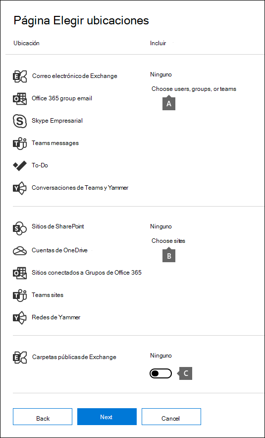
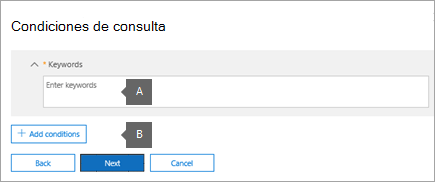
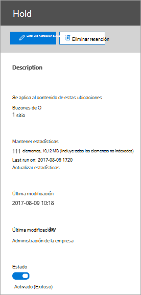
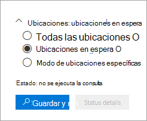

# <a name="create-an-ediscovery-hold"></a><span data-ttu-id="7fac8-103">Crear un caso de retención de eDiscovery</span><span class="sxs-lookup"><span data-stu-id="7fac8-103">Create an eDiscovery hold</span></span>

<span data-ttu-id="7fac8-104">Puede usar un caso de exhibición de documentos electrónicos principal para crear suspensiones y conservar el contenido que pueda ser relevante para el caso.</span><span class="sxs-lookup"><span data-stu-id="7fac8-104">You can use a Core eDiscovery case to create holds to preserve content that might be relevant to the case.</span></span> <span data-ttu-id="7fac8-105">Puede poner una retención en los buzones de Exchange y en las cuentas de OneDrive para la empresa de las personas que está investigando en el caso.</span><span class="sxs-lookup"><span data-stu-id="7fac8-105">You can place a hold on the Exchange mailboxes and OneDrive for Business accounts of people you're investigating in the case.</span></span> <span data-ttu-id="7fac8-106">También puede suspender los buzones de correo y los sitios asociados a Microsoft Teams, grupos de Office 365 y grupos de Yammer.</span><span class="sxs-lookup"><span data-stu-id="7fac8-106">You can also place a hold on the mailboxes and sites that are associated with Microsoft Teams, Office 365 Groups, and Yammer Groups.</span></span> <span data-ttu-id="7fac8-107">Cuando se colocan ubicaciones de contenido en retención, el contenido se conserva hasta que se quita la retención de la ubicación del contenido o hasta que se elimina la suspensión.</span><span class="sxs-lookup"><span data-stu-id="7fac8-107">When you place content locations on hold, content is preserved until you remove the hold from the content location or until you delete the hold.</span></span>

<span data-ttu-id="7fac8-108">Después de crear una suspensión de exhibición de documentos electrónicos, la retención puede tardar hasta 24 horas en surtir efecto.</span><span class="sxs-lookup"><span data-stu-id="7fac8-108">After you create an eDiscovery hold, it may take up to 24 hours for the hold to take effect.</span></span> 

<span data-ttu-id="7fac8-109">Al crear una suspensión, tiene las siguientes opciones para limitar el contenido que se conserva en las ubicaciones de contenido especificadas:</span><span class="sxs-lookup"><span data-stu-id="7fac8-109">When you create a hold, you have the following options to scope the content that is preserved in the specified content locations:</span></span>
  
- <span data-ttu-id="7fac8-110">Se crea una retención infinita en la que se coloca en suspensión todo el contenido de las ubicaciones especificadas.</span><span class="sxs-lookup"><span data-stu-id="7fac8-110">You create an infinite hold where all content in the specified locations is placed on hold.</span></span> <span data-ttu-id="7fac8-111">Como alternativa, puede crear una retención basada en consultas en la que solo se coloca en retención el contenido en las ubicaciones especificadas que coinciden con una consulta de búsqueda.</span><span class="sxs-lookup"><span data-stu-id="7fac8-111">Alternatively, you can create a query-based hold where only the content in the specified locations that matches a search query is placed on hold.</span></span>

- <span data-ttu-id="7fac8-112">Puede especificar un intervalo de fechas para conservar solo el contenido enviado, recibido o creado dentro del intervalo de fechas.</span><span class="sxs-lookup"><span data-stu-id="7fac8-112">You can specify a date range to preserve only the content that was sent, received, or created within that date range.</span></span> <span data-ttu-id="7fac8-113">Como alternativa, puede retener todo el contenido en las ubicaciones especificadas, independientemente de Cuándo se haya enviado, recibido o creado.</span><span class="sxs-lookup"><span data-stu-id="7fac8-113">Alternatively, you can hold all content in specified locations regardless of when it was sent, received, or created.</span></span>
  
## <a name="how-to-create-an-ediscovery-hold"></a><span data-ttu-id="7fac8-114">Cómo crear una retención de exhibición de documentos electrónicos</span><span class="sxs-lookup"><span data-stu-id="7fac8-114">How to create an eDiscovery hold</span></span>

<span data-ttu-id="7fac8-115">Para crear una retención de exhibición de documentos electrónicos asociada a un caso de exhibición de documentos electrónicos principal:</span><span class="sxs-lookup"><span data-stu-id="7fac8-115">To create an eDiscovery hold that's associated with a Core eDiscovery case:</span></span>
  
1. <span data-ttu-id="7fac8-116">Vaya a [https://compliance.microsoft.com](https://compliance.microsoft.com) e inicie sesión con las credenciales de la cuenta de usuario a la que se le han asignado los permisos de eDiscovery adecuados.</span><span class="sxs-lookup"><span data-stu-id="7fac8-116">Go to [https://compliance.microsoft.com](https://compliance.microsoft.com) and sign in using the credentials for user account that has been assigned the appropriate eDiscovery permissions.</span></span>

2. <span data-ttu-id="7fac8-117">En el panel de navegación izquierdo del centro de cumplimiento de Microsoft 365, haga clic en **Mostrar todos** y, a continuación, en **eDiscovery > Core**.</span><span class="sxs-lookup"><span data-stu-id="7fac8-117">In the left navigation pane of the Microsoft 365 compliance center, click **Show all**, and then click **eDiscovery > Core**.</span></span>

3. <span data-ttu-id="7fac8-118">En la página **principal de eDiscovery** , seleccione el caso en el que desea crear la retención y, a continuación, haga clic en **abrir caso**.</span><span class="sxs-lookup"><span data-stu-id="7fac8-118">On the **Core eDiscovery** page, select the case that you want to create the hold in, and then click **Open case**.</span></span>

4. <span data-ttu-id="7fac8-119">En la página **principal** del caso, haga clic en la pestaña **suspensiones** .</span><span class="sxs-lookup"><span data-stu-id="7fac8-119">On the **Home** page for the case, click the **Holds** tab.</span></span>
  
5. <span data-ttu-id="7fac8-120">En la página **suspensiones** , haga clic en **crear**.</span><span class="sxs-lookup"><span data-stu-id="7fac8-120">On the **Holds** page, click **Create**.</span></span>

6. <span data-ttu-id="7fac8-121">En la página **nombre del** Asistente para la suspensión, asigne un nombre a la retención y agregue una descripción opcional y, a continuación, haga clic en **siguiente**.</span><span class="sxs-lookup"><span data-stu-id="7fac8-121">On the **Name your hold** wizard page, give the hold a name and add an optional description, and then click **Next**.</span></span> <span data-ttu-id="7fac8-122">El nombre de la suspensión debe ser exclusivo en la organización.</span><span class="sxs-lookup"><span data-stu-id="7fac8-122">The name of the hold must be unique in your organization.</span></span>

7. <span data-ttu-id="7fac8-123">En la página **ubicaciones de contenido** , elija las ubicaciones de contenido que desea poner en retención.</span><span class="sxs-lookup"><span data-stu-id="7fac8-123">On the **Content locations** page, choose the content locations that you want to place on hold.</span></span> <span data-ttu-id="7fac8-124">Puede poner buzones de correo, sitios y carpetas públicas en retención.</span><span class="sxs-lookup"><span data-stu-id="7fac8-124">You can place mailboxes, sites, and public folders on hold.</span></span>

    
  
   1. <span data-ttu-id="7fac8-126">**Ubicaciones de buzones** : haga clic en **elegir usuarios, grupos o equipos** y, a continuación, haga clic en **elegir usuarios, grupos o Teams** de nuevo para especificar los buzones que se deben poner en retención.</span><span class="sxs-lookup"><span data-stu-id="7fac8-126">**Mailbox locations** - Click **Choose users, groups, or teams** and then click **Choose users, groups, or teams** again to specify the mailboxes to place on hold.</span></span> <span data-ttu-id="7fac8-127">Use el cuadro de búsqueda para buscar los buzones de usuario y los grupos de distribución (para poner una retención en los buzones de los miembros del grupo) para ponerlos en retención.</span><span class="sxs-lookup"><span data-stu-id="7fac8-127">Use the search box to find user mailboxes and distribution groups (to place a hold on the mailboxes of group members) to place on hold.</span></span> <span data-ttu-id="7fac8-128">También puede poner una retención en el buzón asociado para un grupo de Microsoft Teams, Office 365 o un grupo de Yammer.</span><span class="sxs-lookup"><span data-stu-id="7fac8-128">You can also place a hold on the associated mailbox for a Microsoft Team, Office 365 Group, or Yammer Group.</span></span> <span data-ttu-id="7fac8-129">Active la casilla de verificación usuario, grupo, equipo, haga clic en **elegir** y, a continuación, haga clic en **listo**.</span><span class="sxs-lookup"><span data-stu-id="7fac8-129">Select the user, group, team check box, click **Choose**, and then click **Done**.</span></span>

   1. <span data-ttu-id="7fac8-130">**Ubicaciones del sitio** : haga clic en **elegir sitios** y, a continuación, haga clic en **elegir sitios** de nuevo para especificar que las cuentas de SharePoint y OneDrive se colocan en suspensión.</span><span class="sxs-lookup"><span data-stu-id="7fac8-130">**Site locations** - Click **Choose sites** and then click **Choose sites** again to specify SharePoint and OneDrive accounts to place on hold.</span></span> <span data-ttu-id="7fac8-131">Escriba la dirección URL de cada sitio que quiere suspender.</span><span class="sxs-lookup"><span data-stu-id="7fac8-131">Type the URL for each site that you want to place on hold.</span></span> <span data-ttu-id="7fac8-132">También puede Agregar la dirección URL del sitio de SharePoint para un grupo de Microsoft Teams, Office 365 o un grupo de Yammer.</span><span class="sxs-lookup"><span data-stu-id="7fac8-132">You can also add the URL for the SharePoint site for a Microsoft Team, Office 365 Group or a Yammer Group.</span></span> <span data-ttu-id="7fac8-133">Haga clic en **elegir** y, a continuación, en **listo**.</span><span class="sxs-lookup"><span data-stu-id="7fac8-133">Click **Choose**, and then click **Done**.</span></span>
  
   1. <span data-ttu-id="7fac8-134">**Carpetas públicas de Exchange.**</span><span class="sxs-lookup"><span data-stu-id="7fac8-134">**Exchange public folders.**</span></span> <span data-ttu-id="7fac8-135">Mueva el control de alternancia de alternancia  a la posición **All** para poner todas las carpetas públicas en la organización de Exchange online en retención.</span><span class="sxs-lookup"><span data-stu-id="7fac8-135">Move the toggle switch  to the **All** position to put all public folders in your Exchange Online organization on hold.</span></span> <span data-ttu-id="7fac8-136">No puede elegir carpetas públicas específicas que poner en retención.</span><span class="sxs-lookup"><span data-stu-id="7fac8-136">You can't choose specific public folders to put on hold.</span></span> <span data-ttu-id="7fac8-137">Deje el modificador de alternancia establecido en **ninguno** si no desea mantener una retención en las carpetas públicas.</span><span class="sxs-lookup"><span data-stu-id="7fac8-137">Leave the toggle switch set to **None** if you don't want to put a hold on public folders.</span></span>

   > [!NOTE]
   > <span data-ttu-id="7fac8-138">Debe agregar al menos una ubicación de contenido a la retención.</span><span class="sxs-lookup"><span data-stu-id="7fac8-138">You must add at least one content location to the hold.</span></span> <span data-ttu-id="7fac8-139">De lo contrario, la característica de retención de exhibición de documentos estáticos mostrará que no hay elementos en espera.</span><span class="sxs-lookup"><span data-stu-id="7fac8-139">Otherwise, the eDiscovery hold statics will show that no items are on hold.</span></span>

8. <span data-ttu-id="7fac8-140">Cuando haya acabado de agregar ubicaciones de contenido a la suspensión, haga clic en **siguiente**.</span><span class="sxs-lookup"><span data-stu-id="7fac8-140">When you're done adding content locations to the hold, click **Next**.</span></span>

9. <span data-ttu-id="7fac8-141">Para crear una retención basada en consultas con condiciones, realice lo siguiente.</span><span class="sxs-lookup"><span data-stu-id="7fac8-141">To create a query-based hold with conditions, complete the following.</span></span> <span data-ttu-id="7fac8-142">De lo contrario, para conservar todo el contenido de las ubicaciones de contenido especificadas, haga clic en **siguiente**.</span><span class="sxs-lookup"><span data-stu-id="7fac8-142">Otherwise, to preserve all content in the specified content locations, click **Next**.</span></span>

    
  
    1. <span data-ttu-id="7fac8-144">En el cuadro bajo **palabras clave**, escriba una consulta de búsqueda para que solo se conserve el contenido que cumple los criterios de búsqueda.</span><span class="sxs-lookup"><span data-stu-id="7fac8-144">In the box under **Keywords**, type a search query so that only the content that meets the search criteria is preserved.</span></span> <span data-ttu-id="7fac8-145">Puede especificar palabras clave, propiedades del mensaje de correo electrónico o propiedades del documento, como nombres de archivo.</span><span class="sxs-lookup"><span data-stu-id="7fac8-145">You can specify keywords, email message properties, or document properties, such as file names.</span></span> <span data-ttu-id="7fac8-146">También puede usar consultas más complejas que usen un operador booleano, como **and**, **or** o **Not**.</span><span class="sxs-lookup"><span data-stu-id="7fac8-146">You can also use more complex queries that use a Boolean operator, such as **AND**, **OR**, or **NOT**.</span></span>

    1. <span data-ttu-id="7fac8-147">Haga clic en **Agregar condiciones** para agregar una o más condiciones para restringir la consulta de búsqueda para la retención.</span><span class="sxs-lookup"><span data-stu-id="7fac8-147">Click **Add conditions** to add one or more conditions to narrow the search query for the hold.</span></span> <span data-ttu-id="7fac8-148">Cada condición agrega una cláusula a la consulta de búsqueda de KQL que se crea y se ejecuta cuando se crea la suspensión.</span><span class="sxs-lookup"><span data-stu-id="7fac8-148">Each condition adds a clause to the KQL search query that is created and run when you create the hold.</span></span> <span data-ttu-id="7fac8-149">Por ejemplo, puede especificar un intervalo de fechas para que los documentos de correo electrónico o de sitio creados en el intervalo de fechas se coloquen en suspensión.</span><span class="sxs-lookup"><span data-stu-id="7fac8-149">For example, you can specify a date range so that email or site documents that were created within the date ranged are placed on hold.</span></span> <span data-ttu-id="7fac8-150">Una condición está conectada lógicamente a la consulta de palabras clave (que se especifica en el cuadro **palabras clave** ) por el operador **and** .</span><span class="sxs-lookup"><span data-stu-id="7fac8-150">A condition is logically connected to the keyword query (specified in the **Keywords** box) by the **AND** operator.</span></span> <span data-ttu-id="7fac8-151">Esto significa que los elementos deben cumplir con la consulta de palabras clave y la condición que se va a conservar.</span><span class="sxs-lookup"><span data-stu-id="7fac8-151">That means that items have to satisfy both the keyword query and the condition to be preserved.</span></span>

    <span data-ttu-id="7fac8-152">Para obtener más información acerca de la creación de una consulta de búsqueda y el uso de condiciones, consulte [Keyword queries and search conditions for Content Search](keyword-queries-and-search-conditions.md).</span><span class="sxs-lookup"><span data-stu-id="7fac8-152">For more information about creating a search query and using conditions, see [Keyword queries and search conditions for Content Search](keyword-queries-and-search-conditions.md).</span></span>

10. <span data-ttu-id="7fac8-153">Después de configurar una retención basada en consultas, haga clic en **siguiente**.</span><span class="sxs-lookup"><span data-stu-id="7fac8-153">After configuring a query-based hold, click **Next**.</span></span>

11. <span data-ttu-id="7fac8-154">Revise la configuración (y edítela si es necesario) y, a continuación, haga clic en **crear esta suspensión**.</span><span class="sxs-lookup"><span data-stu-id="7fac8-154">Review your settings (and edit them if necessary), and then click **Create this hold**.</span></span>

## <a name="query-based-holds-placed-on-site-documents"></a><span data-ttu-id="7fac8-155">Suspensiones basadas en consultas colocadas en documentos del sitio</span><span class="sxs-lookup"><span data-stu-id="7fac8-155">Query-based holds placed on site documents</span></span>

<span data-ttu-id="7fac8-156">Tenga en cuenta lo siguiente cuando coloque una retención de exhibición de documentos electrónicos basada en consultas en documentos ubicados en sitios de SharePoint:</span><span class="sxs-lookup"><span data-stu-id="7fac8-156">Keep the following things in mind when you place a query-based eDiscovery hold on documents located in SharePoint sites:</span></span>

- <span data-ttu-id="7fac8-157">Una retención basada en consultas inicialmente conserva todos los documentos de un sitio durante un breve período de tiempo después de que se eliminen.</span><span class="sxs-lookup"><span data-stu-id="7fac8-157">A query-based hold initially preserves all documents in a site for a short period of time after they are deleted.</span></span> <span data-ttu-id="7fac8-158">Esto significa que cuando se elimina un documento, se mueve a la biblioteca de conservación de documentos, aunque no concuerda con los criterios de la suspensión basada en consultas.</span><span class="sxs-lookup"><span data-stu-id="7fac8-158">That means when a document is deleted, it will be moved to the Preservation Hold library even if it doesn't match the criteria of the query-based hold.</span></span> <span data-ttu-id="7fac8-159">Sin embargo, los documentos eliminados que no coinciden con una retención basada en consultas se quitarán mediante un trabajo del temporizador que procese la biblioteca de conservación de documentos.</span><span class="sxs-lookup"><span data-stu-id="7fac8-159">However, deleted documents that don't match a query-based hold will be removed by a timer job that processes the Preservation Hold library.</span></span> <span data-ttu-id="7fac8-160">El trabajo del temporizador se ejecuta periódicamente y compara todos los documentos de la biblioteca de conservación de documentos en las suspensiones de eDiscovery basadas en consulta (y otros tipos de retenciones y directivas de retención).</span><span class="sxs-lookup"><span data-stu-id="7fac8-160">The timer job runs periodically and compares all documents in the Preservation Hold library to your query-based eDiscovery holds (and other types of holds and retention policies).</span></span> <span data-ttu-id="7fac8-161">El trabajo del temporizador elimina los documentos que no coinciden con una retención basada en consultas y conserva los documentos que sí lo hacen.</span><span class="sxs-lookup"><span data-stu-id="7fac8-161">The timer job deletes the documents that don't match a query-based hold and preserves the documents that do.</span></span>

- <span data-ttu-id="7fac8-162">Las suspensiones basadas en consultas no deben usarse para llevar a cabo la conservación de destino, como la preservación de documentos en una carpeta o un sitio específicos, o mediante otros criterios de retención basados en la ubicación.</span><span class="sxs-lookup"><span data-stu-id="7fac8-162">Query-based holds should not be used to perform targeted preservation, like preserving documents in a specific folder or site or by using other location-based hold criteria.</span></span> <span data-ttu-id="7fac8-163">Si lo hace, es posible que tenga resultados no deseados.</span><span class="sxs-lookup"><span data-stu-id="7fac8-163">Doing so may have unintended results.</span></span> <span data-ttu-id="7fac8-164">Se recomienda usar criterios de retención no basados en ubicaciones, como palabras clave, intervalos de fechas u otras propiedades de documento, para conservar los documentos del sitio.</span><span class="sxs-lookup"><span data-stu-id="7fac8-164">We recommend using non-location based hold criteria such as keywords, date ranges, or other document properties to preserve site documents.</span></span>

## <a name="ediscovery-hold-statistics"></a><span data-ttu-id="7fac8-165">estadísticas de retención de eDiscovery</span><span class="sxs-lookup"><span data-stu-id="7fac8-165">eDiscovery hold statistics</span></span>

<span data-ttu-id="7fac8-166">Después de crear una retención de exhibición de documentos electrónicos, la información sobre la nueva retención se muestra en la página de control flotante para la suspensión seleccionada.</span><span class="sxs-lookup"><span data-stu-id="7fac8-166">After you create an eDiscovery hold, information about the new hold is displayed on the flyout page for the selected hold.</span></span> <span data-ttu-id="7fac8-167">Esta información incluye el número de buzones de correo y sitios en espera y estadísticas sobre el contenido que se ha puesto en suspensión, como el número total y el tamaño de los elementos que se encuentran en suspensión y la última vez que se calcularon las estadísticas de retención.</span><span class="sxs-lookup"><span data-stu-id="7fac8-167">This information includes the number of mailboxes and sites on hold and statistics about the content that was placed on hold, such as the total number and size of items placed on hold and the last time the hold statistics were calculated.</span></span> <span data-ttu-id="7fac8-168">Estas estadísticas de retención ayudan a identificar la cantidad de contenido relacionado con el caso que se conserva.</span><span class="sxs-lookup"><span data-stu-id="7fac8-168">These hold statistics help you identify the amount of content related to the case is being preserved.</span></span>
  

  
<span data-ttu-id="7fac8-170">Tenga en cuenta lo siguiente en cuanto a las estadísticas de retención de eDiscovery:</span><span class="sxs-lookup"><span data-stu-id="7fac8-170">Keep the following things in mind about eDiscovery hold statistics:</span></span>
  
- <span data-ttu-id="7fac8-171">El número total de elementos en espera indica el número de elementos de todos los orígenes de contenido que se encuentran en retención.</span><span class="sxs-lookup"><span data-stu-id="7fac8-171">The total number of items on hold indicates the number of items from all content sources that are placed on hold.</span></span> <span data-ttu-id="7fac8-172">Si ha creado una suspensión basada en consulta, esta estadística indica el número de elementos que coinciden con la consulta.</span><span class="sxs-lookup"><span data-stu-id="7fac8-172">If you've created a query-based hold, this statistic indicates the number of items that match the query.</span></span>

- <span data-ttu-id="7fac8-173">El número de elementos en espera también incluye los elementos sin indexar encontrados en las ubicaciones de contenido.</span><span class="sxs-lookup"><span data-stu-id="7fac8-173">The number of items on hold also includes unindexed items found in the content locations.</span></span> <span data-ttu-id="7fac8-174">Si crea una suspensión basada en consulta, todos los elementos sin indexar en las ubicaciones de contenido se colocan en retención.</span><span class="sxs-lookup"><span data-stu-id="7fac8-174">If you create a query-based hold, all unindexed items in the content locations are placed on hold.</span></span> <span data-ttu-id="7fac8-175">Esto incluye los elementos sin indexar que no coinciden con los criterios de búsqueda de una retención basada en consultas y los elementos sin indexar que podrían estar fuera de una condición de intervalo de fechas.</span><span class="sxs-lookup"><span data-stu-id="7fac8-175">This includes unindexed items that don't match the search criteria of a query-based hold and unindexed items that might fall outside of a date range condition.</span></span> <span data-ttu-id="7fac8-176">Esto es diferente a lo que sucede cuando se ejecuta una búsqueda, en la que los elementos no indexados que no coinciden con la consulta de búsqueda o se excluyen por una condición de intervalo de fechas no se incluyen en los resultados de la búsqueda.</span><span class="sxs-lookup"><span data-stu-id="7fac8-176">This is different than what happens when you run a search, in which unindexed items that don't match the search query or are excluded by a date range condition aren't included in the search results.</span></span> <span data-ttu-id="7fac8-177">Para obtener más información acerca de los elementos sin indexar, vea [elementos parcialmente indizados](partially-indexed-items-in-content-search.md).</span><span class="sxs-lookup"><span data-stu-id="7fac8-177">For more information about unindexed items, see [Partially indexed items](partially-indexed-items-in-content-search.md).</span></span>

- <span data-ttu-id="7fac8-178">Puede obtener las estadísticas de retención más recientes haciendo clic en **actualizar estadísticas** para volver a ejecutar una estimación de búsqueda que calcula el número actual de elementos en espera.</span><span class="sxs-lookup"><span data-stu-id="7fac8-178">You can get the latest hold statistics by clicking **Update statistics** to rerun a search estimate that calculates the current number of items on hold.</span></span>

- <span data-ttu-id="7fac8-179">Es normal que el número de elementos en espera aumente con el tiempo, ya que los usuarios cuyo buzón o sitio está en espera suelen enviar o recibir un nuevo mensaje de correo electrónico y crear nuevos documentos en SharePoint y OneDrive.</span><span class="sxs-lookup"><span data-stu-id="7fac8-179">It's normal for the number of items on hold to increase over time because users whose mailbox or site is on hold are typically sending or receiving new email message and creating new documents in SharePoint and OneDrive.</span></span>

- <span data-ttu-id="7fac8-180">Si un buzón de Exchange, un sitio de SharePoint o una cuenta de OneDrive se mueven a otra región en un entorno multigeográfico, las estadísticas de ese sitio no se incluirán en las estadísticas de retención.</span><span class="sxs-lookup"><span data-stu-id="7fac8-180">If an Exchange mailbox, SharePoint site, or OneDrive account is moved to a different region in a multi-geo environment, the statistics for that site won't be included in the hold statistics.</span></span> <span data-ttu-id="7fac8-181">Pero el contenido de esas ubicaciones todavía se conservará.</span><span class="sxs-lookup"><span data-stu-id="7fac8-181">But the content in those locations will still be preserved.</span></span> <span data-ttu-id="7fac8-182">Además, si un buzón de correo o un sitio se mueven a otra región, la dirección o dirección SMTP que se muestra en la retención no se actualizará automáticamente.</span><span class="sxs-lookup"><span data-stu-id="7fac8-182">Also, if a mailbox or site is moved to a different region, the SMTP address or URL that's displayed in the hold will not automatically be updated.</span></span> <span data-ttu-id="7fac8-183">Tendrá que editar la retención y actualizar la dirección URL o la dirección SMTP para que las ubicaciones de contenido vuelvan a incluirse en las estadísticas de retención.</span><span class="sxs-lookup"><span data-stu-id="7fac8-183">You'll have to edit the hold and update the URL or SMTP address so the content locations are once again included in the hold statistics</span></span>

## <a name="search-locations-on-ediscovery-hold"></a><span data-ttu-id="7fac8-184">Ubicaciones de búsqueda en la retención de exhibición de documentos electrónicos</span><span class="sxs-lookup"><span data-stu-id="7fac8-184">Search locations on eDiscovery hold</span></span>

<span data-ttu-id="7fac8-185">Cuando [busca contenido](search-for-content-in-core-ediscovery.md) en un caso principal de eDiscovery, puede configurar rápidamente la búsqueda para que solo busque en las ubicaciones de contenido que se han colocado en una suspensión asociada con el caso.</span><span class="sxs-lookup"><span data-stu-id="7fac8-185">When you [search for content](search-for-content-in-core-ediscovery.md) in a Core eDiscovery case, you can quickly configure the search to only search the content locations that have been placed on a hold associated with the case.</span></span>



<span data-ttu-id="7fac8-187">Seleccione la opción **ubicaciones en espera** para buscar en todas las ubicaciones de contenido que se encuentran en espera.</span><span class="sxs-lookup"><span data-stu-id="7fac8-187">Select the **Locations on hold** option to search all the content locations that have been placed on hold.</span></span> <span data-ttu-id="7fac8-188">Si el caso contiene varias suspensiones de exhibición de documentos electrónicos, las ubicaciones de contenido de todas las suspensiones se buscarán cuando seleccione esta opción.</span><span class="sxs-lookup"><span data-stu-id="7fac8-188">If the case contains multiple eDiscovery holds, the content locations from all holds will be searched when you select this option.</span></span> <span data-ttu-id="7fac8-189">Además, si se colocó una ubicación de contenido en una suspensión basada en consulta, solo se buscará en los elementos que coinciden con la consulta de retención al ejecutar la búsqueda.</span><span class="sxs-lookup"><span data-stu-id="7fac8-189">Additionally, if a content location was placed on a query-based hold, only the items that match the hold query will be searched when you run the search.</span></span> <span data-ttu-id="7fac8-190">Es decir, solo se devuelve el contenido que coincide con los criterios de retención y los criterios de búsqueda con los resultados de la búsqueda.</span><span class="sxs-lookup"><span data-stu-id="7fac8-190">In other words, only the content that matches both the hold criteria and the search criteria is returned with the search results.</span></span> <span data-ttu-id="7fac8-191">Por ejemplo, si un usuario se colocó en la suspensión de casos basada en consultas y conserva los elementos que se enviaron o se crearon antes de una fecha específica, sólo se buscará en esos elementos.</span><span class="sxs-lookup"><span data-stu-id="7fac8-191">For example, if a user was placed on query-based case hold that preserves items that were sent or created before a specific date, only those items would be searched.</span></span> <span data-ttu-id="7fac8-192">Esto se logra conectando la consulta de suspensión de casos y la consulta de búsqueda por un operador **and** .</span><span class="sxs-lookup"><span data-stu-id="7fac8-192">This is accomplished by connecting the case hold query and the search query by an **AND** operator.</span></span>

<span data-ttu-id="7fac8-193">Estas son algunas otras cosas que debe tener en cuenta al buscar ubicaciones en la exhibición de documentos electrónicos:</span><span class="sxs-lookup"><span data-stu-id="7fac8-193">Here are some other things to keep in mind when searching locations on eDiscovery hold:</span></span>

- <span data-ttu-id="7fac8-194">Si una ubicación de contenido forma parte de varias suspensiones en el mismo caso, las consultas de retención se combinan mediante operadores **or** al buscar en esa ubicación de contenido mediante la opción de contenido todo el caso.</span><span class="sxs-lookup"><span data-stu-id="7fac8-194">If a content location is part of multiple holds within the same case, the hold queries are combined by **OR** operators when you search that content location using the all case content option.</span></span> <span data-ttu-id="7fac8-195">De forma similar, si una ubicación de contenido forma parte de dos suspensiones diferentes, donde una se basa en la consulta y la otra es una retención infinita (donde todo el contenido se coloca en retención), todo el contenido se busca a causa de la suspensión infinita.</span><span class="sxs-lookup"><span data-stu-id="7fac8-195">Similarly, if a content location is part of two different holds, where one is query-based and the other is an infinite hold (where all content is placed on hold), then all content is search because of the infinite hold.</span></span>

- <span data-ttu-id="7fac8-196">Si se configura una búsqueda para buscar ubicaciones en suspensión y, a continuación, cambiar una retención de eDiscovery en el caso (agregando o quitando una ubicación o cambiando una consulta de retención), la configuración de búsqueda se actualizará con esos cambios.</span><span class="sxs-lookup"><span data-stu-id="7fac8-196">If a search is configured it to search locations on hold and then you change an eDiscovery hold in the case (by adding or removing a location or changing a hold query), the search configuration is updated with those changes.</span></span> <span data-ttu-id="7fac8-197">Sin embargo, tiene que volver a ejecutar la búsqueda una vez cambiada la retención para actualizar los resultados de la búsqueda.</span><span class="sxs-lookup"><span data-stu-id="7fac8-197">However, you have to rerun the search after the hold is changed to update the search results.</span></span>

- <span data-ttu-id="7fac8-198">Si se colocan varias suspensiones de exhibición de documentos electrónicos en una sola ubicación en un caso de exhibición de documentos electrónicos y selecciona buscar ubicaciones en retención, el número máximo de palabras clave para esa consulta de búsqueda es de 500.</span><span class="sxs-lookup"><span data-stu-id="7fac8-198">If multiple eDiscovery holds are placed on a single location in an eDiscovery case and you select to search locations on hold, the maximum number of keywords for that search query is 500.</span></span> <span data-ttu-id="7fac8-199">Esto se debe a que la búsqueda combina todas las retenciones basadas en consultas mediante el operador **or** .</span><span class="sxs-lookup"><span data-stu-id="7fac8-199">That's because the search combines all the query-based holds by using the **OR** operator.</span></span> <span data-ttu-id="7fac8-200">Si hay más de 500 palabras clave en las consultas de retención combinada y la consulta de búsqueda, se buscará todo el contenido del buzón, no solo el contenido que coincida con el caso basado en consultas.</span><span class="sxs-lookup"><span data-stu-id="7fac8-200">If there are more than 500 keywords in the combined hold queries and the search query, then all content in the mailbox is searched, not just that content that matches the query-based case holds.</span></span>

- <span data-ttu-id="7fac8-201">Si una retención de exhibición de documentos electrónicos tiene un estado de **activación**, puede seguir buscando en las ubicaciones en espera mientras se activa la suspensión.</span><span class="sxs-lookup"><span data-stu-id="7fac8-201">If an eDiscovery hold has a status of **Turning on**, you can still search the locations on hold while the hold is being turned on.</span></span>

## <a name="preserve-content-in-microsoft-teams"></a><span data-ttu-id="7fac8-202">Conservar contenido en Microsoft Teams</span><span class="sxs-lookup"><span data-stu-id="7fac8-202">Preserve content in Microsoft Teams</span></span>

<span data-ttu-id="7fac8-203">Las conversaciones que forman parte de un canal de Microsoft Teams se almacenan en el buzón de correo asociado con el equipo de Microsoft.</span><span class="sxs-lookup"><span data-stu-id="7fac8-203">Conversations that are part of a Microsoft Teams channel are stored in the mailbox that's associated with the Microsoft Team.</span></span> <span data-ttu-id="7fac8-204">Asimismo, los archivos que los miembros del equipo comparten en un canal se almacenan en el sitio de SharePoint del equipo.</span><span class="sxs-lookup"><span data-stu-id="7fac8-204">Similarly, files that team members share in a channel are stored on the team's SharePoint site.</span></span> <span data-ttu-id="7fac8-205">Por lo tanto, tiene que poner el buzón de equipo y el sitio de SharePoint en la exhibición de documentos electrónicos para conservar conversaciones y archivos en un canal.</span><span class="sxs-lookup"><span data-stu-id="7fac8-205">Therefore, you have to place the Team mailbox and SharePoint site on eDiscovery hold to preserve conversations and files in a channel.</span></span>

<span data-ttu-id="7fac8-206">Como alternativa, las conversaciones que forman parte de la lista de chats en Microsoft Teams (llamados *1:1 chats* o *1: N Group chats*) se almacenan en los buzones de los usuarios que participan en el chat.</span><span class="sxs-lookup"><span data-stu-id="7fac8-206">Alternatively, conversations that are part of the Chat list in Teams (called *1:1 chats* or *1:N group chats*) are stored in the mailboxes of the users who participate in the chat.</span></span> <span data-ttu-id="7fac8-207">Y los archivos que los usuarios comparten en las conversaciones de chat se almacenan en la cuenta de OneDrive del usuario que comparte el archivo.</span><span class="sxs-lookup"><span data-stu-id="7fac8-207">And files that users share in chat conversations are stored in the OneDrive account of the user who shares the file.</span></span> <span data-ttu-id="7fac8-208">Por lo tanto, tiene que agregar los buzones de usuario individuales y las cuentas de OneDrive a una conservación de exhibición de documentos electrónicos para conservar conversaciones y archivos en la lista de chats.</span><span class="sxs-lookup"><span data-stu-id="7fac8-208">Therefore, you have to add the individual user mailboxes and OneDrive accounts to an eDiscovery hold to preserve conversations and files in the chat list.</span></span> <span data-ttu-id="7fac8-209">Se recomienda retener una retención de los buzones de los miembros de un equipo de Microsoft, además de colocar el buzón de equipo y el sitio en suspensión.</span><span class="sxs-lookup"><span data-stu-id="7fac8-209">It's a good idea to place a hold on the mailboxes of members of a Microsoft Team in addition to placing the team mailbox and site on hold.</span></span>

<span data-ttu-id="7fac8-210">A partir de febrero 2020, hemos activado la capacidad para preservar contenido en canales privados.</span><span class="sxs-lookup"><span data-stu-id="7fac8-210">Starting in February 2020, we turned on ability to preserve content in private channels.</span></span> <span data-ttu-id="7fac8-211">Como los chats de canal privado se almacenan en los buzones de los participantes del chat, al colocar un buzón de usuario en la exhibición de documentos electrónicos se conservarán los chats de canal privado.</span><span class="sxs-lookup"><span data-stu-id="7fac8-211">Because Private channel chats are stored in the mailboxes of the chat participants, placing a user mailbox on eDiscovery hold will preserve private channel chats.</span></span> <span data-ttu-id="7fac8-212">Además, si se colocó un buzón de usuario en una retención de exhibición de documentos electrónicos antes del 2020 de febrero, la retención se aplicará ahora automáticamente a los mensajes de canal privado almacenados en ese buzón.</span><span class="sxs-lookup"><span data-stu-id="7fac8-212">Also, if a user mailbox was placed on an eDiscovery hold prior to February 2020, the hold will now automatically apply to private channel messages stored in that mailbox.</span></span> <span data-ttu-id="7fac8-213">También se admite la preservación de archivos compartidos en canales privados.</span><span class="sxs-lookup"><span data-stu-id="7fac8-213">Preserving files shared in private channels is also supported.</span></span>

<span data-ttu-id="7fac8-214">Para obtener más información acerca de la conservación de contenido de Teams, vea [poner a un usuario o un equipo de Microsoft Teams en retención legal](https://docs.microsoft.com/MicrosoftTeams/legal-hold).</span><span class="sxs-lookup"><span data-stu-id="7fac8-214">For more information about preserving Teams content, see [Place a Microsoft Teams user or team on legal hold](https://docs.microsoft.com/MicrosoftTeams/legal-hold).</span></span>
    
> [!IMPORTANT]
> <span data-ttu-id="7fac8-215">En una organización basada en la nube, los usuarios que participen en conversaciones que formen parte de la lista de chats en Microsoft Teams deben tener un buzón de correo de Exchange Online para conservar las conversaciones de chat cuando el buzón de correo se coloca en una suspensión de eDiscovery.</span><span class="sxs-lookup"><span data-stu-id="7fac8-215">In a cloud-based organization, users who participate in conversations that are part of the chat list in Teams must have an Exchange Online mailbox in order to retain chat conversations when the mailbox is placed on an eDiscovery hold.</span></span> <span data-ttu-id="7fac8-216">Esto se debe a que las conversaciones que forman parte de la lista de chats se almacenan en buzones de correo basados en la nube de los participantes del chat.</span><span class="sxs-lookup"><span data-stu-id="7fac8-216">That's because conversations that are part of the chat list are stored in the cloud-based mailboxes of the chat participants.</span></span> <span data-ttu-id="7fac8-217">Si un participante de chat no tiene un buzón de correo de Exchange Online, no podrá conservar esas conversaciones de chat.</span><span class="sxs-lookup"><span data-stu-id="7fac8-217">If a chat participant doesn't have an Exchange Online mailbox, you won't be able to preserve those chat conversations.</span></span> <span data-ttu-id="7fac8-218">Por ejemplo, en una implementación híbrida de Exchange, es posible que los usuarios con un buzón local puedan participar en conversaciones que formen parte de la lista de chats de Microsoft Teams.</span><span class="sxs-lookup"><span data-stu-id="7fac8-218">For example, in an Exchange hybrid deployment, users with an on-premises mailbox may be able to participate in conversations that are part of the chat list in Teams.</span></span> <span data-ttu-id="7fac8-219">Pero, en este caso, el contenido de esta conversación no se puede conservar porque estos usuarios no tienen buzones de correo basados en la nube que puedan retenerse.</span><span class="sxs-lookup"><span data-stu-id="7fac8-219">But in this case, content from these conversation can't be preserved because these users don't have a cloud-based mailboxes that can be placed on hold.</span></span>
  
<span data-ttu-id="7fac8-220">Cada canal de equipo o equipo también contiene un wiki para la toma de notas y la colaboración.</span><span class="sxs-lookup"><span data-stu-id="7fac8-220">Every Team or team channel also contains a Wiki for note taking and collaboration.</span></span> <span data-ttu-id="7fac8-221">El contenido de esta se guarda automáticamente en un archivo con un formato .mht.</span><span class="sxs-lookup"><span data-stu-id="7fac8-221">The Wiki content is automatically saved to a file with a .mht format.</span></span> <span data-ttu-id="7fac8-222">Este archivo se almacena en la biblioteca de documentos de Datos Wiki de Teams en el sitio de SharePoint del equipo.</span><span class="sxs-lookup"><span data-stu-id="7fac8-222">This file is stored in the Teams Wiki Data document library on the team's SharePoint site.</span></span> <span data-ttu-id="7fac8-223">Puede conservar el contenido de la wiki agregando el sitio de SharePoint del equipo a una suspensión de exhibición de documentos electrónicos.</span><span class="sxs-lookup"><span data-stu-id="7fac8-223">You can preserve the wiki content by adding the team's SharePoint site to an eDiscovery hold.</span></span>

> [!NOTE]
> <span data-ttu-id="7fac8-224">La capacidad de conservar el contenido del wiki para un canal de equipo o equipo (cuando se pone el sitio de SharePoint del equipo en espera) se presentó el 22 de junio de 2017.</span><span class="sxs-lookup"><span data-stu-id="7fac8-224">The capability to preserve Wiki content for a Team or team channel (when you place the team's SharePoint site on hold) was released on June 22, 2017.</span></span> <span data-ttu-id="7fac8-225">Si un sitio de grupo está en suspensión, el contenido de la wiki se conservará a partir de esa fecha.</span><span class="sxs-lookup"><span data-stu-id="7fac8-225">If a team site is on hold, the Wiki content will be retained starting on that date.</span></span> <span data-ttu-id="7fac8-226">Sin embargo, si un sitio de grupo está en suspensión y el contenido de la wiki se eliminó antes del 22 de junio de 2017, no se conservó el contenido de la wiki.</span><span class="sxs-lookup"><span data-stu-id="7fac8-226">However, if a team site is on hold and the Wiki content was deleted before June 22, 2017, the Wiki content was not preserved.</span></span>

### <a name="office-365-groups"></a><span data-ttu-id="7fac8-227">Grupos de Office 365</span><span class="sxs-lookup"><span data-stu-id="7fac8-227">Office 365 Groups</span></span>

<span data-ttu-id="7fac8-228">Teams se basa en grupos de Office 365.</span><span class="sxs-lookup"><span data-stu-id="7fac8-228">Teams is built on Office 365 Groups.</span></span> <span data-ttu-id="7fac8-229">Por lo tanto, la colocación de grupos de Office 365 en la exhibición de documentos electrónicos es similar al contenido de los equipos en espera.</span><span class="sxs-lookup"><span data-stu-id="7fac8-229">Therefore, placing Office 365 Groups on eDiscovery hold is similar placing Teams content on hold.</span></span>

<span data-ttu-id="7fac8-230">Tenga en cuenta lo siguiente cuando coloque tanto Teams como grupos de Office 365 en una suspensión de eDiscovery:</span><span class="sxs-lookup"><span data-stu-id="7fac8-230">Keep the following things in mind when placing both Teams and Office 365 Groups on an eDiscovery hold:</span></span>

- <span data-ttu-id="7fac8-231">Como se ha explicado anteriormente, para colocar el contenido ubicado en Teams and Office 365 Groups Hold, tiene que especificar el buzón de correo y el sitio de SharePoint que están asociados con un grupo o un equipo.</span><span class="sxs-lookup"><span data-stu-id="7fac8-231">As previously explained, to place content located in Teams and Office 365 Groups on hold, you have to specify the mailbox and SharePoint site that associated with a group or team.</span></span>

- <span data-ttu-id="7fac8-232">Ejecute el cmdlet **Get-UnifiedGroup** en [Exchange Online PowerShell](https://docs.microsoft.com/powershell/exchange/connect-to-exchange-online-powershell) para ver las propiedades de los grupos teams y Office 365.</span><span class="sxs-lookup"><span data-stu-id="7fac8-232">Run the **Get-UnifiedGroup** cmdlet in [Exchange Online PowerShell](https://docs.microsoft.com/powershell/exchange/connect-to-exchange-online-powershell) to view properties for Teams and Office 365 Groups.</span></span> <span data-ttu-id="7fac8-233">Esta es una buena forma de obtener la dirección URL del sitio que está asociado a un grupo de Office y Office 365.</span><span class="sxs-lookup"><span data-stu-id="7fac8-233">This is a good way to get the URL for the site that's associated with a Team or Office 365 Group.</span></span> <span data-ttu-id="7fac8-234">Por ejemplo, el comando siguiente muestra las propiedades seleccionadas de un grupo de Office365 denominado Senior Leadership Team:</span><span class="sxs-lookup"><span data-stu-id="7fac8-234">For example, the following command displays selected properties for an Office 365 Group named Senior Leadership Team:</span></span>

    ```text
    Get-UnifiedGroup "Senior Leadership Team" | FL DisplayName,Alias,PrimarySmtpAddress,SharePointSiteUrl

    DisplayName            : Senior Leadership Team
    Alias                  : seniorleadershipteam
    PrimarySmtpAddress     : seniorleadershipteam@contoso.onmicrosoft.com
    SharePointSiteUrl      : https://contoso.sharepoint.com/sites/seniorleadershipteam
    ```

    > [!NOTE]
    > <span data-ttu-id="7fac8-235">Para ejecutar el cmdlet **Get-UnifiedGroup** debe tener asignado el rol de destinatarios con permiso de vista en Exchange Online o ser un miembro de un grupo de roles que tenga asignado el rol de destinatarios con permiso de vista.</span><span class="sxs-lookup"><span data-stu-id="7fac8-235">To run the **Get-UnifiedGroup** cmdlet, you have to be assigned the View-Only Recipients role in Exchange Online or be a member of a role group that's assigned the View-Only Recipients role.</span></span> 
  
- <span data-ttu-id="7fac8-236">Cuando se realiza una búsqueda en el buzón de un usuario, no se buscará en ningún equipo o grupo de Office 365 del que el usuario sea miembro.</span><span class="sxs-lookup"><span data-stu-id="7fac8-236">When a user's mailbox is searched, any Team or Office 365 Group that the user is a member of won't be searched.</span></span> <span data-ttu-id="7fac8-237">De forma similar, cuando se coloca un grupo de Office 365 en un equipo en una suspensión de eDiscovery, solo el buzón de grupo y el sitio de grupo se colocan en retención.</span><span class="sxs-lookup"><span data-stu-id="7fac8-237">Similarly, when you place a Team or Office 365 Group on eDiscovery hold, only the group mailbox and group site are placed on hold.</span></span> <span data-ttu-id="7fac8-238">Los buzones y los sitios de OneDrive para la empresa de los miembros del grupo no se colocan en suspensión a menos que los agregue explícitamente a la retención de exhibición de documentos electrónicos.</span><span class="sxs-lookup"><span data-stu-id="7fac8-238">The mailboxes and OneDrive for Business sites of group members aren't placed on hold unless you explicitly add them to the eDiscovery hold.</span></span> <span data-ttu-id="7fac8-239">Por lo tanto, si tiene que poner un equipo o un grupo de Office 365 en espera por un motivo legal, considere la posibilidad de agregar los buzones y las cuentas de OneDrive de los miembros del equipo o del grupo en la misma retención.</span><span class="sxs-lookup"><span data-stu-id="7fac8-239">So if you have  to place a Team or Office 365 Group on hold for a legal reason, consider adding the mailboxes and OneDrive accounts of team or group members on the same hold.</span></span>

- <span data-ttu-id="7fac8-240">Para obtener una lista de los miembros de un grupo de Office 365 o de equipo, puede ver las propiedades de la página **grupos** en el centro de administración de Microsoft 365.</span><span class="sxs-lookup"><span data-stu-id="7fac8-240">To get a list of the members of a Team or Office 365 Group, you can view the properties on the **Groups** page in the Microsoft 365 admin center.</span></span> <span data-ttu-id="7fac8-241">Además, puede ejecutar el comando siguiente en PowerShell de Exchange Online:</span><span class="sxs-lookup"><span data-stu-id="7fac8-241">Alternatively, you can run the following command in Exchange Online PowerShell:</span></span>

    ```powershell
    Get-UnifiedGroupLinks <group or team name> -LinkType Members | FL DisplayName,PrimarySmtpAddress
    ```

    > [!NOTE]
    > <span data-ttu-id="7fac8-242">Para ejecutar el cmdlet **Get-UnifiedGroupLinks** debe tener asignado el rol de destinatarios con permiso de vista en Exchange Online o ser un miembro de un grupo de roles que tenga asignado el rol de destinatarios con permiso de vista.</span><span class="sxs-lookup"><span data-stu-id="7fac8-242">To run the **Get-UnifiedGroupLinks** cmdlet, you have to be assigned the View-Only Recipients role in Exchange Online or be a member of a role group that's assigned the View-Only Recipients role.</span></span>

## <a name="onedrive-accounts"></a><span data-ttu-id="7fac8-243">Cuentas de OneDrive</span><span class="sxs-lookup"><span data-stu-id="7fac8-243">OneDrive accounts</span></span>

<span data-ttu-id="7fac8-244">Para recopilar una lista de las direcciones URL de los sitios de OneDrive para la empresa de su organización para que pueda agregarlas a una suspensión o una búsqueda asociada a un caso de exhibición de documentos electrónicos, vea [crear una lista de todas las ubicaciones de OneDrive en la organización](https://docs.microsoft.com/onedrive/list-onedrive-urls).</span><span class="sxs-lookup"><span data-stu-id="7fac8-244">To collect a list of the URLs for the OneDrive for Business sites in your organization so you can add them to a hold or search associated with an eDiscovery case, see [Create a list of all OneDrive locations in your organization](https://docs.microsoft.com/onedrive/list-onedrive-urls).</span></span> <span data-ttu-id="7fac8-245">El script de este artículo crea un archivo de texto que contiene una lista de todos los sitios de OneDrive de la organización.</span><span class="sxs-lookup"><span data-stu-id="7fac8-245">The script in this article creates a text file that contains a list of all OneDrive sites in your organization.</span></span> <span data-ttu-id="7fac8-246">Para ejecutar este script, tiene que instalar y usar el Shell de SharePoint Online Management.</span><span class="sxs-lookup"><span data-stu-id="7fac8-246">To run this script, you have to install and use the SharePoint Online Management Shell.</span></span> <span data-ttu-id="7fac8-247">Asegúrese de anexar la dirección URL para el dominio MiSitio de su organización a cada sitio de OneDrive que quiera buscar.</span><span class="sxs-lookup"><span data-stu-id="7fac8-247">Be sure to append the URL for your organization's MySite domain to each OneDrive site that you want to search.</span></span> <span data-ttu-id="7fac8-248">Este es el dominio que contiene todos los sitios OneDrive; por ejemplo, `https://contoso-my.sharepoint.com`.</span><span class="sxs-lookup"><span data-stu-id="7fac8-248">This is the domain that contains all your OneDrive; for example,  `https://contoso-my.sharepoint.com`.</span></span> <span data-ttu-id="7fac8-249">Este es un ejemplo de una dirección URL para un sitio de usuario de OneDrive: `https://contoso-my.sharepoint.com/personal/sarad_contoso_onmicrosoft.com`.</span><span class="sxs-lookup"><span data-stu-id="7fac8-249">Here's an example of a URL for a user's OneDrive site:  `https://contoso-my.sharepoint.com/personal/sarad_contoso_onmicrosoft.com`.</span></span>

> [!IMPORTANT]
> <span data-ttu-id="7fac8-250">La dirección URL de la cuenta de OneDrive de un usuario incluye su nombre principal de usuario (UPN) (por ejemplo, `https://alpinehouse-my.sharepoint.com/personal/sarad_alpinehouse_onmicrosoft_com` ).</span><span class="sxs-lookup"><span data-stu-id="7fac8-250">The URL for a user's OneDrive account includes their user principal name (UPN) (for example, `https://alpinehouse-my.sharepoint.com/personal/sarad_alpinehouse_onmicrosoft_com`).</span></span> <span data-ttu-id="7fac8-251">En el caso poco probable de que se cambie el UPN de una persona, su dirección URL de OneDrive también cambiará para incorporar el nuevo UPN.</span><span class="sxs-lookup"><span data-stu-id="7fac8-251">In the rare case that a person's UPN is changed, their OneDrive URL will also change to incorporate the new UPN.</span></span> <span data-ttu-id="7fac8-252">Si la cuenta de OneDrive de un usuario forma parte de una suspensión de exhibición de documentos electrónicos, la antigua y su UPN se cambian, debe actualizar la retención y tendrá que actualizar la retención y agregar la nueva dirección URL de OneDrive del usuario y quitar la antigua.</span><span class="sxs-lookup"><span data-stu-id="7fac8-252">If a user's OneDrive account is part of an eDiscovery hold, old and their UPN is changed, you need to update the hold and you'll have to update the hold and add the user's new OneDrive URL and remove the old one.</span></span> <span data-ttu-id="7fac8-253">Para más información, consulte [Cómo afectan los cambios de UPN a la dirección URL de OneDrive](https://docs.microsoft.com/onedrive/upn-changes).</span><span class="sxs-lookup"><span data-stu-id="7fac8-253">For more information, see [How UPN changes affect the OneDrive URL](https://docs.microsoft.com/onedrive/upn-changes).</span></span>

## <a name="removing-content-locations-from-an-ediscovery-hold"></a><span data-ttu-id="7fac8-254">Quitar ubicaciones de contenido de una suspensión de eDiscovery</span><span class="sxs-lookup"><span data-stu-id="7fac8-254">Removing content locations from an eDiscovery hold</span></span>

<span data-ttu-id="7fac8-255">Después de quitar un buzón, un sitio de SharePoint o una cuenta de OneDrive de una suspensión de exhibición de documentos electrónicos, se aplica una *suspensión de retraso* .</span><span class="sxs-lookup"><span data-stu-id="7fac8-255">After a mailbox, SharePoint site, or OneDrive account is removed from an eDiscovery hold, a *delay hold* is applied.</span></span> <span data-ttu-id="7fac8-256">Esto significa que la eliminación real de la retención se retrasa durante 30 días para impedir que los datos se eliminen de forma permanente (purga) de una ubicación de contenido.</span><span class="sxs-lookup"><span data-stu-id="7fac8-256">This means that the actual removal of the hold is delayed for 30 days to prevent data from being permanently deleted (purged) from a content location.</span></span> <span data-ttu-id="7fac8-257">Esto proporciona a los administradores una oportunidad para buscar o recuperar contenido que se purgará después de que se quite una retención de eDiscovery.</span><span class="sxs-lookup"><span data-stu-id="7fac8-257">This gives admins an opportunity to search for or recover content that will be purged after an eDiscovery hold is removed.</span></span> <span data-ttu-id="7fac8-258">Los detalles sobre cómo funciona la retención por retraso para los buzones de correo y los sitios son distintos.</span><span class="sxs-lookup"><span data-stu-id="7fac8-258">The details of how the delay hold works for mailboxes and sites are different.</span></span>

- <span data-ttu-id="7fac8-259">**Buzones de correo:** Una retención de retraso se coloca en un buzón la próxima vez que el Asistente para carpetas administradas procese el buzón y detecte que se ha quitado una retención de eDiscovery.</span><span class="sxs-lookup"><span data-stu-id="7fac8-259">**Mailboxes:** A delay hold is placed on a mailbox the next time the Managed Folder Assistant processes the mailbox and detects that an eDiscovery hold was removed.</span></span> <span data-ttu-id="7fac8-260">En concreto, se aplica una retención retrasada a un buzón de correo cuando el Asistente para carpeta administrada define una de las siguientes propiedades de buzón en **true**:</span><span class="sxs-lookup"><span data-stu-id="7fac8-260">Specifically, a delay hold is applied to a mailbox when the Managed Folder Assistant sets one of the following mailbox properties to **True**:</span></span>

   - <span data-ttu-id="7fac8-261">**DelayHoldApplied:** Esta propiedad se aplica al contenido relacionado con el correo electrónico (generado por personas que usan Outlook y Outlook en la web) que se almacena en el buzón de correo de un usuario.</span><span class="sxs-lookup"><span data-stu-id="7fac8-261">**DelayHoldApplied:** This property applies to email-related content (generated by people using Outlook and Outlook on the web) that's stored in a user's mailbox.</span></span>

   - <span data-ttu-id="7fac8-262">**DelayReleaseHoldApplied:** Esta propiedad se aplica a contenido basado en la nube (generado por aplicaciones que no son de Outlook, como Microsoft Teams, Microsoft Forms y Microsoft Yammer) que se almacena en el buzón de un usuario.</span><span class="sxs-lookup"><span data-stu-id="7fac8-262">**DelayReleaseHoldApplied:** This property applies to cloud-based content (generated by non-Outlook apps such as Microsoft Teams, Microsoft Forms, and Microsoft Yammer) that's stored in a user's mailbox.</span></span> <span data-ttu-id="7fac8-263">Los datos de nube generados por una aplicación de Microsoft se almacenan normalmente en una carpeta oculta en el buzón de un usuario.</span><span class="sxs-lookup"><span data-stu-id="7fac8-263">Cloud data generated by a Microsoft app is typically stored in a hidden folder in a user's mailbox.</span></span>

   <span data-ttu-id="7fac8-264">Cuando se coloca una retención en el buzón de correo (cuando cualquiera de las propiedades anteriores se establece en **true**), el buzón sigue considerándose en espera durante una duración de retención ilimitada, como si el buzón estuviera en retención por juicio.</span><span class="sxs-lookup"><span data-stu-id="7fac8-264">When a delay hold is placed on the mailbox (when either of the previous properties is set to **True**), the mailbox is still considered to be on hold for an unlimited hold duration, as if the mailbox was on Litigation Hold.</span></span> <span data-ttu-id="7fac8-265">Transcurrido el plazo de 30 días, la retención en espera expira y Microsoft 365 automáticamente intentará quitar la retención retrasada (estableciendo la propiedad DelayHoldApplied o DelayReleaseHoldApplied en **false**) para que se elimine la retención.</span><span class="sxs-lookup"><span data-stu-id="7fac8-265">After 30 days, the delay hold expires, and Microsoft 365 will automatically attempt to remove the delay hold (by setting the DelayHoldApplied or DelayReleaseHoldApplied property to **False**) so that the hold is removed.</span></span> <span data-ttu-id="7fac8-266">Una vez que cualquiera de estas propiedades se establece en **false**, los elementos correspondientes marcados para la eliminación se purgan la próxima vez que el Asistente para carpetas administradas procesa el buzón de correo.</span><span class="sxs-lookup"><span data-stu-id="7fac8-266">After either of these properties are set to **False**, the corresponding items that are marked for removal are purged the next time the mailbox is processed by the Managed Folder Assistant.</span></span>

   <span data-ttu-id="7fac8-267">Para obtener más información, consulte [Gestionar buzón con una retención de retraso](identify-a-hold-on-an-exchange-online-mailbox.md#managing-mailboxes-on-delay-hold).</span><span class="sxs-lookup"><span data-stu-id="7fac8-267">For more information, see [Managing mailboxes on delay hold](identify-a-hold-on-an-exchange-online-mailbox.md#managing-mailboxes-on-delay-hold).</span></span>

- <span data-ttu-id="7fac8-268">**Sitios de SharePoint y OneDrive:** Cualquier contenido de SharePoint o de OneDrive que se retiene en la biblioteca de conservación de documentos no se elimina durante el período de retención de 30 días después de que se quite un sitio de una suspensión de eDiscovery.</span><span class="sxs-lookup"><span data-stu-id="7fac8-268">**SharePoint and OneDrive sites:** Any SharePoint or OneDrive content that's being retained in the Preservation Hold library isn't deleted during the 30-day delay hold period after a site is removed from an eDiscovery hold.</span></span> <span data-ttu-id="7fac8-269">Esto es similar a lo que sucede cuando se suelta un sitio desde una directiva de retención.</span><span class="sxs-lookup"><span data-stu-id="7fac8-269">This is similar to what happens when a site is released from a retention policy.</span></span> <span data-ttu-id="7fac8-270">Además, no puede eliminar manualmente este contenido en la biblioteca de conservación de la preservación durante el período de retención de un retraso de 30 días.</span><span class="sxs-lookup"><span data-stu-id="7fac8-270">Additionally, you can't manually delete this content in the Preservation Hold library during the 30-day delay hold period.</span></span> 

   <span data-ttu-id="7fac8-271">Para obtener más información, consulte [lanzamiento de una directiva de retención](retention.md#releasing-a-policy-for-retention).</span><span class="sxs-lookup"><span data-stu-id="7fac8-271">For more information, see [Releasing a policy for retention](retention.md#releasing-a-policy-for-retention).</span></span>

<span data-ttu-id="7fac8-272">Una suspensión de retraso también se aplica a las ubicaciones de contenido en espera cuando se cierra un caso de eDiscovery principal porque las suspensiones se desactivan cuando se cierra un caso.</span><span class="sxs-lookup"><span data-stu-id="7fac8-272">A delay hold is also applied to content locations on hold when you close a Core eDiscovery case because holds are turned off when a case is closed.</span></span> <span data-ttu-id="7fac8-273">Para obtener más información acerca de cómo cerrar un caso, vea [Cerrar, volver a abrir y eliminar un caso de exhibición de](close-reopen-delete-core-ediscovery-cases.md)documentos electrónicos principal.</span><span class="sxs-lookup"><span data-stu-id="7fac8-273">For more information about closing a case, see [Close, reopen, and delete a Core eDiscovery case](close-reopen-delete-core-ediscovery-cases.md).</span></span>

## <a name="ediscovery-hold-limits"></a><span data-ttu-id="7fac8-274">límites de retención de eDiscovery</span><span class="sxs-lookup"><span data-stu-id="7fac8-274">eDiscovery hold limits</span></span>

<span data-ttu-id="7fac8-275">En la siguiente tabla se enumeran los límites de casos de eDiscovery y suspensiones de casos.</span><span class="sxs-lookup"><span data-stu-id="7fac8-275">The following table lists the limits for eDiscovery cases and case holds.</span></span>

  | <span data-ttu-id="7fac8-276">Descripción del límite</span><span class="sxs-lookup"><span data-stu-id="7fac8-276">Description of limit</span></span> | <span data-ttu-id="7fac8-277">Límite</span><span class="sxs-lookup"><span data-stu-id="7fac8-277">Limit</span></span> |
  |:-----|:-----|
  |<span data-ttu-id="7fac8-278">Número máximo de casos para una organización</span><span class="sxs-lookup"><span data-stu-id="7fac8-278">Maximum number of cases for an organization</span></span>  <br/> |<span data-ttu-id="7fac8-279">Sin límite</span><span class="sxs-lookup"><span data-stu-id="7fac8-279">No limit</span></span>  <br/> |
  |<span data-ttu-id="7fac8-280">Número máximo de suspensiones de eDiscovery para una organización</span><span class="sxs-lookup"><span data-stu-id="7fac8-280">Maximum number of eDiscovery holds for an organization</span></span>  <br/> |<span data-ttu-id="7fac8-281">10,000</span><span class="sxs-lookup"><span data-stu-id="7fac8-281">10,000</span></span>  <br/> |
  |<span data-ttu-id="7fac8-282">Número máximo de buzones en una sola retención de exhibición de documentos electrónicos</span><span class="sxs-lookup"><span data-stu-id="7fac8-282">Maximum number of mailboxes in a single eDiscovery hold</span></span>  <br/> |<span data-ttu-id="7fac8-283">1,000</span><span class="sxs-lookup"><span data-stu-id="7fac8-283">1,000</span></span>  <br/> |
  |<span data-ttu-id="7fac8-284">Número máximo de sitios de SharePoint y OneDrive para la empresa en una sola retención de exhibición de documentos electrónicos</span><span class="sxs-lookup"><span data-stu-id="7fac8-284">Maximum number of SharePoint and OneDrive for Business sites in a single eDiscovery hold</span></span>  <br/> |<span data-ttu-id="7fac8-285">100</span><span class="sxs-lookup"><span data-stu-id="7fac8-285">100</span></span>  <br/> |
  |<span data-ttu-id="7fac8-286">Número máximo de escenarios mostrados en la Página principal de eDiscovery y el número máximo de elementos que se muestran en las pestañas suspensiones, búsquedas y exportación en un caso.</span><span class="sxs-lookup"><span data-stu-id="7fac8-286">Maximum number of cases displayed on the eDiscovery home page, and the maximum number of items displayed on the Holds, Searches, and Export tabs within a case.</span></span> <span data-ttu-id="7fac8-287"><sup>1</sup></span><span class="sxs-lookup"><span data-stu-id="7fac8-287"><sup>1</sup></span></span> |<span data-ttu-id="7fac8-288">1,000</span><span class="sxs-lookup"><span data-stu-id="7fac8-288">1,000</span></span>|
  |||

   > [!NOTE]
   > <span data-ttu-id="7fac8-289"><sup>1</sup> para ver una lista de más de 1.000 casos, suspensiones, búsquedas o exportaciones, puede usar el cmdlet de PowerShell de cumplimiento de & de seguridad de Office 365:</span><span class="sxs-lookup"><span data-stu-id="7fac8-289"><sup>1</sup> To view a list of more than 1,000 cases, holds, searches, or exports, you can use the corresponding Office 365 Security & Compliance PowerShell cmdlet:</span></span>
   >
   > - [<span data-ttu-id="7fac8-290">Get-ComplianceCase</span><span class="sxs-lookup"><span data-stu-id="7fac8-290">Get-ComplianceCase</span></span>](https://docs.microsoft.com/powershell/module/exchange/get-compliancecase)
   > - [<span data-ttu-id="7fac8-291">Get-CaseHoldPolicy</span><span class="sxs-lookup"><span data-stu-id="7fac8-291">Get-CaseHoldPolicy</span></span>](https://docs.microsoft.com/powershell/module/exchange/get-caseholdpolicy)
   > - [<span data-ttu-id="7fac8-292">Get-ComplianceSearch</span><span class="sxs-lookup"><span data-stu-id="7fac8-292">Get-ComplianceSearch</span></span>](https://docs.microsoft.com/powershell/module/exchange/get-compliancesearch)
   > - [<span data-ttu-id="7fac8-293">Get-ComplianceSearchAction</span><span class="sxs-lookup"><span data-stu-id="7fac8-293">Get-ComplianceSearchAction</span></span>](https://docs.microsoft.com/powershell/module/exchange/get-compliancesearchaction)
