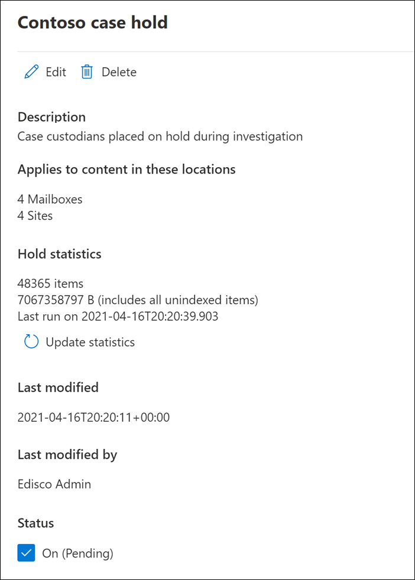

# <a name="create-an-ediscovery-hold"></a>Crear un caso de retención de eDiscovery

Puede usar un caso de exhibición de documentos electrónicos (estándar) de Microsoft Purview para crear retenciones para conservar el contenido que podría ser relevante para el caso. Puede colocar una suspensión en los buzones de Exchange y OneDrive para la Empresa cuentas de las personas que está investigando en el caso. También puede colocar una suspensión en los buzones y sitios asociados a Microsoft Teams, grupos de Office 365 y grupos de Yammer. Al colocar ubicaciones de contenido en espera, el contenido se conserva hasta que se quita la ubicación del contenido de la suspensión o hasta que se elimina la suspensión.

Después de crear una suspensión de eDiscovery, la suspensión puede tardar hasta 24 horas en surtir efecto.

Al crear una suspensión, tiene las siguientes opciones para limitar el contenido que se conserva en las ubicaciones de contenido especificadas:
  
- Cree una suspensión infinita donde todo el contenido de las ubicaciones especificadas esté en suspensión. Como alternativa, puede crear una retención basada en consultas en la que solo el contenido de las ubicaciones especificadas que coincida con una consulta de búsqueda se coloca en suspensión.

- Especifique un intervalo de fechas para conservar solo el contenido que se envió, recibió o creó dentro de ese intervalo de fechas. Como alternativa, puede contener todo el contenido en ubicaciones especificadas, independientemente de cuándo se haya enviado, recibido o creado.
  
## <a name="how-to-create-an-ediscovery-hold"></a>Cómo crear una suspensión de eDiscovery

Para crear una suspensión de eDiscovery asociada a un caso de exhibición de documentos electrónicos (estándar):
  
1. Vaya al <a href="https://go.microsoft.com/fwlink/p/?linkid=2077149" target="_blank">portal de cumplimiento de Microsoft Purview</a> e inicie sesión con las credenciales de la cuenta de usuario a la que se han asignado los permisos de eDiscovery adecuados.

2. En el panel de navegación izquierdo, haga clic en **Mostrar todo** y, a continuación, haga clic en **eDiscovery > Core**.

3. En la página **eDiscovery (Estándar),** haga clic en el nombre del caso en el que desea crear la suspensión.

4. En la página **Inicio** del caso, haga clic en la pestaña **Mantener** .
  
5. En la página **Suspensión** , haga clic en **Crear**.

6. En la página Nombre del asistente para **suspensión** , asigne un nombre a la suspensión y agregue una descripción opcional y, a continuación, haga clic en **Siguiente**. El nombre de la suspensión debe ser exclusivo en la organización.

7. En la página **Elegir ubicaciones** del asistente, elija las ubicaciones de contenido que desea colocar en espera. Puede retener buzones, sitios y carpetas públicas.

    
  
   1. **Buzones de Exchange**: establezca el botón de alternancia en **Activado** y después haga clic en **Elegir usuarios, grupos o equipos** para especificar los buzones para colocar en suspensión. Use el cuadro de búsqueda para encontrar buzones de usuario y grupos de distribución (para colocar una suspensión en los buzones de miembros de grupo) para suspenderlos. También puede colocar una suspensión en el buzón asociado para un equipo de Microsoft, un grupo de Office 365 y un grupo de Yammer. Para obtener más información sobre los datos de la aplicación que se conservan cuando se coloca un buzón en espera, vea [Contenido almacenado en buzones para eDiscovery](what-is-stored-in-exo-mailbox.md).

   2. **Sitios de SharePoint**: establezca el botón de alternancia en **Activado** y haga clic en **Elegir sitios** para especificar los sitios de SharePoint y las cuentas de OneDrive que se deben colocar en suspensión. Escriba la dirección URL de cada sitio que quiere colocar en suspensión. También puede agregar la dirección URL del sitio de SharePoint para un equipo de Microsoft, un grupo de Office 365 o un grupo de Yammer.
  
   3. **Carpetas públicas de Exchange**: establezca la opción de alternancia en **Activado** para poner todas las carpetas públicas en su organización de Exchange Online en suspensión. No puede elegir carpetas públicas específicas para poner en suspensión. Deje el botón de alternancia desactivado si no quiere establecer una suspensión en las carpetas públicas.

   > [!IMPORTANT]
   > Al agregar Exchange buzones o sitios de SharePoint a una suspensión, debe agregar explícitamente al menos una ubicación de contenido a la suspensión. En otras palabras, si establece el botón de alternancia **en Activado** para buzones o sitios, debe seleccionar buzones o sitios específicos para agregarlos a la suspensión. De lo contrario, se creará la suspensión de eDiscovery, pero no se agregarán buzones ni sitios a la suspensión y las estadísticas mostrarán que no hay ubicaciones o elementos de contenido en espera.

8. Cuando haya terminado de agregar ubicaciones a la suspensión, haga clic en **Siguiente**.

9. Para crear una suspensión basada en consultas con palabras clave o condiciones, siga estos pasos. Para conservar todo el contenido de las ubicaciones de contenido especificadas, haga clic en **Siguiente**.

    
  
    1. En el cuadro de **Palabras clave**, escriba una consulta para conservar solo el contenido que coincida con los criterios de consulta. Puede especificar palabras clave, propiedades de mensaje de correo electrónico o propiedades de sitio, como nombres de archivo. También puede usar consultas más complejas que usan un operador booleano, como **AND**, **OR** o **NOT**.

    2. Haga clic en **Agregar condición** para agregar una o varias condiciones para restringir la consulta para la suspensión. Cada condición agrega una cláusula a la consulta de búsqueda KQL que se crea y se ejecuta cuando se creala suspensión. Por ejemplo, puede especificar un intervalo de fechas para que se conserven los documentos de correo electrónico o de sitio creados dentro del intervalo de fechas. Una condición se conecta lógicamente a la consulta de palabras clave (especificada en el cuadro **Palabras clave**) y a otras condiciones mediante el operador **AND**. Esto significa que los elementos deben satisfacer la consulta de palabra clave y la condición que se va a conservar.

    Para obtener más información sobre cómo crear una consulta de búsqueda y usar condiciones, vea [Consultas de palabras clave y condiciones de búsqueda para eDiscovery](keyword-queries-and-search-conditions.md).

10. Después de configurar una suspensión basada en consultas, haga clic en **Siguiente**.

11. Revise la configuración (y edítelas si es necesario) y, a continuación, haga clic en **Enviar**.

> [!NOTE]
> Al crear una retención basada en consultas, todo el contenido de las ubicaciones seleccionadas se coloca inicialmente en suspensión. Posteriormente, cualquier contenido que no coincida con la consulta especificada se borra de la suspensión cada siete a 14 días. Sin embargo, una retención basada en consultas no borrará el contenido si se aplican más de cinco retenciones de cualquier tipo a una ubicación de contenido o si algún elemento tiene problemas de indexación.

## <a name="query-based-holds-placed-on-sites"></a>Retenciones basadas en consultas colocadas en sitios

Tenga en cuenta lo siguiente al colocar una suspensión de exhibición de documentos electrónicos basada en consultas en los documentos ubicados en SharePoint sitios:

- Una retención basada en consultas conserva inicialmente todos los documentos de un sitio durante un breve período de tiempo después de su eliminación. Esto significa que cuando se elimina un documento, se moverá a la biblioteca de suspensión de conservación aunque no coincida con los criterios de la retención basada en consultas. Sin embargo, los documentos eliminados que no coinciden con una retención basada en consultas se quitarán mediante un trabajo de temporizador que procesa la biblioteca de suspensión de conservación. El trabajo del temporizador se ejecuta periódicamente y compara todos los documentos de la biblioteca de suspensión de conservación con las retenciones de exhibición de documentos electrónicos basadas en consultas (y otros tipos de retenciones y directivas de retención). El trabajo del temporizador elimina los documentos que no coinciden con una retención basada en consultas y conserva los documentos que lo hacen.

- Las retenciones basadas en consultas no deben usarse para realizar la conservación de destino, como conservar documentos en una carpeta o sitio específicos o mediante otros criterios de retención basados en la ubicación. Si lo hace, puede tener resultados no deseados. Se recomienda usar criterios de retención no basados en ubicaciones, como palabras clave, intervalos de fechas u otras propiedades de documento para conservar los documentos del sitio.

## <a name="ediscovery-hold-statistics"></a>Estadísticas de suspensión de eDiscovery

Después de crear una suspensión de eDiscovery, se muestra información sobre la nueva suspensión en la página de control flotante de la suspensión seleccionada. Esta información incluye el número de buzones y sitios en espera y estadísticas sobre el contenido que se ha colocado en suspensión, como el número total y el tamaño de los elementos colocados en espera y la última vez que se calcularon las estadísticas de retención. Estas estadísticas de retención ayudan a identificar la cantidad de contenido relacionado con el caso que se conserva.
  

  
Tenga en cuenta lo siguiente sobre las estadísticas de suspensión de exhibición de documentos electrónicos:
  
- El número total de elementos en espera indica el número de elementos de todos los orígenes de contenido que se colocan en suspensión. Si ha creado una retención basada en consultas, esta estadística indica el número de elementos que coinciden con la consulta.

- El número de elementos en espera también incluye los elementos no indexados que se encuentran en las ubicaciones de contenido. Si crea una suspensión basada en consultas, todos los elementos no indexados de las ubicaciones de contenido se colocan en suspensión. Esto incluye elementos sin indexar que no coinciden con los criterios de búsqueda de una retención basada en consultas y elementos sin indexar que podrían estar fuera de una condición de intervalo de fechas. Esto es diferente de lo que sucede al ejecutar una búsqueda, en la que los elementos sin indexar que no coinciden con la consulta de búsqueda o que están excluidos por una condición de intervalo de fechas no se incluyen en los resultados de la búsqueda. Para obtener más información sobre los elementos sin indexar, vea [Elementos indizados parcialmente](partially-indexed-items-in-content-search.md).

- Para obtener las estadísticas de retención más recientes, haga clic en **Actualizar estadísticas** para volver a ejecutar una estimación de búsqueda que calcule el número actual de elementos en espera.

- Es normal que el número de elementos en espera aumente con el tiempo porque los usuarios cuyo buzón de correo o sitio está en espera suelen enviar o recibir nuevos mensajes de correo electrónico y crear nuevos documentos en SharePoint y OneDrive.

- Si un buzón de Exchange, SharePoint sitio o OneDrive cuenta se mueve a una región diferente en un entorno multigeográfico, las estadísticas de ese sitio no se incluirán en las estadísticas de retención. Pero el contenido de esas ubicaciones se conservará. Además, si un buzón de correo o sitio se mueve a otra región, la dirección SMTP o la dirección URL que se muestran en la suspensión no se actualizarán automáticamente. Tendrá que editar la suspensión y actualizar la dirección URL o SMTP para que las ubicaciones de contenido se incluyan de nuevo en las estadísticas de retención.

## <a name="search-locations-on-ediscovery-hold"></a>Ubicaciones de búsqueda en suspensión de eDiscovery

Al [buscar contenido](search-for-content-in-core-ediscovery.md) en un caso de exhibición de documentos electrónicos (estándar), puede configurar rápidamente la búsqueda para buscar solo las ubicaciones de contenido que se han colocado en una suspensión asociada al caso.

Seleccione la opción **Ubicaciones en espera** para buscar en todas las ubicaciones de contenido que se han colocado en espera. Si el caso contiene varias retenciones de eDiscovery, se buscarán las ubicaciones de contenido de todas las retenciones al seleccionar esta opción. Además, si se ha colocado una ubicación de contenido en una retención basada en consultas, solo se buscarán los elementos que coincidan con la consulta de suspensión al ejecutar la búsqueda. En otras palabras, solo el contenido que coincide con los criterios de retención y los criterios de búsqueda se devuelve con los resultados de la búsqueda. Por ejemplo, si un usuario se colocaba en la retención de mayúsculas y minúsculas basada en consultas que conserva los elementos que se enviaron o crearon antes de una fecha específica, solo se buscarían esos elementos. Esto se logra conectando la consulta de retención de casos y la consulta de búsqueda mediante un operador **AND** .

Estas son algunas otras cosas que debe tener en cuenta al buscar ubicaciones en suspensión de exhibición de documentos electrónicos:

- Si una ubicación de contenido forma parte de varias retenciones en el mismo caso, los operadores **OR** combinan las consultas de retención al buscar esa ubicación de contenido mediante la opción de contenido de todos los casos. De forma similar, si una ubicación de contenido forma parte de dos retenciones diferentes, donde una se basa en consultas y la otra es una suspensión infinita (donde todo el contenido se coloca en suspensión), todo el contenido se busca debido a la suspensión infinita.

- Si una búsqueda está configurada para buscar ubicaciones en espera y, a continuación, cambia una suspensión de exhibición de documentos electrónicos en el caso (agregando o quitando una ubicación o cambiando una consulta de suspensión), la configuración de búsqueda se actualiza con esos cambios. Sin embargo, tiene que volver a ejecutar la búsqueda después de cambiar la suspensión para actualizar los resultados de la búsqueda.

- Si se colocan varias retenciones de eDiscovery en una sola ubicación en un caso de exhibición de documentos electrónicos y selecciona buscar ubicaciones en espera, el número máximo de palabras clave para esa consulta de búsqueda es 500. Esto se debe a que la búsqueda combina todas las retenciones basadas en consultas mediante el operador **OR** . Si hay más de 500 palabras clave en las consultas de suspensión combinadas y en la consulta de búsqueda, se busca todo el contenido del buzón, no solo el contenido que coincide con las retenciones de mayúsculas y minúsculas basadas en consultas.

- Si una suspensión de eDiscovery tiene el estado **Activado (Pendiente),** puede buscar en las ubicaciones en espera mientras se activa la suspensión.

## <a name="preserve-content-in-microsoft-teams"></a>Conservar el contenido en Microsoft Teams

Las conversaciones que forman parte de un canal de Microsoft Teams se almacenan en el buzón de correo asociado al equipo de Microsoft. Asimismo, los archivos que los miembros del equipo comparten en un canal se almacenan en el sitio de SharePoint del equipo. Por lo tanto, debe colocar el buzón de correo de Equipo y SharePoint sitio en suspensión de eDiscovery para conservar las conversaciones y los archivos en un canal.

Como alternativa, las conversaciones que forman parte de la lista chat en Teams (*llamadas chats 1:1 o chats* de *grupo 1:N*) se almacenan en los buzones de los usuarios que participan en el chat. Y los archivos que los usuarios comparten en las conversaciones de chat se almacenan en la cuenta de OneDrive del usuario que comparte el archivo. Por lo tanto, tiene que agregar los buzones de usuario individuales y las cuentas de OneDrive a una suspensión de eDiscovery para conservar las conversaciones y los archivos de la lista de chat. Es una buena idea colocar una suspensión en los buzones de los miembros de un equipo de Microsoft, además de colocar el buzón de equipo y el sitio en espera.

> [!NOTE]
> Si su organización tiene una implementación híbrida Exchange (o su organización sincroniza una organización de Exchange local con Office 365) y ha habilitado Microsoft Teams, los usuarios locales pueden usar la aplicación de chat Teams y participar en chats 1:1 y chats de grupo 1:N. Estas conversaciones se almacenan en un almacenamiento basado en la nube asociado a un usuario local. Si un usuario local se coloca en una suspensión de eDiscovery, se conservará el contenido de chat Teams en el almacenamiento basado en la nube. Para obtener más información, consulte [Buscar los datos de chat de Teams de usuarios locales](search-cloud-based-mailboxes-for-on-premises-users.md).

Para obtener más información sobre cómo conservar Teams contenido, consulte [Colocación de un usuario o equipo de Microsoft Teams en suspensión legal](/MicrosoftTeams/legal-hold).

### <a name="preserve-card-content"></a>Conservar el contenido de la tarjeta

De forma similar, el contenido de tarjeta generado por las aplicaciones en canales de Teams, chats 1:1 y chats de grupo 1:N se almacena en buzones de correo y se conserva cuando se coloca un buzón en una suspensión de eDiscovery. Una *tarjeta* es un contenedor de IU para pequeños fragmentos de contenido. Las tarjetas pueden tener varias propiedades y datos adjuntos, y pueden incluir botones que desencadenan acciones de tarjeta. Para obtener más información, vea [Tarjetas](/microsoftteams/platform/task-modules-and-cards/what-are-cards). Igual que el resto de contenido de Teams, el lugar donde se almacena el contenido de las tarjetas depende de dónde se haya usado. El contenido de tarjetas usado en un canal de Teams se almacena en el buzón del grupo de Teams. El contenido de tarjetas de los chats 1x1 y 1xN se almacena en los buzones de los participantes de los chats.

### <a name="preserve-meeting-and-call-information"></a>Conservación de la información de reuniones y llamadas

La información de resumen de las reuniones y llamadas en un canal de Teams también se almacena en los buzones de los usuarios que llamaron a la reunión o llamada. Este contenido también se conserva cuando se coloca una suspensión de eDiscovery en los buzones de usuario.

### <a name="preserve-content-in-private-channels"></a>Conservación del contenido en canales privados

A partir de febrero de 2020, también activamos la capacidad de conservar contenido en canales privados. Dado que los chats de canales privados se almacenan en los buzones de los participantes del chat, colocar un buzón de usuario en la suspensión de eDiscovery conservará los chats del canal privado. Además, si un buzón de usuario se colocó en una suspensión de eDiscovery antes de febrero de 2020, la suspensión ahora se aplicará automáticamente a los mensajes de canal privado almacenados en ese buzón. También se admite la conservación de archivos compartidos en canales privados.

### <a name="preserve-wiki-content"></a>Conservación del contenido wiki

Cada canal de equipo o equipo también contiene una wiki para tomar notas y colaborar. El contenido de esta se guarda automáticamente en un archivo con un formato .mht. Este archivo se almacena en la biblioteca de documentos de Datos Wiki de Teams en el sitio de SharePoint del equipo. Puede conservar el contenido de la wiki agregando el sitio de SharePoint del equipo a una suspensión de eDiscovery.

> [!NOTE]
> El 22 de junio de 2017 se publicó la capacidad de conservar el contenido wiki de un canal de equipo o equipo (cuando coloca el sitio de SharePoint del equipo en espera). Si un sitio de equipo está en espera, el contenido wiki se conservará a partir de esa fecha. Sin embargo, si un sitio de equipo está en espera y el contenido wiki se eliminó antes del 22 de junio de 2017, el contenido wiki no se conservaba.

### <a name="office-365-groups"></a>Grupos de Office 365

Teams se basa en grupos de Office 365. Por lo tanto, colocar Office 365 grupos en suspensión de eDiscovery es similar colocar Teams contenido en espera.

Tenga en cuenta lo siguiente al colocar grupos de Teams y Office 365 en una suspensión de eDiscovery:

- Como se explicó anteriormente, para colocar contenido ubicado en Teams y Office 365 Grupos en espera, debe especificar el buzón y SharePoint sitio asociado a un grupo o equipo.

- Ejecute el cmdlet **Get-UnifiedGroup** en [Exchange Online PowerShell](/powershell/exchange/connect-to-exchange-online-powershell) para ver las propiedades de Teams y grupos de Office 365. Esta es una buena manera de obtener la dirección URL del sitio asociado a un equipo o grupo de Office 365. Por ejemplo, el comando siguiente muestra las propiedades seleccionadas de un grupo de Office365 denominado Senior Leadership Team:

    ```text
    Get-UnifiedGroup "Senior Leadership Team" | FL DisplayName,Alias,PrimarySmtpAddress,SharePointSiteUrl

    DisplayName            : Senior Leadership Team
    Alias                  : seniorleadershipteam
    PrimarySmtpAddress     : seniorleadershipteam@contoso.onmicrosoft.com
    SharePointSiteUrl      : https://contoso.sharepoint.com/sites/seniorleadershipteam
    ```

    > [!NOTE]
    > Para ejecutar el cmdlet **Get-UnifiedGroup** debe tener asignado el rol de destinatarios con permiso de vista en Exchange Online o ser un miembro de un grupo de roles que tenga asignado el rol de destinatarios con permiso de vista. 
  
- Cuando se busca el buzón de un usuario, no se buscará en ningún equipo o grupo de Office 365 del que sea miembro el usuario. De forma similar, cuando coloca un equipo o un grupo Office 365 en suspensión de exhibición de documentos electrónicos, solo el buzón de grupo y el sitio de grupo se colocan en espera. Los buzones de correo y los sitios de OneDrive para la Empresa de los miembros del grupo no se colocan en espera a menos que los agregue explícitamente a la suspensión de eDiscovery. Por lo tanto, si tiene que poner un equipo o Office 365 grupo en espera por un motivo legal, considere la posibilidad de agregar los buzones y las cuentas de OneDrive de los miembros del equipo o grupo en la misma suspensión.

- Para obtener una lista de los miembros de un equipo o grupo de Office 365, puede ver las propiedades en la página <a href="https://go.microsoft.com/fwlink/p/?linkid=2052855" target="_blank">**Grupos**</a> de la Centro de administración de Microsoft 365. Además, puede ejecutar el comando siguiente en PowerShell de Exchange Online:

    ```powershell
    Get-UnifiedGroupLinks <group or team name> -LinkType Members | FL DisplayName,PrimarySmtpAddress
    ```

    > [!NOTE]
    > Para ejecutar el cmdlet **Get-UnifiedGroupLinks** debe tener asignado el rol de destinatarios con permiso de vista en Exchange Online o ser un miembro de un grupo de roles que tenga asignado el rol de destinatarios con permiso de vista.

## <a name="preserve-content-in-onedrive-accounts"></a>Conservación del contenido en cuentas de OneDrive

Para recopilar una lista de las direcciones URL de los sitios de OneDrive para la Empresa de su organización para que pueda agregarlas a una suspensión o búsqueda asociada a un caso de exhibición de documentos electrónicos, consulte [Creación de una lista de todas las ubicaciones OneDrive de su organización](/onedrive/list-onedrive-urls). El script de este artículo crea un archivo de texto que contiene una lista de todos los sitios OneDrive de la organización. Para ejecutar este script, tiene que instalar y usar el Shell de SharePoint Online Management. Asegúrese de anexar la dirección URL para el dominio MiSitio de su organización a cada sitio de OneDrive que quiera buscar. Este es el dominio que contiene todos los sitios OneDrive; por ejemplo, `https://contoso-my.sharepoint.com`. Este es un ejemplo de una dirección URL para un sitio de usuario de OneDrive: `https://contoso-my.sharepoint.com/personal/sarad_contoso_onmicrosoft.com`.

> [!IMPORTANT]
> La dirección URL de la cuenta de OneDrive de un usuario incluye su nombre principal de usuario (UPN) (por ejemplo, `https://alpinehouse-my.sharepoint.com/personal/sarad_alpinehouse_onmicrosoft_com`). En el caso poco frecuente de que se cambie el UPN de una persona, su dirección URL de OneDrive también cambiará para incorporar el nuevo UPN. Si la cuenta de OneDrive de un usuario forma parte de una suspensión de eDiscovery, antigua y su UPN cambia, debe actualizar la suspensión y tendrá que actualizar la suspensión y agregar la nueva dirección URL de OneDrive del usuario y quitar la anterior. Para más información, consulte [Cómo afectan los cambios de UPN a la dirección URL de OneDrive](/onedrive/upn-changes).

## <a name="removing-content-locations-from-an-ediscovery-hold"></a>Eliminación de ubicaciones de contenido de una suspensión de eDiscovery

Después de quitar un buzón de correo, SharePoint sitio o OneDrive cuenta de una suspensión de eDiscovery, se aplica una *suspensión de retraso*. Esto significa que la eliminación real de la suspensión se retrasa durante 30 días para evitar que los datos se eliminen (purguen) de forma permanente desde una ubicación de contenido. Esto ofrece a los administradores la oportunidad de buscar o recuperar contenido que se purgará después de quitar una suspensión de eDiscovery. Los detalles de cómo funciona la retención de retraso para buzones y sitios son diferentes.

- **Buzones:** Una suspensión de retraso se coloca en un buzón la próxima vez que el Asistente para carpetas administradas procesa el buzón y detecta que se quitó una suspensión de eDiscovery. En concreto, se aplica una retención retrasada a un buzón cuando el Asistente para carpetas administradas establece una de las siguientes propiedades de buzón en **True**:

   - **DelayHoldApplied:** Esta propiedad se aplica al contenido relacionado con el correo electrónico (generado por personas que usan Outlook y Outlook en la Web) que se almacena en el buzón de un usuario.

   - **DelayReleaseHoldApplied:** Esta propiedad se aplica al contenido basado en la nube (generado por aplicaciones que no son Outlook como Microsoft Teams, Microsoft Forms y Microsoft Yammer) que se almacena en el buzón de un usuario. Los datos en la nube generados por una aplicación de Microsoft se almacenan normalmente en una carpeta oculta en el buzón de un usuario.

   Cuando se coloca una suspensión de retraso en el buzón (cuando cualquiera de las propiedades anteriores se establece en **True**), el buzón sigue considerándose que está en espera durante una duración de suspensión ilimitada, como si el buzón estuviera en suspensión por juicio. Después de 30 días, la suspensión de retraso expira y Microsoft 365 intentará quitar automáticamente la suspensión de retraso (estableciendo la propiedad DelayHoldApplied o DelayReleaseHoldApplied en **False**) para que se quite la suspensión. Después de establecer cualquiera de estas propiedades en **False**, los elementos correspondientes marcados para la eliminación se purgan la próxima vez que el Asistente para carpetas administradas procese el buzón.

   Para obtener más información, consulte [Gestionar buzón con una retención de retraso](identify-a-hold-on-an-exchange-online-mailbox.md#managing-mailboxes-on-delay-hold).

- **sitios SharePoint y OneDrive:** cualquier contenido SharePoint o OneDrive que se conserve en la biblioteca de suspensión de conservación no se elimina durante el período de suspensión de retraso de 30 días después de que se quite un sitio de una suspensión de eDiscovery. Esto es similar a lo que ocurre cuando un sitio se libera de una directiva de retención. Además, no puede eliminar manualmente este contenido en la biblioteca de suspensión de conservación durante el período de retención de retraso de 30 días. 

   Para obtener más información, consulte [Publicación de una directiva para la retención](retention.md#releasing-a-policy-for-retention).

También se aplica una suspensión de retraso a las ubicaciones de contenido en espera cuando se cierra un caso de exhibición de documentos electrónicos (estándar), ya que las retenciones se desactivan cuando se cierra un caso. Para obtener más información sobre cómo cerrar un caso, vea [Cerrar, volver a abrir y eliminar un caso de exhibición de documentos electrónicos (estándar).](close-reopen-delete-core-ediscovery-cases.md)

## <a name="ediscovery-hold-limits"></a>Límites de suspensión de eDiscovery

En la tabla siguiente se enumeran los límites de los casos de eDiscovery y las retenciones de mayúsculas y minúsculas.

  | Descripción del límite | Límite |
  |:-----|:-----|
  |Número máximo de casos para una organización.  <br/> |Sin límite  <br/> |
  |Número máximo de directivas de suspensión de eDiscovery para una organización. Este límite incluye el total combinado de directivas de suspensión en casos de eDiscovery (Estándar) y eDiscovery (Premium).  <br/> |10 <sup>0001</sup>  <br/> |
  |Número máximo de buzones en una única suspensión de eDiscovery. Este límite incluye el total combinado de buzones de usuario y los buzones asociados a Grupos de Microsoft 365, Microsoft Teams y grupos de Yammer.  <br/> |1,000  <br/> |
  |Número máximo de sitios en una única suspensión de eDiscovery. Este límite incluye el total combinado de sitios de OneDrive para la Empresa, sitios SharePoint y los sitios asociados con Grupos de Microsoft 365, Microsoft Teams y grupos de Yammer.  <br/> |100  <br/> |
  |Número máximo de casos que se muestran en la página principal de eDiscovery y el número máximo de elementos que se muestran en las pestañas Holds, Searches y Export dentro de un caso.  |10001<sup></sup>|

   > [!NOTE]
   > <sup>1</sup> Para ver una lista de más de 1000 casos, retenciones, búsquedas o exportaciones, puede usar el cmdlet de PowerShell security & compliance correspondiente:
   >
   > - [Get-ComplianceCase](/powershell/module/exchange/get-compliancecase)
   > - [Get-CaseHoldPolicy](/powershell/module/exchange/get-caseholdpolicy)
   > - [Get-ComplianceSearch](/powershell/module/exchange/get-compliancesearch)
   > - [Get-ComplianceSearchAction](/powershell/module/exchange/get-compliancesearchaction)
