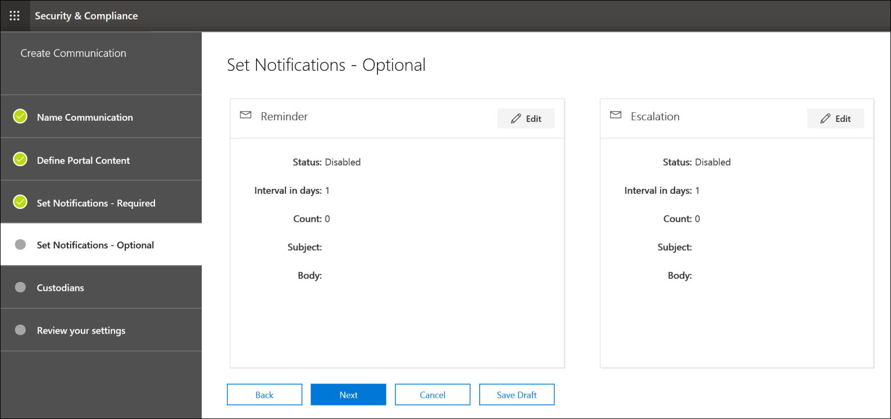

# Crear un aviso de retención legalCreate a legal hold notice

Con las comunicaciones de administrador de eDiscovery avanzado, las organizaciones pueden administrar su flujo de trabajo en torno a la comunicación con los administradores.Using Advanced eDiscovery custodian communications, organizations can manage their workflow around communicating with custodians. A través de la herramienta de comunicaciones, los equipos legales pueden enviar, recopilar y realizar un seguimiento de las notificaciones de retención legal de forma sistemática.Through the Communications tool, legal teams can systematically send, collect, and track legal hold notifications. El proceso de creación flexible también permite a los equipos personalizar el flujo de trabajo de notificación de retención y el contenido de los avisos enviados a los administradores.The flexible creation process also allows teams to customize the hold notification workflow and the content in the notices sent to custodians.

En el artículo se describen los pasos del flujo de trabajo de notificación de retención.The article outlines the steps in the hold notification workflow.

## Paso 1: Especificar detalles de comunicaciónStep 1: Specify communication details

El primer paso es especificar los detalles adecuados para los avisos de retención legal u otras comunicaciones de administrador.The first step is to specify the appropriate details for legal hold notices or other custodian communications.

1. En el Centro de & cumplimiento, vaya a **eDiscovery > eDiscovery** avanzado para mostrar la lista de casos de su organización.In the Security & Compliance Center, go to **eDiscovery > Advanced eDiscovery** to display the list of cases in your organization.

2. Seleccione un caso, haga clic en la **pestaña** Comunicaciones y, a continuación, haga clic **en Nueva comunicación.**Select a case, click the **Communications** tab, and then click **New communication**.

3. En la **página Comunicación de** nombre, especifique los siguientes detalles de comunicación (obligatorios).On the **Name communication** page, specify the following (required) communication details.

    - **Nombre:** este es el nombre de la comunicación.**Name**: This is the name for the communication.

    - **Responsable de emisión:** la lista desplegable muestra una lista de miembros del caso.**Issuing officer**: The dropdown list displays a list of case members. Para obtener más información sobre cómo agregar nuevos miembros a un caso, vea [Crear un caso de eDiscovery avanzado.](create-and-manage-advanced-ediscoveryv2-case.md#create-a-case)For more information on how to add new members to a case, see [Create an Advanced eDiscovery case](create-and-manage-advanced-ediscoveryv2-case.md#create-a-case). Cada aviso enviado a los administradores se enviará en nombre del oficial emisor especificado.Each notice sent to custodians will be sent on behalf of the specified issuing officer.

> [!NOTE]
> El oficial emisor debe tener un **buzón activo para** aparecer en la lista desplegable De oficiales emisoresThe issuing officer must have an **active mailbox** to show up in the Issuing Officer dropdown

4. Haga clic en **Siguiente**.Click **Next**.

## Paso 2: Definir el contenido del portalStep 2: Define the portal content

A continuación, puede crear y agregar el contenido del aviso de retención.Next, you can create and add the content of the hold notice. En la **página Definir contenido del portal** del Asistente **para** crear comunicación, especifique el contenido del aviso de retención.On the **Define portal content** page in the **Create communication** wizard, specify the contents of the hold notice. Este contenido se anexará automáticamente a los avisos de emisión, reemisión, aviso y escalación.This content will be automatically appended to the Issuance, Re-Issue, Reminder, and Escalation notices. Además, este contenido aparecerá en el Portal de cumplimiento del administrador.Additionally, this content will appear in the custodian's Compliance Portal. 

Para crear el contenido del portal:To create the portal content:

1. Escriba (o corte y pegue desde otro documento) el aviso de retención en el cuadro de texto para el contenido del portal.Type (or cut and paste from another document) your hold notice in the textbox for the portal content. 

2. Inserte variables de combinación en su aviso para personalizar el aviso y compartir el Portal de cumplimiento de administradores.Insert merge variables into your notice to customize the notice and share the Custodian Compliance Portal.

3. Haga clic en **Siguiente**.Click **Next**.

  >[!Tip]
  >Para obtener más información acerca de cómo personalizar el contenido y el formato del contenido del portal, [vea Usar el Editor de comunicaciones.](using-communications-editor.md)To learn more about how to can customize the content and format of the portal content, see [Use the Communications Editor](using-communications-editor.md).

## Paso 3: Establecer las notificaciones necesariasStep 3: Set the required notifications

Después de definir el contenido del aviso de retención, puede configurar los flujos de trabajo para enviar y administrar el proceso de notificación.After you've defined the contents of the hold notice, you can set up the workflows around sending and managing the notification process. Las notificaciones son mensajes de correo electrónico que se envían para notificar y seguir con los administradores.Notifications are email messages that are sent to notify and follow up with custodians. Todos los administradores agregados a la comunicación recibirán la misma notificación.Every custodian added to the communication will receive the same notification. 

Para configurar y enviar un aviso de retención, debes incluir las notificaciones de emisión, nueva emisión y lanzamiento.To set up and send a hold notice, you must include Issuance, Re-Issuance, and Release notifications.

### Notificación de emisiónIssuance notification 

Una vez creada la  comunicación, el responsable emisor especificado inicia la notificación de emisión.After the communication is created, the **Issuance Notification** is initiated by the specified Issuing Officer. La notificación de emisión es la primera comunicación que se envía al administrador para informarle sobre sus obligaciones de conservación.The Issuance notification is the first communication sent to the custodian to inform them about their preservation obligations. 

Para crear una notificación de emisión:To create an issuance notification:

1. En el icono **Emisión,** haga clic **en Editar**.In the **Issuance** tile, click **Edit**.

2. Si es necesario, agregue miembros o personal de casos adicionales a los **campos CC** y **CCO.**If necessary, add additional case members or staff to the **Cc** and **Bcc** fields. Para agregar varios usuarios a estos campos, separe las direcciones de correo electrónico con punto y coma.To add multiple users to these fields, separate email addresses with a semi-colon.

3. Especifique el **asunto** del aviso (obligatorio).Specify the **Subject** for the notice (required).

4. Especifique el contenido o las instrucciones adicionales que desea proporcionar al administrador (obligatorio).Specify the contents or additional instructions that you would like to provide to the custodian (required). El contenido del portal que definió en el paso 2 se agrega al final del aviso de emisión.The portal content you defined in Step 2 is added to the end of the issuance notice. 

5. Haga clic en **Guardar**.Click **Save**.

### Re-Issuance notificaciónRe-Issuance notification

A medida que el caso avanza, es posible que los administradores deban conservar datos adicionales o inferiores a los que se instruyeron anteriormente.As the case progresses, custodians may be required to preserve additional or less data than was previously instructed. Después de actualizar el contenido del portal, se envía la notificación de nueva emisión y se avisa a los administradores sobre cualquier cambio en sus obligaciones de conservación.After you update the portal content, the re-issuance notification is sent and alerts custodians about any changes to their preservation obligations.

Para crear una notificación de nueva emisión:To create a re-issuance notification:

1. En el icono **De nuevo,** haga clic en **Editar**.In the **Reissue** tile, click **Edit**.

2. Si es necesario, agregue miembros o personal de casos adicionales a los **campos CC** y **CCO.**If necessary, add additional case members or staff to the **Cc** and **Bcc** fields. Para agregar varios usuarios a estos campos, separe las direcciones de correo electrónico con punto y coma.To add multiple users to these fields, separate email addresses with a semi-colon.

3. Especifique el **asunto** del aviso (obligatorio).Specify the **Subject** for the notice (required).

4. Especifique el contenido o las instrucciones adicionales que desea proporcionar al administrador (obligatorio).Specify the contents or additional instructions that you would like to provide to the custodian (required). El contenido del portal que definió en el paso 2 se agrega al final del aviso de ree emisión.The portal content you defined in Step 2 is added to the end of the re-issuance notice.

5. Haga clic en **Guardar**.Click **Save**.

> [!NOTE]
> Si se modifica el contenido del portal (en la página Definir contenido del **portal** en el Asistente para editar comunicación), la notificación de nueva emisión se enviará automáticamente a todos los administradores asignados al aviso. If the portal content is modified (on the **Define Portal Content** page in the **Edit communication** wizard), the re-issuance notification will be automatically sent to all custodians assigned to the notice. Después de enviar la notificación, se pedirá a los administradores que vuelvan a confirmar su aviso de retención.After the notification is sent, custodians will be asked to re-acknowledge their hold notice. Si ha configurado algún flujo de trabajo de recordatorio o escalación, también se volverán a iniciar.If you have set up any reminder or escalation workflows, these will also re-start. Para obtener más información acerca de qué otros eventos de administración de casos desencadenan las comunicaciones, vea [Eventos que desencadenan notificaciones.](#events-that-trigger-notifications)For more information about what other case management events trigger communications, see [Events that trigger notifications](#events-that-trigger-notifications).

### Notificación de lanzamientoRelease notification

Una vez resuelto un asunto o si un administrador ya no está sujeto a la conservación del contenido, puede liberar al administrador de un caso.After a matter is resolved or if a custodian is no longer subject to preserve content, you can release the custodian from a case. Si el administrador recibió previamente un aviso de retención, la notificación de lanzamiento puede usarse para avisar a los administradores de que han sido liberados de su obligación.If the custodian was previously issued a hold notice, the release notification can be used to alert custodians that they have been released from their obligation.

Para crear una notificación de lanzamiento:To create a release notification: 

1. En el icono **Liberar,** haga clic **en Editar**.In the **Release** tile, click **Edit**.

2. Si es necesario, agregue miembros o personal de casos adicionales a los **campos CC** y **CCO.**If necessary, add additional case members or staff to the **Cc** and **Bcc** fields. Para agregar varios usuarios a estos campos, separe las direcciones de correo electrónico con punto y coma.To add multiple users to these fields, separate email addresses with a semi-colon.

3. Especifique el **asunto** del aviso (obligatorio).Specify the **Subject** for the notice (required).

4. Especifique el contenido o las instrucciones adicionales que desea proporcionar al administrador (obligatorio).Specify the contents or additional instructions that you would like to provide to the custodian (required).

5. Haga **clic en** Guardar y vaya al paso siguiente.Click **Save** and go to the next step.

## (Opcional) Paso 4: Establecer las notificaciones opcionales(Optional) Step 4: Set the optional notifications

Opcionalmente, puede simplificar el flujo de trabajo para realizar un seguimiento con los administradores que no responde mediante la creación y programación de avisos automatizados y notificaciones de escalación.Optionally, you can simplify the workflow for following up with unresponsive custodians by creating and scheduling automated reminder and escalation notifications.

### RemindersReminders

Después de enviar una notificación de retención, puede realizar un seguimiento de los administradores que no responde definiendo un flujo de trabajo de aviso.After you have sent a hold notification, you can follow up with unresponsive custodians by defining a reminder workflow.

Para programar avisos:To schedule reminders:

1. En el icono **Aviso,** haga clic **en Editar**.In the **Reminder** tile, click **Edit**.

2. Habilite el **flujo de trabajo** Aviso activando el botón de **alternancia** Estado (obligatorio).Enable the **Reminder** workflow by turning on the **Status** toggle (required).

3. Especifica el **intervalo de aviso (en días)** (obligatorio).Specify the **Reminder interval (in days)** (required). Este es el número de días que hay que esperar antes de enviar la primera notificación de aviso y seguimiento.This is the number of days to wait before sending the first and follow-up reminder notifications. Por ejemplo, si establece el intervalo de aviso en siete días, el primer aviso se enviará siete días después de que se emitió inicialmente la notificación de retención.For example, if you set the reminder interval to seven days, then the first reminder would be sent seven days after the hold notification was initially issued. Todos los avisos subsiguientes también se enviarían cada siete días.All subsequent reminders would also be sent every seven days.

4. Especifica el **número de avisos** (obligatorio).Specify the **Number of reminders** (required). Este campo especifica cuántos avisos enviar a los administradores que no responde.This field specifies how many reminders to send to unresponsive custodians. Por ejemplo, si establece el número de avisos en 3, un administrador recibiría un máximo de tres avisos.For example, if you set the number of reminders to 3, then a custodian would receive a maximum of three reminders. Después de que un administrador confirme la notificación de retención, los avisos ya no se enviarán a ese usuario.After a custodian acknowledges the hold notification, reminders will no longer be sent to that user.

5. Especifique el **asunto** del aviso (obligatorio).Specify the **Subject** for the notice (required). 

6. Especifique el contenido o las instrucciones adicionales que desea proporcionar al administrador (obligatorio).Specify the contents or additional instructions that you would like to provide to the custodian (required). El contenido del portal que definió en el paso 2 se agrega al final del aviso de aviso.The portal content you defined in Step 2 is added to the end of the reminder notice.

7. Haga **clic en** Guardar y vaya al paso siguiente.Click **Save** and go the next step.

### EscalacionesEscalations

En algunas situaciones, es posible que necesite formas adicionales de realizar un seguimiento con los administradores que no responde.In some situations, you may need additional ways to follow up with unresponsive custodians. Si un administrador no confirma una notificación de retención después de recibir el número especificado de avisos, el equipo legal puede especificar un flujo de trabajo para enviar automáticamente un aviso de escalación al administrador y a su administrador.If a custodian doesn't acknowledge a hold notification after receiving the specified number of reminders, the legal team can specify a workflow to automatically send an escalation notice to the custodian and their manager.

Para programar escalaciones:To schedule escalations:

1. En el icono **Escalación,** haga clic **en Editar**.In the **Escalation** tile, click **Edit**.

2. Habilite el **flujo de trabajo de** escalación activando el botón de **alternancia** estado.Enable the **Escalation** workflow by turning on the **Status** toggle.

3. Especifique el **intervalo de escalación (en días)** (obligatorio).Specify the **Escalation interval (in days)** (required).

4. Especifique el **número de escalaciones** (obligatorio).Specify the **Number of escalations** (required). Este campo especifica el número de escalaciones que se enviarán a los administradores que no responde.This field specifies how many escalations to send to unresponsive custodians. Por ejemplo, si establece el número de escalaciones en 3, se enviará un aviso de escalación al administrador y a su administrador un máximo de tres veces.For example, if you set the number of escalations to 3, then an escalation notice would be sent to the custodian and their manager a maximum of three times. Después de que un administrador reconozca la notificación de retención, las escalaciones ya no se enviarán.After a custodian acknowledges the hold notification, escalations will no longer be sent.

5. Especifique el **asunto** del aviso (obligatorio).Specify the **Subject** for the notice (required). 

6. Especifique el contenido o las instrucciones adicionales que desea proporcionar al administrador (obligatorio).Specify the contents or additional instructions that you would like to provide to the custodian (required). El contenido del portal que definió en el paso 2 se agrega al final del aviso de escalación.The portal content you defined in Step 2 is added to the end of the escalation notice.

7. Haga **clic en** Guardar y vaya al paso siguiente.Click **Save** and go the next step.

## Paso 5: Asignar administradores para recibir notificacionesStep 5: Assign custodians to receive notifications

Una vez que haya finalizado el contenido de las notificaciones, seleccione los administradores a los que desea enviar notificaciones.After you have finalized the content for notifications, select the custodians that you would like to send notifications to. 

Para agregar administradores:To add custodians:

1. Asigne administradores a la comunicación haciendo clic en la casilla situada junto a su nombre.Assign custodians to the communication by clicking the checkbox next to their name.

    Después de crear la comunicación, el flujo de trabajo de notificación se aplicará automáticamente a los administradores seleccionados.After the communication is created, the notification workflow will automatically apply to the selected custodians.

2. Haga **clic en Siguiente** para revisar la configuración y los detalles de comunicación.Click **Next** to review the communication settings and details.

>[!NOTE]
>Solo puede agregar administradores que se hayan agregado al caso y que no hayan recibido otra notificación dentro del caso.You can only add custodians who have been added to the case and haven't been sent another notification within the case.

## Paso 6: Revisar la configuraciónStep 6: Review settings

Después de revisar la  configuración y hacer clic en Enviar para completar la comunicación, el sistema iniciará automáticamente el flujo de trabajo de comunicación enviando el aviso de emisión.After you review the settings and click **Send** to complete the communication, the system will automatically start the communication workflow by sending the issuance notice.

## Eventos que desencadenan notificacionesEvents that trigger notifications

En la siguiente tabla se describen los eventos del proceso de administración de casos que se desencadenan cuando se envían los distintos tipos de notificaciones a los administradores.The following table describes events in the case management process that trigger when the different types of notifications are sent to custodians.

|Tipo de comunicaciónType of communication|TriggerTrigger |
|:---------|:---------|
|Avisos de emisiónIssuance notices|La creación inicial de la notificación.The initial creation of the notification. También puedes reenviar manualmente una notificación de retención.You can also manually resend a hold notification. |
|Volver a emitir avisosRe-issuance notices|Actualizar el contenido del portal en la **página Definir contenido del portal** en el Asistente para **edición de** comunicaciones.Updating the portal content on the **Define Portal Content** page in the **Edit communication** wizard.|
|Avisos de lanzamientoRelease notices|El administrador se libera del caso.The custodian is released from the case.|
|RemindersReminders|Intervalo y número de avisos configurados para el aviso.The interval and number of reminders configured for the reminder.|
|EscalacionesEscalations|Intervalo y número de avisos configurados para la escalación.The interval and number of reminders configured for the escalation.|
|||
