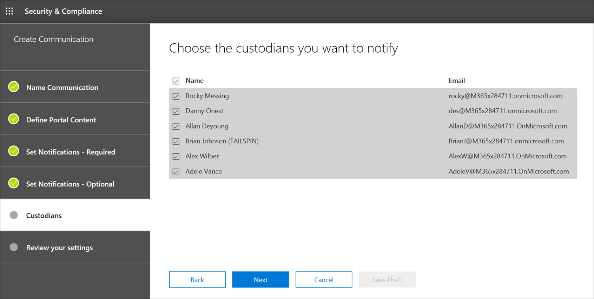

# Crear un aviso de retención legal

Con las comunicaciones de administrador de eDiscovery avanzado, las organizaciones pueden administrar su flujo de trabajo en torno a la comunicación con los administradores. A través de la herramienta de comunicaciones, los equipos legales pueden enviar, recopilar y realizar un seguimiento de las notificaciones de retención legal de forma sistemática. El proceso de creación flexible también permite a los equipos personalizar el flujo de trabajo de notificación de retención y el contenido de los avisos enviados a los administradores.

En el artículo se describen los pasos del flujo de trabajo de notificación de retención.

## Paso 1: Especificar detalles de comunicación

El primer paso es especificar los detalles adecuados para los avisos de retención legal u otras comunicaciones de administrador.

1. En el Centro de & cumplimiento, vaya a **eDiscovery > eDiscovery** avanzado para mostrar la lista de casos de su organización.

2. Seleccione un caso, haga clic en la **pestaña** Comunicaciones y, a continuación, haga clic **en Nueva comunicación.**

3. En la **página Comunicación de** nombre, especifique los siguientes detalles de comunicación (obligatorios).

    - **Nombre:** este es el nombre de la comunicación.

    - **Responsable de emisión:** la lista desplegable muestra una lista de miembros del caso. Para obtener más información sobre cómo agregar nuevos miembros a un caso, vea [Crear un caso de eDiscovery avanzado.](create-and-manage-advanced-ediscoveryv2-case.md#create-a-case) Cada aviso enviado a los administradores se enviará en nombre del oficial emisor especificado.

> [!NOTE]
> El oficial emisor debe tener un **buzón activo para** aparecer en la lista desplegable De oficiales emisores

4. Haga clic en **Siguiente**.

## Paso 2: Definir el contenido del portal

A continuación, puede crear y agregar el contenido del aviso de retención. En la **página Definir contenido del portal** del Asistente **para** crear comunicación, especifique el contenido del aviso de retención. Este contenido se anexará automáticamente a los avisos de emisión, reemisión, aviso y escalación. Además, este contenido aparecerá en el Portal de cumplimiento del administrador. 

Para crear el contenido del portal:

1. Escriba (o corte y pegue desde otro documento) el aviso de retención en el cuadro de texto para el contenido del portal. 

2. Inserte variables de combinación en su aviso para personalizar el aviso y compartir el Portal de cumplimiento de administradores.

3. Haga clic en **Siguiente**.

  >[!Tip]
  >Para obtener más información acerca de cómo personalizar el contenido y el formato del contenido del portal, [vea Usar el Editor de comunicaciones.](using-communications-editor.md)

## Paso 3: Establecer las notificaciones necesarias

Después de definir el contenido del aviso de retención, puede configurar los flujos de trabajo para enviar y administrar el proceso de notificación. Las notificaciones son mensajes de correo electrónico que se envían para notificar y seguir con los administradores. Todos los administradores agregados a la comunicación recibirán la misma notificación. 

Para configurar y enviar un aviso de retención, debes incluir las notificaciones de emisión, nueva emisión y lanzamiento.

### Notificación de emisión 

Una vez creada la  comunicación, el responsable emisor especificado inicia la notificación de emisión. La notificación de emisión es la primera comunicación que se envía al administrador para informarle sobre sus obligaciones de conservación. 

Para crear una notificación de emisión:

1. En el icono **Emisión,** haga clic **en Editar**.

2. Si es necesario, agregue miembros o personal de casos adicionales a los **campos CC** y **CCO.** Para agregar varios usuarios a estos campos, separe las direcciones de correo electrónico con punto y coma.

3. Especifique el **asunto** del aviso (obligatorio).

4. Especifique el contenido o las instrucciones adicionales que desea proporcionar al administrador (obligatorio). El contenido del portal que definió en el paso 2 se agrega al final del aviso de emisión. 

5. Haga clic en **Guardar**.

### Re-Issuance notificación

A medida que el caso avanza, es posible que los administradores deban conservar datos adicionales o inferiores a los que se instruyeron anteriormente. Después de actualizar el contenido del portal, se envía la notificación de nueva emisión y se avisa a los administradores sobre cualquier cambio en sus obligaciones de conservación.

Para crear una notificación de nueva emisión:

1. En el icono **De nuevo,** haga clic en **Editar**.

2. Si es necesario, agregue miembros o personal de casos adicionales a los **campos CC** y **CCO.** Para agregar varios usuarios a estos campos, separe las direcciones de correo electrónico con punto y coma.

3. Especifique el **asunto** del aviso (obligatorio).

4. Especifique el contenido o las instrucciones adicionales que desea proporcionar al administrador (obligatorio). El contenido del portal que definió en el paso 2 se agrega al final del aviso de ree emisión.

5. Haga clic en **Guardar**.

> [!NOTE]
> Si se modifica el contenido del portal (en la página Definir contenido del **portal** en el Asistente para editar comunicación), la notificación de nueva emisión se enviará automáticamente a todos los administradores asignados al aviso.  Después de enviar la notificación, se pedirá a los administradores que vuelvan a confirmar su aviso de retención. Si ha configurado algún flujo de trabajo de recordatorio o escalación, también se volverán a iniciar. Para obtener más información acerca de qué otros eventos de administración de casos desencadenan las comunicaciones, vea [Eventos que desencadenan notificaciones.](#events-that-trigger-notifications)

### Notificación de lanzamiento

Una vez resuelto un asunto o si un administrador ya no está sujeto a la conservación del contenido, puede liberar al administrador de un caso. Si el administrador recibió previamente un aviso de retención, la notificación de lanzamiento puede usarse para avisar a los administradores de que han sido liberados de su obligación.

Para crear una notificación de lanzamiento: 

1. En el icono **Liberar,** haga clic **en Editar**.

2. Si es necesario, agregue miembros o personal de casos adicionales a los **campos CC** y **CCO.** Para agregar varios usuarios a estos campos, separe las direcciones de correo electrónico con punto y coma.

3. Especifique el **asunto** del aviso (obligatorio).

4. Especifique el contenido o las instrucciones adicionales que desea proporcionar al administrador (obligatorio).

5. Haga **clic en** Guardar y vaya al paso siguiente.

## (Opcional) Paso 4: Establecer las notificaciones opcionales

Opcionalmente, puede simplificar el flujo de trabajo para realizar un seguimiento con los administradores que no responde mediante la creación y programación de avisos automatizados y notificaciones de escalación.

### Reminders

Después de enviar una notificación de retención, puede realizar un seguimiento de los administradores que no responde definiendo un flujo de trabajo de aviso.

Para programar avisos:

1. En el icono **Aviso,** haga clic **en Editar**.

2. Habilite el **flujo de trabajo** Aviso activando el botón de **alternancia** Estado (obligatorio).

3. Especifica el **intervalo de aviso (en días)** (obligatorio). Este es el número de días que hay que esperar antes de enviar la primera notificación de aviso y seguimiento. Por ejemplo, si establece el intervalo de aviso en siete días, el primer aviso se enviará siete días después de que se emitió inicialmente la notificación de retención. Todos los avisos subsiguientes también se enviarían cada siete días.

4. Especifica el **número de avisos** (obligatorio). Este campo especifica cuántos avisos enviar a los administradores que no responde. Por ejemplo, si establece el número de avisos en 3, un administrador recibiría un máximo de tres avisos. Después de que un administrador confirme la notificación de retención, los avisos ya no se enviarán a ese usuario.

5. Especifique el **asunto** del aviso (obligatorio). 

6. Especifique el contenido o las instrucciones adicionales que desea proporcionar al administrador (obligatorio). El contenido del portal que definió en el paso 2 se agrega al final del aviso de aviso.

7. Haga **clic en** Guardar y vaya al paso siguiente.

### Escalaciones

En algunas situaciones, es posible que necesite formas adicionales de realizar un seguimiento con los administradores que no responde. Si un administrador no confirma una notificación de retención después de recibir el número especificado de avisos, el equipo legal puede especificar un flujo de trabajo para enviar automáticamente un aviso de escalación al administrador y a su administrador.

Para programar escalaciones:

1. En el icono **Escalación,** haga clic **en Editar**.

2. Habilite el **flujo de trabajo de** escalación activando el botón de **alternancia** estado.

3. Especifique el **intervalo de escalación (en días)** (obligatorio).

4. Especifique el **número de escalaciones** (obligatorio). Este campo especifica el número de escalaciones que se enviarán a los administradores que no responde. Por ejemplo, si establece el número de escalaciones en 3, se enviará un aviso de escalación al administrador y a su administrador un máximo de tres veces. Después de que un administrador reconozca la notificación de retención, las escalaciones ya no se enviarán.

5. Especifique el **asunto** del aviso (obligatorio). 

6. Especifique el contenido o las instrucciones adicionales que desea proporcionar al administrador (obligatorio). El contenido del portal que definió en el paso 2 se agrega al final del aviso de escalación.

7. Haga **clic en** Guardar y vaya al paso siguiente.

## Paso 5: Asignar administradores para recibir notificaciones

Una vez que haya finalizado el contenido de las notificaciones, seleccione los administradores a los que desea enviar notificaciones. 

Para agregar administradores:

1. Asigne administradores a la comunicación haciendo clic en la casilla situada junto a su nombre.

    Después de crear la comunicación, el flujo de trabajo de notificación se aplicará automáticamente a los administradores seleccionados.

2. Haga **clic en Siguiente** para revisar la configuración y los detalles de comunicación.

>[!NOTE]
>Solo puede agregar administradores que se hayan agregado al caso y que no hayan recibido otra notificación dentro del caso.

## Paso 6: Revisar la configuración

Después de revisar la  configuración y hacer clic en Enviar para completar la comunicación, el sistema iniciará automáticamente el flujo de trabajo de comunicación enviando el aviso de emisión.

## Eventos que desencadenan notificaciones

En la siguiente tabla se describen los eventos del proceso de administración de casos que se desencadenan cuando se envían los distintos tipos de notificaciones a los administradores.

|Tipo de comunicación|Trigger |
|:---------|:---------|
|Avisos de emisión|La creación inicial de la notificación. También puedes reenviar manualmente una notificación de retención. |
|Volver a emitir avisos|Actualizar el contenido del portal en la **página Definir contenido del portal** en el Asistente para **edición de** comunicaciones.|
|Avisos de lanzamiento|El administrador se libera del caso.|
|Reminders|Intervalo y número de avisos configurados para el aviso.|
|Escalaciones|Intervalo y número de avisos configurados para la escalación.|
|||
