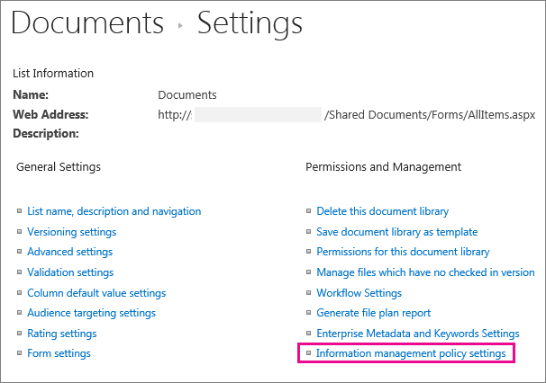

# Crear y aplicar directivas de administración de información

Las directivas de administración de la información permiten a su organización controlar durante cuánto tiempo se conserva el contenido, auditar lo que hacen los usuarios con el contenido y agregar códigos de barras o etiquetas a los documentos. Una directiva puede ayudar a aplicar el cumplimiento de normas legales y gubernamentales o procesos empresariales internos. Como administrador, puede configurar una directiva para controlar cómo realizar un seguimiento de los documentos y durante cuánto tiempo se conservarán los documentos.
  
Puede crear una directiva de administración de la información en tres ubicaciones diferentes de la jerarquía de sitios, desde la más amplia a la más estrecha:
  
- Cree una directiva para usarla en varios tipos de contenido dentro de una colección de sitios.
    
- Crear una directiva para un tipo de contenido de sitio.
    
- Cree una directiva para una lista o biblioteca.
    
Para obtener más información, vea [Introducción a las directivas de administración de información.](intro-to-info-mgmt-policies.md)
  
## Crear una directiva para varios tipos de contenido dentro de una colección de sitios

Para asegurarse de que se aplica una directiva de información a todos los documentos de un tipo determinado dentro de una colección de sitios, considere la posibilidad de crear la directiva en el nivel de la colección de sitios y, a continuación, aplicar la directiva a los tipos de contenido. Se denominan directivas de colección de sitios. 
  
1. En la página principal de la colección de \> **sitios,** botón  \> **Configuración del sitio**.
    
    En un sitio conectado a un grupo de SharePoint, haga clic en **Configuración,** en Contenido del **sitio** y, a continuación, haga clic en **Configuración del sitio.** 
    
2. En la página Configuración del sitio, **en** Plantillas de directiva de tipo de contenido de \> **administración de colección de sitios.** 
  

  
3. En la página Directivas, \> **cree**. 
    
4. Escriba un nombre y una descripción para la directiva y, a continuación, escriba una breve instrucción de directiva que explique a los usuarios para qué es la directiva.
    
5. Vea la siguiente sección sobre la creación de directivas para un tipo de contenido de sitio para obtener información sobre cómo configurar las características que desea asociar a la directiva. 
    
6. Elija **Aceptar**.
    
## Crear una directiva para un tipo de contenido de sitio

Agregar una directiva de administración de información a un tipo de contenido facilita la asociación de características de directiva con varias listas o bibliotecas. Puede agregar una directiva de administración de información existente a un tipo de contenido o crear una directiva única específica para un tipo de contenido individual.
  
 También puede agregar una directiva de administración de información a un tipo de contenido específico de las listas. Esto tiene el efecto de aplicar la directiva solo a los elementos de esa lista que usan el tipo de contenido. 
  
1. En la página principal de la colección de \> **sitios,** botón  \> **Configuración del sitio**.
    
    En un sitio conectado a un grupo de SharePoint, haga clic en **Configuración,** en Contenido del **sitio** y, a continuación, haga clic en **Configuración del sitio.** 
    
2. En la página Configuración del sitio, en Tipos de contenido del sitio **galerías del** diseñador \> **web.**
  

  
3. En la página Configuración del tipo de contenido del sitio, seleccione el tipo de contenido al que desea agregar una directiva.
    
4. En la página Tipo de contenido del sitio, **en** Configuración \> **de la configuración de la directiva de administración de información**.
    
5. En la página Editar directiva, escriba un nombre y una descripción para la directiva y, a continuación, escriba una breve descripción que explique a los usuarios para qué es la directiva.
    
6. En las siguientes secciones, seleccione las características de directiva individuales que desea agregar a la directiva de administración de información. 
  

  
7. Para especificar un período de retención para documentos y elementos que están sujetos a esta directiva, elija Habilitar retención y, a continuación, especifique el período de retención y las acciones que desea que se produzcan cuando los elementos expiren.
    
    Para especificar un período de retención
    
||||||**1.**|**Choose **Add a retention stage for records...****|
|:-----|:-----|:-----|:-----|:-----|:-----|:-----|
||||||2.    | Seleccione una opción de período de retención para especificar cuándo los documentos o elementos están configurados para expirar. Realice una de las acciones siguientes:     Para establecer la fecha de expiración  basada en una propiedad de fecha, en Evento Esta fase se basa en una propiedad de fecha en el elemento y, a continuación, seleccione la acción de documento o elemento (por ejemplo, Creado o Modificado) y el incremento de tiempo después de esta acción (por ejemplo, el número de días, meses o años) cuando desee que expire \> el elemento.     Para usar una fórmula de retención personalizada para determinar la expiración, elija Establecer mediante una fórmula de **retención personalizada instalada en este servidor.**    > [!NOTE]> esta opción solo está disponible si el administrador ha configurado una fórmula personalizada.           |
||||||3.    |La **opción Iniciar un flujo** de trabajo solo está disponible si está definiendo una directiva para una lista, biblioteca o tipo de contenido que ya tiene asociado un flujo de trabajo. A continuación, se le dará una opción de flujos de trabajo para elegir.    |
||||||4.    |En la **sección Periodicidad,** seleccione **Repetir la acción de esta fase...** y escriba la frecuencia con la que desea que la acción vuelva a ocurrir.    > [!NOTE]> Esta opción solo está disponible si se puede repetir la acción seleccionada. Por ejemplo, no se puede establecer la periodicidad de la acción **Eliminar permanentemente**.           |
||||||5.    |Eligió **Aceptar.**    |
   
1. Para habilitar la auditoría de los documentos y elementos que están sujetos a esta directiva, elija Habilitar auditoría y, a continuación, especifique los eventos que desea auditar.
    
    Para habilitar la auditoría
    
||||||1.****|En la página Editar  directiva,** en **Auditoría** Habilitar auditoría **, active las casillas situadas junto a los eventos para los que desea mantener una pista de **\>**  auditoría.****|
|:-----|:-----|:-----|:-----|:-----|:-----|:-----|
||||||**2.**   |**Para solicitar a los usuarios que inserte**  estos códigos de barras en documentos, elija Solicitar a los usuarios que inserten un código de barras antes de guardar **o imprimir.**    |
||||||**3.**   |**Elija** **Aceptar** ** para aplicar la característica de auditoría a la directiva. **   |
|||||||La característica directiva de auditoría permite a las organizaciones crear y analizar rutas de auditoría para documentos y elementos de lista, como listas de tareas, listas de problemas, grupos de discusión y calendarios. Esta característica de directiva proporciona un registro de auditoría que graba eventos, por ejemplo cuando se ve, se modifica o se elimina contenido.    |
|||||||Cuando se habilita la auditoría como parte de una directiva de administración de la información, los administradores pueden ver los datos de auditoría en los informes de uso de directivas que se basan en Microsoft Excel y que resumen el uso actual. Los administradores pueden usar estos informes para determinar cómo se usa la información en la organización. Estos informes también pueden ayudar a las organizaciones a comprobar y documentar su cumplimiento normativo o investigar posibles problemas.    |
|||||||El registro de auditoría graba la siguiente información: nombre del evento, fecha y hora del evento y nombre de sistema del usuario que realizó la acción.    |
   
1. Cuando los códigos de barras se habilitan como parte de una directiva, se agregan a las propiedades del documento y se muestran en el área de encabezado del documento al que se aplica el código de barras. Al igual que las etiquetas, los códigos de barras también se pueden quitar manualmente de un documento. Puede especificar si se pedirá a los usuarios que incluyan el código de barras al  imprimir o guardar un elemento, o si el código de barras debe insertarse manualmente mediante la pestaña Insertar de los programas de lanzamiento de Office 2010. 
    
    Para habilitar códigos de barras
    
||||||1.****|**En la página Editar directiva, en Códigos **de barras** habilitar códigos \> **de barras.****|
|:-----|:-----|:-----|:-----|:-----|:-----|:-----|
||||||**2.**   |Para solicitar a los usuarios que inserte estos códigos de barras en documentos, elija Solicitar a los usuarios que inserten un código de barras **antes de guardar o imprimir.**    |
||||||**3.**   |Elige **Aceptar** para aplicar la característica de código de barras a la directiva.    |
|||||||
 La directiva de código de barras genera códigos de barras estándar de Code 39. Cada imagen de código de barras incluye texto debajo del símbolo de código de barras que representa el valor del código de barras. Esto permite que los datos de códigos de barras se utilicen incluso cuando el hardware de análisis no está disponible. Los usuarios pueden escribir manualmente el número de código de barras en el cuadro de búsqueda para localizar el elemento en un sitio.    |
   
1. Para requerir que los documentos sujetos a esta directiva tengan etiquetas, elija Habilitar etiquetas y, a continuación, especifique la configuración que desee para las etiquetas.
    
    Para habilitar etiquetas
    
||||||**1.**|**To require users to add a label to a document, choose **Prompt users to insert a label before saving or printing**.    > [!NOTE]> Si desea que las etiquetas sean opcionales, no active esta casilla.        **|
|:-----|:-----|:-----|:-----|:-----|:-----|:-----|
||||||2.    |Para bloquear una etiqueta para que no se pueda cambiar después de haberla insertado, elija Impedir cambios en las etiquetas después **de agregarlos.**     Esta configuración impide que el texto de la etiqueta se actualice una vez que la etiqueta se haya insertado en un elemento dentro de una aplicación cliente como Word, Excel o PowerPoint. Si desea que la etiqueta se actualice cuando se actualicen las propiedades del documento o elemento, no active esta casilla de verificación.    |
||||||3.    |En el cuadro Formato de etiqueta, escriba el texto de la etiqueta tal como desea que se muestre. Las etiquetas pueden contener hasta 10 referencias de columna, cada una de las cuales puede tener hasta 255 caracteres de longitud. Para crear el formato de la etiqueta, haga lo siguiente:    Escriba los nombres de las columnas que desea incluir en la etiqueta en el orden en que desea que aparezcan. Escriba los nombres de columna entre corchetes ( ), como se muestra en el {} ejemplo en la página Editar directiva.    Escriba palabras para identificar las columnas fuera de los corchetes, como se muestra en el ejemplo de la página Editar directiva.    |
||||||4.    |Para agregar un salto de línea, escriba **\n** donde desee que aparezca el salto de línea.    |
||||||5.    |Seleccione el tamaño de fuente y el estilo que desee y especifique si desea que la etiqueta se coloque a la izquierda, al centro o a la derecha dentro del documento.     Seleccione una fuente y un estilo que estén disponibles en los equipos de los usuarios. El tamaño de la fuente afecta a la cantidad de texto que puede mostrarse en la etiqueta.    |
||||||6.    |Escriba el alto y el ancho de la etiqueta. El alto de la etiqueta puede variar de 0,25 a 20 pulgadas ((0,63 cm. y 50,8 cm. respectivamente) y el ancho de la etiqueta puede variar de 0,.25 a 20 pulgadas (0,63 cm. y 50,8 cm. respectivamente). El texto de la etiqueta siempre se centra verticalmente en la imagen de la etiqueta.    |
||||||7.    |Elija **Actualizar para** obtener una vista previa del contenido de la etiqueta.    |
   
1. Elija **Aceptar**.
    
## Crear una directiva para una lista, una biblioteca o una carpeta (directiva de retención basada en ubicación)

Puede definir una directiva de retención que se aplique solo a una lista, biblioteca o carpeta específica. Sin embargo, si crea una directiva de retención de esta forma, no podrá volver a usar esta directiva en otras listas, bibliotecas, carpetas o sitios, y no podrá aplicar una directiva de colección de sitios a una directiva basada en ubicación.
  
Si desea aplicar una única directiva de retención a todos los tipos de contenido en una sola ubicación, lo más probable es que desee usar la retención basada en ubicación. En la mayoría de los demás casos, querrá comprobar que se especifica una directiva de retención para todos los tipos de contenido.
  
 Cada subcarpeta hereda la directiva de retención de su elemento primario, a menos que elija interrumpir la herencia y definir una nueva directiva de retención en el nivel secundario. 
  
Si desea definir una directiva de administración de información que no sea la retención en una lista o biblioteca, debe definir una directiva de administración de información para cada tipo de contenido de lista individual asociado a esa lista o biblioteca.
  
 Si en algún momento decide cambiar de tipo de contenido a directivas basadas en ubicación para una lista o biblioteca, solo se usará la directiva de retención como directiva basada en ubicación. Todas las demás directivas de administración (auditorías, códigos de barras y códigos de barras) se heredarán de los tipos de contenido asociados. 
  
 Las directivas basadas en ubicación se pueden deshabilitar para una colección de sitios desactivando la característica de retención basada en carpetas y bibliotecas. Esto permite a los administradores de colecciones de sitios asegurarse de que las directivas de tipo de contenido no se reemplazan por las directivas basadas en ubicación de un administrador de lista. 
  
Necesita al menos el permiso Administrar listas para cambiar la configuración de la directiva de administración de información para una lista o biblioteca.
  
1. Navegue a la lista o biblioteca para la que desea especificar una directiva de administración de información. 
    
2. En la cinta de opciones, elija **La** biblioteca o **la** pestaña Lista \> **Configuración de biblioteca** o **Configuración de lista**.
    
    En SharePoint Online, haga clic **en Configuración** y, a continuación, haga clic en **Configuración de lista** o Configuración de **biblioteca.** 
    
3. En **Permisos y configuración de directiva de** administración de información de \> **administración.**
  

  
4. En la página Configuración de directiva de administración de la información, asegúrese de que el origen de retención de la lista o biblioteca esté establecido en Biblioteca y carpetas. 
  
Si **el tipo de** contenido aparece como origen, haga clic en Cambiar origen y, a continuación, haga clic en Biblioteca y **carpetas.**  Se le alerta de que se omitirán las directivas de retención de tipos de contenido. Elija **Aceptar**. 
    
5. En la página Editar directiva, en **Programación de** retención basada en bibliotecas, escriba una breve descripción de la directiva que está creando. 
    
6. Elija **Agregar una fase de retención...**
    
     Tenga en cuenta que, en Registros, puede definir diferentes directivas de retención para los registros seleccionando la opción Definir distintas etapas de retención para registros. 
    
7. En el cuadro de diálogo Propiedades de fase, seleccione una opción de período de retención para especificar cuándo expiran los documentos o los elementos. Realice una de las acciones siguientes:
    
  - Para establecer la fecha de expiración  basada en una propiedad de fecha, en Evento Esta fase se basa en una propiedad de fecha en el elemento y, a continuación, seleccione la acción de documento o elemento (por ejemplo, Creado o Modificado) y el incremento de tiempo después de esta acción (por ejemplo, el número de días, meses o años) cuando desee que expire \> el elemento. 
    
  - Para usar una fórmula de retención personalizada para determinar la expiración, elija Establecer mediante una fórmula de **retención personalizada instalada en este servidor.** 
    
    > [!NOTE]
    >  Esta opción solo está disponible si el administrador ha configurado una fórmula personalizada. 
  
  - En **Acción,** especifique lo que desea que suceda cuando expire el documento o elemento. Para habilitar una acción específica para el documento o elemento (como la eliminación), seleccione una acción de la lista. 
    
8. La **opción Iniciar un flujo** de trabajo solo está disponible si está definiendo una directiva para una lista, biblioteca o tipo de contenido que ya tiene asociado un flujo de trabajo. A continuación, se le dará una opción de flujos de trabajo para elegir. 
    
9. En **Periodicidad,** elija **Repetir la acción de esta fase...** y escriba la frecuencia con la que desea que la acción vuelva a ocurrir. 
    
    > [!NOTE]
    >  Esta opción solo está disponible si la acción seleccionada se puede repetir. Por ejemplo, no se puede establecer la periodicidad de la acción **Eliminar permanentemente**. 
  
10. Elija **Aceptar**.
    
## Aplicar una directiva de colección de sitios a un tipo de contenido

Si ya se han creado directivas de administración de información para el sitio como directivas de colección de sitios, puede aplicar una de las directivas a un tipo de contenido. Al hacerlo, puede aplicar la misma directiva a varios tipos de contenido de una colección de sitios que no comparten el mismo tipo de contenido primario.
  
 Si desea aplicar directivas a varios tipos de contenido de una colección de sitios y tiene configurado un servicio de metadatos administrados, puede usar la publicación de tipos de contenido para publicar directivas de administración de información en varias colecciones de sitios. Vea la sección [Aplicar una directiva entre colecciones de sitios](#apply-a-policy-across-site-collections) para obtener más información. 
  
1. Vaya a la lista o biblioteca que contiene el tipo de contenido al que desea aplicar una directiva.
    
2. En la cinta de opciones, elija **La** biblioteca o **la** pestaña Lista \> **Configuración de biblioteca** o **Configuración de lista**.
    
    En SharePoint Online, haga clic **en Configuración** y, a continuación, haga clic en **Configuración de lista** o Configuración de **biblioteca.** 
    
3. En **Permisos y configuración de directiva de** administración de información de \> **administración.**
  

  
4. Compruebe que el origen de la directiva  está establecido en **Tipos** de contenido y, en Directivas de tipo de contenido, seleccione el tipo de contenido al que desea aplicar la directiva. 
    
5. En **Especificar la directiva,** use una directiva de colección de sitios y, a continuación, seleccione la directiva que desee aplicar en la \> lista. 
    
    > [!NOTE]
    >  Si la **opción Usar una directiva de colección de** sitios no está disponible, no se han definido directivas de colección de sitios para la colección de sitios. 
  
6. Elija **Aceptar**.
    
     Si la lista o biblioteca con la que está  trabajando admite la administración de varios tipos de contenido, en Tipos de contenido puede elegir el tipo de contenido para el que desea especificar una directiva de administración de información. Esto le llevará directamente al paso 5 anterior. 
    
## Aplicar una directiva entre colecciones de sitios

Compartir tipos de contenido entre colecciones de sitios mediante una aplicación de servicio de metadatos administrados para configurar la publicación de tipos de contenido. La publicación de tipos de contenido ayuda a administrar el contenido y los metadatos de forma coherente en todos los sitios, ya que los tipos de contenido se pueden crear y actualizar de forma centralizada, y las actualizaciones se pueden publicar en varias colecciones de sitios o aplicaciones web de suscripción.
  
## Crear una plantilla a partir de una directiva existente para usarla en colecciones de sitios

Puede definir una directiva de administración de información y, a continuación, crear una plantilla a partir de ella para usarla según sea necesario en varias colecciones de sitios. Este método se puede usar si desea tener una copia de seguridad de las directivas de información o también puede usarse como método alternativo para usar la publicación de tipos de contenido para aplicar una directiva en las colecciones de sitios. Para crear una plantilla o copia de seguridad de la directiva, exporte la directiva de una colección de sitios y, a continuación, la importe a una ubicación guardada o a otra colección de sitios.
  
> [!IMPORTANT]
>  Si usa la característica de exportación e importación como una forma de crear un conjunto de plantillas de directiva, tenga en cuenta que existe un identificador único en el archivo .xml de directiva. Debido a esto, no puede importar esa directiva a un sitio más de una vez sin cambiar este identificador único. 
  
### Exportar una directiva

1. En la página principal de la colección de sitios, **elija** El engranaje Configuración pequeña que resalte la configuración  \> **sitio**.
    
    En un sitio conectado a un grupo de SharePoint, haga clic en **Configuración,** en Contenido del **sitio** y, a continuación, haga clic en **Configuración del sitio.** 
    
2. En la página Configuración del sitio, **en** Plantillas de directiva de tipo de contenido de \> **administración de colección de sitios.** 
  

  
3. Elija la directiva que desea exportar y \> desplácese hasta la parte \> **inferior exportar**.
    
4. En el símbolo del sistema para guardar o abrir el archivo, elija **Guardar** y, a continuación, seleccione una ubicación en la que guardar el archivo. Asegúrese de seleccionar una ubicación que esté disponible para las colecciones de sitios que están importando la directiva.
    
5. Cuando se muestre el cuadro de diálogo Descargar completado, elija **Cerrar**.
    
### Importar una directiva a una colección de sitios diferente

La importación de una directiva de administración de información permite aplicarla a varios tipos de contenido en el nivel de sitio o de lista dentro de una colección de sitios determinada. Las ventajas de hacerlo son dos: no tiene que volver a definir y aplicar la directiva en cada tipo de contenido, y puede administrar más fácilmente las modificaciones de directiva realizando cambios en la directiva en un solo lugar.
  
1. En la página principal de la colección de sitios a la que desea aplicar la directiva, elija Configuración pequeña engranaje de configuración que tomó el lugar de Configuración del sitio. Configuración  \> **sitio**.
    
    En un sitio conectado a un grupo de SharePoint, haga clic en **Configuración,** en Contenido del **sitio** y, a continuación, haga clic en **Configuración del sitio.** 
    
2. En la página Configuración del sitio, **en** Plantillas de directiva de tipo de contenido de \> **administración de colección de sitios.**
    
3. En la página Directivas, importe \>  \> **Examinar** para buscar el archivo XML de la directiva. 
    
4. Seleccione el archivo XML en el que se ha guardado la directiva \> **Abrir**. 
    
5. En la página Importar una directiva de colección de \>  sitios, importe para agregar la directiva a la colección de sitios. 
    
La directiva importada ahora se puede aplicar a uno o varios tipos de contenido en el nivel de sitio o de lista. 
  
Las directivas de administración de la información permiten a su organización controlar durante cuánto tiempo se conserva el contenido, auditar lo que hacen los usuarios con el contenido y agregar códigos de barras o etiquetas a los documentos. Una directiva puede ayudar a aplicar el cumplimiento de normas legales y gubernamentales o procesos empresariales internos. Como administrador, puede configurar una directiva para controlar cómo realizar un seguimiento de los documentos y durante cuánto tiempo se conservarán los documentos.

Puede crear una directiva de administración de la información en tres ubicaciones diferentes de la jerarquía de sitios, desde la más amplia a la más estrecha:
- Cree una directiva para usarla en varios tipos de contenido dentro de una colección de sitios.
- Crear una directiva para un tipo de contenido de sitio.
- Cree una directiva para una lista o biblioteca.

Para obtener más información, vea [Introducción a las directivas de administración de información.](intro-to-info-mgmt-policies.md)
  

