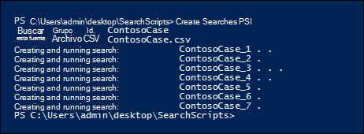
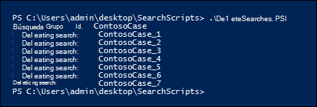

# <a name="create-report-on-and-delete-multiple-content-searches"></a><span data-ttu-id="26040-103">Crear, informar sobre y eliminar varias búsquedas de contenido</span><span class="sxs-lookup"><span data-stu-id="26040-103">Create, report on, and delete multiple Content Searches</span></span>

 <span data-ttu-id="26040-104">La creación rápida e informes de búsquedas de detección suele ser un paso importante en la exhibición de documentos electrónicos y las investigaciones cuando se intenta obtener información sobre los datos subyacentes y la riqueza y calidad de las búsquedas.</span><span class="sxs-lookup"><span data-stu-id="26040-104">Quickly creating and reporting discovery searches is often an important step in eDiscovery and investigations when you're trying to learn about the underlying data, and the richness and quality of your searches.</span></span> <span data-ttu-id="26040-105">Para ayudarle a hacerlo, PowerShell del Centro de seguridad & cumplimiento ofrece un conjunto de cmdlets para automatizar tareas de búsqueda de contenido que requieren mucho tiempo.</span><span class="sxs-lookup"><span data-stu-id="26040-105">To help you do this, the Security & Compliance Center PowerShell offers a set of cmdlets to automate time-consuming Content Search tasks.</span></span> <span data-ttu-id="26040-106">Estos scripts proporcionan una forma rápida y sencilla de crear una serie de búsquedas y, a continuación, ejecutar informes de los resultados de búsqueda estimados que pueden ayudarle a determinar la cantidad de datos en cuestión.</span><span class="sxs-lookup"><span data-stu-id="26040-106">These scripts provide a quick and easy way to create a number of searches, and then run reports of the estimated search results that can help you determine the quantity of data in question.</span></span> <span data-ttu-id="26040-107">También puede usar los scripts para crear diferentes versiones de búsquedas para comparar los resultados que cada uno produce.</span><span class="sxs-lookup"><span data-stu-id="26040-107">You can also use the scripts to create different versions of searches to compare the results each one produces.</span></span> <span data-ttu-id="26040-108">Estos scripts pueden ayudarle a identificar y controlar los datos de forma rápida y eficaz.</span><span class="sxs-lookup"><span data-stu-id="26040-108">These scripts can help you to quickly and efficiently identify and cull your data.</span></span>

## <a name="before-you-create-a-content-search"></a><span data-ttu-id="26040-109">Antes de crear una búsqueda de contenido</span><span class="sxs-lookup"><span data-stu-id="26040-109">Before you create a Content Search</span></span>

- <span data-ttu-id="26040-110">Debe ser miembro del grupo de roles administrador de exhibición de documentos electrónicos en el Centro de seguridad & cumplimiento para ejecutar los scripts que se describen en este tema.</span><span class="sxs-lookup"><span data-stu-id="26040-110">You have to be a member of the eDiscovery Manager role group in the Security & Compliance Center to run the scripts that are described in this topic.</span></span>

- <span data-ttu-id="26040-111">Para recopilar una lista de las direcciones URL de los sitios OneDrive para la Empresa de la organización que puede agregar al archivo CSV en el paso 1, vea [Create a list of all OneDrive locations in your organization](/onedrive/list-onedrive-urls).</span><span class="sxs-lookup"><span data-stu-id="26040-111">To collect a list of the URLs for the OneDrive for Business sites in your organization that you can add to the CSV file in Step 1, see [Create a list of all OneDrive locations in your organization](/onedrive/list-onedrive-urls).</span></span>

- <span data-ttu-id="26040-112">Asegúrese de guardar todos los archivos que cree en este tema en la misma carpeta.</span><span class="sxs-lookup"><span data-stu-id="26040-112">Be sure to save all the files that you create in this topic to the same folder.</span></span> <span data-ttu-id="26040-113">Esto facilitará la ejecución de los scripts.</span><span class="sxs-lookup"><span data-stu-id="26040-113">That will make it easier to run the scripts.</span></span>

- <span data-ttu-id="26040-114">Los scripts incluyen un control de errores mínimo.</span><span class="sxs-lookup"><span data-stu-id="26040-114">The scripts include minimal error handling.</span></span> <span data-ttu-id="26040-115">Su objetivo principal es crear, informar y eliminar rápidamente varias búsquedas de contenido.</span><span class="sxs-lookup"><span data-stu-id="26040-115">Their primary purpose is to quickly create, report on, and delete multiple Content Searches.</span></span>

- <span data-ttu-id="26040-p104">Los scripts de ejemplo que se proporcionan en este tema no son compatibles con ningún servicio o programa de soporte técnico estándar de Microsoft. Los scripts de ejemplo se proporcionan tal cual, sin garantía de ningún tipo. Además, Microsoft se exime de todas las garantías implícitas, incluidas (sin limitación) las garantías implícitas de comerciabilidad o idoneidad para un propósito específico. El usuario asume todos los riesgos derivados del uso o del rendimiento de los scripts de ejemplo y la documentación. Microsoft, sus autores o cualquier persona relacionada con la creación, producción o entrega de los scripts no serán en ningún caso responsables de cualesquiera daños (incluidos, sin limitación, los daños producidos por la pérdida de beneficios comerciales, interrupción de la actividad comercial, pérdida de información empresarial u otras pérdidas económicas) derivados del uso o de la imposibilidad de uso de los scripts de ejemplo o la documentación, incluso aunque Microsoft tenga constancia de la posibilidad de que dichos daños se produzcan.</span><span class="sxs-lookup"><span data-stu-id="26040-p104">The sample scripts provided in this topic aren't supported under any Microsoft standard support program or service. The sample scripts are provided AS IS without warranty of any kind. Microsoft further disclaims all implied warranties including, without limitation, any implied warranties of merchantability or of fitness for a particular purpose. The entire risk arising out of the use or performance of the sample scripts and documentation remains with you. In no event shall Microsoft, its authors, or anyone else involved in the creation, production, or delivery of the scripts be liable for any damages whatsoever (including, without limitation, damages for loss of business profits, business interruption, loss of business information, or other pecuniary loss) arising out of the use of or inability to use the sample scripts or documentation, even if Microsoft has been advised of the possibility of such damages.</span></span>

## <a name="step-1-create-a-csv-file-that-contains-information-about-the-searches-you-want-to-run"></a><span data-ttu-id="26040-121">Paso 1: Crear un archivo CSV que contenga información sobre las búsquedas que desea ejecutar</span><span class="sxs-lookup"><span data-stu-id="26040-121">Step 1: Create a CSV file that contains information about the searches you want to run</span></span>

<span data-ttu-id="26040-122">El archivo de valores separados por comas (CSV) que cree en este paso contiene una fila para cada usuario que desee buscar.</span><span class="sxs-lookup"><span data-stu-id="26040-122">The comma separated value (CSV) file that you create in this step contains a row for each user that want to search.</span></span> <span data-ttu-id="26040-123">Puede buscar en el buzón de correo Exchange Online usuario (que incluye el buzón de archivo, si está habilitado) y su OneDrive para la Empresa sitio.</span><span class="sxs-lookup"><span data-stu-id="26040-123">You can search the user's Exchange Online mailbox (which includes the archive mailbox, if it's enabled) and their OneDrive for Business site.</span></span> <span data-ttu-id="26040-124">O puede buscar solo el buzón o el OneDrive para la Empresa sitio.</span><span class="sxs-lookup"><span data-stu-id="26040-124">Or you can search just the mailbox or the OneDrive for Business site.</span></span> <span data-ttu-id="26040-125">También puede buscar en cualquier sitio de su organización SharePoint Online.</span><span class="sxs-lookup"><span data-stu-id="26040-125">You can also search any site in your SharePoint Online organization.</span></span> <span data-ttu-id="26040-126">El script que ejecute en el paso 3 creará una búsqueda independiente para cada fila del archivo CSV.</span><span class="sxs-lookup"><span data-stu-id="26040-126">The script that you run in Step 3 will create a separate search for each row in the CSV file.</span></span>

1. <span data-ttu-id="26040-127">Copie y pegue el siguiente texto en un archivo .txt con el Bloc de notas.</span><span class="sxs-lookup"><span data-stu-id="26040-127">Copy and paste the following text into a .txt file using NotePad.</span></span> <span data-ttu-id="26040-128">Guarde este archivo en una carpeta del equipo local.</span><span class="sxs-lookup"><span data-stu-id="26040-128">Save this file to a folder on your local computer.</span></span> <span data-ttu-id="26040-129">También guardará los demás scripts en esta carpeta.</span><span class="sxs-lookup"><span data-stu-id="26040-129">You'll save the other scripts to this folder as well.</span></span>

   ```text
   ExchangeLocation,SharePointLocation,ContentMatchQuery,StartDate,EndDate
   sarad@contoso.onmicrosoft.com,https://contoso-my.sharepoint.com/personal/sarad_contoso_onmicrosoft_com,(lawsuit OR legal),1/1/2000,12/31/2005
   sarad@contoso.onmicrosoft.com,https://contoso-my.sharepoint.com/personal/sarad_contoso_onmicrosoft_com,(lawsuit OR legal),1/1/2006,12/31/2010
   sarad@contoso.onmicrosoft.com,https://contoso-my.sharepoint.com/personal/sarad_contoso_onmicrosoft_com,(lawsuit OR legal),1/1/2011,3/21/2016
   ,https://contoso.sharepoint.com/sites/contoso,,,3/21/2016
   ,https://contoso-my.sharepoint.com/personal/davidl_contoso_onmicrosoft_com,,1/1/2015,
   ,https://contoso-my.sharepoint.com/personal/janets_contoso_onmicrosoft_com,,1/1/2015,
   ```

   <span data-ttu-id="26040-130">La primera fila, o fila de encabezado, del archivo enumera los parámetros que usará el cmdlet **New-ComplianceSearch** (en el script del paso 3) para crear una nueva búsqueda de contenido.</span><span class="sxs-lookup"><span data-stu-id="26040-130">The first row, or header row, of the file lists the parameters that will be used by **New-ComplianceSearch** cmdlet (in the script in Step 3) to create a new Content Searches.</span></span> <span data-ttu-id="26040-131">Los nombres de los parámetros están separados por comas.</span><span class="sxs-lookup"><span data-stu-id="26040-131">Each parameter name is separated by a comma.</span></span> <span data-ttu-id="26040-132">Asegúrese de que no hay espacios en la fila de encabezado.</span><span class="sxs-lookup"><span data-stu-id="26040-132">Make sure there aren't any spaces in the header row.</span></span> <span data-ttu-id="26040-133">Cada fila debajo de la fila de encabezado representa los valores de parámetro de cada búsqueda.</span><span class="sxs-lookup"><span data-stu-id="26040-133">Each row under the header row represents the parameter values for each search.</span></span> <span data-ttu-id="26040-134">Asegúrese de reemplazar los datos de marcador de posición en el archivo CSV por los datos reales.</span><span class="sxs-lookup"><span data-stu-id="26040-134">Be sure to replace the placeholder data in the CSV file with your actual data.</span></span>

2. <span data-ttu-id="26040-135">Abra el .txt en Excel y, a continuación, use la información de la tabla siguiente para editar el archivo con información para cada búsqueda.</span><span class="sxs-lookup"><span data-stu-id="26040-135">Open the .txt file in Excel, and then use the information in the following table to edit the file with information for each search.</span></span>

   ****

   |<span data-ttu-id="26040-136">Parámetro</span><span class="sxs-lookup"><span data-stu-id="26040-136">Parameter</span></span>|<span data-ttu-id="26040-137">Descripción</span><span class="sxs-lookup"><span data-stu-id="26040-137">Description</span></span>|
   |---|---|
   |`ExchangeLocation`|<span data-ttu-id="26040-138">La dirección SMTP del buzón del usuario.</span><span class="sxs-lookup"><span data-stu-id="26040-138">The SMTP address of the user's mailbox.</span></span>|
   |`SharePointLocation`|<span data-ttu-id="26040-139">La dirección URL del sitio OneDrive para la Empresa usuario o la dirección URL de cualquier sitio de la organización.</span><span class="sxs-lookup"><span data-stu-id="26040-139">The URL for the user's OneDrive for Business site or the URL for any site in your organization.</span></span> <span data-ttu-id="26040-140">Para la dirección URL de OneDrive para la Empresa, use este formato: ` https://<your organization>-my.sharepoint.com/personal/<user alias>_<your organization>_onmicrosoft_com ` .</span><span class="sxs-lookup"><span data-stu-id="26040-140">For the URL for OneDrive for Business sites, use this format: ` https://<your organization>-my.sharepoint.com/personal/<user alias>_<your organization>_onmicrosoft_com `.</span></span> <span data-ttu-id="26040-141">Por ejemplo, `https://contoso-my.sharepoint.com/personal/sarad_contoso_onmicrosoft_com`.</span><span class="sxs-lookup"><span data-stu-id="26040-141">For example,  `https://contoso-my.sharepoint.com/personal/sarad_contoso_onmicrosoft_com`.</span></span>|
   |`ContentMatchQuery`|<span data-ttu-id="26040-142">Consulta de búsqueda para la búsqueda.</span><span class="sxs-lookup"><span data-stu-id="26040-142">The search query for the search.</span></span> <span data-ttu-id="26040-143">Para obtener más información acerca de cómo crear una consulta de búsqueda, vea Consultas de palabras clave y condiciones [de búsqueda para búsqueda de contenido](keyword-queries-and-search-conditions.md).</span><span class="sxs-lookup"><span data-stu-id="26040-143">For more information about creating a search query, see [Keyword queries and search conditions for Content Search](keyword-queries-and-search-conditions.md).</span></span>|
   |`StartDate`|<span data-ttu-id="26040-144">Para el correo electrónico, la fecha en o después de que un destinatario recibió un mensaje o lo envió el remitente.</span><span class="sxs-lookup"><span data-stu-id="26040-144">For email, the date on or after a message was received by a recipient or sent by the sender.</span></span> <span data-ttu-id="26040-145">Para los documentos de SharePoint o OneDrive para la Empresa, la fecha en o después de que se modificó por última vez un documento.</span><span class="sxs-lookup"><span data-stu-id="26040-145">For documents on SharePoint or OneDrive for Business sites, the date on or after a document was last modified.</span></span>|
   |`EndDate`|<span data-ttu-id="26040-146">En el caso del correo electrónico, la fecha en o antes de que un usuario enviara un mensaje.</span><span class="sxs-lookup"><span data-stu-id="26040-146">For email, the date on or before a message was sent by a sent by the user.</span></span> <span data-ttu-id="26040-147">Para los documentos de SharePoint o OneDrive para la Empresa, la fecha en o antes de la última modificación de un documento.</span><span class="sxs-lookup"><span data-stu-id="26040-147">For documents on SharePoint or OneDrive for Business sites, the date on or before a document was last modified.</span></span>|
   |

3. <span data-ttu-id="26040-148">Guarde el Excel como un archivo CSV en una carpeta del equipo local.</span><span class="sxs-lookup"><span data-stu-id="26040-148">Save the Excel file as a CSV file to a folder on your local computer.</span></span> <span data-ttu-id="26040-149">El script que cree en el paso 3 usará la información de este archivo CSV para crear las búsquedas.</span><span class="sxs-lookup"><span data-stu-id="26040-149">The script that you create in Step 3 will use the information in this CSV file to create the searches.</span></span>

## <a name="step-2-connect-to-security--compliance-center-powershell"></a><span data-ttu-id="26040-150">Paso 2: Conectarse al PowerShell del Centro de seguridad y cumplimiento</span><span class="sxs-lookup"><span data-stu-id="26040-150">Step 2: Connect to Security & Compliance Center PowerShell</span></span>

<span data-ttu-id="26040-151">El siguiente paso es conectarse al PowerShell del Centro de seguridad y cumplimiento de su organización.</span><span class="sxs-lookup"><span data-stu-id="26040-151">The next step is to connect to Security & Compliance Center PowerShell for your organization.</span></span> <span data-ttu-id="26040-152">Para obtener instrucciones paso a paso, vea [Conectarse al PowerShell del Centro de seguridad y cumplimiento](/powershell/exchange/connect-to-scc-powershell).</span><span class="sxs-lookup"><span data-stu-id="26040-152">For step-by-step instructions, see [Connect to Security & Compliance Center PowerShell](/powershell/exchange/connect-to-scc-powershell).</span></span>

## <a name="step-3-run-the-script-to-create-and-start-the-searches"></a><span data-ttu-id="26040-153">Paso 3: Ejecutar el script para crear e iniciar las búsquedas</span><span class="sxs-lookup"><span data-stu-id="26040-153">Step 3: Run the script to create and start the searches</span></span>

<span data-ttu-id="26040-154">El script de este paso creará una búsqueda de contenido independiente para cada fila del archivo CSV que creó en el paso 1.</span><span class="sxs-lookup"><span data-stu-id="26040-154">The script in this step will create a separate Content Search for each row in the CSV file that you created in Step 1.</span></span> <span data-ttu-id="26040-155">Cuando ejecute este script, se le pedirán dos valores:</span><span class="sxs-lookup"><span data-stu-id="26040-155">When you run this script, you'll be prompted for two values:</span></span>

- <span data-ttu-id="26040-156">**Id. de grupo de** búsqueda: este nombre proporciona una forma sencilla de organizar las búsquedas que se crean a partir del archivo CSV.</span><span class="sxs-lookup"><span data-stu-id="26040-156">**Search Group ID** - This name provides an easy way to organize the searches that are created from the CSV file.</span></span> <span data-ttu-id="26040-157">Cada búsqueda que se crea se denomina con el identificador de grupo de búsqueda y, a continuación, se anexa un número al nombre de búsqueda.</span><span class="sxs-lookup"><span data-stu-id="26040-157">Each search that's created is named with the Search Group ID, and then a number is appended to the search name.</span></span> <span data-ttu-id="26040-158">Por ejemplo, si escribe **ContosoCase** para el identificador de grupo de búsqueda, las búsquedas se denominan **ContosoCase_1**, **ContosoCase_2**, **ContosoCase_3** y así sucesivamente.</span><span class="sxs-lookup"><span data-stu-id="26040-158">For example, if you enter **ContosoCase** for the Search Group ID, then the searches are named **ContosoCase_1**, **ContosoCase_2**, **ContosoCase_3**, and so on.</span></span> <span data-ttu-id="26040-159">Tenga en cuenta que el nombre que escriba distingue mayúsculas de minúsculas.</span><span class="sxs-lookup"><span data-stu-id="26040-159">Note that the name you type is case sensitive.</span></span> <span data-ttu-id="26040-160">Cuando usa el identificador de grupo de búsqueda en los pasos 4 y 5, debe usar el mismo caso que cuando lo creó.</span><span class="sxs-lookup"><span data-stu-id="26040-160">When you use the Search Group ID in Step 4 and Step 5, you have to use the same case as you did when you created it.</span></span>

- <span data-ttu-id="26040-161">**Archivo CSV:** el nombre del archivo CSV que creó en el paso 1.</span><span class="sxs-lookup"><span data-stu-id="26040-161">**CSV file** - The name of the CSV file that you created in Step 1.</span></span> <span data-ttu-id="26040-162">Asegúrese de incluir el uso del nombre de archivo completo, incluya la extensión .csv archivo; por ejemplo,  `ContosoCase.csv` .</span><span class="sxs-lookup"><span data-stu-id="26040-162">Be sure to include the use the full filename, include the .csv file extension; for example,  `ContosoCase.csv`.</span></span>

<span data-ttu-id="26040-163">Para ejecutar el script:</span><span class="sxs-lookup"><span data-stu-id="26040-163">To run the script:</span></span>

1. <span data-ttu-id="26040-164">Guarde el texto siguiente en un archivo Windows PowerShell script mediante un sufijo de nombre de archivo de .ps1; por ejemplo, `CreateSearches.ps1` .</span><span class="sxs-lookup"><span data-stu-id="26040-164">Save the following text to a Windows PowerShell script file by using a filename suffix of .ps1; for example, `CreateSearches.ps1`.</span></span> <span data-ttu-id="26040-165">Guarde el archivo en la misma carpeta donde guardó los otros archivos.</span><span class="sxs-lookup"><span data-stu-id="26040-165">Save the file to the same folder where you saved the other files.</span></span>

   ```Powershell
   # Get the Search Group ID and the location of the CSV input file
   $searchGroup = Read-Host 'Search Group ID'
   $csvFile = Read-Host 'Source CSV file'

   # Do a quick check to make sure our group name will not collide with other searches
   $searchCounter = 1
   import-csv $csvFile |
     ForEach-Object{

    $searchName = $searchGroup +'_' + $searchCounter
    $search = Get-ComplianceSearch $searchName -EA SilentlyContinue
    if ($search)
    {
       Write-Error "The Search Group ID conflicts with existing searches.  Please choose a search group name and restart the script."
       return
    }
    $searchCounter++
   }

   $searchCounter = 1
   import-csv $csvFile |
     ForEach-Object{

    # Create the query
    $query = $_.ContentMatchQuery
    if(($_.StartDate -or $_.EndDate))
    {
          # Add the appropriate date restrictions.  NOTE: Using the Date condition property here because it works across Exchange, SharePoint, and OneDrive for Business.
          # For Exchange, the Date condition property maps to the Sent and Received dates; for SharePoint and OneDrive for Business, it maps to Created and Modified dates.
          if($query)
          {
              $query += " AND"
          }
          $query += " ("
          if($_.StartDate)
          {
              $query += "Date >= " + $_.StartDate
          }
          if($_.EndDate)
          {
              if($_.StartDate)
              {
                  $query += " AND "
              }
              $query += "Date <= " + $_.EndDate
          }
          $query += ")"
    }

     # -ExchangeLocation can't be set to an empty string, set to null if there's no location.
     $exchangeLocation = $null
     if ( $_.ExchangeLocation)
     {
           $exchangeLocation = $_.ExchangeLocation
     }

    # Create and run the search
    $searchName = $searchGroup +'_' + $searchCounter
    Write-Host "Creating and running search: " $searchName -NoNewline
    $search = New-ComplianceSearch -Name $searchName -ExchangeLocation $exchangeLocation -SharePointLocation $_.SharePointLocation -ContentMatchQuery $query

    # Start and wait for each search to complete
    Start-ComplianceSearch $search.Name
    while ((Get-ComplianceSearch $search.Name).Status -ne "Completed")
    {
       Write-Host " ." -NoNewline
       Start-Sleep -s 3
    }
    Write-Host ""

    $searchCounter++
   }
   ```

2. <span data-ttu-id="26040-166">En Windows PowerShell, vaya a la carpeta donde guardó el script en el paso anterior y, a continuación, ejecute el script; por ejemplo:</span><span class="sxs-lookup"><span data-stu-id="26040-166">In Windows PowerShell, go to the folder where you saved the script in the previous step, and then run the script; for example:</span></span>

   ```Powershell
   .\CreateSearches.ps1
   ```

3. <span data-ttu-id="26040-167">En el **símbolo del sistema id. de** grupo de búsqueda, escriba un nombre de grupo de búsqueda y, a continuación, presione **Entrar**; por ejemplo,  `ContosoCase` .</span><span class="sxs-lookup"><span data-stu-id="26040-167">At the **Search Group ID** prompt, type a search group name, and then press **Enter**; for example,  `ContosoCase`.</span></span> <span data-ttu-id="26040-168">Recuerde que este nombre distingue mayúsculas de minúsculas, por lo que tendrá que escribirlo de la misma manera en los pasos posteriores.</span><span class="sxs-lookup"><span data-stu-id="26040-168">Remember that this name is case sensitive, so you'll have to type it the same way in the subsequent steps.</span></span>

4. <span data-ttu-id="26040-169">En el **símbolo del sistema de archivo CSV** de origen, escriba el nombre del archivo CSV, incluida la extensión .csv archivo; por ejemplo,  `ContosoCase.csv` .</span><span class="sxs-lookup"><span data-stu-id="26040-169">At the **Source CSV file** prompt, type the name of the CSV file, including the .csv file extension; for example,  `ContosoCase.csv`.</span></span>

5. <span data-ttu-id="26040-170">Presione **ENTRAR** para continuar ejecutando el script.</span><span class="sxs-lookup"><span data-stu-id="26040-170">Press **Enter** to continue running the script.</span></span>

   <span data-ttu-id="26040-171">El script muestra el progreso de la creación y ejecución de las búsquedas.</span><span class="sxs-lookup"><span data-stu-id="26040-171">The script displays the progress of creating and running the searches.</span></span> <span data-ttu-id="26040-172">Cuando el script se completa, vuelve al símbolo del sistema.</span><span class="sxs-lookup"><span data-stu-id="26040-172">When the script is complete, it returns to the prompt.</span></span>

   

## <a name="step-4-run-the-script-to-report-the-search-estimates"></a><span data-ttu-id="26040-174">Paso 4: Ejecutar el script para informar de las estimaciones de búsqueda</span><span class="sxs-lookup"><span data-stu-id="26040-174">Step 4: Run the script to report the search estimates</span></span>

<span data-ttu-id="26040-175">Después de crear las búsquedas, el siguiente paso es ejecutar un script que muestre un informe sencillo del número de visitas de búsqueda para cada búsqueda que se creó en el paso 3.</span><span class="sxs-lookup"><span data-stu-id="26040-175">After you create the searches, the next step is to run a script that displays a simple report of the number of search hits for each search that was created in Step 3.</span></span> <span data-ttu-id="26040-176">El informe también incluye el tamaño de los resultados de cada búsqueda y el número total de visitas y el tamaño total de todas las búsquedas.</span><span class="sxs-lookup"><span data-stu-id="26040-176">The report also includes the size of results for each search, and the total number of hits and total size of all searches.</span></span> <span data-ttu-id="26040-177">Cuando ejecute el script de informes, se le pedirá el identificador de grupo de búsqueda y un nombre de archivo CSV si desea guardar el informe en un archivo CSV.</span><span class="sxs-lookup"><span data-stu-id="26040-177">When you run the reporting script, you'll be prompted for the Search Group ID, and a CSV filename if you want to save the report to a CSV file.</span></span>

1. <span data-ttu-id="26040-178">Guarde el texto siguiente en un archivo Windows PowerShell script mediante un sufijo de nombre de archivo de .ps1; por ejemplo, `SearchReport.ps1` .</span><span class="sxs-lookup"><span data-stu-id="26040-178">Save the following text to a Windows PowerShell script file by using a filename suffix of .ps1; for example, `SearchReport.ps1`.</span></span> <span data-ttu-id="26040-179">Guarde el archivo en la misma carpeta donde guardó los otros archivos.</span><span class="sxs-lookup"><span data-stu-id="26040-179">Save the file to the same folder where you saved the other files.</span></span>

   ```Powershell
   $searchGroup = Read-Host 'Search Group ID'
   $outputFile = Read-Host 'Enter a file name or file path to save the report to a .csv file. Leave blank to only display the report'
   $searches = Get-ComplianceSearch | ?{$_.Name -clike $searchGroup + "_*"}
   $allSearchStats = @()
   foreach ($partialObj in $searches)
   {
      $search = Get-ComplianceSearch $partialObj.Name
      $sizeMB = [System.Math]::Round($search.Size / 1MB, 2)
      $searchStatus = $search.Status
      if($search.Errors)
      {
          $searchStatus = "Failed"
      }elseif($search.NumFailedSources -gt 0)
      {
          $searchStatus = "Failed Sources"
      }
      $searchStats = New-Object PSObject
      Add-Member -InputObject $searchStats -MemberType NoteProperty -Name Name -Value $search.Name
      Add-Member -InputObject $searchStats -MemberType NoteProperty -Name ContentMatchQuery -Value $search.ContentMatchQuery
      Add-Member -InputObject $searchStats -MemberType NoteProperty -Name Status -Value $searchStatus
      Add-Member -InputObject $searchStats -MemberType NoteProperty -Name Items -Value $search.Items
      Add-Member -InputObject $searchStats -MemberType NoteProperty -Name "Size" -Value $search.Size
      Add-Member -InputObject $searchStats -MemberType NoteProperty -Name "Size(MB)" -Value $sizeMB
      $allSearchStats += $searchStats
   }
   # Calculate the totals
   $allItems = ($allSearchStats | Measure-Object Items -Sum).Sum
   # Convert the total size to MB and round to the nearst 100th
   $allSize = ($allSearchStats | Measure-Object 'Size' -Sum).Sum
   $allSizeMB = [System.Math]::Round($allSize  / 1MB, 2)
   # Get the total successful searches and total of all searches
   $allSuccessCount = ($allSearchStats |?{$_.Status -eq "Completed"}).Count
   $allCount = $allSearchStats.Count
   $allStatus = [string]$allSuccessCount + " of " + [string]$allCount
   # Totals Row
   $totalSearchStats = New-Object PSObject
   Add-Member -InputObject $totalSearchStats -MemberType NoteProperty -Name Name -Value "Total"
   Add-Member -InputObject $totalSearchStats -MemberType NoteProperty -Name Status -Value $allStatus
   Add-Member -InputObject $totalSearchStats -MemberType NoteProperty -Name Items -Value $allItems
   Add-Member -InputObject $totalSearchStats -MemberType NoteProperty -Name "Size(MB)" -Value $allSizeMB
   $allSearchStats += $totalSearchStats
   # Just get the columns we're interested in showing
   $allSearchStatsPrime = $allSearchStats | Select-Object Name, Status, Items, "Size(MB)", ContentMatchQuery
   # Print the results to the screen
   $allSearchStatsPrime |ft -AutoSize -Wrap
   # Save the results to a CSV file
   if ($outputFile)
   {
      $allSearchStatsPrime | Export-Csv -Path $outputFile -NoTypeInformation
   }
   ```

2. <span data-ttu-id="26040-180">En Windows PowerShell, vaya a la carpeta donde guardó el script en el paso anterior y, a continuación, ejecute el script; por ejemplo:</span><span class="sxs-lookup"><span data-stu-id="26040-180">In Windows PowerShell, go to the folder where you saved the script in the previous step, and then run the script; for example:</span></span>

   ```Powershell
   .\SearchReport.ps1
   ```

3. <span data-ttu-id="26040-181">En el **símbolo del sistema id. de** grupo de búsqueda, escriba un nombre de grupo de búsqueda y, a continuación, presione **Entrar**; por ejemplo  `ContosoCase` .</span><span class="sxs-lookup"><span data-stu-id="26040-181">At the **Search Group ID** prompt, type a search group name, and then press **Enter**; for example  `ContosoCase`.</span></span> <span data-ttu-id="26040-182">Recuerde que este nombre distingue mayúsculas de minúsculas, por lo que tendrá que escribirlo del mismo modo que lo hizo cuando ejecutó el script en el paso 3.</span><span class="sxs-lookup"><span data-stu-id="26040-182">Remember that this name is case sensitive, so you'll have to type it the same way you did when you ran the script in Step 3.</span></span>

4. <span data-ttu-id="26040-183">En el símbolo del sistema Ruta de acceso de archivo para guardar el informe en un archivo **CSV (dejar** en blanco solo para mostrar el informe), escriba un nombre de archivo de ruta de acceso completa del nombre de archivo (incluida la extensión de archivo .csv) si desea guardar el informe en un archivo CSV.</span><span class="sxs-lookup"><span data-stu-id="26040-183">At the **File path to save the report to a CSV file (leave blank to just display the report)** prompt, type a file name of complete filename path (including the .csv file extension) if you want to save the report to a CSV file.</span></span> <span data-ttu-id="26040-184">nombre del archivo CSV, incluida la extensión .csv archivo.</span><span class="sxs-lookup"><span data-stu-id="26040-184">name of the CSV file, including the .csv file extension.</span></span> <span data-ttu-id="26040-185">Por ejemplo, puede escribir para guardarlo en el directorio actual o escribir para  `ContosoCaseReport.csv` guardarlo en una carpeta  `C:\Users\admin\OneDrive for Business\ContosoCase\ContosoCaseReport.csv` diferente.</span><span class="sxs-lookup"><span data-stu-id="26040-185">For example, you could type  `ContosoCaseReport.csv` to save it to the current directory or you could type  `C:\Users\admin\OneDrive for Business\ContosoCase\ContosoCaseReport.csv` to save it to a different folder.</span></span> <span data-ttu-id="26040-186">También puede dejar la solicitud en blanco para mostrar el informe, pero no guardarlo en un archivo.</span><span class="sxs-lookup"><span data-stu-id="26040-186">You can also leave the prompt blank to display the report but not save it to a file.</span></span>

5. <span data-ttu-id="26040-187">Presione **Entrar**.</span><span class="sxs-lookup"><span data-stu-id="26040-187">Press **Enter**.</span></span>

   <span data-ttu-id="26040-188">El script muestra el progreso de la creación y ejecución de las búsquedas.</span><span class="sxs-lookup"><span data-stu-id="26040-188">The script displays the progress of creating and running the searches.</span></span> <span data-ttu-id="26040-189">Cuando se completa el script, se muestra el informe.</span><span class="sxs-lookup"><span data-stu-id="26040-189">When the script is complete, the report is displayed.</span></span>

   

> [!NOTE]
> <span data-ttu-id="26040-191">Si se especifica el mismo buzón o sitio como una ubicación de contenido en más de una búsqueda de un grupo de búsqueda, la estimación total de resultados del informe (tanto para el número de elementos como para el tamaño total) puede incluir resultados para los mismos elementos.</span><span class="sxs-lookup"><span data-stu-id="26040-191">If the same mailbox or site is specified as a content location in more than one search in a search group, the total results estimate in the report (for both the number of items and the total size) might include results for the same items.</span></span> <span data-ttu-id="26040-192">Esto se debe a que el mismo mensaje de correo electrónico o documento se contará más de una vez si coincide con la consulta de distintas búsquedas en el grupo de búsqueda.</span><span class="sxs-lookup"><span data-stu-id="26040-192">That's because the same email message or document will be counted more than once if it matches the query for different searches in the search group.</span></span>

## <a name="step-5-run-the-script-to-delete-the-searches"></a><span data-ttu-id="26040-193">Paso 5: Ejecutar el script para eliminar las búsquedas</span><span class="sxs-lookup"><span data-stu-id="26040-193">Step 5: Run the script to delete the searches</span></span>

<span data-ttu-id="26040-194">Dado que es posible que esté creando muchas búsquedas, este último script facilita la eliminación rápida de las búsquedas que creó en el paso 3.</span><span class="sxs-lookup"><span data-stu-id="26040-194">Because you might be creating a lot of searches, this last script just makes it easy to quickly delete the searches you created in Step 3.</span></span> <span data-ttu-id="26040-195">Al igual que los demás scripts, este también le pedirá el identificador de grupo de búsqueda.</span><span class="sxs-lookup"><span data-stu-id="26040-195">Like the other scripts, this one also prompts you for the Search Group ID.</span></span> <span data-ttu-id="26040-196">Todas las búsquedas con el identificador de grupo de búsqueda en el nombre de búsqueda se eliminarán al ejecutar este script.</span><span class="sxs-lookup"><span data-stu-id="26040-196">All searches with the Search Group ID in the search name will be deleted when you run this script.</span></span>

1. <span data-ttu-id="26040-197">Guarde el texto siguiente en un archivo Windows PowerShell script mediante un sufijo de nombre de archivo de .ps1; por ejemplo, `DeleteSearches.ps1` .</span><span class="sxs-lookup"><span data-stu-id="26040-197">Save the following text to a Windows PowerShell script file by using a filename suffix of .ps1; for example, `DeleteSearches.ps1`.</span></span> <span data-ttu-id="26040-198">Guarde el archivo en la misma carpeta donde guardó los otros archivos.</span><span class="sxs-lookup"><span data-stu-id="26040-198">Save the file to the same folder where you saved the other files.</span></span>

   ```Powershell
   # Delete all searches in a search group
   $searchGroup = Read-Host 'Search Group ID'
   Get-ComplianceSearch |
      ForEach-Object{
      # If the name matches the search group name pattern (case sensitive), delete the search
      if ($_.Name -cmatch $searchGroup + "_\d+")
      {
          Write-Host "Deleting search: " $_.Name
          Remove-ComplianceSearch $_.Name -Confirm:$false
      }
   }
   ```

2. <span data-ttu-id="26040-199">En Windows PowerShell, vaya a la carpeta donde guardó el script en el paso anterior y, a continuación, ejecute el script; por ejemplo:</span><span class="sxs-lookup"><span data-stu-id="26040-199">In Windows PowerShell, go to the folder where you saved the script in the previous step, and then run the script; for example:</span></span>

   ```Powershell
   .\DeleteSearches.ps1
   ```

3. <span data-ttu-id="26040-200">En el **símbolo del sistema Id.** de grupo de búsqueda, escriba un nombre de grupo de búsqueda para las búsquedas que desea eliminar y, a continuación, presione **Entrar**; por ejemplo,  `ContosoCase` .</span><span class="sxs-lookup"><span data-stu-id="26040-200">At the **Search Group ID** prompt, type a search group name for the searches that you want to delete, and then press **Enter**; for example,  `ContosoCase`.</span></span> <span data-ttu-id="26040-201">Recuerde que este nombre distingue mayúsculas de minúsculas, por lo que tendrá que escribirlo del mismo modo que lo hizo cuando ejecutó el script en el paso 3.</span><span class="sxs-lookup"><span data-stu-id="26040-201">Remember that this name is case sensitive, so you'll have to type it the same way you did when you ran the script in Step 3.</span></span>

   <span data-ttu-id="26040-202">El script muestra el nombre de cada búsqueda que se elimina.</span><span class="sxs-lookup"><span data-stu-id="26040-202">The script displays the name of each search that's deleted.</span></span>

   
