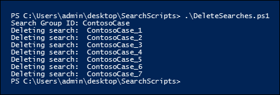

# <a name="create-report-on-and-delete-multiple-content-searches"></a>Crear, informar sobre y eliminar varias búsquedas de contenido

 La creación rápida e informes de búsquedas de detección suele ser un paso importante en la exhibición de documentos electrónicos y las investigaciones cuando se intenta obtener información sobre los datos subyacentes y la riqueza y calidad de las búsquedas. Para ayudarle a hacerlo, PowerShell del Centro de seguridad & cumplimiento ofrece un conjunto de cmdlets para automatizar tareas de búsqueda de contenido que requieren mucho tiempo. Estos scripts proporcionan una forma rápida y sencilla de crear una serie de búsquedas y, a continuación, ejecutar informes de los resultados de búsqueda estimados que pueden ayudarle a determinar la cantidad de datos en cuestión. También puede usar los scripts para crear diferentes versiones de búsquedas para comparar los resultados que cada uno produce. Estos scripts pueden ayudarle a identificar y controlar los datos de forma rápida y eficaz.

## <a name="before-you-create-a-content-search"></a>Antes de crear una búsqueda de contenido

- Debe ser miembro del grupo de roles administrador de exhibición de documentos electrónicos en el Centro de seguridad & cumplimiento para ejecutar los scripts que se describen en este tema.

- Para recopilar una lista de las direcciones URL de los sitios OneDrive para la Empresa de la organización que puede agregar al archivo CSV en el paso 1, vea [Create a list of all OneDrive locations in your organization](/onedrive/list-onedrive-urls).

- Asegúrese de guardar todos los archivos que cree en este tema en la misma carpeta. Esto facilitará la ejecución de los scripts.

- Los scripts incluyen un control de errores mínimo. Su objetivo principal es crear, informar y eliminar rápidamente varias búsquedas de contenido.

- Los scripts de ejemplo que se proporcionan en este tema no son compatibles con ningún servicio o programa de soporte técnico estándar de Microsoft. Los scripts de ejemplo se proporcionan tal cual, sin garantía de ningún tipo. Además, Microsoft se exime de todas las garantías implícitas, incluidas (sin limitación) las garantías implícitas de comerciabilidad o idoneidad para un propósito específico. El usuario asume todos los riesgos derivados del uso o del rendimiento de los scripts de ejemplo y la documentación. Microsoft, sus autores o cualquier persona relacionada con la creación, producción o entrega de los scripts no serán en ningún caso responsables de cualesquiera daños (incluidos, sin limitación, los daños producidos por la pérdida de beneficios comerciales, interrupción de la actividad comercial, pérdida de información empresarial u otras pérdidas económicas) derivados del uso o de la imposibilidad de uso de los scripts de ejemplo o la documentación, incluso aunque Microsoft tenga constancia de la posibilidad de que dichos daños se produzcan.

## <a name="step-1-create-a-csv-file-that-contains-information-about-the-searches-you-want-to-run"></a>Paso 1: Crear un archivo CSV que contenga información sobre las búsquedas que desea ejecutar

El archivo de valores separados por comas (CSV) que cree en este paso contiene una fila para cada usuario que desee buscar. Puede buscar en el buzón de correo Exchange Online usuario (que incluye el buzón de archivo, si está habilitado) y su OneDrive para la Empresa sitio. O puede buscar solo el buzón o el OneDrive para la Empresa sitio. También puede buscar en cualquier sitio de su organización SharePoint Online. El script que ejecute en el paso 3 creará una búsqueda independiente para cada fila del archivo CSV.

1. Copie y pegue el siguiente texto en un archivo .txt con el Bloc de notas. Guarde este archivo en una carpeta del equipo local. También guardará los demás scripts en esta carpeta.

   ```text
   ExchangeLocation,SharePointLocation,ContentMatchQuery,StartDate,EndDate
   sarad@contoso.onmicrosoft.com,https://contoso-my.sharepoint.com/personal/sarad_contoso_onmicrosoft_com,(lawsuit OR legal),1/1/2000,12/31/2005
   sarad@contoso.onmicrosoft.com,https://contoso-my.sharepoint.com/personal/sarad_contoso_onmicrosoft_com,(lawsuit OR legal),1/1/2006,12/31/2010
   sarad@contoso.onmicrosoft.com,https://contoso-my.sharepoint.com/personal/sarad_contoso_onmicrosoft_com,(lawsuit OR legal),1/1/2011,3/21/2016
   ,https://contoso.sharepoint.com/sites/contoso,,,3/21/2016
   ,https://contoso-my.sharepoint.com/personal/davidl_contoso_onmicrosoft_com,,1/1/2015,
   ,https://contoso-my.sharepoint.com/personal/janets_contoso_onmicrosoft_com,,1/1/2015,
   ```

   La primera fila, o fila de encabezado, del archivo enumera los parámetros que usará el cmdlet **New-ComplianceSearch** (en el script del paso 3) para crear una nueva búsqueda de contenido. Los nombres de los parámetros están separados por comas. Asegúrese de que no hay espacios en la fila de encabezado. Cada fila debajo de la fila de encabezado representa los valores de parámetro de cada búsqueda. Asegúrese de reemplazar los datos de marcador de posición en el archivo CSV por los datos reales.

2. Abra el .txt en Excel y, a continuación, use la información de la tabla siguiente para editar el archivo con información para cada búsqueda.

   ****

   |Parámetro|Descripción|
   |---|---|
   |`ExchangeLocation`|La dirección SMTP del buzón del usuario.|
   |`SharePointLocation`|La dirección URL del sitio OneDrive para la Empresa usuario o la dirección URL de cualquier sitio de la organización. Para la dirección URL de OneDrive para la Empresa, use este formato: ` https://<your organization>-my.sharepoint.com/personal/<user alias>_<your organization>_onmicrosoft_com ` . Por ejemplo, `https://contoso-my.sharepoint.com/personal/sarad_contoso_onmicrosoft_com`.|
   |`ContentMatchQuery`|Consulta de búsqueda para la búsqueda. Para obtener más información acerca de cómo crear una consulta de búsqueda, vea Consultas de palabras clave y condiciones [de búsqueda para búsqueda de contenido](keyword-queries-and-search-conditions.md).|
   |`StartDate`|Para el correo electrónico, la fecha en o después de que un destinatario recibió un mensaje o lo envió el remitente. Para los documentos de SharePoint o OneDrive para la Empresa, la fecha en o después de que se modificó por última vez un documento.|
   |`EndDate`|En el caso del correo electrónico, la fecha en o antes de que un usuario enviara un mensaje. Para los documentos de SharePoint o OneDrive para la Empresa, la fecha en o antes de la última modificación de un documento.|
   |

3. Guarde el Excel como un archivo CSV en una carpeta del equipo local. El script que cree en el paso 3 usará la información de este archivo CSV para crear las búsquedas.

## <a name="step-2-connect-to-security--compliance-center-powershell"></a>Paso 2: Conectarse al PowerShell del Centro de seguridad y cumplimiento

El siguiente paso es conectarse al PowerShell del Centro de seguridad y cumplimiento de su organización. Para obtener instrucciones paso a paso, vea [Conectarse al PowerShell del Centro de seguridad y cumplimiento](/powershell/exchange/connect-to-scc-powershell).

## <a name="step-3-run-the-script-to-create-and-start-the-searches"></a>Paso 3: Ejecutar el script para crear e iniciar las búsquedas

El script de este paso creará una búsqueda de contenido independiente para cada fila del archivo CSV que creó en el paso 1. Cuando ejecute este script, se le pedirán dos valores:

- **Id. de grupo de** búsqueda: este nombre proporciona una forma sencilla de organizar las búsquedas que se crean a partir del archivo CSV. Cada búsqueda que se crea se denomina con el identificador de grupo de búsqueda y, a continuación, se anexa un número al nombre de búsqueda. Por ejemplo, si escribe **ContosoCase** para el identificador de grupo de búsqueda, las búsquedas se denominan **ContosoCase_1**, **ContosoCase_2**, **ContosoCase_3** y así sucesivamente. Tenga en cuenta que el nombre que escriba distingue mayúsculas de minúsculas. Cuando usa el identificador de grupo de búsqueda en los pasos 4 y 5, debe usar el mismo caso que cuando lo creó.

- **Archivo CSV:** el nombre del archivo CSV que creó en el paso 1. Asegúrese de incluir el uso del nombre de archivo completo, incluya la extensión .csv archivo; por ejemplo,  `ContosoCase.csv` .

Para ejecutar el script:

1. Guarde el texto siguiente en un archivo Windows PowerShell script mediante un sufijo de nombre de archivo de .ps1; por ejemplo, `CreateSearches.ps1` . Guarde el archivo en la misma carpeta donde guardó los otros archivos.

   ```Powershell
   # Get the Search Group ID and the location of the CSV input file
   $searchGroup = Read-Host 'Search Group ID'
   $csvFile = Read-Host 'Source CSV file'

   # Do a quick check to make sure our group name will not collide with other searches
   $searchCounter = 1
   import-csv $csvFile |
     ForEach-Object{

    $searchName = $searchGroup +'_' + $searchCounter
    $search = Get-ComplianceSearch $searchName -EA SilentlyContinue
    if ($search)
    {
       Write-Error "The Search Group ID conflicts with existing searches.  Please choose a search group name and restart the script."
       return
    }
    $searchCounter++
   }

   $searchCounter = 1
   import-csv $csvFile |
     ForEach-Object{

    # Create the query
    $query = $_.ContentMatchQuery
    if(($_.StartDate -or $_.EndDate))
    {
          # Add the appropriate date restrictions.  NOTE: Using the Date condition property here because it works across Exchange, SharePoint, and OneDrive for Business.
          # For Exchange, the Date condition property maps to the Sent and Received dates; for SharePoint and OneDrive for Business, it maps to Created and Modified dates.
          if($query)
          {
              $query += " AND"
          }
          $query += " ("
          if($_.StartDate)
          {
              $query += "Date >= " + $_.StartDate
          }
          if($_.EndDate)
          {
              if($_.StartDate)
              {
                  $query += " AND "
              }
              $query += "Date <= " + $_.EndDate
          }
          $query += ")"
    }

     # -ExchangeLocation can't be set to an empty string, set to null if there's no location.
     $exchangeLocation = $null
     if ( $_.ExchangeLocation)
     {
           $exchangeLocation = $_.ExchangeLocation
     }

    # Create and run the search
    $searchName = $searchGroup +'_' + $searchCounter
    Write-Host "Creating and running search: " $searchName -NoNewline
    $search = New-ComplianceSearch -Name $searchName -ExchangeLocation $exchangeLocation -SharePointLocation $_.SharePointLocation -ContentMatchQuery $query

    # Start and wait for each search to complete
    Start-ComplianceSearch $search.Name
    while ((Get-ComplianceSearch $search.Name).Status -ne "Completed")
    {
       Write-Host " ." -NoNewline
       Start-Sleep -s 3
    }
    Write-Host ""

    $searchCounter++
   }
   ```

2. En Windows PowerShell, vaya a la carpeta donde guardó el script en el paso anterior y, a continuación, ejecute el script; por ejemplo:

   ```Powershell
   .\CreateSearches.ps1
   ```

3. En el **símbolo del sistema id. de** grupo de búsqueda, escriba un nombre de grupo de búsqueda y, a continuación, presione **Entrar**; por ejemplo,  `ContosoCase` . Recuerde que este nombre distingue mayúsculas de minúsculas, por lo que tendrá que escribirlo de la misma manera en los pasos posteriores.

4. En el **símbolo del sistema de archivo CSV** de origen, escriba el nombre del archivo CSV, incluida la extensión .csv archivo; por ejemplo,  `ContosoCase.csv` .

5. Presione **ENTRAR** para continuar ejecutando el script.

   El script muestra el progreso de la creación y ejecución de las búsquedas. Cuando el script se completa, vuelve al símbolo del sistema.

   

## <a name="step-4-run-the-script-to-report-the-search-estimates"></a>Paso 4: Ejecutar el script para informar de las estimaciones de búsqueda

Después de crear las búsquedas, el siguiente paso es ejecutar un script que muestre un informe sencillo del número de visitas de búsqueda para cada búsqueda que se creó en el paso 3. El informe también incluye el tamaño de los resultados de cada búsqueda y el número total de visitas y el tamaño total de todas las búsquedas. Cuando ejecute el script de informes, se le pedirá el identificador de grupo de búsqueda y un nombre de archivo CSV si desea guardar el informe en un archivo CSV.

1. Guarde el texto siguiente en un archivo Windows PowerShell script mediante un sufijo de nombre de archivo de .ps1; por ejemplo, `SearchReport.ps1` . Guarde el archivo en la misma carpeta donde guardó los otros archivos.

   ```Powershell
   $searchGroup = Read-Host 'Search Group ID'
   $outputFile = Read-Host 'Enter a file name or file path to save the report to a .csv file. Leave blank to only display the report'
   $searches = Get-ComplianceSearch | ?{$_.Name -clike $searchGroup + "_*"}
   $allSearchStats = @()
   foreach ($partialObj in $searches)
   {
      $search = Get-ComplianceSearch $partialObj.Name
      $sizeMB = [System.Math]::Round($search.Size / 1MB, 2)
      $searchStatus = $search.Status
      if($search.Errors)
      {
          $searchStatus = "Failed"
      }elseif($search.NumFailedSources -gt 0)
      {
          $searchStatus = "Failed Sources"
      }
      $searchStats = New-Object PSObject
      Add-Member -InputObject $searchStats -MemberType NoteProperty -Name Name -Value $search.Name
      Add-Member -InputObject $searchStats -MemberType NoteProperty -Name ContentMatchQuery -Value $search.ContentMatchQuery
      Add-Member -InputObject $searchStats -MemberType NoteProperty -Name Status -Value $searchStatus
      Add-Member -InputObject $searchStats -MemberType NoteProperty -Name Items -Value $search.Items
      Add-Member -InputObject $searchStats -MemberType NoteProperty -Name "Size" -Value $search.Size
      Add-Member -InputObject $searchStats -MemberType NoteProperty -Name "Size(MB)" -Value $sizeMB
      $allSearchStats += $searchStats
   }
   # Calculate the totals
   $allItems = ($allSearchStats | Measure-Object Items -Sum).Sum
   # Convert the total size to MB and round to the nearst 100th
   $allSize = ($allSearchStats | Measure-Object 'Size' -Sum).Sum
   $allSizeMB = [System.Math]::Round($allSize  / 1MB, 2)
   # Get the total successful searches and total of all searches
   $allSuccessCount = ($allSearchStats |?{$_.Status -eq "Completed"}).Count
   $allCount = $allSearchStats.Count
   $allStatus = [string]$allSuccessCount + " of " + [string]$allCount
   # Totals Row
   $totalSearchStats = New-Object PSObject
   Add-Member -InputObject $totalSearchStats -MemberType NoteProperty -Name Name -Value "Total"
   Add-Member -InputObject $totalSearchStats -MemberType NoteProperty -Name Status -Value $allStatus
   Add-Member -InputObject $totalSearchStats -MemberType NoteProperty -Name Items -Value $allItems
   Add-Member -InputObject $totalSearchStats -MemberType NoteProperty -Name "Size(MB)" -Value $allSizeMB
   $allSearchStats += $totalSearchStats
   # Just get the columns we're interested in showing
   $allSearchStatsPrime = $allSearchStats | Select-Object Name, Status, Items, "Size(MB)", ContentMatchQuery
   # Print the results to the screen
   $allSearchStatsPrime |ft -AutoSize -Wrap
   # Save the results to a CSV file
   if ($outputFile)
   {
      $allSearchStatsPrime | Export-Csv -Path $outputFile -NoTypeInformation
   }
   ```

2. En Windows PowerShell, vaya a la carpeta donde guardó el script en el paso anterior y, a continuación, ejecute el script; por ejemplo:

   ```Powershell
   .\SearchReport.ps1
   ```

3. En el **símbolo del sistema id. de** grupo de búsqueda, escriba un nombre de grupo de búsqueda y, a continuación, presione **Entrar**; por ejemplo  `ContosoCase` . Recuerde que este nombre distingue mayúsculas de minúsculas, por lo que tendrá que escribirlo del mismo modo que lo hizo cuando ejecutó el script en el paso 3.

4. En el símbolo del sistema Ruta de acceso de archivo para guardar el informe en un archivo **CSV (dejar** en blanco solo para mostrar el informe), escriba un nombre de archivo de ruta de acceso completa del nombre de archivo (incluida la extensión de archivo .csv) si desea guardar el informe en un archivo CSV. nombre del archivo CSV, incluida la extensión .csv archivo. Por ejemplo, puede escribir para guardarlo en el directorio actual o escribir para  `ContosoCaseReport.csv` guardarlo en una carpeta  `C:\Users\admin\OneDrive for Business\ContosoCase\ContosoCaseReport.csv` diferente. También puede dejar la solicitud en blanco para mostrar el informe, pero no guardarlo en un archivo.

5. Presione **Entrar**.

   El script muestra el progreso de la creación y ejecución de las búsquedas. Cuando se completa el script, se muestra el informe.

   

> [!NOTE]
> Si se especifica el mismo buzón o sitio como una ubicación de contenido en más de una búsqueda de un grupo de búsqueda, la estimación total de resultados del informe (tanto para el número de elementos como para el tamaño total) puede incluir resultados para los mismos elementos. Esto se debe a que el mismo mensaje de correo electrónico o documento se contará más de una vez si coincide con la consulta de distintas búsquedas en el grupo de búsqueda.

## <a name="step-5-run-the-script-to-delete-the-searches"></a>Paso 5: Ejecutar el script para eliminar las búsquedas

Dado que es posible que esté creando muchas búsquedas, este último script facilita la eliminación rápida de las búsquedas que creó en el paso 3. Al igual que los demás scripts, este también le pedirá el identificador de grupo de búsqueda. Todas las búsquedas con el identificador de grupo de búsqueda en el nombre de búsqueda se eliminarán al ejecutar este script.

1. Guarde el texto siguiente en un archivo Windows PowerShell script mediante un sufijo de nombre de archivo de .ps1; por ejemplo, `DeleteSearches.ps1` . Guarde el archivo en la misma carpeta donde guardó los otros archivos.

   ```Powershell
   # Delete all searches in a search group
   $searchGroup = Read-Host 'Search Group ID'
   Get-ComplianceSearch |
      ForEach-Object{
      # If the name matches the search group name pattern (case sensitive), delete the search
      if ($_.Name -cmatch $searchGroup + "_\d+")
      {
          Write-Host "Deleting search: " $_.Name
          Remove-ComplianceSearch $_.Name -Confirm:$false
      }
   }
   ```

2. En Windows PowerShell, vaya a la carpeta donde guardó el script en el paso anterior y, a continuación, ejecute el script; por ejemplo:

   ```Powershell
   .\DeleteSearches.ps1
   ```

3. En el **símbolo del sistema Id.** de grupo de búsqueda, escriba un nombre de grupo de búsqueda para las búsquedas que desea eliminar y, a continuación, presione **Entrar**; por ejemplo,  `ContosoCase` . Recuerde que este nombre distingue mayúsculas de minúsculas, por lo que tendrá que escribirlo del mismo modo que lo hizo cuando ejecutó el script en el paso 3.

   El script muestra el nombre de cada búsqueda que se elimina.

   
