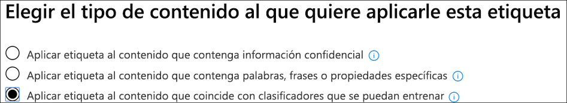

# <a name="create-publish-and-auto-apply-retention-labels"></a><span data-ttu-id="31f06-103">Crear, publicar y aplicar automáticamente etiquetas de retención</span><span class="sxs-lookup"><span data-stu-id="31f06-103">Create, publish, and auto-apply retention labels</span></span>

><span data-ttu-id="31f06-104">*[Guía de licencias de Microsoft 365 para la seguridad y el cumplimiento](https://aka.ms/ComplianceSD).*</span><span class="sxs-lookup"><span data-stu-id="31f06-104">*[Microsoft 365 licensing guidance for security & compliance](https://aka.ms/ComplianceSD).*</span></span>

<span data-ttu-id="31f06-105">Utilice la siguiente información para ayudarle a crear [etiquetas de retención](labels.md), y luego aplicarlas automáticamente a los documentos y correos electrónicos, o publicarlas para que los usuarios puedan aplicarlas manualmente.</span><span class="sxs-lookup"><span data-stu-id="31f06-105">Use the following information to help you create [retention labels](labels.md), and then automatically apply them to documents and emails, or publish them so that users can manually apply them.</span></span>

<span data-ttu-id="31f06-106">Las etiquetas de retención lo ayudan a retener lo que necesita y a eliminar lo que no.</span><span class="sxs-lookup"><span data-stu-id="31f06-106">Retention labels help you retain what you need and delete what you don't.</span></span> <span data-ttu-id="31f06-107">También se utilizan para declarar un artículo como registro como parte de una solución de[administración de registros](records-management.md) para sus datos de Microsoft 365.</span><span class="sxs-lookup"><span data-stu-id="31f06-107">They are also used to declare an item as a record as part of a [records management](records-management.md) solution for your Microsoft 365 data.</span></span>

<span data-ttu-id="31f06-108">El lugar donde se crean y configuran las etiquetas de retención depende de si se utiliza la administración de registros o no.</span><span class="sxs-lookup"><span data-stu-id="31f06-108">Where you create and configure your retention labels depend on whether you're using records management or not.</span></span> <span data-ttu-id="31f06-109">Se proporcionan instrucciones para ambos escenarios.</span><span class="sxs-lookup"><span data-stu-id="31f06-109">Instructions are provided for both scenarios.</span></span>

## <a name="before-you-begin"></a><span data-ttu-id="31f06-110">Antes de empezar</span><span class="sxs-lookup"><span data-stu-id="31f06-110">Before you begin</span></span>

<span data-ttu-id="31f06-111">Los miembros de su equipo de cumplimiento que vayan a crear las etiquetas de retención necesitan permisos para el Centro de &amp;Seguridad y Cumplimiento.</span><span class="sxs-lookup"><span data-stu-id="31f06-111">Members of your compliance team who will create retention labels need permissions to the Security &amp; Compliance Center.</span></span> <span data-ttu-id="31f06-112">De forma predeterminada, el administrador de inquilinos tendrá acceso a esta ubicación y puede otorgar acceso a los oficiales de cumplimiento y a otros usuarios al Centro de &amp;Cumplimiento y Seguridad, sin concederles todos los permisos de un administrador de inquilinos. Para hacerlo, le recomendamos que vaya a la página **Permisos** del Centro de &amp;Cumplimiento y Seguridad, edite el grupo de roles del **Administrador de Cumplimiento** y agregue miembros a ese grupo de roles.</span><span class="sxs-lookup"><span data-stu-id="31f06-112">By default, your tenant admin has access to this location and can give compliance officers and other people access to the Security &amp; Compliance Center, without giving them all of the permissions of a tenant admin. To do this, we recommend that you go to the **Permissions** page of the Security &amp; Compliance Center, edit the **Compliance Administrator** role group, and add members to that role group.</span></span> 
  
<span data-ttu-id="31f06-113">Para obtener más información, vea [Conceder acceso a los usuarios al Centro de seguridad y cumplimiento de Office 365](../security/office-365-security/grant-access-to-the-security-and-compliance-center.md).</span><span class="sxs-lookup"><span data-stu-id="31f06-113">For more information, see [Give users access to the Office 365 Security &amp; Compliance Center](../security/office-365-security/grant-access-to-the-security-and-compliance-center.md).</span></span>
  
<span data-ttu-id="31f06-114">These permissions are required only to create and apply retention labels and a label policy.</span><span class="sxs-lookup"><span data-stu-id="31f06-114">These permissions are required only to create and apply retention labels and a label policy.</span></span> <span data-ttu-id="31f06-115">Policy enforcement does not require access to the content.</span><span class="sxs-lookup"><span data-stu-id="31f06-115">Policy enforcement does not require access to the content.</span></span>

## <a name="create-and-configure-retention-labels"></a><span data-ttu-id="31f06-116">Crear y configurar las etiquetas de retención</span><span class="sxs-lookup"><span data-stu-id="31f06-116">Create and configure retention labels</span></span>

1. <span data-ttu-id="31f06-117">En el [Centro de cumplimiento de Microsoft 365](https://compliance.microsoft.com/), desplácese hasta una de las siguientes locaciones:</span><span class="sxs-lookup"><span data-stu-id="31f06-117">In the [Microsoft 365 compliance center](https://compliance.microsoft.com/), navigate to one of the following locations:</span></span>
    
    - <span data-ttu-id="31f06-118">Si utiliza la administración de registros:</span><span class="sxs-lookup"><span data-stu-id="31f06-118">If you are using records management:</span></span>
        - <span data-ttu-id="31f06-119">**Soluciones** > **Administración de registros** > pestaña**Plan de archivos** tab > **+ Crear una etiqueta** > **Etiqueta de retención**</span><span class="sxs-lookup"><span data-stu-id="31f06-119">**Solutions** > **Records management** > **File plan** tab > **+ Create a label** > **Retention label**</span></span>
        
    - <span data-ttu-id="31f06-120">Si no está utilizando la administración de registros:</span><span class="sxs-lookup"><span data-stu-id="31f06-120">If you are not using records management:</span></span>
       - <span data-ttu-id="31f06-121">**Soluciones** > **Gobierno de información** > pestaña**Etiquetas** > + **Crear una etiqueta**</span><span class="sxs-lookup"><span data-stu-id="31f06-121">**Solutions** > **Information governance** > **Labels** tab > + **Create a label**</span></span>
    
    <span data-ttu-id="31f06-122">¿No ve su opción inmediatamente?</span><span class="sxs-lookup"><span data-stu-id="31f06-122">Don't immediately see your option?</span></span> <span data-ttu-id="31f06-123">Primero seleccione **Mostrar todo**.</span><span class="sxs-lookup"><span data-stu-id="31f06-123">First select **Show all**.</span></span> 

2. <span data-ttu-id="31f06-124">Siga las instrucciones del asistente.</span><span class="sxs-lookup"><span data-stu-id="31f06-124">Follow the prompts in the wizard.</span></span> <span data-ttu-id="31f06-125">Si utiliza la administración de registros:</span><span class="sxs-lookup"><span data-stu-id="31f06-125">If you are using records management:</span></span>
    
    - <span data-ttu-id="31f06-126">Para obtener información sobre los descriptores del plan de archivos, consulte [Usar plan de archivos para administrar etiquetas de retención](file-plan-manager.md) </span><span class="sxs-lookup"><span data-stu-id="31f06-126">For information about the file plan descriptors, see [Use file plan to manage retention labels](file-plan-manager.md)</span></span>
    
    - <span data-ttu-id="31f06-127">Para utilizar la etiqueta de retención para declarar el contenido como un registro, active la casilla de verificación**Utilizar la etiqueta para clasificar el contenido como "Registro"**.</span><span class="sxs-lookup"><span data-stu-id="31f06-127">To use the retention label to declare content as a record, enable the checkbox **Use label to classify content as a "Record"**.</span></span>

3. <span data-ttu-id="31f06-128">Repita estos pasos para crear más etiquetas.</span><span class="sxs-lookup"><span data-stu-id="31f06-128">Repeat these steps to create more labels.</span></span>

<span data-ttu-id="31f06-129">Para editar una etiqueta existente, selecciónela y después seleccione **Editar etiqueta** para iniciar el mismo asistente que le permite cambiar las descripciones de las etiquetas y cualquier [configuración elegible](#updating-retention-labels-and-their-policies) del paso 2.</span><span class="sxs-lookup"><span data-stu-id="31f06-129">To edit an existing label, select it, and then select **Edit label** to start the same wizard that lets you change the label descriptions and any [eligible settings](#updating-retention-labels-and-their-policies) from step 2.</span></span> <span data-ttu-id="31f06-130">Como alternativa, seleccione cualquiera de las opciones disponibles de **Editar** para ir directamente a la página correspondiente y actualizar.</span><span class="sxs-lookup"><span data-stu-id="31f06-130">Alternatively, select any of the available **Edit** options to go directly to the relevant page to make your update.</span></span>

## <a name="publish-retention-labels-by-creating-a-retention-label-policy"></a><span data-ttu-id="31f06-131">Publicar etiquetas de retención creando una directiva de etiquetas de retención</span><span class="sxs-lookup"><span data-stu-id="31f06-131">Publish retention labels by creating a retention label policy</span></span>

<span data-ttu-id="31f06-132">Publicar etiquetas de retención para que puedan ser aplicadas manualmente por los usuarios.</span><span class="sxs-lookup"><span data-stu-id="31f06-132">Publish retention labels so that they can be manually applied by users.</span></span>

1. <span data-ttu-id="31f06-133">En el [Centro de cumplimiento de Microsoft 365](https://compliance.microsoft.com/), desplácese hasta una de las siguientes locaciones:</span><span class="sxs-lookup"><span data-stu-id="31f06-133">In the [Microsoft 365 compliance center](https://compliance.microsoft.com/), navigate to one of the following locations:</span></span>
    
    - <span data-ttu-id="31f06-134">Si utiliza la administración de registros:</span><span class="sxs-lookup"><span data-stu-id="31f06-134">If you are using records management:</span></span>
        - <span data-ttu-id="31f06-135">**Soluciones** > **Administración de registros \*\* > > pestaña**Directivas de etiquetas\*\* > **Etiquetas publicadas**</span><span class="sxs-lookup"><span data-stu-id="31f06-135">**Solutions** > **Records management** > > **Label policies** tab > **Publish labels**</span></span>
    
    - <span data-ttu-id="31f06-136">Si no está utilizando la administración de registros:</span><span class="sxs-lookup"><span data-stu-id="31f06-136">If you are not using records management:</span></span>
        - <span data-ttu-id="31f06-137">**Soluciones** > **Gobierno de información** > pestaña**Directivas de etiquetas** > **Publicar etiquetas**</span><span class="sxs-lookup"><span data-stu-id="31f06-137">**Solutions** > **Information governance** > **Label policies** tab > **Publish labels**</span></span>
    
    <span data-ttu-id="31f06-138">¿No ve su opción inmediatamente?</span><span class="sxs-lookup"><span data-stu-id="31f06-138">Don't immediately see your option?</span></span> <span data-ttu-id="31f06-139">Primero seleccione **Mostrar todo**.</span><span class="sxs-lookup"><span data-stu-id="31f06-139">First select **Show all**.</span></span> 

2. <span data-ttu-id="31f06-140">Siga las instrucciones del asistente.</span><span class="sxs-lookup"><span data-stu-id="31f06-140">Follow the prompts in the wizard.</span></span>
    
    <span data-ttu-id="31f06-141">Para obtener información sobre las ubicaciones compatibles con las etiquetas de retención, vea la sección [Etiquetas de retención y ubicaciones](labels.md#retention-label-policies-and-locations).</span><span class="sxs-lookup"><span data-stu-id="31f06-141">For information about the locations supported by retention labels, see the [Retention labels and locations](labels.md#retention-label-policies-and-locations) section.</span></span> 

<span data-ttu-id="31f06-142">Para editar una directiva de etiqueta de retención existente, selecciónela y después seleccione **Editar directiva** para iniciar el mismo asistente que le permite cambiar la descripción de la directiva y las [configuraciones elegibles](#updating-retention-labels-and-their-policies) del paso 2.</span><span class="sxs-lookup"><span data-stu-id="31f06-142">To edit an existing retention label policy, select it, and then select **Edit policy** to start the same wizard that lets you change the policy description and any [eligible settings](#updating-retention-labels-and-their-policies) from step 2.</span></span> <span data-ttu-id="31f06-143">Como alternativa, seleccione cualquiera de las opciones disponibles de **Editar** para ir directamente a la página correspondiente y actualizar.</span><span class="sxs-lookup"><span data-stu-id="31f06-143">Alternatively, select any of the available **Edit** options to go directly to the relevant page to make your update.</span></span>

## <a name="auto-apply-a-retention-label"></a><span data-ttu-id="31f06-144">Aplicar automáticamente una etiqueta de retención</span><span class="sxs-lookup"><span data-stu-id="31f06-144">Auto-apply a retention label</span></span>

<span data-ttu-id="31f06-145">Aplica automáticamente una etiqueta de retención, basada en las condiciones que especifiques.</span><span class="sxs-lookup"><span data-stu-id="31f06-145">Auto-apply a retention label, based on the conditions that you specify.</span></span>

1. <span data-ttu-id="31f06-146">En el [Centro de cumplimiento de Microsoft 365](https://compliance.microsoft.com/), desplácese hasta una de las siguientes locaciones:</span><span class="sxs-lookup"><span data-stu-id="31f06-146">In the [Microsoft 365 compliance center](https://compliance.microsoft.com/), navigate to one of the following locations:</span></span>
    
    - <span data-ttu-id="31f06-147">Si utiliza la administración de registros:**Gobierno de información**:</span><span class="sxs-lookup"><span data-stu-id="31f06-147">If you are using records management: **Information governance**:</span></span>
        - <span data-ttu-id="31f06-148">**Soluciones** > **Administración de registros \*\* > pestaña**Directivas de etiquetas **>** Aplicar automáticamente etiquetas\*\*</span><span class="sxs-lookup"><span data-stu-id="31f06-148">**Solutions** > **Records management** > **Label policies** tab > **Auto-apply label**</span></span>
    
    - <span data-ttu-id="31f06-149">Si no está utilizando la administración de registros:</span><span class="sxs-lookup"><span data-stu-id="31f06-149">If you are not using records management:</span></span>
        - <span data-ttu-id="31f06-150">**Soluciones** > **Gobierno de información** > pestaña**Directivas de etiquetas** > **Aplicar automáticamente etiquetas**</span><span class="sxs-lookup"><span data-stu-id="31f06-150">**Solutions** > **Information governance** > **Label policies** tab > **Auto-apply label**</span></span>
    
    <span data-ttu-id="31f06-151">¿No ve su opción inmediatamente?</span><span class="sxs-lookup"><span data-stu-id="31f06-151">Don't immediately see your option?</span></span> <span data-ttu-id="31f06-152">Primero seleccione **Mostrar todo**.</span><span class="sxs-lookup"><span data-stu-id="31f06-152">First select **Show all**.</span></span> 

2. <span data-ttu-id="31f06-153">Siga las instrucciones del asistente.</span><span class="sxs-lookup"><span data-stu-id="31f06-153">Follow the prompts in the wizard.</span></span>
    
    <span data-ttu-id="31f06-154">Para obtener información sobre la configuración de las condiciones que aplican automáticamente la etiqueta de retención, consulte la sección [Configuración de las condiciones para la aplicación automática de etiquetas de retención en](#configuring-conditions-for-auto-apply-retention-labels) esta página.</span><span class="sxs-lookup"><span data-stu-id="31f06-154">For information about configuring the conditions that automatically apply the retention label, see the [Configuring conditions for auto-apply retention labels](#configuring-conditions-for-auto-apply-retention-labels) section on this page.</span></span>
    
    <span data-ttu-id="31f06-155">Para obtener información sobre las ubicaciones compatibles con las etiquetas de retención, vea la sección [Etiquetas de retención y ubicaciones](labels.md#retention-label-policies-and-locations).</span><span class="sxs-lookup"><span data-stu-id="31f06-155">For information about the locations supported by retention labels, see the [Retention labels and locations](labels.md#retention-label-policies-and-locations) section.</span></span>

<span data-ttu-id="31f06-156">Para editar una directiva de etiqueta de aplicación automática existente, selecciónela y después seleccione **Editar directiva** para iniciar el mismo asistente que le permite cambiar la descripción de la directiva y las [configuraciones elegibles](#updating-retention-labels-and-their-policies) del paso 2.</span><span class="sxs-lookup"><span data-stu-id="31f06-156">To edit an existing auto-apply label policy, select it, and then select **Edit policy** to start the same wizard that lets you change the policy description and any [eligible settings](#updating-retention-labels-and-their-policies) from step 2.</span></span> <span data-ttu-id="31f06-157">Como alternativa, seleccione cualquiera de las opciones disponibles de **Editar** para ir directamente a la página correspondiente y actualizar.</span><span class="sxs-lookup"><span data-stu-id="31f06-157">Alternatively, select any of the available **Edit** options to go directly to the relevant page to make your update.</span></span>


## <a name="configuring-conditions-for-auto-apply-retention-labels"></a><span data-ttu-id="31f06-158">Configurar las condiciones para la aplicación automática de etiquetas de retención</span><span class="sxs-lookup"><span data-stu-id="31f06-158">Configuring conditions for auto-apply retention labels</span></span>

<span data-ttu-id="31f06-159">Puede aplicar etiquetas de retención al contenido automáticamente cuando éste contiene:</span><span class="sxs-lookup"><span data-stu-id="31f06-159">You can apply retention labels to content automatically when that content contains:</span></span>
  
- [<span data-ttu-id="31f06-160">Tipos específicos de información confidencial</span><span class="sxs-lookup"><span data-stu-id="31f06-160">Specific types of sensitive information</span></span>](#auto-apply-labels-to-content-with-specific-types-of-sensitive-information)
    
- [<span data-ttu-id="31f06-161">Palabras clave específicas que coinciden con una consulta que haya creado</span><span class="sxs-lookup"><span data-stu-id="31f06-161">Specific keywords that match a query you create</span></span>](#auto-apply-labels-to-content-with-keywords-or-searchable-properties)

- [<span data-ttu-id="31f06-162">Una coincidencia para clasificadores que se pueden entrenar</span><span class="sxs-lookup"><span data-stu-id="31f06-162">A match for trainable classifiers</span></span>](#auto-apply-labels-to-content-by-using-trainable-classifiers)
    


<span data-ttu-id="31f06-164">Las etiquetas de retención aplicadas automáticamente puede tardar hasta siete días en aplicarse a todo el contenido que coincida con las condiciones que ha configurado.</span><span class="sxs-lookup"><span data-stu-id="31f06-164">It can take up to seven days for auto-apply retention labels to be applied to all content that matches the conditions you've configured.</span></span>

### <a name="auto-apply-labels-to-content-with-specific-types-of-sensitive-information"></a><span data-ttu-id="31f06-165">Aplicar automáticamente etiquetas a los contenidos con tipos específicos de información sensible</span><span class="sxs-lookup"><span data-stu-id="31f06-165">Auto-apply labels to content with specific types of sensitive information</span></span>

<span data-ttu-id="31f06-166">Al crear etiquetas de retención de aplicación automática para información confidencial, verá la misma lista de plantillas de directiva que cuando se crea una directiva de prevención de pérdida de datos (DLP).</span><span class="sxs-lookup"><span data-stu-id="31f06-166">When you create auto-apply retention labels for sensitive information, you see the same list of policy templates as when you create a data loss prevention (DLP) policy.</span></span> <span data-ttu-id="31f06-167">Cada plantilla de directiva está preconfigurada para buscar determinados tipos de información confidencial.</span><span class="sxs-lookup"><span data-stu-id="31f06-167">Each policy template is preconfigured to look for specific types of sensitive information.</span></span> <span data-ttu-id="31f06-168">Por ejemplo, la plantilla que se muestra aquí busca números de ITIN, SSN y pasaporte de Estados Unidos.</span><span class="sxs-lookup"><span data-stu-id="31f06-168">For example, the template shown here looks for U.S. ITIN, SSN, and passport numbers.</span></span> <span data-ttu-id="31f06-169">Para obtener más información sobre DLP, vea [Información general sobre directivas de prevención de pérdida de datos](data-loss-prevention-policies.md).</span><span class="sxs-lookup"><span data-stu-id="31f06-169">To learn more about DLP, see [Overview of data loss prevention policies](data-loss-prevention-policies.md).</span></span>
  

  
<span data-ttu-id="31f06-171">After you select a policy template, you can add or remove any types of sensitive information, and you can change the instance count and match accuracy.</span><span class="sxs-lookup"><span data-stu-id="31f06-171">After you select a policy template, you can add or remove any types of sensitive information, and you can change the instance count and match accuracy.</span></span> <span data-ttu-id="31f06-172">In the example shown here, a retention label will be auto-applied only when:</span><span class="sxs-lookup"><span data-stu-id="31f06-172">In the example shown here, a retention label will be auto-applied only when:</span></span>
  
- <span data-ttu-id="31f06-173">The content contains between 1 and 9 instances of any of these three sensitive information types.</span><span class="sxs-lookup"><span data-stu-id="31f06-173">The content contains between 1 and 9 instances of any of these three sensitive information types.</span></span> <span data-ttu-id="31f06-174">You can delete the **max** value so that it changes to **any**.</span><span class="sxs-lookup"><span data-stu-id="31f06-174">You can delete the **max** value so that it changes to **any**.</span></span>
    
- <span data-ttu-id="31f06-175">The type of sensitive information that's detected has a match accuracy (or confidence level) of at least 75.</span><span class="sxs-lookup"><span data-stu-id="31f06-175">The type of sensitive information that's detected has a match accuracy (or confidence level) of at least 75.</span></span> <span data-ttu-id="31f06-176">Many sensitive information types are defined with multiple patterns, where a pattern with a higher match accuracy requires more evidence to be found (such as keywords, dates, or addresses), while a pattern with a lower match accuracy requires less evidence.</span><span class="sxs-lookup"><span data-stu-id="31f06-176">Many sensitive information types are defined with multiple patterns, where a pattern with a higher match accuracy requires more evidence to be found (such as keywords, dates, or addresses), while a pattern with a lower match accuracy requires less evidence.</span></span> <span data-ttu-id="31f06-177">Simply put, the lower the **min** match accuracy, the easier it is for content to match the condition.</span><span class="sxs-lookup"><span data-stu-id="31f06-177">Simply put, the lower the **min** match accuracy, the easier it is for content to match the condition.</span></span> 
    
<span data-ttu-id="31f06-178">Para obtener más información acerca de estas opciones, vea [Ajustar reglas para que sea más o menos fáciles que coincidan](data-loss-prevention-policies.md#tuning-rules-to-make-them-easier-or-harder-to-match).</span><span class="sxs-lookup"><span data-stu-id="31f06-178">For more information on these options, see [Tuning rules to make them easier or harder to match](data-loss-prevention-policies.md#tuning-rules-to-make-them-easier-or-harder-to-match).</span></span>
    

  
### <a name="auto-apply-labels-to-content-with-keywords-or-searchable-properties"></a><span data-ttu-id="31f06-180">Aplicar automáticamente etiquetas a contenido con palabras clave o propiedades que se puedan buscar</span><span class="sxs-lookup"><span data-stu-id="31f06-180">Auto-apply labels to content with keywords or searchable properties</span></span>

<span data-ttu-id="31f06-181">You can auto-apply labels to content that satisfies certain conditions.</span><span class="sxs-lookup"><span data-stu-id="31f06-181">You can auto-apply labels to content that satisfies certain conditions.</span></span> <span data-ttu-id="31f06-182">The conditions now available support applying a label to content that contains specific words, phrases, or values of searchable properties.</span><span class="sxs-lookup"><span data-stu-id="31f06-182">The conditions now available support applying a label to content that contains specific words, phrases, or values of searchable properties.</span></span> <span data-ttu-id="31f06-183">You can refine your query by using search operators like AND, OR, and NOT.</span><span class="sxs-lookup"><span data-stu-id="31f06-183">You can refine your query by using search operators like AND, OR, and NOT.</span></span>

<span data-ttu-id="31f06-184">Para obtener más información sobre la sintaxis de consultas, vea:</span><span class="sxs-lookup"><span data-stu-id="31f06-184">For more information on query syntax, see:</span></span>

- [<span data-ttu-id="31f06-185">Referencia de la sintaxis del lenguaje de consultas de palabras clave (KQL)</span><span class="sxs-lookup"><span data-stu-id="31f06-185">Keyword Query Language (KQL) syntax reference</span></span>](https://docs.microsoft.com/sharepoint/dev/general-development/keyword-query-language-kql-syntax-reference)

<span data-ttu-id="31f06-186">Query-based labels use the search index to identify content.</span><span class="sxs-lookup"><span data-stu-id="31f06-186">Query-based labels use the search index to identify content.</span></span> <span data-ttu-id="31f06-187">For more information on valid searchable properties, see:</span><span class="sxs-lookup"><span data-stu-id="31f06-187">For more information on valid searchable properties, see:</span></span>

- <span data-ttu-id="31f06-188">[Consultas de palabras clave y condiciones de búsqueda para la búsqueda de contenido](keyword-queries-and-search-conditions.md).</span><span class="sxs-lookup"><span data-stu-id="31f06-188">[Keyword queries and search conditions for Content Search](keyword-queries-and-search-conditions.md)</span></span>
- [<span data-ttu-id="31f06-189">Información general sobre las propiedades administradas y rastreadas en SharePoint Server</span><span class="sxs-lookup"><span data-stu-id="31f06-189">Overview of crawled and managed properties in SharePoint Server</span></span>](https://docs.microsoft.com/SharePoint/technical-reference/crawled-and-managed-properties-overview)

<span data-ttu-id="31f06-190">Consultas de ejemplos:</span><span class="sxs-lookup"><span data-stu-id="31f06-190">Examples queries:</span></span>

- <span data-ttu-id="31f06-191">Exchange</span><span class="sxs-lookup"><span data-stu-id="31f06-191">Exchange</span></span>
    - <span data-ttu-id="31f06-192">asunto:"Finanzas trimestrales"</span><span class="sxs-lookup"><span data-stu-id="31f06-192">subject:"Quarterly Financials"</span></span>
    - <span data-ttu-id="31f06-193">destinatarios: jorgem</span><span class="sxs-lookup"><span data-stu-id="31f06-193">recipients:garthf</span></span><!--nolink--><span data-ttu-id="31f06-194">@contoso.com</span><span class="sxs-lookup"><span data-stu-id="31f06-194">@contoso.com</span></span>
- <span data-ttu-id="31f06-195">SharePoint y OneDrive</span><span class="sxs-lookup"><span data-stu-id="31f06-195">SharePoint and OneDrive</span></span>
    - <span data-ttu-id="31f06-196">contenttype:contract</span><span class="sxs-lookup"><span data-stu-id="31f06-196">contenttype:contract</span></span>
    - <span data-ttu-id="31f06-197">sitio:https</span><span class="sxs-lookup"><span data-stu-id="31f06-197">site:https</span></span><!--nolink--><span data-ttu-id="31f06-198">://contoso.sharepoint.com/sites/teams/procurement AND contenttype:contract</span><span class="sxs-lookup"><span data-stu-id="31f06-198">://contoso.sharepoint.com/sites/teams/procurement AND contenttype:contract</span></span>


### <a name="auto-apply-labels-to-content-by-using-trainable-classifiers"></a><span data-ttu-id="31f06-200">Aplicar automáticamente etiquetas al contenido con clasificadores que se pueden entrenar</span><span class="sxs-lookup"><span data-stu-id="31f06-200">Auto-apply labels to content by using trainable classifiers</span></span>

<span data-ttu-id="31f06-201">Si elige la opción para un clasificador que se puede entrenar, puede seleccionar uno de los clasificadores integrado o un clasificador personalizado.</span><span class="sxs-lookup"><span data-stu-id="31f06-201">When you choose the option for a trainable classifier, you can select one of the built-in classifiers, or a custom classifier.</span></span> <span data-ttu-id="31f06-202">Los clasificadores integrados incluyen **Currículum**, **Código fuente**, **Código fuente**, **Acoso selectivo**, **Amenazas**:</span><span class="sxs-lookup"><span data-stu-id="31f06-202">The built-in classifiers include **Resumes**, **SourceCode**, **Targeted Harassment**, **Profanity**, and **Threat**:</span></span>


<span data-ttu-id="31f06-204">Para aplicar una etiqueta automáticamente usando esta opción, los buzones y sitios de SharePoint Online deben tener al menos 10 MB de datos.</span><span class="sxs-lookup"><span data-stu-id="31f06-204">To automatically apply a label by using this option, SharePoint Online sites and mailboxes must have at least 10 MB of data.</span></span>

<span data-ttu-id="31f06-205">Para obtener más información sobre los clasificadores que se pueden entrenar, consulte [Introducción al entrenamiento de clasificadores (vista previa)](classifier-getting-started-with.md).</span><span class="sxs-lookup"><span data-stu-id="31f06-205">For more information about trainable classifiers, see [Getting started with trainable classifiers (preview)](classifier-getting-started-with.md).</span></span>

<span data-ttu-id="31f06-206">Para obtener un ejemplo de configuración, consulte [cómo preparar y usar un clasificador integrado](classifier-using-a-ready-to-use-classifier.md#how-to-verify-that-a-built-in-classifier-will-meet-your-needs).</span><span class="sxs-lookup"><span data-stu-id="31f06-206">For an example configuration, see [How to prepare for and use a built-in classifier](classifier-using-a-ready-to-use-classifier.md#how-to-verify-that-a-built-in-classifier-will-meet-your-needs).</span></span>

## <a name="how-long-it-takes-for-retention-labels-to-take-effect"></a><span data-ttu-id="31f06-207">Tiempo que tardan las etiquetas de retención en aplicarse</span><span class="sxs-lookup"><span data-stu-id="31f06-207">How long it takes for retention labels to take effect</span></span>

<span data-ttu-id="31f06-208">Al publicar o aplicar automáticamente etiquetas de retención, no surten efecto inmediatamente:</span><span class="sxs-lookup"><span data-stu-id="31f06-208">When you publish or auto-apply retention labels, they don't take effect immediately:</span></span>
  
1. <span data-ttu-id="31f06-209">Primero, la directiva de etiquetas tiene que sincronizarse desde el centro de administración con las ubicaciones en la directiva.</span><span class="sxs-lookup"><span data-stu-id="31f06-209">First the label policy needs to be synced from the admin center to the locations in the policy.</span></span>
    
2. <span data-ttu-id="31f06-210">Entonces la ubicación podría requerir tiempo para poner a disposición de los usuarios finales las etiquetas de retención publicadas o tiempo para aplicar automáticamente las etiquetas al contenido.</span><span class="sxs-lookup"><span data-stu-id="31f06-210">Then the location might require time to make published retention labels available to end users or time to auto-apply labels to content.</span></span> <span data-ttu-id="31f06-211">El tiempo que se tarda depende de la ubicación y el tipo de etiqueta de retención.</span><span class="sxs-lookup"><span data-stu-id="31f06-211">How long this takes depends on the location and type of retention label.</span></span>
    
### <a name="published-retention-labels"></a><span data-ttu-id="31f06-212">Etiquetas de retención publicadas</span><span class="sxs-lookup"><span data-stu-id="31f06-212">Published retention labels</span></span>

<span data-ttu-id="31f06-213">If you publish retention labels to SharePoint or OneDrive, those labels  typically appear for end users to select within one day.</span><span class="sxs-lookup"><span data-stu-id="31f06-213">If you publish retention labels to SharePoint or OneDrive, those labels  typically appear for end users to select within one day.</span></span> <span data-ttu-id="31f06-214">However, allow up to seven days.</span><span class="sxs-lookup"><span data-stu-id="31f06-214">However, allow up to seven days.</span></span> <span data-ttu-id="31f06-215">If you publish retention labels to Exchange, it can take up to seven days for those retention labels to appear for end users, and the mailbox must contain at least 10 MB of data.</span><span class="sxs-lookup"><span data-stu-id="31f06-215">If you publish retention labels to Exchange, it can take up to seven days for those retention labels to appear for end users, and the mailbox must contain at least 10 MB of data.</span></span>

<span data-ttu-id="31f06-216">Por ejemplo:</span><span class="sxs-lookup"><span data-stu-id="31f06-216">For example:</span></span>
  

  
### <a name="auto-apply-retention-labels"></a><span data-ttu-id="31f06-218">Aplicar automáticamente etiquetas de retención</span><span class="sxs-lookup"><span data-stu-id="31f06-218">Auto-apply retention labels</span></span>

<span data-ttu-id="31f06-219">Si aplica automáticamente las etiquetas de retención al contenido que coincida con condiciones específicas, puede tardar hasta siete días en aplicar las etiquetas de retención a todo el contenido existente que coincida con las condiciones.</span><span class="sxs-lookup"><span data-stu-id="31f06-219">If you auto-apply retention labels to content matching specific conditions, it can take up to seven days for the retention labels to be applied to all existing content that matches the conditions.</span></span>
  

  
### <a name="how-to-check-on-the-status-of-retention-labels-published-to-exchange"></a><span data-ttu-id="31f06-221">Cómo comprobar el estado de las etiquetas de retención publicadas en Exchange</span><span class="sxs-lookup"><span data-stu-id="31f06-221">How to check on the status of retention labels published to Exchange</span></span>

<span data-ttu-id="31f06-222">En Exchange Online, las etiquetas de retención están disponibles para los usuarios finales mediante un proceso que se ejecuta cada siete días.</span><span class="sxs-lookup"><span data-stu-id="31f06-222">In Exchange Online, retention labels are made available to end users by a process that runs every seven days.</span></span> <span data-ttu-id="31f06-223">Mediante el uso de Powershell, se puede ver cuándo se ejecutó este proceso por última vez y así identificar cuándo se volverá a ejecutar.</span><span class="sxs-lookup"><span data-stu-id="31f06-223">By using Powershell, you can see when this process last ran and therefore identify when it will run again.</span></span>
  
1. <span data-ttu-id="31f06-224">[Conéctese al PowerShell de Exchange Online](https://go.microsoft.com/fwlink/?linkid=799773).</span><span class="sxs-lookup"><span data-stu-id="31f06-224">[Connect to Exchange Online PowerShell](https://go.microsoft.com/fwlink/?linkid=799773).</span></span>
    
2. <span data-ttu-id="31f06-225">Ejecute estos comandos.</span><span class="sxs-lookup"><span data-stu-id="31f06-225">Run these commands.</span></span>
    
   ```powershell
   $logProps = Export-MailboxDiagnosticLogs <user> -ExtendedProperties
   ```

   ```powershell
   $xmlprops = [xml]($logProps.MailboxLog)
   ```

   ```powershell
   $xmlprops.Properties.MailboxTable.Property | ? {$_.Name -like "ELC*"}   ```

In the results, the `ELCLastSuccessTimeStamp` (UTC) property shows when the system last processed your mailbox. If it has not happened since the time you created the policy, the labels are not going to appear. To force processing, run  `Start-ManagedFolderAssistant -Identity <user>`.
    
If labels aren't appearing in Outlook on the web and you think they should be, make sure to clear the cache in your browser (CTRL+F5).
    

## Updating retention labels and their policies

When you edit a retention label, retention label policy, or auto-apply policy, and the retention label or policy is already applied to content, your updated settings will automatically be applied to this content in addition to content that's newly identified.

Some settings can't be changed after the label or policy is created and saved, which include:
- The retention settings except the retention period, unless you've configured the label to retain or delete the content based on when it was created.
- The option to classify as a record.

## Find the PowerShell cmdlets for retention labels

To use the retention label cmdlets:
  
1. [Connect to the Office 365 Security & Compliance Center Powershell](https://docs.microsoft.com/powershell/exchange/office-365-scc/connect-to-scc-powershell/connect-to-scc-powershell)
    
2. Use these Office 365 Security & Compliance Center cmdlets:
    
    - [Get-ComplianceTag](https://docs.microsoft.com/powershell/module/exchange/get-compliancetag)
    
    - [New-ComplianceTag](https://docs.microsoft.com/powershell/module/exchange/new-compliancetag)
    
    - [Remove-ComplianceTag](https://docs.microsoft.com/powershell/module/exchange/remove-compliancetag)
    
    - [Set-ComplianceTag](https://docs.microsoft.com/powershell/module/exchange/set-compliancetag)
    
    - [Enable-ComplianceTagStorage](https://docs.microsoft.com/powershell/module/exchange/enable-compliancetagstorage)
    
    - [Get-ComplianceTagStorage](https://docs.microsoft.com/powershell/module/exchange/get-compliancetagstorage)
    
    - [Get-RetentionCompliancePolicy](https://docs.microsoft.com/powershell/module/exchange/get-retentioncompliancepolicy)
    
    - [New-RetentionCompliancePolicy](https://docs.microsoft.com/powershell/module/exchange/new-retentioncompliancepolicy)
    
    - [Remove-RetentionCompliancePolicy](https://docs.microsoft.com/powershell/module/exchange/remove-retentioncompliancepolicy)
    
    - [Set-RetentionCompliancePolicy](https://docs.microsoft.com/powershell/module/exchange/set-retentioncompliancepolicy)
    
    - [Get-RetentionComplianceRule](https://docs.microsoft.com/powershell/module/exchange/get-retentioncompliancerule)
    
    - [New-RetentionComplianceRule](https://docs.microsoft.com/powershell/module/exchange/new-retentioncompliancerule)
    
    - [Remove-RetentionComplianceRule](https://docs.microsoft.com/powershell/module/exchange/remove-retentioncompliancerule)
    
    - [Set-RetentionComplianceRule](https://docs.microsoft.com/powershell/module/exchange/set-retentioncompliancerule)
