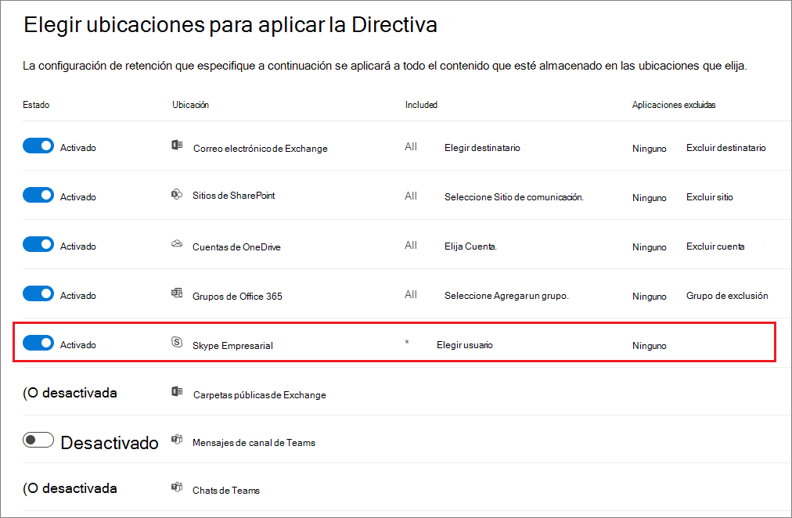
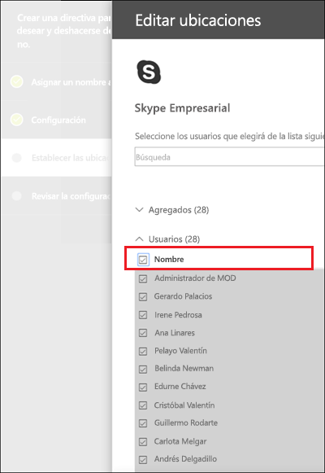
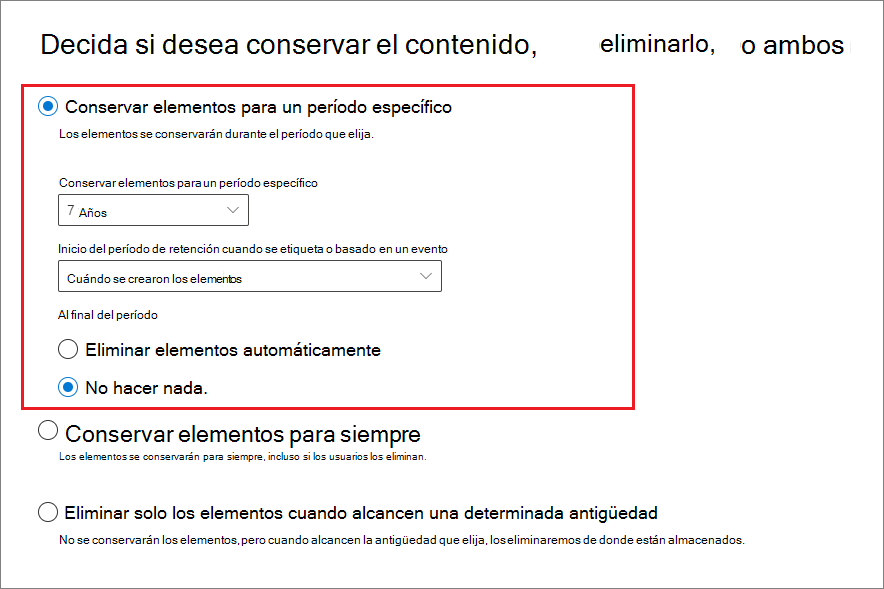
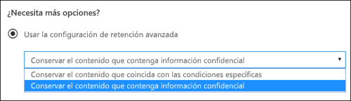
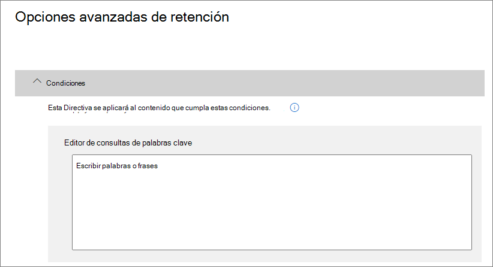
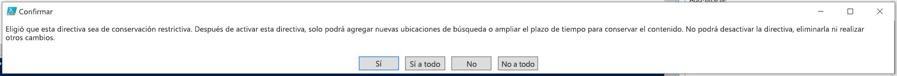

# <a name="create-and-configure-retention-policies"></a>Crear y configurar directivas de retención

>*[Guía de licencias de Microsoft 365 para la seguridad y el cumplimiento](https://aka.ms/ComplianceSD).*

Utilice una directiva de retención para decidir de forma pro activa si desea retener el contenido, eliminarlo o ambas cosas, retener y luego eliminar el contenido. 

Una directiva de retención le permite hacer esto de manera muy eficiente al asignar la misma configuración de retención para el contenido por ubicación, en el nivel de sitio o de buzón de correo. Si no está seguro sobre si debe usar una directiva de retención o una etiqueta de retención, consulte [Directivas de retención y etiquetas de retención](retention.md#retention-policies-and-retention-labels).

Para más información sobre directivas de retención y sobre cómo funciona la retención, consulte [Más información sobre la retención](retention.md).

## <a name="before-you-begin"></a>Antes de empezar

El administrador global de su organización tiene permisos totales para crear y modificar directivas de retención. Si no va a iniciar sesión como administrador global, consulte [Permisos necesarios para crear y administrar directivas de retención y etiquetas de retención](get-started-with-retention.md#permissions-required-to-create-and-manage-retention-policies-and-retention-labels).

## <a name="create-and-configure-a-retention-policy"></a>Crear y configurar una directiva de retención

Si bien una directiva de retención es compatible con varias ubicaciones, no se puede crear una única directiva de retención que incluya todas las ubicaciones compatibles:
- Correo electrónico de Exchange
- Sitio de SharePoint
- Cuentas de OneDrive
- Grupos de Microsoft 365
- Skype Empresarial
- Carpetas públicas de Exchange
- Mensajes de canal de Teams
- Chats de Teams

Al seleccionar una de las ubicaciones de Teams durante la creación de una directiva de retención, las demás ubicaciones quedan excluidas automáticamente. Por lo tanto, las instrucciones que debe seguir dependerán de si necesita incluir las ubicaciones de Teams:

- [Instrucciones para una directiva de retención para ubicaciones de Teams](#retention-policy-for-teams-locations)
- [Instrucciones para una directiva de retención para ubicaciones que no sean de Teams](#retention-policy-for-locations-other-than-teams)

Si tiene más de una directiva de retención y, además, utiliza etiquetas de retención, consulte [Los principios de la retención o qué tiene prioridad](retention.md#the-principles-of-retention-or-what-takes-precedence) para entender qué resultado se obtiene cuando varias configuraciones de retención se aplican al mismo contenido.

### <a name="retention-policy-for-teams-locations"></a>Directiva de retención para ubicaciones de Teams

1. En el[centro de cumplimiento de Microsoft 365](https://compliance.microsoft.com/), seleccione**Directivas de** > **retención**.

2. Seleccione **Nueva directiva de retención** para crear una nueva directiva de retención.

3. En la página del asistente **Decidir si quiere conservar el contenido, eliminarlo, o ambos**, especifique las opciones de configuración para conservar y eliminar el contenido. 
    
    Puede crear una directiva de retención que sólo retenga el contenido sin eliminarlo, que retenga y luego elimine después de un período de tiempo determinado, o que sólo elimine el contenido después de un período de tiempo determinado. Para más información, consulte [Configuración para conservar y eliminar contenido](#settings-for-retaining-and-deleting-content) en esta página.
    
    No seleccione **Usar la configuración de retención avanzada**, porque esta opción no es compatible con las ubicaciones de Teams. 

4. En la página **Elegir ubicaciones**, seleccione **Quiero elegir ubicaciones concretas**. A continuación, active una o ambas ubicaciones de Teams: **mensajes de canal de Teams** y **chats de Teams**.
     
    En **los mensajes de canal de Teams**, se incluyen los mensajes de los canales estándar, pero no los de[canales privados](https://docs.microsoft.com/microsoftteams/private-channels). Actualmente, los canales privados no son compatibles con las directivas de retención.
    
    De forma predeterminada, aparecen seleccionados todos los equipos, pero puede especificar los equipos que quiere que se incluyan y que se excluyan.

5. Finalice el asistente para guardar la configuración.

Para más información sobre las directivas de retención para Teams, consulte [Directivas de retención en Microsoft Teams](https://docs.microsoft.com/microsoftteams/retention-policies) en la documentación de Teams.

#### <a name="additional-retention-policy-needed-to-support-teams"></a>Directivas de retención adicionales que se necesitan para Teams

Teams es mucho más que solo chats y mensajes de canal. Si tiene equipos creados a partir de un grupo de Microsoft 365 (anteriormente grupo de Office 365), debe configurar una directiva de retención que incluya el grupo de Microsoft 365 mediante la ubicación **grupos de Office 365**. La directiva de retención se aplica al contenido del buzón, del sitio y de los archivos del grupo.

Si tiene sitios de equipo que no estén conectados con un grupo de Microsoft 365, necesitará una directiva de retención que incluya las ubicaciones de los **sitios de SharePoint** o de las **cuentas de OneDrive** para conservar y eliminar archivos en Teams:

- Los archivos que se comparten en el chat se almacenan en la cuenta de OneDrive del usuario que compartió el archivo. 

- Los archivos que se suben a los canales se almacenan en el sitio de SharePoint del equipo.

> [!TIP]
> Puede aplicar una directiva de retención a los archivos de un solo equipo específico cuando no está conectado a un grupo de Microsoft 365. Para ello, seleccione el sitio de SharePoint del equipo y las cuentas de OneDrive de los usuarios del mismo.

Es posible que una directiva de retención que se aplique a los grupos de Microsoft 365, los sitios de SharePoint o las cuentas de OneDrive pueda eliminar un archivo al que se hace referencia en un mensaje de canal o chat de Teams antes de que se eliminen esos mensajes. En este caso, el archivo seguirá apareciendo en el mensaje de Teams, pero cuando los usuarios lo seleccionen, obtendrán un error de "Archivo no encontrado". Este comportamiento no es específico de las directivas de retención y también podría ocurrir si un usuario elimina manualmente un archivo de SharePoint o OneDrive.


### <a name="retention-policy-for-locations-other-than-teams"></a>Directivas de retención para ubicaciones que no sean de Teams

1. En el[centro de cumplimiento de Microsoft 365](https://compliance.microsoft.com/), seleccione**Directivas de** > **retención**.

2. Seleccione **Nueva directiva de retención** para crear una nueva directiva de retención.

3. En la página del asistente **Decidir si quiere conservar el contenido, eliminarlo, o ambos**, especifique las opciones de configuración para conservar y eliminar el contenido. 
    
    Puede crear una directiva de retención que sólo retenga el contenido sin eliminarlo, que retenga y luego elimine después de un período de tiempo determinado, o que sólo elimine el contenido después de un período de tiempo determinado. Para más información, consulte [Configuración para conservar y eliminar contenido](#settings-for-retaining-and-deleting-content) en esta página.
    
    A continuación, decida si la directiva de retención debe aplicarse a todos los contenidos o a los que cumplan determinadas condiciones. Para obtener más información sobre esta configuración avanzada de retención, consulte[Ajustes avanzados para identificar el contenido que cumple con condiciones específicas](#advanced-settings-to-identify-content-that-meets-specific-conditions)en esta página. 

4. En la página**Elegir ubicaciones**, seleccione si la directiva de retención debe aplicarse a todas las ubicaciones admitidas en su organización o si desea especificar las ubicaciones. Si escoge lugares específicos, también puede especificar las inclusiones y exclusiones. 
    
    Para obtener más información sobre cómo elegir entre una directiva de retención para la organización o para lugares específicos, consulte[Aplicación de una directiva de retención a toda una organización o a lugares específicos en esta página.](#applying-a-retention-policy-to-an-entire-organization-or-specific-locations).
    
    Información específica de las ubicaciones:
    - [Correo electrónico de Exchange y carpetas públicas de Exchange](#configuration-information-for-exchange-email-and-exchange-public-folders)
    - [Sitios de SharePoint y cuentas de OneDrive](#configuration-information-for-sharepoint-sites-and-onedrive-accounts)
    - [Grupos de Office 365](#configuration-information-for-microsoft-365-groups)
    - [Skype Empresarial](#configuration-information-for-skype-for-business)

5. Finalice el asistente para guardar la configuración.


#### <a name="configuration-information-for-exchange-email-and-exchange-public-folders"></a>Información de configuración para el correo electrónico de Exchange y las carpetas públicas de Exchange

La ubicación del **correo electrónico de Exchange** admite la retención para el correo electrónico, el calendario y otros elementos del buzón de correo del usuario al aplicar la configuración de retención en el nivel de buzón.

Se incluyen los siguientes elementos de correo: mensajes de correo (incluidos los borradores) con los datos adjuntos, las tareas y los elementos del calendario que tienen una fecha de finalización y las notas. No se incluyen contactos, tareas o elementos del calendario que no tienen una fecha de finalización. El resto de los elementos almacenados en un buzón de correo, como los mensajes guardados de Skype y Teams, no se incluyen con esta ubicación. Dichos elementos cuentan con sus propias ubicaciones de retención.

Aunque un grupo Microsoft 365 tiene un buzón de Exchange, una directiva de retención que incluya toda la ubicación de**correo electrónico de Exchange** no incluirá el contenido de los buzones del grupo Microsoft 365. Para conservar el contenido de estos buzones, seleccione la ubicación **Grupos de Office 365**.

La ubicación de las **carpetas públicas de Exchange** aplica la configuración de retención a todas las carpetas públicas y no se puede aplicar en el nivel de carpeta o de buzón de correo.

#### <a name="configuration-information-for-sharepoint-sites-and-onedrive-accounts"></a>Información de configuración para los sitios de SharePoint y las cuentas de OneDrive

Cuando elige la ubicación de los **sitios de SharePoint**, la directiva de retención puede conservar y eliminar documentos en los sitios de comunicación de SharePoint, en los sitios de grupo no conectados por grupos de Office 365 y en los sitios clásicos. Los sitios de equipos conectados por grupos de Office 365 no son compatibles con esta opción. En su lugar, use la ubicación **Grupos de Office 365** que corresponda con el contenido del buzón, el sitio y los archivos del grupo.

Si bien la directiva de retención se aplica en el nivel de sitio, la configuración de retención solo se aplica a los documentos. La configuración de retención no se aplica a las estructuras de organización que contienen bibliotecas, listas y carpetas dentro del sitio. 

Cuando especifica sus ubicaciones para los sitios de SharePoint o las cuentas de OneDrive, no necesita permisos para acceder a los sitios y no se lleva a cabo ninguna validación en el momento en el que especifica la dirección URL en la página **Editar ubicaciones**. Sin embargo, los sitios de SharePoint se deben indexar y al final del asistente se comprueba que existan los sitios que usted especifica.

Si se produce un error en esta comprobación, verá un mensaje que indica que no se pudo realizar la validación de la dirección URL que ha indicado y el asistente no creará la directiva de retención hasta que se supere la comprobación de validación.  Si ve este mensaje, vuelva al asistente para cambiar la dirección URL o eliminar el sitio de la directiva de retención.

Para especificar cuentas individuales de OneDrive que quiera incluir o excluir, la dirección URL tiene el siguiente formato: `https://<tenant name>-my.sharepoint.com/personal/<user_name>_<tenant name>_com`

Por ejemplo, para un usuario en el espacio empresarial de Contoso con un nombre de usuario "rsimone": `https://contoso-my.sharepoint.com/personal/rsimone_contoso_onmicrosoft_com`

Para comprobar la sintaxis de su espacio empresarial e identificar las direcciones URL de los usuarios, consulte [Obtener una lista de todas las URL de OneDrive de usuario en su organización](https://docs.microsoft.com/onedrive/list-onedrive-urls).

### <a name="configuration-information-for-microsoft-365-groups"></a>Información de configuración para los grupos de Microsoft 365

Para conservar o eliminar el contenido de un grupo de Microsoft 365 (anteriormente llamado "grupo de Office 365"), utilice la ubicación de los **grupos de Office 365**. Aunque un grupo Microsoft 365 tiene un buzón de Exchange, una directiva de retención que incluya toda la ubicación de**correo electrónico de Exchange** no incluirá el contenido de los buzones del grupo Microsoft 365. Además, aunque la ubicación **de correo electrónico de Exchangl** le permite inicialmente especificar un buzón de grupo para incluirlo o excluirlo, cuando intente guardar la directiva de retención, recibe un error que indique que "RemoteGroupMailbox" no es una selección válida para la ubicación de Exchange.

Las directivas de retención que se aplican a un grupo de Microsoft 365 incluyen el buzón de grupo y el sitio de Teams, en caso de que se haya seleccionado un sitio de Teams en el momento en que se creó el grupo o se agregase posteriormente al grupo. Los archivos almacenados en el sitio de Teams se tratan en esta ubicación, pero no los mensajes de chats ni canales de Teams que tienen sus propias ubicaciones de directivas de retención.

### <a name="configuration-information-for-skype-for-business"></a>Información de configuración de Skype Empresarial

Al contrario que el correo electrónico de Exchange, no puede cambiar el estado de la ubicación de Skype en para incluir todos los usuarios, pero cuando active dicha ubicación y, elegirá manualmente los usuarios cuyas conversaciones quiera conservar:


  
Cuando seleccione **Elegir usuarios**, puede incluir rápidamente todos los usuarios seleccionando el cuadro **Nombre** en el encabezado de columna. Sin embargo, es importante entender que cada usuario tiene que contar con una inclusión específica en la Directiva. Por lo tanto, si incluye más de 1 000 usuarios, se aplicarán los límites señalados en la sección anterior. Seleccionar aquí todos los usuarios de Skype no es lo mismo que usar una directiva para toda la organización que pudiera incluir todos los usuarios de Skype de forma predeterminada. 
  

  
Tenga en cuenta que **Historial de conversaciones**, una carpeta de Outlook, es una característica que no tiene nada que ver con el archivado de Skype. El usuario final puede desactivar **Historial de conversaciones**, pero el archivado para Skype se realiza almacenando una copia de las conversaciones de Skype en una carpeta oculta que está disponible para eDiscovery, pero inaccesible para el usuario.


## <a name="settings-for-retaining-and-deleting-content"></a>Configuración para retener y borrar el contenido

Al elegir las configuraciones para retener y eliminar contenido en su directiva de retención, ésta tendrá una de las siguientes configuraciones durante un período de tiempo determinado:

- Sólo para retención
- Retener y luego eliminar
- Sólo eliminar

### <a name="retaining-content-for-a-specific-period-of-time"></a>Retención del contenido durante un período de tiempo determinado

Cuando se configura una directiva de retención, se elige retener el contenido de forma indefinida o durante un número determinado de días, meses o años. El período de tiempo que se retiene el contenido se calcula en la antigüedad del contenido, no en el momento en que se aplica la Directiva de retención. Puede elegir si la antigüedad se basa en el momento en que se creó el contenido o (para OneDrive y SharePoint) en el momento en que se modificó por última vez.

Ejemplos:
  
- SharePoint: si desea conservar el contenido de una colección de sitios durante siete años desde que se modificó por última vez, y un documento de esa colección de sitios no se ha modificado en seis años, el documento se conservará sólo durante otro año si no se modifica. Si el documento se edita de nuevo, la edad del documento se calcula a partir de la nueva fecha de la última modificación, y se conservará durante otros siete años.
  
- Exchange: si desea conservar el contenido de un buzón durante siete años, y se envió un mensaje hace seis años, el mensaje se conservará sólo durante un año. En el caso del contenido de Exchange, la edad se basa en la fecha de recepción del correo electrónico entrante o en la fecha de envío del correo electrónico saliente. La conservación del contenido en función de la fecha de la última modificación sólo se aplica al contenido del sitio en OneDrive y SharePoint.
  
Al final del período de retención, usted elige si desea que el contenido se elimine de forma permanente:
  

  
### <a name="deleting-content-thats-older-than-a-specific-age"></a>Eliminar el contenido que supera una antigüedad determinada

Una directiva de retención puede retener y, a continuación, eliminar contenido o eliminar contenido antiguo sin retenerlo.
  
Si su directiva de retención elimina contenido, es importante entender que el período de tiempo especificado para una directiva de retención se calcula a partir del tiempo desde que se creó o modificó el documento, no el tiempo desde que se asignó la directiva.
  

  
Por ejemplo, supongamos que se crea una directiva de retención que borra el contenido después de tres años, y luego se asigna esa directiva a todas las cuentas de OneDrive, que contienen mucho contenido que fue creado hace cuatro o cinco años. En este caso, una gran cantidad de contenido se eliminará poco después de asignar la directiva de retención por primera vez. Por esta razón, es importante entender que una directiva de retención que borre el contenido puede tener un impacto considerable en su contenido. 
  
Por lo tanto, antes de asignar una directiva de retención a un sitio por primera vez, primero debería considerar la antigüedad del contenido existente y cuál será el impacto de esa directiva. También es recomendable comunicar la nueva directiva a sus usuarios antes de asignarla para darles tiempo a evaluar el posible impacto. Tenga en cuenta esta advertencia que aparece al revisar la configuración de la directiva de retención justo antes de crearla.
  

  
## <a name="advanced-settings-to-identify-content-that-meets-specific-conditions"></a>Configuración avanzada para identificar el contenido que cumple con condiciones específicas

Puede aplicar una directiva de retención a todo el contenido de las ubicaciones que incluya, o bien, puede aplicar una directiva de retención solo al contenido que contenga determinadas palabras clave o [determinados tipos de información confidencial](what-the-sensitive-information-types-look-for.md).
  

  
### <a name="identify-content-that-contains-specific-keywords"></a>Identificar el contenido que contiene palabras clave específicas

Puede aplicar una directiva de retención sólo a los contenidos que cumplan con condiciones específicas, y luego tomar acciones de retención sólo sobre ese contenido. Las condiciones disponibles apoyan la aplicación de una directiva de retención de contenidos que contengan palabras o frases específicas. Puede restringir su consulta usando operadores de búsqueda como AND, OR y NOT. Para obtener más información sobre estos operadores, vea [Consultas de palabras clave y condiciones de búsqueda para la Búsqueda de contenido](keyword-queries-and-search-conditions.md).

La retención basada en consultas usa el índice de búsqueda para identificar el contenido.
  

  
### <a name="identify-content-that-contains-sensitive-information"></a>Identificar el contenido que contiene información sensible

También puede aplicar una directiva de retención solo al contenido que contenga [determinados tipos de información confidencial](what-the-sensitive-information-types-look-for.md). Por ejemplo, puede aplicar requisitos de retención únicos solo a contenido que contenga información personal, como números de identificación fiscal, números de seguridad social o números de pasaporte.
  

  
Notas:
  
- La retención avanzada de información confidencial no se aplica a las carpetas públicas de Exchange o Skype Empresarial porque estas ubicaciones no admiten tipos de información confidencial.
    
- Exchange Online utiliza reglas de flujo de correo (también conocidas como reglas de transporte) para identificar la información confidencial, por lo que esto funciona sólo en los mensajes en tránsito, no en todos los artículos ya almacenados en un buzón. En el caso de Exchange Online, esto significa que las directivas de retención solo pueden identificar la información confidencial y realizar acciones de retención en los mensajes que se reciben **después** de que se aplique la directiva al buzón de correo. La retención basada en la consulta descrita en la sección anterior no tiene esta limitación porque utiliza el índice de búsqueda para identificar el contenido. 
    
## <a name="applying-a-retention-policy-to-an-entire-organization-or-specific-locations"></a>Aplicar una directiva de retención a toda la organización o a ubicaciones específicas

Puede aplicar fácilmente una directiva de retención a toda la organización, a ubicaciones completas o solo a determinados usuarios o ubicaciones.
  
### <a name="org-wide-policy"></a>Directiva para toda la organización

Una de las características más poderosas de una directiva de retención es que puede aplicarse a las ubicaciones a través de Microsoft 365, incluyendo:
  
- Correo electrónico de Exchange
    
- Colecciones de sitios de SharePoint
    
- Cuentas de OneDrive
    
- Grupos de Microsoft 365
    
- Carpetas públicas de Exchange
    


Otras características importantes de una directiva de retención para toda la organización son:
  
- No hay ningún límite en el número de buzones o sitios que puede incluir la directiva.
    
- Para Exchange, todos los buzones creados tras la aplicación de la directiva la heredarán automáticamente.
  
### <a name="a-policy-that-applies-to-entire-locations"></a>Una directiva para ubicaciones completas

Al elegir ubicaciones, puede incluir o excluir fácilmente una ubicación completa, como correo electrónico de Exchange o cuentas de OneDrive. Para ello, active o desactive el **estado** de esa ubicación. 
  
Al igual que una directiva para toda la organización, si una directiva se aplica a cualquier combinación de lugares enteros, no hay límite en el número de buzones o sitios que la directiva puede incluir. 

Por ejemplo, si la directiva incluye todo el correo electrónico de Exchange y todos los sitios de SharePoint, se incluirán todos los sitios y buzones, sea cual sea la cantidad. Y para Exchange, todos los buzones que se creen una vez que la directiva se haya aplicado, heredarán automáticamente la directiva.

### <a name="a-policy-with-specific-inclusions-or-exclusions"></a>Una directiva con inclusiones o exclusiones específicas

También puede aplicar una directiva de retención a usuarios específicos, grupos específicos de Microsoft 365 o sitios específicos. Para ello, active el **Estado** de esa ubicación y luego utilice los enlaces para incluir o excluir a usuarios específicos, grupos o sitios de Microsoft 365. 
  
Sin embargo, usando esta configuración, hay algunos límites cuando su directiva de retención incluye o excluye más de 1 000 ubicaciones específicas:
  
- Números máximos para la directiva de retención:
    - 1 000 buzones de usuario
    - Grupos de Microsoft 365 1 000.
    - 1 000 usuarios para chats privados de Teams
    - 100 sitios (OneDrive o SharePoint)

Hay un número máximo de directivas que se apoyan para un inquilino: 10 000. Estos elementos incluyen directivas de retención, directivas de etiquetas de retención y directivas de retención de aplicación automática.

Si es probable que sus directivas de retención estén sujetas a estas limitaciones, elija las opciones de configuración que se aplican a lugares enteros, o utilice una directiva para toda la organización.

> [!WARNING]
> Si configura inclusiones y, a continuación, quita la última, la configuración de su ubicación se revertirá a **Todos**.  Asegúrese de que esta es la configuración que desea antes de guardar la directiva.
> 
> Por ejemplo, si especifica un sitio de SharePoint para incluirlo en su directiva de retención que está configurada para eliminar datos y, a continuación, quita el sitio en concreto, todos los sitios de SharePoint quedarán sujetos de forma predeterminada a la directiva de retención que elimina de forma permanente los datos. Esto mismo se aplica a las inclusiones de destinatarios de Exchange, cuentas de OneDrive, usuarios de chat de Teams, etc.
> 
> En este escenario, deshabilite la ubicación si no quiere que la opción **Todos** de la ubicación esté sujeta a la directiva de retención. También puede especificar exclusiones para que estén exentas de la directiva.

## <a name="updating-retention-policies"></a>Actualización de las directivas de retención

Si edita una directiva de retención y el contenido ya está sujeto a la configuración original de su directiva de retención, la configuración actualizada se aplicará automáticamente a este contenido, además del contenido recién identificado.

Por lo general, esta actualización es bastante rápida, pero puede tardar varios días. Cuando la replicación de la directiva en todas las ubicaciones de Microsoft 365 se haya completado, verá que el estado de la directiva de retención en el centro de cumplimiento de Microsoft 365 cambia de **Activado (Pendiente)** a **Activado (Éxito)**.

## <a name="lock-a-retention-policy-by-using-powershell"></a>Bloquear una directiva de retención con PowerShell

Debe usar PowerShell si necesita usar el [Bloqueo de conservación](retention.md#use-preservation-lock-to-comply-with-regulatory-requirements) para cumplir con los requerimientos reglamentarios. Debido a que los administradores no pueden deshabilitar o eliminar una directiva de retención después de aplicar un bloqueo de conservación, la habilitación de esta característica no está disponible en la interfaz del usuario para protegerlo contra la configuración accidental.

Todas las directivas de retención con cualquier configuración admiten el Bloqueo de conservación. Sin embargo, al usar los comandos de PowerShell que siguen, observará que el parámetro de la **Carga de trabajo** siempre muestra **Exchange, SharePoint, OneDriveForBusines, Skype ModernGroup**, en lugar de reflejar las cargas de trabajo reales configuradas en la directiva. Este solo es un problema de visualización.

1. [Conectarse al Centro de seguridad y cumplimiento PowerShell](https://docs.microsoft.com/powershell/exchange/connect-to-scc-powershell).

2. Enumere sus directivas de retención y encuentre el nombre de la directiva que desea bloquear ejecutando [Get-RetentionCompliancePolicy](https://powershell/module/exchange/get-retentioncompliancepolicy). Por ejemplo:
    
   
    
3. Para colocar un Bloqueo de preservación en una directiva de retención, ejecute el [Set-RetentionCompliancePolicy]( ) cmdlet con el nombre de la directiva de retención y el parámetro *RestrictiveRetention* establecido en true:
    
    ```powershell
    Set-RetentionCompliancePolicy -Identity "<Name of Policy>" –RestrictiveRetention $true
    ```
    
    Por ejemplo:
    
    
    
     Cuando se le solicite, lea y acepte las restricciones que se incluyen en esta configuración y elija **Sí**:
    
   

Ahora, se coloca un bloqueo de preservación en la Directiva de retención. Para confirmar, vuelva a ejecutar `Get-RetentionCompliancePolicy`, pero especifique el nombre de la directiva de retención y, a continuación, muestre los parámetros de la directiva:

```powershell
Get-RetentionCompliancePolicy -Identity "<Name of Policy>" |Fl
```

Debería ver que **RestrictiveRetention** esté establecida en **True**. Por ejemplo:


  

