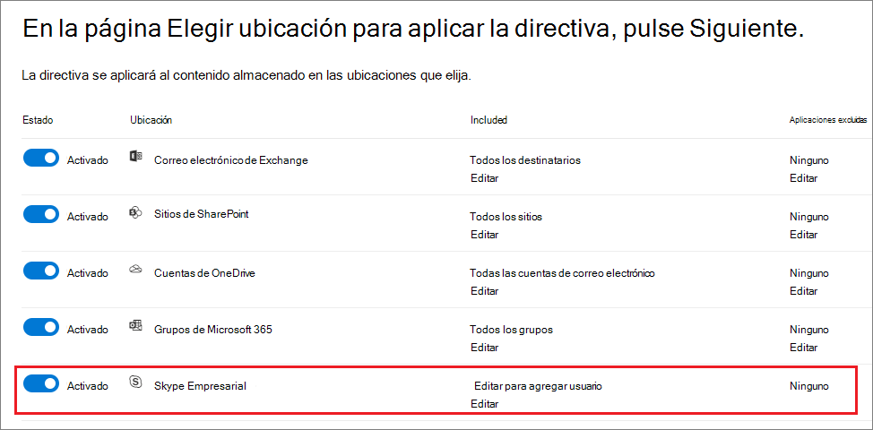

# <a name="create-and-configure-retention-policies"></a><span data-ttu-id="34210-103">Crear y configurar directivas de retención</span><span class="sxs-lookup"><span data-stu-id="34210-103">Create and configure retention policies</span></span>

><span data-ttu-id="34210-104">*[Guía de licencias de Microsoft 365 para la seguridad y el cumplimiento](https://aka.ms/ComplianceSD).*</span><span class="sxs-lookup"><span data-stu-id="34210-104">*[Microsoft 365 licensing guidance for security & compliance](https://aka.ms/ComplianceSD).*</span></span>

<span data-ttu-id="34210-105">Utilice una directiva de retención para decidir de forma pro activa si desea retener el contenido, eliminarlo o ambas cosas, retener y luego eliminar el contenido.</span><span class="sxs-lookup"><span data-stu-id="34210-105">Use a retention policy to decide proactively whether to retain content, delete content, or both - retain and then delete the content.</span></span> 

<span data-ttu-id="34210-106">Una directiva de retención le permite hacer esto de manera muy eficiente al asignar la misma configuración de retención para el contenido por ubicación, en el nivel de sitio o de buzón de correo.</span><span class="sxs-lookup"><span data-stu-id="34210-106">A retention policy lets you do this very efficiently by assigning the same retention settings for content by location, at a site or mailbox level.</span></span> <span data-ttu-id="34210-107">Si no está seguro sobre si debe usar una directiva de retención o una etiqueta de retención, consulte [Directivas de retención y etiquetas de retención](retention.md#retention-policies-and-retention-labels).</span><span class="sxs-lookup"><span data-stu-id="34210-107">If you're not sure whether to use a retention policy or a retention label, see [Retention policies and retention labels](retention.md#retention-policies-and-retention-labels).</span></span>

<span data-ttu-id="34210-108">Para más información sobre directivas de retención y sobre cómo funciona la retención, consulte [Más información sobre la retención](retention.md).</span><span class="sxs-lookup"><span data-stu-id="34210-108">For more information about retention policies and how retention works, see [Learn about retention](retention.md).</span></span>

## <a name="before-you-begin"></a><span data-ttu-id="34210-109">Antes de empezar</span><span class="sxs-lookup"><span data-stu-id="34210-109">Before you begin</span></span>

<span data-ttu-id="34210-110">El administrador global de su organización tiene permisos totales para crear y modificar directivas de retención.</span><span class="sxs-lookup"><span data-stu-id="34210-110">The global admin for your organization has full permissions to create and edit retention policies.</span></span> <span data-ttu-id="34210-111">Si no va a iniciar sesión como administrador global, consulte [Permisos necesarios para crear y administrar directivas de retención y etiquetas de retención](get-started-with-retention.md#permissions-required-to-create-and-manage-retention-policies-and-retention-labels).</span><span class="sxs-lookup"><span data-stu-id="34210-111">If you aren't signing in as a global admin, see [Permissions required to create and manage retention policies and retention labels](get-started-with-retention.md#permissions-required-to-create-and-manage-retention-policies-and-retention-labels).</span></span>

## <a name="create-and-configure-a-retention-policy"></a><span data-ttu-id="34210-112">Crear y configurar una directiva de retención</span><span class="sxs-lookup"><span data-stu-id="34210-112">Create and configure a retention policy</span></span>

<span data-ttu-id="34210-113">Si bien una directiva de retención es compatible con varias ubicaciones, no se puede crear una única directiva de retención que incluya todas las ubicaciones compatibles:</span><span class="sxs-lookup"><span data-stu-id="34210-113">Although a retention policy can support multiple locations, you can't create a single retention policy that includes all the supported locations:</span></span>
- <span data-ttu-id="34210-114">Correo electrónico de Exchange</span><span class="sxs-lookup"><span data-stu-id="34210-114">Exchange email</span></span>
- <span data-ttu-id="34210-115">Sitio de SharePoint</span><span class="sxs-lookup"><span data-stu-id="34210-115">SharePoint site</span></span>
- <span data-ttu-id="34210-116">Cuentas de OneDrive</span><span class="sxs-lookup"><span data-stu-id="34210-116">OneDrive accounts</span></span>
- <span data-ttu-id="34210-117">Grupos de Microsoft 365</span><span class="sxs-lookup"><span data-stu-id="34210-117">Microsoft 365 groups</span></span>
- <span data-ttu-id="34210-118">Skype Empresarial</span><span class="sxs-lookup"><span data-stu-id="34210-118">Skype for Business</span></span>
- <span data-ttu-id="34210-119">Carpetas públicas de Exchange</span><span class="sxs-lookup"><span data-stu-id="34210-119">Exchange public folders</span></span>
- <span data-ttu-id="34210-120">Mensajes de canal de Teams</span><span class="sxs-lookup"><span data-stu-id="34210-120">Teams channel messages</span></span>
- <span data-ttu-id="34210-121">Chats de Teams</span><span class="sxs-lookup"><span data-stu-id="34210-121">Teams chats</span></span>

<span data-ttu-id="34210-122">Al seleccionar una de las ubicaciones de Teams durante la creación de una directiva de retención, las demás ubicaciones quedan excluidas automáticamente.</span><span class="sxs-lookup"><span data-stu-id="34210-122">When you select either of the Teams locations when you create a retention policy, the other locations are automatically excluded.</span></span> <span data-ttu-id="34210-123">Por lo tanto, las instrucciones que debe seguir dependerán de si necesita incluir las ubicaciones de Teams:</span><span class="sxs-lookup"><span data-stu-id="34210-123">Therefore, the instructions to follow depend on whether you need to include the Teams locations:</span></span>

- [<span data-ttu-id="34210-124">Instrucciones para una directiva de retención para ubicaciones de Teams</span><span class="sxs-lookup"><span data-stu-id="34210-124">Instructions for a retention policy for Teams locations</span></span>](#retention-policy-for-teams-locations)
- [<span data-ttu-id="34210-125">Instrucciones para una directiva de retención para ubicaciones que no sean de Teams</span><span class="sxs-lookup"><span data-stu-id="34210-125">Instructions for a retention policy for locations other than Teams</span></span>](#retention-policy-for-locations-other-than-teams)

<span data-ttu-id="34210-126">Si tiene más de una directiva de retención y, además, utiliza etiquetas de retención, consulte [Los principios de la retención o qué tiene prioridad](retention.md#the-principles-of-retention-or-what-takes-precedence) para entender qué resultado se obtiene cuando varias configuraciones de retención se aplican al mismo contenido.</span><span class="sxs-lookup"><span data-stu-id="34210-126">When you have more than one retention policy, and when you also use retention labels, see [The principles of retention, or what takes precedence?](retention.md#the-principles-of-retention-or-what-takes-precedence) to understand the outcome when multiple retention settings apply to the same content.</span></span>

### <a name="retention-policy-for-teams-locations"></a><span data-ttu-id="34210-127">Directiva de retención para ubicaciones de Teams</span><span class="sxs-lookup"><span data-stu-id="34210-127">Retention policy for Teams locations</span></span>

1. <span data-ttu-id="34210-128">En el[centro de cumplimiento de Microsoft 365](https://compliance.microsoft.com/), seleccione**Directivas de** > **retención**.</span><span class="sxs-lookup"><span data-stu-id="34210-128">From the [Microsoft 365 compliance center](https://compliance.microsoft.com/), select **Policies** > **Retention**.</span></span>

2. <span data-ttu-id="34210-129">Seleccione **Nueva directiva de retención** para crear una nueva directiva de retención.</span><span class="sxs-lookup"><span data-stu-id="34210-129">Select **New retention policy** to create a new retention policy.</span></span>

3. <span data-ttu-id="34210-130">En la página del asistente **Decidir si quiere conservar el contenido, eliminarlo, o ambos**, especifique las opciones de configuración para conservar y eliminar el contenido.</span><span class="sxs-lookup"><span data-stu-id="34210-130">For **Decide if you want to retain content, delete it, or both** page of the wizard, specify the configuration options for retaining and deleting content.</span></span> 
    
    <span data-ttu-id="34210-131">Puede crear una directiva de retención que sólo retenga el contenido sin eliminarlo, que retenga y luego elimine después de un período de tiempo determinado, o que sólo elimine el contenido después de un período de tiempo determinado.</span><span class="sxs-lookup"><span data-stu-id="34210-131">You can create a retention policy that just retains content without deleting, retains and then deletes after a specified period of time, or just deletes content after a specified period of time.</span></span> <span data-ttu-id="34210-132">Para más información, consulte [Configuración para conservar y eliminar contenido](#settings-for-retaining-and-deleting-content) en esta página.</span><span class="sxs-lookup"><span data-stu-id="34210-132">For more information, see [Settings for retaining and deleting content](#settings-for-retaining-and-deleting-content) on this page.</span></span>
    
    <span data-ttu-id="34210-133">No seleccione **Usar la configuración de retención avanzada**, porque esta opción no es compatible con las ubicaciones de Teams.</span><span class="sxs-lookup"><span data-stu-id="34210-133">Do not select **Use advanced retention settings** because this option isn't supported for Teams locations.</span></span> 

4. <span data-ttu-id="34210-134">En la página **Elegir ubicaciones**, seleccione **Quiero elegir ubicaciones concretas**.</span><span class="sxs-lookup"><span data-stu-id="34210-134">For the **Choose locations** page, select **Let me choose specific locations**.</span></span> <span data-ttu-id="34210-135">A continuación, active una o ambas ubicaciones de Teams: **mensajes de canal de Teams** y **chats de Teams**.</span><span class="sxs-lookup"><span data-stu-id="34210-135">Then toggle on one or both of the locations for Teams: **Teams channel message** and **Teams chats**.</span></span>
     
    <span data-ttu-id="34210-136">En **los mensajes de canal de Teams**, se incluyen los mensajes de los canales estándar, pero no los de[canales privados](https://docs.microsoft.com/microsoftteams/private-channels).</span><span class="sxs-lookup"><span data-stu-id="34210-136">For **Teams channel messages**, message from standard channels but not [private channels](https://docs.microsoft.com/microsoftteams/private-channels) are included.</span></span> <span data-ttu-id="34210-137">Actualmente, los canales privados no son compatibles con las directivas de retención.</span><span class="sxs-lookup"><span data-stu-id="34210-137">Currently, private channels aren't supported by retention policies.</span></span>
    
    <span data-ttu-id="34210-138">De forma predeterminada, aparecen seleccionados todos los equipos, pero puede especificar los equipos que quiere que se incluyan y que se excluyan.</span><span class="sxs-lookup"><span data-stu-id="34210-138">By default, all teams are selected, but you can refine this by specifying teams to be included, or teams to be excluded.</span></span>

5. <span data-ttu-id="34210-139">Finalice el asistente para guardar la configuración.</span><span class="sxs-lookup"><span data-stu-id="34210-139">Complete the wizard to save your settings.</span></span>

<span data-ttu-id="34210-140">Para más información sobre las directivas de retención para Teams, consulte [Directivas de retención en Microsoft Teams](https://docs.microsoft.com/microsoftteams/retention-policies) en la documentación de Teams.</span><span class="sxs-lookup"><span data-stu-id="34210-140">For more information about retention policies for Teams, see [Retention policies in Microsoft Teams](https://docs.microsoft.com/microsoftteams/retention-policies) from the Teams documentation.</span></span>

#### <a name="additional-retention-policy-needed-to-support-teams"></a><span data-ttu-id="34210-141">Directivas de retención adicionales que se necesitan para Teams</span><span class="sxs-lookup"><span data-stu-id="34210-141">Additional retention policy needed to support Teams</span></span>

<span data-ttu-id="34210-142">Teams es mucho más que solo chats y mensajes de canal.</span><span class="sxs-lookup"><span data-stu-id="34210-142">Teams is more than just chats and channel messages.</span></span> <span data-ttu-id="34210-143">Si tiene equipos creados a partir de un grupo de Microsoft 365 (anteriormente grupo de Office 365), debe configurar una directiva de retención que incluya el grupo de Microsoft 365 mediante la ubicación **grupos de Office 365**.</span><span class="sxs-lookup"><span data-stu-id="34210-143">If you have teams that were created from a Microsoft 365 group (formerly Office 365 group), you should additionally configure a retention policy that includes that Microsoft 365 group by using the **Office 365 groups** location.</span></span> <span data-ttu-id="34210-144">La directiva de retención se aplica al contenido del buzón, del sitio y de los archivos del grupo.</span><span class="sxs-lookup"><span data-stu-id="34210-144">This retention policy applies to content in the group's mailbox, site, and files.</span></span>

<span data-ttu-id="34210-145">Si tiene sitios de equipo que no estén conectados con un grupo de Microsoft 365, necesitará una directiva de retención que incluya las ubicaciones de los **sitios de SharePoint** o de las **cuentas de OneDrive** para conservar y eliminar archivos en Teams:</span><span class="sxs-lookup"><span data-stu-id="34210-145">If you have team sites that aren't connected to a Microsoft 365 group, you need a retention policy that includes the **SharePoint sites** or **OneDrive accounts** locations to retain and delete files in Teams:</span></span>

- <span data-ttu-id="34210-146">Los archivos que se comparten en el chat se almacenan en la cuenta de OneDrive del usuario que compartió el archivo.</span><span class="sxs-lookup"><span data-stu-id="34210-146">Files that are shared in chat are stored in the OneDrive account of the user who shared the file.</span></span> 

- <span data-ttu-id="34210-147">Los archivos que se suben a los canales se almacenan en el sitio de SharePoint del equipo.</span><span class="sxs-lookup"><span data-stu-id="34210-147">Files that are uploaded to channels are stored in the SharePoint site for the team.</span></span>

> [!TIP]
> <span data-ttu-id="34210-148">Puede aplicar una directiva de retención a los archivos de un solo equipo específico cuando no está conectado a un grupo de Microsoft 365. Para ello, seleccione el sitio de SharePoint del equipo y las cuentas de OneDrive de los usuarios del mismo.</span><span class="sxs-lookup"><span data-stu-id="34210-148">You can apply a retention policy to the files of just a specific team when it's not connected to a Microsoft 365 group by selecting the SharePoint site for the team, and the OneDrive accounts of users in the Team.</span></span>

<span data-ttu-id="34210-149">Es posible que una directiva de retención que se aplique a los grupos de Microsoft 365, los sitios de SharePoint o las cuentas de OneDrive pueda eliminar un archivo al que se hace referencia en un mensaje de canal o chat de Teams antes de que se eliminen esos mensajes.</span><span class="sxs-lookup"><span data-stu-id="34210-149">It's possible that a retention policy that's applied to Microsoft 365 groups, SharePoint sites, or OneDrive accounts could delete a file that's referenced in a Teams chat or channel message before those messages get deleted.</span></span> <span data-ttu-id="34210-150">En este caso, el archivo seguirá apareciendo en el mensaje de Teams, pero cuando los usuarios lo seleccionen, obtendrán un error de "Archivo no encontrado".</span><span class="sxs-lookup"><span data-stu-id="34210-150">In this scenario, the file still displays in the Teams message, but when users select the file, they get a "File not found" error.</span></span> <span data-ttu-id="34210-151">Este comportamiento no es específico de las directivas de retención y también podría ocurrir si un usuario elimina manualmente un archivo de SharePoint o OneDrive.</span><span class="sxs-lookup"><span data-stu-id="34210-151">This behavior isn't specific to retention policies and could also happen if a user manually deletes a file from SharePoint or OneDrive.</span></span>


### <a name="retention-policy-for-locations-other-than-teams"></a><span data-ttu-id="34210-152">Directivas de retención para ubicaciones que no sean de Teams</span><span class="sxs-lookup"><span data-stu-id="34210-152">Retention policy for locations other than Teams</span></span>

1. <span data-ttu-id="34210-153">En el[centro de cumplimiento de Microsoft 365](https://compliance.microsoft.com/), seleccione**Directivas de** > **retención**.</span><span class="sxs-lookup"><span data-stu-id="34210-153">From the [Microsoft 365 compliance center](https://compliance.microsoft.com/), select **Policies** > **Retention**.</span></span>

2. <span data-ttu-id="34210-154">Seleccione **Nueva directiva de retención** para crear una nueva directiva de retención.</span><span class="sxs-lookup"><span data-stu-id="34210-154">Select **New retention policy** to create a new retention policy.</span></span>

3. <span data-ttu-id="34210-155">En la página del asistente **Decidir si quiere conservar el contenido, eliminarlo, o ambos**, especifique las opciones de configuración para conservar y eliminar el contenido.</span><span class="sxs-lookup"><span data-stu-id="34210-155">For **Decide if you want to retain content, delete it, or both** page of the wizard, specify the configuration options for retaining and deleting content.</span></span> 
    
    <span data-ttu-id="34210-156">Puede crear una directiva de retención que sólo retenga el contenido sin eliminarlo, que retenga y luego elimine después de un período de tiempo determinado, o que sólo elimine el contenido después de un período de tiempo determinado.</span><span class="sxs-lookup"><span data-stu-id="34210-156">You can create a retention policy that just retains content without deleting, retains and then deletes after a specified period of time, or just deletes content after a specified period of time.</span></span> <span data-ttu-id="34210-157">Para más información, consulte [Configuración para conservar y eliminar contenido](#settings-for-retaining-and-deleting-content) en esta página.</span><span class="sxs-lookup"><span data-stu-id="34210-157">For more information, see [Settings for retaining and deleting content](#settings-for-retaining-and-deleting-content) on this page.</span></span>
    
    <span data-ttu-id="34210-158">A continuación, decida si la directiva de retención debe aplicarse a todos los contenidos o a los que cumplan determinadas condiciones.</span><span class="sxs-lookup"><span data-stu-id="34210-158">Then, decide whether the retention policy should apply to all content, or content that meets specific conditions.</span></span> <span data-ttu-id="34210-159">Para obtener más información sobre esta configuración avanzada de retención, consulte[Ajustes avanzados para identificar el contenido que cumple con condiciones específicas](#advanced-settings-to-identify-content-that-meets-specific-conditions)en esta página.</span><span class="sxs-lookup"><span data-stu-id="34210-159">For more information about these advanced retention settings, see [Advanced settings to identify content that meets specific conditions](#advanced-settings-to-identify-content-that-meets-specific-conditions) on this page.</span></span> 

4. <span data-ttu-id="34210-160">En la página**Elegir ubicaciones**, seleccione si la directiva de retención debe aplicarse a todas las ubicaciones admitidas en su organización o si desea especificar las ubicaciones.</span><span class="sxs-lookup"><span data-stu-id="34210-160">For the **Choose locations** page, select whether the retention policy should apply to all supported locations across your organization, or you want to specify the locations.</span></span> <span data-ttu-id="34210-161">Si escoge lugares específicos, también puede especificar las inclusiones y exclusiones.</span><span class="sxs-lookup"><span data-stu-id="34210-161">If you choose specific locations, you can also specify includes and excludes.</span></span> 
    
    <span data-ttu-id="34210-162">Para obtener más información sobre cómo elegir entre una directiva de retención para la organización o para lugares específicos, consulte[Aplicación de una directiva de retención a toda una organización o a lugares específicos en esta página.](#applying-a-retention-policy-to-an-entire-organization-or-specific-locations).</span><span class="sxs-lookup"><span data-stu-id="34210-162">For more information about choosing between a retention policy for the organization or for specific locations, see [Applying a retention policy to an entire organization or specific locations](#applying-a-retention-policy-to-an-entire-organization-or-specific-locations) on this page.</span></span>
    
    <span data-ttu-id="34210-163">Información específica de las ubicaciones:</span><span class="sxs-lookup"><span data-stu-id="34210-163">Information specific to locations:</span></span>
    - [<span data-ttu-id="34210-164">Correo electrónico de Exchange y carpetas públicas de Exchange</span><span class="sxs-lookup"><span data-stu-id="34210-164">Exchange email and Exchange public folders</span></span>](#configuration-information-for-exchange-email-and-exchange-public-folders)
    - [<span data-ttu-id="34210-165">Sitios de SharePoint y cuentas de OneDrive</span><span class="sxs-lookup"><span data-stu-id="34210-165">SharePoint sites and OneDrive accounts</span></span>](#configuration-information-for-sharepoint-sites-and-onedrive-accounts)
    - [<span data-ttu-id="34210-166">Grupos de Office 365</span><span class="sxs-lookup"><span data-stu-id="34210-166">Office 365 groups</span></span>](#configuration-information-for-microsoft-365-groups)
    - [<span data-ttu-id="34210-167">Skype Empresarial</span><span class="sxs-lookup"><span data-stu-id="34210-167">Skype for Business</span></span>](#configuration-information-for-skype-for-business)

5. <span data-ttu-id="34210-168">Finalice el asistente para guardar la configuración.</span><span class="sxs-lookup"><span data-stu-id="34210-168">Complete the wizard to save your settings.</span></span>


#### <a name="configuration-information-for-exchange-email-and-exchange-public-folders"></a><span data-ttu-id="34210-169">Información de configuración para el correo electrónico de Exchange y las carpetas públicas de Exchange</span><span class="sxs-lookup"><span data-stu-id="34210-169">Configuration information for Exchange email and Exchange public folders</span></span>

<span data-ttu-id="34210-170">La ubicación del **correo electrónico de Exchange** admite la retención para el correo electrónico, el calendario y otros elementos del buzón de correo del usuario al aplicar la configuración de retención en el nivel de buzón.</span><span class="sxs-lookup"><span data-stu-id="34210-170">The **Exchange email** location supports retention for users' email, calendar, and other mailbox items, by applying retention settings at the level of a mailbox.</span></span>

<span data-ttu-id="34210-171">Se incluyen los siguientes elementos de correo: mensajes de correo (incluidos los borradores) con los datos adjuntos, las tareas y los elementos del calendario que tienen una fecha de finalización y las notas.</span><span class="sxs-lookup"><span data-stu-id="34210-171">The following mail items are included: Mail messages (includes drafts) with any attachments, tasks and calendar items when they have an end date, and notes.</span></span> <span data-ttu-id="34210-172">No se incluyen contactos, tareas o elementos del calendario que no tienen una fecha de finalización.</span><span class="sxs-lookup"><span data-stu-id="34210-172">Contacts, and any tasks and calendar items that don't have an end date are not included.</span></span> <span data-ttu-id="34210-173">El resto de los elementos almacenados en un buzón de correo, como los mensajes guardados de Skype y Teams, no se incluyen con esta ubicación.</span><span class="sxs-lookup"><span data-stu-id="34210-173">Other items stored in a mailbox, such as Skype and Teams saved messages, aren't included with this location.</span></span> <span data-ttu-id="34210-174">Dichos elementos cuentan con sus propias ubicaciones de retención.</span><span class="sxs-lookup"><span data-stu-id="34210-174">These items have their own retention locations.</span></span>

<span data-ttu-id="34210-175">Aunque un grupo Microsoft 365 tiene un buzón de Exchange, una directiva de retención que incluya toda la ubicación de**correo electrónico de Exchange** no incluirá el contenido de los buzones del grupo Microsoft 365.</span><span class="sxs-lookup"><span data-stu-id="34210-175">Even though a Microsoft 365 group has an Exchange mailbox, a retention policy that includes the entire **Exchange email** location won't include content in Microsoft 365 group mailboxes.</span></span> <span data-ttu-id="34210-176">Para conservar el contenido de estos buzones, seleccione la ubicación **Grupos de Office 365**.</span><span class="sxs-lookup"><span data-stu-id="34210-176">To retain content in these mailboxes, select the **Office 365 groups** location.</span></span>

<span data-ttu-id="34210-177">La ubicación de las **carpetas públicas de Exchange** aplica la configuración de retención a todas las carpetas públicas y no se puede aplicar en el nivel de carpeta o de buzón de correo.</span><span class="sxs-lookup"><span data-stu-id="34210-177">The **Exchange public folders** location applies retention settings to all public folders and can't be applied at the folder or mailbox level.</span></span>

#### <a name="configuration-information-for-sharepoint-sites-and-onedrive-accounts"></a><span data-ttu-id="34210-178">Información de configuración para los sitios de SharePoint y las cuentas de OneDrive</span><span class="sxs-lookup"><span data-stu-id="34210-178">Configuration information for SharePoint sites and OneDrive accounts</span></span>

<span data-ttu-id="34210-179">Cuando elige la ubicación de los **sitios de SharePoint**, la directiva de retención puede conservar y eliminar documentos en los sitios de comunicación de SharePoint, en los sitios de grupo no conectados por grupos de Office 365 y en los sitios clásicos.</span><span class="sxs-lookup"><span data-stu-id="34210-179">When you choose the **SharePoint sites** location, the retention policy can retain and delete documents in SharePoint communication sites, team sites that aren't connected by Office 365 groups, and classic sites.</span></span> <span data-ttu-id="34210-180">Los sitios de equipos conectados por grupos de Office 365 no son compatibles con esta opción. En su lugar, use la ubicación **Grupos de Office 365** que corresponda con el contenido del buzón, el sitio y los archivos del grupo.</span><span class="sxs-lookup"><span data-stu-id="34210-180">Team sites connected by Office 365 groups aren't supported with this option and instead, use the **Office 365 groups** location that applies to content in the group's mailbox, site, and files.</span></span>

<span data-ttu-id="34210-181">Si bien la directiva de retención se aplica en el nivel de sitio, la configuración de retención solo se aplica a los documentos.</span><span class="sxs-lookup"><span data-stu-id="34210-181">Although the retention policy is applied at the site level, only documents have retention settings applied to them.</span></span> <span data-ttu-id="34210-182">La configuración de retención no se aplica a las estructuras de organización que contienen bibliotecas, listas y carpetas dentro del sitio.</span><span class="sxs-lookup"><span data-stu-id="34210-182">Retention settings do not apply to the organizing structures that include libraries, lists, and folders within the site.</span></span> 

<span data-ttu-id="34210-183">Cuando especifica sus ubicaciones para los sitios de SharePoint o las cuentas de OneDrive, no necesita permisos para acceder a los sitios y no se lleva a cabo ninguna validación en el momento en el que especifica la dirección URL en la página **Editar ubicaciones**.</span><span class="sxs-lookup"><span data-stu-id="34210-183">When you specify your locations for SharePoint sites or OneDrive accounts, you don't need permissions to access the sites and no validation is done at the time you specify the URL on the **Edit locations** page.</span></span> <span data-ttu-id="34210-184">Sin embargo, los sitios de SharePoint se deben indexar y al final del asistente se comprueba que existan los sitios que usted especifica.</span><span class="sxs-lookup"><span data-stu-id="34210-184">However, the SharePoint sites must be indexed and the sites that you specify are checked that they exist at the end of the wizard.</span></span>

<span data-ttu-id="34210-185">Si se produce un error en esta comprobación, verá un mensaje que indica que no se pudo realizar la validación de la dirección URL que ha indicado y el asistente no creará la directiva de retención hasta que se supere la comprobación de validación. </span><span class="sxs-lookup"><span data-stu-id="34210-185">If this check fails, you see a message that validation failed for the URL you entered, and the wizard won't create the retention policy until the validation check passes.</span></span> <span data-ttu-id="34210-186">Si ve este mensaje, vuelva al asistente para cambiar la dirección URL o eliminar el sitio de la directiva de retención.</span><span class="sxs-lookup"><span data-stu-id="34210-186">If you see this message, go back in the wizard to change the URL or remove the site from the retention policy.</span></span>

<span data-ttu-id="34210-187">Para especificar cuentas individuales de OneDrive que quiera incluir o excluir, la dirección URL tiene el siguiente formato: `https://<tenant name>-my.sharepoint.com/personal/<user_name>_<tenant name>_com`</span><span class="sxs-lookup"><span data-stu-id="34210-187">To specify individual OneDrive accounts to include or exclude, the URL has the following format: `https://<tenant name>-my.sharepoint.com/personal/<user_name>_<tenant name>_com`</span></span>

<span data-ttu-id="34210-188">Por ejemplo, para un usuario en el espacio empresarial de Contoso con un nombre de usuario "rsimone": `https://contoso-my.sharepoint.com/personal/rsimone_contoso_onmicrosoft_com`</span><span class="sxs-lookup"><span data-stu-id="34210-188">For example, for a user in the contoso tenant that has a user name of "rsimone": `https://contoso-my.sharepoint.com/personal/rsimone_contoso_onmicrosoft_com`</span></span>

<span data-ttu-id="34210-189">Para comprobar la sintaxis de su espacio empresarial e identificar las direcciones URL de los usuarios, consulte [Obtener una lista de todas las URL de OneDrive de usuario en su organización](https://docs.microsoft.com/onedrive/list-onedrive-urls).</span><span class="sxs-lookup"><span data-stu-id="34210-189">To verify the syntax for your tenant and identify URLs for users, see [Get a list of all user OneDrive URLs in your organization](https://docs.microsoft.com/onedrive/list-onedrive-urls).</span></span>

### <a name="configuration-information-for-microsoft-365-groups"></a><span data-ttu-id="34210-190">Información de configuración para los grupos de Microsoft 365</span><span class="sxs-lookup"><span data-stu-id="34210-190">Configuration information for Microsoft 365 groups</span></span>

<span data-ttu-id="34210-191">Para conservar o eliminar el contenido de un grupo de Microsoft 365 (anteriormente llamado "grupo de Office 365"), utilice la ubicación de los **grupos de Office 365**.</span><span class="sxs-lookup"><span data-stu-id="34210-191">To retain or delete content for a Microsoft 365 group (formerly Office 365 group), use the **Office 365 groups** location.</span></span> <span data-ttu-id="34210-192">Aunque un grupo Microsoft 365 tiene un buzón de Exchange, una directiva de retención que incluya toda la ubicación de**correo electrónico de Exchange** no incluirá el contenido de los buzones del grupo Microsoft 365.</span><span class="sxs-lookup"><span data-stu-id="34210-192">Even though a Microsoft 365 group has an Exchange mailbox, a retention policy that includes the entire **Exchange email** location won't include content in Microsoft 365 group mailboxes.</span></span> <span data-ttu-id="34210-193">Además, aunque la ubicación **de correo electrónico de Exchangl** le permite inicialmente especificar un buzón de grupo para incluirlo o excluirlo, cuando intente guardar la directiva de retención, recibe un error que indique que "RemoteGroupMailbox" no es una selección válida para la ubicación de Exchange.</span><span class="sxs-lookup"><span data-stu-id="34210-193">In addition, although the **Exchange email** location initially allows you to specify a group mailbox to be included or excluded, when you try to save the retention policy, you receive an error that "RemoteGroupMailbox" is not a valid selection for the Exchange location.</span></span>

<span data-ttu-id="34210-194">Una directiva de retención aplicada a un grupo de Microsoft 365 incluye tanto el buzón como el sitio del grupo.</span><span class="sxs-lookup"><span data-stu-id="34210-194">A retention policy applied to a Microsoft 365 group includes both the group mailbox and site.</span></span> <span data-ttu-id="34210-195">Una directiva de retención aplicada a un grupo Microsoft 365 protege los recursos creados por un grupo Microsoft 365, que incluye a Microsoft Teams.</span><span class="sxs-lookup"><span data-stu-id="34210-195">A retention policy applied to a Microsoft 365 group protects the resources created by a Microsoft 365 group, which includes Microsoft Teams.</span></span>

### <a name="configuration-information-for-skype-for-business"></a><span data-ttu-id="34210-196">Información de configuración de Skype Empresarial</span><span class="sxs-lookup"><span data-stu-id="34210-196">Configuration information for Skype for Business</span></span>

<span data-ttu-id="34210-197">Al contrario que el correo electrónico de Exchange, no puede cambiar el estado de la ubicación de Skype en para incluir todos los usuarios, pero cuando active dicha ubicación y, elegirá manualmente los usuarios cuyas conversaciones quiera conservar:</span><span class="sxs-lookup"><span data-stu-id="34210-197">Unlike Exchange email, you can't toggle the status of the Skype location on to include all users, but when you turn on that location, you then manually choose the users whose conversations you want to retain:</span></span>


  
<span data-ttu-id="34210-199">Cuando seleccione **Elegir usuarios**, puede incluir rápidamente todos los usuarios seleccionando el cuadro **Nombre** en el encabezado de columna.</span><span class="sxs-lookup"><span data-stu-id="34210-199">When you select **Choose users**, you can quickly include all users by selecting the **Name** box in the column header.</span></span> <span data-ttu-id="34210-200">Sin embargo, es importante entender que cada usuario tiene que contar con una inclusión específica en la Directiva.</span><span class="sxs-lookup"><span data-stu-id="34210-200">However, it's important to understand that each user counts as a specific inclusion in the policy.</span></span> <span data-ttu-id="34210-201">Por lo tanto, si incluye más de 1 000 usuarios, se aplicarán los límites señalados en la sección anterior.</span><span class="sxs-lookup"><span data-stu-id="34210-201">Therefore, if you include over 1,000 users, the limits noted in the previous section apply.</span></span> <span data-ttu-id="34210-202">Seleccionar aquí todos los usuarios de Skype no es lo mismo que usar una directiva para toda la organización que pudiera incluir todos los usuarios de Skype de forma predeterminada.</span><span class="sxs-lookup"><span data-stu-id="34210-202">Selecting all Skype users here is not the same as if an org-wide policy were able to include all Skype users by default.</span></span> 
  

  
<span data-ttu-id="34210-p121">Tenga en cuenta que **Historial de conversaciones**, una carpeta de Outlook, es una característica que no tiene nada que ver con el archivado de Skype. El usuario final puede desactivar **Historial de conversaciones**, pero el archivado para Skype se realiza almacenando una copia de las conversaciones de Skype en una carpeta oculta que está disponible para eDiscovery, pero inaccesible para el usuario.</span><span class="sxs-lookup"><span data-stu-id="34210-p121">Note that **Conversation History**, a folder in Outlook, is a feature that has nothing to do with Skype archiving. **Conversation History** can be turned off by the end user, but archiving for Skype is done by storing a copy of Skype conversations in a hidden folder that is inaccessible to the user but available to eDiscovery.</span></span>


## <a name="settings-for-retaining-and-deleting-content"></a><span data-ttu-id="34210-206">Configuración para retener y borrar el contenido</span><span class="sxs-lookup"><span data-stu-id="34210-206">Settings for retaining and deleting content</span></span>

<span data-ttu-id="34210-207">Al elegir las configuraciones para retener y eliminar contenido en su directiva de retención, ésta tendrá una de las siguientes configuraciones durante un período de tiempo determinado:</span><span class="sxs-lookup"><span data-stu-id="34210-207">By choosing the settings for retaining and deleting content in your retention policy, your retention policy will have one of the following configurations for a specified period of time:</span></span>

- <span data-ttu-id="34210-208">Sólo para retención</span><span class="sxs-lookup"><span data-stu-id="34210-208">Retain-only</span></span>
- <span data-ttu-id="34210-209">Retener y luego eliminar</span><span class="sxs-lookup"><span data-stu-id="34210-209">Retain and then delete</span></span>
- <span data-ttu-id="34210-210">Sólo eliminar</span><span class="sxs-lookup"><span data-stu-id="34210-210">Delete-only</span></span>

### <a name="retaining-content-for-a-specific-period-of-time"></a><span data-ttu-id="34210-211">Retención del contenido durante un período de tiempo determinado</span><span class="sxs-lookup"><span data-stu-id="34210-211">Retaining content for a specific period of time</span></span>

<span data-ttu-id="34210-212">Cuando se configura una directiva de retención, se elige retener el contenido de forma indefinida o durante un número determinado de días, meses o años.</span><span class="sxs-lookup"><span data-stu-id="34210-212">When you configure a retention policy, you choose to retain content indefinitely or for a specific number of days, months, or years.</span></span> <span data-ttu-id="34210-213">El período de tiempo que se retiene el contenido se calcula en la antigüedad del contenido, no en el momento en que se aplica la Directiva de retención.</span><span class="sxs-lookup"><span data-stu-id="34210-213">The duration for how long content is retained is calculated from the age of the content, not from when the retention policy is applied.</span></span> <span data-ttu-id="34210-214">Puede elegir si la antigüedad se basa en el momento en que se creó el contenido o (para OneDrive y SharePoint) en el momento en que se modificó por última vez.</span><span class="sxs-lookup"><span data-stu-id="34210-214">You can choose whether the age is based on when the content was created or (for OneDrive and SharePoint) when it was last modified.</span></span>

<span data-ttu-id="34210-215">Ejemplos:</span><span class="sxs-lookup"><span data-stu-id="34210-215">Examples:</span></span>
  
- <span data-ttu-id="34210-216">SharePoint: si desea conservar el contenido de una colección de sitios durante siete años desde que se modificó por última vez, y un documento de esa colección de sitios no se ha modificado en seis años, el documento se conservará sólo durante otro año si no se modifica.</span><span class="sxs-lookup"><span data-stu-id="34210-216">SharePoint: If you want to retain content in a site collection for seven years since it was last modified, and a document in that site collection hasn't been modified in six years, the document will be retained for only another year if it's not modified.</span></span> <span data-ttu-id="34210-217">Si el documento se edita de nuevo, la edad del documento se calcula a partir de la nueva fecha de la última modificación, y se conservará durante otros siete años.</span><span class="sxs-lookup"><span data-stu-id="34210-217">If the document is edited again, the age of the document is calculated from the new last modified date, and it will be retained for another seven years.</span></span>
  
- <span data-ttu-id="34210-218">Exchange: si desea conservar el contenido de un buzón durante siete años, y se envió un mensaje hace seis años, el mensaje se conservará sólo durante un año.</span><span class="sxs-lookup"><span data-stu-id="34210-218">Exchange: If you want to retain content in a mailbox for seven years, and a message was sent six years ago, the message will be retained for only one year.</span></span> <span data-ttu-id="34210-219">En el caso del contenido de Exchange, la edad se basa en la fecha de recepción del correo electrónico entrante o en la fecha de envío del correo electrónico saliente.</span><span class="sxs-lookup"><span data-stu-id="34210-219">For Exchange content, the age is based on the date received for incoming email, or the date sent for outgoing email.</span></span> <span data-ttu-id="34210-220">La conservación del contenido en función de la fecha de la última modificación sólo se aplica al contenido del sitio en OneDrive y SharePoint.</span><span class="sxs-lookup"><span data-stu-id="34210-220">Retaining content based on when it was last modified applies only to site content in OneDrive and SharePoint.</span></span>
  
<span data-ttu-id="34210-221">Al final del período de retención, usted elige si desea que el contenido se elimine de forma permanente:</span><span class="sxs-lookup"><span data-stu-id="34210-221">At the end of the retention period, you choose whether you want the content to be permanently deleted:</span></span>
  

  
### <a name="deleting-content-thats-older-than-a-specific-age"></a><span data-ttu-id="34210-223">Eliminar el contenido que supera una antigüedad determinada</span><span class="sxs-lookup"><span data-stu-id="34210-223">Deleting content that's older than a specific age</span></span>

<span data-ttu-id="34210-224">Una directiva de retención puede retener y, a continuación, eliminar contenido o eliminar contenido antiguo sin retenerlo.</span><span class="sxs-lookup"><span data-stu-id="34210-224">A retention policy can both retain and then delete content, or delete old content without retaining it.</span></span>
  
<span data-ttu-id="34210-225">Si su directiva de retención elimina contenido, es importante entender que el período de tiempo especificado para una directiva de retención se calcula a partir del tiempo desde que se creó o modificó el documento, no el tiempo desde que se asignó la directiva.</span><span class="sxs-lookup"><span data-stu-id="34210-225">If your retention policy deletes content, it's important to understand that the time period specified for a retention policy is calculated from the time when the content was created or modified, not the time since the policy was assigned.</span></span>
  

  
<span data-ttu-id="34210-227">Por ejemplo, supongamos que se crea una directiva de retención que borra el contenido después de tres años, y luego se asigna esa directiva a todas las cuentas de OneDrive, que contienen mucho contenido que fue creado hace cuatro o cinco años.</span><span class="sxs-lookup"><span data-stu-id="34210-227">For example, suppose that you create a retention policy that deletes content after three years, and then assign that policy to all OneDrive accounts, which contain a lot of content that was created four or five years ago.</span></span> <span data-ttu-id="34210-228">En este caso, una gran cantidad de contenido se eliminará poco después de asignar la directiva de retención por primera vez.</span><span class="sxs-lookup"><span data-stu-id="34210-228">In this case, a lot of content will be deleted soon after assigning the retention policy for the first time.</span></span> <span data-ttu-id="34210-229">Por esta razón, es importante entender que una directiva de retención que borre el contenido puede tener un impacto considerable en su contenido.</span><span class="sxs-lookup"><span data-stu-id="34210-229">For this reason, it's important to understand that a retention policy that deletes content can have a considerable impact on your content.</span></span> 
  
<span data-ttu-id="34210-p126">Por lo tanto, antes de asignar una directiva de retención a un sitio por primera vez, primero debería considerar la antigüedad del contenido existente y cuál será el impacto de esa directiva. También es recomendable comunicar la nueva directiva a sus usuarios antes de asignarla para darles tiempo a evaluar el posible impacto. Tenga en cuenta esta advertencia que aparece al revisar la configuración de la directiva de retención justo antes de crearla.</span><span class="sxs-lookup"><span data-stu-id="34210-p126">Therefore, before you assign a retention policy to a site collection for the first time, you should first consider the age of the existing content and how the policy may impact that content. You may also want to communicate the new policy to your users before assigning it, to give them time to assess the possible impact. Note this warning that appears when you review the settings for your retention policy just before creating it.</span></span>
  

  
## <a name="advanced-settings-to-identify-content-that-meets-specific-conditions"></a><span data-ttu-id="34210-234">Configuración avanzada para identificar el contenido que cumple con condiciones específicas</span><span class="sxs-lookup"><span data-stu-id="34210-234">Advanced settings to identify content that meets specific conditions</span></span>

<span data-ttu-id="34210-235">Puede aplicar una directiva de retención a todo el contenido de las ubicaciones que incluya, o bien, puede aplicar una directiva de retención solo al contenido que contenga determinadas palabras clave o [determinados tipos de información confidencial](what-the-sensitive-information-types-look-for.md).</span><span class="sxs-lookup"><span data-stu-id="34210-235">A retention policy can apply to all content in the locations that it includes, or you can choose to apply a retention policy only to content that contains specific keywords or [specific types of sensitive information](what-the-sensitive-information-types-look-for.md).</span></span>
  

  
### <a name="identify-content-that-contains-specific-keywords"></a><span data-ttu-id="34210-237">Identificar el contenido que contiene palabras clave específicas</span><span class="sxs-lookup"><span data-stu-id="34210-237">Identify content that contains specific keywords</span></span>

<span data-ttu-id="34210-238">Puede aplicar una directiva de retención sólo a los contenidos que cumplan con condiciones específicas, y luego tomar acciones de retención sólo sobre ese contenido.</span><span class="sxs-lookup"><span data-stu-id="34210-238">You can apply a retention policy only to content that meets specific conditions, and then take retention actions on just that content.</span></span> <span data-ttu-id="34210-239">Las condiciones disponibles apoyan la aplicación de una directiva de retención de contenidos que contengan palabras o frases específicas.</span><span class="sxs-lookup"><span data-stu-id="34210-239">The conditions available support applying a retention policy to content that contains specific words or phrases.</span></span> <span data-ttu-id="34210-240">Puede restringir su consulta usando operadores de búsqueda como AND, OR y NOT.</span><span class="sxs-lookup"><span data-stu-id="34210-240">You can refine your query by using search operators like AND, OR, and NOT.</span></span> <span data-ttu-id="34210-241">Para obtener más información sobre los operadores, vea [Consultas de palabras clave y condiciones de búsqueda para la búsqueda de contenido](keyword-queries-and-search-conditions.md).</span><span class="sxs-lookup"><span data-stu-id="34210-241">For more information on these operators, see [Keyword queries and search conditions for Content Search](keyword-queries-and-search-conditions.md).</span></span>
  
<span data-ttu-id="34210-242">La compatibilidad para agregar propiedades susceptibles de búsqueda (por ejemplo, **asunto:**) estará disponible próximamente.</span><span class="sxs-lookup"><span data-stu-id="34210-242">Support for adding searchable properties (for example, **subject:**) is coming soon.</span></span>
  
<span data-ttu-id="34210-243">La retención basada en consultas usa el índice de búsqueda para identificar el contenido.</span><span class="sxs-lookup"><span data-stu-id="34210-243">Query-based retention uses the search index to identify content.</span></span>
  

  
### <a name="identify-content-that-contains-sensitive-information"></a><span data-ttu-id="34210-245">Identificar el contenido que contiene información sensible</span><span class="sxs-lookup"><span data-stu-id="34210-245">Identify content that contains sensitive information</span></span>

<span data-ttu-id="34210-p128">También puede aplicar una directiva de retención solo al contenido que contenga [determinados tipos de información confidencial](what-the-sensitive-information-types-look-for.md). Por ejemplo, puede aplicar requisitos de retención únicos solo a contenido que contenga información personal, como números de identificación fiscal, números de seguridad social o números de pasaporte.</span><span class="sxs-lookup"><span data-stu-id="34210-p128">You can also apply a retention policy only to content that contains [specific types of sensitive information](what-the-sensitive-information-types-look-for.md). For example, you can choose to apply unique retention requirements only to content that contains personal information, such as taxpayer identification numbers, social security numbers, or passport numbers.</span></span>
  

  
<span data-ttu-id="34210-249">Notas:</span><span class="sxs-lookup"><span data-stu-id="34210-249">Notes:</span></span>
  
- <span data-ttu-id="34210-250">La retención avanzada de información confidencial no se aplica a las carpetas públicas de Exchange o Skype Empresarial porque estas ubicaciones no admiten tipos de información confidencial.</span><span class="sxs-lookup"><span data-stu-id="34210-250">Advanced retention for sensitive information doesn't apply to Exchange public folders or Skype for Business because those locations don't support sensitive information types.</span></span>
    
- <span data-ttu-id="34210-251">Exchange Online utiliza reglas de flujo de correo (también conocidas como reglas de transporte) para identificar la información confidencial, por lo que esto funciona sólo en los mensajes en tránsito, no en todos los artículos ya almacenados en un buzón.</span><span class="sxs-lookup"><span data-stu-id="34210-251">Exchange Online uses mail flow rules (also known as transport rules) to identify sensitive information, so this works only on messages in transit—not on all items already stored in a mailbox.</span></span> <span data-ttu-id="34210-252">En el caso de Exchange Online, esto significa que las directivas de retención solo pueden identificar la información confidencial y realizar acciones de retención en los mensajes que se reciben **después** de que se aplique la directiva al buzón de correo.</span><span class="sxs-lookup"><span data-stu-id="34210-252">For Exchange Online, this means that a retention policy can identify sensitive information and take retention actions only on messages that are received **after** the policy is applied to the mailbox.</span></span> <span data-ttu-id="34210-253">La retención basada en la consulta descrita en la sección anterior no tiene esta limitación porque utiliza el índice de búsqueda para identificar el contenido.</span><span class="sxs-lookup"><span data-stu-id="34210-253">Query-based retention described in the previous section doesn't have this limitation because it uses the search index to identify content.</span></span> 
    
## <a name="applying-a-retention-policy-to-an-entire-organization-or-specific-locations"></a><span data-ttu-id="34210-254">Aplicar una directiva de retención a toda la organización o a ubicaciones específicas</span><span class="sxs-lookup"><span data-stu-id="34210-254">Applying a retention policy to an entire organization or specific locations</span></span>

<span data-ttu-id="34210-255">Puede aplicar fácilmente una directiva de retención a toda la organización, a ubicaciones completas o solo a determinados usuarios o ubicaciones.</span><span class="sxs-lookup"><span data-stu-id="34210-255">You can easily apply a retention policy to an entire organization, entire locations, or only to specific locations or users.</span></span>
  
### <a name="org-wide-policy"></a><span data-ttu-id="34210-256">Directiva para toda la organización</span><span class="sxs-lookup"><span data-stu-id="34210-256">Org-wide policy</span></span>

<span data-ttu-id="34210-257">Una de las características más poderosas de una directiva de retención es que puede aplicarse a las ubicaciones a través de Microsoft 365, incluyendo:</span><span class="sxs-lookup"><span data-stu-id="34210-257">One of the most powerful features of a retention policy is that it can apply to locations across Microsoft 365, including:</span></span>
  
- <span data-ttu-id="34210-258">Correo electrónico de Exchange</span><span class="sxs-lookup"><span data-stu-id="34210-258">Exchange email</span></span>
    
- <span data-ttu-id="34210-259">Colecciones de sitios de SharePoint</span><span class="sxs-lookup"><span data-stu-id="34210-259">SharePoint site collections</span></span>
    
- <span data-ttu-id="34210-260">Cuentas de OneDrive</span><span class="sxs-lookup"><span data-stu-id="34210-260">OneDrive accounts</span></span>
    
- <span data-ttu-id="34210-261">Grupos de Microsoft 365</span><span class="sxs-lookup"><span data-stu-id="34210-261">Microsoft 365 groups</span></span>
    
- <span data-ttu-id="34210-262">Carpetas públicas de Exchange</span><span class="sxs-lookup"><span data-stu-id="34210-262">Exchange public folders</span></span>
    


<span data-ttu-id="34210-264">Otras características importantes de una directiva de retención para toda la organización son:</span><span class="sxs-lookup"><span data-stu-id="34210-264">Other important features of an org-wide retention policy include:</span></span>
  
- <span data-ttu-id="34210-265">No hay ningún límite en el número de buzones o sitios que puede incluir la directiva.</span><span class="sxs-lookup"><span data-stu-id="34210-265">There is no limit to the number of mailboxes or sites the policy can include.</span></span>
    
- <span data-ttu-id="34210-266">Para Exchange, todos los buzones creados tras la aplicación de la directiva la heredarán automáticamente.</span><span class="sxs-lookup"><span data-stu-id="34210-266">For Exchange, any new mailbox created after the policy is applied will automatically inherit the policy.</span></span>
  
### <a name="a-policy-that-applies-to-entire-locations"></a><span data-ttu-id="34210-267">Una directiva para ubicaciones completas</span><span class="sxs-lookup"><span data-stu-id="34210-267">A policy that applies to entire locations</span></span>

<span data-ttu-id="34210-268">Al elegir ubicaciones, puede incluir o excluir fácilmente una ubicación completa, como correo electrónico de Exchange o cuentas de OneDrive.</span><span class="sxs-lookup"><span data-stu-id="34210-268">When you choose locations, you can easily include or exclude an entire location, such as Exchange email or OneDrive accounts.</span></span> <span data-ttu-id="34210-269">Para ello, active o desactive el **estado** de esa ubicación.</span><span class="sxs-lookup"><span data-stu-id="34210-269">To do so, toggle the **Status** of that location on or off.</span></span> 
  
<span data-ttu-id="34210-270">Al igual que una directiva para toda la organización, si una directiva se aplica a cualquier combinación de lugares enteros, no hay límite en el número de buzones o sitios que la directiva puede incluir.</span><span class="sxs-lookup"><span data-stu-id="34210-270">Like an org-wide policy, if a policy applies to any combination of entire locations, there is no limit to the number of mailboxes or sites the policy can include.</span></span> 

<span data-ttu-id="34210-271">Por ejemplo, si la directiva incluye todo el correo electrónico de Exchange y todos los sitios de SharePoint, se incluirán todos los sitios y buzones, sea cual sea la cantidad.</span><span class="sxs-lookup"><span data-stu-id="34210-271">For example, if a policy includes all Exchange email and all SharePoint sites, all sites and mailboxes will be included, no matter how many.</span></span> <span data-ttu-id="34210-272">Y para Exchange, todos los buzones que se creen una vez que la directiva se haya aplicado, heredarán automáticamente la directiva.</span><span class="sxs-lookup"><span data-stu-id="34210-272">And for Exchange, any new mailbox created after the policy is applied will automatically inherit the policy.</span></span>

### <a name="a-policy-with-specific-inclusions-or-exclusions"></a><span data-ttu-id="34210-273">Una directiva con inclusiones o exclusiones específicas</span><span class="sxs-lookup"><span data-stu-id="34210-273">A policy with specific inclusions or exclusions</span></span>

<span data-ttu-id="34210-274">También puede aplicar una directiva de retención a usuarios específicos, grupos específicos de Microsoft 365 o sitios específicos.</span><span class="sxs-lookup"><span data-stu-id="34210-274">You can also apply a retention policy to specific users, specific Microsoft 365 groups, or specific sites.</span></span> <span data-ttu-id="34210-275">Para ello, active el **Estado** de esa ubicación y luego utilice los enlaces para incluir o excluir a usuarios específicos, grupos o sitios de Microsoft 365.</span><span class="sxs-lookup"><span data-stu-id="34210-275">To do so, toggle the **Status** of that location on, and then use the links to include or exclude specific users, Microsoft 365 groups, or sites.</span></span> 
  
<span data-ttu-id="34210-276">Sin embargo, usando esta configuración, hay algunos límites cuando su directiva de retención incluye o excluye más de 1 000 ubicaciones específicas:</span><span class="sxs-lookup"><span data-stu-id="34210-276">However, using this configuration, there are some limits when your retention policy includes or excludes over 1,000 specific locations:</span></span>
  
- <span data-ttu-id="34210-277">Números máximos para la directiva de retención:</span><span class="sxs-lookup"><span data-stu-id="34210-277">Maximum numbers for the retention policy:</span></span>
    - <span data-ttu-id="34210-278">1 000 buzones de usuario</span><span class="sxs-lookup"><span data-stu-id="34210-278">1,000 mailboxes</span></span>
    - <span data-ttu-id="34210-279">Grupos de Microsoft 365 1 000.</span><span class="sxs-lookup"><span data-stu-id="34210-279">1,000 Microsoft 365 groups</span></span>
    - <span data-ttu-id="34210-280">1 000 usuarios para chats privados de Teams</span><span class="sxs-lookup"><span data-stu-id="34210-280">1,000 users for Teams private chats</span></span>
    - <span data-ttu-id="34210-281">100 sitios (OneDrive o SharePoint)</span><span class="sxs-lookup"><span data-stu-id="34210-281">100 sites (OneDrive or SharePoint)</span></span>

<span data-ttu-id="34210-282">Hay un número máximo de directivas que se apoyan para un inquilino: 10 000.</span><span class="sxs-lookup"><span data-stu-id="34210-282">There is a maximum number of policies that are supported for a tenant: 10,000.</span></span> <span data-ttu-id="34210-283">Estos elementos incluyen directivas de retención, directivas de etiquetas de retención y directivas de retención de aplicación automática.</span><span class="sxs-lookup"><span data-stu-id="34210-283">These items include retention policies, retention label policies, and auto-apply retention policies.</span></span>

<span data-ttu-id="34210-284">Si es probable que sus directivas de retención estén sujetas a estas limitaciones, elija las opciones de configuración que se aplican a lugares enteros, o utilice una directiva para toda la organización.</span><span class="sxs-lookup"><span data-stu-id="34210-284">If your retention policies are likely to be subject to these limitations, choose the configuration options that apply to entire locations, or use an org-wide policy.</span></span>

## <a name="updating-retention-policies"></a><span data-ttu-id="34210-285">Actualización de las directivas de retención</span><span class="sxs-lookup"><span data-stu-id="34210-285">Updating retention policies</span></span>

<span data-ttu-id="34210-286">Si edita una directiva de retención y el contenido ya está sujeto a la configuración original de su directiva de retención, la configuración actualizada se aplicará automáticamente a este contenido, además del contenido recién identificado.</span><span class="sxs-lookup"><span data-stu-id="34210-286">If you edit a retention policy and content is already subject to the original settings in your retention policy, your updated settings will be automatically applied to this content in addition to content that's newly identified.</span></span>

<span data-ttu-id="34210-287">Por lo general, esta actualización es bastante rápida, pero puede tardar varios días.</span><span class="sxs-lookup"><span data-stu-id="34210-287">Usually this update is fairly quick but can take several days.</span></span> <span data-ttu-id="34210-288">Cuando la replicación de la directiva en todas las ubicaciones de Microsoft 365 se haya completado, verá que el estado de la directiva de retención en el centro de cumplimiento de Microsoft 365 cambia de **Activado (Pendiente)** a **Activado (Éxito)**.</span><span class="sxs-lookup"><span data-stu-id="34210-288">When the policy replication across your Microsoft 365 locations is complete, you'll see the status of the retention policy in the Microsoft 365 compliance center change from **On (Pending)** to **On (Success)**.</span></span>

## <a name="lock-a-retention-policy-by-using-powershell"></a><span data-ttu-id="34210-289">Bloquear una directiva de retención con PowerShell</span><span class="sxs-lookup"><span data-stu-id="34210-289">Lock a retention policy by using PowerShell</span></span>

<span data-ttu-id="34210-290">Debe usar PowerShell si necesita usar el [Bloqueo de conservación](retention.md#use-preservation-lock-to-comply-with-regulatory-requirements) para cumplir con los requerimientos reglamentarios.</span><span class="sxs-lookup"><span data-stu-id="34210-290">You must use PowerShell if you need to use [Preservation Lock](retention.md#use-preservation-lock-to-comply-with-regulatory-requirements) to comply with regulatory requirements.</span></span> <span data-ttu-id="34210-291">Debido a que los administradores no pueden deshabilitar o eliminar una directiva de retención después de aplicar un bloqueo de conservación, la habilitación de esta característica no está disponible en la interfaz del usuario para protegerlo contra la configuración accidental.</span><span class="sxs-lookup"><span data-stu-id="34210-291">Because administrators can't disable or delete a retention policy after a preservation lock is applied, enabling this feature is not available in the UI to safeguard against accidental configuration.</span></span>

<span data-ttu-id="34210-292">Todas las directivas de retención con cualquier configuración admiten el Bloqueo de conservación.</span><span class="sxs-lookup"><span data-stu-id="34210-292">All retention policies with any configuration support Preservation Lock.</span></span> <span data-ttu-id="34210-293">Sin embargo, al usar los comandos de PowerShell que siguen, observará que el parámetro de la **Carga de trabajo** siempre muestra **Exchange, SharePoint, OneDriveForBusines, Skype ModernGroup**, en lugar de reflejar las cargas de trabajo reales configuradas en la directiva.</span><span class="sxs-lookup"><span data-stu-id="34210-293">However, when you use the PowerShell commands that follow, you'll notice that the **Workload** parameter always displays **Exchange, SharePoint, OneDriveForBusines, Skype, ModernGroup** rather than reflect the actual workloads configured in the policy.</span></span> <span data-ttu-id="34210-294">Este solo es un problema de visualización.</span><span class="sxs-lookup"><span data-stu-id="34210-294">This is a display issue only.</span></span>

1. <span data-ttu-id="34210-295">[Conectarse al Centro de seguridad y cumplimiento PowerShell](https://docs.microsoft.com/powershell/exchange/office-365-scc/connect-to-scc-powershell/connect-to-scc-powershell?view=exchange-ps).</span><span class="sxs-lookup"><span data-stu-id="34210-295">[Connect to Security & Compliance Center PowerShell](https://docs.microsoft.com/powershell/exchange/office-365-scc/connect-to-scc-powershell/connect-to-scc-powershell?view=exchange-ps).</span></span>

2. <span data-ttu-id="34210-296">Enumere sus directivas de retención y encuentre el nombre de la directiva que desea bloquear ejecutando [Get-RetentionCompliancePolicy](https://powershell/module/exchange/get-retentioncompliancepolicy).</span><span class="sxs-lookup"><span data-stu-id="34210-296">List your retention policies and find the name of the policy that you want to lock by running [Get-RetentionCompliancePolicy](https://powershell/module/exchange/get-retentioncompliancepolicy).</span></span> <span data-ttu-id="34210-297">Por ejemplo:</span><span class="sxs-lookup"><span data-stu-id="34210-297">For example:</span></span>
    
   
    
3. <span data-ttu-id="34210-299">Para colocar un Bloqueo de preservación en una directiva de retención, ejecute el [Set-RetentionCompliancePolicy]( ) cmdlet con el nombre de la directiva de retención y el parámetro *RestrictiveRetention* establecido en true:</span><span class="sxs-lookup"><span data-stu-id="34210-299">To place a Preservation Lock on a retention policy, run the [Set-RetentionCompliancePolicy]( ) cmdlet with the name of the retention policy, and the *RestrictiveRetention* parameter set to true:</span></span>
    
    ```powershell
    Set-RetentionCompliancePolicy -Identity "<Name of Policy>" –RestrictiveRetention $true
    ```
    
    <span data-ttu-id="34210-300">Por ejemplo:</span><span class="sxs-lookup"><span data-stu-id="34210-300">For example:</span></span>
    
    
    
     <span data-ttu-id="34210-302">Cuando se le solicite, lea y acepte las restricciones que se incluyen en esta configuración y elija **Sí a todo**:</span><span class="sxs-lookup"><span data-stu-id="34210-302">When prompted, read and acknowledge the restrictions that come with this configuration, and choose **Yes to All**:</span></span>
    
   

<span data-ttu-id="34210-304">Ahora, se coloca un bloqueo de preservación en la Directiva de retención.</span><span class="sxs-lookup"><span data-stu-id="34210-304">A Preservation Lock is now placed on the retention policy.</span></span> <span data-ttu-id="34210-305">Para confirmar, vuelva a ejecutar `Get-RetentionCompliancePolicy`, pero especifique el nombre de la directiva de retención y, a continuación, muestre los parámetros de la directiva:</span><span class="sxs-lookup"><span data-stu-id="34210-305">To confirm, run `Get-RetentionCompliancePolicy` again, but specify the retention policy name and display the policy parameters:</span></span>

```powershell
Get-RetentionCompliancePolicy -Identity "<Name of Policy>" |Fl
```

<span data-ttu-id="34210-306">Debería ver que **RestrictiveRetention** esté establecida en **True**.</span><span class="sxs-lookup"><span data-stu-id="34210-306">You should see **RestrictiveRetention** is set to **True**.</span></span> <span data-ttu-id="34210-307">Por ejemplo:</span><span class="sxs-lookup"><span data-stu-id="34210-307">For example:</span></span>


  

