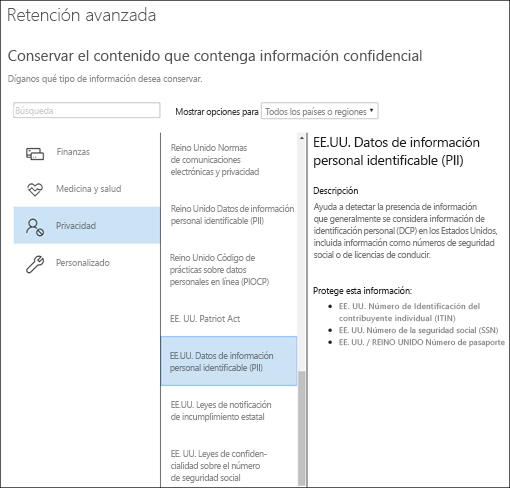

# Crear y configurar directivas de retenciónCreate and configure retention policies

>*[Guía de licencias de Microsoft 365 para la seguridad y el cumplimiento](https://aka.ms/ComplianceSD).**[Microsoft 365 licensing guidance for security & compliance](https://aka.ms/ComplianceSD).*

Utilice una directiva de retención para decidir de forma pro activa si desea retener el contenido, eliminarlo o ambas cosas, retener y luego eliminar el contenido.Use a retention policy to decide proactively whether to retain content, delete content, or both - retain and then delete the content. 

Para obtener información sobre el funcionamiento de las directivas de retención, consulte [Más información sobre las directivas de retención.](retention-policies.md).For information about how retention policies work, see [Learn about retention policies](retention-policies.md).

## Antes de empezarBefore you begin

Los miembros de su equipo de cumplimiento que crearán y administrarán las directivas de retención necesitan permisos para el[Centro de cumplimiento de Microsoft 365](https://compliance.microsoft.com/).Members of your compliance team who will create and manage retention policies need permissions to the [Microsoft 365 Compliance Center](https://compliance.microsoft.com/). Por defecto, su administrador de inquilinos tiene acceso a esta ubicación y puede dar acceso a los oficiales de cumplimiento y a otras personas sin darles todos los permisos de un administrador de inquilinos. Para ello, le recomendamos que vaya a la \*\*página de \*\*permisos del[Centro de cumplimiento de Microsoft 365,](https://compliance.microsoft.com/), edite la función del \*\*Administrador de cumplimiento \*\*, y agregue miembros a ese grupo de funciones.gue miembros a ese grupo de roles.By default, your tenant admin has access to this location and can give compliance officers and other people access without giving them all the permissions of a tenant admin. To do this, we recommend that you go to the **Permissions** page of the [Microsoft 365 Compliance Center](https://compliance.microsoft.com/), edit the **Compliance administrator** admin role, and add members to that role group. 

Estos permisos sólo son necesarios para crear y aplicar una directiva de retención.These permissions are required only to create and apply a retention policy. La persona que configura la directiva de retención no requiere acceso al contenido.The person configuring the retention policy doesn't require access to the content.

## Crear y configurar una directiva de retenciónCreate and configure a retention policy

1. En el[centro de cumplimiento de Microsoft 365](https://compliance.microsoft.com/), seleccione**Directivas d3** > **retención**.From the [Microsoft 365 compliance center](https://compliance.microsoft.com/), select **Policies** > **Retention**.

2. Seleccione **Nueva directiva de retención**o edite una directiva de retención existente.Select **New retention policy** or edit an exiting retention policy.

3. Para **Configuración**, especifique primero las opciones de configuración para retener y borrar el contenido.For **Settings**, first specify the configuration options for retaining and deleting content. Puede crear una directiva de retención que sólo retenga el contenido sin eliminarlo, que retenga y luego elimine después de un período de tiempo determinado, o que sólo elimine el contenido después de un período de tiempo determinado.You can create a retention policy that just retains content without deleting, retains and then deletes after a specified period of time, or just deletes content after a specified period of time. Para obtener más información, consulte [Configuración para conservar y eliminar contenido](#settings-for-retaining-and-deleting-content) en esta página:For more information, see [Settings for retaining and deleting content](#settings-for-retaining-and-deleting-content) on this page:
    
    A continuación, decida si la directiva de retención debe aplicarse a todos los contenidos o a los que cumplan determinadas condiciones.Then, decide whether the retention policy should apply to all content, or content that meets specific conditions. Para obtener más información sobre esta configuración avanzada de retención, consulte[Ajustes avanzados para identificar el contenido que cumple con condiciones específicas](#advanced-settings-to-identify-content-that-meets-specific-conditions)en esta página.For more information about these advanced retention settings, see [Advanced settings to identify content that meets specific conditions](#advanced-settings-to-identify-content-that-meets-specific-conditions) on this page. 

4. En la página**Elegir ubicaciones**, seleccione si la directiva de retención debe aplicarse a todas las ubicaciones admitidas en su organización o si desea especificar las ubicaciones.For the **Choose locations** page, select whether the retention policy should apply to all supported locations across your organization, or you want to specify the locations. Si escoge lugares específicos, también puede especificar las inclusiones y exclusiones.If you choose specific locations, you can also specify includes and excludes. 
    
    Para Microsoft Teams:For Microsoft Teams: 
    - Debe seleccionar la opción de elegir lugares específicos si quiere borrar o retener los mensajes de los canales de los chats de Teams.You must select the option to choose specific locations if you want to delete or retain Teams channel messages or Team chats. Cuando seleccione cualquiera de estas opciones como ubicación, las otras ubicaciones se excluyen automáticamente porque una directiva de retención que incluye estos datos de Teams no puede incluir otras ubicaciones.When you select either of these options as locations, the other locations are automatically excluded because a retention policy that includes this Teams data can't include other locations. 
    - Tenga en cuenta que**que para los mensajes de los canales de Teams**, se incluyen los mensajes de los canales estándar pero no de los[canales privados.](https://docs.microsoft.com/microsoftteams/private-channels).Note that for **Teams channel messages**, message from standard channels but not [private channels](https://docs.microsoft.com/microsoftteams/private-channels) are included. Los mensajes de los canales privados se incluyen para los usuarios como charlas grupales cuando seleccionas la ubicación de los\*\* chats de Teams\*\*.Messages from private channels are included for users as group chats when you select the **Teams chats** location.
    
    Para obtener más información sobre cómo elegir entre una directiva de retención para la organización o para lugares específicos, consulte[Aplicación de una directiva de retención a toda una organización o a lugares específicos en esta página.](#applying-a-retention-policy-to-an-entire-organization-or-specific-locations).For more information about choosing between a retention policy for the organization or for specific locations, see [Applying a retention policy to an entire organization or specific locations](#applying-a-retention-policy-to-an-entire-organization-or-specific-locations) on this page.
    
    Para obtener información específica sobre los **grupos de Office 365** y**Skype Empresarial** consulte las siguientes secciones,[Información de configuración de los grupos de Microsoft 365](#configuration-information-for-microsoft-365-groups) e [Información de configuración de Skype Empresarial](#configuration-information-for-skype-for-business).For information specific to **Office 365 groups** and **Skype for Business**, see the following sections, [Configuration information for Microsoft 365 groups](#configuration-information-for-microsoft-365-groups) and [Configuration information for Skype for Business](#configuration-information-for-skype-for-business).

5. Complete el asistente para guardar la configuración.Complete the wizard to save your settings.

Cuando tiene más de una directiva de retención, consulte [Los principios de la retención, o ¿qué tiene prioridad? ](retention-policies.md#the-principles-of-retention-or-what-takes-precedence)When you have more than one retention policy, see [The principles of retention, or what takes precedence?](retention-policies.md#the-principles-of-retention-or-what-takes-precedence)

### Información de configuración para los grupos de Microsoft 365Configuration information for Microsoft 365 groups

Para conservar o eliminar el contenido de un grupo de Microsoft 365 (antes grupo Office 365), seleccione la ubicación de los **grupos de Office 365** cuando elija las ubicaciones para su directiva de conservación.To retain or delete content for a Microsoft 365 group (formerly Office 365 group), select the **Office 365 groups** location when you choose locations for your retention policy. Aunque un grupo Microsoft 365 tiene un buzón de Exchange, una directiva de retención que incluya toda la ubicación de**correo electrónico de Exchange** no incluirá el contenido de los buzones del grupo Microsoft 365.Even though a Microsoft 365 group has an Exchange mailbox, a retention policy that includes the entire **Exchange email** location won't include content in Microsoft 365 group mailboxes. Además, aunque la ubicación **de correo electrónico de Exchangl** le permite inicialmente especificar un buzón de grupo para incluirlo o excluirlo, cuando intente guardar la directiva de retención, recibe un error que indique que "RemoteGroupMailbox" no es una selección válida para la ubicación de Exchange.In addition, although the **Exchange email** location initially allows you to specify a group mailbox to be included or excluded, when you try to save the retention policy, you receive an error that "RemoteGroupMailbox" is not a valid selection for the Exchange location.

Una directiva de retención aplicada a un grupo Microsoft 365 incluye tanto el buzón del grupo como el sitio.A retention policy applied to an Microsoft 365 group includes both the group mailbox and site. Una directiva de retención aplicada a un grupo Microsoft 365 protege los recursos creados por un grupo Microsoft 365, que incluye a Microsoft Teams.A retention policy applied to a Microsoft 365 group protects the resources created by a Microsoft 365 group, which includes Microsoft Teams.

### Información de configuración de Skype EmpresarialConfiguration information for Skype for Business

Al contrario que el correo electrónico de Exchange, no puede cambiar el estado de la ubicación de Skype en para incluir todos los usuarios, pero cuando active dicha ubicación y, elegirá manualmente los usuarios cuyas conversaciones quiera conservar:Unlike Exchange email, you can't toggle the status of the Skype location on to include all users, but when you turn on that location, you then manually choose the users whose conversations you want to retain:

  
Cuando seleccione **Elegir usuarios**, puede incluir rápidamente todos los usuarios seleccionando el cuadro **Nombre** en el encabezado de columna.When you select **Choose users**, you can quickly include all users by selecting the **Name** box in the column header. Sin embargo, es importante entender que cada usuario tiene que contar con una inclusión específica en la Directiva.However, it's important to understand that each user counts as a specific inclusion in the policy. Por lo tanto, si incluye más de 1 000 usuarios, se aplicarán los límites señalados en la sección anterior.Therefore, if you include over 1,000 users, the limits noted in the previous section apply. Seleccionar aquí todos los usuarios de Skype no es lo mismo que usar una directiva para toda la organización que pudiera incluir todos los usuarios de Skype de forma predeterminada.Selecting all Skype users here is not the same as if an org-wide policy were able to include all Skype users by default. 
  

  
Tenga en cuenta que **Historial de conversaciones**, una carpeta de Outlook, es una característica que no tiene nada que ver con el archivado de Skype. El usuario final puede desactivar **Historial de conversaciones**, pero el archivado para Skype se realiza almacenando una copia de las conversaciones de Skype en una carpeta oculta que está disponible para eDiscovery, pero inaccesible para el usuario.Note that **Conversation History**, a folder in Outlook, is a feature that has nothing to do with Skype archiving. **Conversation History** can be turned off by the end user, but archiving for Skype is done by storing a copy of Skype conversations in a hidden folder that is inaccessible to the user but available to eDiscovery.

## Configuración para retener y borrar el contenidoSettings for retaining and deleting content

Al elegir las configuraciones para retener y eliminar contenido en su directiva de retención, ésta tendrá una de las siguientes configuraciones durante un período de tiempo determinado:By choosing the settings for retaining and deleting content in your retention policy, your retention policy will have one of the following configurations for a specified period of time:

- Sólo para retenciónRetain-only
- Retener y luego eliminarRetain and then delete
- Sólo eliminarDelete-only

### Retención del contenido durante un período de tiempo determinadoRetaining content for a specific period of time

Cuando se configura una directiva de retención, se elige retener el contenido de forma indefinida o durante un número determinado de días, meses o años.When you configure a retention policy, you choose to retain content indefinitely or for a specific number of days, months, or years. El período de tiempo que se retiene el contenido se calcula en la antigüedad del contenido, no en el momento en que se aplica la Directiva de retención.The duration for how long content is retained is calculated from the age of the content, not from when the retention policy is applied. Puede elegir si la antigüedad se basa en el momento en que se creó el contenido o (para OneDrive y SharePoint) en el momento en que se modificó por última vez.You can choose whether the age is based on when the content was created or (for OneDrive and SharePoint) when it was last modified.

Ejemplos:Examples:
  
- SharePoint: si desea conservar el contenido de una colección de sitios durante siete años desde que se modificó por última vez, y un documento de esa colección de sitios no se ha modificado en seis años, el documento se conservará sólo durante otro año si no se modifica.SharePoint: If you want to retain content in a site collection for seven years since it was last modified, and a document in that site collection hasn't been modified in six years, the document will be retained for only another year if it's not modified. Si el documento se edita de nuevo, la edad del documento se calcula a partir de la nueva fecha de la última modificación, y se conservará durante otros siete años.If the document is edited again, the age of the document is calculated from the new last modified date, and it will be retained for another seven years.
  
- Exchange: si desea conservar el contenido de un buzón durante siete años, y se envió un mensaje hace seis años, el mensaje se conservará sólo durante un año.Exchange: If you want to retain content in a mailbox for seven years, and a message was sent six years ago, the message will be retained for only one year. En el caso del contenido de Exchange, la edad se basa en la fecha de recepción del correo electrónico entrante o en la fecha de envío del correo electrónico saliente.For Exchange content, the age is based on the date received for incoming email, or the date sent for outgoing email. La conservación del contenido en función de la fecha de la última modificación sólo se aplica al contenido del sitio en OneDrive y SharePoint.Retaining content based on when it was last modified applies only to site content in OneDrive and SharePoint.
  
Al final del período de retención, usted elige si desea que el contenido se elimine de forma permanente:At the end of the retention period, you choose whether you want the content to be permanently deleted:
  

  
### Eliminar el contenido que supera una antigüedad determinadaDeleting content that's older than a specific age

Una directiva de retención puede retener y, a continuación, eliminar contenido o eliminar contenido antiguo sin retenerlo.A retention policy can both retain and then delete content, or delete old content without retaining it.
  
Si su directiva de retención elimina contenido, es importante entender que el período de tiempo especificado para una directiva de retención se calcula a partir del tiempo desde que se creó o modificó el documento, no el tiempo desde que se asignó la directiva.If your retention policy deletes content, it's important to understand that the time period specified for a retention policy is calculated from the time when the content was created or modified, not the time since the policy was assigned.
  

  
Por ejemplo, supongamos que se crea una directiva de retención que borra el contenido después de tres años, y luego se asigna esa directiva a todas las cuentas de OneDrive, que contienen mucho contenido que fue creado hace cuatro o cinco años.For example, suppose that you create a retention policy that deletes content after three years, and then assign that policy to all OneDrive accounts, which contain a lot of content that was created four or five years ago. En este caso, una gran cantidad de contenido se eliminará poco después de asignar la directiva de retención por primera vez.In this case, a lot of content will be deleted soon after assigning the retention policy for the first time. Por esta razón, es importante entender que una directiva de retención que borre el contenido puede tener un impacto considerable en su contenido.For this reason, it's important to understand that a retention policy that deletes content can have a considerable impact on your content. 
  
Por lo tanto, antes de asignar una directiva de retención a un sitio por primera vez, primero debería considerar la antigüedad del contenido existente y cuál será el impacto de esa directiva. También es recomendable comunicar la nueva directiva a sus usuarios antes de asignarla para darles tiempo a evaluar el posible impacto. Tenga en cuenta esta advertencia que aparece al revisar la configuración de la directiva de retención justo antes de crearla.Therefore, before you assign a retention policy to a site collection for the first time, you should first consider the age of the existing content and how the policy may impact that content. You may also want to communicate the new policy to your users before assigning it, to give them time to assess the possible impact. Note this warning that appears when you review the settings for your retention policy just before creating it.
  

  
## Configuración avanzada para identificar el contenido que cumple con condiciones específicasAdvanced settings to identify content that meets specific conditions

Puede aplicar una directiva de retención a todo el contenido de las ubicaciones que incluya, o bien, puede aplicar una directiva de retención solo al contenido que contenga determinadas palabras clave o [determinados tipos de información confidencial](what-the-sensitive-information-types-look-for.md).A retention policy can apply to all content in the locations that it includes, or you can choose to apply a retention policy only to content that contains specific keywords or [specific types of sensitive information](what-the-sensitive-information-types-look-for.md).
  

  
### Identificar el contenido que contiene palabras clave específicasIdentify content that contains specific keywords

Puede aplicar una directiva de retención sólo a los contenidos que cumplan con condiciones específicas, y luego tomar acciones de retención sólo sobre ese contenido.You can apply a retention policy only to content that meets specific conditions, and then take retention actions on just that content. Las condiciones disponibles apoyan la aplicación de una directiva de retención de contenidos que contengan palabras o frases específicas.The conditions available support applying a retention policy to content that contains specific words or phrases. Puede restringir su consulta usando operadores de búsqueda como AND, OR y NOT.You can refine your query by using search operators like AND, OR, and NOT. Para obtener más información sobre los operadores, vea [Consultas de palabras clave y condiciones de búsqueda para la búsqueda de contenido](keyword-queries-and-search-conditions.md).For more information on these operators, see [Keyword queries and search conditions for Content Search](keyword-queries-and-search-conditions.md).
  
La compatibilidad para agregar propiedades susceptibles de búsqueda (por ejemplo, **asunto:**) estará disponible próximamente.Support for adding searchable properties (for example, **subject:**) is coming soon.
  
La retención basada en consultas usa el índice de búsqueda para identificar el contenido.Query-based retention uses the search index to identify content.
  

  
### Identificar el contenido que contiene información sensibleIdentify content that contains sensitive information

También puede aplicar una directiva de retención solo al contenido que contenga [determinados tipos de información confidencial](what-the-sensitive-information-types-look-for.md). Por ejemplo, puede aplicar requisitos de retención solo a contenido con información de identificación personal (DCP), como números de identificación fiscal, números de la seguridad social o números de pasaporte.You can also apply a retention policy only to content that contains [specific types of sensitive information](what-the-sensitive-information-types-look-for.md). For example, you can choose to apply unique retention requirements only to content that contains personally identifiable information (PII) such as taxpayer identification numbers, social security numbers, or passport numbers.
  

  
Notas:Notes:
  
- La retención avanzada de información confidencial no se aplica a las carpetas públicas de Exchange o Skype Empresarial porque estas ubicaciones no admiten tipos de información confidencial.Advanced retention for sensitive information doesn't apply to Exchange public folders or Skype for Business because those locations don't support sensitive information types.
    
- Exchange Online utiliza reglas de flujo de correo (también conocidas como reglas de transporte) para identificar la información sensible, por lo que esto funciona sólo en los mensajes en tránsito, no en todos los artículos ya almacenados en un buzón.Exchange Online uses mail flow rules (also known as transport rules) to identify sensitive information, so this works only on messages in transit — not on all items already stored in a mailbox. En el caso de Exchange Online, esto significa que las directivas de retención solo pueden identificar la información confidencial y realizar acciones de retención en los mensajes que se reciben **después** de que se aplique la directiva al buzón de correo.For Exchange Online, this means that a retention policy can identify sensitive information and take retention actions only on messages that are received **after** the policy is applied to the mailbox. La retención basada en la consulta descrita en la sección anterior no tiene esta limitación porque utiliza el índice de búsqueda para identificar el contenido.Query-based retention described in the previous section doesn't have this limitation because it uses the search index to identify content. 
    
## Aplicar una directiva de retención a toda la organización o a ubicaciones específicasApplying a retention policy to an entire organization or specific locations

Puede aplicar fácilmente una directiva de retención a toda la organización, a ubicaciones completas o solo a determinados usuarios o ubicaciones.You can easily apply a retention policy to an entire organization, entire locations, or only to specific locations or users.
  
### Directiva para toda la organizaciónOrg-wide policy

Una de las características más poderosas de una directiva de retención es que puede aplicarse a las ubicaciones a través de Microsoft 365, incluyendo:One of the most powerful features of a retention policy is that it can apply to locations across Microsoft 365, including:
  
- Correo electrónico de ExchangeExchange email
    
- Colecciones de sitios de SharePointSharePoint site collections
    
- Cuentas de OneDriveOneDrive accounts
    
- Grupos Microsoft 365 (se aplica al contenido del buzón del grupo y del sitio SharePoint asociado).Microsoft 365 groups (applies to content in the group's mailbox and associated SharePoint site.)
    
- Carpetas públicas de ExchangeExchange public folders
    

Otras características importantes de una directiva de retención para toda la organización son:Other important features of an org-wide retention policy include:
  
- No hay ningún límite en el número de buzones o sitios que puede incluir la directiva.There is no limit to the number of mailboxes or sites the policy can include.
    
- Para Exchange, todos los buzones creados tras la aplicación de la directiva la heredarán automáticamente.For Exchange, any new mailbox created after the policy is applied will automatically inherit the policy.
  
### Una directiva para ubicaciones completasA policy that applies to entire locations

Al elegir ubicaciones, puede incluir o excluir fácilmente una ubicación completa, como correo electrónico de Exchange o cuentas de OneDrive.When you choose locations, you can easily include or exclude an entire location, such as Exchange email or OneDrive accounts. Para ello, active o desactive el **estado** de esa ubicación.To do so, toggle the **Status** of that location on or off. 
  
Al igual que una directiva para toda la organización, si una directiva se aplica a cualquier combinación de lugares enteros, no hay límite en el número de buzones o sitios que la directiva puede incluir.Like an org-wide policy, if a policy applies to any combination of entire locations, there is no limit to the number of mailboxes or sites the policy can include. 

Por ejemplo, si la directiva incluye todo el correo electrónico de Exchange y todos los sitios de SharePoint, se incluirán todos los sitios y buzones, sea cual sea la cantidad.For example, if a policy includes all Exchange email and all SharePoint sites, all sites and mailboxes will be included, no matter how many. Y para Exchange, todos los buzones que se creen una vez que la directiva se haya aplicado, heredarán automáticamente la directiva.And for Exchange, any new mailbox created after the policy is applied will automatically inherit the policy.

### Una directiva con inclusiones o exclusiones específicasA policy with specific inclusions or exclusions

También puede aplicar una directiva de retención a usuarios específicos, grupos específicos de Microsoft 365 o sitios específicos.You can also apply a retention policy to specific users, specific Microsoft 365 groups, or specific sites. Para ello, active el **Estado** de esa ubicación y luego utilice los enlaces para incluir o excluir a usuarios específicos, grupos o sitios de Microsoft 365.To do so, toggle the **Status** of that location on, and then use the links to include or exclude specific users, Microsoft 365 groups, or sites. 
  
Sin embargo, usando esta configuración, hay algunos límites cuando su directiva de retención incluye o excluye más de 1 000 ubicaciones específicas:However, using this configuration, there are some limits when your retention policy includes or excludes over 1,000 specific locations:
  
- Números máximos para la directiva de retención:Maximum numbers for the retention policy:
    - 1 000 buzones de usuario1,000 mailboxes
    - Grupos de Microsoft 365 1 000.1,000 Microsoft 365 groups
    - 1 000 usuarios para chats privados de Teams1,000 users for Teams private chats
    - 100 sitios (OneDrive o SharePoint)100 sites (OneDrive or SharePoint)

Hay un número máximo de directivas que se apoyan para un inquilino: 10 000.There is a maximum number of policies that are supported for a tenant: 10,000. Estos elementos incluyen directivas de retención, directivas de etiquetas de retención y directivas de retención de aplicación automática.These items include retention policies, retention label policies, and auto-apply retention policies.

Si es probable que sus directivas de retención estén sujetas a estas limitaciones, elija las opciones de configuración que se aplican a lugares enteros, o utilice una directiva para toda la organización.If your retention policies are likely to be subject to these limitations, choose the configuration options that apply to entire locations, or use an org-wide policy.

## Actualización de las directivas de retenciónUpdating retention policies

Si edita una directiva de retención y el contenido ya está sujeto a la configuración original de su directiva de retención, la configuración actualizada se aplicará automáticamente a este contenido, además del contenido recién identificado.If you edit a retention policy and content is already subject to the original settings in your retention policy, your updated settings will be automatically applied to this content in addition to content that's newly identified.

Por lo general, esta actualización es bastante rápida, pero puede tardar varios días.Usually this update is fairly quick but can take several days. Cuando la replicación de la directiva en todas las ubicaciones de Microsoft 365 se haya completado, verá que el estado de la directiva de retención en el centro de cumplimiento de Microsoft 365 cambia de **Activado (Pendiente)** a **Activado (Éxito)**.When the policy replication across your Microsoft 365 locations is complete, you'll see the status of the retention policy in the Microsoft 365 compliance center change from **On (Pending)** to **On (Success)**.

## Buscar los cmdlets de PowerShell para directivas de retenciónFind the PowerShell cmdlets for retention policies

Para usar los cmdlets de directivas de retención:To use the retention policies cmdlets:
  
1. [Conectarse a PowerShell del Centro de seguridad y cumplimiento de Office 365Connect to the Office 365 Security & Compliance Center Powershell](https://docs.microsoft.com/powershell/exchange/office-365-scc/connect-to-scc-powershell/connect-to-scc-powershell)
    
2. Use estos cmdlets del Centro de seguridad y cumplimiento de Office 365:Use these Office 365 Security & Compliance Center cmdlets:
    
    - [Get-RetentionCompliancePolicyGet-RetentionCompliancePolicy](https://docs.microsoft.com/powershell/module/exchange/get-retentioncompliancepolicy)
    
    - [New-RetentionCompliancePolicyNew-RetentionCompliancePolicy](https://docs.microsoft.com/powershell/module/exchange/new-retentioncompliancepolicy)
    
    - [Remove-RetentionCompliancePolicyRemove-RetentionCompliancePolicy](https://docs.microsoft.com/powershell/module/exchange/remove-retentioncompliancepolicy)
    
    - [Set-RetentionCompliancePolicySet-RetentionCompliancePolicy](https://docs.microsoft.com/powershell/module/exchange/set-retentioncompliancepolicy)
    
    - [Get-RetentionComplianceRuleGet-RetentionComplianceRule](https://docs.microsoft.com/powershell/module/exchange/get-retentioncompliancerule)
    
    - [New-RetentionComplianceRuleNew-RetentionComplianceRule](https://docs.microsoft.com/powershell/module/exchange/new-retentioncompliancerule)
    
    - [Remove-RetentionComplianceRuleRemove-RetentionComplianceRule](https://docs.microsoft.com/powershell/module/exchange/remove-retentioncompliancerule)
    
    - [Set-RetentionComplianceRuleSet-RetentionComplianceRule](https://docs.microsoft.com/powershell/module/exchange/set-retentioncompliancerule)

## Bloquear una directiva de retención con PowerShellLock a retention policy by using PowerShell

Debe usar PowerShell si necesita usar el[Bloqueo de conservación](retention-policies.md#use-preservation-lock-to-comply-with-regulatory-requirements)para cumplir con los requerimientos regulatorios.You must use PowerShell if you need to need to use [Preservation Lock](retention-policies.md#use-preservation-lock-to-comply-with-regulatory-requirements) to comply with regulatory requirements.

1. [Conéctese al Centro de seguridad y cumplimiento de Office 365 PowerShell](https://docs.microsoft.com/powershell/exchange/office-365-scc/connect-to-scc-powershell/connect-to-scc-powershell?view=exchange-ps).[Connect to Office 365 Security & Compliance Center PowerShell](https://docs.microsoft.com/powershell/exchange/office-365-scc/connect-to-scc-powershell/connect-to-scc-powershell?view=exchange-ps).

2. Enumere sus directivas de retención y encuentre el nombre de la directiva que desea bloquear ejecutando`Get-RetentionCompliancePolicy`.List your retention policies and find the name of the policy that you want to lock by running `Get-RetentionCompliancePolicy`.
    
    
    
3. Para colocar un Bloqueo de conservación en una directiva de retención, ejecute`Set-RetentionCompliancePolicy` con el`RestrictiveRetention`parámetro fijado en true.To place a Preservation Lock on a retention policy, run `Set-RetentionCompliancePolicy` with the `RestrictiveRetention` parameter set to true. Por ejemplo:For example:
    
        Set-RetentionCompliancePolicy -Identity "<Name of Policy>" – RestrictiveRetention $true
    
    
    
    Después de ejecutar ese cmdlet, elija**Sí a todo**:After you run that cmdlet, choose **Yes to All**:
    
    

Ahora, se coloca un bloqueo de preservación en la Directiva de retención.A Preservation Lock is now placed on the retention policy. Si ejecuta `Get-RetentionCompliancePolicy`, el parámetro `RestrictiveRetention` se establece en True.If you run `Get-RetentionCompliancePolicy`, the `RestrictiveRetention` parameter is set to true. Por ejemplo:For example:

`Get-RetentionCompliancePolicy -Identity "<Name of Policy>" |Fl`

  

