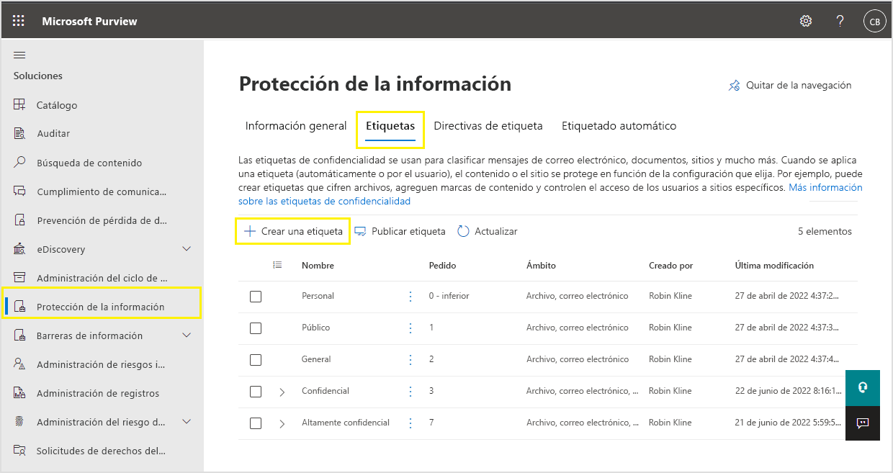
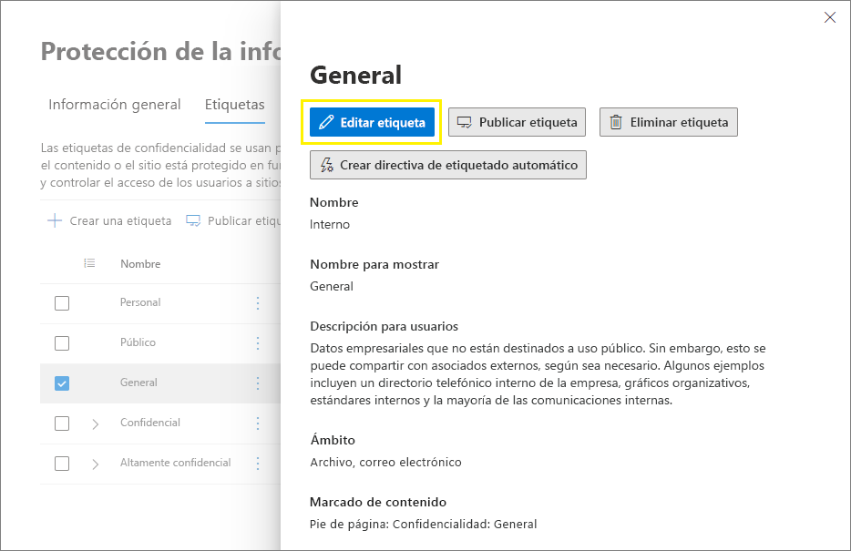
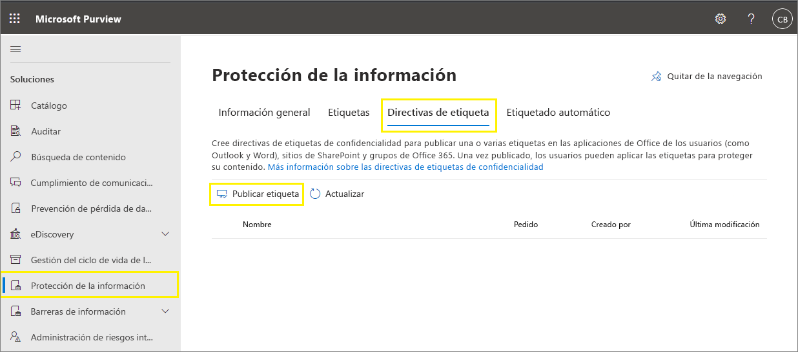
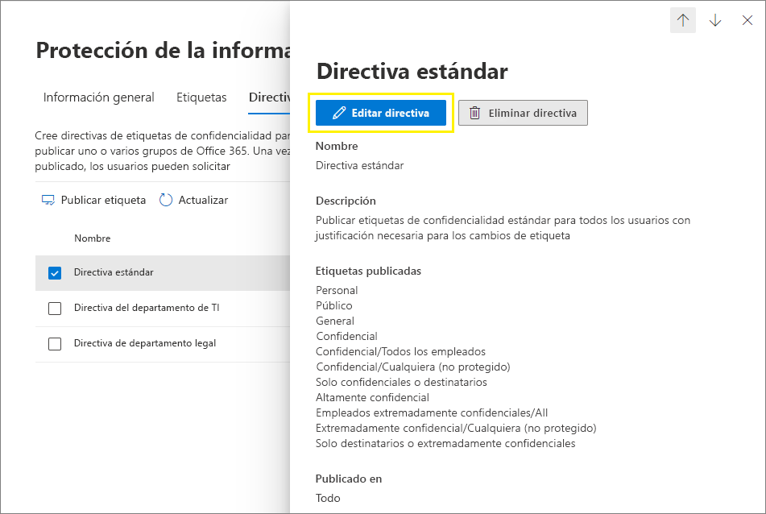

# <a name="create-and-configure-sensitivity-labels-and-their-policies"></a>Crear y configurar etiquetas de confidencialidad y sus directivas

>*[Instrucciones de licencias de Microsoft 365 para la seguridad y el cumplimiento](https://aka.ms/ComplianceSD).*

Todas las soluciones de Microsoft Information Protection (a veces abreviado como MIP) se implementan con [etiquetas de confidencialidad](sensitivity-labels.md). Para crear y publicar las etiquetas, vaya al centro de administración de etiquetas, como la del [Centro de cumplimiento de Microsoft 365](https://compliance.microsoft.com/). También puede usar el Centro de seguridad de Microsoft 365 o el Centro de seguridad y cumplimiento.

En primer lugar, cree y configure las etiquetas de confidencialidad que quiera que estén disponibles para las aplicaciones y otros servicios. Por ejemplo, las etiquetas que quiere que vean los usuarios para que se apliquen desde las aplicaciones de Office. 

A continuación, cree una o varias directivas de etiqueta que contengan las etiquetas y las configuraciones de directiva que configure. La directiva de etiquetas se encarga de publicar las etiquetas y la configuración de los usuarios y las ubicaciones que elija.

## <a name="before-you-begin"></a>Antes de empezar

El administrador global de su organización tiene permisos totales para crear y administrar todos los aspectos de las etiquetas de confidencialidad. Si no va a iniciar sesión como administrador global, consulte [Permisos necesarios para crear y administrar etiquetas de confidencialidad](get-started-with-sensitivity-labels.md#permissions-required-to-create-and-manage-sensitivity-labels).

## <a name="create-and-configure-sensitivity-labels"></a>Crear y configurar etiquetas de confidencialidad

1. En el centro de administración de etiquetas, desplácese hasta etiquetas de confidencialidad:
    
    - Centro de cumplimiento de Microsoft 365: 
        - **Soluciones** > **Protección de la información**
        
        Si no ve esta opción inmediatamente, primero seleccione **Mostrar todo**. 
    
    - Centro de seguridad de Microsoft 365: 
        - **Clasificación** > **Etiquetas de confidencialidad**
    
    - Centro de cumplimiento y seguridad:
        - **Clasificación** > **Etiquetas de confidencialidad**

2. En la página **Etiquetas**, seleccione **+Crear una etiqueta** para iniciar el asistente de Nueva etiqueta de confidencialidad. 
    
    Por ejemplo, desde el centro de cumplimiento de Microsoft 365:
    
    
    
    Nota: De forma predeterminada, los inquilinos no tienen etiquetas, por lo que deben crearse. En la imagen de ejemplo se muestran etiquetas predeterminadas que se [migraron de Azure Information Protection](https://docs.microsoft.com/azure/information-protection/configure-policy-migrate-labels).

3. Siga los mensajes del asistente para la configuración de etiquetas.
    
    Para obtener más información acerca de la configuración de las etiquetas, consulte [Qué pueden hacer las etiquetas de confidencialidad](sensitivity-labels.md#what-sensitivity-labels-can-do) en la parte de información general. Use la ayuda en el asistente para la configuración individual.

4. Repita estos pasos para crear más etiquetas. Sin embargo, si desea crear una subetiqueta, seleccione la etiqueta principal primero y luego **...** para **Más acciones**y, a continuación, seleccione **Agregar subetiqueta**.

5. Cuando haya creado todas las etiquetas que necesita, revise el pedido y, si es necesario, muévalos hacia arriba o hacia abajo. Para cambiar el orden de una etiqueta, seleccione **...** para **Más acciones**y, a continuación, seleccione **Subir** o **Bajar**. Para obtener más información, consulte [Prioridad de etiquetas (el orden importa)](sensitivity-labels.md#label-priority-order-matters) en la parte de información general.

Para editar una etiqueta existente, selecciónela, y luego seleccione el botón **Editar etiqueta**:



Este botón inicia el asistente para **Editar etiquetas de confidencialidad**, lo que le permite cambiar todas las configuraciones de la etiqueta en el paso 3.

No elimine una etiqueta a menos que comprenda el impacto para los usuarios. Para obtener más información, consulte la sección [Quitar y eliminar etiquetas](#removing-and-deleting-labels). 

> [!NOTE]
> Si edita una etiqueta ya publicada con una directiva de etiqueta, no necesita realizar pasos adicionales cuando finalice el asistente. Por ejemplo, no es necesario agregarla a una nueva directiva de etiquetas para que los cambios estén disponibles para los mismos usuarios. Sin embargo, sí debe dar un margen de 24 horas para que los cambios realizados se apliquen a los usuarios y servicios.

Hasta que publique las etiquetas, no estarán disponibles para seleccionarlas en aplicaciones o en servicios. Para publicar las etiquetas, deben [ agregarse a una directiva de etiqueta ](#publish-sensitivity-labels-by-creating-a-label-policy).

> [!IMPORTANT]
> En esta pestaña de **Etiquetas**, no seleccione la pestaña **Publicar etiquetas** (o el botón **Publicar etiqueta** cuando edite una etiqueta), salvo que necesite crear una nueva directiva de etiqueta. Solo necesitará usar varias directivas de etiquetas si los usuarios necesitan etiquetas o configuraciones de directiva diferentes. Intente tener el menor número posible de directivas de etiquetas: no es raro tener solo una directiva de etiquetas para la organización.

### <a name="additional-label-settings-with-security--compliance-center-powershell"></a>Configuración adicional de etiquetas con PowerShell del Centro de seguridad y cumplimiento

La configuración adicional de las etiquetas está disponible con el cmdlet de [ Set-Label ](https://docs.microsoft.com/powershell/module/exchange/set-label) desde [ PowerShell del Centro de seguridad y cumplimiento](https://docs.microsoft.com/powershell/exchange/office-365-scc/office-365-scc-powershell).

Por ejemplo:

- Use el parámetro *LocaleSettings* para las implementaciones multinacionales para que los usuarios vean el nombre de la etiqueta y la información sobre herramientas en su idioma local. En la [siguiente sección](#example-configuration-to-configure-a-sensitivity-label-for-different-languages), se muestra una configuración de ejemplo que especifica el nombre de la etiqueta y el texto de información sobre herramientas para francés, italiano y alemán.

- Use el parámetro *ApplyContentMarkingFooterFontName* para especificar la fuente que desee para el pie de página especificado. Calibri es la fuente predeterminada para los encabezados, los pies de página y el texto de la marca de agua. Si el nombre de fuente alternativo no está disponible para el servicio o dispositivo que muestra las etiquetas, la fuente vuelve a ser Calibri.

- Use el parámetro *ApplyContentMarkingHeaderFontColor* para especificar el color que quiera usar para el encabezado especificado, con un código de color triplo hexadecimal para los componentes rojos, verdes y azules (RGB). Por ejemplo, #40e0d0 es el valor hexadecimal RGB para el turquesa. Encontrará estos códigos en muchas aplicaciones que le permiten modificar imágenes. Por ejemplo, Microsoft Paint le permite elegir un color personalizado de una paleta y los valores de RGB se muestran de forma automática, los que puede copiar luego.

Solo en el caso del cliente de etiquetado unificado de Azure Information Protection, también puede especificar [configuración avanzada](https://docs.microsoft.com/azure/information-protection/rms-client/clientv2-admin-guide-customizations) que incluya la configuración de un color de etiqueta, y aplicar una propiedad personalizada cuando se aplique una etiqueta. Para obtener la lista completa, consulte [Configuración avanzada disponible para las etiquetas ](https://docs.microsoft.com/azure/information-protection/rms-client/clientv2-admin-guide-customizations#available-advanced-settings-for-labels) de la guía de administrador de este cliente.

#### <a name="example-configuration-to-configure-a-sensitivity-label-for-different-languages"></a>Ejemplo de configuración para configurar una etiqueta de confidencialidad para diferentes idiomas

En el ejemplo siguiente se muestra la configuración de PowerShell para una etiqueta denominada "Public" con texto de marcador de posición para la información sobre herramientas. En este ejemplo, el nombre de etiqueta y el texto de información sobre herramientas se configuran para francés, italiano y alemán.

Como resultado de esta configuración, los usuarios que tienen aplicaciones de Office que usan estos idiomas de pantalla ven los nombres de etiqueta y la información sobre herramientas en el mismo idioma. De forma similar, si tiene el cliente de etiquetado Azure Information Protection instalado para etiquetar archivos del explorador de archivos, los usuarios que tengan esas versiones de idioma en Windows podrán ver los nombres de las etiquetas y la información sobre herramientas en su idioma local cuando usen el botón derecho en acciones para etiquetar.

Para los idiomas que necesita respaldar, utilice los [ identificadores de idioma ](https://docs.microsoft.com/deployoffice/office2016/language-identifiers-and-optionstate-id-values-in-office-2016#language-identifiers) de Office (también conocidos como etiquetas de idioma) y especifique su propia traducción para el nombre de la etiqueta y la información sobre herramientas.

Antes de ejecutar los comandos de PowerShell, primero debe [conectarse a PowerShell del Centro de seguridad y cumplimiento](https://docs.microsoft.com/powershell/exchange/office-365-scc/connect-to-scc-powershell/connect-to-scc-powershell).


```powershell
$Languages = @("fr-fr","it-it","de-de")
$DisplayNames=@("Publique","Publico","Oeffentlich")
$Tooltips = @("Texte Français","Testo italiano","Deutscher text")
$label = "Public"
$DisplayNameLocaleSettings = [PSCustomObject]@{LocaleKey='DisplayName';
Settings=@(
@{key=$Languages[0];Value=$DisplayNames[0];}
@{key=$Languages[1];Value=$DisplayNames[1];}
@{key=$Languages[2];Value=$DisplayNames[2];})}
$TooltipLocaleSettings = [PSCustomObject]@{LocaleKey='Tooltip';
Settings=@(
@{key=$Languages[0];Value=$Tooltips[0];}
@{key=$Languages[1];Value=$Tooltips[1];}
@{key=$Languages[2];Value=$Tooltips[2];})}
Set-Label -Identity $Label -LocaleSettings (ConvertTo-Json $DisplayNameLocaleSettings -Depth 3 -Compress),(ConvertTo-Json $TooltipLocaleSettings -Depth 3 -Compress)
```

## <a name="publish-sensitivity-labels-by-creating-a-label-policy"></a>Publicar etiquetas de sensibilidad mediante la creación de una directiva de etiqueta

1. En el centro de administración de etiquetas, desplácese hasta etiquetas de confidencialidad:
    
    - Centro de cumplimiento de Microsoft 365: 
        - **Soluciones** > **Protección de la información**
        
        Si no ve esta opción inmediatamente, primero seleccione **Mostrar todo**. 
    
    - Centro de seguridad de Microsoft 365: 
        - **Clasificación** > **Etiquetas de confidencialidad**
    
    - Centro de cumplimiento y seguridad:
        - **Clasificación** > **Etiquetas de confidencialidad**

2. Seleccione la pestaña **Directivas de etiqueta** y, después, **Publicar etiquetas** para iniciar el asistente de creación de directivas:
    
    Por ejemplo, desde el centro de cumplimiento de Microsoft 365:
        
    
    
    Nota: De forma predeterminada, los inquilinos no tienen directivas de etiquetas, por lo que deben crearse. 

3. En el asistente, seleccione ** Elegir etiquetas de confidencialidad para publicar**. Seleccione las etiquetas que quiera que estén disponibles en aplicaciones y para servicios, a continuación, seleccione ** Agregar **.
    
    > [!IMPORTANT]
    > Si selecciona una etiqueta, asegúrese de seleccionar también su etiqueta principal.
    
4. Revise las etiquetas seleccionadas y para realizar cualquier cambio, seleccione ** Editar **. De lo contrario, seleccione **Siguiente**.

5. Siga las indicaciones para configurar las configuraciones de la directiva.
    
    Para obtener más información acerca de esta configuración, consulte [Qué pueden hacer las directivas de etiqueta](sensitivity-labels.md#what-label-policies-can-do) en la parte de información general. Use la ayuda en el asistente para la configuración individual.

7. Repita estos pasos si necesita distintas configuraciones de directiva para diferentes usuarios o ubicaciones. Por ejemplo, puede que desee usar etiquetas adicionales para un grupo de usuarios, u otra etiqueta predeterminada para un subconjunto de usuarios.

8. Si crea más de una directiva de etiqueta que pueda resultar en conflicto para un usuario o una ubicación, revise el orden de las directivas y, si es necesario, muévalos hacia arriba o hacia abajo. Para cambiar el orden de una directiva de etiquetas, seleccione **...** para **Más acciones**y, a continuación, seleccione **Subir** o **Bajar**. Para obtener más información, consulte [Prioridad de las directivas de etiquetas (el orden importa)](sensitivity-labels.md#label-policy-priority-order-matters) en la parte de información general.

Al completar el asistente, se publica automáticamente la directiva de etiqueta. Para realizar cambios en una directiva publicada, solo tiene que editarla. No es necesario que seleccione una acción específica para publicar o volver a publicar.

Para editar una directiva de etiquetas existente, selecciónela y, a continuación, seleccione el botón **Editar directiva **: 



Este botón inicia el asistente para **Crear directivas**, que le permite editar las etiquetas que se incluirán y su configuración. Cuando finalice el asistente, todos los cambios se aplicarán automáticamente a los usuarios y servicios seleccionados.

Los usuarios ven las etiquetas nuevas en sus aplicaciones de Office en una hora. Sin embargo, espere hasta 24 horas para que los cambios en las etiquetas existentes se repliquen para todos los usuarios y servicios.

### <a name="additional-label-policy-settings-with-security--compliance-center-powershell"></a>Configuración adicional de las directivas de etiquetas con PowerShell del Centro de seguridad y cumplimiento

La configuración adicional de las directivas de etiquetas está disponible con el cmdlet [Set-LabelPolicy](https://docs.microsoft.com/powershell/module/exchange/set-labelpolicy) desde [Centro de seguridad y cumplimiento de PowerShell](https://docs.microsoft.com/powershell/exchange/office-365-scc/office-365-scc-powershell).

Solo para el cliente de etiquetado unificado de Azure Information Protection, puede especificar [configuración avanzada](https://docs.microsoft.com/azure/information-protection/rms-client/clientv2-admin-guide-customizations) que incluya la configuración de una etiqueta predeterminada diferente para Outlook y la implementación de mensajes emergentes en Outlook para advertir, justificar o bloquear el envío de correos electrónicos. Para obtener la lista completa, consulte [Configuración avanzada disponible para las directivas de etiquetas](https://docs.microsoft.com/azure/information-protection/rms-client/clientv2-admin-guide-customizations#available-advanced-settings-for-label-policies) de la guía de administrador de este cliente.

## <a name="use-powershell-for-sensitivity-labels-and-their-policies"></a>Usar PowerShell para etiquetas de confidencialidad y sus directivas

Ahora, puede usar el [Centro de seguridad y cumplimiento de PowerShell](https://docs.microsoft.com/powershell/exchange/office-365-scc/office-365-scc-powershell) para crear y configurar todas las opciones de configuración que vea en el centro de administración de etiquetas. Esto significa que, además de usar PowerShell para las opciones de configuración que no están disponibles en los centros de administración de etiquetas, ahora puede crear una secuencia de comandos completa para crear y mantener las etiquetas de sensibilidad y las directivas de etiquetas de confidencialidad. 

Consulte la siguiente documentación para ver los parámetros y valores compatibles:

- [New-Label](https://docs.microsoft.com/powershell/module/exchange/new-label)
- [New-LabelPolicy](https://docs.microsoft.com/powershell/module/exchange/new-labelpolicy)
- [Set-Label](https://docs.microsoft.com/powershell/module/exchange/set-label)
- [Set-LabelPolicy](https://docs.microsoft.com/powershell/module/exchange/set-labelpolicy)

Asimismo, puede usar [Remove-Label](https://docs.microsoft.com/powershell/module/exchange/remove-label) y [Remove-LabelPolicy](https://docs.microsoft.com/powershell/module/exchange/remove-labelpolicy) si necesita crear una secuencia de comandos de eliminación de etiquetas de confidencialidad o directivas de etiquetas de confidencialidad. Sin embargo, antes de eliminar las etiquetas de sensibilidad, asegúrese de leer la sección siguiente.

## <a name="removing-and-deleting-labels"></a>Quitar y eliminar etiquetas

En un entorno de producción, es poco probable que deba quitar las etiquetas de confidencialidad de una directiva de etiqueta, o eliminar las etiquetas de confidencialidad. Es más probable que deba realizar una o varias de estas acciones durante una fase de prueba inicial. Asegúrese de comprender las consecuencias de cualquiera de estas acciones.

Quitar una etiqueta de una directiva de etiqueta es menos peligroso que eliminarla, y siempre puede volver a agregarla a una directiva de etiqueta más adelante si es necesario:

- Al quitar una etiqueta de una directiva de etiqueta —de forma que ya no esté publicada para los usuarios especificados originalmente— la próxima vez que se actualice la directiva de etiqueta, los usuarios ya no podrán ver dicha etiqueta en la aplicación de Office. Sin embargo, si se aplicó la etiqueta a documentos o correos electrónicos, esta no se eliminará del contenido. El cifrado aplicado por la etiqueta permanece y la plantilla de protección subyacente sigue publicada. 

- Para las etiquetas que se han quitado pero que, anteriormente, se habían aplicado al contenido, los usuarios que usan las etiquetas integradas de Word, Excel y PowerPoint aún verán el nombre de etiqueta aplicado en la barra de estado. De forma similar, las etiquetas quitadas que se habían aplicado a los sitios de SharePoint siguen mostrando el nombre de la etiqueta en la columna **Confidencialidad**.

En comparación, al eliminar una etiqueta:

- Si la etiqueta aplicó el cifrado, la plantilla de protección subyacente se archiva para que se pueda seguir abriendo el contenido protegido previamente. Debido a esta plantilla de protección archivada, no podrá crear una etiqueta nueva con el mismo nombre. Aunque se puede eliminar una plantilla de protección con [PowerShell](https://docs.microsoft.com/powershell/module/aipservice/remove-aipservicetemplate), no lo haga, a menos que esté seguro de que no necesitará abrir el contenido que fue cifrado con la plantilla archivada.

- En las aplicaciones de escritorio, la información de la etiqueta de los metadatos se mantiene, pero, debido a que ya no es posible tener un identificador de etiqueta para la asignación de nombres, los usuarios no ven el nombre de la etiqueta que se aplicó (por ejemplo, en la barra de estado) por lo que asumen que el contenido no tiene etiqueta. Si la etiqueta aplicó el cifrado, el cifrado permanece y cuando el contenido se abre, los usuarios siguen viendo el nombre y la descripción de la plantilla de protección ahora archivada.

- Para Office en la web: los usuarios no pueden ver el nombre de la etiqueta en la barra de estado o en la columna **Confidencialidad**. La información de etiqueta de los metadatos solo permanece si la etiqueta no aplicó el cifrado. Si la etiqueta aplicó el cifrado y ha habilitado las [etiquetas de confidencialidad para SharePoint y OneDrive](sensitivity-labels-sharepoint-onedrive-files.md), se quitará la información de la etiqueta de los metadatos y se quitará el cifrado. 

Cuando quita una etiqueta de confidencialidad de una directiva de etiqueta, o elimina una etiqueta de confidencialidad, estos cambios pueden tardar hasta una hora en replicarse para todos los usuarios y servicios.

## <a name="next-steps"></a>Pasos siguientes

Para configurar y usar las etiquetas de confidencialidad en escenarios específicos, use los artículos siguientes:

- [Restringir el acceso al contenido mediante el cifrado en las etiquetas de confidencialidad](encryption-sensitivity-labels.md)

- [Aplicar una etiqueta de confidencialidad automáticamente al contenido](apply-sensitivity-label-automatically.md)

- [Usar etiquetas de confidencialidad en equipos, grupos y sitios](sensitivity-labels-teams-groups-sites.md)

- [Habilitar etiquetas de confidencialidad para los archivos de Office en SharePoint y OneDrive](sensitivity-labels-sharepoint-onedrive-files.md)

Para supervisar cómo se usan las etiquetas, consulte [Ver el uso de etiquetas con el análisis de etiquetas](label-analytics.md).
