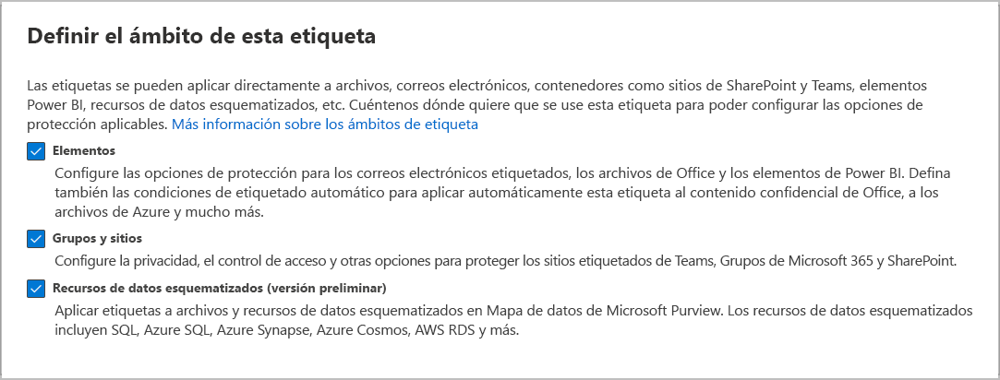

# <a name="create-and-configure-sensitivity-labels-and-their-policies"></a>Crear y configurar etiquetas de confidencialidad y sus directivas

>*[Instrucciones de licencias de Microsoft 365 para la seguridad y el cumplimiento](/office365/servicedescriptions/microsoft-365-service-descriptions/microsoft-365-tenantlevel-services-licensing-guidance/microsoft-365-security-compliance-licensing-guidance).*

Todas las soluciones de Microsoft Purview Information Protection se implementan usando [etiquetas de confidencialidad](sensitivity-labels.md). Para crear y publicar estas etiquetas, vaya al <a href="https://go.microsoft.com/fwlink/p/?linkid=2077149" target="_blank">portal de cumplimiento de Microsoft Purview</a>.

En primer lugar, cree y configure las etiquetas de confidencialidad que quiera que estén disponibles para las aplicaciones y otros servicios. Por ejemplo, las etiquetas que quiere que vean los usuarios para que se apliquen desde las aplicaciones de Office.

A continuación, cree una o varias directivas de etiqueta que contengan las etiquetas y las configuraciones de directiva que configure. La directiva de etiquetas se encarga de publicar las etiquetas y la configuración de los usuarios y las ubicaciones que elija.

> [!TIP]
> Si aún no dispone de ninguna etiqueta de confidencialidad, podría ser apto para la creación automática de etiquetas predeterminadas y una directiva de etiquetas predeterminada. Aunque ya tenga algunas etiquetas, es posible que le resulte útil ver la configuración de estas etiquetas predeterminadas que estamos creando para clientes nuevos. Por ejemplo, podría realizar las mismas configuraciones manuales para ayudar a acelerar su propia implementación de etiquetas.
> 
> Para obtener más información, consulte [Etiquetas y directivas predeterminadas para Microsoft Purview Information Protection](mip-easy-trials.md).

## <a name="before-you-begin"></a>Antes de empezar

El administrador global de su organización tiene permisos totales para crear y administrar todos los aspectos de las etiquetas de confidencialidad. Si no va a iniciar sesión como administrador global, consulte [Permisos necesarios para crear y administrar etiquetas de confidencialidad](get-started-with-sensitivity-labels.md#permissions-required-to-create-and-manage-sensitivity-labels).

## <a name="create-and-configure-sensitivity-labels"></a>Crear y configurar etiquetas de confidencialidad

1. En el [portal de cumplimiento de Microsoft Purview](https://compliance.microsoft.com/), seleccione **Soluciones** > **Protección de información** > **Etiquetas**

2. En la página **Etiquetas**, seleccione **+ Crear una etiqueta** para iniciar la configuración de la nueva etiqueta de confidencialidad: 
    
    :::image type="content" source="../media/create-sensitivity-label-full.png" alt-text="Cree una etiqueta de confidencialidad." lightbox="../media/create-sensitivity-label-full.png":::

    > [!NOTE]
    > De forma predeterminada, los inquilinos no tienen etiquetas, por lo que deben crearse. En la imagen de ejemplo se muestran etiquetas predeterminadas que se [migraron de Azure Information Protection](/azure/information-protection/configure-policy-migrate-labels).

3. En la página **Definir el ámbito para esta etiqueta**, las opciones seleccionadas determinan el ámbito de la etiqueta para las opciones de configuración que puede configurar y donde serán visibles cuando se publiquen:

    

    - Si **se selecciona Elementos**, puede configurar las opciones que se aplican a las aplicaciones que admiten etiquetas de confidencialidad, como Office Word y Outlook. Si esta opción no está seleccionada, podrá ver la primera página de estas opciones de configuración, pero no podrá configurarlas, y las etiquetas no estarán disponibles para que los usuarios puedan seleccionarlas en estas aplicaciones.

    - Si está seleccionada la opción **Grupos y sitios**, puede configurar las opciones que se apliquen a los Grupos de Microsoft 365 y a los sitios de Teams y SharePoint. Si esta opción no está seleccionada, verá la primera página de esta configuración, pero no podrá configurarla y las etiquetas no estarán disponibles para que los usuarios las seleccionen para grupos y sitios.

    Para obtener información sobre el **ámbito de los activos de datos esquematizados**, consulte [Etiquetar automáticamente su contenido en Microsoft Purview Data Map](/azure/purview/create-sensitivity-label).

4. Siga las indicaciones de configuración para la configuración de la etiqueta.

    Para obtener más información acerca de la configuración de las etiquetas, consulte [Qué pueden hacer las etiquetas de confidencialidad](sensitivity-labels.md#what-sensitivity-labels-can-do) en la parte de información general. Use la ayuda en la interfaz de usuario para la configuración individual.

5. Repita estos pasos para crear más etiquetas. Sin embargo, si desea crear una subetiqueta, primero seleccione la etiqueta principal y seleccione **...** para **Más acciones** y, a continuación, seleccione **Agregar subetiqueta**.

6. Cuando haya creado todas las etiquetas que necesite, revise el pedido y, si es necesario, muévalas hacia arriba o hacia abajo. Para cambiar el orden de una etiqueta, seleccione **...** para **Más acciones** y, a continuación, seleccione **Subir** o **Bajar**. Para obtener más información, consulte [Prioridad de etiquetas (el orden importa)](sensitivity-labels.md#label-priority-order-matters) en la parte de información general.

Para editar una etiqueta existente, selecciónela, y luego seleccione el botón **Editar etiqueta**:


Este botón inicia la configuración para **Editar etiquetas de confidencialidad**, lo que le permite cambiar todas las configuraciones de la etiqueta en el paso 4.

No elimine una etiqueta a menos que comprenda el impacto para los usuarios. Para obtener más información, consulte la sección [Quitar y eliminar etiquetas](#removing-and-deleting-labels). 

> [!NOTE]
> Si edita una etiqueta ya publicada con una directiva de etiqueta, no necesita realizar pasos adicionales cuando finalice la configuración. Por ejemplo, no es necesario agregarla a una nueva directiva de etiquetas para que los cambios estén disponibles para los mismos usuarios. Sin embargo, sí debe dar un margen de 24 horas para que los cambios realizados se apliquen a todas las aplicaciones y servicios.

Hasta que publique las etiquetas, no estarán disponibles para seleccionarlas en aplicaciones o en servicios. Para publicar las etiquetas, deben [ agregarse a una directiva de etiqueta ](#publish-sensitivity-labels-by-creating-a-label-policy).

> [!IMPORTANT]
> En esta pestaña de **Etiquetas**, no seleccione la pestaña **Publicar etiquetas** (o el botón **Publicar etiqueta** cuando edite una etiqueta), salvo que necesite crear una nueva directiva de etiqueta. Solo necesitará usar varias directivas de etiquetas si los usuarios necesitan etiquetas o configuraciones de directiva diferentes. Intente tener el menor número posible de directivas de etiquetas: no es raro tener solo una directiva de etiquetas para la organización.

### <a name="additional-label-settings-with-security--compliance-powershell"></a>Configuración adicional de etiquetas con PowerShell de Seguridad y cumplimiento

Hay opciones de configuración de etiquetas adicionales disponibles con el cmdlet [Set-Label](/powershell/module/exchange/set-label) del [PowerShell de Seguridad y cumplimiento](/powershell/exchange/scc-powershell).

Por ejemplo:

- Use el parámetro *LocaleSettings* para las implementaciones multinacionales para que los usuarios vean el nombre de la etiqueta y la información sobre herramientas en su idioma local. En la [siguiente sección](#example-configuration-to-configure-a-sensitivity-label-for-different-languages), se muestra una configuración de ejemplo que especifica el nombre de la etiqueta y el texto de información sobre herramientas para francés, italiano y alemán.

- La configuración avanzada compatible con el etiquetado integrado se incluye en la documentación de PowerShell. Para obtener más ayuda sobre cómo especificar esta configuración avanzada de PowerShell, consulte la sección de [sugerencias de PowerShell para especificar la configuración avanzada](#powershell-tips-for-specifying-the-advanced-settings). Para obtener más opciones avanzadas compatibles con el etiquetado de clientes unificado de Azure Information Protection, consulte la [documentación de la guía de administración de este cliente](/azure/information-protection/rms-client/clientv2-admin-guide-customizations#available-advanced-settings-for-labels).

#### <a name="example-configuration-to-configure-a-sensitivity-label-for-different-languages"></a>Ejemplo de configuración para configurar una etiqueta de confidencialidad para diferentes idiomas

En el ejemplo siguiente se muestra la configuración de PowerShell para una etiqueta denominada "Public" con texto de marcador de posición para la información sobre herramientas. En este ejemplo, el nombre de etiqueta y el texto de información sobre herramientas se configuran para francés, italiano y alemán.

Como resultado de esta configuración, los usuarios que tienen aplicaciones de Office que usan estos idiomas de pantalla ven los nombres de etiqueta y la información sobre herramientas en el mismo idioma. De forma similar, si tiene el cliente de etiquetado Azure Information Protection instalado para etiquetar archivos del explorador de archivos, los usuarios que tengan esas versiones de idioma en Windows podrán ver los nombres de las etiquetas y la información sobre herramientas en su idioma local cuando usen el botón derecho en acciones para etiquetar.

Para los idiomas que necesita respaldar, utilice los [ identificadores de idioma ](/deployoffice/office2016/language-identifiers-and-optionstate-id-values-in-office-2016#language-identifiers) de Office (también conocidos como etiquetas de idioma) y especifique su propia traducción para el nombre de la etiqueta y la información sobre herramientas.

Antes de ejecutar los comandos de PowerShell, primero debe [conectarse al PowerShell de Seguridad y cumplimiento](/powershell/exchange/connect-to-scc-powershell).

```powershell
$Languages = @("fr-fr","it-it","de-de")
$DisplayNames=@("Publique","Publico","Oeffentlich")
$Tooltips = @("Texte Français","Testo italiano","Deutscher text")
$label = "Public"
$DisplayNameLocaleSettings = [PSCustomObject]@{LocaleKey='DisplayName';
Settings=@(
@{key=$Languages[0];Value=$DisplayNames[0];}
@{key=$Languages[1];Value=$DisplayNames[1];}
@{key=$Languages[2];Value=$DisplayNames[2];})}
$TooltipLocaleSettings = [PSCustomObject]@{LocaleKey='Tooltip';
Settings=@(
@{key=$Languages[0];Value=$Tooltips[0];}
@{key=$Languages[1];Value=$Tooltips[1];}
@{key=$Languages[2];Value=$Tooltips[2];})}
Set-Label -Identity $Label -LocaleSettings (ConvertTo-Json $DisplayNameLocaleSettings -Depth 3 -Compress),(ConvertTo-Json $TooltipLocaleSettings -Depth 3 -Compress)
```

#### <a name="powershell-tips-for-specifying-the-advanced-settings"></a>Sugerencias de PowerShell para especificar la configuración avanzada

Aunque puede especificar una etiqueta de confidencialidad por su nombre, se recomienda usar el GUID de etiqueta para evitar posibles confusiones sobre la especificación del nombre de la etiqueta o el nombre para mostrar. El nombre de la etiqueta es único en el inquilino, por lo que puede estar seguro de que va a configurar la etiqueta correcta. El nombre para mostrar no es único y podría dar lugar a una configuración incorrecta de la etiqueta. Para buscar el GUID y confirmar el ámbito de la etiqueta:

````powershell
Get-Label | Format-Table -Property DisplayName, Name, Guid, ContentType
````

Para quitar una configuración avanzada de una etiqueta de confidencialidad, use la misma sintaxis de parámetros AdvancedSettings, pero especifique un valor de cadena nulo. Por ejemplo:

````powershell
Set-Label -Identity 8faca7b8-8d20-48a3-8ea2-0f96310a848e -AdvancedSettings @{DefaultSharingScope=""}
````

Para comprobar la configuración de la etiqueta, incluyendo la configuración avanzada, use la siguiente sintaxis con su propio GUID de etiqueta:

```powershell
(Get-Label -Identity 8faca7b8-8d20-48a3-8ea2-0f96310a848e).settings
```

## <a name="publish-sensitivity-labels-by-creating-a-label-policy"></a>Publicar etiquetas de sensibilidad mediante la creación de una directiva de etiqueta

1. En el [portal de cumplimiento de Microsoft Purview](https://compliance.microsoft.com/), seleccione **Soluciones** > **Protección de la información** > **Directivas de etiquetas**

2. En la página **Directivas de etiquetas**, seleccione **Publicar etiqueta** para iniciar la configuración **Crear directiva**:
    
   :::image type="content" source="../media/publish-sensitivity-labels-full.png" alt-text="Publique etiquetas." lightbox="../media/publish-sensitivity-labels-full.png":::
    
    > [!NOTE]
    > De forma predeterminada, los inquilinos no tienen directivas de etiquetas, por lo que deben crearse. 

3. En la página **Elegir etiquetas de confidencialidad para publicar**, seleccione el vínculo **Elija las etiquetas de confidencialidad para publicar**. Seleccione las etiquetas que quiera que estén disponibles en aplicaciones y para servicios, a continuación, seleccione **Agregar**.

    > [!IMPORTANT]
    > Si selecciona una etiqueta, asegúrese de seleccionar también su etiqueta principal.

4. Revise las etiquetas seleccionadas y, para realizar los cambios, seleccione **Editar**. De lo contrario, seleccione **siguiente**.

5. Siga las indicaciones para configurar las configuraciones de la directiva.

    Las opciones de configuración de directiva que se muestran coinciden con el ámbito de las etiquetas que seleccionó. Por ejemplo, si seleccionó etiquetas que solo tienen el ámbito **Elementos**, no verá las opciones de configuración de directiva **Aplique esta etiqueta de forma predeterminada a los grupos y sitios** y **Requiera que los usuarios apliquen una etiqueta a sus grupos y sitios**.

    Para obtener más información acerca de esta configuración, consulte [Qué pueden hacer las directivas de etiqueta](sensitivity-labels.md#what-label-policies-can-do) en la parte de información general. Use la ayuda en la interfaz de usuario para la configuración individual.

    Para las etiquetas configuradas para los **activos de Microsoft Purview Data Map (versión preliminar)**: estas etiquetas no tienen ninguna configuración de directiva asociada.

6. Repita estos pasos si necesita distintas configuraciones de directiva para diferentes usuarios o ámbitos. Por ejemplo, puede que desee usar etiquetas adicionales para un grupo de usuarios, u otra etiqueta predeterminada para un subconjunto de usuarios. O bien, si ha configurado etiquetas para tener distintos ámbitos.

7. Si crea más de una directiva de etiqueta que pueda resultar en conflicto para un usuario, revise el orden de las directivas y, si es necesario, muévalas hacia arriba o hacia abajo. Para cambiar el orden de una directiva de etiquetas, seleccione **...** para **Más acciones** y, a continuación, seleccione **Subir** o **Bajar**. Para obtener más información, consulte [Prioridad de las directivas de etiquetas (el orden importa)](sensitivity-labels.md#label-policy-priority-order-matters) en la parte de información general.

Al completar la configuración **Crear directiva** se publica automáticamente la directiva de etiqueta. Para realizar cambios en una directiva publicada, solo tiene que editarla. No es necesario que seleccione una acción específica para publicar o volver a publicar.

Para editar una directiva de etiquetas existente, selecciónela y, a continuación, seleccione el botón **Editar directiva**: 


Este botón inicia la configuración para **Crear directivas**, que le permite editar las etiquetas que se incluirán y su configuración. Cuando finalice la configuración todos los cambios se aplicarán automáticamente a los usuarios y servicios seleccionados.

### <a name="additional-label-policy-settings-with-security--compliance-powershell"></a>Configuración adicional de las directivas de etiquetas con PowerShell de Seguridad y cumplimiento

La configuración adicional de las directivas de etiquetas está disponible con el cmdlet [Set-LabelPolicy](/powershell/module/exchange/set-labelpolicy) desde [Seguridad y cumplimiento de PowerShell](/powershell/exchange/scc-powershell).

Esta documentación incluye la configuración avanzada compatible con el etiquetado integrado. Para obtener más opciones avanzadas compatibles con el etiquetado de clientes unificado de Azure Information Protection, consulte la [documentación de la guía de administración de este cliente](/azure/information-protection/rms-client/clientv2-admin-guide-customizations#available-advanced-settings-for-label-policies).

## <a name="when-to-expect-new-labels-and-changes-to-take-effect"></a>Cuándo esperar que las nuevas etiquetas y cambios entren en vigor

Para las etiquetas y la configuración de directiva de etiquetas, permita que los cambios se propaguen durante 24 horas a través de los servicios. Hay muchas dependencias externas en las que cada una tiene sus propios ciclos de tiempo, por lo que es buena idea esperar este período de tiempo de 24 horas antes de dedicar tiempo a solucionar problemas de etiquetas y directivas de etiquetas para los cambios recientes.

Sin embargo, hay algunos escenarios en los que las etiquetas y los cambios de directiva de etiquetas pueden tener efecto mucho más rápido o pueden tardar más de 24 horas. Por ejemplo, para las etiquetas de confidencialidad nuevas y eliminadas para Word, Excel y PowerPoint en la web, es posible que vea que las actualizaciones se replican en una hora. Sin embargo, para las configuraciones que dependan de rellenar grupos y nuevos cambios de pertenencia a grupos, o bien de restricciones de latencia y ancho de banda de replicación de red, estos cambios podrían tardar entre 24 y 48 horas.

## <a name="use-powershell-for-sensitivity-labels-and-their-policies"></a>Usar PowerShell para etiquetas de confidencialidad y sus directivas

Ahora, puede usar [Seguridad y cumplimiento de PowerShell](/powershell/exchange/scc-powershell) para crear y configurar todas las opciones de configuración que vea en el centro de administración de etiquetas. Esto significa que, además de usar PowerShell para las opciones de configuración que no están disponibles en los centros de administración de etiquetas, ahora puede crear una secuencia de comandos completa para crear y mantener las etiquetas de sensibilidad y las directivas de etiquetas de confidencialidad. 

Consulte la siguiente documentación para ver los parámetros y valores compatibles:

- [New-Label](/powershell/module/exchange/new-label)
- [New-LabelPolicy](/powershell/module/exchange/new-labelpolicy)
- [Set-Label](/powershell/module/exchange/set-label)
- [Set-LabelPolicy](/powershell/module/exchange/set-labelpolicy)

> [!TIP]
> Al establecer la configuración avanzada de una etiqueta de confidencialidad, es posible que le resulte útil hacer referencia a la sección de [sugerencias de PowerShell para especificar la configuración avanzada](#powershell-tips-for-specifying-the-advanced-settings) en esta página.

Asimismo, puede usar [Remove-Label](/powershell/module/exchange/remove-label) y [Remove-LabelPolicy](/powershell/module/exchange/remove-labelpolicy) si necesita crear una secuencia de comandos de eliminación de etiquetas de confidencialidad o directivas de etiquetas de confidencialidad. Sin embargo, antes de eliminar las etiquetas de confidencialidad, asegúrese de haber leído la próxima sección.

## <a name="removing-and-deleting-labels"></a>Quitar y eliminar etiquetas

En un entorno de producción, es poco probable que deba quitar las etiquetas de confidencialidad de una directiva de etiqueta, o eliminar las etiquetas de confidencialidad. Es más probable que deba realizar una o varias de estas acciones durante una fase de prueba inicial. Asegúrese de comprender las consecuencias de cualquiera de estas acciones.

Quitar una etiqueta de una directiva de etiquetas es menos arriesgado que borrarla y siempre se puede volver a añadir más tarde si es necesario. No podrá eliminar una etiqueta si todavía está en una directiva de etiqueta.

Al quitar una etiqueta de una directiva de etiqueta —de forma que ya no esté publicada para los usuarios especificados originalmente— la próxima vez que se actualice la directiva de etiqueta, los usuarios ya no podrán ver dicha etiqueta en las aplicaciones de Office. Si esa etiqueta ya está aplicada, la etiqueta no se quita del contenido o contenedor. Por ejemplo, los usuarios que usan las etiquetas integradas en aplicaciones de escritorio para Word, Excel y PowerPoint aún verán el nombre de etiqueta aplicado en la barra de estado. Una etiqueta de contenedor aplicada continúa protegiendo el sitio de Teams o SharePoint.

En comparación, al eliminar una etiqueta:

- Si la etiqueta aplicó el cifrado, la plantilla de protección subyacente se archiva para que se pueda seguir abriendo el contenido protegido previamente. Debido a esta plantilla de protección archivada, no podrá crear una etiqueta nueva con el mismo nombre. Aunque se puede eliminar una plantilla de protección con [PowerShell](/powershell/module/aipservice/remove-aipservicetemplate), no lo haga, a menos que esté seguro de que no necesitará abrir el contenido que fue cifrado con la plantilla archivada.

- En el caso de los documentos almacenados en SharePoint o OneDrive y que hayas [habilitado las etiquetas de confidencialidad para los archivos de Office](sensitivity-labels-sharepoint-onedrive-files.md): Cuando abra el documento en Office para la web, no verá la etiqueta aplicada en la aplicación, y el nombre de la etiqueta ya no se mostrará en la columna **Confidencialidad** en SharePoint. Si la etiqueta eliminada aplicó el cifrado y los servicios pueden procesar el contenido cifrado, se quita el cifrado. Las acciones de salida de estos servicios dan como resultado el mismo resultado. Por ejemplo, descargar, copiar en, mover a y abrir con una aplicación móvil o de escritorio de Office. Aunque la información de la etiqueta permanece en los metadatos del archivo, las aplicaciones ya no pueden asignar el identificador de etiqueta a un nombre para mostrar, por lo que los usuarios asumirán que un archivo no está etiquetado.

- Para los documentos almacenados fuera de SharePoint y OneDrive o para los que no haya habilitado las etiquetas de confidencialidad para los archivos de Office, y para los correos electrónicos: al abrir el contenido, la información de la etiqueta en los metadatos permanece, pero, sin el identificador de etiqueta para asignar nombres, los usuarios no ven el nombre de etiqueta aplicado que se muestra (por ejemplo, en la barra de estado de las aplicaciones de escritorio). Si la etiqueta eliminada ha aplicado el cifrado, este permanece y los usuarios siguen viendo el nombre y la descripción de la plantilla de protección ahora archivada.

- Para los contenedores, como los sitios en SharePoint y Teams, la etiqueta se elimina y cualquier ajuste que se haya configurado con esa etiqueta ya no se aplica. Esta acción suele tardar entre 48 y 72 horas en los sitios de SharePoint y puede ser más rápida para Teams y Grupos de Microsoft 365.

Al igual que con todos los cambios de etiqueta, quitar una etiqueta de confidencialidad de una directiva de etiqueta o eliminar una etiqueta de confidencialidad tarda tiempo en replicarse en todos los usuarios y servicios.

## <a name="next-steps"></a>Siguientes pasos

Para configurar y usar las etiquetas de confidencialidad en escenarios específicos, use los artículos siguientes:

- [Restringir el acceso al contenido mediante el cifrado en las etiquetas de confidencialidad](encryption-sensitivity-labels.md)

- [Aplicar una etiqueta de confidencialidad automáticamente al contenido](apply-sensitivity-label-automatically.md)

- [Usar etiquetas de confidencialidad en equipos, grupos y sitios](sensitivity-labels-teams-groups-sites.md)

- [Habilitar etiquetas de confidencialidad para los archivos de Office en SharePoint y OneDrive](sensitivity-labels-sharepoint-onedrive-files.md)

Para supervisar cómo se están usando las etiquetas, consulte [Introducción a la clasificación de datos](data-classification-overview.md).
