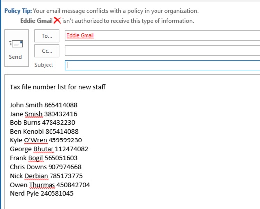

# <a name="create-test-and-tune-a-dlp-policy"></a>Crear, probar y optimizar una directiva DLP

Prevención de pérdida de datos de Microsoft Purview (DLP) ayuda a evitar el uso compartido accidental o accidental de información confidencial.

DLP examina los mensajes de correo electrónico y los archivos para obtener información confidencial, como un número de tarjeta de crédito. Con DLP puede detectar información confidencial y realizar acciones como las siguientes:

- Registro del evento con fines de auditoría
- Mostrar una advertencia al usuario final que envía el correo electrónico o comparte el archivo
- Impedir activamente que se produzca el uso compartido de archivos o correo electrónico

## <a name="permissions"></a>Permisos

Los miembros de su equipo de cumplimiento que vayan a crear directivas DLP necesitan permisos para el centro de cumplimiento. De forma predeterminada, el administrador de inquilinos tendrá acceso para dar acceso a los responsables de cumplimiento y a otras personas. Siga estos pasos:
  
1. Crear un grupo en Microsoft 365 y agregarle responsables de cumplimiento.
    
2. Cree un grupo de roles en la página **Permisos** de la portal de cumplimiento Microsoft Purview. 

3. Al crear el grupo de roles, use la sección **Elegir roles** para agregar el siguiente rol al grupo de roles: **Administración de cumplimiento dlp**.
    
4. Use la sección **Elegir miembros** para añadir el grupo de Microsoft 365 que creó antes del grupo de roles.

Use el rol **View-Only DLP Compliance Management** para crear un grupo de roles con privilegios de solo vista para las directivas DLP y los informes DLP.

Para más información, vea [Conceder acceso a los usuarios al Centro de cumplimiento de Office 365](../security/office-365-security/grant-access-to-the-security-and-compliance-center.md).
  
Estos permisos son necesarios para crear y aplicar una directiva DLP que no aplique directivas.

### <a name="roles-and-role-groups-in-preview"></a>Roles y grupos de roles en la versión preliminar

Hay roles y grupos de roles en la versión preliminar que puede probar para ajustar los controles de acceso.

Esta es una lista de los roles aplicables que se encuentran en versión preliminar. Para obtener más información, consulte [Roles en el Centro de seguridad y cumplimiento](../security/office-365-security/permissions-in-the-security-and-compliance-center.md#roles-in-the-security--compliance-center)

- Administrador de Information Protection
- Analista de Information Protection
- Investigador de protección de información
- Lector de protección de información

Esta es una lista de los grupos de roles aplicables que se encuentran en versión preliminar. Para obtener más información, consulte [Grupos de roles en el Centro de seguridad y cumplimiento](../security/office-365-security/permissions-in-the-security-and-compliance-center.md#role-groups-in-the-security--compliance-center)

- Protección de la información
- Administradores de Information Protection
- Analistas de Information Protection
- Investigadores de Information Protection
- Lectores de Information Protection

## <a name="how-sensitive-information-is-detected-by-dlp"></a>Cómo detecta DLP la información confidencial

DLP busca información confidencial por coincidencia de patrones de expresión regular (RegEx), en combinación con otros indicadores, como la proximidad de ciertas palabras clave a los patrones coincidentes. Por ejemplo, un número de tarjeta de crédito VISA tiene 16 dígitos. Pero esos dígitos se pueden escribir de maneras diferentes, como 1111-1111-1111-1111, 1111 1111 1111 1111 o 1111111111111111.

Cualquier cadena de 16 dígitos no es necesariamente un número de tarjeta de crédito, podría ser un número de vale de un sistema de soporte técnico o un número de serie de una pieza de hardware. Para indicar la diferencia entre un número de tarjeta de crédito y una cadena inofensiva de 16 dígitos, se realiza un cálculo (suma de comprobación) para confirmar que los números coinciden con un patrón conocido de las distintas marcas de tarjetas de crédito.

Si DLP encuentra palabras clave como "VISA" o "AMEX", valores de fecha cercanos que podrían ser la fecha de expiración de la tarjeta de crédito, DLP también usa esos datos para ayudarle a decidir si la cadena es un número de tarjeta de crédito o no.

En otras palabras, DLP es lo suficientemente inteligente como para reconocer la diferencia entre estas dos cadenas de texto en un correo electrónico:

- "¿Puede pedirme un nuevo portátil. Use mi visa número 1111-1111-1111-1111, expiración 11/22, y envíeme la fecha de entrega estimada cuando la tenga."
- "Mi número de serie de portátil es 2222-2222-2222-2222 y se compró el 11/2010. Por cierto, ¿ya se ha aprobado mi visado de viaje?"

Consulte [Definiciones de entidades de tipo de información confidencial](sensitive-information-type-entity-definitions.md) que explican cómo se detecta cada tipo de información.

## <a name="where-to-start-with-data-loss-prevention"></a>Dónde empezar con la prevención de pérdida de datos

Cuando los riesgos de pérdida de datos no son completamente obvios, es difícil averiguar dónde debe empezar exactamente con la implementación de DLP. Afortunadamente, las directivas DLP se pueden ejecutar en "modo de prueba", lo que le permite medir su eficacia y precisión antes de activarlas.

Las directivas DLP para Exchange Online se pueden administrar a través del Centro de administración de Exchange. Pero puede configurar directivas DLP para todas las cargas de trabajo a través de la portal de cumplimiento Microsoft Purview, por lo que eso es lo que usaré para las demostraciones de este artículo. En la portal de cumplimiento Microsoft Purview, encontrará las **directivas DLP en Directiva de prevención** >  de pérdida de datos. Elija **Crear una directiva** para iniciar.

Microsoft 365 proporciona una serie de plantillas de [directiva DLP](what-the-dlp-policy-templates-include.md) que puede usar para crear directivas. Digamos que eres un negocio australiano. Puede filtrar las plantillas en Australia y elegir Financiero, Médico y Salud y Privacidad.


Para esta demostración elegiré Datos de información de identificación personal (PII) de Australia, que incluye los tipos de información del número de archivo fiscal de Australia (TFN) y el número de licencia de conducir.


Asigne un nombre a la nueva directiva DLP. El nombre predeterminado coincidirá con la plantilla de directiva DLP, pero debe elegir un nombre más descriptivo propio, ya que se pueden crear varias directivas a partir de la misma plantilla.


Elija las ubicaciones a las que se aplicará la directiva. Las directivas DLP se pueden aplicar a Exchange Online, SharePoint Online y OneDrive para la Empresa. Voy a dejar esta directiva configurada para que se aplique a todas las ubicaciones.


En el primer paso **Configuración de directiva** , solo tiene que aceptar los valores predeterminados por ahora. Puede personalizar las directivas DLP, pero los valores predeterminados son un buen punto de partida.


Después de hacer clic en Siguiente,** se le mostrará una página de **configuración de directiva** más con más opciones de personalización. Para una directiva que solo está probando, aquí es donde puede empezar a realizar algunos ajustes.

- He desactivado las sugerencias de directiva por ahora, lo que es un paso razonable si solo está probando cosas y no quiere mostrar nada a los usuarios todavía. Las sugerencias de directiva muestran advertencias a los usuarios de que están a punto de infringir una directiva DLP. Por ejemplo, un usuario de Outlook verá una advertencia de que el archivo que ha adjuntado contiene números de tarjeta de crédito y hará que se rechace su correo electrónico. El objetivo de las sugerencias de directiva es detener el comportamiento no compatible antes de que se produzca.
- También he reducido el número de instancias de 10 a 1, de modo que esta directiva detectará cualquier uso compartido de datos de I PII de Australia, no solo el uso compartido masivo de los datos.
- También he agregado otro destinatario al correo electrónico del informe de incidentes.


Por último, he configurado esta directiva para que se ejecute en modo de prueba inicialmente. Tenga en cuenta que también hay una opción aquí para deshabilitar sugerencias de directiva mientras está en modo de prueba. Esto le ofrece la flexibilidad de tener las sugerencias de directiva habilitadas en la directiva, pero luego decidir si mostrarlas o suprimirlas durante las pruebas.


En la pantalla de revisión final, haga clic en **Crear** para finalizar la creación de la directiva.

## <a name="test-a-dlp-policy"></a>Prueba de una directiva DLP

Puede sentarse y esperar a que la actividad normal del usuario desencadene la directiva o puede intentar desencadenarla usted mismo. Anteriormente vinculado a [definiciones de entidad de tipo información confidencial](sensitive-information-type-entity-definitions.md), que proporciona información sobre cómo desencadenar coincidencias DLP.

Por ejemplo, la directiva DLP que he creado para este artículo detectará los números de archivo fiscal (TFN) de Australia. Según la documentación, la coincidencia se basa en los criterios siguientes.


 
Para demostrar la detección de TFN de una manera bastante contundente, un correo electrónico con las palabras "Número de archivo fiscal" y una cadena de nueve dígitos en proximidad navegará sin problemas. La razón por la que no desencadena la directiva DLP es que la cadena de nueve dígitos debe pasar la suma de comprobación que indica que es un TFN válido y no solo una cadena inofensiva de números.


En comparación, un correo electrónico con las palabras "Número de archivo de impuestos" y un TFN válido que pasa la suma de comprobación desencadenará la directiva. Para el registro aquí, el TFN que estoy usando se tomó de un sitio web que genera TFN válidos, pero no genuinos. Estos sitios son útiles porque uno de los errores más comunes al probar una directiva DLP es usar un número falso que no es válido y no pasará la suma de comprobación (y, por lo tanto, no desencadenará la directiva).


El correo electrónico del informe de incidentes incluye el tipo de información confidencial que se detectó, cuántas instancias se detectaron y el nivel de confianza de la detección.


Si deja la directiva DLP en modo de prueba y analiza los correos electrónicos del informe de incidentes, puede empezar a hacerse una sensación de la precisión de la directiva DLP y de su eficacia cuando se aplique. Además de los informes de incidentes, puede [usar los informes DLP](view-the-dlp-reports.md) para ver una vista agregada de las coincidencias de directivas en todo el inquilino.

## <a name="tune-a-dlp-policy"></a>Eliminar una directiva de DLP

A medida que se analizan los resultados de la directiva, es posible que desee realizar algunos ajustes en el comportamiento de las directivas. Como ejemplo sencillo, puede determinar que un TFN en un correo electrónico no es un problema (creo que sigue siendo así, pero vamos con él en aras de la demostración), pero dos o más instancias son un problema. Varias instancias podrían ser un escenario de riesgo, como un empleado que envía por correo electrónico una exportación CSV de la base de datos de RR. HH. a una entidad externa, por ejemplo, un servicio de contabilidad externo. Definitivamente algo que preferiría detectar y bloquear.

En el Centro de cumplimiento, puede editar una directiva existente para ajustar el comportamiento.


 
Puede ajustar la configuración de ubicación para que la directiva se aplique solo a cargas de trabajo específicas o a sitios y cuentas específicos.


También puede ajustar la configuración de directiva y editar las reglas para satisfacer mejor sus necesidades.


Al editar una regla dentro de una directiva DLP, puede cambiar:

- Las condiciones, incluido el tipo y el número de instancias de datos confidenciales que desencadenarán la regla.
- Las acciones que se realizan, como restringir el acceso al contenido.
- Notificaciones de usuario, que son sugerencias de directiva que se muestran al usuario en su cliente de correo electrónico o explorador web.
- Las invalidaciones de usuario determinan si los usuarios pueden elegir continuar con su correo electrónico o el uso compartido de archivos de todos modos.
- Informes de incidentes, para notificar a los administradores.


Para esta demostración, he agregado notificaciones de usuario a la directiva (tenga cuidado de hacerlo sin un entrenamiento adecuado de reconocimiento del usuario) y he permitido a los usuarios invalidar la directiva con una justificación empresarial o marcarla como un falso positivo. También puede personalizar el correo electrónico y el texto de la sugerencia de directiva si desea incluir información adicional sobre las directivas de su organización o pedir a los usuarios que se pongan en contacto con el soporte técnico si tienen preguntas.


La directiva contiene dos reglas para controlar el volumen alto y bajo, así que asegúrese de editar ambas con las acciones que desee. Esta es una oportunidad para tratar los casos de manera diferente en función de sus características. Por ejemplo, puede permitir invalidaciones para infracciones de bajo volumen, pero no permitir invalidaciones para infracciones de alto volumen.


Además, si quiere bloquear o restringir el acceso al contenido que infringe la directiva, debe configurar una acción en la regla para hacerlo.


Después de guardar esos cambios en la configuración de directiva, también tengo que volver a la página de configuración principal de la directiva y habilitar la opción para mostrar sugerencias de directiva a los usuarios mientras la directiva está en modo de prueba. Esta es una manera eficaz de presentar directivas DLP a los usuarios finales y realizar entrenamientos de reconocimiento de usuarios, sin arriesgar demasiados falsos positivos que afecten a su productividad.


En el lado del servidor (o en la nube, si lo prefiere), es posible que el cambio no surta efecto inmediatamente, debido a varios intervalos de procesamiento. Si va a realizar un cambio de directiva DLP que mostrará nuevas sugerencias de directiva a un usuario, es posible que el usuario no vea que los cambios surtan efecto inmediatamente en su cliente de Outlook, que comprueba si hay cambios en la directiva cada 24 horas. Si quiere acelerar las pruebas, puede usar esta corrección del Registro para [borrar la marca de tiempo de la última descarga de la clave PolicyNudges](https://support.microsoft.com/en-au/help/2823261/changes-to-a-data-loss-prevention-policy-don-t-take-effect-in-outlook?__hstc=18650278.46377037dc0a82baa8a30f0ef07a7b2f.1538687978676.1538693509953.1540315763430.3&__hssc=18650278.1.1540315763430&__hsfp=3446956451). Outlook descargará la información de directiva más reciente la próxima vez que la reinicie y comience a redactar un mensaje de correo electrónico.

Si tiene habilitadas las sugerencias de directiva, el usuario comenzará a ver las sugerencias en Outlook y podrá notificarle falsos positivos cuando se produzcan.


## <a name="investigate-false-positives"></a>Investigación de falsos positivos

Las plantillas de directiva DLP no son perfectas inmediatamente. Es probable que se produzcan falsos positivos en el entorno, por lo que es tan importante facilitar el paso a una implementación DLP, que se tarda el tiempo necesario para probar y ajustar adecuadamente las directivas.

Este es un ejemplo de falso positivo. Este correo electrónico es inofensivo. El usuario proporciona su número de teléfono móvil a alguien e incluye su firma de correo electrónico.


 
Pero el usuario ve una sugerencia de directiva que le advierte de que el correo electrónico contiene información confidencial, específicamente, un número de licencia de conducir australiano.


El usuario puede notificar el falso positivo y el administrador puede ver por qué se ha producido. En el correo electrónico del informe de incidentes, el correo electrónico se marca como falso positivo.


Este caso de licencia de conducir es un buen ejemplo en el que profundizar. La razón por la que se ha producido este falso positivo es que el tipo "Australian Driver's License" se desencadenará mediante cualquier cadena de 9 dígitos (incluso una que forme parte de una cadena de 10 dígitos), dentro de los 300 caracteres cercanos a las palabras clave "Sydney nsw" (no distingue mayúsculas de minúsculas). Por lo tanto, se desencadena mediante el número de teléfono y la firma de correo electrónico, solo porque el usuario pasa a estar en Sydney.


Una opción es quitar el tipo de información de licencia de conducir de Australia de la directiva. Está ahí porque forma parte de la plantilla de directiva DLP, pero no nos vemos obligados a usarla. Si solo está interesado en los números de archivo fiscal y no en las licencias de conducir, puede quitarlo. Por ejemplo, puede quitarla de la regla de bajo volumen de la directiva, pero dejarla en la regla de alto volumen para que se sigan detectando listas de varias licencias de conducir.
 
Otra opción es aumentar el número de instancias, de modo que solo se detecte un volumen bajo de licencias de conducir cuando haya varias instancias.


Además de cambiar el número de instancias, también puede ajustar la precisión de coincidencia (o el nivel de confianza). Si el tipo de información confidencial tiene varios patrones, puede ajustar la precisión de la coincidencia en la regla para que la regla coincida solo con patrones específicos. Por ejemplo, para ayudar a reducir los falsos positivos, puede establecer la precisión de coincidencia de la regla para que coincida solo con el patrón con el nivel de confianza más alto. Para obtener más información sobre los niveles de confianza, consulte [Uso del nivel de confianza para ajustar las reglas](data-loss-prevention-policies.md#match-accuracy).

Por último, si desea obtener incluso un poco más avanzado, puede personalizar cualquier tipo de información confidencial -- por ejemplo, puede quitar "Sydney NSW" de la lista de palabras clave para [el número de licencia de conductores de Australia](sit-defn-australia-drivers-license-number.md), para eliminar el falso positivo desencadenado anteriormente. Para obtener información sobre cómo hacerlo mediante XML y PowerShell, consulte [Personalización de un tipo de información confidencial integrado](customize-a-built-in-sensitive-information-type.md).

## <a name="turn-on-a-dlp-policy"></a>Activar una directiva DLP

Cuando esté satisfecho de que la directiva DLP detecte de forma precisa y eficaz tipos de información confidencial y de que los usuarios finales estén listos para tratar con las directivas que están en vigor, puede habilitar la directiva.


 
Si está esperando a ver cuándo surtirá efecto la directiva, [conéctese a Security & Compliance PowerShell](/powershell/exchange/connect-to-scc-powershell) y ejecute el [cmdlet Get-DlpCompliancePolicy](/powershell/module/exchange/get-dlpcompliancepolicy) para ver distributionStatus.

 ```powershell
 Get-DlpCompliancePolicy "Testing -Australia PII" -DistributionDetail | Select distributionstatus
 ```
Después de activar la directiva DLP, debe ejecutar algunas pruebas finales propias para asegurarse de que se están produciendo las acciones de directiva esperadas. Si está intentando probar cosas como los datos de tarjetas de crédito, hay sitios web en línea con información sobre cómo generar una tarjeta de crédito de ejemplo u otra información personal que pasará sumas de comprobación y desencadenará sus directivas.

Las directivas que permiten invalidaciones de usuario presentarán esa opción al usuario como parte de la sugerencia de directiva.


Las directivas que restringen el contenido presentarán la advertencia al usuario como parte de la sugerencia de directiva e impedirán que envíen el correo electrónico.



## <a name="summary"></a>Resumen

Las directivas de prevención de pérdida de datos son útiles para organizaciones de todos los tipos. Probar algunas directivas DLP es un ejercicio de bajo riesgo debido al control que tiene sobre aspectos como sugerencias de directivas, invalidaciones del usuario final e informes de incidentes. Puede probar silenciosamente algunas directivas DLP para ver qué tipo de infracciones ya se están produciendo en su organización y, a continuación, diseñar directivas con tasas de falsos positivos bajas, educar a los usuarios sobre lo que se permite y no se permite y, a continuación, implementar las directivas DLP en la organización.
