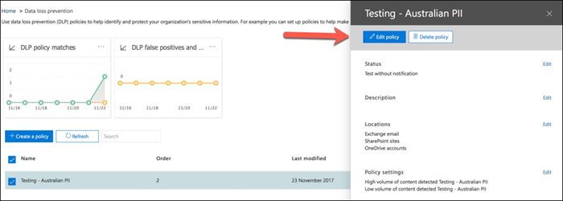
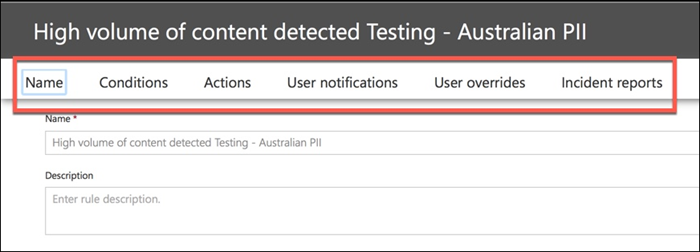

# Crear, probar y optimizar una directiva DLP

La prevención de pérdida de datos (DLP) le ayuda a evitar el uso compartido accidental o no intencionado de información confidencial.

DLP examina los mensajes de correo electrónico y los archivos para obtener información confidencial, como un número de tarjeta de crédito. Con DLP puede detectar información confidencial y tomar medidas como:

- Registrar el evento con fines de auditoría
- Mostrar una advertencia al usuario final que envía el correo electrónico o comparte el archivo
- Bloquear activamente el correo electrónico o el uso compartido de archivos

## Permissions

Los miembros de su equipo de cumplimiento que vayan a crear directivas DLP necesitan permisos para el centro de cumplimiento. De forma predeterminada, el administrador del espacio empresarial tendrá acceso para dar acceso a los responsables de cumplimiento normativo y a otras personas. Siga estos pasos:
  
1. Crear un grupo en Microsoft 365 y adición de responsables de cumplimiento.
    
2. Crear un grupo de roles en la página **Permisos** del Centro de seguridad y cumplimiento. 

3. Al crear el grupo de roles, use la sección Elegir **roles** para agregar el siguiente rol al grupo de roles: **Administración de cumplimiento de DLP.**
    
4. Use la sección **Elegir miembros** para añadir el grupo de Microsoft 365 que creó antes del grupo de roles.

Use el rol **Administración de cumplimiento dlp de** solo vista para crear un grupo de roles con privilegios de solo vista para las directivas DLP y los informes DLP.

Para más información, vea [Conceder acceso a los usuarios al Centro de cumplimiento de Office 365](../security/office-365-security/grant-access-to-the-security-and-compliance-center.md).
  
Estos permisos son necesarios para crear y aplicar una directiva DLP para no aplicar directivas.

## Cómo DLP detecta la información confidencial

DLP busca información confidencial mediante la coincidencia de patrones de expresión regular (RegEx), en combinación con otros indicadores, como la proximidad de determinadas palabras clave a los patrones de coincidencia. Por ejemplo, un número de tarjeta de crédito VISA tiene 16 dígitos. Pero estos dígitos se pueden escribir de diferentes maneras, como 1111-1111-1111-1111, 1111 1111 1111 1111 o 11111111111111111111111111.

Cualquier cadena de 16 dígitos no es necesariamente un número de tarjeta de crédito, puede ser un número de vale de un sistema de asistencia o un número de serie de un fragmento de hardware. Para saber la diferencia entre un número de tarjeta de crédito y una cadena de 16 dígitos inofensiva, se realiza un cálculo (suma de comprobación) para confirmar que los números coinciden con un patrón conocido de las distintas marcas de tarjetas de crédito.

Si DLP encuentra palabras clave como "VISA" o "AMEX", valores cercanos a la fecha que podría ser la fecha de expiración de la tarjeta de crédito, DLP también usa esos datos para ayudarle a decidir si la cadena es un número de tarjeta de crédito o no.

En otras palabras, DLP es lo suficientemente inteligente como para reconocer la diferencia entre estas dos cadenas de texto en un correo electrónico:

- "Puedes pedirme un nuevo portátil. Use mi número VISA 1111-1111-1111-1111, expira el 22/11/11 y envíeme la fecha de entrega estimada cuando la tenga".
- "Mi número de serie de portátil es 2222-2222-2222-2222 y se compró el 11/2010. Por cierto, ¿mi visa de viaje ya está aprobada?"

Vea [definiciones de entidad de tipo de información](sensitive-information-type-entity-definitions.md) confidencial que explica cómo se detecta cada tipo de información.

## Dónde empezar con la prevención de pérdida de datos

Cuando los riesgos de fuga de datos no son totalmente obvios, es difícil averiguar dónde debe comenzar exactamente con la implementación de DLP. Afortunadamente, las directivas DLP se pueden ejecutar en "modo de prueba", lo que le permite medir su eficacia y precisión antes de activarlas.

Las directivas DLP para Exchange Online se pueden administrar a través del Centro de administración de Exchange. Pero puede configurar directivas DLP para todas las cargas de trabajo a través del Centro de seguridad y cumplimiento de &, por lo que eso es lo que usaré para las demostraciones de este artículo. En el Centro de & cumplimiento, encontrará las directivas DLP en Directiva de **prevención de pérdida de**  >  **datos.** Elija **Crear una directiva** para iniciarla.

Microsoft 365 proporciona una variedad de plantillas de directiva [DLP](what-the-dlp-policy-templates-include.md) que puede usar para crear directivas. Supongamos que es un negocio de Australia. Puede filtrar las plantillas en Australia y elegir Finanzas, Salud y Privacidad.

Para esta demostración, elegiré los datos de información de identificación personal (PII) de Australia, que incluye los tipos de información del número de archivo fiscal (TFN) de Australia y el número de licencia de conductor.

Asigne un nombre a la nueva directiva DLP. El nombre predeterminado coincidirá con la plantilla de directiva DLP, pero debe elegir un nombre más descriptivo propio, ya que se pueden crear varias directivas a partir de la misma plantilla.

Elija las ubicaciones a las que se aplicará la directiva. Las directivas DLP se pueden aplicar a Exchange Online, SharePoint Online y OneDrive para la Empresa. Voy a dejar esta directiva configurada para que se aplique a todas las ubicaciones.

En el primer paso **de configuración** de directiva, solo tienes que aceptar los valores predeterminados por ahora. Puede personalizar las directivas DLP, pero los valores predeterminados son un buen punto de inicio.

Después de hacer clic en Siguiente,** se mostrará una página **de** configuración de directiva adicional con más opciones de personalización. Para una directiva que solo estás probando, aquí es donde puedes empezar a realizar algunos ajustes.

- He desactivado las sugerencias de directiva por ahora, que es un paso razonable para realizar si solo estás probando las cosas y no quieres mostrar nada a los usuarios todavía. Las sugerencias de directiva muestran advertencias a los usuarios de que están a punto de infringir una directiva DLP. Por ejemplo, un usuario de Outlook verá una advertencia de que el archivo que ha adjuntado contiene números de tarjeta de crédito y hará que su correo electrónico se rechace. El objetivo de las sugerencias de directiva es detener el comportamiento no compatible antes de que ocurra.
- También he reducido el número de instancias de 10 a 1, por lo que esta directiva detectará cualquier uso compartido de datos pii de Australia, no solo el uso compartido masivo de los datos.
- También he agregado otro destinatario al correo electrónico del informe de incidentes.

Por último, he configurado esta directiva para que se ejecute inicialmente en modo de prueba. Observe que también hay una opción aquí para deshabilitar las sugerencias de directiva mientras está en modo de prueba. Esto te ofrece la flexibilidad de tener las sugerencias de directiva habilitadas en la directiva, pero luego decidir si quieres mostrarlas o suprimirlas durante las pruebas.

En la pantalla de revisión final, haga **clic en Crear** para terminar de crear la directiva.

## Probar una directiva DLP

La nueva directiva DLP empezará a tener efecto en aproximadamente 1 hora. Puedes esperar a que se desencadene por la actividad normal del usuario o puedes intentar desencadenarla tú mismo. Anteriormente, vinculé [a definiciones](sensitive-information-type-entity-definitions.md)de entidad de tipo de información confidencial, que proporciona información sobre cómo desencadenar coincidencias dlp.

Por ejemplo, la directiva DLP que creé para este artículo detectará números de archivo fiscal (TFN) de Australia. Según la documentación, la coincidencia se basa en los siguientes criterios.

 
Para demostrar la detección de TFN de una manera más sencilla, un correo electrónico con las palabras "Número de archivo de impuestos" y una cadena de 9 dígitos cerca se navegará sin problemas. La razón por la que no desencadena la directiva DLP es que la cadena de 9 dígitos debe pasar la suma de comprobación que indica que es un TFN válido y no solo una cadena inofensiva de números.

En comparación, un correo electrónico con las palabras "Número de archivo de impuestos" y un TFN válido que pasa la suma de comprobación activará la directiva. Para el registro aquí, el TFN que estoy usando se ha tomado de un sitio web que genera TFN válidos, pero no originales. Estos sitios son muy útiles porque uno de los errores más comunes al probar una directiva DLP es usar un número falso que no es válido y no superará la suma de comprobación (y, por lo tanto, no activará la directiva).

El correo electrónico del informe de incidentes incluye el tipo de información confidencial que se detectó, el número de instancias detectadas y el nivel de confianza de la detección.

Si deja la directiva DLP en modo de prueba y analiza los correos electrónicos del informe de incidentes, puede empezar a conocer la precisión de la directiva DLP y lo eficaz que será cuando se aplique. Además de los informes de incidentes, puede usar los informes [DLP](view-the-dlp-reports.md) para ver una vista agregada de las coincidencias de directivas en su espacio empresarial.

## Ajustar una directiva DLP

Al analizar los aciertos de la directiva, es posible que desee realizar algunos ajustes en el comportamiento de las directivas. Como ejemplo simple, puede determinar que un TFN en el correo electrónico no es un problema (creo que lo sigue siendo, pero vamos con él por razones de demostración), pero dos o más instancias es un problema. Varios casos pueden ser un escenario de riesgo, como un empleado que envía por correo electrónico una exportación de CSV de la base de datos de RECURSOS a una parte externa, por ejemplo, un servicio de contabilidad externo. Definitivamente, es algo que prefiere detectar y bloquear.

En el Centro de & cumplimiento puede editar una directiva existente para ajustar el comportamiento.

 
Puede ajustar la configuración de ubicación para que la directiva se aplique solo a cargas de trabajo específicas o a cuentas y sitios específicos.

También puede ajustar la configuración de directiva y editar las reglas para que se adapten mejor a sus necesidades.

Al editar una regla dentro de una directiva DLP, puede cambiar:

- Las condiciones, incluido el tipo y el número de instancias de datos confidenciales que desencadenarán la regla.
- Las acciones que se toman, como restringir el acceso al contenido.
- Notificaciones de usuario, que son sugerencias de directiva que se muestran al usuario en su cliente de correo electrónico o explorador web.
- Invalidaciones de usuario, que determina si los usuarios pueden optar por continuar con el correo electrónico o el uso compartido de archivos de todos modos.
- Informes de incidentes, para notificar a los administradores.

Para esta demostración, agregó notificaciones de usuario a la directiva (tenga cuidado de hacerlo sin la formación adecuada para el usuario) y permitió a los usuarios invalidar la directiva con una justificación comercial o marcando como falso positivo. Tenga en cuenta que también puede personalizar el correo electrónico y el texto de la sugerencia de directiva si desea incluir información adicional sobre las directivas de su organización o solicitar a los usuarios que se pondrán en contacto con el soporte técnico si tienen preguntas.

La directiva contiene dos reglas para controlar el volumen alto y el bajo volumen, así que asegúrate de editar ambas con las acciones que quieras. Esta es una oportunidad para tratar los casos de forma diferente en función de sus características. Por ejemplo, puede permitir invalidaciones para infracciones de bajo volumen, pero no permitir invalidaciones para infracciones de volumen alto.

Además, si desea bloquear o restringir realmente el acceso al contenido que infringe la directiva, debe configurar una acción en la regla para hacerlo.

Después de guardar los cambios en la configuración de directiva, también necesito volver a la página de configuración principal de la directiva y habilitar la opción para mostrar sugerencias de directiva a los usuarios mientras la directiva está en modo de prueba. Esta es una forma eficaz de introducir directivas DLP para los usuarios finales y realizar formación sobre el usuario, sin correr el riesgo de demasiados falsos positivos que afectan a su productividad.

En el lado del servidor (o en el lado de la nube, si lo prefiere), es posible que el cambio no surte efecto inmediatamente, debido a varios intervalos de procesamiento. Si está realizando un cambio de directiva DLP que mostrará sugerencias de directiva nuevas a un usuario, es posible que el usuario no vea que los cambios entren en vigor inmediatamente en su cliente de Outlook, que comprueba si hay cambios de directiva cada 24 horas. Si desea acelerar las cosas para realizar pruebas, puede usar esta corrección del Registro para borrar la marca de tiempo de la última descarga de la clave [PolicyNudges](https://support.microsoft.com/en-au/help/2823261/changes-to-a-data-loss-prevention-policy-don-t-take-effect-in-outlook?__hstc=18650278.46377037dc0a82baa8a30f0ef07a7b2f.1538687978676.1538693509953.1540315763430.3&__hssc=18650278.1.1540315763430&__hsfp=3446956451). Outlook descargará la información de directiva más reciente la próxima vez que la reinicie y comience a redactar un mensaje de correo electrónico.

Si tiene las sugerencias de directiva habilitadas, el usuario empezará a ver las sugerencias en Outlook y podrá notificarle falsos positivos cuando se produzcan.

## Investigar falsos positivos

Las plantillas de directiva DLP no son perfectas desde el primer momento. Es probable que encuentre algunos falsos positivos en su entorno, por lo que es tan importante facilitar el acceso a una implementación de DLP, tomando el tiempo suficiente para probar y ajustar las directivas.

Este es un ejemplo de un falso positivo. Este correo electrónico es bastante inofensivo. El usuario proporciona su número de teléfono móvil a alguien e incluye su firma de correo electrónico.

 
Pero el usuario ve una sugerencia de directiva en la que se le advierte de que el correo electrónico contiene información confidencial, en concreto, un número de licencia de conductor de Australia.

El usuario puede informar del falso positivo y el administrador puede ver por qué se ha producido. En el correo electrónico del informe de incidentes, el correo electrónico se marca como un falso positivo.

Este caso de licencia de conductor es un buen ejemplo para profundizar. La razón por la que se ha producido este falso positivo es que el tipo "Licencia de conductor de Australia" se desencadenará mediante cualquier cadena de 9 dígitos (incluso una que forma parte de una cadena de 10 dígitos), dentro de 300 caracteres cerca de las palabras clave "sydney nsw" (no distingue mayúsculas de minúsculas). Por lo tanto, se desencadena mediante el número de teléfono y la firma de correo electrónico, solo porque el usuario se encuentra en Sídney.

Una opción es quitar el tipo de información de licencia de conductor de Australia de la directiva. Está ahí porque forma parte de la plantilla de directiva DLP, pero no estamos obligados a usarla. Si solo te interesan los números de archivo fiscal y no las licencias de conductor, puedes quitarlo. Por ejemplo, puedes quitarla de la regla de bajo volumen de la directiva, pero dejarla en la regla de volumen alto para que aún se detecten listas de varias licencias de controladores.

 
Otra opción es simplemente aumentar el recuento de instancias, para que solo se detecte un bajo volumen de licencias de controlador cuando hay varias instancias.

Además de cambiar el recuento de instancias, también puedes ajustar la precisión de coincidencia (o nivel de confianza). Si el tipo de información confidencial tiene varios patrones, puede ajustar la precisión de coincidencia en la regla para que la regla coincida solo con patrones específicos. Por ejemplo, para ayudar a reducir los falsos positivos, puedes establecer la precisión de coincidencia de la regla para que coincida solo con el patrón con el nivel de confianza más alto. Comprender cómo se calcula el nivel de confianza es un poco complicado (y más allá del ámbito de esta publicación), pero esta es una buena explicación de cómo usar el nivel de confianza para ajustar las [reglas.](data-loss-prevention-policies.md#match-accuracy)

Por último, si quieres obtener incluso un poco más avanzado, puedes personalizar cualquier tipo de información confidencial; por ejemplo, puedes quitar "Sydney NSW" de la lista de palabras clave para el número de licencia de conductor de [Australia,](sensitive-information-type-entity-definitions.md#australia-drivers-license-number)para eliminar el falso positivo desencadenado anteriormente. Para obtener información sobre cómo hacerlo mediante XML y PowerShell, vea la personalización de un tipo de [información confidencial integrado.](customize-a-built-in-sensitive-information-type.md)

## Activar una directiva DLP

Cuando esté satisfecho de que la directiva DLP detecte de forma precisa y eficaz los tipos de información confidencial, y que los usuarios finales estén listos para tratar con las directivas que están en su lugar, puede habilitar la directiva.

 
Si está esperando a ver cuándo se hará efectiva la directiva, conéctese [a PowerShell](https://docs.microsoft.com/powershell/exchange/connect-to-scc-powershell) del Centro de seguridad & Cumplimiento y ejecute el [cmdlet Get-DlpCompliancePolicy](https://docs.microsoft.com/powershell/module/exchange/get-dlpcompliancepolicy) para ver el DistributionStatus.

Después de activar la directiva DLP, debe ejecutar algunas pruebas finales propias para asegurarse de que se están produciendo las acciones de directiva esperadas. Si está intentando probar cosas como los datos de tarjetas de crédito, hay sitios web en línea con información sobre cómo generar tarjetas de crédito de ejemplo u otra información personal que pasará sumas de comprobación y desencadenarán las directivas.

Las directivas que permiten invalidaciones de usuarios presentarán esa opción al usuario como parte de la sugerencia de directiva.

Las directivas que restringen el contenido presentarán la advertencia al usuario como parte de la sugerencia de directiva e impedirán que envíen el correo electrónico.

## Resumen

Las directivas de prevención de pérdida de datos son útiles para organizaciones de todos los tipos. Probar algunas directivas DLP es un ejercicio de bajo riesgo debido al control que tiene sobre aspectos como sugerencias de directiva, invalidaciones de usuarios finales e informes de incidentes. Puede probar algunas directivas DLP en modo silencioso para ver qué tipo de infracciones ya se están produciendo en su organización y, a continuación, crear directivas con tasas de falsos positivos baja, instruir a los usuarios sobre lo que está permitido y no permitido y, a continuación, implantar las directivas DLP en la organización.
