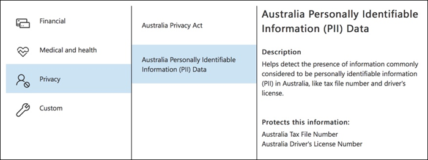
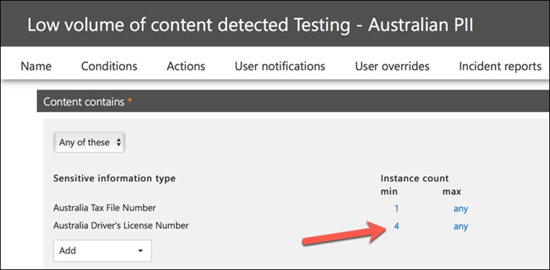

# Crear, probar y optimizar una directiva DLPCreate, test, and tune a DLP policy

La prevención de pérdida de datos (DLP) le ayuda a evitar el uso compartido accidental o no intencionado de información confidencial.Data loss prevention (DLP) helps you prevent the unintentional or accidental sharing of sensitive information.

DLP examina los mensajes de correo electrónico y los archivos para obtener información confidencial, como un número de tarjeta de crédito.DLP examines email messages and files for sensitive information, like a credit card number. Con DLP puede detectar información confidencial y tomar medidas como:Using DLP you can detect sensitive information, and take action such as:

- Registrar el evento con fines de auditoríaLog the event for auditing purposes
- Mostrar una advertencia al usuario final que envía el correo electrónico o comparte el archivoDisplay a warning to the end user who is sending the email or sharing the file
- Bloquear activamente el correo electrónico o el uso compartido de archivosActively block the email or file sharing from taking place

## PermissionsPermissions

Los miembros de su equipo de cumplimiento que vayan a crear directivas DLP necesitan permisos para el centro de cumplimiento.Members of your compliance team who will create DLP policies need permissions to the Compliance Center. De forma predeterminada, el administrador del espacio empresarial tendrá acceso para dar acceso a los responsables de cumplimiento normativo y a otras personas.By default, your tenant admin will have access can give compliance officers and other people access. Siga estos pasos:Follow these steps:
  
1. Crear un grupo en Microsoft 365 y adición de responsables de cumplimiento.Create a group in Microsoft 365 and add compliance officers to it.
    
2. Crear un grupo de roles en la página **Permisos** del Centro de seguridad y cumplimiento.Create a role group on the **Permissions** page of the Security &amp; Compliance Center. 

3. Al crear el grupo de roles, use la sección Elegir **roles** para agregar el siguiente rol al grupo de roles: **Administración de cumplimiento de DLP.**While creating the role group, use the **Choose Roles** section to add the following role to the role group: **DLP Compliance Management**.
    
4. Use la sección **Elegir miembros** para añadir el grupo de Microsoft 365 que creó antes del grupo de roles.Use the **Choose Members** section to add the Microsoft 365 group you created before to the role group.

Use el rol **Administración de cumplimiento dlp de** solo vista para crear un grupo de roles con privilegios de solo vista para las directivas DLP y los informes DLP.Use the **View-Only DLP Compliance Management** role to create role group with view-only privileges to the DLP policies and DLP reports.

Para más información, vea [Conceder acceso a los usuarios al Centro de cumplimiento de Office 365](../security/office-365-security/grant-access-to-the-security-and-compliance-center.md).For more information, see [Give users access to the Office 365 Compliance Center](../security/office-365-security/grant-access-to-the-security-and-compliance-center.md).
  
Estos permisos son necesarios para crear y aplicar una directiva DLP para no aplicar directivas.These permissions are required to create and apply a DLP policy not to enforce policies.

## Cómo DLP detecta la información confidencialHow sensitive information is detected by DLP

DLP busca información confidencial mediante la coincidencia de patrones de expresión regular (RegEx), en combinación con otros indicadores, como la proximidad de determinadas palabras clave a los patrones de coincidencia.DLP finds sensitive information by regular expression (RegEx) pattern matching, in combination with other indicators such as the proximity of certain keywords to the matching patterns. Por ejemplo, un número de tarjeta de crédito VISA tiene 16 dígitos.For example, a VISA credit card number has 16 digits. Pero estos dígitos se pueden escribir de diferentes maneras, como 1111-1111-1111-1111, 1111 1111 1111 1111 o 11111111111111111111111111.But, those digits can be written in different ways, such as 1111-1111-1111-1111, 1111 1111 1111 1111, or 1111111111111111.

Cualquier cadena de 16 dígitos no es necesariamente un número de tarjeta de crédito, puede ser un número de vale de un sistema de asistencia o un número de serie de un fragmento de hardware.Any 16-digit string is not necessarily a credit card number, it could be a ticket number from a help desk system, or a serial number of a piece of hardware. Para saber la diferencia entre un número de tarjeta de crédito y una cadena de 16 dígitos inofensiva, se realiza un cálculo (suma de comprobación) para confirmar que los números coinciden con un patrón conocido de las distintas marcas de tarjetas de crédito.To tell the difference between a credit card number and a harmless 16-digit string, a calculation is performed (checksum) to confirm that the numbers match a known pattern from the various credit card brands.

Si DLP encuentra palabras clave como "VISA" o "AMEX", valores cercanos a la fecha que podría ser la fecha de expiración de la tarjeta de crédito, DLP también usa esos datos para ayudarle a decidir si la cadena es un número de tarjeta de crédito o no.If DLP finds keywords such as "VISA" or "AMEX", near date values that might be the credit card expiry date, DLP also uses that data to help it decide whether the string is a credit card number or not.

En otras palabras, DLP es lo suficientemente inteligente como para reconocer la diferencia entre estas dos cadenas de texto en un correo electrónico:In other words, DLP is smart enough to recognize the difference between these two strings of text in an email:

- "Puedes pedirme un nuevo portátil."Can you order me a new laptop. Use mi número VISA 1111-1111-1111-1111, expira el 22/11/11 y envíeme la fecha de entrega estimada cuando la tenga".Use my VISA number 1111-1111-1111-1111, expiry 11/22, and send me the estimated delivery date when you have it."
- "Mi número de serie de portátil es 2222-2222-2222-2222 y se compró el 11/2010."My laptop serial number is 2222-2222-2222-2222 and it was purchased on 11/2010. Por cierto, ¿mi visa de viaje ya está aprobada?"By the way, is my travel visa approved yet?"

Vea [definiciones de entidad de tipo de información](sensitive-information-type-entity-definitions.md) confidencial que explica cómo se detecta cada tipo de información.See [Sensitive information type entity definitions](sensitive-information-type-entity-definitions.md) that explains how each information type is detected.

## Dónde empezar con la prevención de pérdida de datosWhere to start with data loss prevention

Cuando los riesgos de fuga de datos no son totalmente obvios, es difícil averiguar dónde debe comenzar exactamente con la implementación de DLP.When the risks of data leakage aren't entirely obvious, it's difficult to work out where exactly you should start with implementing DLP. Afortunadamente, las directivas DLP se pueden ejecutar en "modo de prueba", lo que le permite medir su eficacia y precisión antes de activarlas.Fortunately, DLP policies can be run in "test mode", allowing you to gauge their effectiveness and accuracy before you turn them on.

Las directivas DLP para Exchange Online se pueden administrar a través del Centro de administración de Exchange.DLP policies for Exchange Online can be managed through the Exchange admin center. Pero puede configurar directivas DLP para todas las cargas de trabajo a través del Centro de seguridad y cumplimiento de &, por lo que eso es lo que usaré para las demostraciones de este artículo.But you can configure DLP policies for all workloads through the Security & Compliance Center, so that's what I'll use for demonstrations in this article. En el Centro de & cumplimiento, encontrará las directivas DLP en Directiva de **prevención de pérdida de**  >  **datos.**In the Security & Compliance Center, you'll find the DLP policies under **Data loss prevention** > **Policy**. Elija **Crear una directiva** para iniciarla.Choose **Create a policy** to start.

Microsoft 365 proporciona una variedad de plantillas de directiva [DLP](what-the-dlp-policy-templates-include.md) que puede usar para crear directivas.Microsoft 365 provides a range of [DLP policy templates](what-the-dlp-policy-templates-include.md) you can use to create policies. Supongamos que es un negocio de Australia.Let's say that you're an Australian business. Puede filtrar las plantillas en Australia y elegir Finanzas, Salud y Privacidad.You can filter the templates on Australia, and choose Financial, Medical and Health, and Privacy.

Para esta demostración, elegiré los datos de información de identificación personal (PII) de Australia, que incluye los tipos de información del número de archivo fiscal (TFN) de Australia y el número de licencia de conductor.For this demonstration I'll choose Australian Personally Identifiable Information (PII) Data, which includes the information types of Australian Tax File Number (TFN) and Driver's License Number.

Asigne un nombre a la nueva directiva DLP.Give your new DLP policy a name. El nombre predeterminado coincidirá con la plantilla de directiva DLP, pero debe elegir un nombre más descriptivo propio, ya que se pueden crear varias directivas a partir de la misma plantilla.The default name will match the DLP policy template, but you should choose a more descriptive name of your own, because multiple policies can be created from the same template.

Elija las ubicaciones a las que se aplicará la directiva.Choose the locations that the policy will apply to. Las directivas DLP se pueden aplicar a Exchange Online, SharePoint Online y OneDrive para la Empresa.DLP policies can apply to Exchange Online, SharePoint Online, and OneDrive for Business. Voy a dejar esta directiva configurada para que se aplique a todas las ubicaciones.I am going to leave this policy configured to apply to all locations.

En el primer paso **de configuración** de directiva, solo tienes que aceptar los valores predeterminados por ahora.At the first **Policy Settings** step, just accept the defaults for now. Puede personalizar las directivas DLP, pero los valores predeterminados son un buen punto de inicio.You can customize DLP policies, but the defaults are a fine place to start.

Después de hacer clic en Siguiente,\*\* se mostrará una página **de** configuración de directiva adicional con más opciones de personalización.After clicking Next,\*\* you'll be presented with an additional **Policy Settings** page with more customization options. Para una directiva que solo estás probando, aquí es donde puedes empezar a realizar algunos ajustes.For a policy that you are just testing, here's where you can start to make some adjustments.

- He desactivado las sugerencias de directiva por ahora, que es un paso razonable para realizar si solo estás probando las cosas y no quieres mostrar nada a los usuarios todavía.I've turned off policy tips for now, which is a reasonable step to take if you're just testing things out and don't want to display anything to users yet. Las sugerencias de directiva muestran advertencias a los usuarios de que están a punto de infringir una directiva DLP.Policy tips display warnings to users that they're about to violate a DLP policy. Por ejemplo, un usuario de Outlook verá una advertencia de que el archivo que ha adjuntado contiene números de tarjeta de crédito y hará que su correo electrónico se rechace.For example, an Outlook user will see a warning that the file they've attached contains credit card numbers and will cause their email to be rejected. El objetivo de las sugerencias de directiva es detener el comportamiento no compatible antes de que ocurra.The goal of policy tips is to stop the non-compliant behaviour before it happens.
- También he reducido el número de instancias de 10 a 1, por lo que esta directiva detectará cualquier uso compartido de datos pii de Australia, no solo el uso compartido masivo de los datos.I've also decreased the number of instances from 10 to 1, so that this policy will detect any sharing of Australian PII data, not just bulk sharing of the data.
- También he agregado otro destinatario al correo electrónico del informe de incidentes.I've also added another recipient to the incident report email.

Por último, he configurado esta directiva para que se ejecute inicialmente en modo de prueba.Finally, I've configured this policy to run in test mode initially. Observe que también hay una opción aquí para deshabilitar las sugerencias de directiva mientras está en modo de prueba.Notice there's also an option here to disable policy tips while in test mode. Esto te ofrece la flexibilidad de tener las sugerencias de directiva habilitadas en la directiva, pero luego decidir si quieres mostrarlas o suprimirlas durante las pruebas.This gives you the flexibility to have policy tips enabled in the policy, but then decide whether to show or suppress them during your testing.

En la pantalla de revisión final, haga **clic en Crear** para terminar de crear la directiva.On the final review screen click **Create** to finish creating the policy.

## Probar una directiva DLPTest a DLP policy

La nueva directiva DLP empezará a tener efecto en aproximadamente 1 hora.Your new DLP policy will begin to take effect within about 1 hour. Puedes esperar a que se desencadene por la actividad normal del usuario o puedes intentar desencadenarla tú mismo.You can sit and wait for it to be triggered by normal user activity, or you can try to trigger it yourself. Anteriormente, vinculé [a definiciones](sensitive-information-type-entity-definitions.md)de entidad de tipo de información confidencial, que proporciona información sobre cómo desencadenar coincidencias dlp.Earlier I linked to [Sensitive information type entity definitions](sensitive-information-type-entity-definitions.md), which provides you with information about how to trigger DLP matches.

Por ejemplo, la directiva DLP que creé para este artículo detectará números de archivo fiscal (TFN) de Australia.As an example, the DLP policy I created for this article will detect Australian tax file numbers (TFN). Según la documentación, la coincidencia se basa en los siguientes criterios.According to the documentation, the match is based on the following criteria.

 
Para demostrar la detección de TFN de una manera más sencilla, un correo electrónico con las palabras "Número de archivo de impuestos" y una cadena de 9 dígitos cerca se navegará sin problemas.To demonstrate TFN detection in a rather blunt manner, an email with the words "Tax file number" and a 9 digit string in close proximity will sail through without any issues. La razón por la que no desencadena la directiva DLP es que la cadena de 9 dígitos debe pasar la suma de comprobación que indica que es un TFN válido y no solo una cadena inofensiva de números.The reason it does not trigger the DLP policy is that the 9-digit string must pass the checksum that indicates it is a valid TFN and not just a harmless string of numbers.

En comparación, un correo electrónico con las palabras "Número de archivo de impuestos" y un TFN válido que pasa la suma de comprobación activará la directiva.In comparison, an email with the words "Tax file number" and a valid TFN that passes the checksum will trigger the policy. Para el registro aquí, el TFN que estoy usando se ha tomado de un sitio web que genera TFN válidos, pero no originales.For the record here, the TFN I'm using was taken from a website that generates valid, but not genuine, TFNs. Estos sitios son muy útiles porque uno de los errores más comunes al probar una directiva DLP es usar un número falso que no es válido y no superará la suma de comprobación (y, por lo tanto, no activará la directiva).Such sites are very useful because one of the most common mistakes when testing a DLP policy is using a fake number that's not valid and won't pass the checksum (and therefore won't trigger the policy).

El correo electrónico del informe de incidentes incluye el tipo de información confidencial que se detectó, el número de instancias detectadas y el nivel de confianza de la detección.The incident report email includes the type of sensitive information that was detected, how many instances were detected, and the confidence level of the detection.

Si deja la directiva DLP en modo de prueba y analiza los correos electrónicos del informe de incidentes, puede empezar a conocer la precisión de la directiva DLP y lo eficaz que será cuando se aplique.If you leave your DLP policy in test mode and analyze the incident report emails, you can start to get a feel for the accuracy of the DLP policy and how effective it will be when it is enforced. Además de los informes de incidentes, puede usar los informes [DLP](view-the-dlp-reports.md) para ver una vista agregada de las coincidencias de directivas en su espacio empresarial.In addition to the incident reports, you can [use the DLP reports](view-the-dlp-reports.md) to see an aggregated view of policy matches across your tenant.

## Ajustar una directiva DLPTune a DLP policy

Al analizar los aciertos de la directiva, es posible que desee realizar algunos ajustes en el comportamiento de las directivas.As you analyze your policy hits you might want to make some adjustments to how the policies behave. Como ejemplo simple, puede determinar que un TFN en el correo electrónico no es un problema (creo que lo sigue siendo, pero vamos con él por razones de demostración), pero dos o más instancias es un problema.As a simple example, you might determine that one TFN in email is not a problem (I think it still is, but let's go with it for the sake of demonstration), but two or more instances is a problem. Varios casos pueden ser un escenario de riesgo, como un empleado que envía por correo electrónico una exportación de CSV de la base de datos de RECURSOS a una parte externa, por ejemplo, un servicio de contabilidad externo.Multiple instances could be a risky scenario such as an employee emailing a CSV export from the HR database to an external party, for example an external accounting service. Definitivamente, es algo que prefiere detectar y bloquear.Definitely something you would prefer to detect and block.

En el Centro de & cumplimiento puede editar una directiva existente para ajustar el comportamiento.In the Security & Compliance Center you can edit an existing policy to adjust the behaviour.

 
Puede ajustar la configuración de ubicación para que la directiva se aplique solo a cargas de trabajo específicas o a cuentas y sitios específicos.You can adjust the location settings so that the policy is applied only to specific workloads, or to specific sites and accounts.

También puede ajustar la configuración de directiva y editar las reglas para que se adapten mejor a sus necesidades.You can also adjust the policy settings and edit the rules to better suit your needs.

Al editar una regla dentro de una directiva DLP, puede cambiar:When editing a rule within a DLP policy you can change:

- Las condiciones, incluido el tipo y el número de instancias de datos confidenciales que desencadenarán la regla.The conditions, including the type and number of instances of sensitive data that will trigger the rule.
- Las acciones que se toman, como restringir el acceso al contenido.The actions that are taken, such as restricting access to the content.
- Notificaciones de usuario, que son sugerencias de directiva que se muestran al usuario en su cliente de correo electrónico o explorador web.User notifications, which are policy tips that are displayed to the user in their email client or web browser.
- Invalidaciones de usuario, que determina si los usuarios pueden optar por continuar con el correo electrónico o el uso compartido de archivos de todos modos.User overrides, which determines whether users can choose to proceed with their email or file sharing anyway.
- Informes de incidentes, para notificar a los administradores.Incident reports, to notify administrators.

Para esta demostración, agregó notificaciones de usuario a la directiva (tenga cuidado de hacerlo sin la formación adecuada para el usuario) y permitió a los usuarios invalidar la directiva con una justificación comercial o marcando como falso positivo.For this demonstration I've added user notifications to the policy (be careful of doing this without adequate user awareness training), and allowed users to override the policy with a business justification or by flagging it as a false positive. Tenga en cuenta que también puede personalizar el correo electrónico y el texto de la sugerencia de directiva si desea incluir información adicional sobre las directivas de su organización o solicitar a los usuarios que se pondrán en contacto con el soporte técnico si tienen preguntas.Note that you can also customize the email and policy tip text if you want to include any additional information about your organization's policies, or prompt users to contact support if they have questions.

La directiva contiene dos reglas para controlar el volumen alto y el bajo volumen, así que asegúrate de editar ambas con las acciones que quieras.The policy contains two rules for handling of high volume and low volume, so be sure to edit both with the actions that you want. Esta es una oportunidad para tratar los casos de forma diferente en función de sus características.This is an opportunity to treat cases differently depending on their characteristics. Por ejemplo, puede permitir invalidaciones para infracciones de bajo volumen, pero no permitir invalidaciones para infracciones de volumen alto.For example, you might allow overrides for low volume violations, but not allow overrides for high volume violations.

Además, si desea bloquear o restringir realmente el acceso al contenido que infringe la directiva, debe configurar una acción en la regla para hacerlo.Also, if you want to actually block or restrict access to content that is in violation of policy, you need to configure an action on the rule to do so.

Después de guardar los cambios en la configuración de directiva, también necesito volver a la página de configuración principal de la directiva y habilitar la opción para mostrar sugerencias de directiva a los usuarios mientras la directiva está en modo de prueba.After saving those changes to the policy settings, I also need to return to the main settings page for the policy and enable the option to show policy tips to users while the policy is in test mode. Esta es una forma eficaz de introducir directivas DLP para los usuarios finales y realizar formación sobre el usuario, sin correr el riesgo de demasiados falsos positivos que afectan a su productividad.This is an effective way to introduce DLP policies to your end users, and do user awareness training, without risking too many false positives that impact their productivity.

En el lado del servidor (o en el lado de la nube, si lo prefiere), es posible que el cambio no surte efecto inmediatamente, debido a varios intervalos de procesamiento.On the server side (or cloud side if you prefer), the change may not take effect immediately, due to various processing intervals. Si está realizando un cambio de directiva DLP que mostrará sugerencias de directiva nuevas a un usuario, es posible que el usuario no vea que los cambios entren en vigor inmediatamente en su cliente de Outlook, que comprueba si hay cambios de directiva cada 24 horas.If you're making a DLP policy change that will display new policy tips to a user, the user may not see the changes take effect immediately in their Outlook client, which checks for policy changes every 24 hours. Si desea acelerar las cosas para realizar pruebas, puede usar esta corrección del Registro para borrar la marca de tiempo de la última descarga de la clave [PolicyNudges](https://support.microsoft.com/en-au/help/2823261/changes-to-a-data-loss-prevention-policy-don-t-take-effect-in-outlook?__hstc=18650278.46377037dc0a82baa8a30f0ef07a7b2f.1538687978676.1538693509953.1540315763430.3&__hssc=18650278.1.1540315763430&__hsfp=3446956451).If you want to speed things up for testing, you can use this registry fix to [clear the last download time stamp from the PolicyNudges key](https://support.microsoft.com/en-au/help/2823261/changes-to-a-data-loss-prevention-policy-don-t-take-effect-in-outlook?__hstc=18650278.46377037dc0a82baa8a30f0ef07a7b2f.1538687978676.1538693509953.1540315763430.3&__hssc=18650278.1.1540315763430&__hsfp=3446956451). Outlook descargará la información de directiva más reciente la próxima vez que la reinicie y comience a redactar un mensaje de correo electrónico.Outlook will download the latest policy information the next time you restart it and begin composing an email message.

Si tiene las sugerencias de directiva habilitadas, el usuario empezará a ver las sugerencias en Outlook y podrá notificarle falsos positivos cuando se produzcan.If you have policy tips enabled, the user will begin to see the tips in Outlook, and can report false positives to you when they occur.

## Investigar falsos positivosInvestigate false positives

Las plantillas de directiva DLP no son perfectas desde el primer momento.DLP policy templates are not perfect straight out of the box. Es probable que encuentre algunos falsos positivos en su entorno, por lo que es tan importante facilitar el acceso a una implementación de DLP, tomando el tiempo suficiente para probar y ajustar las directivas.It's likely that you'll find some false positives occurring in your environment, which is why it's so important to ease your way into a DLP deployment, taking the time to adequately test and tune your policies.

Este es un ejemplo de un falso positivo.Here's an example of a false positive. Este correo electrónico es bastante inofensivo.This email is quite harmless. El usuario proporciona su número de teléfono móvil a alguien e incluye su firma de correo electrónico.The user is providing their mobile phone number to someone, and including their email signature.

 
Pero el usuario ve una sugerencia de directiva en la que se le advierte de que el correo electrónico contiene información confidencial, en concreto, un número de licencia de conductor de Australia.But the user sees a policy tip warning them that the email contains sensitive information, specifically, an Australian driver's license number.

El usuario puede informar del falso positivo y el administrador puede ver por qué se ha producido.The user can report the false positive, and the administrator can look into why it has occurred. En el correo electrónico del informe de incidentes, el correo electrónico se marca como un falso positivo.In the incident report email, the email is flagged as a false positive.

Este caso de licencia de conductor es un buen ejemplo para profundizar.This driver's license case is a good example to dig into. La razón por la que se ha producido este falso positivo es que el tipo "Licencia de conductor de Australia" se desencadenará mediante cualquier cadena de 9 dígitos (incluso una que forma parte de una cadena de 10 dígitos), dentro de 300 caracteres cerca de las palabras clave "sydney nsw" (no distingue mayúsculas de minúsculas).The reason this false positive has occurred is that the "Australian Driver's License" type will be triggered by any 9-digit string (even one that is part of a 10-digit string), within 300 characters proximity to the keywords "sydney nsw" (not case sensitive). Por lo tanto, se desencadena mediante el número de teléfono y la firma de correo electrónico, solo porque el usuario se encuentra en Sídney.So it's triggered by the phone number and email signature, only because the user happens to be in Sydney.

Una opción es quitar el tipo de información de licencia de conductor de Australia de la directiva.One option is to remove the Australian driver's license information type from the policy. Está ahí porque forma parte de la plantilla de directiva DLP, pero no estamos obligados a usarla.It's in there because it's part of the DLP policy template, but we're not forced to use it. Si solo te interesan los números de archivo fiscal y no las licencias de conductor, puedes quitarlo.If you're only interested in Tax File Numbers and not driver's licenses, you can just remove it. Por ejemplo, puedes quitarla de la regla de bajo volumen de la directiva, pero dejarla en la regla de volumen alto para que aún se detecten listas de varias licencias de controladores.For example, you can remove it from the low volume rule in the policy, but leave it in the high volume rule so that lists of multiple drivers licenses are still detected.

 
Otra opción es simplemente aumentar el recuento de instancias, para que solo se detecte un bajo volumen de licencias de controlador cuando hay varias instancias.Another option is to simply increase the instance count, so that a low volume of driver's licenses is only detected when there are multiple instances.

Además de cambiar el recuento de instancias, también puedes ajustar la precisión de coincidencia (o nivel de confianza).In addition to changing the instance count, you can also adjust the match accuracy (or confidence level). Si el tipo de información confidencial tiene varios patrones, puede ajustar la precisión de coincidencia en la regla para que la regla coincida solo con patrones específicos.If your sensitive information type has multiple patterns, you can adjust the match accuracy in your rule, so that your rule matches only specific patterns. Por ejemplo, para ayudar a reducir los falsos positivos, puedes establecer la precisión de coincidencia de la regla para que coincida solo con el patrón con el nivel de confianza más alto.For example, to help reduce false positives, you can set the match accuracy of your rule so that it matches only the pattern with the highest confidence level. Comprender cómo se calcula el nivel de confianza es un poco complicado (y más allá del ámbito de esta publicación), pero esta es una buena explicación de cómo usar el nivel de confianza para ajustar las [reglas.](data-loss-prevention-policies.md#match-accuracy)Understanding how confidence level is calculated is a bit tricky (and beyond the scope of this post), but here's a good explanation of [how to use confidence level to tune your rules](data-loss-prevention-policies.md#match-accuracy).

Por último, si quieres obtener incluso un poco más avanzado, puedes personalizar cualquier tipo de información confidencial; por ejemplo, puedes quitar "Sydney NSW" de la lista de palabras clave para el número de licencia de conductor de [Australia,](sensitive-information-type-entity-definitions.md#australia-drivers-license-number)para eliminar el falso positivo desencadenado anteriormente.Finally, if you want to get even a bit more advanced, you can customize any sensitive information type -- for example, you can remove "Sydney NSW" from the list of keywords for [Australia driver's license number](sensitive-information-type-entity-definitions.md#australia-drivers-license-number), to eliminate the false positive triggered above. Para obtener información sobre cómo hacerlo mediante XML y PowerShell, vea la personalización de un tipo de [información confidencial integrado.](customize-a-built-in-sensitive-information-type.md)To learn how to do this by using XML and PowerShell, see [customizing a built-in sensitive information type](customize-a-built-in-sensitive-information-type.md).

## Activar una directiva DLPTurn on a DLP policy

Cuando esté satisfecho de que la directiva DLP detecte de forma precisa y eficaz los tipos de información confidencial, y que los usuarios finales estén listos para tratar con las directivas que están en su lugar, puede habilitar la directiva.When you're happy that your DLP policy is accurately and effectively detecting sensitive information types, and that your end users are ready to deal with the policies being in place, then you can enable the policy.

 
Si está esperando a ver cuándo se hará efectiva la directiva, conéctese [a PowerShell](https://docs.microsoft.com/powershell/exchange/connect-to-scc-powershell) del Centro de seguridad & Cumplimiento y ejecute el [cmdlet Get-DlpCompliancePolicy](https://docs.microsoft.com/powershell/module/exchange/get-dlpcompliancepolicy) para ver el DistributionStatus.If you're waiting to see when the policy will take effect, [Connect to Security & Compliance Center PowerShell](https://docs.microsoft.com/powershell/exchange/connect-to-scc-powershell) and run the [Get-DlpCompliancePolicy cmdlet](https://docs.microsoft.com/powershell/module/exchange/get-dlpcompliancepolicy) to see the DistributionStatus.

Después de activar la directiva DLP, debe ejecutar algunas pruebas finales propias para asegurarse de que se están produciendo las acciones de directiva esperadas.After turning on the DLP policy, you should run some final tests of your own to make sure that the expected policy actions are occurring. Si está intentando probar cosas como los datos de tarjetas de crédito, hay sitios web en línea con información sobre cómo generar tarjetas de crédito de ejemplo u otra información personal que pasará sumas de comprobación y desencadenarán las directivas.If you're trying to test things like credit card data, there are websites online with information on how to generate sample credit card or other personal information that will pass checksums and trigger your policies.

Las directivas que permiten invalidaciones de usuarios presentarán esa opción al usuario como parte de la sugerencia de directiva.Policies that allow user overrides will present that option to the user as part of the policy tip.

Las directivas que restringen el contenido presentarán la advertencia al usuario como parte de la sugerencia de directiva e impedirán que envíen el correo electrónico.Policies that restrict content will present the warning to the user as part of the policy tip, and prevent them from sending the email.

## ResumenSummary

Las directivas de prevención de pérdida de datos son útiles para organizaciones de todos los tipos.Data loss prevention policies are useful for organizations of all types. Probar algunas directivas DLP es un ejercicio de bajo riesgo debido al control que tiene sobre aspectos como sugerencias de directiva, invalidaciones de usuarios finales e informes de incidentes.Testing some DLP policies is a low risk exercise due to the control you have over things like policy tips, end user overrides, and incident reports. Puede probar algunas directivas DLP en modo silencioso para ver qué tipo de infracciones ya se están produciendo en su organización y, a continuación, crear directivas con tasas de falsos positivos baja, instruir a los usuarios sobre lo que está permitido y no permitido y, a continuación, implantar las directivas DLP en la organización.You can quietly test some DLP policies to see what type of violations are already occurring in your organization, and then craft policies with low false positive rates, educate your users on what is allowed and not allowed, and then roll out your DLP policies to the organization.
