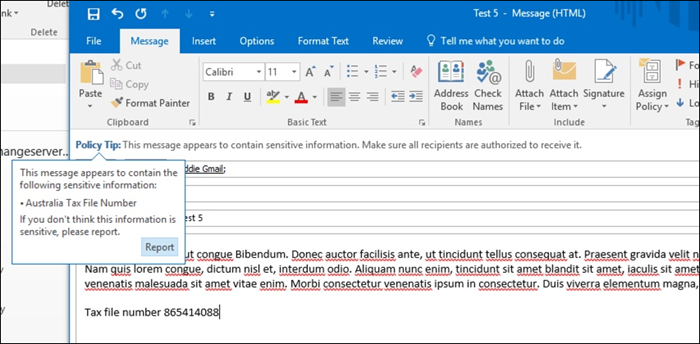
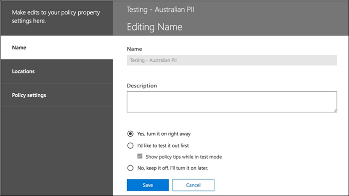

# Crear, probar y optimizar una directiva DLP

La prevención de pérdida de datos (DLP) le ayuda a prevenir el intercambio involuntario o accidental de información confidencial.

DLP examina los mensajes de correo electrónico y los archivos en busca de información confidencial, como un número de tarjeta de crédito. Con DLP puede detectar información confidencial y tomar medidas como:

- Registre el evento con fines de auditoría
- Mostrar una advertencia al usuario final que envía el correo electrónico o comparte el archivo
- Bloquear activamente el uso compartido de correo electrónico o archivos

## Permisos

Los miembros de su equipo de cumplimiento que vayan a crear directivas DLP necesitan permisos para el centro de cumplimiento. De forma predeterminada, el administrador de inquilinos tendrá acceso a los oficiales de cumplimiento y a otras personas. Siga estos pasos:
  
1. Crear un grupo en Microsoft 365 y adición de responsables de cumplimiento.
    
2. Crear un grupo de roles en la página **Permisos** del Centro de seguridad y cumplimiento. 

3. Al crear el grupo de roles, use la sección **Elegir roles** para agregar el siguiente rol al grupo de roles: Administración de **cumplimiento DLP.**
    
4. Use la sección **Elegir miembros** para añadir el grupo de Microsoft 365 que creó antes del grupo de roles.

Use el rol **Administración de cumplimiento DLP de solo vista** para crear un grupo de roles con privilegios de solo vista para las directivas DLP y los informes DLP.

Para más información, vea [Conceder acceso a los usuarios al Centro de cumplimiento de Office 365](../security/office-365-security/grant-access-to-the-security-and-compliance-center.md).
  
Estos permisos son necesarios para crear y aplicar una directiva DLP para no aplicar directivas.

## Cómo DLP detecta información confidencial

DLP encuentra información confidencial por coincidencia de patrones de expresión regular (RegEx), en combinación con otros indicadores, como la proximidad de ciertas palabras clave a los patrones coincidentes. Por ejemplo, un número de tarjeta de crédito VISA tiene 16 dígitos. Pero, esos dígitos se pueden escribir de diferentes maneras, como 1111-1111-1111-1111, 1111 1111 1111 1111 1111, o 1111111111111.

Cualquier cadena de 16 dígitos no es necesariamente un número de tarjeta de crédito, podría ser un número de ticket de un sistema de servicio de ayuda, o un número de serie de una pieza de hardware. Para distinguir entre un número de tarjeta de crédito y una cadena inofensiva de 16 dígitos, se realiza un cálculo (suma de comprobación) para confirmar que los números coinciden con un patrón conocido de las distintas marcas de tarjetas de crédito.

Si DLP encuentra palabras clave como "VISA" o "AMEX", valores cercanos a la fecha que podrían ser la fecha de caducidad de la tarjeta de crédito, DLP también utiliza esos datos para ayudarle a decidir si la cadena es un número de tarjeta de crédito o no.

En otras palabras, DLP es lo suficientemente inteligente como para reconocer la diferencia entre estas dos cadenas de texto en un correo electrónico:

- "¿Puedes pedirme un nuevo portátil. Utilice mi número de VISA 1111-1111-1111-1111, que expira 11/22, y envíeme la fecha de entrega estimada cuando la tenga."
- "Mi número de serie para portátiles es 2222-2222-2222-2222 y fue comprado el 11/2010. Por cierto, ¿mi visa de viaje ya está aprobada?"

Consulte [Definiciones de entidad de tipo de información confidencial](sensitive-information-type-entity-definitions.md) que explica cómo se detecta cada tipo de información.

## Dónde empezar con la prevención de pérdida de datos

Cuando los riesgos de fuga de datos no son del todo obvios, es difícil averiguar dónde exactamente debe comenzar con la implementación de DLP. Afortunadamente, las directivas DLP se pueden ejecutar en "modo de prueba", lo que le permite medir su eficacia y precisión antes de activarlas.

Las directivas DLP para Exchange Online se pueden administrar a través del centro de administración de Exchange. Pero puede configurar directivas DLP para todas las cargas de trabajo a través del Centro de cumplimiento de & de seguridad, por lo que eso es lo que usaré para las demostraciones de este artículo. En el Centro de cumplimiento de & de seguridad, encontrará las **directivas** DLP en Directiva de prevención de pérdida de datos  >  . Elija Create a policy to start **(Crear una directiva** que se iniciará).

Microsoft 365 proporciona una serie de plantillas de [directiva dlp](what-the-dlp-policy-templates-include.md) que puede usar para crear directivas. Digamos que eres un negocio australiano. Puede filtrar las plantillas en Australia y elegir Financiero, Médico y Salud y Privacidad.

Para esta demostración elegiré datos de información de identificación personal australiana (PII), que incluyen los tipos de información del número de archivo tributario australiano (TFN) y el número de licencia de conducir.

Asigne un nombre a su nueva directiva DLP. El nombre predeterminado coincidirá con la plantilla de directiva DLP, pero debe elegir un nombre más descriptivo propio, porque se pueden crear varias directivas a partir de la misma plantilla.

Elija las ubicaciones a las que se aplicará la directiva. Las directivas de DLP pueden aplicarse a Exchange Online, SharePoint en línea y OneDrive para la Empresa. Voy a dejar esta directiva configurada para aplicar a todas las ubicaciones.

En el primer paso **de Configuración de directiva,** solo acepta los valores predeterminados por ahora. Puede personalizar las directivas DLP, pero los valores predeterminados son un buen lugar para iniciar.

Después de hacer clic en Siguiente,** se le presentará una página más **de Configuración de directivas** con más opciones de personalización. Para una política que solo está probando, aquí es donde puede empezar a realizar algunos ajustes.

- He desactivado los consejos de política por ahora, que es un paso razonable a seguir si solo estás probando cosas y no quieres mostrar nada a los usuarios todavía. Las sugerencias de directiva muestran advertencias a los usuarios de que están a punto de infringir una directiva DLP. Por ejemplo, un usuario Outlook verá una advertencia de que el archivo que ha adjuntado contiene números de tarjeta de crédito y hará que su correo electrónico sea rechazado. El objetivo de las sugerencias de directivas es detener el comportamiento no conforme antes de que ocurra.
- También he reducido el número de instancias de 10 a 1, de modo que esta política detectará cualquier uso compartido de datos de PII australianos, no solo el intercambio masivo de los datos.
- También he añadido otro destinatario al correo electrónico del informe del incidente.

Por último, he configurado esta directiva para que se ejecute en modo de prueba inicialmente. Observe que también hay una opción aquí para deshabilitar las sugerencias de directivas mientras está en modo de prueba. Esto le da la flexibilidad de tener sugerencias de directiva habilitadas en la directiva, pero luego decide si mostrarlas o suprimirlas durante las pruebas.

En la pantalla de revisión final, haga clic en **Crear** para terminar de crear la directiva.

## Probar una directiva DLP

Su nueva política de DLP comenzará a surtirá efecto en aproximadamente 1 hora. Puede sentarse y esperar a que se desencadene por la actividad normal del usuario, o puede intentar activarlo usted mismo. Anteriormente se vinculaba a [definiciones de entidad de tipo de información confidencial,](sensitive-information-type-entity-definitions.md)que proporciona información sobre cómo desencadenar coincidencias DLP.

Por ejemplo, la directiva DLP que creé para este artículo detectará números de archivo de impuestos australianos (TFN). Según la documentación, la coincidencia se basa en los siguientes criterios.

 
Para demostrar la detección de TFN de una manera bastante contundente, un correo electrónico con las palabras "Número de archivo de impuestos" y una cadena de nueve dígitos en proximidad navegará a través sin ningún problema. La razón por la que no desencadena la directiva DLP es que la cadena de nueve dígitos debe pasar la suma de comprobación que indica que es un TFN válido y no sólo una cadena inofensiva de números.

En comparación, un correo electrónico con las palabras "Número de archivo de impuestos" y un TFN válido que pase la suma de comprobación desencadenará la directiva. Para que conste aquí, el TFN que estoy usando fue tomado de un sitio web que genera TFN válidos, pero no genuinos. Estos sitios son útiles porque uno de los errores más comunes al probar una directiva DLP es usar un número falso que no es válido y no pasará la suma de comprobación (y por lo tanto no desencadenará la directiva).

El correo electrónico del informe de incidentes incluye el tipo de información confidencial que se detectó, cuántas instancias se detectaron y el nivel de confianza de la detección.

Si deja su directiva DLP en modo de prueba y analiza los correos electrónicos del informe de incidentes, puede empezar a tener una idea de la precisión de la directiva DLP y de la eficacia que será cuando se aplique. Además de los informes de incidentes, puede [usar los informes DLP](view-the-dlp-reports.md) para ver una vista agregada de las coincidencias de directivas en el inquilino.

## Eliminar una directiva de DLP

A medida que analiza los éxitos de la directiva, es posible que desee realizar algunos ajustes en el comportamiento de las directivas. Como ejemplo simple, puede determinar que un TFN en un correo electrónico no es un problema (creo que todavía lo es, pero vamos con él en aras de la demostración), pero dos o más instancias son un problema. Varias instancias podrían ser un escenario riesgoso, como un empleado que envía por correo electrónico una exportación CSV desde la base de datos hr a una entidad externa, por ejemplo, un servicio de contabilidad externo. Hemos detectado un problema desconocido.

En el Centro de cumplimiento puede editar una directiva existente para ajustar el comportamiento.

 
Puede ajustar la configuración de ubicación para que la directiva se aplique solo a cargas de trabajo específicas o a sitios y cuentas específicos.

También puede ajustar la configuración de la directiva y editar las reglas para adaptarse mejor a sus necesidades.

Al editar una regla dentro de una directiva DLP, puede cambiar:

- Las condiciones, incluido el tipo y el número de instancias de datos confidenciales que desencadenarán la regla.
- Las acciones que se realizan, como restringir el acceso al contenido.
- Notificaciones de usuario, que son sugerencias de directiva que se muestran al usuario en su cliente de correo electrónico o navegador web.
- Las invalidaciones de usuario determinan si los usuarios pueden elegir continuar con su correo electrónico o compartir archivos de todos modos.
- Informes de incidentes, para notificar a los administradores.

Para esta demostración he agregado notificaciones de usuario a la directiva (tenga cuidado de hacerlo sin una formación adecuada de concienciación del usuario) y he permitido a los usuarios invalidar la directiva con una justificación empresarial o marcandola como un falso positivo. También puede personalizar el texto de sugerencia de correo electrónico y directiva si desea incluir información adicional sobre las directivas de su organización o pedir a los usuarios que se pongan en contacto con el soporte técnico si tienen preguntas.

La directiva contiene dos reglas para controlar el volumen alto y el volumen bajo, así que asegúrese de editar ambas con las acciones que desee. Esta es una oportunidad para tratar los casos de manera diferente dependiendo de sus características. Por ejemplo, puede permitir invalidaciones para infracciones de volumen bajo, pero no permitir invalidaciones para infracciones de alto volumen.

Además, si realmente desea bloquear o restringir el acceso al contenido que infringe la directiva, debe configurar una acción en la regla para hacerlo.

Después de guardar esos cambios en la configuración de directiva, también necesito volver a la página de configuración principal de la directiva y habilitar la opción para mostrar sugerencias de directiva a los usuarios mientras la directiva está en modo de prueba. Esta es una manera efectiva de introducir políticas DLP a los usuarios finales y hacer capacitación de concienciación de los usuarios, sin arriesgar demasiados falsos positivos que afectan su productividad.

En el lado del servidor (o en la nube si lo prefiere), es posible que el cambio no surte efecto inmediatamente, debido a varios intervalos de procesamiento. Si está realizando un cambio de directiva DLP que mostrará nuevas sugerencias de directivas a un usuario, es posible que el usuario no vea que los cambios surten efecto inmediatamente en su cliente Outlook, que comprueba si hay cambios de directiva cada 24 horas. Si desea acelerar las cosas para las pruebas, puede utilizar esta corrección del Registro para [borrar la última marca de tiempo de descarga de la clave PolicyNudges](https://support.microsoft.com/en-au/help/2823261/changes-to-a-data-loss-prevention-policy-don-t-take-effect-in-outlook?__hstc=18650278.46377037dc0a82baa8a30f0ef07a7b2f.1538687978676.1538693509953.1540315763430.3&__hssc=18650278.1.1540315763430&__hsfp=3446956451). Outlook descargará la información de política más reciente la próxima vez que la reinicie y comience a redactar un mensaje de correo electrónico.

Si tiene sugerencias de directiva habilitadas, el usuario comenzará a ver las sugerencias en Outlook y puede informarle de falsos positivos cuando se produzcan.

## Investigan falsos positivos

Las plantillas de directiva dlp no son perfectas directamente de la caja. Es probable que encuentre algunos falsos positivos que se producen en su entorno, por lo que es tan importante facilitar su camino en una implementación de DLP, tomando el tiempo para probar y ajustar adecuadamente sus políticas.

Este es un ejemplo de un falso positivo. Este correo electrónico es bastante inofensivo. El usuario está proporcionando su número de teléfono móvil a alguien, e incluyendo su firma de correo electrónico.

 
Pero el usuario ve un consejo de política advirtiéndoles que el correo electrónico contiene información confidencial, específicamente, un número de licencia de conducir australiano.

El usuario puede notificar el falso positivo y el administrador puede investigar por qué se ha producido. En el correo electrónico del informe de incidentes, el correo electrónico se marca como un falso positivo.

Este caso de licencia de conducir es un buen ejemplo para profundizar en. La razón por la que se ha producido este falso positivo es que el tipo "Licencia de conducir australiana" se activará por cualquier cadena de 9 dígitos (incluso una que forma parte de una cadena de 10 dígitos), dentro de los 300 caracteres cercanos a las palabras clave "Sydney nsw" (no distingue entre mayúsculas y minúsculas). Así que se activa por el número de teléfono y la firma de correo electrónico, sólo porque el usuario pasa a estar en Sídney.

Una opción es eliminar el tipo de información de licencia de conducir australiano de la política. Está ahí porque forma parte de la plantilla de directiva DLP, pero no nos vemos obligados a usarla. Si solo te interesan los números de archivo de impuestos y no las licencias de conducir, puedes eliminarlo. Por ejemplo, puede quitarlo de la regla de bajo volumen de la directiva, pero dejarlo en la regla de volumen alto para que se sigan detectando listas de varias licencias de controladores.
 
Otra opción es aumentar el recuento de instancias, de modo que solo se detecte un volumen bajo de licencias de conducir cuando haya varias instancias.

Además de cambiar el recuento de instancias, también puede ajustar la precisión del partido (o el nivel de confianza). Si el tipo de información confidencial tiene varios patrones, puede ajustar la precisión de coincidencia en la regla, de modo que la regla solo coincida con patrones específicos. Por ejemplo, para ayudar a reducir los falsos positivos, puede establecer la precisión de coincidencia de la regla para que coincida solo con el patrón con el nivel de confianza más alto. Para obtener más información sobre los niveles de confianza, consulte [Cómo usar el nivel de confianza para ajustar las reglas.](data-loss-prevention-policies.md#match-accuracy)

Por último, si desea obtener incluso un poco más avanzado, puede personalizar cualquier tipo de información confidencial - por ejemplo, puede eliminar "Sydney NSW" de la lista de palabras clave para el [número de licencia de conducir de Australia,](sensitive-information-type-entity-definitions.md#australia-drivers-license-number)para eliminar el falso positivo activado anteriormente. Para obtener información sobre cómo hacerlo mediante XML y PowerShell, vea [personalizar un tipo de información confidencial integrado.](customize-a-built-in-sensitive-information-type.md)

## Active una directiva DLP

Cuando se complace en que la directiva DLP detecte de forma precisa y eficaz tipos de información confidencial y que los usuarios finales estén listos para tratar las directivas que están en vigor, puede habilitar la directiva.

 
Si está esperando para ver cuándo surtirá efecto la directiva, [Conectar a Security & Compliance Center PowerShell](/powershell/exchange/connect-to-scc-powershell) y ejecute el cmdlet [Get-DlpCompliancePolicy](/powershell/module/exchange/get-dlpcompliancepolicy) para ver el DistributionStatus.

Después de activar la directiva DLP, debe ejecutar algunas pruebas finales propias para asegurarse de que se están produciendo las acciones de directiva esperadas. Si está tratando de probar cosas como datos de tarjetas de crédito, hay sitios web en línea con información sobre cómo generar una tarjeta de crédito de muestra u otra información personal que pasará las sumas de comprobación y activará sus políticas.

Las directivas que permiten invalidaciones de usuario presentarán esa opción al usuario como parte de la sugerencia de directiva.

Las directivas que restringen el contenido presentarán la advertencia al usuario como parte de la sugerencia de directiva e impedirán que envíen el correo electrónico.

## Resumen

Las directivas de prevención de pérdida de datos son útiles para organizaciones de todo tipo. Probar algunas directivas DLP es un ejercicio de bajo riesgo debido al control que tiene sobre cosas como sugerencias de directivas, invalidaciones de usuario final e informes de incidentes. Puede probar silenciosamente algunas directivas de DLP para ver qué tipo de infracciones ya se están produciendo en su organización y, a continuación, crear directivas con bajas tasas de falsos positivos, educar a los usuarios sobre lo permitido y no permitido y, a continuación, implementar las directivas DLP en la organización.