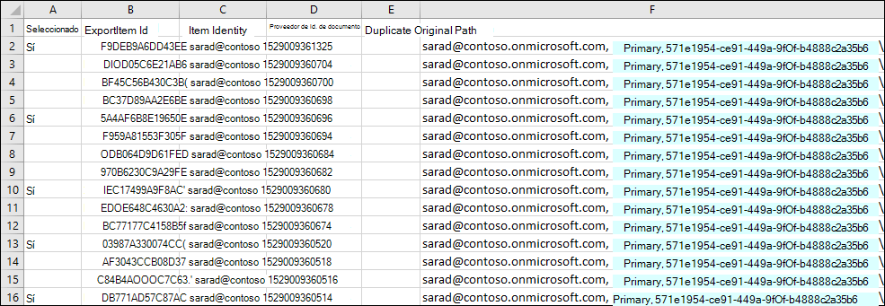
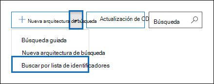
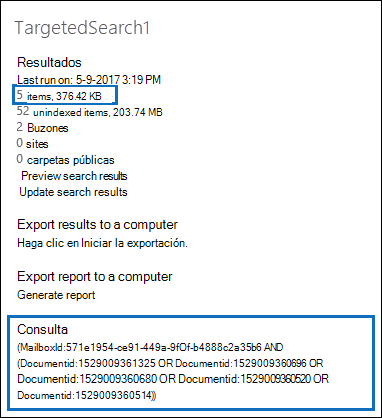

# Preparar un archivo CSV para una búsqueda de contenido de lista de identificadoresPrepare a CSV file for an ID list Content Search

Puede buscar mensajes de correo electrónico de buzones de correo específicos y otros elementos de buzón mediante una lista de los IDs de Exchange.You can search for specific mailbox email messages and other mailbox items using a list of Exchange IDs. Para crear una búsqueda de lista de identificadores (denominada formalmente búsqueda dirigida), envíe un archivo de valores separados por comas (CSV) que identifique los elementos de buzón específicos que se deben buscar.To create an ID list search (formally called a targeted search), you submit a comma separated value (CSV) file that identifies the specific mailbox items to search for. Para este archivo CSV se usa el archivo **Results.csv** o el archivo **Items.csv** sin indexar que se incluyen al exportar los resultados de la búsqueda de contenido o exportar un informe de búsqueda de contenido y la búsqueda de contenido existente.For this CSV file you use the **Results.csv** file or the **Unindexed Items.csv** file that are included when you export the Content Search results or export a Content Search report from and existing Content Search. A continuación, edita uno de estos archivos para indicar los elementos específicos que se deben buscar y, a continuación, crea una nueva búsqueda de lista de identificadores y envía el archivo CSV.Then you edit one of these files to indicate the specific items to search for, and then create a new ID list search and submit the CSV file.

Esta es una introducción rápida del proceso para crear una búsqueda de lista de identificadores.Here's a quick overview of the process for creating an ID list search.

1. Cree y ejecute una búsqueda de contenido nueva o guiada en el Centro de & cumplimiento.Create and run a new or guided Content Search in the Security & Compliance Center.

2. Exporte los resultados de la búsqueda de contenido o exporte el informe de búsqueda de contenido.Export the content search results or export the content search report. Para obtener más información, vea:For more information, see:

    - [Exportar resultados de la búsqueda de contenidoExport Content Search results](export-search-results.md)

    - [Exportar un informe de búsqueda de contenidoExport a Content Search report](export-a-content-search-report.md)

3. Edite **elResults.csv** o el archivo **Items.csv** sin indexar e identifique los elementos de buzón específicos que desea incluir en la búsqueda de la lista de identificadores.Edit the **Results.csv** file or the **Unindexed Items.csv** and identify the specific mailbox items that you want to include in the ID list search. Vea las [instrucciones para](#prepare-the-csv-file-for-an-id-list-search) preparar un archivo CSV para una búsqueda de lista de identificadores.See the [instructions](#prepare-the-csv-file-for-an-id-list-search) for preparing a CSV file for an ID list search.

4. Cree una nueva búsqueda de lista de identificadores (vea las [instrucciones)](#create-an-id-list-search)y envíe el archivo CSV que preparó.Create a new ID list search (see the [instructions](#create-an-id-list-search)) and submit the CSV file that you prepared. La consulta de búsqueda que se crea solo buscará los elementos seleccionados en el archivo CSV.The search query that's created will only search for the items selected in the CSV file.

> [!NOTE]
> Las búsquedas de lista de identificadores solo se admiten para elementos de buzón.ID list searches are only supported for mailbox items. No puede buscar documentos de SharePoint y OneDrive en una búsqueda de lista de identificadores.You can't search for SharePoint and OneDrive documents in an ID list search.

 **¿Por qué crear una búsqueda de lista de identificadores?****Why create an ID list search?** Si no puede determinar si un elemento responde a una solicitud de exhibición de documentos electrónicos basada en los metadatos de los archivos **Results.csv** o **Unindexed Items.csv,** puede usar una búsqueda de lista de identificadores para buscar, obtener una vista previa y exportar ese elemento para determinar si responde al caso que está investigando.If you're unable to determine if an item is responsive to an eDiscovery request based on the metadata in the **Results.csv** or **Unindexed Items.csv** files, you can use an ID list search to find, preview, and then export that item to determine if it's responsive to the case you're investigating. Las búsquedas de lista de identificadores se suelen usar para buscar y devolver un conjunto específico de elementos no indexados.ID list searches are typically used to search for and return a specific set of unindexed items.

## Preparar el archivo CSV para una búsqueda de lista de identificadoresPrepare the CSV file for an ID list search

Después de exportar los resultados de la búsqueda o el informe de una búsqueda de contenido, puede realizar los siguientes pasos para preparar el archivo CSV para una búsqueda de lista de identificadores.After you export the search results or report for a content search, you can perform the following steps to prepare the CSV file for an ID list search. Este archivo CSV identificará todos los elementos de la búsqueda de la lista de identificadores.This CSV file will identify every item in the ID list search.

Tenga en cuenta que puede usar un archivo CSV de una búsqueda que  incluye sitios de SharePoint y cuentas de OneDrive, pero solo puede seleccionar elementos de buzón para una búsqueda de lista de identificadores.Note that you can use a CSV file from a search that included SharePoint sites and OneDrive accounts, but you can select  *only*  mailbox items for an ID list search. Si selecciona un documento en SharePoint o OneDrive, el archivo CSV no pasará la validación al crear una búsqueda de lista de identificadores.If you select a document in SharePoint or OneDrive, the CSV file will fail validation when you create an ID list search.

1. Abra el **archivoResults.csv** **o Unindexed Items.csv** en Excel.Open the **Results.csv** or **Unindexed Items.csv** file in Excel.

2. En la **columna Seleccionada,** escriba **Sí** en la celda que corresponda al elemento que desea buscar.In the **Selected** column, type **Yes** in the cell that corresponds to the item that you want to search for. Repita este paso para cada elemento que desee buscar.Repeat this step for every item that you want to search for.

    > [!IMPORTANT]
    > Al abrir el archivo CSV en Excel, el formato de datos de la columna **Id.** de documento se cambia a **General**.When you open the CSV file in Excel, the data format for the **Document ID** column is changed to **General**. Esto da como resultado mostrar el identificador de documento de un elemento en la notación científica.This results in displaying the document ID for an item in scientific notation. Por ejemplo, el identificador de documento de "481037338205" se muestra como "4.81037E+11" Debe  realizar los pasos siguientes para cambiar el formato de datos de la columna Id. de documento a **Número** para restaurar el formato correcto para el identificador del documento.For example, the document ID of "481037338205" is displayed as "4.81037E+11" You have to perform the next steps to change the data format of the **Document ID** column to **Number** to restore the correct format for the document ID. Si no lo hace, se producirá un error en la búsqueda de la lista de identificadores que usa el archivo CSV.If you don't do this, the ID list search that uses the CSV file will fail.

3. Haga clic con el botón secundario en toda **la columna Id.** de documento y seleccione **Formato de celdas**.Right-click the entire **Document ID** column and select **Format Cells**.

4. En el **cuadro** Categoría, haga clic en **Número**.In the **Category** box, click **Number**.

5. Cambie el número de posiciones decimales a **0** y, a continuación, haga clic en **Aceptar** para guardar los cambios.Change the number of decimal places to **0**, and then click **OK** to save your changes. Observe que los valores de la columna Id. de documento se cambian a números.Notice that the values in the Document ID column are changed to numbers.

    Este es un ejemplo del archivo CSV que está listo para enviarse para una búsqueda de contenido de lista de identificadores.Here's an example of the a CSV file that's ready to be submitted for a ID list content search.

    

6. Guarde el archivo CSV o use **Guardar como** para guardar el archivo con un nombre de archivo diferente.Save the CSV file or use **Save As** to the save the file with different file name. En ambos casos, asegúrese de guardar el archivo con el formato CSV.In both cases, be sure to save the file with the CSV format.

## Crear una búsqueda de lista de identificadoresCreate an ID list search

El siguiente paso es crear una nueva búsqueda de contenido de lista de identificadores y enviar el archivo CSV que preparó en el paso anterior.The next step is to create a new ID list Content Search and submit the CSV file that you prepared in the previous step.

> [!IMPORTANT]
> Debe crear una búsqueda de lista de identificadores no más de 2 días después de exportar los resultados o informes de una búsqueda de contenido.You should create an ID list search no more than 2 days after exporting the results or report from a Content Search. Si los resultados de la búsqueda o el informe donde se exportaron hace más de 2 días, debe volver a exportar los resultados de la búsqueda o el informe para generar archivos CSV actualizados.If the search results or report where exported more than 2 days ago, you should re-export the search results or report to generate updated CSV files. A continuación, puede preparar uno de los archivos CSV actualizados y usarlo para crear una búsqueda de lista de identificadores.Then you can prepare one of the updated CSV files and use it to create an ID list search.

1. En el Centro de & cumplimiento, vaya **a** Búsqueda \> **de contenido.**In the Security & Compliance Center, go to **Search** \> **Content search**.

2. En la **página Buscar,** haga clic en la flecha junto a Agregar icono Nueva búsqueda y, a continuación, haga clic   **identificadores.**On the **Search** page, click the arrow next to  **New search**, and then click **Search by ID List**.

    

3. En **el** menú desplegable Buscar por lista de identificadores, asigne  un nombre a la búsqueda (y, opcionalmente, descríbala) y, a continuación, haga clic en Examinar y seleccione el archivo CSV que preparó en el paso anterior.On the **Search by ID List** flyout, name the search (and optionally describe it) and then click **Browse** and select the CSV file that you prepared in the previous step.

    Microsoft 365 intenta validar el archivo CSV.Microsoft 365 attempts to validate the CSV file. Si la validación no se realiza correctamente, se muestra un mensaje de error que puede ayudarle a solucionar los errores de validación.If the validation is unsuccessful, an error message is displayed that might help you troubleshoot the validation errors. El archivo CSV debe validarse correctamente para crear una búsqueda de lista de identificadores.The CSV file has to be successfully validated to create an ID list search.

4. Después de validar correctamente el archivo CSV, haga clic en **Buscar** para crear la búsqueda de la lista de identificadores.After the CSV file is successfully validated, click **Search** to create the ID list search.

    Este es un ejemplo de los resultados de búsqueda estimados y la consulta que se genera para una búsqueda de lista de identificadores.Here's an example of the estimated search results and the query that's generated for an ID list search.

    

    Tenga en cuenta que el número de elementos estimados que se muestran en las estadísticas para la búsqueda de id. debe coincidir con el número de elementos que seleccionó en el archivo CSV.Note that the number of estimated items displayed in statistics for the ID search should match the number of items that you selected in the CSV file.

5. Obtenga una vista previa o exporte los elementos devueltos por la búsqueda de la lista de identificadores.Preview or export the items returned by the ID list search.

> [!NOTE]
> Si mueve un buzón después de crear una búsqueda de lista de identificadores, la consulta de la búsqueda no devolverá los elementos especificados.If you move a mailbox after creating an ID list search, the query for the search won't return the specified items. Esto se debe a que la **propiedad DocumentId** de los elementos del buzón se cambia cuando se mueve un buzón.That's because the **DocumentId** property for mailbox items are changed when a mailbox is moved. En el caso poco frecuente cuando se mueve un buzón después de crear una búsqueda de lista de identificadores, debe crear una nueva búsqueda de contenido (o actualizar los resultados de búsqueda para la búsqueda de contenido existente) y, a continuación, exportar los resultados de la búsqueda o el informe para generar archivos CSV actualizados que se pueden usar para crear una nueva búsqueda de lista de identificadores.In the rare instance when a mailbox is moved after you create an ID list search, you should create a new content search (or update the search results for the existing content search) and then export the search results or report to generate updated CSV files that can be used to create a new ID list search.
