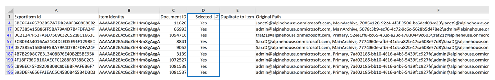

# Preparar un archivo CSV para una búsqueda de contenido de lista de identificadores

Puede buscar mensajes de correo electrónico de buzones de correo específicos y otros elementos de buzón mediante una lista de Exchange de correo electrónico. Para crear una búsqueda por lista de id., debe enviar un archivo CSV que identifique los elementos de buzón específicos que desee buscar. Para este archivo CSV, se usa el archivo **Results.csv** o el archivo **Items.csv** sin indizar que se incluyen al exportar los resultados de búsqueda de contenido o exportar un informe de búsqueda de contenido de una búsqueda de contenido existente. A continuación, edite uno de estos archivos para indicar los elementos específicos que se buscarán, cree una nueva búsqueda de lista de identificadores y envíe el archivo CSV.

**¿Por qué crear una búsqueda de lista de identificadores?** Si no puede determinar si un elemento responde a una solicitud de exhibición de documentos electrónicos en función de los metadatos de los archivos **Items.csv** o **Results.csv** sin indizar, puede usar una búsqueda de lista de identificadores para buscar, obtener una vista previa y exportar ese elemento para determinar si responde al caso que está investigando. Las búsquedas de lista de identificadores se suelen usar para buscar y devolver un conjunto específico de elementos sin indizar.

Este es un resumen rápido del proceso para crear una búsqueda de lista de identificadores.

1. Cree y ejecute una nueva búsqueda en el centro Microsoft 365 cumplimiento.

2. Exporte los resultados de búsqueda de contenido o el informe de búsqueda de contenido. Para obtener más información, vea:

    - [Exportar resultados de la búsqueda de contenido](export-search-results.md)

    - [Exportar un informe de búsqueda de contenido](export-a-content-search-report.md)

3. Edite **elResults.csv** o archivo **de** Items.csvsin indizar e identifique los elementos de buzón específicos que se incluirán en la búsqueda de lista de identificadores. Consulta las [instrucciones para](#prepare-the-csv-file-for-an-id-list-search) preparar un archivo CSV para una búsqueda de lista de identificadores.

4. Cree una nueva búsqueda de lista de identificadores (vea las [instrucciones)](#create-an-id-list-search)y envíe el archivo CSV que preparó. La consulta de búsqueda creada solo buscará los elementos seleccionados en el archivo CSV.

> [!NOTE]
> Las búsquedas de lista de identificadores solo se admiten para elementos de buzón. No puede buscar documentos SharePoint y OneDrive en una búsqueda de lista de identificadores.

## Preparar el archivo CSV para una búsqueda de lista de identificadores

Después de exportar los resultados de búsqueda o el informe de una búsqueda, siga estos pasos para preparar el archivo CSV para una búsqueda de lista de identificadores. Este archivo CSV identifica todos los elementos de la búsqueda de lista de identificadores.

Puede usar un archivo CSV de una búsqueda que incluye sitios SharePoint y cuentas OneDrive, pero solo puede seleccionar elementos de buzón para una búsqueda de lista de identificadores. Si selecciona un documento en SharePoint o OneDrive, el archivo CSV producirá un error de validación al crear una búsqueda de lista de identificadores.

1. Abra el **archivoResults.csv** **o Unindexed Items.csv** en Excel.

2. En la **columna Seleccionada,** escriba **Sí** en la celda que corresponde al elemento que desea buscar. Repita este paso para cada elemento que desee buscar.

    > [!IMPORTANT]
    > Al abrir el archivo CSV en Excel, es posible que el formato de datos de la columna **Id.** de documento se haya cambiado a **General**. Esto da como resultado mostrar el identificador de documento de un elemento en la notación científica. Por ejemplo, el identificador de documento de "481037338205" se muestra como "4.81037E+11". Si esto sucede, debe realizar los pasos siguientes para cambiar el formato de datos de la columna **Id.** de documento a **Número** para restaurar el formato correcto para el identificador del documento. Si no lo hace, se producirá un error en la búsqueda de la lista de identificadores que usa el archivo CSV.

3. Haga clic con el botón secundario en toda **la columna Id. de** documento y seleccione Formato de **celdas**.

4. En el **cuadro Categoría,** haga clic en **Número**.

5. Cambie el número de decimales a **0** y, a continuación, haga clic en **Aceptar** para guardar los cambios. Observe que los valores de la columna Id. de documento se cambian a números.

    Este es un ejemplo de un archivo CSV que está listo para enviarse para una búsqueda de contenido de lista de identificadores.

    

6. Guarde el archivo CSV o use **Guardar como** para guardar el archivo con un nombre de archivo diferente. En ambos casos, asegúrese de guardar el archivo con el formato CSV.

## Crear una búsqueda de lista de identificadores

El siguiente paso es crear una nueva búsqueda de lista de identificadores y enviar el archivo CSV que preparó en el paso anterior.

> [!IMPORTANT]
> Debe crear una búsqueda de lista de identificadores no más de 2 días después de exportar los resultados o el informe de búsqueda. Si los resultados de búsqueda o el informe donde se exportaron hace más de 2 días, debe volver a exportar los resultados de búsqueda o el informe para generar archivos CSV actualizados. A continuación, puede preparar uno de los archivos CSV actualizados y usarlo para crear una búsqueda de lista de identificadores.

1. Vaya a <https://compliance.microsoft.com> e inicie sesión.

2. En el panel de navegación izquierdo del Centro de cumplimiento de Microsoft 365, haga clic en **Mostrar todo** y, luego, seleccione **Búsqueda de contenido**.

3. En la **página Búsqueda de contenido,** haga clic **en Buscar por lista de identificadores.**

4. En **el** menú desplegable Buscar por lista de identificadores, asigne  un nombre a la búsqueda (y, opcionalmente, describenla) y, a continuación, haga clic en Examinar y seleccione el archivo CSV que preparó en el paso anterior.

    Microsoft 365 intentos de validar el archivo CSV. Si la validación no se realiza correctamente, se muestra un mensaje de error que puede ayudarle a solucionar los errores de validación. El archivo CSV debe validarse correctamente para crear una búsqueda de lista de identificadores.

5. Después de validar correctamente el archivo CSV, haga clic **en Buscar** para crear la búsqueda de lista de identificadores.

    Este es un ejemplo de la página desplegable de una búsqueda de lista de identificadores que muestra la consulta generada y el número estimado de resultados de búsqueda.

    

    El número de elementos estimados que se muestran en las estadísticas para la búsqueda de id. debe coincidir con el número de elementos seleccionados en el archivo CSV.

6. Obtenga una vista previa o exporte los elementos devueltos por la búsqueda de lista de identificadores.

## Más información

Si mueve un buzón después de crear una búsqueda de lista de identificadores, la consulta de la búsqueda no devolverá los elementos especificados. Esto se debe a que la **propiedad DocumentId** de los elementos de buzón se cambia cuando se mueve un buzón. En la rara instancia cuando se mueve un buzón después de crear una búsqueda de lista de identificadores, debe crear una nueva búsqueda de contenido (o actualizar los resultados de búsqueda de una búsqueda existente) y, a continuación, exportar los resultados o el informe de búsqueda para generar archivos CSV actualizados que se pueden usar para crear una nueva búsqueda de lista de identificadores.
