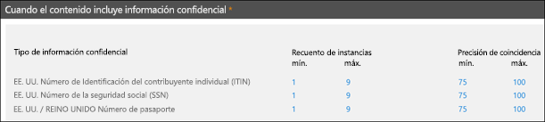

# Tipos de información confidencial personalizada

Microsoft 365 incluye muchos tipos de información confidencial que están listos para usarse en su organización, como [prevención de pérdida de datos](data-loss-prevention-policies.md) (DLP), o con [Microsoft Cloud App Security](https://docs.microsoft.com/cloud-app-security). Los tipos de información confidencial integrados pueden ayudar a identificar y proteger números de tarjetas de crédito, números de cuentas bancarias, números de pasaporte y más, en función de los patrones definidos por una expresión regular (regex) o una función. Para obtener más información, consulte [Qué buscan los tipos de información confidencial](what-the-sensitive-information-types-look-for.md).

Pero, ¿qué sucede si necesita identificar y proteger un tipo diferente de información confidencial, como el id. de empleados o los números de proyecto, mediante un formato específico para su organización? Para ello, puede crear un tipo de información confidencial personalizado.

Estas son las partes básicas de un tipo personalizado de información confidencial:

- **Patrón principal**: números de id. de empleado, números de proyecto, etc. Suele identificarse mediante una expresión regular (regex), pero también puede ser una lista de palabras clave.

- **Evidencia adicional**: imagine que busca un número de id. de empleado de nueve dígitos. No todos los números de nueve dígitos son números de id. de empleado, pero puede buscar texto adicional (palabras clave como “empleado”, “identificación” o “id.”, o bien otros patrones de texto basados en expresiones regulares). Esta evidencia complementaria (también conocida como _evidencia_ _corroborativa_) incrementa la probabilidad de que el número de nueve dígitos encontrado en el contenido sea realmente un número de id. de empleado.

- **Proximidad de caracteres**: tiene sentido que, cuanto más próximos estén entre sí el patrón principal y la evidencia complementaria, más probabilidades habrá de que el contenido detectado sea lo que busca. Puede especificar la distancia de caracteres entre el patrón principal y la evidencia complementaria (también conocida como _ventana de proximidad_), como se muestra en el diagrama siguiente:

    

- **Nivel de confianza**: cuantas más evidencias complementarias tenga, mayor será la probabilidad de que una coincidencia contenga la información confidencial que busca. Puede asignar mayores niveles de confianza a las coincidencias detectadas mediante el uso de más evidencias.

  Cuando esté conforme, un patrón devolverá un recuento y un nivel de confianza, que podrá usar en las condiciones de las directivas DLP. Al agregar a una directiva DLP una condición para detectar un tipo de información confidencial, puede editar el recuento y el nivel de confianza, como se muestra en el diagrama siguiente:

    

## Crear tipos de información confidencial personalizados

Para crear tipos de información confidencial personalizados en el Centro de seguridad y cumplimiento, puede elegir una de estas opciones:

- **Usar EDM** Puede establecer los tipos de información confidencial mediante la clasificación basada en la coincidencia exacta de los datos (EDM). Este método le permite crear un tipo de información confidencial dinámico con una base de datos segura que puede actualizar periódicamente. Vea [Crear un tipo de información confidencial personalizado con coincidencia exacta de datos](create-custom-sensitive-information-types-with-exact-data-match-based-classification.md).

- **Usar PowerShell** Puede configurar los tipos de información confidencial con PowerShell. Aunque este método es más complejo que utilizar la interfaz de usuario, tendrá más opciones de configuración. Vea [Crear un tipo de información confidencial en el centro de cumplimiento y seguridad PowerShell](create-a-custom-sensitive-information-type-in-scc-powershell.md).

- **Usar la interfaz de usuario** Puede configurar un tipo de información confidencial personalizado mediante la interfaz de usuario del centro de cumplimiento y seguridad. Con este método, puede usar expresiones regulares, palabras clave y diccionarios de palabras clave. Para obtener más información, consulte [Crear un tipo de información confidencial](create-a-custom-sensitive-information-type.md).

> [!NOTE]
> Microsoft 365 Information Protection ahora es compatible con la vista previa de idiomas con conjunto de caracteres de doble byte para:
> - Chino (simplificado)
> - Chino (tradicional)
> - Coreano
> - Japonés

>Este soporte está disponible para tipos de información confidencial. Para más información, consulte [Notas de la versión sobre la compatibilidad de Information Protection con juegos de caracteres de doble byte (vista previa)](mip-dbcs-relnotes.md).

