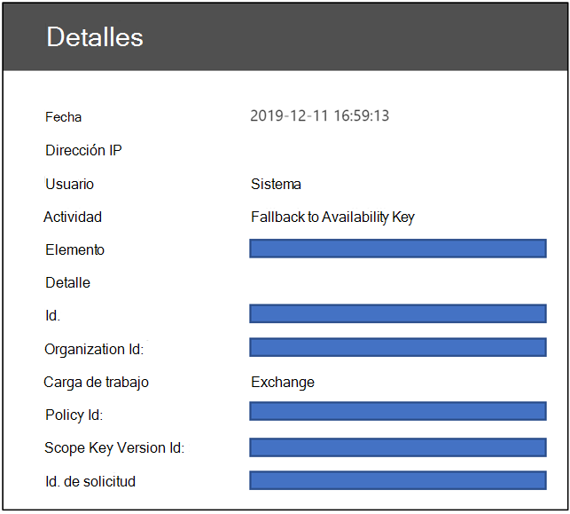
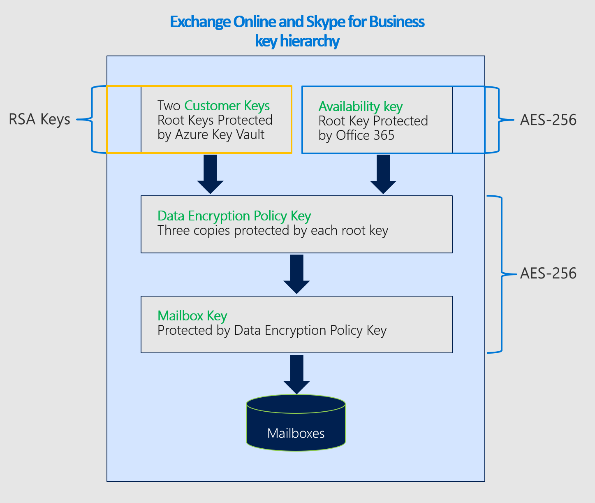

# Obtener más información sobre la clave de disponibilidad de Clave de clienteLearn about the availability key for Customer Key

La clave de disponibilidad es una clave raíz que se genera y aprovisiona automáticamente cuando se crea una directiva de cifrado de datos.The availability key is a root key automatically generated and provisioned when you create a data encryption policy. Microsoft 365 almacena y protege la clave de disponibilidad.Microsoft 365 stores and protects the availability key. La clave de disponibilidad es funcionalmente similar a las dos claves raíz que se proporcionan para el cifrado de servicio con la clave de cliente.The availability key is functionally like the two root keys that you supply for service encryption with Customer Key. La clave de disponibilidad ajusta las claves en un nivel inferior de la jerarquía de claves.The availability key wraps the keys one tier lower in the key hierarchy. A diferencia de las claves que se proporcionan y se administran en Azure Key Vault, no se puede tener acceso directamente a la clave Availability.Unlike the keys that you provide and manage in Azure Key Vault, you can't directly access the availability key. Los servicios automatizados de Microsoft 365 administran la clave de disponibilidad mediante programación.Microsoft 365 automated services manage the availability key programatically. Estos servicios inician operaciones automatizadas que nunca implican acceso directo a la clave de disponibilidad.These services initiate automated operations that never involve direct access to the availability key.

El objetivo principal de la clave de disponibilidad es proporcionar la capacidad de recuperación de la pérdida imprevista de las claves raíz que se administran.The primary purpose of the availability key is to provide recovery capability from the unanticipated loss of root keys that you manage. La pérdida podría ser el resultado de una acción malintencionada o de una mala administración.Loss could be a result of mismanagement or malicious action. Si pierde el control de las claves raíz, póngase en contacto con el soporte técnico de Microsoft y Microsoft le ayudará en el proceso de recuperación con la clave de disponibilidad.If you lose control of your root keys, contact Microsoft Support and Microsoft will assist you through the process of recovery using the availability key. Usará la clave de disponibilidad para migrar a una nueva Directiva de cifrado de datos con las claves raíz nuevas que aprovisione.You'll use the availability key to migrate to a new Data Encryption Policy with new root keys you provision.

El almacenamiento y el control de la clave de disponibilidad son deliberadamente diferentes de las claves de Azure Key Vault por tres motivos:Storage and control of the availability key are deliberately different from Azure Key Vault keys for three reasons:

- La clave de disponibilidad proporciona una función de recuperación y "interrupción de la luna" si se pierde el control sobre ambas claves del almacén de claves de Azure.The availability key provides a recovery, "break-glass" capability if control over both Azure Key Vault keys is lost.
- La separación de los controles lógicos y las ubicaciones de almacenamiento seguro proporciona una defensa en profundidad y protege contra la pérdida de todas las claves y de los datos, desde un único ataque o punto de error.The separation of logical controls and secure storage locations provides defense-in-depth and protects against the loss of all keys, and your data, from a single attack or point of failure.
- La clave de disponibilidad proporciona una capacidad de alta disponibilidad si los servicios de Microsoft 365 no pueden comunicarse con claves hospedadas en Azure Key Vault debido a errores transitorios.The availability key provides a high-availability capability if Microsoft 365 services are unable to reach keys hosted in Azure Key Vault due to transient errors. Esta regla solo se aplica a Exchange Online y al cifrado del servicio de Skype empresarial.This rule only applies to Exchange Online and Skype for Business service encryption. Los archivos de SharePoint Online, OneDrive para la empresa y Microsoft Teams nunca usan la clave de disponibilidad a menos que indique explícitamente a Microsoft que inicie el proceso de recuperación.SharePoint Online, OneDrive for Business, and Teams files never use the availability key unless you explicitly instruct Microsoft to initiate the recovery process.

Compartir la responsabilidad para proteger los datos, mediante el uso de una variedad de protecciones y procesos para la administración de claves, reduce en última instancia el riesgo de que se pierdan o destruyan permanentemente todas las claves (y, por lo tanto, los datos).Sharing the responsibility to protect your data, using a variety of protections and processes for key management, ultimately reduces the risk that all keys (and therefore your data) will be permanently lost or destroyed. Microsoft proporciona una única autoridad sobre la deshabilitación o la destrucción de la clave de disponibilidad cuando abandona el servicio.Microsoft provides you with sole authority over the disablement or destruction of the availability key when you leave the service. Por diseño, nadie en Microsoft tiene acceso a la clave de disponibilidad: solo es accesible para el código de servicio de Microsoft 365.By design, no one at Microsoft has access to the availability key: it is only accessible by Microsoft 365 service code.

Consulte el [centro de confianza de Microsoft](https://www.microsoft.com/trustcenter/Privacy/govt-requests-for-data) para obtener más información sobre cómo se protegen las claves.See the [Microsoft Trust Center](https://www.microsoft.com/trustcenter/Privacy/govt-requests-for-data) for more information about how we secure keys.
  
## Uso de la clave de disponibilidadAvailability key uses

La clave de disponibilidad proporciona capacidad de recuperación para escenarios en los que un malefactor externo o Insider roba el control de la bóveda clave, o cuando una administración no intencionada de forma inadvertida da como resultado la pérdida de claves raíz.The availability key provides recovery capability for scenarios in which an external malefactor or malicious insider steals control of your key vault, or when inadvertent mismanagement results in loss of root keys. Esta capacidad de recuperación se aplica a todos los servicios de Microsoft 365 compatibles con la clave de cliente.This recovery capability applies to all Microsoft 365 services compatible with Customer Key. Los servicios individuales usan la clave de disponibilidad de forma diferente.Individual services use the availability key differently. Microsoft 365 solo usa la clave de disponibilidad de las maneras que se describen a continuación.Microsoft 365 only uses the availability key in the ways described below.

### Exchange Online y Skype empresarial usanExchange Online and Skype for Business uses

Además de la capacidad de recuperación, Exchange Online y Skype empresarial usan la clave de disponibilidad para garantizar la disponibilidad de los datos durante los problemas de funcionamiento transitorios, o intermitentes, relacionados con las claves raíz de acceso del servicio.In addition to the recovery capability, Exchange Online and Skype for Business use the availability key to ensure data availability during transient, or intermittent operational issues, related to the service accessing root keys. Cuando el servicio no puede llegar a ninguna de las claves de cliente en Azure Key Vault debido a errores transitorios, el servicio usa automáticamente la clave de disponibilidad.When the service cannot reach either of your Customer Keys in Azure Key Vault due to transient errors, the service automatically uses the availability key. El servicio nunca va directamente a la clave de disponibilidad.The service NEVER goes directly to the availability key.

Los sistemas automatizados de Exchange Online y Skype empresarial pueden usar la clave de disponibilidad durante los errores transitorios para admitir los servicios back-end automatizados como anti-virus, e-Discovery, prevención de pérdida de datos, movimientos de buzones de correo y indización de datos.Automated systems in Exchange Online and Skype for Business may use the availability key during transient errors to support automated back-end services such as anti-virus, e-discovery, data loss prevention, mailbox moves, and data indexing.

### Los archivos de SharePoint Online, OneDrive para la empresa y Microsoft Teams usanSharePoint Online, OneDrive for Business, and Teams files uses

Para los archivos de SharePoint Online, OneDrive para la empresa y Microsoft Teams, la clave de disponibilidad nunca se usa fuera de la capacidad de recuperación y los clientes deben indicar explícitamente a Microsoft que inicie el uso de la clave de disponibilidad durante un escenario de recuperación.For SharePoint Online, OneDrive for Business, and Teams files, the availability key is NEVER used outside of the recovery capability and customers must explicitly instruct Microsoft to initiate use of the availability key during a recovery scenario. Las operaciones de servicio automatizadas se basan exclusivamente en las claves de cliente en Azure Key Vault.Automated service operations solely rely on your Customer Keys in Azure Key vault. Para obtener información detallada sobre cómo funciona la jerarquía clave para estos servicios, vea [Cómo SharePoint Online, OneDrive para la empresa y los archivos de Microsoft Teams usan la clave de disponibilidad](#how-sharepoint-online-onedrive-for-business-and-teams-files-use-the-availability-key).For in-depth information about how the key hierarchy works for these services, see [How SharePoint Online, OneDrive for Business, and Teams files use the availability key](#how-sharepoint-online-onedrive-for-business-and-teams-files-use-the-availability-key).

## Seguridad de clave de disponibilidadAvailability key security

Microsoft comparte la responsabilidad de la protección de datos con usted creando una instancia de la clave de disponibilidad y adoptando medidas extensivas para protegerla.Microsoft shares the responsibility of data protection with you by instantiating the availability key and taking extensive measures to protect it. Microsoft no expone el control directo de la clave de disponibilidad a los clientes.Microsoft does not expose direct control of the availability key to customers. Por ejemplo, solo puede girar (girar) las claves que posee en el almacén de claves de Azure.For example, you can only roll (rotate) the keys that you own in Azure Key Vault. Para obtener más información, consulte [Roll or Rotate a Customer Key o a Availability Key](customer-key-availability-key-roll.md).For more information, see [Roll or rotate a customer key or an availability key](customer-key-availability-key-roll.md).

### Almacenes principales del secreto de disponibilidadAvailability key secret stores

Microsoft protege las claves de disponibilidad en almacenes de secreto interno controlados por acceso, como el almacén de claves de Azure accesible para el cliente.Microsoft protects availability keys in access-controlled, internal secret stores like the customer-facing Azure Key Vault. Implementamos controles de acceso para evitar que los administradores de Microsoft accedan directamente a los secretos contenidos en.We implement access controls to prevent Microsoft administrators from directly accessing the secrets contained within. Las operaciones del almacén secreto, incluida la rotación y la eliminación de claves, se producen a través de comandos automatizados que nunca implican acceso directo a la clave de disponibilidad.Secret Store operations, including key rotation and deletion, occur through automated commands that never involve direct access to the availability key. Las operaciones de administración de almacén secreto se limitan a ingenieros específicos y requieren el aumento de privilegios a través de una herramienta interna, Lockbox.Secret store management operations are limited to specific engineers and require privilege escalation through an internal tool, Lockbox. La elevación de privilegios requiere la aprobación del administrador y la justificación antes de que se concedan.Privilege escalation requires manager approval and justification prior to being granted. Lockbox asegura que el acceso esté enlazado a tiempo con la revocación de acceso automática cuando se agote el tiempo o se cierre la sesión del ingeniero.Lockbox ensures access is time bound with automatic access revocation upon time expiration or engineer log out.

Las claves de disponibilidad de **Skype empresarial y Exchange Online** se almacenan en un almacén secreto de Active Directory de Exchange Online.**Exchange Online and Skype for Business** availability keys are stored in an Exchange Online Active Directory secret store. Las claves de disponibilidad se almacenan de forma segura dentro de contenedores específicos de inquilinos dentro del controlador de dominio de Active Directory.Availability keys are securely stored inside tenant specific containers within the Active Directory Domain Controller. Esta ubicación de almacenamiento seguro es independiente y aislada del almacén secreto de SharePoint Online, OneDrive para la empresa y archivos de Microsoft Teams.This secure storage location is separate and isolated from the SharePoint Online, OneDrive for Business, and Teams files secret store.

Las claves de disponibilidad de **los archivos de SharePoint Online, OneDrive para la empresa y Microsoft Teams** se almacenan en un almacén secreto interno administrado por el equipo de servicio.**SharePoint Online, OneDrive for Business, and Teams files** availability keys are stored in an internal secret store managed by the service team. Este servicio de almacenamiento de secretos seguros tiene servidores front-end con extremos de la aplicación y una base de datos SQL como back-end.This secured, secrets storage service has front-end servers with application endpoints and a SQL Database as the back end. Las claves de disponibilidad se almacenan en la base de datos SQL y se empaquetan (cifradas) mediante claves de cifrado del almacén secreto que usan una combinación de AES-256 y HMAC para cifrar la clave de disponibilidad en reposo.Availability keys are stored in the SQL Database and are wrapped (encrypted) by secret store encryption keys that use a combination of AES-256 and HMAC to encrypt the availability key at rest. Las claves de cifrado del almacén secreto se almacenan en un componente aislado lógicamente de la misma base de datos SQL y se cifran con claves RSA-2048 contenidas en certificados administrados por la entidad de certificación (CA) de Microsoft.The secret store encryption keys are stored in a logically isolated component of the same SQL Database and are further encrypted with RSA-2048 keys contained in certificates managed by the Microsoft certificate authority (CA). Estos certificados se almacenan en los servidores front-end del almacén secreto que realizan operaciones en la base de datos.These certificates are stored in the secret store front-end servers that perform operations against the database.

### Defensa en profundidadDefense-in-depth

Microsoft emplea una estrategia de defensa en profundidad para evitar que los actores malintencionados afecten a la confidencialidad, la integridad o la disponibilidad de los datos de clientes almacenados en la nube de Microsoft.Microsoft employs a defense-in-depth strategy to prevent malicious actors from impacting the confidentiality, integrity, or availability of customer data stored in the Microsoft Cloud. Se implementan controles preventivos y de detectives específicos para proteger el almacén secreto y la clave de disponibilidad como parte de la estrategia de seguridad general.Specific preventive and detective controls are implemented to protect the secret store and the availability key as part of the overarching security strategy.

Microsoft 365 se ha creado para evitar el mal uso de la clave de disponibilidad.Microsoft 365 is built to prevent misuse of the availability key. La capa de aplicación es el único método a través del cual se pueden usar claves, incluida la clave de disponibilidad, para cifrar y descifrar datos.The application layer is the only method through which keys, including the availability key, can be used to encrypt and decrypt data. Solo el código de servicio de Microsoft 365 tiene la capacidad de interpretar y recorrer la jerarquía de claves para actividades de cifrado y descifrado.Only Microsoft 365 service code has the ability to interpret and traverse the key hierarchy for encryption and decryption activities. El aislamiento lógico se encuentra entre las ubicaciones de almacenamiento de las claves de cliente, las claves de disponibilidad, otras claves jerárquicas y los datos de clientes.Logical isolation exists between the storage locations of Customer Keys, availability keys, other hierarchical keys, and customer data. Este aislamiento reduce el riesgo de exposición de los datos en caso de que una o más ubicaciones estén en peligro.This isolation mitigates the risk of data exposure in the event one or more locations are compromised. Cada capa de la jerarquía ha incorporado capacidades de detección de intrusiones 24x7 para proteger los datos y los secretos almacenados.Each layer in the hierarchy has built in 24x7 intrusion detection capabilities to protect data and secrets stored.

Los controles de acceso se implementan para evitar el acceso no autorizado a sistemas internos, incluidos los almacenes de claves secretas de disponibilidad.Access controls are implemented to prevent unauthorized access to internal systems, including availability key secret stores. Los ingenieros de Microsoft no tienen acceso directo a los almacenes de clave secretas de disponibilidad.Microsoft engineers don't have direct access to the availability key secret stores. Para obtener más información sobre los controles de acceso, revise [controles de acceso administrativo en Microsoft 365](https://docs.microsoft.com/Office365/securitycompliance/office-365-administrative-access-controls-overview).For additional detail on access controls, review [Administrative Access Controls in Microsoft 365](https://docs.microsoft.com/Office365/securitycompliance/office-365-administrative-access-controls-overview).

Los controles técnicos impiden que el personal de Microsoft inicie sesión en cuentas de servicio con privilegios elevados, que de otro modo podrían usar los atacantes para suplantar los servicios de Microsoft.Technical controls prevent Microsoft personnel from logging into highly-privileged service accounts, which might otherwise be used by attackers to impersonate Microsoft services. Por ejemplo, estos controles evitan el inicio de sesión interactivo.For example, these controls prevent interactive logon.

Los controles de registro y supervisión de seguridad son otra protección defensiva implementada que mitiga el riesgo de los servicios de Microsoft y sus datos.Security logging and monitoring controls are another defense-in-depth safeguard implemented that mitigate risk to Microsoft services and your data. Los equipos de servicios de Microsoft han implementado soluciones de supervisión activas que generan alertas y registros de auditoría.Microsoft service teams have deployed active monitoring solutions that generate alerts and audit logs. Todos los equipos de servicios cargan sus registros en un repositorio central donde se agregan y procesan los registros.All service teams upload their logs to a central repository where the logs are aggregated and processed. Las herramientas internas examinan automáticamente los registros para confirmar que los servicios funcionan en un estado óptimo, resistente y seguro.Internal tools automatically examine records to confirm that services are functioning in an optimal, resilient, and secure state. La actividad inusual se marca para una revisión posterior.Unusual activity is flagged for further review.

Cualquier evento de registro que indique una posible infracción de la Directiva de seguridad de Microsoft se pone inmediatamente en conocimiento de los equipos de seguridad de Microsoft.Any log event that indicates a potential violation of the Microsoft Security Policy is immediately brought to the attention of Microsoft security teams. Microsoft 365 Security ha configurado alertas para detectar intentos de acceso a los almacenes secretos de disponibilidad.Microsoft 365 security has configured alerts to detect attempted access to availability key secret stores. También se generan alertas si el personal de Microsoft intenta iniciar sesión de forma interactiva para las cuentas de servicio, prohibidas y protegidas por los controles de acceso.Alerts are also generated if Microsoft personnel attempt interactive logon to service accounts, which is prohibited and protected by access controls. Microsoft 365 Security también detecta y alerta sobre desviaciones del servicio de Microsoft 365 de las operaciones de línea de base normales.Microsoft 365 security also detects and alerts upon deviations of the Microsoft 365 service from normal baseline operations. Malefactors de un intento de mal uso de los servicios de Microsoft 365 activarían alertas que generaban la expulsión del atacante desde el entorno de nube de Microsoft.Malefactors attempting to misuse Microsoft 365 services would trigger alerts resulting in the offender's eviction from the Microsoft cloud environment.

## Usar la clave de disponibilidad para recuperarse de la pérdida de clavesUse the availability key to recover from key loss

Si pierde el control de las claves de cliente, la clave de disponibilidad le proporciona la capacidad de recuperar y volver a cifrar los datos.If you lose control of your Customer Keys, the availability key provides you the ability to recover and re-encrypt your data.

### Procedimiento de recuperación para Exchange Online y Skype empresarialRecovery procedure for Exchange Online and Skype for Business

Si pierde el control de las claves de cliente, la clave de disponibilidad le ofrece la capacidad de recuperar los datos y de volver a poner en línea los recursos de Microsoft 365 afectados.If you lose control of your Customer Keys, the availability key gives you the capability to recover your data and bring your impacted Microsoft 365 resources back online. La clave de disponibilidad sigue protegiendo sus datos mientras se recupera. En un nivel alto, para una recuperación completa de la pérdida de clave, deberá crear un nuevo DEP y mover los recursos afectados a la nueva Directiva.The availability key continues to protect your data while you recover.At a high level, to fully recover from key loss, you'll need to create a new DEP and move impacted resources to the new policy.

Para cifrar los datos con nuevas claves de cliente, cree nuevas claves en Azure Key Vault, cree un nuevo DEP con las nuevas claves de cliente y, a continuación, asigne el nuevo DEP a los buzones que están cifrados actualmente con el DEP anterior para el que las claves se han perdido o están en peligro.To encrypt your data with new Customer Keys, create new keys in Azure Key Vault, create a new DEP using the new Customer Keys, then assign the new DEP to the mailboxes currently encrypted with the previous DEP for which the keys were lost or compromised.

Este proceso de nuevo cifrado puede tardar hasta 72 horas.This re-encryption process can take up to 72 hours. Esta es la duración estándar cuando se cambia un DEP.This is the standard duration when you change a DEP.
  
### Procedimiento de recuperación para archivos de SharePoint Online, OneDrive para la empresa y Microsoft TeamsRecovery procedure for SharePoint Online, OneDrive for Business, and Teams files

Para los archivos de SharePoint Online, OneDrive para la empresa y Microsoft Teams, la clave de disponibilidad nunca se usa fuera de la capacidad de recuperación.For SharePoint Online, OneDrive for Business, and Teams files, the availability key is NEVER used outside of the recovery capability. Debe indicar explícitamente a Microsoft que inicie el uso de la clave de disponibilidad durante un escenario de recuperación.You must explicitly instruct Microsoft to initiate use of the availability key during a recovery scenario. Para iniciar el proceso de recuperación, póngase en contacto con Microsoft para activar la clave de disponibilidad.To initiate the recovery process, contact Microsoft to activate the availability key. Una vez activada, la clave de disponibilidad se usa automáticamente para descifrar los datos, lo que le permite cifrar los datos con un DEP recién creado asociado a nuevas claves de clientes.Once activated, the availability key is automatically used to decrypt your data allowing you to encrypt the data with a newly-created DEP associated to new Customer Keys.  

Esta operación es proporcional al número de sitios de la organización.This operation is proportional to the number of sites in your organization. Una vez que llame a Microsoft para usar la clave de disponibilidad, debe estar completamente en línea en un plazo de cuatro horas.Once you call Microsoft to use the availability key, you should be fully online within about four hours.

## Uso de la clave de disponibilidad en Exchange Online y Skype empresarialHow Exchange Online and Skype for Business use the availability key

Cuando se crea un DEP con una clave de cliente, Microsoft 365 genera una clave de la Directiva de cifrado de datos (clave DEP) asociada a ese DEP.When you create a DEP with Customer Key, Microsoft 365 generates a Data Encryption Policy Key (DEP Key) associated with that DEP. El servicio cifra la clave DEP tres veces: una con cada una de las claves de cliente y otra con la clave de disponibilidad.The service encrypts the DEP Key three times: once with each of the customer keys and once with the availability key. Solo se almacenan las versiones cifradas de la clave de DEP y una clave de DEP solo se puede descifrar con las claves de cliente o la clave de disponibilidad.Only the encrypted versions of the DEP Key are stored, and a DEP Key can only be decrypted with the customer keys or the availability key. A continuación, se usa la clave DEP para cifrar las claves de buzón, que cifran los buzones individuales.The DEP Key is then used to encrypt Mailbox Keys, which encrypt individual mailboxes.
  
Microsoft 365 sigue este proceso para descifrar y proporcionar datos cuando los clientes usan el servicio:Microsoft 365 follows this process to decrypt and provide data when customers are using the service:
  
1. Descifre la clave de DEP con la clave de cliente.Decrypt the DEP Key using the Customer Key.

2. Use la clave DEP descifrada para descifrar una clave de buzón.Use the decrypted DEP Key to decrypt a Mailbox Key.

3. Use la clave de buzón descifrado para descifrar el buzón de correo mismo, lo que le permite tener acceso a los datos del buzón.Use the decrypted Mailbox Key to decrypt the mailbox itself, allowing you to access the data within the mailbox.

## Cómo los archivos de SharePoint Online, OneDrive para la empresa y Teams usan la clave de disponibilidadHow SharePoint Online, OneDrive for Business, and Teams files use the availability key

La arquitectura y la implementación de SharePoint Online y OneDrive para la empresa para la clave de cliente y la clave de disponibilidad son diferentes de Exchange Online y Skype empresarial.The SharePoint Online and OneDrive for Business architecture and implementation for Customer Key and availability key are different from Exchange Online and Skype for Business.
  
Cuando una organización se mueve a claves administradas por el cliente, Microsoft 365 crea una clave intermedia específica de la organización (TIK).When an organization moves to customer-managed keys, Microsoft 365 creates an organization-specific intermediate key (TIK). Microsoft 365 cifra el TIK dos veces, una vez con cada una de las claves de cliente y almacena las dos versiones cifradas de TIK.Microsoft 365 encrypts the TIK twice, once with each of the customer keys, and stores the two encrypted versions of the TIK. Solo se almacenan las versiones cifradas de TIK y un TIK solo se puede descifrar con las claves de cliente.Only the encrypted versions of the TIK are stored, and a TIK can only be decrypted with the customer keys. A continuación, el TIK se usa para cifrar las claves del sitio, que se usan para cifrar claves BLOB (también denominadas claves de fragmentos de archivo).The TIK is then used to encrypt site keys, which are then used to encrypt blob keys (also called file chunk keys). Según el tamaño del archivo, el servicio puede dividir un archivo en varios fragmentos de archivo con una clave única.Depending on file size, the service may split a file into multiple file chunks each with a unique key. Los BLOBs (fragmentos de archivo) se cifran con las claves BLOB y se almacenan en el servicio de almacenamiento de blobs de Microsoft Azure.The blobs (file chunks) themselves are encrypted with the blob keys and stored in the Microsoft Azure Blob storage service.
  
Microsoft 365 sigue este proceso para descifrar y proporcionar los archivos de cliente cuando los clientes usan el servicio:Microsoft 365 follows this process to decrypt and provide customer files when customers are using the service:

1. Descifre la TIK con la clave de cliente.Decrypt the TIK using the Customer Key.

2. Use la TIK descifrada para descifrar una clave de sitio.Use the decrypted TIK to decrypt a site key.

3. Use la clave de sitio descifrada para descifrar una clave BLOB.Use the decrypted site key to decrypt a blob key.

4. Use la clave BLOB descifrada para descifrar el BLOB.Use the decrypted blob key to decrypt the blob.

Microsoft 365 descifra una TIK emitiendo dos solicitudes de descifrado a Azure Key Vault con un ligero desplazamiento.Microsoft 365 decrypts a TIK by issuing two decryption requests to Azure Key Vault with a slight offset. La primera para finalizar ofrece el resultado, cancelando la otra solicitud.The first one to finish furnishes the result, canceling the other request.
  
En caso de que pierda el acceso a las claves de cliente, Microsoft 365 también cifra TIK con una clave de disponibilidad y la almacena junto con el TIKs cifrado con cada clave de cliente.In case you lose access to your customer keys, Microsoft 365 also encrypts the TIK with an availability key and stores this along with the TIKs encrypted with each customer key. La TIK cifrada con la clave de disponibilidad solo se usa cuando el cliente llama a Microsoft para dar de alta la ruta de recuperación cuando ha perdido el acceso a sus claves, de forma malintencionada o accidental.The TIK encrypted with the availability key is used only when the customer calls Microsoft to enlist the recovery path when they have lost access to their keys, maliciously or accidentally.
  
Por motivos de disponibilidad y escala, los TIKs descifrados se almacenan en caché en una memoria caché de memoria de tiempo limitado.For availability and scale reasons, decrypted TIKs are cached in a time-limited memory cache. Dos horas antes de que se establezca la expiración de la memoria caché de TIK, Microsoft 365 intenta descifrar cada TIK.Two hours before a TIK cache is set to expire, Microsoft 365 attempts to decrypt each TIK. El descifrado de TIKs amplía la duración de la memoria caché.Decrypting the TIKs extends the lifetime of the cache. Si se produce un error en el descifrado de TIK durante un período de tiempo significativo, Microsoft 365 genera una alerta para notificar Ingeniería antes de la expiración de la caché.If TIK decryption fails for a significant amount of time, Microsoft 365 generates an alert to notify engineering prior to the cache expiration. Solo si el cliente llama a Microsoft 365 iniciará la operación de recuperación, lo que implica descifrar TIK con la clave de disponibilidad almacenada en el almacén de secretos de Microsoft y volver a incorporar el inquilino mediante el TIK descifrado y un nuevo conjunto de claves de Azure Key Vault proporcionadas por el cliente.Only if the customer calls Microsoft will Microsoft 365 initiate the recovery operation, which involves decrypting the TIK with the availability key stored in Microsoft's secret store and onboarding the tenant again using the decrypted TIK and a new set of customer-supplied Azure Key Vault keys.
  
A partir de hoy, la clave de cliente está involucrada en la cadena de cifrado y descifrado de los datos de archivo de SharePoint Online almacenados en el almacén de blobs de Azure, pero no en los elementos de lista o metadatos de SharePoint Online almacenados en la base de datos SQL.As of today, Customer Key is involved in the encryption and decryption chain of SharePoint Online file data stored in the Azure blob store, but not SharePoint Online list items or metadata stored in the SQL Database. Microsoft 365 no usa la clave de disponibilidad para los archivos de Exchange Online, Skype empresarial, SharePoint Online, OneDrive para la empresa y teams que no sean los que se describen anteriormente, que se inician por el cliente.Microsoft 365 does not use the availability key for Exchange Online, Skype for Business, SharePoint Online, OneDrive for Business, and Teams files other than the case described above, which is customer-initiated. El acceso humano a los datos de los clientes está protegido por las cajas de caja del cliente.Human access to customer data is protected by Customer Lockbox.

## Desencadenadores de clave de disponibilidadAvailability key triggers

Microsoft 365 desencadena la clave de disponibilidad sólo en determinadas circunstancias.Microsoft 365 triggers the availability key only in specific circumstances. Estas circunstancias difieren según el servicio.These circumstances differ by service.

### Desencadenadores para Exchange Online y Skype empresarialTriggers for Exchange Online and Skype for Business
  
1. Microsoft 365 lee la DEP a la que está asignado el buzón para determinar la ubicación de las dos claves de cliente en Azure Key Vault.Microsoft 365 reads the DEP to which the mailbox is assigned in order to determine the location of the two Customer Keys in Azure Key Vault.

2. Microsoft 365 elige aleatoriamente una de las dos claves de cliente de la DEP y envía una solicitud a Azure Key Vault para desajustar la clave de DEP mediante la clave de cliente.Microsoft 365 randomly chooses one of the two Customer Keys from the DEP and sends a request to Azure Key Vault to unwrap the DEP key using the Customer Key.

3. Si se produce un error en la solicitud para desencapsular la clave de DEP mediante la clave de cliente, Microsoft 365 envía una segunda solicitud a Azure Key Vault, esta vez le indica que use la clave de cliente alternativa (segundo).If the request to unwrap the DEP key using the Customer Key fails, Microsoft 365 sends a second request to Azure Key Vault, this time instructing it to use the alternate (second) Customer Key.

4. Si se produce un error en la segunda solicitud para desencapsular la clave de DEP mediante la clave de cliente, Microsoft 365 examina los resultados de ambas solicitudes.If the second request to unwrap the DEP key using the Customer Key fails, Microsoft 365 examines the results of both requests.

    - Si el examen determina que las solicitudes no se han vuelto a devolver un ERROR del sistema:If the examination determines that the requests failed returning a system ERROR:

       - Microsoft 365 activa la clave de disponibilidad para descifrar la clave DEP.Microsoft 365 triggers the availability key to decrypt the DEP key.

       - Microsoft 365 usa la clave DEP para descifrar la clave de buzón y completar la solicitud del usuario.Microsoft 365 then uses the DEP key to decrypt the mailbox key and complete the user request. 

       - En este caso, Azure Key Vault no puede responder o no ser accesible debido a un ERROR transitorio.In this case, Azure Key Vault is either unable to respond or unreachable due to a transient ERROR.

    - Si el examen determina que las solicitudes no se han vuelto a devolver acceso denegado:If the examination determines that the requests failed returning ACCESS DENIED:

       - Esto significa que se ha realizado una acción deliberada, involuntaria o malintencionada para representar las claves del cliente no disponibles (por ejemplo, durante el proceso de depuración de datos como parte del abandono del servicio).This means deliberate, inadvertent, or malicious action has been taken to render the customer keys unavailable (for example, during the data purge process as part of leaving the service).

       - En este caso, la clave de disponibilidad solo se usará para las acciones del sistema y no para las acciones del usuario, la solicitud del usuario producirá un error y el usuario recibirá un mensaje de error.In this case, the availability key will be used only for system actions and not for user actions, the user request fails, and the user receives an error message.

>[!IMPORTANT]
>El código de servicio de Microsoft 365 siempre tiene un token de inicio de sesión válido por motivos de datos de clientes para proporcionar servicios en la nube de valor agregado.Microsoft 365 service code always has a valid login token for reasoning over customer data to provide value-adding cloud services. Por lo tanto, hasta que se elimine la clave de disponibilidad, puede usarse como reserva para las acciones iniciadas por Exchange Online y Skype empresarial, como la creación de índice de búsqueda o el movimiento de buzones de correo.Therefore, until the availability key has been deleted, it can be used as a fallback for actions initiated by, or internal to, Exchange Online and Skype for Business such as search index creation or moving mailboxes. Esto se aplica tanto a los errores transitorios como a las solicitudes de acceso denegado a Azure Key Vault.This applies to both transient ERRORS and ACCESS DENIED requests to Azure Key Vault.

### Desencadenadores para los archivos de SharePoint Online, OneDrive para la empresa y Microsoft TeamsTriggers for SharePoint Online, OneDrive for Business, and Teams files

Para los archivos de SharePoint Online, OneDrive para la empresa y Microsoft Teams, la clave de disponibilidad nunca se usa fuera de la capacidad de recuperación y los clientes deben indicar explícitamente a Microsoft que inicie el uso de la clave de disponibilidad durante un escenario de recuperación.For SharePoint Online, OneDrive for Business, and Teams files, the availability key is NEVER used outside of the recovery capability and customers must explicitly instruct Microsoft to initiate use of the availability key during a recovery scenario.

## Registros de auditoría y la clave de disponibilidadAudit logs and the availability key

Sistemas automatizados de Microsoft 365 procesar todos los datos a medida que se transmiten a través del sistema para proporcionar servicios en la nube, por ejemplo, antivirus, e-Discovery, prevención de pérdida de datos e indización de datos.Automated systems in Microsoft 365 process all data as it flows through the system to provide cloud services, for example, anti-virus, e-discovery, data loss prevention, and data indexing. Microsoft 365 no genera registros visibles para el cliente de esta actividad.Microsoft 365 does not generate customer-visible logs for this activity. Además, el personal de Microsoft no tiene acceso a los datos como parte de estas operaciones normales del sistema.In addition, Microsoft personnel do not access your data as part of these normal system operations.

### Registro de claves de disponibilidad de Skype empresarial y Exchange OnlineExchange Online and Skype for Business availability key logging

Cuando Exchange Online y Skype empresarial accede a la clave de disponibilidad para proporcionar servicio, Microsoft 365 publica registros visibles para el cliente accesibles desde el centro de seguridad y cumplimiento.When Exchange Online and Skype for Business accesses availability key to provide service, Microsoft 365 publishes customer-visible logs accessible from the Security and Compliance Center. Cada vez que el servicio usa la clave de disponibilidad, se genera un registro de auditoría para la operación de clave de disponibilidad.An audit log record for the availability key operation is generated each time the service uses the availability key. Un nuevo tipo de registro denominado "cifrado del servicio de clave de cliente" con el tipo de actividad "fallback to Availability key" permite a los administradores filtrar los resultados de la búsqueda de registros de [Auditoría unificada](https://docs.microsoft.com/microsoft-365/compliance/search-the-audit-log-in-security-and-compliance) para ver los registros clave de disponibilidad.A new record type called "Customer Key Service Encryption" with activity type "Fallback to Availability Key" allows admins to filter [Unified Audit Log](https://docs.microsoft.com/microsoft-365/compliance/search-the-audit-log-in-security-and-compliance) search results to view availability key records.

Los registros de registro incluyen atributos como la fecha, la hora, la actividad, el identificador de la organización y el identificador de la Directiva de cifrado de datos.Log records include attributes such as date, time, activity, organization ID, and data encryption policy ID. El registro está disponible como parte de los registros de auditoría unificados y es accesible desde la ficha búsqueda de registro de auditoría del centro de cumplimiento de & de seguridad.The record is available as part of Unified Audit Logs and is accessible from the Security & Compliance Center Audit Log Search tab.

Los registros de claves de disponibilidad de Skype empresarial y Exchange Online usan el [esquema común](https://docs.microsoft.com/office/office-365-management-api/office-365-management-activity-api-schema#common-schema) de actividad de administración de Office 365 con parámetros personalizados agregados: identificador de Directiva, identificador de versión de clave de ámbito y identificador de solicitud.Exchange Online and Skype for Business availability key records use the Office 365 Management Activity [common schema](https://docs.microsoft.com/office/office-365-management-api/office-365-management-activity-api-schema#common-schema) with added custom parameters: Policy Id, Scope Key Version Id, and Request Id.

### Registro de clave de disponibilidad de archivos de SharePoint Online, OneDrive para la empresa y TeamsSharePoint Online, OneDrive for Business, and Teams files availability key logging

El registro de clave de disponibilidad todavía no está disponible para estos servicios.Availability key logging isn't available yet for these services. En el caso de los archivos de SharePoint Online, OneDrive para la empresa y Microsoft Teams, la clave de disponibilidad solo la activa Microsoft, cuando se le indique, para propósitos de recuperación.For SharePoint Online, OneDrive for Business, and Teams files, the availability key is only activated by Microsoft, when instructed by you, for recovery purposes. Como resultado, ya conoce cada evento en el que se usa la clave de disponibilidad para estos servicios.As a result, you already know every event in which the availability key is used for these services.

## Clave de disponibilidad en la jerarquía de clave de clienteAvailability key in the Customer Key hierarchy
  
Microsoft 365 usa la clave de disponibilidad para ajustar el nivel de las claves inferiores en la jerarquía clave establecida para el cifrado del servicio de clave de cliente.Microsoft 365 uses the availability key to wrap the tier of keys lower in the key hierarchy established for Customer Key service encryption. Existen distintas jerarquías de clave entre los servicios.Different key hierarchies exist between services. Los algoritmos de clave también difieren entre las claves de disponibilidad y otras claves de la jerarquía de cada servicio aplicable.Key algorithms also differ between availability keys and other keys in the hierarchy of each applicable service. Los algoritmos de clave de disponibilidad usados por los diferentes servicios son los siguientes:The availability key algorithms used by the different services are as follows:

- Las claves de disponibilidad de Skype empresarial y Exchange Online usan AES-256.The Exchange Online and Skype for Business availability keys use AES-256.

- Las claves de disponibilidad de los archivos de SharePoint Online, OneDrive para la empresa y Microsoft Teams usan RSA-2048.The SharePoint Online, OneDrive for Business, and Teams files availability keys use RSA-2048.

### Cifrado de cifrado usado para cifrar claves para Exchange Online y Skype empresarialEncryption ciphers used to encrypt keys for Exchange Online and Skype for Business

### Cifrado de cifrado usado para cifrar claves para SharePoint Online y OneDrive para la empresaEncryption ciphers used to encrypt keys for SharePoint Online and OneDrive for Business

## Artículos relacionadosRelated articles

- [Cifrado de servicio con clave de clienteService encryption with Customer Key](customer-key-overview.md)

- [Configurar la clave de clienteSet up Customer Key](customer-key-set-up.md)

- [Administrar la clave de clienteManage Customer Key](customer-key-manage.md)

- [Rotar o alternar una Clave de cliente o una clave de disponibilidadRoll or rotate a Customer Key or an availability key](customer-key-availability-key-roll.md)
