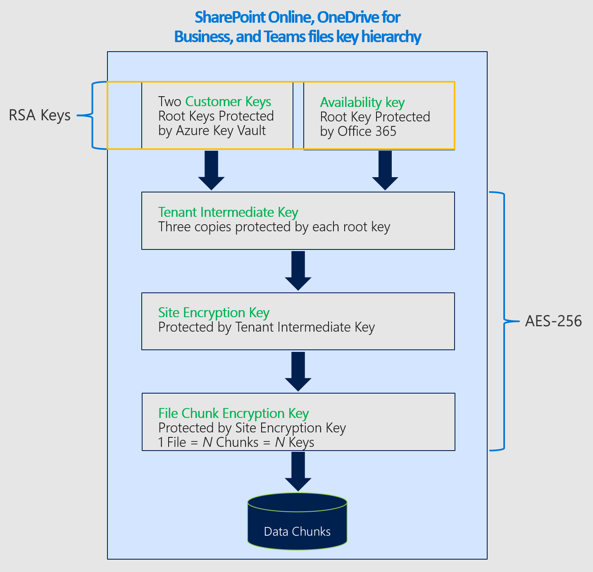

# Cifrado de servicios con clave de cliente en Office 365

Office 365 proporciona una línea base, cifrado de nivel de volumen habilitado a través de BitLocker y el administrador de claves distribuidas (DKM). Office 365 ofrece una capa agregada de cifrado en el nivel de la aplicación para el contenido. Este contenido incluye datos de los archivos de Exchange Online, Skype empresarial, SharePoint Online, OneDrive para la empresa y Microsoft Teams. Esta capa de cifrado agregada se denomina cifrado de servicio.

## Cómo funcionan juntos el cifrado de servicios, BitLocker y la clave de cliente

El cifrado del servicio garantiza que el contenido en reposo se cifre en el nivel de la aplicación. **Los datos siempre se cifran en reposo en el servicio de Office 365 con BitLocker y DKM**. Para obtener más información, consulte la información de seguridad, privacidad y cumplimiento de Office 365, y [Cómo Exchange Online protege sus secretos de correo electrónico](exchange-online-secures-email-secrets.md). La clave de cliente proporciona protección adicional contra la visualización de datos por parte de sistemas o sistemas no autorizados y complementa el cifrado de disco de BitLocker en los centros de datos de Microsoft. El cifrado del servicio no pretende impedir que el personal de Microsoft tenga acceso a los datos de los clientes. El objetivo principal es ayudar a los clientes a cumplir las obligaciones regulatorias o de cumplimiento normativo para controlar las claves raíz. Los clientes autorizan explícitamente los servicios de O365 para usar sus claves de cifrado para proporcionar servicios en la nube de valor agregado, como la exhibición de documentos electrónicos, anti-malware, contra correo no deseado, la indización de búsqueda, etc.

La clave de cliente se basa en el cifrado del servicio y le permite proporcionar y controlar las claves de cifrado. Office 365, a continuación, usa estas claves para cifrar los datos en reposo, tal como se describe en los [términos de servicios en línea (OST)](https://www.microsoft.com/licensing/product-licensing/products.aspx). La clave de cliente ayuda a cumplir las obligaciones de cumplimiento, ya que controla las claves de cifrado que Office 365 usa para cifrar y descifrar datos.
  
La clave de cliente mejora la capacidad de su organización para satisfacer las demandas de los requisitos de cumplimiento que especifican la disposición clave con el proveedor de servicios en la nube. Con la clave de cliente, usted proporciona y controla las claves de cifrado raíz de los datos de Office 365 en reposo en el nivel de la aplicación. Como resultado, debe ejercer el control sobre las claves de la organización. Si decide salir del servicio, revocará el acceso a las claves raíz de la organización. Para todos los servicios de Office 365, revocar el acceso a las claves es el primer paso en la ruta hacia la eliminación de datos. Al revocar el acceso a las claves, los datos no se puede leer en el servicio.

## La clave de cliente cifra datos en reposo en Office 365

Con las claves que proporcione, la clave de cliente de Office 365 cifra:

- Archivos de SharePoint Online, OneDrive para la empresa y Microsoft Teams.
- Archivos cargados en OneDrive para la empresa.
- Contenido del buzón de Exchange Online, incluido el contenido del cuerpo de correo electrónico, las entradas de calendario y el contenido de los datos adjuntos de correo electrónico.
- Conversaciones de texto desde Skype empresarial.

Actualmente no ofrecemos control a los clientes sobre las claves de cifrado para la difusión de reunión de Skype y las cargas de contenido de reuniones de Skype. En su lugar, este contenido se cifra junto con el resto del contenido de Office 365.

### Clave de cliente con implementaciones híbridas

La clave de cliente solo cifra datos en reposo en la nube. La clave de cliente no funciona para proteger los archivos y los buzones de correo locales. Puede cifrar los datos locales con otro método, como BitLocker.

## Información sobre la Directiva de cifrado de datos (DEP)

Una directiva de cifrado de datos define la jerarquía de cifrado para cifrar datos con cada una de las claves proporcionadas, así como la clave de disponibilidad protegida por Microsoft. Puede crear DEPs con cmdlets de PowerShell, que son diferentes para cada servicio, y asignarlos para cifrar los datos de la aplicación. Por ejemplo:

**Exchange Online y Skype empresarial** Puede crear hasta 50 DEPs por inquilino. Asocie DEPs a las claves de cliente en Azure Key Vault y, a continuación, asigne DEPs a buzones individuales. Cuando se asigna un DEP a un buzón:

- el buzón se marca para un movimiento de buzón. Según las prioridades de Office 365, tal como se describe aquí [Move Requests in the office 365 Service](https://docs.microsoft.com/exchange/mailbox-migration/office-365-migration-best-practices#move-requests-in-the-office-365-service).

- El cifrado se produce mientras se mueve el buzón. Permitir 72 horas para que el buzón se cifre con el nuevo DEP. Si los buzones no se cifran después de esperar 72 horas desde el momento en que asignó la DEP, póngase en contacto con Microsoft.

Más adelante, puede actualizar el DEP o asignar un DEP diferente al buzón de correo, como se describe en [Manage Customer Key for Office 365](customer-key-manage.md). Cada buzón de correo debe tener licencias adecuadas para poder asignar un DEP. Para obtener más información acerca de las licencias, consulte [antes de configurar la clave de cliente](customer-key-set-up.md#before-you-set-up-customer-key).

**Archivos de SharePoint Online, OneDrive para la empresa y Microsoft Teams** Si está usando la característica multigeográfica, puede crear hasta un DEP por geográfico para la organización. Puede usar claves de cliente diferentes para cada área geográfica. Si no está usando la característica multigeográfica, solo puede crear un DEP por inquilino. Cuando se asigna la DEP, el cifrado comienza automáticamente pero puede tardar algún tiempo en completarse. Consulte los detalles en [set up Customer Key for Office 365](customer-key-set-up.md).

## Dejar el servicio

La clave de cliente le ayuda a cumplir las obligaciones de cumplimiento al permitirle revocar las claves cuando abandona el servicio de Office 365. Cuando se revocan las claves como parte del abandono del servicio, se elimina la clave de disponibilidad, lo que provoca la eliminación de los datos cifrados. La eliminación de datos cifrados mitiga el riesgo de remanence de datos que es importante para satisfacer las obligaciones de seguridad y cumplimiento. Para obtener información sobre el proceso de depuración de datos y la revocación de claves, consulte [revocar claves e iniciar el proceso de ruta de purga de datos](customer-key-manage.md#revoke-your-keys-and-start-the-data-purge-path-process).

### Cifrado de cifrado usado por la clave de cliente

La clave de cliente usa una variedad de cifrados de cifrado para cifrar claves tal y como se muestra en las siguientes figuras.

#### Cifrado de cifrado usado para cifrar claves para Exchange Online y Skype empresarial

#### Cifrado de cifrado usado para cifrar claves para archivos de SharePoint Online, OneDrive para la empresa y Microsoft Teams

## Artículos relacionados

- [Configurar la clave de cliente de Office 365](customer-key-set-up.md)

- [Administrar la clave de cliente de Office 365](customer-key-manage.md)

- [Rollo o rotación de una clave de cliente o una clave de disponibilidad](customer-key-availability-key-roll.md)

- [Obtener información sobre la clave de disponibilidad](customer-key-availability-key-understand.md)

- [Caja de caja de cliente en Office 365](customer-lockbox-requests.md)

- [Cifrado de servicio de Office 365](office-365-service-encryption.md)
