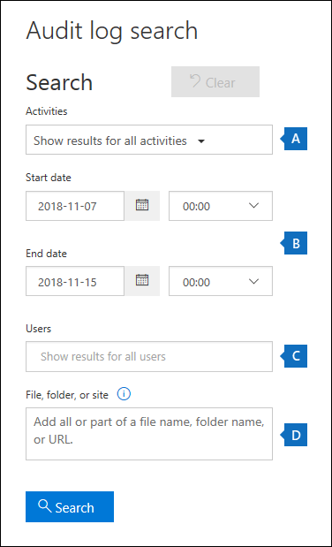
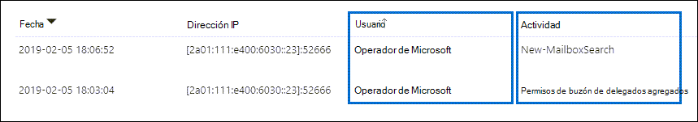

# <a name="microsoft-purview-customer-lockbox"></a>Caja de seguridad del cliente de Microsoft Purview

[!include[Purview banner](../includes/purview-rebrand-banner.md)]

En este artículo se proporcionan instrucciones de implementación y configuración para la Caja de seguridad del cliente. La Caja de seguridad del cliente admite solicitudes de acceso a datos en Exchange Online, SharePoint Online, OneDrive para la Empresa y Teams. Para recomendar soporte técnico para otros servicios, envíe una solicitud en el [Portal de comentarios](https://feedbackportal.microsoft.com).

Para ver las opciones para obtener licencias para que los usuarios se beneficien de las ofertas de Microsoft Purview, consulte la [guía de licencias de Microsoft 365 para el cumplimiento de & seguridad](/office365/servicedescriptions/microsoft-365-service-descriptions/microsoft-365-tenantlevel-services-licensing-guidance/microsoft-365-security-compliance-licensing-guidance).

La Caja de seguridad del cliente garantiza que Microsoft no puede acceder a su contenido para realizar operaciones de servicio sin su aprobación explícita. La Caja de seguridad del cliente le lleva al proceso de flujo de trabajo de aprobación que Microsoft usa para asegurarse de que solo las solicitudes autorizadas permiten el acceso al contenido. Para más información sobre el proceso de flujo de trabajo de Microsoft, consulte [Administración de acceso con privilegios](privileged-access-management-solution-overview.md).

En ocasiones, los ingenieros de Microsoft ayudan a solucionar los problemas que surgen con el servicio. Por lo general, los ingenieros corrigen los problemas con amplias herramientas de telemetría y depuración que Microsoft tiene para sus servicios. Sin embargo, algunos casos requieren que un ingeniero de Microsoft acceda a su contenido para determinar la causa principal y corregir el problema. Caja de seguridad del cliente requiere que el ingeniero le solicite acceso como paso final en el flujo de trabajo de aprobación. Esto le ofrece la opción de aprobar o denegar la solicitud para su organización y proporcionar control de acceso directo al contenido.

## <a name="customer-lockbox-overview-video"></a>Vídeo de introducción a la Caja de seguridad del cliente

> [!VIDEO https://www.microsoft.com/videoplayer/embed/8fecf10b-1f03-4849-8b67-76d3d2a43f26?autoplay=false]

## <a name="customer-lockbox-workflow"></a>Flujo de trabajo de Caja de seguridad del cliente

Estos pasos describen el flujo de trabajo típico cuando un ingeniero de Microsoft inicia una solicitud de caja de seguridad del cliente:

1. Alguien de una organización experimenta un problema con su buzón de correo de Microsoft 365.

2. Después de que el usuario realice los pasos para solucionar el problema, pero no pueda corregirlo, abre una solicitud de soporte con el Soporte técnico de Microsoft.

3. Un ingeniero de soporte técnico de Microsoft revisa la solicitud de servicio y determina la necesidad de acceder al inquilino de la organización para reparar el problema.

4. El ingeniero de soporte técnico de Microsoft inicia sesión en la herramienta de solicitud de Caja de seguridad del cliente y realiza una solicitud de acceso a datos que incluye el nombre del espacio empresarial de la organización, el número de la solicitud de servicio y el tiempo estimado que el ingeniero necesita tener acceso a los datos.

5. Después de que un administrador de Soporte técnico de Microsoft apruebe la solicitud, la Caja de seguridad del cliente envía al aprobador designado en la organización una notificación por correo electrónico sobre la solicitud de acceso pendiente de Microsoft.

    

   Cualquier persona a la que se le asigne el rol de [administrador de aprobador de acceso a la caja de seguridad del cliente](/office365/admin/add-users/about-admin-roles) en Centro de administración de Microsoft 365 puede aprobar las solicitudes de caja de seguridad del cliente.

6. El aprobador inicia sesión en el Centro de administración de Microsoft 365 y aprueba la solicitud. Este paso desencadena la creación de un registro de auditoría disponible al buscar en el registro de auditoría. Para obtener más información, consulte [Auditoría de solicitudes de caja de seguridad del cliente](#auditing-customer-lockbox-requests).

   Si el cliente rechaza la solicitud o no la aprueba en un plazo de 12 horas, la solicitud expira y no se concede acceso al ingeniero de Microsoft.

   > [!IMPORTANT]
   > Microsoft no incluye ningún vínculo en las notificaciones de correo electrónico de la Caja de seguridad del cliente que requieran que inicie sesión en Office 365.

7. Una vez que el aprobador de la organización aprueba la solicitud, el ingeniero de Microsoft recibe el mensaje de aprobación, inicia sesión en el inquilino y corrige el problema del cliente. Los ingenieros de Microsoft tienen la duración solicitada para corregir el problema, después de lo cual el acceso se revoca automáticamente.

> [!NOTE]
> Todas las acciones realizadas por un ingeniero de Microsoft se registran en el registro de auditoría. Puede buscar y revisar estos registros de auditoría.

## <a name="turn-customer-lockbox-requests-on-or-off"></a>Activar o desactivar las solicitudes de caja de seguridad del cliente

Puede activar los controles de Caja de seguridad del cliente en el Centro de administración de Microsoft 365. Al activar la caja de seguridad del cliente, Microsoft debe obtener la aprobación de su organización antes de acceder a cualquiera de los contenidos del inquilino.

1. Con una cuenta profesional o educativa que tenga asignado el rol de **aprobador de acceso a la caja de seguridad del cliente** o el administrador global, vaya a [https://admin.microsoft.com](https://admin.microsoft.com) e inicie sesión.

2. Elija **Configuración** >  **Org Configuración** >  **Seguridad & privacidad**.

3. Seleccione **Seguridad & privacidad** y, a continuación, seleccione **Caja de seguridad del cliente** en la columna de la izquierda. Active la casilla **Requerir aprobación para todas las solicitudes de acceso a datos** y guarde los cambios para activar la característica.

    

## <a name="approve-or-deny-a-customer-lockbox-request"></a>Aprobar o denegar una solicitud de Caja de seguridad del cliente

1. Con una cuenta profesional o educativa que tenga asignado el rol de **aprobador de acceso a la caja de seguridad del cliente** o el administrador global, vaya a [https://admin.microsoft.com](https://admin.microsoft.com) e inicie sesión.

2. Elija **Soporte técnico > Solicitudes de caja de seguridad del cliente**.

    

    Se muestra una lista de solicitudes de caja de seguridad del cliente.

    

3. Seleccione una solicitud de caja de seguridad del cliente y, a continuación, elija **Aprobar** o **Denegar**.

    

    Se muestra un mensaje de confirmación sobre la aprobación de la solicitud caja de seguridad del cliente.

    

> [!NOTE]
> Use el cmdlet Set-AccessToCustomerDataRequest para aprobar, denegar o cancelar solicitudes de caja de seguridad del cliente de Microsoft Purview que controlan el acceso a los datos por parte de los ingenieros de soporte técnico de Microsoft. Para obtener más información, vea [Set-AccessToCustomerDataRequest](/powershell/module/exchange/set-accesstocustomerdatarequest).

## <a name="auditing-customer-lockbox-requests"></a>Solicitudes de auditoría de caja de seguridad del cliente

Los registros de auditoría correspondientes a las solicitudes de caja de seguridad del cliente se registran en el registro de auditoría de Microsoft 365. Puede acceder a estos registros mediante la [herramienta de búsqueda de registros de auditoría](search-the-audit-log-in-security-and-compliance.md) en el portal de cumplimiento de Microsoft Purview. Las acciones relacionadas con la aceptación o denegación de una solicitud de caja de seguridad del cliente y las acciones realizadas por ingenieros de Microsoft (cuando se aprueban las solicitudes de acceso) también se registran en el registro de auditoría. Puede buscar y revisar estos registros de auditoría.

### <a name="search-the-audit-log-for-activity-related-to-customer-lockbox-requests"></a>Busque en el registro de auditoría la actividad relacionada con las solicitudes de caja de seguridad del cliente.

Antes de poder usar el registro de auditoría para realizar un seguimiento de las solicitudes de la Caja de seguridad del cliente, hay algunos pasos que debe seguir para configurar el registro de auditoría, incluida la asignación de permisos para buscar en el registro de auditoría. Para obtener más información, vea [Configurar Microsoft Purview Audit (Estándar).](set-up-basic-audit.md) Una vez completada la instalación, siga estos pasos para crear una consulta de búsqueda de registros de auditoría para devolver registros de auditoría relacionados con la caja de seguridad del cliente:

1. Ve a <https://compliance.microsoft.com>.
  
2. Inicie sesión con una cuenta a la que se hayan asignado los permisos adecuados para buscar en el registro de auditoría.

3. En el panel izquierdo del centro de cumplimiento, elija **Auditar**.

    Se muestra la pestaña **Buscar** de la página **Auditoría** .

    
  
4. Configurar los siguientes criterios de búsqueda: 

   1. **Fecha de inicio** y **Fecha de finalización**. Seleccione un intervalo de fecha y hora para mostrar los eventos que han sucedido en ese período.  

   2. **Actividades**. Deje este campo en blanco para que la búsqueda devuelva registros de auditoría para todas las actividades. Esto es necesario para devolver los registros de auditoría relacionados con las solicitudes de caja de seguridad del cliente y la actividad correspondiente realizada por los ingenieros de Microsoft.

   3. Usuarios Deje este campo en blanco.

   4. **Archivo, carpeta o sitio**. Deje este campo en blanco.

5. Haga clic en **Búsqueda** para ejecutar la búsqueda mediante sus criterios de búsqueda. 

    Los resultados de la búsqueda se muestran después de unos instantes. Se agregarán más resultados de búsqueda a la página hasta que se complete la búsqueda.

6. Haga clic en el encabezado de la columna **Actividad** para ordenar los resultados alfabéticamente en función de los valores de la columna **Actividad** .

7. Desplácese hacia abajo y busque registros de auditoría con una actividad de **Set-AccessToCustomerDataRequest**. Los registros con esta actividad están relacionados con un aprobador de su organización que aprueba o deniega una solicitud de caja de seguridad del cliente.

8. Como alternativa, haga clic en el encabezado de la columna **Usuario** para ordenar los resultados alfabéticamente mediante los valores de la columna **Usuario** . Busque el valor de **Operador de Microsoft**, que indica las actividades realizadas por un ingeniero de Microsoft en respuesta a una solicitud de caja de seguridad de cliente aprobada. La columna **Actividad** muestra la acción realizada por el ingeniero.

      

9. En la lista de resultados, haga clic en un registro de auditoría para mostrarlo.

### <a name="export-the-audit-log-search-results"></a>Exportación de los resultados de la búsqueda de registros de auditoría

También puede exportar los resultados de la búsqueda de registros de auditoría a un archivo CSV y, a continuación, abrir el archivo en Excel para usar las funcionalidades de filtrado y ordenación para facilitar la búsqueda y visualización de registros de auditoría relacionados con una solicitud de acceso de caja de seguridad del cliente.

Para exportar registros de auditoría, use los pasos anteriores para buscar en el registro de auditoría. Una vez completada la búsqueda, seleccione **Exportar > Descargar todos los resultados** en la parte superior de la página de resultados de búsqueda. Una vez completado el proceso de exportación, puede descargar el archivo CSV en el equipo local. Para obtener instrucciones más detalladas, consulte [Exportación, configuración y visualización de registros de auditoría](export-view-audit-log-records.md).

Después de descargar el archivo, puede abrirlo en Excel y, a continuación, filtrar por la columna **Operaciones** para mostrar los registros de auditoría de las actividades **Set-AccessToCustomerDataRequest**. También puede filtrar por la columna **UserIds** (con el valor **Operador de Microsoft**) para mostrar los registros de auditoría de las actividades realizadas por ingenieros de Microsoft.

> [!NOTE]
> Al ver los registros de auditoría en el archivo CSV, se incluye información adicional en la columna **AuditData** . La información de esta columna está contenida en un objeto JSON, que contiene varias propiedades que se configuran como pares *property:value* separados por comas. Puede usar la característica de transformación JSON en el Editor de Power Query de Excel para dividir cada propiedad del objeto JSON de la columna **AuditData** en varias columnas para que cada propiedad tenga su propia columna. Esto facilita la interpretación de esta información. Para obtener instrucciones detalladas, consulte [Formatear el registro de auditoría exportado mediante el Editor de Power Query](export-view-audit-log-records.md#step-2-format-the-exported-audit-log-using-the-power-query-editor).

### <a name="use-powershell-to-search-and-export-audit-records"></a>Uso de PowerShell para buscar y exportar registros de auditoría

Una alternativa al uso de la herramienta de búsqueda de auditoría en el portal de cumplimiento de Microsoft Purview es ejecutar el cmdlet [Search-UnifiedAuditLog](/powershell/module/exchange/search-unifiedauditlog) en Exchange Online PowerShell. Una ventaja del uso de PowerShell es que puede buscar específicamente actividades **set-accessToCustomerDataRequest** o actividades realizadas por ingenieros de Microsoft relacionadas con una solicitud de caja de seguridad del cliente.

Después de [conectarse a Exchange Online PowerShell](/powershell/exchange/connect-to-exchange-online-powershell), ejecute uno de los siguientes comandos. Reemplace los marcadores de posición por un intervalo de fechas específico.

Búsqueda de `Set-AccessToCustomerDataRequest` actividades

```powershell
Search-UnifiedAuditLog -StartDate xx/xx/xxxx -EndDate xx/xx/xxxx -Operations Set-AccessToCustomerDataRequest
```

Búsqueda de actividades realizadas por ingenieros de Microsoft

```powershell
Search-UnifiedAuditLog -StartDate xx/xx/xxxx -EndDate xx/xx/xxxx -UserIds "Microsoft Operator"
```

Para obtener más información y ejemplos, consulte [Uso de PowerShell para buscar y exportar registros de auditoría](export-view-audit-log-records.md#use-powershell-to-search-and-export-audit-log-records).

También hemos proporcionado un script de PowerShell que puede usar para buscar en el registro de auditoría y exportar los resultados a un archivo CSV. Para obtener más información, consulte [Uso de un script de PowerShell para buscar en el registro de auditoría](audit-log-search-script.md).

### <a name="audit-record-for-a-customer-lockbox-request"></a>Registro de auditoría de una solicitud de caja de seguridad del cliente

Cuando una persona de su organización aprueba o deniega una solicitud de Caja de seguridad del cliente, el registro de auditoría se registra en el registro de auditoría contiene la siguiente información.

| Propiedad de registro de auditoría| Descripción|
|:---------- |:----------|
| Fecha       | La fecha y la hora en que se ha aprobado o denegado la solicitud de Caja de seguridad del cliente.
| Dirección IP | La dirección IP del equipo en el que el aprobador ha aprobado o denegado una solicitud. |
| Usuario       | La cuenta de servicio BOXServiceAccount@\[customerforest.prod.outlook.com\].            |
| Actividad   | Set-AccessToCustomerDataRequest; esta es la actividad de auditoría que se registra cuando usted aprueba o deniega una solicitud de Caja de seguridad del cliente.                                |
| Item       | Guid de la solicitud de caja de seguridad del cliente                             |

En la captura de pantalla siguiente se muestra un ejemplo de un registro de auditoría que corresponde a una solicitud de caja de seguridad de cliente aprobada. Si se deniega una solicitud caja de seguridad del cliente, el valor del `ApprovalDecision` parámetro sería `Deny`.


### <a name="audit-record-for-an-action-performed-by-a-microsoft-engineer"></a>Registro de auditoría de una acción realizada por un ingeniero de Microsoft

Las acciones que ha realizado un ingeniero de Microsoft después de aprobar una solicitud de Caja de seguridad del cliente (y que pueden tener acceso al contenido del cliente) se registran en el registro de auditoría. Estos registros contienen la siguiente información.

| Propiedad de registro de auditoría| Descripción|
|:---------- |:----------|
| Fecha       | Fecha y hora en que se realizó la acción. El tiempo que se realizó esta acción será dentro de las 4 horas posteriores a la aprobación de la solicitud de caja de seguridad del cliente.              |
| Dirección IP | La dirección IP del ingeniero de Microsoft. |
| Usuario       | Operador de Microsoft; Este valor indica que el registro está relacionado con una solicitud de caja de seguridad del cliente.                                  |
| Actividad   | Nombre de la actividad realizada por el ingeniero de Microsoft.|
| Item       | \<empty\>                                             |

## <a name="frequently-asked-questions"></a>Preguntas más frecuentes

### <a name="which-microsoft-365-services-does-customer-lockbox-apply-to"></a>¿A qué servicios Microsoft 365 se aplica La caja de seguridad del cliente?

La Caja de seguridad del cliente se admite actualmente en Exchange Online, SharePoint Online, OneDrive para la Empresa y Teams.

### <a name="is-customer-lockbox-available-to-all-customers"></a>¿Está disponible la caja de seguridad del cliente para todos los clientes?

La caja de seguridad del cliente se incluye con las suscripciones de Microsoft 365 o Office 365 E5 y se puede agregar a otros planes con una suscripción de Information Protection y cumplimiento o un complemento de cumplimiento avanzado. Consulte [Planes y precios](https://products.office.com/business/office-365-enterprise-e5-business-software) para obtener más información.

### <a name="what-is-customer-content"></a>¿Qué es el contenido del cliente?

El contenido del cliente son los datos creados por los usuarios de Microsoft 365 servicios y aplicaciones. Estos son algunos ejemplos de contenido de cliente:

- Cuerpo o datos adjuntos de correo electrónico

- Página de contenido del sitio de SharePoint

- Información del cuerpo de un archivo de SharePoint

- Skype Empresarial cuerpo del archivo de presentación

- Mensajes instantáneos (MI) o conversaciones de voz

- Texto escrito en Teams chats y canales de Teams, por ejemplo, chats 1:1, chats de grupo, canales compartidos, canales privados y chat de reunión

- Otros datos pegados en Teams subprocesos de chat, como fragmentos de código, imágenes, mensajes de audio y vídeo y vínculos

- Datos de aplicaciones y bots en chats Teams y canales de Teams

- fuente de actividad de Teams

- Teams grabaciones y transcripciones de reuniones

- Correo de voz

- Archivos publicados en Teams chats y canales de Teams

- Blob generado por el cliente o datos de almacenamiento estructurado (por ejemplo, Contenedores SQL)

- Información de seguridad propiedad del cliente (por ejemplo, certificados, claves de cifrado y contraseñas)

- Inferencias y todas las inferencias posteriores, si el contenido del cliente permanece

Para obtener más información sobre el contenido del cliente en Office 365, consulte el [Centro de confianza de Office 365](https://products.office.com/business/office-365-trust-center-privacy/).

### <a name="who-is-notified-when-there-is-a-request-to-access-my-content"></a>Quién se notifica cuando hay una solicitud de acceso a mi contenido?

Se notifica a los administradores globales y a cualquiera que tenga asignado el rol de administrador de aprobador de acceso de caja de seguridad del cliente. Estos también son los mismos usuarios que pueden aprobar las solicitudes de caja de seguridad del cliente.

### <a name="who-can-approve-or-reject-these-requests-in-my-organization"></a>Quién puede aprobar o rechazar estas solicitudes en mi organización?

Los administradores globales y cualquier persona a la que se haya asignado el rol de administrador de aprobador de acceso de caja de seguridad del cliente pueden aprobar las solicitudes de caja de seguridad del cliente. Los clientes controlan estas asignaciones de roles en sus organizaciones.

### <a name="how-do-i-opt-in-to-customer-lockbox"></a>Cómo participar en la caja de seguridad del cliente?

Un administrador global puede habilitar y configurar la Caja de seguridad del cliente en el Centro de administración de Microsoft 365.

### <a name="if-i-approve-a-customer-lockbox-request-what-can-the-engineer-do-and-how-will-i-know-what-the-microsoft-engineer-did"></a>Si apruebo una solicitud de caja de seguridad del cliente, ¿qué puede hacer el ingeniero y cómo sabré lo que hizo el ingeniero de Microsoft?

Después de aprobar una solicitud de caja de seguridad del cliente, el ingeniero de Microsoft concedió estos privilegios necesarios para acceder al contenido del cliente mediante cmdlets aprobados previamente. Las acciones realizadas por los ingenieros de Microsoft en respuesta a las solicitudes de caja de seguridad del cliente se registran y se puede acceder a ellas en el registro de auditoría del Centro de cumplimiento de seguridad &.

### <a name="how-do-i-know-that-microsoft-follows-the-approval-process"></a>Cómo saber que Microsoft sigue el proceso de aprobación?

Puede hacer referencia cruzada a las notificaciones de aprobación de correo electrónico enviadas a administradores y aprobadores de su organización con el historial de solicitudes de caja de seguridad del cliente en el [Centro de administración de Microsoft 365](https://go.microsoft.com/fwlink/p/?linkid=2024339).

La caja de seguridad del cliente se incluye en el último [informe de auditoría de SOC 1 SSAE 16](https://servicetrust.microsoft.com/ViewPage/MSComplianceGuide?command=Download&downloadType=Document&downloadId=91592749-e86a-43ac-801e-121382614681&docTab=4ce99610-c9c0-11e7-8c2c-f908a777fa4d_SOC%20%2F%20SSAE%2016%20Reports). Para obtener más información, puede encontrar los informes más recientes en el [Portal de confianza de servicios de Microsoft](https://servicetrust.microsoft.com/ViewPage/MSComplianceGuide?command=Download&downloadType=Document&downloadId=91592749-e86a-43ac-801e-121382614681&docTab=4ce99610-c9c0-11e7-8c2c-f908a777fa4d_SOC%20%2F%20SSAE%2016%20Reports).

### <a name="can-microsoft-modify-the-list-of-approvers-for-my-tenant-if-not-how-is-it-prevented"></a>¿Puede Microsoft modificar la lista de aprobadores para mi inquilino? Si no es así, ¿cómo se evita?

Solo un administrador global de la organización puede especificar quién puede aprobar las solicitudes de caja de seguridad del cliente. Esto significa que solo los miembros del grupo de Administrador global de Azure Active Directory pueden especificar quién puede aprobar la solicitud. La pertenencia al grupo de Administrador global en Azure Active Directory solo la administra su organización.

### <a name="what-if-i-need-more-information-about-a-content-access-request-to-approve-it"></a>¿Qué ocurre si necesito más información sobre una solicitud de acceso a contenido para aprobarla?

Cada solicitud de Caja de seguridad del cliente contiene un número de solicitud de servicio Microsoft 365. Puede ponerse en contacto con Soporte técnico de Microsoft y hacer referencia a este número de servicio para obtener más información sobre la solicitud.

### <a name="when-a-customer-lockbox-request-is-approved-how-long-are-the-permissions-valid"></a>Cuando se aprueba una solicitud de Caja de seguridad del cliente, ¿cuánto tiempo son válidos los permisos?

Actualmente, el período máximo permitido para los permisos de acceso concedidos al ingeniero del equipo de servicio es de 4 horas. El ingeniero también puede solicitar un período más corto.

### <a name="how-can-i-get-a-history-of-all-customer-lockbox-requests"></a>¿Cómo puedo obtener un historial de todas las solicitudes de caja de seguridad del cliente?

Todas las solicitudes de caja de seguridad del cliente se ven en el [Centro de administración de Microsoft 365](https://go.microsoft.com/fwlink/p/?linkid=2024339).

### <a name="how-do-i-correlate-the-content-access-requests-with-the-related-audit-logs"></a>Cómo correlacionar las solicitudes de acceso al contenido con los registros de auditoría relacionados?

La fuente de actividad del Centro de cumplimiento contiene las actividades de registro de la Caja de seguridad del cliente. Los clientes pueden hacer referencia cruzada a las actividades de registro de caja de seguridad del cliente de la fuente de actividad con respecto a la solicitud de correo electrónico que reciben.

### <a name="what-happens-when-a-customer-doesnt-respond-to-a-customer-lockbox-request"></a>¿Qué ocurre cuando un cliente no responde a una solicitud de caja de seguridad del cliente?

Las solicitudes de Caja de seguridad del cliente tienen una duración predeterminada de 12 horas. Si no responde a una solicitud en un plazo de 12 horas, la solicitud expira.

### <a name="what-does-microsoft-do-when-a-customer-rejects-a-customer-lockbox-request"></a>¿Qué hace Microsoft cuando un cliente rechaza una solicitud de caja de seguridad del cliente?

Si un cliente rechaza una solicitud de Caja de seguridad del cliente, no se produce ningún acceso al contenido del cliente. Si un usuario de su organización sigue experimentando un problema de servicio que requiere que Microsoft acceda al contenido del cliente para resolver el problema, es posible que el problema del servicio persista y Microsoft lo informará al usuario.

### <a name="how-do-i-set-up-alerts-whenever-a-request-has-been-approved"></a>Cómo configurar alertas cada vez que se haya aprobado una solicitud?

No hay ninguna opción integrada para alertar a los administradores. Sin embargo, los administradores pueden configurar alertas mediante [Microsoft Defender for Cloud Apps](/cloud-app-security/getting-started-with-cloud-app-security#to-create-policies).

### <a name="does-customer-lockbox-protect-against-data-requests-from-law-enforcement-agencies-or-other-third-parties"></a>¿Protege la caja de seguridad del cliente frente a las solicitudes de datos de las agencias de cumplimiento de la ley u otros terceros?

No. Microsoft toma en serio las solicitudes de terceros para los datos de los clientes. Como proveedor de servicios en la nube, Microsoft siempre aboga por la privacidad de los datos de los clientes. En el caso de que obtengamos una citación, Microsoft siempre intenta redirigir al tercero al cliente para obtener la información. (Lea el blog de Brad Smith: [Proteger los datos de los clientes frente al fisgoneo del gobierno](https://blogs.microsoft.com/blog/2013/12/04/protecting-customer-data-from-government-snooping/)). Publicamos periódicamente [información detallada](https://www.microsoft.com/corporate-responsibility/lerr) sobre las solicitudes de cumplimiento de la ley que Microsoft recibe.

Para obtener más información, consulte el [Centro de confianza de Microsoft](https://www.microsoft.com/trustcenter/default.aspx) sobre solicitudes de datos de terceros y la sección "Divulgación de datos del cliente" en los [Términos de los Servicios en línea](https://www.microsoft.com/Licensing/product-licensing/products.aspx) .

### <a name="how-does-microsoft-ensure-that-a-member-of-its-staff-doesnt-have-standing-access-to-customer-content-in-office-365-applications"></a>¿Cómo garantiza Microsoft que un miembro de su personal no tenga acceso permanente al contenido del cliente en Office 365 aplicaciones?

Microsoft implementa amplias medidas preventivas a través de sistemas de control de acceso y medidas de detective para identificar y abordar los intentos de eludir estos sistemas de control de acceso. Microsoft 365 funciona con los principios de privilegios mínimos y acceso Just-In-Time. Por lo tanto, ningún personal de Microsoft tiene permiso para acceder al contenido del cliente de forma continuada. Si se concede el permiso, es por un tiempo limitado.

Microsoft 365 usa un sistema de control de acceso denominado *Caja de seguridad* para procesar solicitudes de permisos que conceden la capacidad de realizar funciones operativas y administrativas dentro del servicio. Un operador debe solicitar acceso al contenido del cliente mediante Lockbox, lo que requiere que una segunda persona tome medidas en la solicitud (por ejemplo, aprobarla) antes de conceder el acceso. Esa segunda persona no puede ser el solicitante y debe designarse para aprobar el acceso al contenido del cliente. Solo si se aprueba la solicitud, el operador adquiere acceso temporal al contenido del cliente. Una vez expirado el período de elevación, Lockbox revoca el acceso.

Consulte los [Términos de los Servicios en línea](https://www.microsoft.com/licensing/product-licensing/products) para obtener más información sobre las prácticas de seguridad generales de Microsoft.

### <a name="under-what-circumstances-do-microsoft-engineers-need-access-to-my-content"></a>¿En qué circunstancias los ingenieros de Microsoft necesitan acceso a mi contenido?

El escenario más común en el que los ingenieros de Microsoft necesitan acceder al contenido del cliente es cuando el cliente realiza una solicitud de soporte técnico que requiere acceso para solucionar problemas. Un principio fundamental de Microsoft 365 es que el servicio funciona sin el acceso de Microsoft al contenido del cliente. Casi todas las operaciones de servicio realizadas por Microsoft están totalmente automatizadas y la participación humana está muy controlada y abstraída del contenido del cliente. El objetivo de Microsoft 365 es acceder al contenido del cliente para admitir el servicio no es necesario hasta que el cliente apruebe una solicitud específica de acceso de Microsoft.

### <a name="i-already-thought-my-data-was-secure-with-the-microsoft-cloud-so-why-do-i-need-customer-lockbox"></a>Ya pensé que mis datos eran seguros con la nube de Microsoft, por lo que ¿por qué necesito la caja de seguridad del cliente?

La Caja de seguridad del cliente proporciona un nivel de control adicional al ofrecer a los clientes la capacidad de conceder autorización de acceso explícita para las operaciones de servicio. Al demostrar que se aplican procedimientos para la autorización explícita de acceso a datos, la caja de seguridad del cliente también ayuda a los clientes a cumplir ciertas obligaciones de cumplimiento, como HIPAA y FEDRAMP.
