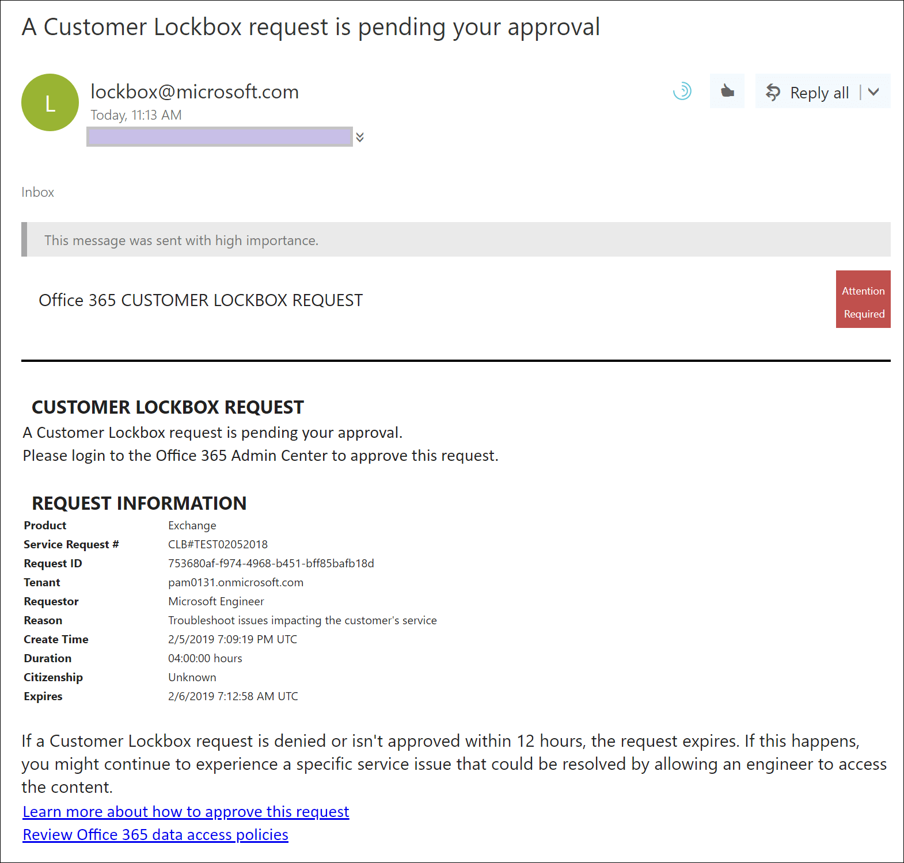
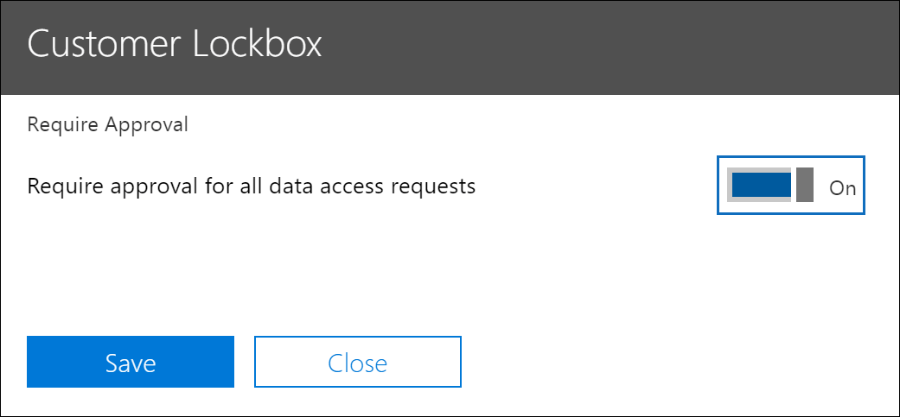

# Caja de caja de cliente en Office 365Customer Lockbox in Office 365

En este artículo se proporcionan instrucciones de implementación y configuración para caja de caja de clientes.This article provides deployment and configuration guidance for Customer Lockbox. La caja de seguridad del cliente admite solicitudes para acceder a datos en Exchange Online, SharePoint Online y OneDrive para la empresa.Customer Lockbox supports requests to access data in Exchange Online, SharePoint Online, and OneDrive for Business. Para recomendar la compatibilidad con otros servicios, envíe una solicitud a [UserVoice de Office 365](https://office365.uservoice.com/).To recommend support for other services, please submit a request at [Office 365 UserVoice](https://office365.uservoice.com/).

Para ver las opciones de licencia de sus usuarios para beneficiarse de las ofertas de cumplimiento de Microsoft 365, incluida esta, a partir del 1 de abril de 2020, consulte [microsoft 365 Licensing Guidance for security & Compliance](https://aka.ms/ComplianceSD).To see the options for licensing your users to benefit from Microsoft 365 compliance offerings, including this one, as of April 1, 2020, see the [Microsoft 365 licensing guidance for security & compliance](https://aka.ms/ComplianceSD).

La caja de caja del cliente garantiza que Microsoft no pueda obtener acceso al contenido para realizar una operación de servicio sin su aprobación explícita.Customer Lockbox ensures that Microsoft cannot access your content to perform a service operation without your explicit approval. Lockbox del cliente le ofrece el flujo de trabajo de aprobación para las solicitudes de acceso al contenido.Customer Lockbox brings you into the approval workflow for requests to access your content.

Ocasionalmente, los ingenieros de Microsoft ayudan a solucionar problemas y solucionar problemas notificados por los clientes en el proceso de soporte.Occasionally, Microsoft engineers help troubleshoot and fix customer reported issues in the support process. Normalmente, los problemas se arreglan mediante amplias herramientas de telemetría y depuración que Microsoft pone a su servicio.Usually, issues are fixed through extensive telemetry and debugging tools Microsoft has in place for its services. Sin embargo, en algunos casos es necesario que un ingeniero de Microsoft tenga acceso al contenido del cliente para determinar la causa raíz y corregir el problema.However, some cases require a Microsoft engineer to access customer content to determine the root cause and fix the issue. La caja de caja del cliente requiere que el ingeniero solicite el acceso del cliente como paso final en el flujo de trabajo de aprobación.Customer Lockbox requires the engineer to request access from the customer as a final step in the approval workflow. Esto proporciona a las organizaciones la opción de aprobar o denegar estas solicitudes y proporcionar un control de acceso directo al cliente.This gives organizations the option to approve or deny these requests, and provide direct-access control to the customer.

### Vídeo de información general del Lockbox del clienteCustomer Lockbox overview video

> [!VIDEO https://www.microsoft.com/videoplayer/embed/8fecf10b-1f03-4849-8b67-76d3d2a43f26?autoplay=false]

## Flujo de trabajo del Lockbox del clienteCustomer Lockbox workflow

Los pasos siguientes describen el flujo de trabajo típico cuando un ingeniero de Microsoft inicia una solicitud de caja de caja del cliente:The following steps outline the typical workflow when a Microsoft engineer initiates a Customer Lockbox request:

1. Alguien de una organización experimenta un problema con su buzón de correo de Microsoft 365.Someone at an organization experiences an issue with their Microsoft 365 mailbox.

2. Una vez que el usuario solucione el problema, pero no puede corregirlo, abrirá una solicitud de soporte técnico con soporte técnico de Microsoft.After the user troubleshoots the issue, but can't fix it, they open a support request with Microsoft Support.

3. Un ingeniero de soporte técnico de Microsoft revisa la solicitud de servicio y determina la necesidad de tener acceso al inquilino de la organización para reparar el problema en Exchange Online.A Microsoft support engineer reviews the service request and determines a need to access the organization's tenant to repair the issue in Exchange Online.

4. El ingeniero de soporte técnico de Microsoft inicia sesión en la herramienta de solicitud de caja de herramientas del cliente y realiza una solicitud de acceso a datos que incluye el nombre del espacio empresarial de la organización, el número de solicitud de servicio y el tiempo estimado que necesita el ingeniero para obtener acceso a los datos.The Microsoft support engineer logs into the Customer Lockbox request tool and makes a data access request that includes the organization's tenant name, service request number, and the estimated time the engineer needs access to the data.

5. Una vez que un administrador de soporte de Microsoft aprueba la solicitud, el Lockbox del cliente envía al aprobador designado en la organización una notificación de correo electrónico sobre la solicitud de acceso pendiente de Microsoft.After a Microsoft Support manager approves the request, Customer Lockbox sends the designated approver at the organization an email notification about the pending access request from Microsoft.

    

   Cualquier usuario que tenga asignado el rol de administrador [aprobador de acceso de Lockbox de cliente](https://docs.microsoft.com/office365/admin/add-users/about-admin-roles) en el centro de administración de Microsoft 365 puede aprobar solicitudes de caja de caja de cliente.Anyone who is assigned the [Customer Lockbox access approver](https://docs.microsoft.com/office365/admin/add-users/about-admin-roles) admin role in Microsoft 365 admin center can approve Customer Lockbox requests.

6. El aprobador inicia sesión en el centro de administración de 365 de Microsoft y aprueba la solicitud.The approver signs in to the Microsoft 365 admin center and approves the request. Este paso desencadena la creación de un registro de auditoría disponible mediante la búsqueda en el registro de auditoría.This step triggers the creation of an audit record available by searching the audit log. Para obtener más información, consulte [Auditing Customer Lockbox requests](#auditing-customer-lockbox-requests).For more information, see [Auditing Customer Lockbox requests](#auditing-customer-lockbox-requests).

   Si el cliente rechaza la solicitud o no aprueba la solicitud en un plazo de 12 horas, la solicitud expira y no se concede acceso al ingeniero de Microsoft.If the customer rejects the request or doesn't approve the request within 12 hours, the request expires and no access is granted to the Microsoft engineer.

   > [!IMPORTANT]
   > Microsoft no incluye ningún vínculo en las notificaciones de correo electrónico de caja del cliente que requieran que inicie sesión en Office 365.Microsoft does not include any links in Customer Lockbox email notifications requiring you to sign in to Office 365.

7. Una vez que el aprobador de la organización aprueba la solicitud, el ingeniero de Microsoft recibe el mensaje de aprobación, inicia sesión en el inquilino de Exchange Online y corrige el problema del cliente.After the approver from the organization approves the request, the Microsoft engineer receives the approval message, logs into the tenant in Exchange Online, and fixes the customer's issue. Los ingenieros de Microsoft tienen la duración solicitada para solucionar el problema después de que el acceso se haya revocado automáticamente.Microsoft engineers have the requested duration to fix the issue after which the access is automatically revoked.

> [!NOTE]
> Todas las acciones realizadas por un ingeniero de Microsoft se registran en el registro de auditoría.All actions performed by a Microsoft engineer are logged in the audit log. Puede buscar y revisar estos registros de auditoría.You can search for and review these audit records.

## Activar o desactivar las solicitudes de caja de caja de clientesTurn Customer Lockbox requests on or off

Puede activar los controles de caja de caja del cliente en el centro de administración de Microsoft 365.You can turn on Customer Lockbox controls in the Microsoft 365 admin center. Al activar caja de caja de clientes, Microsoft debe obtener la aprobación de su organización antes de obtener acceso al contenido de su espacio empresarial.When you turn on Customer Lockbox, Microsoft must obtain your organization's approval before accessing any of your tenant's content.

1. Con una cuenta profesional o educativa que tenga asignado el rol de **aprobador de acceso de Lockbox del cliente** o el administrador global, vaya a [https://admin.microsoft.com](https://admin.microsoft.com) e inicie sesión.Using a work or school account that has either the global administrator or the **Customer Lockbox access approver** role assigned, go to [https://admin.microsoft.com](https://admin.microsoft.com) and sign in.

2. Elija **configuración > la configuración**de la organización.Choose **Settings > Org Settings**.

3. Seleccione **servicios**  >  de**Lockbox de cliente**de servicios  >  **Edit**y, a continuación, mueva el botón de alternancia a **activado** o **desactivado** para activar o desactivar la característica.Select **Services** > **Customer Lockbox** > **Edit**, and then move the toggle to **On** or **Off** to turn the feature on or off.

    

## Aprobar o denegar una solicitud de caja de caja del clienteApprove or deny a Customer Lockbox request

1. Con una cuenta profesional o educativa que tenga asignado el rol de **aprobador de acceso de Lockbox del cliente** o el administrador global, vaya a [https://admin.microsoft.com](https://admin.microsoft.com) e inicie sesión.Using a work or school account that has either the global administrator or the **Customer Lockbox access approver** role assigned, go to [https://admin.microsoft.com](https://admin.microsoft.com) and sign in.

2. Elija **admitir > solicitudes de caja de caja del cliente**.Choose **Support > Customer Lockbox Requests**.

    

    Se muestra una lista de solicitudes de caja de caja de clientes.A list of Customer Lockbox requests displays.

    

3. Seleccione una solicitud de caja de caja de cliente y, a continuación, elija **aprobar** o **denegar**.Select a Customer Lockbox request, and then choose **Approve** or **Deny**.

    

    Se muestra un mensaje de confirmación sobre la aprobación de la solicitud de caja de trabajo del cliente.A confirmation message about the approval of the Customer Lockbox request displays.

    

> [!NOTE]
> Use el cmdlet Set-AccessToCustomerDataRequest para aprobar, denegar o cancelar solicitudes de caja de control del cliente de Microsoft 365 que controlan el acceso a los datos por parte de los ingenieros de soporte técnico de Microsoft.Use the Set-AccessToCustomerDataRequest cmdlet to approve, deny, or cancel Microsoft 365 customer lockbox requests that control access to your data by Microsoft support engineers. Para obtener más información, vea [set-AccessToCustomerDataRequest](https://docs.microsoft.com/powershell/module/exchange/set-accesstocustomerdatarequest).For more information, see [Set-AccessToCustomerDataRequest](https://docs.microsoft.com/powershell/module/exchange/set-accesstocustomerdatarequest).

## Auditoría de solicitudes de caja de comprobación del clienteAuditing Customer Lockbox requests

Los registros de auditoría que corresponden a las solicitudes de caja de caja del cliente se registran en el registro de auditoría.Audit records that correspond to the Customer Lockbox requests are logged in the audit log. Puede tener acceso a estos registros mediante la [herramienta de búsqueda de registros de auditoría](search-the-audit-log-in-security-and-compliance.md) del centro de seguridad & cumplimiento.You can access these logs by using the [audit log search tool](search-the-audit-log-in-security-and-compliance.md) in the Security & Compliance Center. Las acciones relacionadas con la aceptación o denegación de una solicitud de caja de control del cliente y las acciones realizadas por los ingenieros de Microsoft (cuando se aprueban las solicitudes de acceso) también se registran en el registro de auditoría.Actions related to a accepting or denying a Customer Lockbox request and actions performed by Microsoft engineers (when access requests are approved) are also logged in the audit log. Puede buscar y revisar estos registros de auditoría.You can search for and review these audit records.

### Buscar en el registro de auditoría actividades relacionadas con solicitudes de caja de control del clienteSearch the audit log for activity related to Customer Lockbox requests

Antes de poder usar el registro de auditoría para realizar un seguimiento de las solicitudes de caja de seguridad del cliente, hay algunos pasos que debe seguir para configurar el registro de auditoría.Before you can use the audit log to track requests for Customer Lockbox, there are some steps you need to take to to set up audit logging. Para obtener más información, vea [Buscar en el registro de auditoría del centro de seguridad & cumplimiento](https://docs.microsoft.com/office365/securitycompliance/search-the-audit-log-in-security-and-compliance#before-you-begin).For more information, see [Search the audit log in the Security & Compliance Center](https://docs.microsoft.com/office365/securitycompliance/search-the-audit-log-in-security-and-compliance#before-you-begin). Una vez que haya completado la configuración, siga estos pasos para crear una consulta de búsqueda de registro de auditoría para devolver registros de auditoría relacionados con la caja de comprobación del cliente:Once you've completed setup, use these steps to create an audit log search query to return audit records related to Customer Lockbox:

1. Vaya a [https://protection.office.com](https://protection.office.com).Go to [https://protection.office.com](https://protection.office.com).
  
2. Inicie sesión con su cuenta profesional o educativa.Sign in using your work or school account.

3. En el panel izquierdo del centro de seguridad & cumplimiento, seleccione **Buscar**en el registro de auditoría de & de la investigación  >  **Audit log search**.In the left pane of the Security & Compliance Center, choose **Search & investigation** > **Audit log search**.

    Se muestra la página de **búsqueda de registros de auditoría** .The **Audit log search** page displays.

    
  
4. Configurar los siguientes criterios de búsqueda: Configure the following search criteria:

    a.a. **Actividades** : Deje este campo en blanco para que la búsqueda devuelva registros de auditoría para todas las actividades.**Activities** - Leave this field blank so that the search returns audit records for all activities. Esto es necesario para devolver los registros de auditoría relacionados con las solicitudes de caja de control del cliente y la actividad correspondiente realizada por los ingenieros de Microsoft.This is necessary to return any audit records related to Customer Lockbox requests and corresponding activity performed by Microsoft engineers.

    b.b. Fecha de **Inicio** y **fecha de finalización** : Seleccione un intervalo de fechas y horas para mostrar los eventos que se produjeron dentro de ese período.**Start date** and **End date** - Select a date and time range to display the events that occurred within that period.

    c.c. **Usuarios** : Deje este campo en blanco.**Users** - Leave this field blank.

    d.d. **Archivo, carpeta o sitio** : Deje este campo en blanco.**File, folder, or site** - Leave this field blank.

5. Haga clic en **Búsqueda** para ejecutar la búsqueda mediante sus criterios de búsqueda. Click **Search** to run the search using your search criteria.

    Los resultados de la búsqueda se cargan y, después de unos segundos, se muestran en **resultados** en la página de **búsqueda de registros de auditoría** .The search results are loaded, and after a few moments they are displayed under **Results** on the **Audit log search** page.

6. Haga clic en **filtrar resultados** en la página de resultados de búsqueda y realice una de las siguientes acciones:Click **Filter results** on the search results page, and do one of the following things:

   - Para mostrar registros de auditoría relacionados con un aprobador en la organización que apruebe o deniegue una solicitud de caja de control del cliente: en el cuadro de la columna **actividad** , escriba **set-AccessToCustomerDataRequest**.To display audit records related to an approver in your organization approving or denying a Customer Lockbox request: In the box under the **Activity** column, type **Set-AccessToCustomerDataRequest**.

   - Para mostrar registros de auditoría relacionados con un ingeniero de Microsoft llevando a cabo acciones en respuesta a una solicitud de caja de control del cliente aprobada: en el cuadro de la columna **usuario** , escriba **operador de Microsoft**.To display audit records related to a Microsoft engineer performing actions in response to an approved Customer Lockbox request: In the box under the **User** column, type **Microsoft Operator**. La columna **actividad** muestra la acción realizada por el ingeniero.The **Activity** column displays the action performed by the engineer.

      

7. En la lista de resultados, haga clic en un registro de auditoría para mostrarlo.In the list of results, click an audit record to display it.

### Registro de auditoría para una solicitud de acceso de Lockbox de clienteAudit record for a Customer Lockbox access request

Cuando una persona de su organización aprueba o deniega una solicitud de caja de control del cliente, se registra un registro de auditoría en el registro de auditoría.When a person in your organization approves or denies a Customer Lockbox request, an audit record is logged in the audit log. Este registro contiene la siguiente información.This record contains the following information.

| Propiedad Audit recordAudit record property| DescripciónDescription|
|:---------- |:----------|
| FechaDate       | La fecha y la hora en que se aprobó o denegó la solicitud de caja de caja del cliente.The date and time when the Customer Lockbox request was approved or denied.
| Dirección IPIP address | La dirección IP del equipo que el aprobador ha usado para aprobar o denegar una solicitud.The IP address of the machine the approver used to approve or deny a request. |
| UsuarioUser       | La cuenta de servicio BOXServiceAccount@ \[ customerforest \] . Prod.Outlook.com.The service account BOXServiceAccount@\[customerforest\].prod.outlook.com.            |
| ActividadActivity   | Set-AccessToCustomerDataRequest; se trata de la actividad de auditoría que se registra al aprobar o denegar una solicitud de caja de control del cliente.Set-AccessToCustomerDataRequest; this is the auditing activity that is logged when you approve or deny a Customer Lockbox request.                                |
| ItemItem       | El GUID de la solicitud de caja de caja del clienteThe Guid of the Customer Lockbox request                             |

En la siguiente captura de pantalla se muestra un ejemplo de un registro de auditoría que se corresponde con una solicitud de caja de control de cliente aprobada.The following screenshot shows an example of an audit log record that corresponds to an approved Customer Lockbox request. Si se denegó una solicitud de caja de caja del cliente, el valor del parámetro **ApprovalDecision** sería **Deny**.If a Customer Lockbox request was denied, then the value of **ApprovalDecision** parameter would be **Deny**.

> [!TIP]
> Para mostrar información más detallada en un registro de auditoría, haga clic en **más información**.To display more detailed information in an audit record, click **More information**.

### Registro de auditoría para una acción realizada por un ingeniero de MicrosoftAudit record for an action performed by a Microsoft engineer

Las acciones realizadas por un ingeniero de Microsoft después de que se aprueba la solicitud de caja de control del cliente (y esto puede dar como resultado el acceso al contenido del cliente) se registran en el registro de auditoría.The actions performed by a Microsoft engineer after a Customer Lockbox request is approved (and that may result in accessing customer content) are logged in the audit log. Estos registros contienen la siguiente información.These records contain the following information.

| Propiedad Audit recordAudit record property| DescripciónDescription|
|:---------- |:----------|
| FechaDate       | Fecha y hora en que se realizó la acción.Date time when the action was performed. Tenga en cuenta que la hora en que se realizó esta acción será en un plazo de 4 horas desde el momento en que se aprobó la solicitud de caja de tiempo del cliente.Note that the time that this action was performed will be within 4 hours of when the Customer Lockbox request was approved.              |
| Dirección IPIP address | La dirección IP del equipo que utilizó el ingeniero de Microsoft.The IP Address of the machine Microsoft engineer used. |
| UsuarioUser       | Operador de Microsoft; Este valor indica que este registro está relacionado con una solicitud de caja de caja del cliente.Microsoft Operator; this value indicates that this record is related to a Customer Lockbox request.                                  |
| ActividadActivity   | Nombre de la actividad realizada por el ingeniero de Microsoft.Name of the activity performed by the Microsoft engineer.|
| ItemItem       | \<empty\>                                             |

## Preguntas más frecuentesFrequently asked questions

#### ¿A qué servicios de Microsoft 365 se aplican los Lockbox clientes?Which Microsoft 365 services does Customer Lockbox apply to?

La caja de seguridad del cliente es compatible actualmente con Exchange Online, SharePoint Online y OneDrive para la empresa.Customer Lockbox is currently supported in Exchange Online, SharePoint Online, and OneDrive for Business.

#### ¿La caja de bloqueo del cliente está disponible para todos los clientes?Is Customer Lockbox available to all customers?

La caja de comprobación del cliente se incluye en las suscripciones de Microsoft 365 u Office 365 E5 y se puede Agregar a otros planes con una suscripción de protección y cumplimiento de la información o una suscripción complementaria de cumplimiento avanzado.Customer Lockbox is included with the Microsoft 365 or Office 365 E5 subscriptions and can be added to other plans with an Information Protection and Compliance or an Advanced Compliance add-on subscription. Para obtener más información, consulte [planes y precios](https://products.office.com/business/office-365-enterprise-e5-business-software)   .Please see [Plans and pricing](https://products.office.com/business/office-365-enterprise-e5-business-software) for more information.

#### ¿Qué es el contenido del cliente?What is customer content?

El contenido del cliente es los datos creados por los usuarios de los servicios y aplicaciones de Microsoft 365.Customer content is the data created by users of Microsoft 365 services and applications. Algunos ejemplos de contenido de cliente son:Examples of customer content include:

- Cuerpo de correo electrónico o datos adjuntos de correo electrónicoEmail body or email attachments

- Contenido del sitio de SharePointSharePoint site contents

- Información en el cuerpo de un archivo de SharePointInformation in the body of a SharePoint file

- Cuerpo de archivo de presentación de Skype empresarialSkype for Business presentation file body

- Mensajes instantáneos (mi) o conversaciones de vozInstant messages (IM) or voice conversations

- BLOB generado por el cliente o datos de almacenamiento estructurados (por ejemplo, contenedores SQL)Customer-generated blob or structured storage data (for example, SQL Containers)

- Información de seguridad de propiedad del cliente (por ejemplo, certificados, claves de cifrado y contraseñas)Customer-owned security information (for example, certificates, encryption keys, and passwords)

- Inferencias y todas las inferencias subsiguientes, si el contenido del cliente se mantieneInferences, and all subsequent inferences, if customer content remains

Para obtener información adicional acerca del contenido del cliente en Office 365, consulte el [centro de confianza de office 365](https://products.office.com/business/office-365-trust-center-privacy/).For additional information about customer content in Office 365, see the [Office 365 Trust Center](https://products.office.com/business/office-365-trust-center-privacy/).

#### ¿Quién recibe una notificación cuando hay una solicitud para obtener acceso a mi contenido?Who is notified when there is a request to access my content?

Los administradores globales y todos los usuarios que tengan asignado el rol de administrador de aprobador de acceso de Lockbox de cliente recibirán notificación.Global administrators and anyone assigned the Customer Lockbox access approver admin role are notified. También son los mismos usuarios que pueden aprobar solicitudes de caja de caja de cliente.These are also the same users who can approve for Customer Lockbox requests.

#### ¿Quién puede aprobar o rechazar estas solicitudes en mi organización?Who can approve or reject these requests in my organization?

Los administradores globales y todos los usuarios que tengan asignado el rol de administrador de aprobación de acceso de Lockbox del cliente pueden aprobar solicitudes de caja de caja de cliente.Global administrators and anyone assigned the Customer Lockbox access approver admin role can approve Customer Lockbox requests. Los clientes controlan estas asignaciones de roles en sus organizaciones.Customers control these role assignments in their organizations.

#### ¿Cómo puedo participar en la caja de tareas del cliente?How do I opt in to Customer Lockbox?

Un administrador global puede habilitar y configurar las cajas de caja de clientes en el centro de administración de Microsoft 365 o Microsoft 365.A global administrator can enable and configure Customer Lockbox in the Microsoft 365 or Microsoft 365 admin center.

#### Si aprobar una solicitud de caja de caja de cliente, ¿qué puede hacer el ingeniero y cómo sé qué hizo el ingeniero de Microsoft?If I approve a Customer Lockbox request, what can the engineer do and how will I know what the Microsoft engineer did?

Después de aprobar la solicitud de caja de caja de un cliente, el ingeniero de Microsoft concedió estos privilegios necesarios para acceder al contenido del cliente mediante cmdlets aprobados previamente.After you approve a Customer Lockbox request, the Microsoft engineer granted these necessary privileges to access customer content by using pre-approved cmdlets. Las acciones realizadas por los ingenieros de Microsoft en respuesta a las solicitudes de caja de seguridad del cliente se registran y se puede tener acceso a ellas en el registro de auditoría del centro de seguridad & cumplimiento.Actions taken by Microsoft engineers in response to Customer Lockbox requests are logged and accessible in the audit log in the Security & Compliance Center.

#### ¿Cómo sé que Microsoft sigue el proceso de aprobación?How do I know that Microsoft follows the approval process?

Puede aplicar una referencia cruzada a las notificaciones de aprobación de correo electrónico que se envían a los administradores y los aprobadores de la organización con el historial de solicitudes de caja de trabajo del cliente en el centro de administración de Microsoft 365.You can cross-reference the email approval notifications sent to admins and approvers in your organization with the Customer Lockbox request history in the Microsoft 365 admin center.

La caja de comprobación del cliente se incluye en el último [Informe de auditoría SOC 1 SSAE 16](https://servicetrust.microsoft.com/ViewPage/MSComplianceGuide?command=Download&downloadType=Document&downloadId=91592749-e86a-43ac-801e-121382614681&docTab=4ce99610-c9c0-11e7-8c2c-f908a777fa4d_SOC%20%2F%20SSAE%2016%20Reports).Customer Lockbox is included in the latest [SOC 1 SSAE 16 audit report](https://servicetrust.microsoft.com/ViewPage/MSComplianceGuide?command=Download&downloadType=Document&downloadId=91592749-e86a-43ac-801e-121382614681&docTab=4ce99610-c9c0-11e7-8c2c-f908a777fa4d_SOC%20%2F%20SSAE%2016%20Reports). Para obtener más información, puede encontrar los últimos informes en el [portal de confianza de servicios de Microsoft](https://servicetrust.microsoft.com/ViewPage/MSComplianceGuide?command=Download&downloadType=Document&downloadId=91592749-e86a-43ac-801e-121382614681&docTab=4ce99610-c9c0-11e7-8c2c-f908a777fa4d_SOC%20%2F%20SSAE%2016%20Reports).For more details, you can find the latest reports in the [Microsoft Service Trust Portal](https://servicetrust.microsoft.com/ViewPage/MSComplianceGuide?command=Download&downloadType=Document&downloadId=91592749-e86a-43ac-801e-121382614681&docTab=4ce99610-c9c0-11e7-8c2c-f908a777fa4d_SOC%20%2F%20SSAE%2016%20Reports).

#### ¿Puede Microsoft modificar la lista de aprobadores de mi espacio empresarial?Can Microsoft modify the list of approvers for my tenant? Si no es así, ¿cómo se impide?If not, how is it prevented?

Solo un administrador global de su organización puede especificar quiénes pueden aprobar las solicitudes de caja de caja de cliente.Only a global administrator in your organization can specify who can approve Customer Lockbox requests. Esto significa que solo los miembros del grupo de administradores globales en Azure Active Directory pueden especificar quién puede aprobar la solicitud.That means only the members of the Global administrator group in Azure Active Directory can specify who can approve request. La pertenencia al grupo global de administradores en Azure Active Directory solo se administra en la organización.Membership of the Global administrator group in Azure Active Directory is managed only by your organization.

#### ¿Qué debo hacer si necesito más información sobre una solicitud de acceso a contenido para aprobarla?What if I need more information about a content access request to approve it?

Cada solicitud de caja de caja del cliente contiene un número de solicitud de servicio de Microsoft 365.Each Customer Lockbox request contains an Microsoft 365 service request number. Puede ponerse en contacto con el soporte técnico de Microsoft y hacer referencia a este número de servicio para obtener más información sobre la solicitud.You can contact Microsoft Support and reference this service number to get more information about the request.

#### Cuando se aprueba una solicitud de caja de caja de cliente, ¿cuánto tiempo tienen los permisos válidos?When a Customer Lockbox request is approved, how long are the permissions valid?

Actualmente, el período máximo para los permisos de acceso concedidos al ingeniero de Microsoft es de 4 horas.Currently, the maximum period for the access permissions granted to the Microsoft engineer is 4 hours. El ingeniero de Microsoft también puede solicitar un período más corto.The Microsoft engineer can also request a shorter period.

#### ¿Cómo puedo obtener un historial de todas las solicitudes de caja de caja de cliente?How can I get a history of all Customer Lockbox requests?

Todas las solicitudes de caja de caja de cliente se ven en el centro de administración de Microsoft 365.All Customer Lockbox requests are viewed in the Microsoft 365 admin center.

#### ¿Cómo se relacionan las solicitudes de acceso a contenido con los registros de auditoría relacionados?How do I correlate the content access requests with the related audit logs?

La fuente de actividades del centro de cumplimiento contiene actividades de registro de caja de comprobación del cliente.The Compliance Center Activity Feed contains log activities of Customer Lockbox. Los clientes pueden hacer una referencia cruzada de las actividades del registro de Lockbox del cliente desde la fuente de actividades en la solicitud de correo electrónico que reciben.Customers can cross-reference the Customer Lockbox log activities from the activity feed against the email request they receive.

#### ¿Qué sucede cuando un cliente no responde a una solicitud de caja de caja del cliente?What happens when a customer doesn't respond to a Customer Lockbox request?

Las solicitudes de caja de caja de cliente tienen una duración predeterminada de 12 horas.Customer Lockbox requests have a default duration of 12 hours. Si no responde a una solicitud en un plazo de 12 horas, la solicitud expirará.If you don't respond to a request within 12 hour, the request expires.

#### ¿Qué hace Microsoft cuando un cliente rechaza una solicitud de caja de caja del cliente?What does Microsoft do when a customer rejects a Customer Lockbox request?

Si un cliente rechaza una solicitud de caja de caja del cliente, no se produce ningún acceso al contenido del cliente.If a customer rejects a Customer Lockbox request, no access to customer content occurs. Si un usuario de su organización sigue experimentando un problema de servicio que requiere que Microsoft tenga acceso al contenido del cliente para resolver el problema, el problema del servicio puede persistir y Microsoft lo informará al usuario.If a user in your organization continues to experience a service issue requiring Microsoft to access customer content to resolve the issue, then the service issue might persist and Microsoft will inform the user about this.

#### ¿Protege el Lockbox del cliente contra las solicitudes de datos de los cuerpos de cumplimiento de la ley u otras terceras partes?Does Customer Lockbox protect against data requests from law enforcement agencies or other third parties?

No.No. Microsoft toma en serio las solicitudes de terceros sobre los datos de los clientes.Microsoft takes third-party requests for customer data seriously. Como proveedor de servicios en la nube, Microsoft siempre aboga por la privacidad de los datos del cliente.As a cloud service provider, Microsoft always advocates for the privacy of customer data. En el caso de que recibamos una citación, Microsoft siempre intenta redirigir al cliente a la otra persona para obtener la información.In the event we get a subpoena, Microsoft always attempts to redirect the third party to the customer to obtain the information. (Lea el blog de Brad Martínez: [proteger los datos de clientes de la supervisión gubernamental](https://blogs.microsoft.com/blog/2013/12/04/protecting-customer-data-from-government-snooping/)).(Read Brad Smith's blog: [Protecting customer data from government snooping](https://blogs.microsoft.com/blog/2013/12/04/protecting-customer-data-from-government-snooping/)). Periódicamente publicamos [información detallada](https://www.microsoft.com/corporate-responsibility/lerr) sobre las solicitudes de cumplimiento de la ley que recibe Microsoft.We periodically publish [detailed information](https://www.microsoft.com/corporate-responsibility/lerr) about the law enforcement requests that Microsoft receives.

Consulte el [centro de confianza de Microsoft](https://www.microsoft.com/trustcenter/default.aspx) sobre las solicitudes de datos de terceros y la sección "revelación de datos de clientes" en los [términos de servicios en línea](https://www.microsoft.com/Licensing/product-licensing/products.aspx) para obtener más información.See the [Microsoft Trust Center](https://www.microsoft.com/trustcenter/default.aspx) regarding third-party data requests and the "Disclosure of Customer Data" section in the [Online Services Terms](https://www.microsoft.com/Licensing/product-licensing/products.aspx) for more information.

#### ¿Cómo garantiza Microsoft que un miembro del personal no tiene acceso permanente al contenido del cliente en las aplicaciones de Office 365?How does Microsoft ensure that a member of its staff doesn't have standing access to customer content in Office 365 applications?

Microsoft implementa medidas preventivas extensivas mediante sistemas de control de acceso y medidas de detectives para identificar y solucionar los intentos de burlar estos sistemas de control de acceso.Microsoft implements extensive preventive measures through access control systems, and detective measures to identify and address attempts to circumvent these access control systems. Microsoft 365 opera con los principios de privilegios mínimos y acceso justo a tiempo.Microsoft 365 operates with the principles of least privilege and just-in-time access. Por lo tanto, ningún personal de Microsoft tiene permiso para acceder al contenido de los clientes de forma continua.Therefore, no Microsoft personnel have permission to access customer content on an ongoing basis. Si se concede el permiso, es por una duración limitada.If permission is granted, it is for a limited duration. 

Microsoft 365 usa un sistema de control de acceso denominado *Lockbox* para procesar solicitudes de permisos que permiten realizar funciones operativas y administrativas dentro del servicio.Microsoft 365 uses an access control system called *Lockbox* to process requests for permissions that grant the ability to perform operational and administrative functions within the service. Un operador debe solicitar acceso al contenido del cliente mediante el uso de las cajas de caja, lo que, a su vez, requiere que una segunda persona realice una acción en la solicitud (por ejemplo, aprobarla) antes de conceder el acceso.An operator must request access to customer content using Lockbox, which then requires a second person to take action on the request (e.g., approve it) before access is granted. Esa segunda persona no puede ser el solicitante y debe estar designada para aprobar el acceso al contenido del cliente.That second person can't be the requestor and must be designated to approve access to customer content. Solo si la solicitud se aprueba, el operador adquiere el acceso temporal al contenido del cliente.Only if the request is approved does the operator acquire temporary access to customer content. Una vez expirado el período de elevación, el Lockbox revoca el acceso.After the elevation period expires, Lockbox revokes access.

Consulte los términos de [servicios en línea](https://www.microsoft.com/licensing/product-licensing/products) para obtener más información sobre los procedimientos de seguridad general de Microsoft.Please refer to the [Online Services Terms](https://www.microsoft.com/licensing/product-licensing/products) for more details about Microsoft general security practices.

#### ¿En qué circunstancias los ingenieros de Microsoft necesitan acceso a mi contenido?Under what circumstances do Microsoft engineers need access to my content?

El escenario más común donde los ingenieros de Microsoft necesitan tener acceso al contenido de los clientes es cuando el cliente realiza una solicitud de soporte técnico que requiere acceso para la solución de problemas.The most common scenario where Microsoft engineers need access customer content is when the customer makes a support request requiring access for troubleshooting. Un principio básico de Microsoft 365 es que el servicio funciona sin Microsoft Access para el contenido del cliente.A foundational principle of Microsoft 365 is that the service operates without Microsoft access to customer content. Casi todas las operaciones de servicio realizadas por Microsoft son totalmente automatizadas y la implicación humana está muy controlada y se abstrae del contenido del cliente.Nearly all service operations performed by Microsoft are fully automated and human involvement is highly controlled and abstracted away from customer content. El objetivo de Microsoft 365 es el acceso al contenido del cliente para apoyar el servicio no es necesario hasta que el cliente apruebe una solicitud específica para Microsoft Access.The goal for Microsoft 365 is access to customer content to support the service isn't needed until the customer approves a specific request for Microsoft access.

#### Ya pensé que mis datos estaban seguros con la nube de Microsoft, ¿por qué necesito la caja de seguridad del cliente?I already thought my data was secure with the Microsoft cloud, so why do I need Customer Lockbox?

La caja de caja del cliente proporciona una capa de control adicional al ofrecer a los clientes la capacidad de otorgar autorización de acceso explícito para las operaciones de servicio.Customer Lockbox provides an extra layer of control by offering customers the ability to give explicit access authorization for service operations. Al demostrar que se han implementado los procedimientos para la autorización explícita de acceso a datos, la caja de seguridad del cliente también ayuda a los clientes a cumplir ciertas obligaciones de cumplimiento, como HIPAA y FEDRAMP.By demonstrating that procedures are in place for explicit data access authorization, Customer Lockbox also helps customers meet certain compliance obligations such as HIPAA and FEDRAMP.
