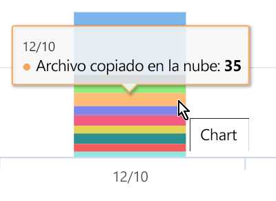
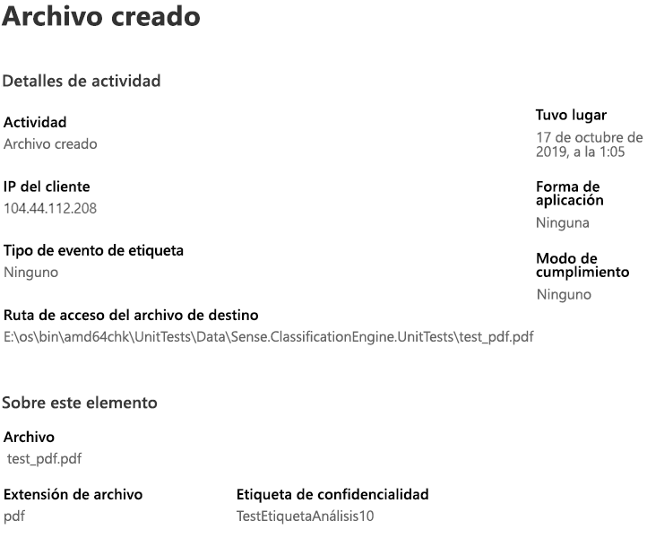

# Ver la actividad en el contenido de la etiqueta (vista previa)

La descripción general de la clasificación de datos y las pestañas del explorador de contenido le ofrecen visibilidad sobre el contenido que se ha descubierto y etiquetado, y dónde está ese contenido. El explorador de actividad complementa este conjunto de funciones permitiéndole supervisar lo que se lleva a cabo con el contenido de la etiqueta. El explorador de actividad ofrece una vista histórica.

Puede filtrar los datos de la siguiente forma:

- Intervalo de fechas:
- TIPO DE ACTIVIDAD
- Ubicación
- Usuario
- Etiqueta de confidencialidad
- Etiqueta de retención:

Puede ver los datos como una lista o un gráfico de barras.

## Requisitos previos

Todas las cuentas que tienen acceso al explorador de actividad y lo usan deben tener una licencia de asignada de una de estas suscripciones:

- Microsoft 365 (E5)
- Office 365 (E5)
- Complemento de cumplimiento avanzado (E5)
- Complemento de inteligencia de amenazas avanzado (E5)

## Tipo de actividad

Microsoft 365 supervisa y realiza un seguimiento de los 12 tipos de actividades en SharePoint Online, OneDrive y los puntos de conexión. Los puntos de conexión son dispositivos de usuario que ejecutan Windows 10.

- Archivo creado
- Archivo modificado
- Archivo con el nombre cambiado
- Archivo copiado en la nube
- Archivo al que se ha accedido mediante una aplicación no permitida
- Archivo impreso
- Archivo copiado en un medio extraíble
- Archivo copiado al recurso compartido de red
- Archivo leído
- archivo copiado en el portapapeles
- Etiqueta aplicada
- Etiqueta cambiada (actualizada, degradada o eliminada)

El valor de comprensión de las acciones que se toman con el contenido identificado por la etiqueta es que puede ver si los controles que ya se han puesto en su sitio, como [Directivas de prevención de pérdida de datos](data-loss-prevention-policies.md) son efectivas o no. Si no es así, o si se detecta algo inesperado, como un gran número de elementos etiquetados `highly confidential`y se degradan`general`, puede administrar las distintas directivas y llevar a cabo nuevas acciones para restringir el comportamiento no deseado.

Una vez que haya establecido los filtros, puede:

- Mantenga el mouse sobre un segmento del gráfico de barras para ver el número de elementos que se encuentran en la categoría 
- Exportar los datos
- seleccionar un elemento determinado de la lista y ver los detalles de la acción en el menú desplegable

## Vea también
- [Etiquetas de confidencialidad](sensitivity-labels.md)
- [Etiquetas de retención](labels.md)
- [Qué buscan los tipos de información confidencial](what-the-sensitive-information-types-look-for.md)
- [Información general sobre las directivas de retención](retention-policies.md)
