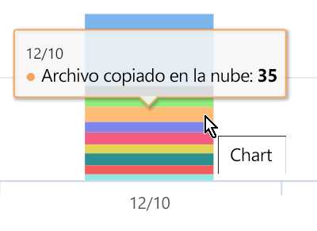

# Ver la actividad en el contenido de la etiqueta (vista previa)View activity on your labeled content (preview)

La descripción general de la clasificación de datos y las pestañas del explorador de contenido le ofrecen visibilidad sobre el contenido que se ha descubierto y etiquetado, y dónde está ese contenido.The data classification overview and content explorer tabs give you visibility into what content has been discovered and labeled, and where that content is. El explorador de actividad complementa este conjunto de funciones permitiéndole supervisar lo que se lleva a cabo con el contenido de la etiqueta.Activity explorer rounds out this suite of functionality by allowing you to monitor what's being done with your labeled content. El explorador de actividad ofrece una vista histórica.Activity explorer provides a historical view.

Puede filtrar los datos de la siguiente forma:You can filter the data by:

- Intervalo de fechas:date range
- TIPO DE ACTIVIDADactivity type
- Ubicaciónlocation
- Usuariouser
- Etiqueta de confidencialidadsensitivity label
- Etiqueta de retención:retention label

Puede ver los datos como una lista o un gráfico de barras.You can view the data either as a list or a bar graph.

## Requisitos previosPrerequisites

Todas las cuentas que tienen acceso al explorador de actividad y lo usan deben tener una licencia de asignada de una de estas suscripciones:Every account that accesses and uses activity explorer must have a license assigned to it from one of these subscriptions:

- Microsoft 365 (E5)Microsoft 365 E5
- Office 365 (E5)Office 365 E5
- Complemento de cumplimiento avanzado (E5)Advanced Compliance (E5) add-on
- Complemento de inteligencia de amenazas avanzado (E5)Advanced Threat Intelligence (E5) add-on
- Complemento de protección contra amenazas avanzado (E5)Advanced Threat Protection (E5) add-on

## Tipo de actividadActivity type

Microsoft 365 supervisa y realiza un seguimiento de los 12 tipos de actividades en SharePoint Online, OneDrive y los puntos de conexión.Microsoft 365 monitors and reports on 12 types of activities across SharePoint Online, OneDrive and endpoints. Los puntos de conexión son dispositivos de usuario que ejecutan Windows 10.Endpoints are user devices running Windows 10.

- Archivo creadoFile created
- Archivo modificadoFile modified
- Archivo con el nombre cambiadoFile renamed
- Archivo copiado en la nubeFile copied to cloud
- Archivo al que se ha accedido mediante una aplicación no permitidaFile accessed by unallowed app
- Archivo impresoFile printed
- Archivo copiado en un medio extraíbleFile copied to removable media
- Archivo copiado al recurso compartido de redFile copied to network share
- Archivo leídoFile read
- archivo copiado en el portapapelesfile copied to clipboard
- Etiqueta aplicadaLabel applied
- Etiqueta cambiada (actualizada, degradada o eliminada)Label changed (upgraded, downgraded, or removed)

El valor de comprensión de las acciones que se toman con el contenido identificado por la etiqueta es que puede ver si los controles que ya se han puesto en su sitio, como [Directivas de prevención de pérdida de datos](data-loss-prevention-policies.md) son efectivas o no.The value of understanding what actions are being taken with your sensitive labeled content is that you can see if the controls that you have already put into place, such as [data loss prevention policies](data-loss-prevention-policies.md) are effective or not. Si no es así, o si se detecta algo inesperado, como un gran número de elementos etiquetados `highly confidential`y se degradan`general`, puede administrar las distintas directivas y llevar a cabo nuevas acciones para restringir el comportamiento no deseado.If not, or if you discover something unexpected, such as a large number of items that are labeled `highly confidential` and are downgraded `general`, you can manage your various policies and take new actions to restrict the undesired behavior.

Una vez que haya establecido los filtros, puede:Once your filters are set, you can:

- Mantenga el mouse sobre un segmento del gráfico de barras para ver el número de elementos que se encuentran en la categoría hover over a segment of the bar chart to see the number of items that fall into that category 
- Exportar los datosexport the data
- seleccionar un elemento determinado de la lista y ver los detalles de la acción en el menú desplegableselect any given item from the list and view the details of the action in the fly-out

## Vea tambiénSee also
- [Etiquetas de confidencialidadSensitivity labels](sensitivity-labels.md)
- [Etiquetas de retenciónRetention labels](labels.md)
- [Qué buscan los tipos de información confidencialWhat the sensitive information types look for](what-the-sensitive-information-types-look-for.md)
- [Información general sobre las directivas de retenciónOverview of retention policies](retention-policies.md)